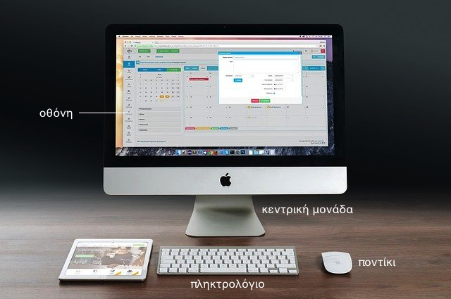
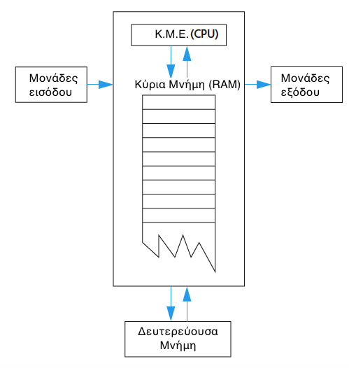
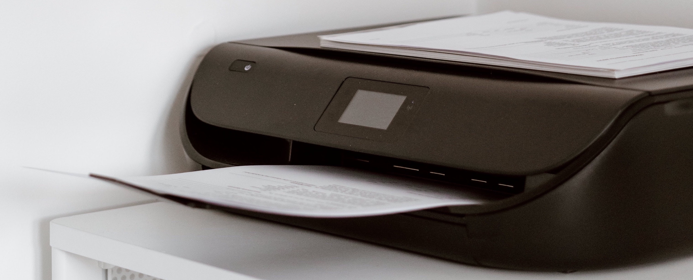
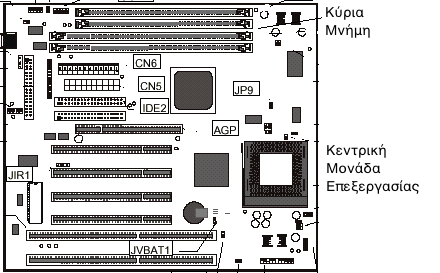
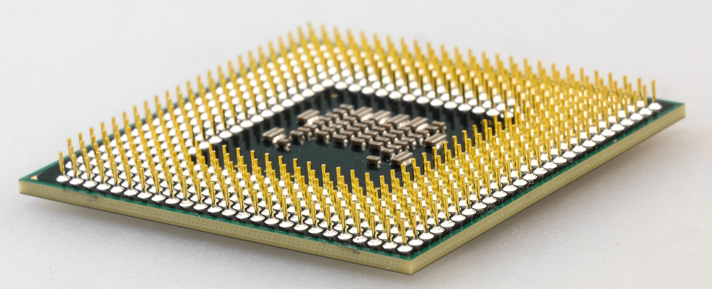
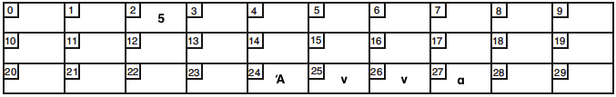
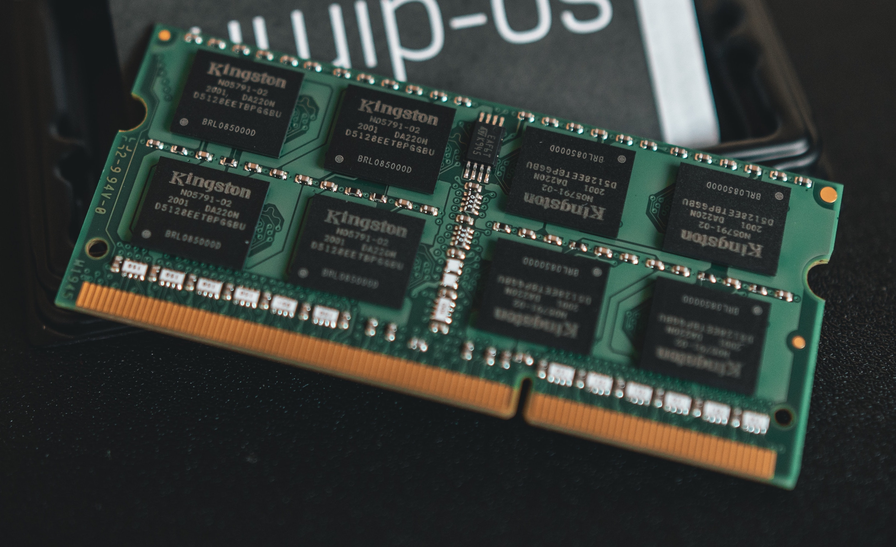

# 1.1 Εισαγωγή στους Η/Υ
© Γιάννης Κωστάρας

---

[Δ](../../README.md)  | [->](../1.2-Algorithm/README.md)

---

[](1.1-Introduction.ipynb)

_Στο μάθημα 1.4 θα μάθουμε πώς να εγκαταστήσουμε το Jupyter Lab ώστε να μπορούμε να ανοίγουμε αρχεία ```.ipynb```. Μέχρι τότε, μπορείτε να τα ανοίξετε στο [Colab](https://colab.research.google.com/) και επιλέγοντας **Upload**. Δυστυχώς δεν υποστηρίζει Java αλλά θα μπορέσετε να διαβάσετε το αρχείο._

### Μαθησιακοί στόχοι
Σε αυτήν την ενότητα θα μάθουμε:

* την ιστορία των Η/Υ
* το υλικό (hardware) και το λογισμικό (software) των Η/Υ

## Εισαγωγή

Πάνε πάνω από 80 χρόνια από την εποχή που λειτούργησε ο πρώτος ηλεκτρονικός υπολογιστής, [Mark I](https://www.startpage.com/av/proxy-image?piurl=https%3A%2F%2Fi.ytimg.com%2Fvi%2FbN7AdQmd8So%2Fmaxresdefault.jpg&sp=1607181033T6217eb4cbb0ef4c37204d55637b9039d2af369302bf735ee8cc6cfc36b774d6a), το 1942 στο πανεπιστήμιο του Χάρβαρντ. Ζύγιζε 5 τόνους και πολλαπλασίαζε δυο αριθμούς με 23 ψηφία σε 6 δευτερόλεπτα. Έκτοτε, η πρόοδος που έχει συντελεστεί στον τομέα των υπολογιστών είναι μοναδική κυρίως μετά την ανακάλυψη των τρανζίστορς και των ολοκληρωμένων κυκλωμάτων. Σήμερα διανύουμε την τέταρτη γενιά υπολογιστών ή μάλλον την πέμπτη; Η πέμπτη γενιά θα χαρακτηρίζεται από υπολογιστές ικανούς με «σκέψη» που θα μπορούν μόνοι τους να βρίσκουν λύση γρήγορα στα διάφορα προβλήματα, να παίρνουν αποφάσεις και να συμπεριφέρονται όπως οι άνθρωποι. Είναι η γενιά της [τεχνικής νοημοσύνης (Artificial Intelligence)](https://www.europarl.europa.eu/news/el/headlines/society/20200827STO85804/ti-einai-i-techniti-noimosuni-kai-pos-chrisimopoieitai) και της Μηχανικής Μάθησης (machine learning) στην οποία δουλεύουν επιστήμονες πληροφορικής σε όλον τον κόσμο! Εφαρμογές αυτής της νέας τεχνολογίας έχουν ήδη μπει στην καθημερινότητά μας, από τα αυτόνομα αυτοκίνητα μέχρι την επεξεργασία της φυσικής γλώσσας.

   **Το γνωρίζατε;** Ο πρώτος υπολογιστής ήταν ο [μηχανισμός των Αντικυθήρων](https://el.wikipedia.org/wiki/%CE%9C%CE%B7%CF%87%CE%B1%CE%BD%CE%B9%CF%83%CE%BC%CF%8C%CF%82_%CF%84%CF%89%CE%BD_%CE%91%CE%BD%CF%84%CE%B9%CE%BA%CF%85%CE%B8%CE%AE%CF%81%CF%89%CE%BD). Ονομάζεται και _αστρολάβος_ καθώς υπολογίζει με ακρίβεια τη θέση του ήλιου και της σελήνης καθώς και τις φάσεις της και προβλέπει ακόμη και σήμερα σωστά τις εκλείψεις ηλίου και σελήνης βασιζόμενος στον κύκλο του Σάρου. Σε αντίθεση με τους σημερινούς ηλεκτρονικούς υπολογιστές, είναι ένας αναλογικός, μηχανικός υπολογιστής και όργανο αστρονομικών παρατηρήσεων και παρουσιάζει ομοιότητες με πολύπλοκο ωρολογιακό μηχανισμό.
   
   

Με τον όρο _επιστήμη της Πληροφορικής_ εννοούμε την επιστήμη που έχει ως αντικείμενο τη συλλογή, αποθήκευση, επεξεργασία και μετάδοση πληροφοριών με τη βοήθεια ηλεκτρονικού υπολογιστή (Η/Υ). Η πληροφορία είναι το αποτέλεσμα της επεξεργασίας άλλων στοιχειωδών πληροφοριών, που οι τιμές τους αποτελούν τα _δεδομένα_ αυτής της επεξεργασίας.

Οι ηλεκτρονικοί υπολογιστές (Η/Υ) είναι το βασικό εργαλείο της επιστήμης της πληροφορικής. Ο ηλεκτρονικός υπολογιστής (Η/Υ) αποτελείται από το _υλικό_ (ή _hardware_) και το _λογισμικό_ (ή _software_). Το _υλικό_ αποτελεί τις διάφορες συσκευές, μηχανικά και ηλεκτρονικά μέρη που αποτελούν έναν Η/Υ, όπως π.χ. η οθόνη, το πληκτρολόγιο, ο επεξεργαστής, ο εκτυπωτής κλπ. Το _λογισμικό_ αποτελεί τα διάφορα προγράμματα, δεδομένα και εφαρμογές που τρέχουν σε έναν Η/Υ. Ένας Η/Υ χωρίς προγράμματα δεν μας είναι χρήσιμος ούτε και τα προγράμματα από μόνα τους χωρίς έναν Η/Υ που να μπορεί να τα εκτελέσει. Μπορείτε να δείτε [εδώ](https://photodentro.edu.gr/v/item/ds/8521/940) τις διάφορες κατηγορίες Η/Υ.

Οι Η/Υ είναι παντού. Μπορείτε να επιλέξετε τις συσκευές που χρησιμοποιούν Η/Υ και κατά συνέπεια προγράμματα στην παρακάτω εικόνα;


## Το υλικό του Η/Υ
Στην εικόνα 1.1.1 φαίνεται ένας σύγχρονος Η/Υ. Όπως βλέπουμε, το εξωτερικό μέρος ενός Η/Υ αποτελείται από την οθόνη, την κεντρική μονάδα, το πληκτρολόγιο και το ποντίκι. 



**Εικόνα 1.1.1** _Ηλεκτρονικός Υπολογιστής (PC)_ 

Σχεδιαστικά το υλικό του Η/Υ αποτελείται από τις εξής πέντε μονάδες (βλ. Εικόνα 1.1.2):  
 
• Τις μονάδες εισόδου
• Τις μονάδες εξόδου
• Την κεντρική μονάδα επεξεργασίας (Κ.Μ.Ε. ή Central Processing Unit - CPU)
• Την κύρια μνήμη
• Τις δευτερεύουσες μνήμες, ή μονάδες εισόδου/εξόδου
	


**Εικόνα 1.1.2** _Συνοπτικό διάγραμμα Η/Υ_ 

Η Κ.Μ.Ε., η κύρια μνήμη και οι δευτερεύουσες μνήμες συνήθως είναι ενσωματωμένες στο "κουτί" (ή θήκη) του Η/Υ, η οποία καλείται και κεντρική μονάδα ή μονάδα συστήματος. 

### Εξωτερικό μέρος του Η/Υ
Η κεντρική μονάδα ή μονάδα συστήματος (ή θήκη) αποτελεί το σπουδαιότερο μέρος του Η/Υ καθώς περιέχει τα σημαντικότερα εξαρτήματα λειτουργίας του και κάθε εξωτερική συσκευή συνδέεται στις υποδοχές της μονάδας συστήματος. Οι περιφερειακές συσκευές, δηλαδή οι συσκευές που συνδέονται με την Κεντρική Μονάδα, χωρίζονται σε _συσκευές (μονάδες) εισόδου_ και σε _συσκευές (μονάδες) εξόδου_ και χρησιμοποιούνται για να επικοινωνούμε με τον Η/Υ. 

Μια μονάδα εισόδου επιτρέπει την εισαγωγή δεδομένων στον Η/Υ. Παραδείγματα μονάδων εισόδου αποτελούν: 

* το _πληκτρολόγιο_ (βλ. Εικόνα 1.1.1), το οποίο «κατάγεται» από τη γραφομηχανή (έχει τη μορφή QWERTY) και με τη βοήθεια του οποίου μπορούμε να δακτυλογραφήσουμε κείμενο, ή να δώσουμε εντολές στον Η/Υ. Ένα σύγχρονο πληκτρολόγιο έχει τουλάχιστο 101 πλήκτρα, τα οποία περιλαμβάνουν τα γράμματα της αγγλικής (και ελληνικής αλφαβήτου) με τα σημεία στίξης, τα αριθμητικά ψηφία 0-9, τα λειτουργικά πλήκτρα F1-F12 και κάποια άλλα βοηθητικά πλήκτρα (π.χ. ```Ctrl, Alt, Shift, Caps Lock``` κλπ.).
* το _χειριστήριο_ ή _ποντίκι_ (βλ. Εικόνα 1.1.1), το οποίο ελέγχει την κίνηση του δείκτη της οθόνης και την αλληλεπίδραση μας με τα διάφορα προγράμματα. Διαθέτει δυο ή τρία πλήκτρα. Οι φορητοί Η/Υ ή laptops διαθέτουν μια μικρή επιφάνεια αφής (touchpad) που κάνει την ίδια δουλειά. Με τις οθόνες αφής, το ποντίκι δε θεωρείται πλέον απαραίτητο.
* το _μικρόφωνο_, το οποίο μας επιτρέπει να εισάγουμε φωνή ή άλλα ηχητικά εφέ, να τ’ αποθηκεύουμε σαν αρχεία στον Η/Υ και να μπορούμε να τ’ αναπαράγουμε αργότερα από τα ηχεία. Το μικρόφωνο συνδέεται στην κάρτα ήχου και μετατρέπει τα ηχητικά κύματα σε δυαδικούς αριθμούς που καταλαβαίνει ο Η/Υ και μπορεί να αποθηκεύσει και ν’ αναπαράγει.
* το _χειριστήριο παιχνιδιών_ ή _joystick_, το οποίο μοιάζει με πηδάλιο ελέγχου αεροπλάνου και το οποίο χρησιμοποιείται στα παιχνίδια.
* ο _σαρωτής (scanner)_, ο οποίος μας επιτρέπει να εισάγουμε κείμενο ή εικόνες από το χαρτί σε ηλεκτρονική μορφή στον Η/Υ. Χρησιμοποιεί ένα πρόγραμμα οπτικής ανάγνωσης χαρακτήρων (OCR – Optical Character Recognition) που έχει τη δυνατότητα να αναγνωρίζει κείμενο και να το μετατρέπει σε ηλεκτρονική μορφή.
* Η _ψηφιακή βιντεοκάμερα_, με τη βοήθεια της οποίας μπορούμε να εισάγουμε κινούμενη εικόνα (βίντεο) στον Η/Υ για περαιτέρω επεξεργασία ή αποθήκευση.

Άλλες μονάδες εισόδου περιλαμβάνουν: την _ιχνόσφαιρα (trackball)_, τη _φωτογραφίδα (light pen)_, τον _οπτικό αναγνώστη χαρακτήρων (light pen)_, τον _αναγνώστη γραμμωτού κώδικα (bar code reader)_ κ.ά.

Μια μονάδα εξόδου εμφανίζει αποτελέσματα στους χρήστες. Παραδείγματα μονάδων εξόδου αποτελούν: 

* η _οθόνη_ (βλ. Εικόνα 1.1.1), η οποία μοιάζει με την οθόνη της τηλεόρασης αλλά απεικονίζει κείμενο και εικόνες με μεγαλύτερη πιστότητα και ευκρίνεια από αυτήν. Χαρακτηριστικό της ευκρίνειας μιας οθόνης είναι η ανάλυσή της η οποία μετριέται σε pixels (ή picture elements ή εικονοστοιχεία). Τυπικές αναλύσεις μιας σύγχρονης οθόνης είναι 1920x1080 ή 2560x1440 pixels. Επισκεφθείτε [αυτήν την διαδραστική ιστοσελίδα](https://photodentro.edu.gr/v/item/ds/8521/717) για να δείτε πώς αλλάζει η ανάλυση της οθόνης του Η/Υ.
* ο _εκτυπωτής_ (βλ. Σχήμα 1.1.3), o οποίος μας επιτρέπει να εκτυπώνουμε κείμενα ή φωτογραφίες σε χαρτί. Υπάρχουν έγχρωμοι και ασπρόμαυροι εκτυπωτές. Επίσης διακρίνονται σε εκτυπωτές _ακίδας (dot matrix)_, χρήσιμοι για εκτύπωση τιμολογίων αλλά όχι για εικόνες, σε εκτυπωτές _έγχυσης μελάνης (inkjet)_, οι οποίοι είναι ιδανικοί για το σπίτι και εκτυπώνουν τόσο κείμενο όσο και εικόνα, και σε εκτυπωτές _laser_ για εκτυπώσεις υψηλής ποιότητας. Χαρακτηριστικό της ποιότητας εκτύπωσης είναι η μονάδα dpi ή dots per inch (αντίστοιχη της μονάδας pixel για την οθόνη). Τυπικές τιμές dpi σύγχρονων εκτυπωτών είναι 75, 150, 200, 300, 600, 1200. Σήμερα υπάρχουν τα λεγόμενα πολυμηχανήματα τα οποία συνδυάζουν τις λειτουργίες της εκτύπωσης, της σάρωσης αλλά και του φωτοτυπικού μηχανήματος. Οι _σχεδιογράφοι (plotters)_ παράγουν εκτυπώσεις που αποτελούνται από συνεχείς γραμμές ή καμπύλες.



**Εικόνα 1.1.3** _Εκτυπωτής_ 

* τα ηχεία, τα οποία μας δίνουν τη δυνατότητα να ακούμε ήχο και μουσική από τον Η/Υ μας. Μοιάζουν με τα ηχεία του στερεοφωνικού αλλά έχουν δικό τους ενισχυτή. Συνδέονται κι αυτά, όπως και το μικρόφωνο, στην κάρτα ήχου του Η/Υ. Οι σύγχρονοι Η/Υ διαθέτουν ενσωματωμένα ηχεία.

Επισκεφθείτε [αυτήν την ιστοσελίδα](https://photodentro.edu.gr/v/item/ds/8521/958) για μια διαδραστική απεικόνιση του υλικού ενός Η/Υ.
	
### Εσωτερικό μέρος του Η/Υ

Όπως είπαμε προηγούμενα, μέσα στην μονάδα συστήματος βρίσκονται τα βασικά εξαρτήματα λειτουργίας του Η/Υ.

Το βασικότερο ίσως εξάρτημα που βρίσκεται στη μονάδα συστήματος ενός Η/Υ είναι η _μητρική πλακέτα (motherboard)_ (Εικόνα 1.1.4). Η μητρική πλακέτα είναι το μεγαλύτερο κύκλωμα που διαθέτει ο Η/Υ μας. Πάνω σ’ αυτήν συνδέονται τα υπόλοιπα εξαρτήματα του Η/Υ για να δουλέψουν. Όπως φαίνεται στην Εικόνα 1.1.4, έχει μια σειρά από υποδοχές πάνω στις οποίες συνδέονται ο επεξεργαστής (η κεντρική μονάδα επεξεργασίας – Κ.Μ.Ε. ή CPU), η κύρια μνήμη, οι κάρτες επέκτασης κλπ. Μάθετε περισσότερα [εδώ](https://photodentro.edu.gr/v/item/ds/8521/954).



**Εικόνα 1.1.4** _Μητρική πλακέτα (motherboard)_ 

Η _κεντρική μονάδα επεξεργασίας (Κ.Μ.Ε.)_ ή _επεξεργαστής_ (βλ. Εικόνα 1.1.5), είναι ο εγκέφαλος του Η/Υ, ο οποίος επεξεργάζεται τις διάφορες εντολές που του δίνουμε μέσω των προγραμμάτων και παράγει κάποιο(α) αποτέλε(έ)σμα(τα). Χαρακτηριστικό ενός επεξεργαστή είναι η ταχύτητά του η οποία μετριέται σε _Hertz (Hz)_ και τα πολλαπλάσιά του (MegaHertz – MHz και GigaHertz – GHz). Τυπικές ταχύτητες των επεξεργαστών σήμερα είναι: 1.2 GHz, 1,5 GHz, 2 GHz, 2.4 GHz κλπ. Μάθετε περισσότερα [εδώ](https://photodentro.edu.gr/v/item/ds/8521/713). Οι δυο πιο γνωστές εταιρίες κατασκευής μικροεπεξεργαστών είναι η [Intel](https://en.wikipedia.org/wiki/List_of_Intel_processors), με τις σειρές i3, i5 και i7, και η [AMD](https://en.wikipedia.org/wiki/List_of_AMD_processors) με τις σειρές Zen.



**Εικόνα 1.1.5** _Κεντρική Μονάδα Επεξεργασίας (Κ.Μ.Ε.)_ 

H _κύρια μνήμη_ η οποία είναι μια ταχύτατη μονάδα που αποθηκεύει προσωρινά (δηλ. όσο ο Η/Υ είναι τροφοδοτείται με ηλεκτρικό ρεύμα) δεδομένα που χρειάζεται ο επεξεργαστής στους υπολογισμούς του. Γενικά, για να γίνουν κάποιοι υπολογισμοί θα πρέπει τα δεδομένα να φορτωθούν πρώτα στη μνήμη. Η κύρια μνήμη ονομάζεται αλλοιώς και _RAM (Random Access Memory)_ δηλ. _μνήμη τυχαίας προσπέλασης δεδομένων_ στην οποία μπορούμε να γράφουμε και να διαβάζουμε δεδομένα. Η χωρητικότητα της μνήμης μετράται σε _bytes_ (βλ. και παρακάτω για τον ορισμό του byte) και τα πολλαπλάσιά του. Οι χωρητικότητες της κεντρικής μνήμης ενός _προσωπικού υπολογιστή_ σήμερα ξεκινούν από τα 4 Gigabytes (GB) και φτάνουν μέχρι και τα 32 GB.

Ο Η/Υ καταλαβαίνει δύο μόνο καταστάσεις (δες και [εδώ](https://photodentro.edu.gr/v/item/ds/8521/1008)): 

* ```0``` Ανοιχτό κύκλωμα, δεν περνάει ρεύμα
* ```1``` Κλειστό κύκλωμα, περνάει ρεύμα

Καθεμία από αυτές τις δύο καταστάσεις ονομάζεται δυαδικό στοιχείο (binary digit) ή bit. Ένα σύνολο από 8 bits στη σειρά αποτελούν ένα byte. Υπάρχουν 2&sup;8 = 256 διαφορετικοί συνδυασμοί των 8 bits με τους οποίους μπορούμε να κωδικοποιήσουμε μέχρι 256 διαφορετικά ψηφία ή χαρακτήρες. Με αυτόν τον τρόπο ο Η/Υ μπορεί να αναπαραστήσει όλα τα γράμματα του Ελληνικού και Λατινικού αλφαβήτου, τα αριθμητικά ψηφία και διάφορους ειδικούς χαρακτήρες. Το byte, επομένως, είναι μονάδα αποθήκευσης δεδομένων. Πολλαπλάσια του byte αποτελούν:

* 1 Kilobyte (Κb) = 1024 bytes
* 1 Megabyte (Mb) = 1024 Kb 
* 1 Gigabyte (Gb) = 1024 Mb
* 1 Terabyte (Tb) = 1024 Gb

Φανταστείτε τη κύρια μνήμη ως ένα γραμματοκιβώτιο (βλ. Εικόνα 1.1.6) όπου σε κάθε θέση του αποθηκεύεται και μια τιμή ή λέξη. Κάθε θέση μνήμης χαρακτηρίζεται από τη _διεύθυνσή_ της (τα νούμερα που βλέπετε στην άνω αριστερή γωνία σε κάθε θυρίδα) και συνήθως αναπαρίσταται σε δεκαεξαδική μορφή. 



**Εικόνα 1.1.6** _Γραμματοκιβώτιο_ 

Εκτός από την κύρια μνήμη υπάρχουν και δευτερεύουσες μνήμες (βλ. Εικόνα 1.1.2) οι οποίες ονομάζονται και μονάδες εισόδου/εξόδου. Σε αυτές μπορούμε και να γράφουμε και να διαβάζουμε δεδομένα. Παραδείγματα μονάδων εισόδου/εξόδου αποτελούν ο _σκληρός δίσκος (hard disk drive)_, ο _δίσκος [SSD](https://en.wikipedia.org/wiki/Solid-state_drive)_, η _μονάδα ή οδηγός οπτικού δίσκου DVD (ή DVD-ROM drive)_, η _μονάδα ή στικ USB_, η _SD κάρτα_ κ.ά. Σ' αυτές αποθηκεύουμε αρχεία μέσα σε φακέλους.

Ο _σκληρός δίσκος (hard disk drive – Εικόνα 1.1.7)_ είναι το κυριότερο αποθηκευτικό μέσο ενός σύγχρονου Η/Υ. Διακρίνεται από μεγάλη χωρητικότητα και μεγάλη ταχύτητα προσπέλασης δεδομένων. Οι χωρητικότητες των σκληρών δίσκων που κυκλοφορούν στην αγορά σήμερα ξεκινούν από τα 500 Gb και φτάνουν έως και τα 8 Tb. Ένας σκληρός δίσκος (Hard Disk Drive) μπορεί να αποθηκεύει μεγάλες ποσότητες δεδομένων και είναι ταχύτερος από οποιαδήποτε μονάδα USB ή κάρτας SD. Είναι όμως σταθερός μέσα στην μονάδα του υπολογιστή και δύσκολο να μεταφερθεί από Η/Υ σε Η/Υ. Αντιθέτως, η κάρτα SD, ή ο οπτικός δίσκος DVD αν κι έχουν μικρότερη χωρητικότητα έχουν το πλεονέκτημα της φορητότητας. Ο εξωτερικός σκληρός δίσκος ή δίσκος SSD συνδέεται μέσω θύρας USB, έχει ίδια ή και μεγαλύτερη χωρητικότητα από τον εσωτερικό δίσκο, αλλά η μεταφορά δεδομένων προς/από είναι μικρότερη από τον εσωτερικό δίσκο λόγω της επικοινωνίας μέσω του πρωτοκόλλου USB.



**Εικόνα 1.1.7** _Σκληρός δίσκος_ 
 
Οι δίσκοι (ή πιο σωστά συσκευές) στερεάς κατάστασης (Solid State Device ή SSD) χρησιμοποιούν ένα είδος μόνιμης μνήμης (flash memory) για την αποθήκευση των δεδομένων κι έτσι δεν χρησιμοποιούν μηχανικά μέρη όπως οι σκληροί δίσκοι, με αποτέλεσμα πιο γρήγορη ανάκτηση/αποθήκευση δεδομένων σ' αυτούς. Οι χωρητικότητές τους ξεκινούν από τα 128 Gb και ξεπερνούν πλέον τα 4 TB.

Η βασική διαφορά και ο λόγος ύπαρξης του σκληρού/SSD δίσκου (και των άλλων δευτερεύουσων μνημών) από την κύρια μνήμη είναι ότι τα περιεχόμενα της μνήμης χάνονται μόλις σβήσουμε τον Η/Υ. Αντιθέτως, τα περιεχόμενα ενός σκληρού δίσκου (και των άλλων δευτερεύουσων μνημών) παραμένουν για όσο καιρό θέλουμε, ακόμα κι όταν ο Η/Υ δεν τροφοδοτείται με ηλεκτρικό ρεύμα, μέχρις ότου να τα σβήσουμε εμείς όταν δεν τα χρειαζόμαστε πλέον. Γι' αυτό είναι σημαντικό να αποθηκεύουμε συχνά τις αλλαγές μας στα αρχεία και τα έγγραφά μας.

Στη μητρική πλακέτα ενσωματώνονται και οι λεγόμενες εσωτερικές κάρτες, όπως:

* κάρτα γραφικών
* κάρτα ήχου
* κάρτα δικτύου

για τις οποίες μπορείτε να μάθετε περισσότερα [εδώ](https://photodentro.edu.gr/v/item/ds/8521/1215).

## Το λογισμικό του Η/Υ

Όπως είπαμε στην αρχή αυτών των σημειώσεων, ένας Η/Υ είναι ένας συνδυασμός υλικού και λογισμικού. Το λογισμικό ενός Η/Υ κατατάσσεται σε τρεις γενικές κατηγορίες:

1. Το _λογισμικό συστήματος_ είναι προγράμματα υποστήριξης που επιτρέπουν την πλήρη αξιοποίηση του υλικού και του λογισμικού του Η/Υ. Παραδείγματα λογισμικού συστήματος αποτελούν:
   * το _λειτουργικό σύστημα (Λ.Σ.)_ (όπως τα Windows, το Linux, το MacOS, το DOS κλπ.). Το Λ.Σ. είναι μια συλλογή από προγράμματα συστημάτων που ελέγχουν και συντονίζουν τη λειτουργία ενός Η/Υ. Τα προγράμματα αυτά λειτουργούν σαν η διασύνδεση ανάμεσα στο υλικό και στα προγράμματα εφαρμογών. Το Λ.Σ. διευθύνει τα εξαρτήματα του Η/Υ, όπως π.χ. την κύρια μνήμη, την Κ.Μ.Ε., το σκληρό δίσκο, την οθόνη καθώς και την εκκίνηση του Η/Υ, τη διαχείριση αρχείων κλπ. Τα Λ.Σ. διακρίνονται σε _απλού χρήστη (single user)_ για χρήση στους μικροϋπολογιστές και σε _πολυχρηστικά (multi user)_ που εξυπηρετούν περισσότερους του ενός χρήστες. Τα σύγχρονα Λ.Σ. (όπως τα Windows, Linux, MacOS) πέραν από τη γραμμή εντολών (όπως το DOS) διαθέτουν και ένα γραφικό περιβάλλον εργασίας (Graphical User Interface - GUI) για την αλληλεπίδρασή τους με το χρήστη. Η εγκυκλοπαίδεια Britannica ορίζει το γραφικό περιβάλλον επεξεργασίας ως ένα πρόγραμμα που δίνει τη δυνατότητα στο χρήστη να επικοινωνεί με τον Η/Υ με τη βοήθεια συμβόλων, εικονιδίων και δεικτικών συσκευών (pointing devices). Τα γραφικά περιβάλλοντα έκαναν τη χρήση των Η/Υ ευκολότερη στην εκμάθηση και πιο ευχάριστη. Τα διάφορα συστατικά τους (εικονίδια, μενού κλπ.) είναι πλέον μέρος της κουλτούρας μας.
    * οι _μεταγλωτιστές/μεταφραστές_ (compilers/interpreters) που μεταφράζουν τα προγράμματα του χρήστη, γραμμένα σε μια γλώσσα προγραμματισμού, σε γλώσσα μηχανής (δηλ. 0 και 1) που «καταλαβαίνει» ο Η/Υ.
    * άλλες υπο-κατηγορίες προγραμμάτων συστήματος περιλαμβάνουν: βοηθητικά προγράμματα γενικής χρήσης (utilities), διορθωτές λαθών προγραμμάτων (debuggers), βιβλιοθήκες προγραμμάτων (libraries) και προγράμματα σύνδεσης (linkers).
2.  Το λογισμικό εφαρμογών εκτελεί τις εργασίες για τις οποίες αγοράζεται ο Η/Υ, όπως π.χ.
    * επεξεργαστές κειμένου (π.χ. Microsoft Word, Microsoft Wordpad, LibreOffice Writer, Pages κλπ.)
    * λογιστικά φύλλα (π.χ. Microsoft Excel, LibreOffice Calc, Numbers κλπ.)
    * συστήματα διαχείρισης βάσεων δεδομένων (π.χ. Microsoft Access, MySQL, Microsoft SQL Server, SQLite, Oracle, Postgresql, κλπ.)
    * γλώσσες προγραμματισμού (π.χ. BASIC, PASCAL, LOGO, C/C++, C#, JAVA, Python, Go, Groovy, Scala, Ruby, Rust κλπ.)
    * μαθηματικά πακέτα (π.χ. Matlab, Scilab, Mathematica κλπ.)
	* βιντεοπαιχνίδια
3.  Τα προγράμματα και τα αρχεία του χρήστη τα οποία παράγει με τη βοήθεια μιας γλώσσας προγραμματισμού ή κάποιου από τα προγράμματα εφαρμογών. Σ' αυτή τη σειρά μαθημάτων θα μάθουμε να δημιουργούμε τα δικά μας προγράμματα στη γλώσσα προγραμματισμού Java.

Μάθετε περισσότερα για τις κατηγορίες λογισμικού [εδώ](https://photodentro.edu.gr/v/item/ds/8521/1005).

Ο Η/Υ επεξεργάζεται τα δεδομένα ως εξής (βλ. και Σχήμα 1.1.2). Δεδομένα και πρόγραμμα (εντολές) εισάγονται από τη μονάδα εισόδου (ή τη δευτερεύουσα μνήμη) και αποθηκεύονται στην κύρια μνήμη του Η/Υ. Στη συνέχεια μία-μία εντολή μεταφέρεται από την κύρια μνήμη στην Κ.Μ.Ε. μαζί με τα απαιτούμενα δεδομένα, εκτελείται από την Κ.Μ.Ε. και το αποτέλεσμα αποθηκεύεται πίσω στην κύρια μνήμη. Το τελικό αποτέλεσμα μεταφέρεται από την κύρια μνήμη στη δευτερεύουσα μνήμη ή μονάδα εξόδου. Οι εντολές που εκτελεί φορτώνονται από το πρόγραμμα που εκτελείται εκείνη τη στιγμή, όπως αυτά που θα μάθουμε σ' αυτό το μάθημα. Μάθετε περισσότερα [εδώ](https://photodentro.edu.gr/v/item/ds/8521/1006). Για τα προγράμματα που θα αναπτύξουμε θα χρειαστούμε ακόμα το πληκτρολόγιο και το ποντίκι, ως μονάδες εισόδου, και την οθόνη, ως μονάδα εξόδου. 

## Πηγές
1. Αλεξανδρής Ν., Κωστάκος Α., Στεργιοπούλου-Καλαντζή Λ., _Πληροφορική Γ’ Γυμνασίου_, τ. Α’ & Β’, 1993.
1. Γιαλούρης Κ., Γκιμπερίτης Ε., Κόμης Β., Σιδερίδης Α., Σταθόπουλος Κ., _Εφαρμογές Πληροφορικής και Η/Υ Γενικού Λυκείου_, ΟΑΕΔ, 2000.
1. Παιδαγωγικό Ινστιτούτο, «Το σχολικό εργαστήριο πληροφορικής», http://www.pi-schools.gr/greek/epps/but5.htm.
1. Τσουροπλής Α.Γ., Κλημόπουλος Σ.Κ., _Εισαγωγή στην Πληροφορική_, Αθήνα: 1990.
1. Horstmann C. (), [Big Java 5 - Chapter 1 - Introduction](https://www.cs.ryerson.ca/~aferworn/courses/CPS109/CLASSES/week01/ch01/index.html)
1. Καλοβρέκτης Κ. (2015), [GetCoding για όλους](https://www.hepis.gr/getcoding/), HEPIS.

---

[Δ](../../README.md)  | [->](../1.2-Algorithm/README.md)

---