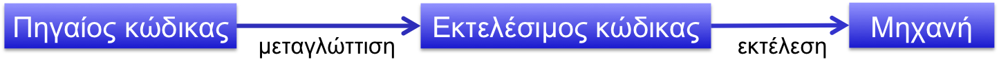
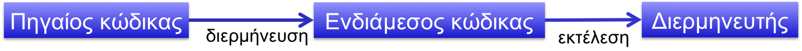
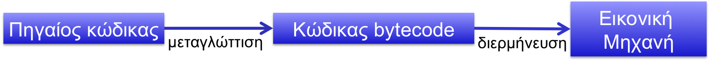
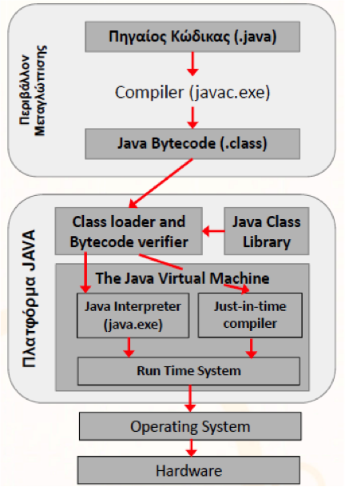

# 1.1 Εισαγωγή στη γλώσσα προγραμματισμού Java {#Java} 
© Γιάννης Κωστάρας

---

[∆](../../README.md) | [->](../1.2-Installation/README.md)

---

## Γιατί Java;

Η Java παραμένει μια από τις πιο [δημοφιλείς γλώσσες προγραμματισμού](https://www.jetbrains.com/research/devecosystem-2018/?utm_content=event&utm_campaign=general&mkt_tok=eyJpIjoiT1dKbU4yTTBZelZsTldGbSIsInQiOiJ2VjBoK2x0d2dOZ2dOR0hnSE8raEVDbCs5dElHRjN2NXVWazZZdzNpdXpESTFTZUhzY0d1NzVGZVgxcGlnQ083aFwvQkRQNlJkQzJwamFzaVhiMjZnMFpXMktLR1RCdnpZUlwvbTg2d2VXOFZ1Q1NXWlV2ek44eDJ3UUJ0MjJoNnBwIn0%3D). Ξεκίνησε ως μια απλοποίηση της C/C++, αφαιρώντας όσα χαρακτηριστικά ήταν δύσκολα και πηγές λάθους, όπως π.χ. οι δείκτες (pointers) κλπ. Ορίστηκε από την αρχή ως μια αυστηρά _αντικειμενοστραφής (object-oriented)_ γλώσσα προγραμματισμού. Άλλο σημαντικό χαρακτηριστικό της είναι ότι είναι ανεξάρτητη πλατφόρμας χάρις στην _Εικονική Μηχανή Java - Java Virtual Machine_ με αποτέλεσμα να μη χρειάζεται επαναμεταγλώττιση του πηγιαίου κώδικα για να τρέξει σε άλλες πλατφόρμες (‘Write Once Run Everywhere’). Ακόμα είναι ασφαλής (μέσω του Sandbox δεν σας επιτρέπει να γράψετε εφαρμογές που μπορούν να αποκτήσουν πρόσβαση στους πόρους του Η/Υ στον οποίο εκτελείται) ενώ τέλος είναι _πολυ-νηματική (multi-threaded)_. 


## Κατηγορίες γλωσσών προγραμματισμού
Ανάλογα με τον **τρόπο εκτέλεσης**, οι γλώσσες προγραμματισμού χωρίζονται σε:

* **Μεταγλωττισμένες (compiled)** όπου ολόκληρο το πρόγραμμα μεταγλωττίζεται σε γλώσσα μηχανής, με τη βοήθεια του μεταγλωττιστή (compiler), για πιο γρήγορη εκτέλεση. Ο _μεταγλωττιστής_ είναι ένα προγράμμα που μετασχηματίζει εντολές μιας γλώσσας προγραμματισμού σε οδηγίες (εντολές) στη γλώσσα μηχανής μιας συγκεκριμένης αρχιτεκτονικής. Το τελικό πρόγραμμα είναι βελτιστοποιημένο για τη μηχανή αυτή. Σ’ αυτή την κατηγορία ανήκουν γλώσσες όπως C/C++, C#, Erlang, Java κ.ά. όπου μετά τη φάση της μεταγλώττισης (και ίσως και της σύνδεσης – linker) παράγεται κάποιο εκτελέσιμο αρχείο (π.χ. ```.exe, .class, .beam``` κλπ.)



**Εικόνα 1** _Διαδικασία μεταγλώττισης πηγαίου κώδικα_

* **Διερμηνευτικές (interpreted)** όπου κάθε εντολή του προγράμματος εκτελείται ως έχει χωρίς μεταγλώττιση. Ο _διερμηνευτής_ (_interpreter_) δημιουργεί ένα ενδιάμεσο κώδικα ο οποίος μπορεί να εκτελεστεί σε διάφορες μηχανές, αλλά υπάρχουν περιορισμένες δυνατότητες βελτιστοποίησης. Παραδείγματα διερμηνευτικών γλωσσών: Perl, Python, Ruby, Javascript, Basic, Visual Basic, bash. 



**Εικόνα 2** _Διαδικασία διερμήνευσης πηγαίου κώδικα_

Ανάλογα με τον **τρόπο εκτέλεσης**, οι γλώσσες προγραμματισμού χωρίζονται ακόμα σε:

* **Δυναμικές (dynamic)** όπου σε μια μεταβλητή μπορεί να αποθηκεύονται διαφορετικού τύπου δεδομένα σε διαφορετικές χρονικές στιγμές. Οι διερμηνευτικές γλώσσες προγραμματισμού είναι συνήθως δυναμικές. Π.χ. Perl, Python, Ruby, Javascript, Basic, Visual Basic, bash κ.ά. 

```java
myvar = 5
myvar = 3.14
```
* **Στατικές (static)** όπου δηλώνουμε από την αρχή τον τύπο δεδομένων μιας μεταβλητής κι αυτός δεν μπορεί ν’ αλλάξει αργότερα. Οι μεταγλωττισμένες γλώσσες προγραμματισμού είναι συνήθως στατικές κι αυτός είναι ένας από τους λόγους που μπορούν να κάνουν καλύτερη βελτιστοποίηση του κώδικα. Παραδείγματα στατικών γλωσσών προγραμματισμού είναι: C/C++, C#, Erlang, Java, κ.ά. 

```java
int myvar = 5
double myvar = 3.14
```

Ανάλογα με το **μοντέλο προγραμματισμού** που χρησιμοποιείται, χωρίζονται σε:

* **Προστακτικές (Imperative)**, όπου το πρόγραμμα αποτελείται από μια σειρά από εντολές που εκτελούνται με τη σειρά και αλλάζουν τιμές σε μεταβλητές. Η κατάσταση του προγράμματος εξαρτάται κάθε φορά από τις τιμές των μεταβλητών. Υπάρχουν οι εξής δυο υπο-κατηγορίες:
* **Διαδικαστικές (Procedural)**, που διαχειρίζονται τα δεδομένα και τις διαδικασίες ανεξάρτητα, όπως π.χ. C, Pascal, Fortran, κ.ά.
* **Αντικειμενοστραφής (Object Oriented)** όπου οι διαδικασίες (μέθοδοι) εφαρμόζονται στα δικά τους δεδομένα, δηλ. δεδομένα και διαδικασίες εσωκλείονται σε κλάσεις. Π.χ. C++, Java, Python, Perl, Ruby κ.ά.
* **Συναρτησιακές (functional)** που βασίζονται στις συναρτήσεις (λ-λογισμό) οι οποίες όμως δεν αλλάζουν τα δεδομένα αλλά, όπως και στα μαθηματικά, επιστρέφουν νέα δεδομένα. Π.χ. Java 8, Scala, Clojure, Haskell, Lisp, OCaml, Erlang κ.ά.
* **Λογικές (Logical)** που χρησιμοποιούν λογικές προτάσεις για να εκφράσουν ένα πρόγραμμα. Π.χ. Prolog.
* **Βασισμένες σε συμβάντα (Event-driven)** όπου η ροή του προγράμματος καθορίζεται από συμβάντα (π.χ. mouse click) Π.χ. Visual Basic, Visual C#, Delphi κ.ά.
 
Οι στατικές γλώσσες προγραμματισμού στοχεύουν σε ταχύτερη εκτέλεση και μεγάλες εφαρμογές ενώ οι δυναμικές γλώσσες στοχεύουν σε ευκολία χρήσης και μικρότερες εφαρμογές.

Με βάση τις παραπάνω κατηγορίες, μπορούμε να πούμε ότι η Java είναι μια _αντικειμενοστραφής_ (αλλά και με στοιχεία _συναρτησιακής_), _στατική_, _μεταγλωττισμένη_ (αλλά και _διερμηνευτική_) γλώσσα προγραμματισμού.



**Εικόνα 3** _Διαδικασία μεταγλώττισης/διερμήνευσης πηγαίου κώδικα Java_

Η Εικονική Μηχανής της τρέχει πάνω σε διάφορες πλατφόρμες ανεξαρτήτως αρχιτεκτονικής, π.χ. Windows, Linux, Mac OS, Solaris.
Επιτρέπει στα προγράμματα γραμμένα στη γλώσσα Java να μεταγλωττίζονται μόνο μια φορά και να μπορούν να εκτελούνται σε οποιαδήποτε πλατφόρμα χωρίς την ανάγκη επαναμεταλώττισης. (**Write once run everywhere**)



**Εικόνα 4** _Η Εικονική Μηχανή της Java (Java Virtual Machine)_

Όπως φαίνεται στο παραπάνω σχήμα, ο πηγαίος κώδικας (```.java```) μεταγλωττίζεται σε κώδικα bytecode (```.class```). Κατά την εκτέλεση του προγράμματος, η Εικονική Μηχανή (Ε.Μ.) Java φορτώνει και ελέγχει τις κλάσεις και στη συνέχεια τις εκτελεί με τον διερμηνευτή (Java Interpreter). Ο μεταγλωττιστής Just In Time (JIT) ψάχνει για τμήματα κώδικα που εκτελούνται περισσότερο (hot spots) και τα μεταγλωτίζει για γρηγορότερη εκτέλεση. 

## Ολίγη ιστορία
Η γλώσσα προγραμματισμού Java ιδρύθηκε το 1991 και αρχικά ονομάστηκε _"Δρυς" (Oak)_ από μια ομάδα προγραμματιστών υπό τον [James Gosling](https://en.wikipedia.org/wiki/James_Gosling) στη [Sun Microsystems](https://en.wikipedia.org/wiki/Sun_Microsystems) με στόχο την αυτοματοποίηση των οικιακών συσκευών. Τα επόμενα δύο χρόνια ήταν απογοητευτικά για τη γλώσσα μέχρι το 1994, όταν η ομάδα ανάπτυξης επαναπροσδιορίζει τη γλώσσα με στόχο την κοινότητα του Internet. Η Oak μετονομάζεται σε _"Java"_ από το μάρκετινγκ. 


**Εικόνα 5** _Ο πατέρας της Java James Gosling_

Ο [Netscape Navigator 2.0](https://en.wikipedia.org/wiki/Netscape_Navigator) υποστηρίζει τη γλώσσα το Σεπτέμβριο του 1995 με τη μορφή των μη αυτόνομων εφαρμογών [Java applets](https://en.wikipedia.org/wiki/Java_applet). Η Microsoft ενσωματώνει τη γλώσσα στον [Internet Explorer](https://en.wikipedia.org/wiki/Internet_Explorer) στο τέλος του 1995. 

Από τότε, οι δυνατότητες της γλώσσας απογειώνονται. Το 1996 η Sun αναπτύσσει το [Java Development Kit 1.02](https://en.wikipedia.org/wiki/Java_Development_Kit). Το επόμενο έτος, η έκδοση 1.1 υποστηρίζει [JavaBeans](https://en.wikipedia.org/wiki/JavaBeans). Το 1997 η Sun κατηγορεί τη Microsoft για παραβίαση της συμφωνίας όσον αφορά την Java στον Internet Explorer 4. 

Η Sun αναπτύσσει το JDK 1.2 και το [Swing](https://en.wikipedia.org/wiki/Swing_(Java), το οποίο αποτελεί την αντικατάσταση του [AWT (Abstract Window Toolkit)](https://en.wikipedia.org/wiki/Abstract_Window_Toolkit), για την ανάπτυξη GUIs (γραφικών εφαρμογών). Επειδή οι αλλαγές είναι πολύ μεγάλες σε σχέση με τις εκδόσεις 1.02 και 1.1, αποφασίζει να την ονομάσει "Java 2".
Ακολουθούν οι εκδόσεις 1.3 και 1.4 (εισαγωγή του JDBC για επικοινωνία με βάσεις δεδομένων). Οι εκδόσεις 1.2, 1.3 και 1.4 αποτελούν τη "Java 2". Από την έκδοση 1.5, οι αλλαγές είναι πάλι μεγάλες, και πλέον αλλάζει πάλι η ονομασία της έκδοσης σε Java 5. Η Java 5 ήταν η πρώτη ουσιαστική αλλαγή του πυρήνα της γλώσσας απ' τη δημιουργία της, έτσι ώστε να υποστηρίζει Generics, Enumerated Types, autoboxing, varargs, annotations, static imports και νέες δυνατότητες για πολυνηματισμό (multi-threading). Η έκδοση 6 καταφέρνει να είναι 30% ταχύτερη από τις προηγούμενες εκδόσεις, ενώ η [έκδοση 7](Java7/REAMDE.md) φέρνει μικρές βελτιώσεις στη γλώσσα. Είναι η εποχή που η Sun Microsystems εξαγοράζεται από την Oracle. Η [έκδοση 8](Java8/README.md) φέρνει σημαντικές αλλαγές στη γλώσσα παρέχοντάς της δυνατότητες συναρτησιακού (λ-) προγραμματισμού αλλάζοντας κατά πολύ τον τρόπο χρήσης της. Η πολυαναμενόμενη [έκδοση 9](Java9/README.md) έφερε δυνατότητες τμηματοποίησης (modularisation) της γλώσσας δίνοντας τη δυνατότητα να δημιουργήσετε την δική σας εφαρμογή που να περιλαμβάνει μόνο τα modules της Java που χρειάζεται η εφαρμογή σας για να τρέξει. Από την έκδοση 10 και μετά, η Oracle αποφάσισε να εκδίδει μια νέα (minor) έκδοση Java κάθε 6 μήνες (και μια major έκδοση κάθε δυο χρόνια). Η πρώτη minor έκδοση είναι η 11.

| Έκδοση Java | Κωδική ονομασία | Τέλος εποχής | Ημερομηνία έκδοσης | Αρ. δημοσίων κλάσεων* 
| Java 11 | - | - | 25/09/2018 | 4410
| Java 10 | - | - | 20/03/2018 | 6002
| Java 9 | - | - | 27/07/2017 | 6005
| Java 8 | Spider | 31/12/2020 | 18/03/2014 | 4240
| Java 7 | Dolphin | 14/04/2015 | 28/07/2011 | 4024
| Java 6 | Mustang | 16/04/2013 | 23/12/2006 | 3793
| Java 5 | Tiger | 4/11/2009 | 04/10/2004 | 3279
| Java 1.4 | Merlin |    <4/11/2009 | 06/02/2002 | 2991
| Java 1.3 | Kestrel |   <4/11/2009 | 08/05/2000 | 1842
| Java 1.2 | Playground |<4/11/2009 | 08/12/1998 | 1520
| Java 1.1 | - |         <4/11/2009 | 19/02/1997 | 504
| Java 1.02 | Oak |       <4/11/2009 | 21/01/1996 | 212

*αριθμός δημοσίων κλάσεων του πλαισίου 'all classes' του javadoc API

Μια σύνοψη των αλλαγών στις διάφορες εκδόσεις:

* 1.1: nested classes
* 1.2: strictfp
* 1.3: μικρές αλλαγές
* 1.4: assert
* 1.5: annotations, generics, autoboxing, var-args...
* 1.6: καλύτερη απόδοση
* 1.7: diamond syntax, try-with-resources, κλπ.
* 1.8: lambda expressions και default methods
*   9: modules, μικροδιορθώσεις στις εκδόσεις 1.7 και 1.8
*  10: local-variable type inference (var)
*  11: μικρές αλλαγές


**Εικόνα 6** _Αρχιτεκτονική της Java Standard Edition (Πηγή: [https://tinyurl.com/y9y2meap](https://tinyurl.com/y9y2meap))_

Εν τω μεταξύ, μετά το JDK 1.3 εμφανίστηκε και η [Java Enterprise Edition (JEE) 1.3](https://en.wikipedia.org/wiki/Java_Platform%2C_Enterprise_Edition) η οποία στοχεύει στην ανάπτυξη επιχειρηματικών εφαρμογών (κοινώς το Web). Περιλαμβάνει τεχνολογίες όπως [Enterprise JavaBeans (EJBs)](https://en.wikipedia.org/wiki/Enterprise_JavaBeans), servlets, Java Server Pages, Java Server Faces κ.ά. Σήμερα βρίσκεται στην έκδοση 8, με πολλές δυνατότητες και ευκολία χρήσης σε σχέση με τις προηγούμενες εκδόσεις (1.3, 1.4, 5, 6, 7, 8). Παράλληλα, έχουν αναπτυχθεί πολλά frameworks για ανάπτυξη επιχειρηματικών εφαρμογών (ή εφαρμογών ιστού) βασισμένα στη Java, όπως το [Apache Tapestry](https://en.wikipedia.org/wiki/Apache_Tapestry), το [Apache Struts](https://en.wikipedia.org/wiki/Apache_Struts_2), το [Play](https://www.playframework.com/) και το [Spring](https://en.wikipedia.org/wiki/Spring_Framework) για να αναφέρουμε τα πιο γνωστά. 


**Εικόνα 7** _Αρχιτεκτονική της Java Enterprise Edition (Πηγή: [https://tinyurl.com/yc2ozrck](https://tinyurl.com/yc2ozrck))_

Βασικά συστατικά μιας εφαρμογής JEE είναι:

* Enterprise Java Beans (EJB)
* Servlets
* Java Server Pages (JSP) ή Java Server Faces (JSF)

Αλλά η Java έχει γίνει πολύ γνωστή και στον κλάδο των κινητών εφαρμογών με τη [Java Micro Edition (JME)](https://en.wikipedia.org/wiki/Java_Platform%2C_Micro_Edition) που αποτελεί ανταγωνιστή του Android και του iOS.


**Εικόνα 8** _Αρχιτεκτονική της Java Mobile Edition (Πηγή: [https://tinyurl.com/ycfgxymh](https://tinyurl.com/ycfgxymh))_

Η Java έχει προκαλέσει περισσότερο ενθουσιασμό από οποιαδήποτε άλλη εξέλιξη στο Διαδίκτυο από την εποχή του [Mosaic](https://en.wikipedia.org/wiki/Mosaic_(web_browser)). Είναι μια γλώσσα προγραμματισμού για κατανεμημένες εφαρμογές. Έχει γίνει παγκοσμίως γνωστή ωστόσο, επειδή επιτρέπει στους χρήστες να αλληλεπιδρούν με τις ιστοσελίδες. Ένα πολύ βασικό χαρακτηριστικό που αποτέλεσε κι έναν από τους κυριότερους λόγους διάδοσης της γλώσσας είναι ότι είναι ανεξάρτητη πλατφόρμας ('Write Once Run Everywhere'). Αυτό σημαίνει ότι γράφετε κώδικα μια φορά και αυτός τρέχει σε οποιαδήποτε πλατφόρμα που έχει εγκατεστημένο το [Java Virtual Machine](https://en.wikipedia.org/wiki/Java_virtual_machine). 

Με το JDK 1.2, η Java έγινε η πιο ελκυστική γλώσσα για την κατασκευή φιλικών προς το χρήστη γραφικών περιβάλλοντων με τη χρήση του Swing. Το [JavaFX](https://en.wikipedia.org/wiki/JavaFX), ο ανταγωνιστής των [Adobe AIR](https://en.wikipedia.org/wiki/Adobe_AIR) και [MS Silverlight](https://en.wikipedia.org/wiki/Microsoft_Silverlight), αποτελεί το νέο framework της γλώσσας για ανάπτυξη γραφικών εφαρμογών (αντικαθιστά το Swing).
      
Για να δούμε και μια άλλη γνώμη όμως, ο Stroustrup υποστηρίζει ότι ≪... η Java δεν είναι ανεξάρτητη πλατφόρμας. Είναι μια πλατφόρμα. Όπως και τα Windows, είναι μια ιδιόκτητη εμπορική πλατφόρμα. Δηλαδή, μπορείτε να γράψετε προγράμματα για Windows / Intel ή για Java / JVM, και σε κάθε περίπτωση γράφετε κώδικα για μια πλατφόρμα που ανήκει σε μία εταιρεία και για το εμπορικό όφελος των εν λόγω εταιριών. Έχει επισημανθεί ότι μπορείτε να γράψετε τα προγράμματα σε οποιαδήποτε γλώσσα για τη JVM και τα συναφή λειτουργικά συστήματα. Ωστόσο, η JVM, κ.λπ., είναι σε μεγάλο βαθμό μεροληπτική υπέρ της Java. Δεν είναι πουθενά κοντά σε μια γενική, λογικά, ουδέτερη γλώσσα VM/Λ.Σ. ...≫ 

Αν και τα επιχειρήματα του Stroustrup, του δημιουργού της C++ ήταν αληθή έως ένα βαθμό μέχρι πρότεινος, πρόσφατα η Oracle "άνοιξε" τον κώδικα τόσο της Java SE όσο και της [Java EE](http://www.linux-magazine.com/Online/News/Oracle-Donating-Java-EE-to-the-Eclipse-Foundation). Επίσης, η ΕΜ (JVM) αποτελεί πλέον την πλατφόρμα για πολλές άλλες γλώσσες προγραμματισμού οι οποίες μπορούν να τρέξουν σ' αυτή, όπως Groovy, Ruby (JRuby), Python (Jython), Go, Erlang (Erjang), Clojure κ.ά. κάνοντάς τη μια πραγματικά πολύγλωσση (polyglot) εικονική μηχανή.  

Η Java έγινε πλέον ανοικτού κώδικα με το [OpenJDK](https://en.wikipedia.org/wiki/OpenJDK), η πρώτη έκδοση του οποίου κυκλοφόρησε για το Ubuntu και διανέμεται πλέον μ' αυτό.
      
Εν τω μεταξύ, η Microsoft δημιούργησε τον κύριο ανταγωνιστή της Java μέσω της πλατφόρμας της .NET, που ονομάζεται [C#](https://en.wikipedia.org/wiki/C_Sharp_(programming_language)), μια γλώσσα που απορρέει από την Java και τη C++ κι αυτός ήταν κι ένας από τους λόγους των πολλών αλλαγών που επήλθαν στη Java στην έκδοση 5 και μετά. Η JVM μπορεί να θεωρηθεί ως η εξ' ορισμού πλατφόρμα για τα συστήματα Linux και στον αντίποδα το .NET για την πλατφόρμα Windows.
      
Το 2009 ο ήλιος της Sun έσβησε μετά την εξαγορά της από την Oracle, η οποία μάλιστα ισχυρίζεται, ότι η Java ήταν ο κύριος λόγος εξαγοράς της Sun καθώς το μεγαλύτερο μέρος του middleware της Oracle είναι γραμμένο σε Java. Αν και οι εξελίξεις έδειχναν αρνητικές, καθώς ο CEO της SUN παραιτήθηκε κι ακολούθησε κι η παραίτηση του πατέρα της Java του James Gosling, και μετά από πολλές περιπέτειες, η Oracle κατάφερε να βγάλει 3 επιτυχημένες εκδόσεις της Java (8, 9 και 10). 

Συνοπτικά η Java είναι:

* Απλή (απλοποίηση της C++)
* Αντικειμενοστραφής
* Ισχυρή και ασφαλής
* Ουδέτερη αρχιτεκτονικής 
* Φορητή
* Υψηλής απόδοσης
* Πολυνηματική 
* Κατανεμημένη
* Διερμηνευτική και μεταγλωττισμένη
* Στατική

## Πηγές:
1. [Java History](http://www.java.com/en/javahistory/).
2. Wikipedia, [Java Programming Language](http://en.wikipedia.org/wiki/Java_%28programming_language%29).
3. Liguori R. & Liguori P. (2014), _Java 8 Pocket Guide_, O'Reilly.
4. [Oracle Java SE Support Roadmap](https://www.oracle.com/technetwork/java/java-se-support-roadmap.html).

---

[Δ](../../README.md) | [->](../1.2-Installation/README.md)

---