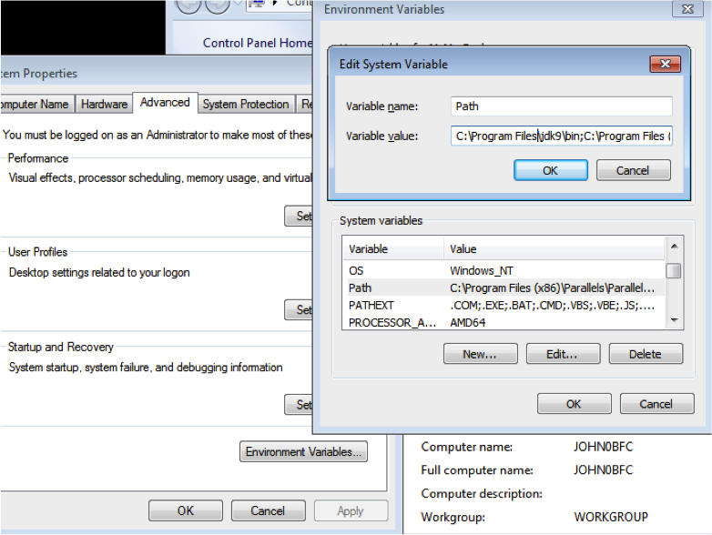
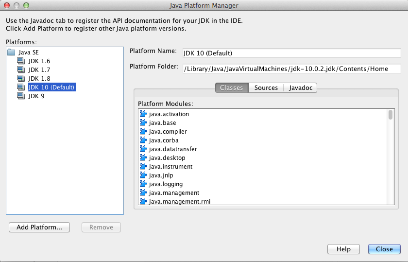

# 1.2 Εγκατάσταση της γλώσσας  Java {#Java} 
© Γιάννης Κωστάρας

---

[<-](../1.1-JavaHistory/README.md) | [∆](../../README.md) | [->](../1.3-JavaBasics/README.md)

---

## Εγκατάσταση της Java

Όπως είδαμε, η Java αποτελείται από μια Εικονική Μηχανή που επιτρέπει την εκτέλεση των εφαρμογών Java σε οποιαδήποτε πλατφόρμα (Windows, Mac, Linux, Unix). Για να εκτελέσετε μια εφαρμογή Java χρειάζεστε το _Java Runtime Environment (JRE)_. Για να αναπτύξετε όμως μια εφαρμογή Java χρειάζεστε το _Java Development Kit (JDK)_ το οποίο περιλαμβάνει το JRE.

Θα εγκαταστήσουμε την τελευταία έκδοση της Java SE ή Standard Edition για τις πιο δημοφιλής πλατφόρμες Windows, Linux, MacOSX. Από την έκδοση 11 και μετά, έχει αλλάξει η άδεια χρήσης. Για επαγγελματική χρήση ενδέχεται να υπάρχουν χρεώσεις για το Oracle JDK (διαβάστε προσεκτικά την άδεια χρήσης), ενώ υπάρχει και η δωρεάν ανοικτού κώδικα έκδοση OpenJDK (άδεια χρήσης: GNU General Public License v2 with Classpath Exception (GPLv2+CPE)). Οι δυο εγκαταστάσεις δουλεύουν ακριβώς το ίδιο εκτός από ελάχιστες διαφορές. 

### Εγκατάσταση του OpenJDK
Πλοηγηθείτε στο [jdk.java.net](http://jdk.java.net/) και κατεβάστε την τελευταία έκδοση για την πλατφόρμα σας. Αποσυμπιέστε το και ακολουθείστε τα βήματα που περιγράφονται παρακάτω για να το εισάγετε στο ```PATH```. Καλό είναι να το εγκαταστήσετε σε μια διαδρομή (path) χωρίς κενά. 

### Εγκατάσταση του Oracle JDK στα Windows
1. Πλοηγηθείτε στον ιστοχώρο της [Oracle](http://www.oracle.com/technetwork/java/javase/downloads/index.html) και κατεβάστε την τελευταία έκδοση του JDK. Αποδεχθείτε την άδεια χρήσης (License Agreement) και κατεβάστε το για την πλατφόρμα σας (```jdk-XX.X.X_windows-x64_bin.exe```. **Σημείωση.** _Η έκδοση της Java που κατεβάσατε είναι 64 bit και 'τρέχει' σε 64-bit Windows. Αν τρέχετε παλιά έκδοση των Windows η οποία μπορεί να εκτελέσει μόνο 32 bit προγράμματα, τότε θα πρέπει να κατεβάσετε την τελευταία έκδοση x86 του JDK 8 (```jdk-8uXXX-windows-i586.exe```)_. 
1. Κάντε διπλό κλικ πάνω στο αρχείο αυτό και ακολουθήστε τα βήματα του οδηγού. Καλό είναι να το εγκαταστήσετε σε μια διαδρομή (path) χωρίς κενά, π.χ. ```C:\Programs\Java``` αντί για την προτεινόμενη διαδρομή ```C:\Program Files\Java```. Ο οδηγός θα σας ζητήσει στη συνέχεια να εγκαταστήσετε και το JRE. Επιλέξτε ```C:\Programs\Java\jdkXX.X.X\jre```.
1. Προσθέστε την εγκατάσταση στη μεταβλητή περιβάλλοντος ```PATH``` ως εξής:

* Δεξί κλικ στο εικονίδιο Computer ⇒ Properties
* System Properties
* Καρτέλα "Advanced" ⇒  Environment Variables
* "System Variables", 
* Επιλέξτε **New** και εισάγετε τη νέα μεταβλητή περιβάλλοντος ```JAVA_HOME``` δίνοντάς της την τιμή ```C:\Programs\Java\jdkXX.X.X```, όπου ```XX.X.X``` η έκδοση που κατεβάσατε π.χ. ```13.0.2```
* Επιλέξτε **"PATH" ⇒  Edit** και προσθέστε ```%JAVA_HOME%\bin;``` μπροστά από οποιαδήποτε άλλη τιμή της μεταβλητής αυτής
* Πατήστε **ΟΚ** σε όλα τ' ανοικτά παράθυρα



**Εικόνα 1.2.1** _Ορισμός μεταβλητών περιβάλλοντος στα Windows_

### Εγκατάσταση του Oracle JDK στο MacOS
1. Πλοηγηθείτε στον ιστοχώρο της [Oracle](http://www.oracle.com/technetwork/java/javase/downloads/index.html) και κατεβάστε την τελευταία έκδοση του JDK. Αποδεχθείτε την άδεια χρήσης (License Agreement) και κατεβάστε το για την πλατφόρμα σας (```jdk-XX.X.X_osx-x64_bin.dmg```), όπου ```XX.X.X``` η έκδοση που κατεβάσατε π.χ. ```13.0.2```.
1. Εγκαταστήστε το αρχείο κατά τα γνωστά.
1. Ορίστε τις ακόλουθες μεταβλητές περιβάλλοντος στο αρχείο ```.bash_profile```: ```JAVA_HOME=$HOME/Programs/Java/jdkXX.X.X``` και ```PATH=$JAVA_HOME/bin:$PATH```

Αν έχετε και άλλες εγκατεστημένες εκδόσεις της Java, τότε για να ορίσετε π.χ. την έκδοση που κατεβάσατε ως την εξ' ορισμού έκδοση στο σύστημά σας ακολουθήστε τα παρακάτω βήματα (σε ένα κέλυφος) (οι εκδόσεις στο σύστημά σας θα διαφέρουν από αυτές του παρακάτω παραδείγματος):

```bash
$ /usr/libexec/java_home -V
Matching Java Virtual Machines (8):
	13.0.2, x86_64:	"Java SE 13.0.2"	/Library/Java/JavaVirtualMachines/jdk-13.0.2.jdk/Contents/Home
	11.0.1, x86_64:	"Java SE 11.0.1"	/Library/Java/JavaVirtualMachines/jdk-11.0.1.jdk/Contents/Home
    10.0.2, x86_64:	"Java SE 10.0.2"	/Library/Java/JavaVirtualMachines/jdk-10.0.2.jdk/Contents/Home
    9.0.4, x86_64:	"Java SE 9.0.4"	/Library/Java/JavaVirtualMachines/jdk-9.0.4.jdk/Contents/Home
    1.8.0_181, x86_64:	"Java SE 8"	/Library/Java/JavaVirtualMachines/jdk1.8.0_181.jdk/Contents/Home
    1.7.0_80, x86_64:	"Java SE 7"	/Library/Java/JavaVirtualMachines/jdk1.7.0_80.jdk/Contents/Home
    1.6.0_65-b14-462, x86_64:	"Java SE 6"	/System/Library/Java/JavaVirtualMachines/1.6.0.jdk/Contents/Home
    1.6.0_65-b14-462, i386:	"Java SE 6"	/System/Library/Java/JavaVirtualMachines/1.6.0.jdk/Contents/Home

/Library/Java/JavaVirtualMachines/jdk-13.0.2.jdk/Contents/Home
```
Στη συνέχεια μπορείτε να ορίσετε τη μεταβλητή περιβάλλοντος ```JAVA_HOME``` στο ```.bash_profile``` όπως είδαμε παραπάνω δίνοντάς της την τιμή ```export JAVA_HOME=`/usr/libexec/java_home -v 13.0.2` ```.

_Πηγή:_ [StackOverflow](https://stackoverflow.com/questions/21964709/how-to-set-or-change-the-default-java-jdk-version-on-os-x#24657630)

### Εγκατάσταση του Oracle JDK στο Linux
1. Πλοηγηθείτε στον ιστοχώρο της [Oracle](http://www.oracle.com/technetwork/java/javase/downloads/index.html) και κατεβάστε την τελευταία έκδοση του JDK. Αποδεχθείτε την άδεια χρήσης (License Agreement) και κατεβάστε το για την πλατφόρμα σας (προτιμήστε το αρχείο ```jdk-XX.X.X_linux-x64_bin.tar.gz```), όπου ```XX.X.X``` η έκδοση που κατεβάσατε π.χ. ```13.0.2```.
1. Αποσυμπιέστε το (π.χ. από τον εξερευνητή αρχείων κάντε δεξί κλικ και επιλέξτε **Extract here**). Μετακινήστε το φάκελο ```jdkXX.X.X``` σε μια διαδρομή (path) χωρίς κενά, π.χ. ```$HOME/Programs/Java```. Συνίσταται να την εγκαταστήσετε στη διαδρομή ```/usr/lib/jvm``` δίνοντας τις εντολές: ```sudo mkdir -p /usr/lib/jvm/jdk-XX.X.X``` και ```sudo mv $HOME/Downloads/jdkXX.X.X/* /usr/lib/jvm/jdk-XX.X.X/```.
1. Ορίστε τις ακόλουθες μεταβλητές περιβάλλοντος στο αρχείο ```.bashrc```: ```JAVA_HOME=$HOME/Programs/Java/jdkXX.X.X``` ή ```JAVA_HOME=/usr/lib/jvm/jdkXX.X.X``` και ```PATH=$JAVA_HOME/bin:$PATH```

Αν έχετε και άλλες εγκατεστημένες εκδόσεις της Java, τότε για να ορίσετε την έκδοση που κατεβάσατε ως την εξ' ορισμού έκδοση στο σύστημά σας:

```bash
$ sudo update-alternatives –-config java
```
και επιλέξτε τη από το μενού που εμφανίζεται.

Εναλλακτικά μπορείτε να την εγκαταστήσετε ως την εξ' ορισμού με την εντολή (π.χ. XX.X.X εδώ είναι 13.0.2):

```bash
$ sudo update-alternatives –-install "/usr/bin/java" "java" "/usr/lib/jvm/jdk-13.0.3/bin/java" 1010
$ sudo update-alternatives –-install "/usr/bin/javac" "javac" "/usr/lib/jvm/jdk-13.0.3/bin/javac" 1010
```

### Επαλήθευση εγκατάστασης
Αν όλα πήγαν καλά, τότε μπορείτε ν' ανοίξετε μια προτροπή DOS (command prompt) ή ένα κέλυφος (shell) και να δώσετε τις εντολές (η έκδοση που κατεβάσατε θα διαφέρει από τα παρακάτω παραδείγματα):

```bash 
$ java –version
java version "12" 2019-03-19
Java(TM) SE Runtime Environment (build 12+33)
Java HotSpot(TM) 64-Bit Server VM (build 12+33, mixed mode, sharing)
```
για το Oracle JDK, ενώ για το OpenJDK:
```bash
$ java –version
openjdk version "11" 2018-09-25
OpenJDK Runtime Environment 18.9 (build 11+28)
OpenJDK 64-Bit Server VM 18.9 (build 11+28, mixed mode)
```

```bash
$ jshell
|  Welcome to JShell -- Version 12.0.1
|  For an introduction type: /help intro

jshell> 2+2
$1 ==> 4

jshell> (Ctrl+D)
```

Η έκδοσή σας μπορεί να διαφέρει από την παραπάνω. 

Το ```jshell```, όπως θα δούμε, είναι ένα νέο κέλυφος Java που έρχεται μαζί με την έκδοση 9 της Java (ή νεώτερη) και μας επιτρέπει να δοκιμάζουμε εντολές κλπ. εύκολα και γρήγορα.

## Ολοκληρωμένα Περιβάλλοντα Εργασίας (Integrated Development Environments - IDEs)
Αν και μπορείτε να γράψετε ολόκληρες εφαρμογές Java με τη χρήση ενός απλού επεξεργαστή κειμένου όπως το Notepad ή το vi, τα Ολοκληρωμένα Περιβάλλοντα Εργασίας (ΟΠΕ) σας παρέχουν πολλά καλούδια που σας βοηθούν στην ανάπτυξη των εφαρμογών σας γρηγορότερα, όπως αυτόματη συμπλήρωση κώδικα, online βοήθεια κλπ.

Τα πιο δημοφιλή ΟΠΕ για Java είναι:
* [BlueJ](https://www.bluej.org/)
* [DrJava](http://www.drjava.org/)
* [Eclipse](http://www.eclipse.org/)
* [IDEA](https://www.jetbrains.com/idea/)
* [JDeveloper](http://www.oracle.com/technetwork/developer-tools/jdev/overview/index.html)
* [NetBeans](https://netbeans.apache.org/) ή [OpenBeans](https://www.openbeans.org/)

Σ' αυτή τη σειρά μαθημάτων θα χρησιμοποιήσουμε το NetBeans, αλλά μπορείτε κάλλιστα να χρησιμοποιήσετε όποιο ΟΠΕ ή επεξεργαστή κειμένου προτιμάτε.

Αν δεν επιθυμείτε να εγκαταστήσετε κάποιο πρόγραμμα στον Η/Υ σας, μπορείτε ακόμα να χρησιμοποιήσετε κάποιο από τα παρακάτω online:
* [Browxy                    ](http://www.browxy.com/)
* [Codecademy                ](https://www.codecademy.com/learn/learn-java)
* [CodeChef                  ](https://www.codechef.com/ide)
* [CodePad                   ](https://codepad.remoteinterview.io/)
* [Codiva                    ](https://www.codiva.io/)
* [CompileJava               ](https://www.compilejava.net/)
* [Guru99                    ](https://www.guru99.com/try-java-editor.html)
* [Ideone                    ](https://ideone.com/)
* [JDoodle                   ](https://www.jdoodle.com/online-java-compiler)
* [TryJShell - Online JShell ](https://tryjshell.org)
* [Learn Java Online         ](http://www.learnjavaonline.org/)
* [Paiza.io                  ](https://paiza.io/en/projects/new?language=java)
* [Repl.it                   ](https://repl.it/languages/java10)
* [Rextester                 ](http://rextester.com/l/java_online_compiler)
* [Online Java Debugger      ](https://www.onlinegdb.com/online_java_debugger)
* [Trinket                   ](https://trinket.io/java)
* [Tutorialspoint            ](https://www.tutorialspoint.com/compile_java_online.php)
* [Visualizer                ](http://www.pythontutor.com/visualize.html#mode=edit)

## Εγκατάσταση του Apache NetBeans

1. Από τον ιστοχώρο της [Apache](https://netbeans.apache.org/download/index.html) κατεβάστε την τελευταία έκδοση του Apache NetBeans. Θα πρέπει να κατεβάσετε την έκδοση 9.0 ή νεώτερη για να μπορέσετε να δουλέψετε με το JDK 9 ή νεώτερο. A
1. Αποσυμπιέστε το αρχείο ```netbeans-java-x.0-bin.zip``` σε ένα φάκελο (π.χ. ```$HOME/Programs```). Από την έκδοση 11.2 και μετά υπάρχει οδηγός εγκατάστασης του NetBeabs. Κατεβάστε το κατάλληλο για την πλατφόρμα σας και εκτελέστε το για να εγκαταστήσετε το Apache NetBeans. 
1. Ελέξτε ότι το αρχείο ```<netbeans>/etc/netbeans.conf``` περιέχει γραμμή παρόμοια με την παρακάτω ανάλογα με την έκδοση JDK που εγκαταστήσατε προηγουμένως:
```bash
netbeans_jdkhome="/<path>/jdk-XX.X.X.jdk/Contents/Home/" 
```
αν χρησιμοποιείτε Mac ή
```bash
netbeans_jdkhome="/<path>/jdkXX.X.X/" 
```
αν χρησιμοποιείτε Windows/Linux/Unix.

### Επαλήθευση εγκατάστασης
1. Ξεκινήστε το NetBeans. Ανάλογα με την πλατφόρμα σας (Windows: κάντε διπλό κλικ στο αρχείο ```netbeans.exe``` ή ```netbeans64.exe```)(Linux/MacOSX: από ένα κέλυφος πληκτρολογήστε ```./netbeans &```) από το φάκελο ```bin```.
1. Επιλέξτε το μενού **Tools --> Open Java Platform Shell**
```bash
|  System Information:
|      Java version:    13.0.3+11
|      Virtual Machine: Java HotSpot(TM) 64-Bit Server VM  13.0.3+11
|      Classpath:
|  	/<path>/netbeans/java/modules/ext/nb-mod-jshell-probe.jar
|  
[1]-> System.out.println("Καλημέρα κόσμε")
Καλημέρα κόσμε
```

Μπορείτε να προσθέσετε κι άλλες εκδόσεις JDK από το μενού ```Tools --> Java Platforms```. Πατώντας το κουμπί ```Add Platform``` μπορείτε να πλοηγηθείτε στο φάκελο που έχετε εγκαταστήσει ένα JDK.



**Εικόνα 1.2.2** _Ορισμός πλατφορμών JDK_

## JShell

Το κέλυφος Java (JShell) εισήχθηκε στη Java από την έκδοση 9 και μετά. Πιο πάνω είδαμε πώς να το εκκινήσουμε τόσο από τη γραμμή εντολών του Λ.Σ. όσο και από το NetBeans. Στη βιβλιογραφία αναφέρεται ως _Read-Evaluate-Print-Loop_. Όπως είδαμε, η Java είναι μια μεταγλωττισμένη γλώσσα, δηλ. για να εκτελεστεί κάποιο πρόγραμμα γραμμένο σε Java, θα πρέπει πρώτα να το μεταγλωττίσουμε και μετά να το εκτελέσουμε. Για μικρά προγράμματα ή για να δοκιμάσουμε διάφορα χαρακτηριστικά της γλώσσας, αυτό τρώει πολύ χρόνο. Το JShell δημιουργήθηκε γι' αυτόν ακριβώς το σκοπό. Μπορούμε μ' αυτό να εκτελέσουμε εντολές Java χωρίς να χρειάζεται πρώτα να περάσουμε από τη φάση της μεταγλώττισης.

Σ' αυτή την ενότητα θα δούμε πώς μπορούμε να το χρησιμοποιήσουμε. 

Το JShell αποτελείται από:
* Snippets, π.χ. ```2+2```
* Εντολές, π.χ. ```/help```
* Scripts π.χ.
```bash
$ jshell --startup PRINTING
```

**Σημαντική Σημείωση** _Για να μπορέσετε να δείτε ελληνικά στο JShell στα Windows, θα πρέπει να δώσετε τις εξής εντολές σε ένα παράθυρο DOS_

```
C:\ chcp 737

C:\ jshell
|  Welcome to JShell -- Version 13
|  For an introduction type: /help intro

jshell> System.setOut(new PrintStream(System.out, true, "cp737"));

jshell> System.out.println("Γειά")
Γειά
```

Για να μπορέσετε να δείτε ελληνικά στο jshell του NetBeans στα Windows, θα πρέπει να ορίσετε την μεταβλητή περιβάλλοντος ```JAVA_TOOL_OPTIONS=-Dfile.encoding=UTF8```, όπως περιγράψαμε στην αρχή αυτών των σημειώσεων. Εναλλακτικά, ανοίξτε το αρχείο ```etc/netbeans.conf``` και προσθέστε στο τέλος του κλειδιού ```netbeans_default_options```, δηλ. μετά το ```-J-XX:+IgnoreUnrecognizedVMOptions``` το ```-J-Dfile.encoding=UTF8```. Επανεκκινήστε το NetBeans, και θα πρέπει να βλέπετε πλέον ελληνικά στο JShell.

### Εντολές JShell
```bash
jshell> /help
/list [<name or id>|-all|-start]                                         -- list the source you have typed
/edit <name or id>                                                       -- edit a source entry referenced by name or id
/save [-all|-history|-start] <file>                                      -- save snippet source to a file
/open <file>                                                             -- open a file as source input
/vars [<name or id>|-all|-start]                                         -- list the declared variables and their values
/types [<name or id>|-all|-start]                                        -- list the type declarations
/methods [<name or id>|-all|-start]                                      -- list the declared methods and their signatures
/imports                                                                 -- list the imported items
/exit                                                                    -- exit jshell
/env [-class-path <path>] [-module-path <path>] [-add-modules <modules>] -- view or change the evaluation context
/reset                                                                   -- reset jshell
/reload [-restore] [-quiet] [-class-path <path>] [-module-path <path>]   -- reset and replay relevant history -- current or previous (-restore)
/history                                                                 -- history of what you have typed
/help [<command>|<subject>]                                              -- get information about jshell
/set editor|start|feedback|mode|prompt|truncation|format                 -- set configuration information
/? [<command>|<subject>]                                                 -- get information about using the jshell tool
/!                                                                       -- rerun last snippet -- see /help rerun
/<id>                                                                    -- rerun snippets by ID or ID range -- see /help rerun
/-<n>                                                                    -- rerun n-th previous snippet -- see /help rerun	
```

### Χρήσιμα πλήκτρα στο JShell
**Πίνακας 1.2.1** _Πλοήγηση_ 

| Πλήκτρο(-α) | Αποτέλεσμα
| ```ENTER``` | Εισαγωγή νέας γραμμής
| ```<-``` | Πίσω ένας χαρακτήρας
| ```->``` | Μπροστά ένας χαρακτήρας
| ```^``` | Πάνω μια γραμμή, πίσω στο ιστορικό
| ```v``` | Κάτω μια γραμμή, μπροστά στο ιστορικό
| ```Ctrl+A``` | Μετακίνηση στην αρχή της γραμμής
| ```Ctrl+E``` | Μετακίνηση στο τέλος της γραμμής
| ```Alt+B``` | Μετακίνηση πίσω μια λέξη
| ```Alt+F``` | Μετακίνηση μπροστά μια λέξη
| ```Ctrl+R (Ctrl+S)``` | Αναζήτηση πίσω (μπροστά) στο ιστορικό

**Πίνακας 1.2.2** _Τροποποίηση κειμένου_

| Πλήκτρο(-α) | Αποτέλεσμα
| ```Tab``` | Αυτόματη συμπλήρωση (auto-completion)
| ```Delete``` | Διαγραφή του χαρακτήρα μετά τον δρομέα
| ```Backspace``` | Διαγραφή του χαρακτήρα πριν δρομέα
| ```Ctrl+K``` | Διαγραφή του κειμένου από το δρομέα μέχρι το τέλος της γραμμής
| ```Alt+D``` | Διαγραφή του κειμένου από το δρομέα μέχρι το τέλος της λέξης
| ```Ctrl+Y``` | Επικόλληση του πιο πρόσφατα διαγραμμένου κειμένου 
| ```Alt+Y``` | Μετακίνηση στο διαγραμμένο κείμενο

```Ctrl+L```: καθαρισμός οθόνης

Στις επόμενες διαλέξεις αυτής της εβδομάδας θα μάθουμε τις βασικές εντολές της γλώσσας χρησιμοποιώντας το JShell.

## Πηγές
1. [JDK 10 Documentation](https://docs.oracle.com/javase/10/index.html)
1. [Java Platform, Standard Edition Java Shell User’s Guide](https://docs.oracle.com/javase/10/jshell/toc.htm)
1. [JShell Tutorial](https://jshelltutorial.com/)
1. [JShell Tutorial](http://cr.openjdk.java.net/~rfield/tutorial/JShellTutorial.html)
1. Hillar G.C. (2017), _Java 9 with JShell_, Packt.
1. Samoylov N. (2019), _Learn Java 12 Programming_, Packt.
1. Sharan K. (2017), _Java 9 Revealed: For Early Adoption and Migration_, Apress.
1. [Apache NetBeans](https://netbeans.apache.org/help/index.html)

---

[<-](../1.1-JavaHistory/README.md) | [∆](../../README.md) | [->](../1.3-JavaBasics/README.md)

---