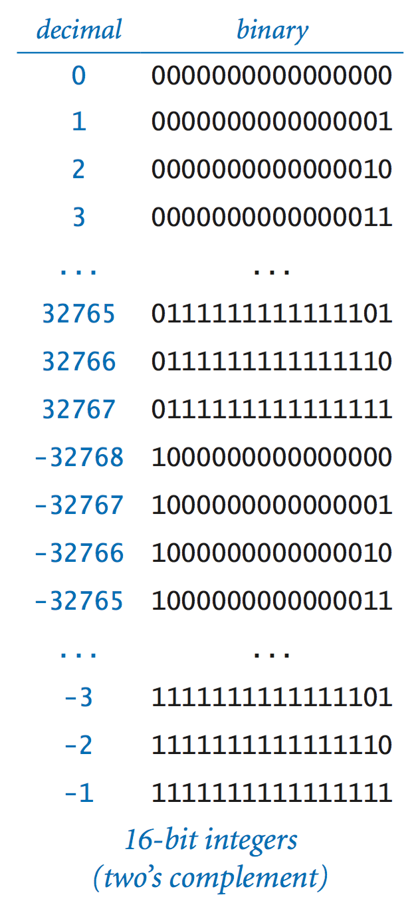
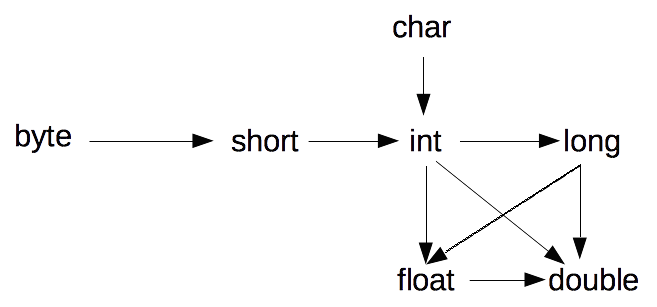

# 1.3 Αριθμοί, μεταβλητές, εκφράσεις {#Java} 
© Γιάννης Κωστάρας

---

[<-](../1.2-Installation/README.md) | [∆](../../README.md) | [->](../1.4-Strings/README.md)

---

Σ' αυτό το μάθημα θα κάνουμε τα πρώτα μας βήματα στη γλώσσα προγραμματισμού Java. Η γλώσσα Java αποτελείται από: λέξεις-κλειδιά (keywords), μεταβλητές (variables ή identifiers), σταθερές (constants ή literals), τελεστές (operators) και σημεία στίξης (punctuators).

Οι _λέξεις-κλειδιά (keywords)_ είναι δεσμευμένες λέξεις που αποτελούν τις εντολές της γλώσσας (π.χ. ```int, String, for, public, try```). 

Οι _μεταβλητές (variables ή identifiers)_ είναι, όπως θα δούμε, διευθύνσεις μνήμης για ν' αποθηκεύουμε δεδομένα ή αποτελέσματα πράξεων.

Οι _σταθερές (constants ή literals)_ είναι επίσης θέσεις μνήμης που αποθηκεύουν δεδομένα που δεν μπορούν να μεταβληθούν κατά την εκτέλεση του προγράμματος.

Οι _τελεστές (operators)_ είναι διάφορες πράξεις που υποστηρίζει η γλώσσα (π.χ. ```+, %, ++, && <=```) και χρησιμοποιούνται σε εκφράσεις.

Τα _σημεία στίξης (punctuators)_ είναι χαρακτήρες που έχουν ειδικό νόημα για τον μεταγλωττιστή (π.χ. ```; , . { }```).

## Σχόλια

Η Java υποστηρίζει τριών ειδών σχόλια.

Σχόλιο μιας γραμμής:
```java
int radius;          // Αυτό είναι ένα σχόλιο μιας γραμμής

```
Σχόλιο πολλαπλών γραμμών:
```java
/* 
 * Αυτό είναι ένα σχόλιο
 * πολλαπλών γραμμών.
 */
int radius;          
```
Σχόλιο τεκμηρίωσης (Javadoc):
```java
/** 
 * Αυτό είναι ένα σχόλιο
 * τεκμηρίωσης κώδικα (Javadoc).
 */
int radius;          
```
Τα σχόλια Javadoc σας επιτρέπουν να τεκμηριώνετε τον κώδικά σας και να παράγετε τη διεπαφή των κλάσεών σας (Application Program Interface - API) σε μορφή HTML. Π.χ. [εδώ](https://docs.oracle.com/javase/10/docs/api/index.html?overview-summary.html) βλέπετε το API των κλάσεων της Java 10. Θα μάθουμε πώς να γράφουμε τα δικά μας σχόλια Javadoc τη 2η εβδομάδα.

## Αριθμοί

Η Java υποστηρίζει τους παρακάτω αριθμητικούς τύπους:

* Ακέραιοι:
  * Δεκαδικός: π.χ. ```15```
  * Οκταδικός: π.χ. ```023```
  * Δεκαεξαδικός: π.χ. ```0xΑΒ```
  * Δυαδικός: π.χ. ```0b101```
  * Αναπαράσταση μεγάλων αριθμών: π.χ. ```123_456_789```

**Σημείωση.** _Στο [API](https://docs.oracle.com/javase/7/docs/api/java/lang/Integer.html) της γλώσσας μπορείτε να βρείτε χρήσιμες εντολές όπως π.χ. η ```Integer.parseInt(String s, int radix)``` που επιτρέπει τη μετατροπή ενός αριθμού σε μια άλλη βάση (radix, π.χ. δυαδικό σύστημα) στο δεκαδικό σύστημα. Π.χ. ```Integer.parseInt("0101", 2)```. Θα μιλήσουμε για ```String```s στο επόμενο μάθημα. Mελετήστε τις άλλες εντολές (μεθόδους) που παρέχει η κλάση ```Integer```._

* Πραγματικοί: π.χ. ```3.14```
  * ```125E-3 // 10^-3 = 0.125```
  * ```0x1.0p-3 // 2^-3 = 0.125```

### Αριθμητικοί τύποι δεδομένων
Οι παρακάτω πίνακες δείχνουν τους αριθμητικούς τύπους δεδομένων που υποστηρίζονται από τη γλώσσα καθώς και το εύρος τιμών καθενός από αυτούς.

**Πίνακας 1.3.1** _Ακέραιοι τύποι δεδομένων_

| Τύπος δεδομένων | Αποθηκευτικός χώρος | Εύρος τιμών | Ελάχιστη, Μέγιστη τιμή
| ```byte``` | 1 byte | ```–128 -> 127 (-2^7 to 2^7-1)``` | ```Byte.MIN_VALUE, Byte.MAX_VALUE```
| ```short``` | 2 bytes | ```–32,768 -> 32,767 (-2^15 to 2^15-1)``` | ```Short.MIN_VALUE, Short.MAX_VALUE```
| ```int``` | 4 bytes | ```–2,147,483,648 -> 2,147,483,647(-2^31 to 2^31-1)``` | ```Integer.MIN_VALUE, Integer.MAX_VALUE```
| ```long``` | 8 bytes | ```–9,223,372,036,854,775,808 -> 9,223,372,036,854,775,807 (-2^63 to 2^63-1)``` | ```Long.MIN_VALUE, Long.MAX_VALUE```

**Πίνακας 1.3.2** _Τύποι δεδομένων κινητής υποδιαστολής σύμφωνα με το πρότυπο ΙΕΕΕ 754_

| Τύπος δεδομένων | Αποθηκευτικός χώρος | Εύρος τιμών | Ελάχιστη, Μέγιστη τιμή
| ```float``` | 4 bytes | ```-3.40282347E+38 -> -1.4E-45 και 1.4E+45 -> 3.4028235E+38``` | ```Float.MIN_VALUE, Float.MAX_VALUE```
| ```double``` | 8 bytes | ```-1.7976931348623157E+308 -> -4.9E-324 και 4.9E-324 -> 1.7976931348623157E+308``` | ```Double.MIN_VALUE, Double.MAX_VALUE```

* ```float```: 1 bit για το πρόσημο, 23 bits για την mantissa (~7 δεκαδικά ψηφία), 8 bits για τον εκθέτη
* ```double```: 1 bit για το πρόσημο, 52 bits για την mantissa (~16 δεκαδικά ψηφία), 11 bits για τον εκθέτη

**Σημείωση** _Υπενθυμίζουμε ότι 1 byte = 8 bits (1 bit είναι ένα δυαδικό ψηφίο, δηλ. 0 ή 1)_

Καλό είναι να χρησιμοποιείτε τον κατάλληλο τύπο δεδομένων ανάλογα με τις ανάγκες του προγράμματός σας. Αν χρησιμοποιήσετε τύπο δεδομένων με μεγαλύτερο εύρος τιμών από αυτό που χρειάζεται το πρόγραμμά σας, τότε σπαταλάτε άσκοπα μνήμη. Αν από την άλλη, χρησιμοποιήσετε τύπο δεδομένων με μικρότερο εύρος τιμών απ' ότι χρειάζεται το πρόγραμμά σας, τότε κινδυνεύετε να έχετε υπερχήλιση (overflow) και τα αποτελέσματα που θα πάρετε να μην είναι σωστά. 

Μεγάλη προσοχή επίσης στις πράξεις μεταξύ δεδομένων κινητής υποδιαστολής, όπως βλέπετε στο παρακάτω παράδειγμα:
```java
jshell> 2.0d - 2.01d
$1 ==> -0.009999999999999787
```
Λόγω του τρόπου [αναπαράστασής τους](https://en.wikipedia.org/wiki/IEEE_754) από τους Η/Υ, δεν μπορείτε να βασίζεστε στις πράξεις τέτοιων αριθμών. Η Java παρέχει κάποιες κλάσεις ([BigInteger](https://docs.oracle.com/javase/10/docs/api/java/math/BigInteger.html), [BigDecimal](https://docs.oracle.com/javase/10/docs/api/java/math/BigDecimal.html)) γι' αυτό το σκοπό, όπως θα δούμε σε ακόλουθα μαθήματα. Αν θέλετε να συγκρίνετε δυο αριθμούς τύπου ```float``` χρησιμοποιήστε την εντολή ```Float.compare(float,float)``` και για τύπου ```double``` την ```Double.compare(double, double)``` αντίστοιχα. 

### Προτεραιότητα αριθμητικών πράξεων

Η προτεραιότητα των αριθμητικών πράξεων φαίνεται στον ακόλουθο πίνακα (όσο πιο πάνω τόσο μεγαλύτερη η προτεραιότητα).

**Πίνακας 1.3.3** _Προτεραιότητα αριθμητικών πράξεων_

| ```+ -``` | Πρόσημα
| ```()``` | Παρενθέσεις
| ```* / % *= /= %=``` | Πολλ/σμός, Διαίρεση, Υπόλοιπο διαίρεσης ```(a / b) * b + r = a```, εκχωρήσεις
| ```+ - += -=``` | Πρόσθεση, Αφαίρεση, εκχωρήσεις
| ```< > <= >= == !=``` | Μεγαλύτερο, μικρότερο, μεγαλύτερο ίσο, μικρότερο ίσο, ίσο, άνισο

Π.χ. πόσο κάνει η παρακάτω πράξη:
```java
jshell> 5 + 2 * 4
```
Αν απαντήσατε ```28``` τότε δε λάβατε υπόψιν σας την προτεραιότητα των τελεστών όπως φαίνεται στον παραπάνω πίνακα. Καθώς ο πολλ/σμός (```*```) έχει υψηλότερη προτεραιότητα από την πρόσθεση, θα εκτελεστεί πρώτα και μετά η πρόσθεση. 

Η σωστή απάντηση είναι ```13```.

## Λογικοί τύποι δεδομένων και λογικές πράξεις

**Πίνακας 1.3.4** _Λογικός τύπος δεδομένων_

| Τύπος δεδομένων | Αποθηκευτικός χώρος | Εύρος τιμών
| boolean | 1 byte | ```true,false```

**Πίνακας 1.3.5** _Λογικές πράξεις_

| ```!``` | Όχι (Not)
| ```&&, ||``` | Λογικό ΚΑΙ (And), Ή (Or)
| ```&, |``` | Λογικό ΚΑΙ (And), Ή (Or)

Παρακάτω φαίνονται οι πίνακες αληθείας των πράξεων αυτών (F: Ψευδής, T: Αληθής):

| ```x``` | ```~x``` |
| F | T |
| T | F |

| ```x``` | ```y``` | ```x && y``` ή ```x & y```
| F | F | F
| F | T | F
| T | F | F
| T | T | T

| ```x``` | ```y``` | ```x || y``` ή ```x | y```
| F | F | F
| F | T | T
| T | F | T
| T | T | T


Όπως παρατηρείτε, υπάρχουν δυο είδη λογικών τελεστών για το λογικό ΚΑΙ και το λογικό Ή. Η διαφορά τους είναι η εξής:

* Οι λογικοί τελεστές ```&&, ||```, ή τελεστές συνθήκης, ελέγχουν το 2ο όρισμα μόνο αν δεν μπορούν να συνάγουν αποτέλεσμα από το πρώτο μόνο όρισμα. Π.χ. στη συνθήκη ```x && y```, αν το ```x == false``` τότε δεν ελέγχεται το δεύτερο όρισμα καθώς γνωρίζουμε ήδη ότι η τιμή της συνθήκης είναι ```false```
* Οι λογικοί τελεστές ```&, |```, ή δυαδικοί τελεστές, ελέγχουν πάντα και τα δυο ορίσματα

Αυτό πολλές φορές μπορεί ν' αποτελέσει πηγές λάθους (bugs). Π.χ. στο παρακάτω παράδειγμα (που χρησιμοποιεί πίνακες ή συστοιχίες για τις οποίες θα μιλήσουμε σε επόμενο μάθημα αυτής της εβδομάδας), ο πίνακας ```array``` μπορεί να έχει τιμή ```null```, αλλά επειδή χρησιμοποιείται ο τελεστής ```&``` αντί για τον ```&&```, ελέγχονται όλες οι παραμέτροι με αποτέλεσμα π.χ. η ```array.lenght``` να επιστρέφει λάθος εκτέλεσης καθώς προσπαθούμε να καλέσουμε τη μέθοδο ```length``` στην ```array``` που είναι ```null```.

```java
if (array != null & i >= 0 & i < array.length) {
	// ...
} else {
	// ...
}
```

## Δυαδικές πράξεις (προαιρετικό, εκτός ύλης)

**Πίνακας 1.3.6** _Δυαδικές πράξεις_

| ```~``` | Όχι (Not)
| ```&, |, ^``` | Λογικό ΚΑΙ (And), Ή (Or), Xor
| ```<<, >>, >>>``` | Αριστερή, δεξιά ολίσθηση (Πολλ/σμός επί, διαίρεση με δύναμη του 2) 

Παρακάτω φαίνονται οι πίνακες αληθείας των πράξεων αυτών (```F```: False, Ψευδής, ```T```: True, Αληθής):

| ```x``` | ```~x``` |
| F | T |
| T | F |

| ```x``` | ```y``` | ```x & y```
| F | F | F
| F | T | F
| T | F | F
| T | T | T

| ```x``` | ```y``` | ```x | y```
| F | F | F
| F | T | T
| T | F | T
| T | T | T

| ```x``` | ```y``` | ```x ^ y```
| F | F | F
| F | T | T
| T | F | T
| T | T | F

```java
jshell> int i=0
i ==> 0	// 00000000
jshell> ~i
$6 ==> -1	// 11111111
jshell> (~i)+1	// 100000000  υπερχείλιση (overflow)
$7 ==> 0	// 00000000
```

Οι τελεστές ολίσθησης ολισθαίνουν κατά ένα ή περισσότερα bits την αναπαράσταση ενός αριθμού αριστερά ή δεξιά. Η διαφορά των δυο δεξιών τελεστών ολίσθησης είναι η εξής: 

* ```>>>``` (γεμίζει με 0, δηλ. η μετατροπή είναι απρόσημη (unsigned))        
* ```>>``` (γεμίζει με το πιο αριστερό bit, δηλ. η μετατροπή είναι προσημασμένη (signed))

Η αναπαράσταση των αρνητικών αριθμών στη C/C++ γίνεται απλά αντιστρέφοντας το πιο σημαντικό bit (Most Significant Bit ή MSB) δηλ. το αριστερότερο bit. Στη Java η αναπαριστάση αρνητικών αριθμών ακολουθεί το συμπλήρωμα ως προς 2 (2's complement). Για να πάρουμε τον αρνητικό αριθμό με συμπλήρωμα του 2 ενός θετικού αριθμού πρέπει να αντιστρέψουμε τα ψηφία του και να προσθέσουμε 1. Π.χ. θεωρώντας 8 bit (1 byte):

```
00000101 // 5
11111010 +1
11111011 // -5
``` 

Η Java χρησιμοποιεί 32 bits για την αναπαράσταση αρνητικών αριθμών με συμπλήρωμα ως προς 2. 

Παραδείγματα χρήσης τελεστών ολίσθησης:

* θετικοί ακέραιοι 32-bits

```
0b00000000000000000000000000001011 << 1   -> 0b00000000000000000000000000010110  // 11 << 1  ==> 22  αριστερή ολίσθηση <=> πολλ/σμός επί 2
0b00000000000000000000000000001011 >> 1   -> 0b00000000000000000000000000000101  // 11 >> 1  ==> 5   δεξιά ολίσθηση <=> διαίρεση με 2
0b00000000000000000000000000001011 >>> 1  -> 0b00000000000000000000000000000101  // 11 >> 1  ==> 5   δεξιά ολίσθηση <=> διαίρεση με 2
```
```java
jshell> 0b00000000000000000000000000001011
$1 ==> 11

jshell> 0b00000000000000000000000000001011 >> 1
$2 ==> 5

jshell> Integer.toBinaryString(0b00000000000000000000000000001011 >> 1)
$3 ==> "101" // "00000000000000000000000000000101"

jshell> 0b00000000000000000000000000001011 >>> 1
$4 ==> 5

jshell> Integer.toBinaryString(0b00000000000000000000000000001011 >>> 1)
$5 ==> "101" // "0000000000000000000000000000101"
```

* αρνητικοί ακέραιοι 32-bits

```                       
0b10000000000000000000000000001011 << 1   -> 0b00000000000000000000000000010110  // -2147483637 << 1   ==> 22   αριστερή ολίσθηση <=> πολλ/σμός επί 2
0b10000000000000000000000000001011 >> 1   -> 0b11000000000000000000000000000101  // -2147483637 >> 1   ==> -1073741819   δεξιά ολίσθηση <=> διαίρεση με 2
0b10000000000000000000000000001011 >>> 1  -> 0b01000000000000000000000000000101  // -2147483637 >>> 1  ==> 1073741829   δεξιά ολίσθηση <=> διαίρεση με 2 αλλά MSB 0 
```
```java
jshell> 0b10000000000000000000000000001011
$6 ==> -2147483637

jshell> 0b10000000000000000000000000001011 >> 1
$7 ==> -1073741819

jshell> Integer.toBinaryString(0b10000000000000000000000000001011 >> 1)
$8 ==> "11000000000000000000000000000101"

jshell> 0b10000000000000000000000000001011 >>> 1
$9 ==> 1073741829

jshell> Integer.toBinaryString(0b10000000000000000000000000001011 >>> 1)
$10 ==> "1000000000000000000000000000101"
//    ή 01000000000000000000000000000101
```

Η εφαρμογή των παραπάνω τελεστών σε τύπους ```char, byte, short``` τους μετατρέπει αυτόματα σε ```int``` προτού εφαρμοστεί ο τελεστής και το αποτέλεσμα είναι ```int```. Μόνο τα 5 χαμηλότερα bits του ορίσματος δεξιά από τον τελεστή χρησιμοποιούνται. Αντίστοιχα, για ```long```, μόνο τα 6 χαμηλότερα bits του ορίσματος δεξιά από τον τελεστή χρησιμοποιούνται (ώστε να μην επιτρέπεται ολίσθηση μεγαλύτερη από τον αριθμό των bits του ```long```).


**Εικόνα 1.3.1** _Αναπαράσταση αρνητικών αριθμών 16-bit με συμπλήρωμα ως προς 2 (Πανεπιστήμιο του Princeton)_

Ας δούμε μερικά παραδείγματα πράξεων δυαδικών αριθμών:

```java
jshell> byte x=0b10
x ==> 2
jshell> Integer.toBinaryString(x<<1)
$1 ==> "100" // 4 = 2*2
jshell> Integer.toBinaryString(x>>1)
$2 ==> "1"   // = 2/2
jshell> byte y=0b11
y ==> 3
jshell> Integer.toBinaryString(x&y) // ΚΑΙ
$3 ==> "10"
jshell> Integer.toBinaryString(x|y) // Ή
$4 ==> "11"
jshell> Integer.toBinaryString(x^y) // XOR
$5 ==> "01"
```

| ```x``` | 10 |
| ```y``` | 11 |
| ```x & y``` | 10 |
| ```x | y``` | 11 |
| ```x ^ y``` | 01 |

## Τύπος δεδομένων χαρακτήρας


**Πίνακας 1.3.7**  _Τύπος δεδομένων χαρακτήρας_

| Τύπος δεδομένων | Αποθηκευτικός χώρος | Εύρος τιμών | Ελάχιστη, Μέγιστη τιμή
| ```char``` | 2 bytes (16-bit Unicode) | ```'\u0000' - '\uffff'``` | ```Character.MIN_VALUE, Character.MAX_VALUE```

Είναι ο μόνος τύπος δεδομένων της γλώσσας που είναι μη προσημασμένος (δηλ. παίρνει μόνο θετικές τιμές).

**Πίνακας 1.3.8** _Πράξεις_

| ```+``` | ```char``` μετατρέπεται σε ```int```
| ```++``` | προσαύξηση
| ```--``` | προσαφαίρεση

Οι χαρακτήρες αναπαρίστανται στους Η/Υ ως δυαδικοί αριθμοί. Υπάρχουν διάφορα πρότυπα αναπαράστασης χαρακτήρων στους Η/Υ έτσι ώστε να αναπαρίστανται με τον ίδιο κωδικό. Το πιο γνωστό τέτοιο πρότυπο είναι ο κώδικας [ASCII](http://www.asciitable.com/).

```java
jshell> char char1 = 'α'
char1 ==> 'α’

jshell> char char2 = 'γ'
char2 ==> 'γ’

jshell> char char3 = char1 + char2
|  Error:
|  incompatible types: possible lossy conversion from int to char
|  char char3 = char1 + char2;
|               ^-----------^

jshell> int char3 = char1 + char2
char3 ==> 1892

jshell> int char1 = 'α'	 // κωδικός ASCII
char1 ==> 945

jshell> char char1 = 945  // κωδικός ASCII
char1 ==> 'α'

jshell> ++char1
$1 ==> 'β'

jshell> --char1
$2 ==> 'α'
```

## Μετατροπές τύπων δεδομένων (casting)

Μερικές φορές είναι απαραίτητο να μετατρέψετε μια μεταβλητή ενός τύπου δεδομένων σ' έναν άλλον, όπως φαίνεται στο ακόλουθο σχήμα:



**Εικόνα 1.3.2** _Διάγραμμα μετατροπών τύπων δεδομένων_

* ```--->``` δηλώνει ότι μπορεί να χαθεί ακρίβεια

Όταν η μετατροπή γίνεται σε κάποιον τύπο δεδομένων μεγαλύτερης χωρητικότητας (διεύρυνση τύπου δεδομένων), τότε δεν υπάρχει πρόβλημα (έμμεση μετατροπή), όταν όμως γίνεται σε κάποιον τύπο δεδομένων μικρότερης χωρητικότητας (συρρίκνωση), τότε μπορεί να χαθεί ακρίβεια με ίσως τραγικά αποτελέσματα. 

Η σύνταξη μετατροπής σε άλλον τύπο δεδομένων (casting) γίνεται ορίζοντας τον νέο τύπο δεδομένων μέσα σε παρενθέσεις μπροστά από το δεδομένο. Στο παρακάτω παράδειγμα βλέπουμε πώς μπορεί να χαθεί ακρίβεια κάνοντας casting ενός ακέραιου αριθμού σε byte (το byte μπορεί να πάρει τιμή μέχρι το 127): 

```java
jshell> (byte)260
$1 ==> 4 
```

Ας δούμε άλλο ένα παράδειγμα. Τι επιστρέφει η παρακάτω ακολουθία μετατροπών;

```java
jshell> (int) (char) (byte) -1
$2 ==> 65535
```
αντί για ```-1```! Η μετατροπή ```(byte) -1``` μετατρέπει τον ακέραιο ```-1``` σε ```byte``` (32 bits -> 8 bits). Η 2η μετατροπή μετατρέπει το ```byte``` σε ```char``` (8 bits -> 16 bits). Η τρίτη μετατρέπει το ```char``` σε ```int``` (16 bits -> 32 bits). Η μετατροπή ```int -> byte``` αφήνει τον ```-1``` αμετάβλητο. Η μετατροπή όμως ```byte -> char``` όχι, γιατί ο τύπος δεδομένων ```char``` είναι απρόσημος (```0 - 2^16-1```), με αποτέλεσμα ο ```-1``` να μετατρέπεται στον ```2^16-1``` ή ```65535```:

```java
jshell> Integer.toBinaryString(-1)
$3 ==> "11111111111111111111111111111111"

jshell> Integer.toBinaryString((int) (char) (byte) -1)
$4 ==> "1111111111111111"
```

## Μεταβλητές
Τα δεδομένα που χρησιμοποιούμε στα προγράμματά μας αποθηκεύονται στη μνήμη του Η/Υ και καλούνται από την Κ.Μ.Ε. για επεξεργασία. Η μνήμη του υπολογιστή μπορεί να θεωρηθεί ως ένας μεγάλος μονοδιάστατος πίνακας από bytes, όπως φαίνεται στο ακόλουθο σχήμα.



**Εικόνα 1.3.3** _Αναπαράσταση της κύριας μνήμης του Η/Υ ως μονοδιάστατος πίνακας από bytes_

Για πολλούς λόγους (π.χ. ασφάλειας) δεν μπορούμε να έχουμε άμεση πρόσβαση σε μια διεύθυνση μνήμης. Αντιθέτως, πρόσβαση στη μνήμη μας παρέχει η γλώσσα προγραμματισμού μέσω κλήσεων του Λ.Σ. Πώς όμως μπορούμε να προσπελάσουμε τη θέση μνήμης που μας παρείχε το Λ.Σ.; Αυτό γίνεται μέσω των μεταβλητών. Οι μεταβλητές είναι ονόματα που η γλώσσα προγραμματισμού αντιστοιχίζει με τη βοήθεια του Λ.Σ. σε κάποια φυσική διεύθυνση μνήμης. 

Το όνομα μιας μεταβλητής μπορεί να περιλαμβάνει λατινικούς χαρακτήρες ```a..Z, A..Z``` αριθμούς ```0..9, $``` και ```_```. Δεν μπορεί να αρχίζει όμως με αριθμητικό ψηφίο ούτε μπορεί να είναι δεσμευμένη λέξη (δηλ. κάποια από τις εντολές) της γλώσσας.

Επίσης, ο τύπος δεδομένων που διαλέξαμε για να ορίσουμε μια μεταβλητή λέει στη Java πόσες θέσεις μνήμης να δεσμεύσει γι' αυτή τη μεταβλητή (ανάλογα με το εύρος τιμών του τύπου δεδομένων). Π.χ. για έναν ακέραιο δεσμεύονται 4 bytes συνεχόμενων θέσεων μνήμης.

Π.χ.
```java
int myVar;    // ορισμός μια νέας μεταβλητής με όνομα myVar τύπου int
```
Μπορείτε ν' αρχικοποιήσετε μια μεταβλητή τη στιγμή του ορισμού της:
```
Τύπος_μεταβλητής όνομα_μεταβλητής = έκφραση
```
Π.χ.
```java
int x = 3;
int y = 5*x*x-2;        // y=5∙x^2-2 
jshell> /vars
```

**Πίνακας 1.3.10** _Προτεραιότητα τελεστών_

| ```+ -``` | Πρόσημα
| ```++ --``` | προσαύξηση, προσαφαίρεση (προθεματικός, επιθεματικός)
| ```(cast)``` | Μετατροπή δεδομένων
| ```!``` | Λογικό ΟΧΙ
| ```()``` | Παρενθέσεις
| ```* / %``` | Πολλ/σμός, Διαίρεση, Υπόλοιπο διαίρεσης (a / b) * b + r = a
| ```+ -``` | Πρόσθεση, Αφαίρεση
| ```< > <= >= == !=``` | Μεγαλύτερο, μικρότερο, μεγαλύτερο ίσο, μικρότερο ίσο, ίσο, άνισο
| ```^ && ||``` | Λογικοί τελεστές XOR, AND, OR
| ```=, +=, -=, *=, /=, %=``` | Τελεστές εκχώρισης

**Πίνακας 1.3.11** _Τελεστές εκχώρησης_

| ```= += -= *= /= %= ++ -- <<= >>= >>>= &= |= ^=``` | 

```java
int x = 3;
int answer = x++ * 10;  // answer = 30, x = 4
x = 3;
answer = ++x * 10;      // answer = 40, x = 4
```
## Η δήλωση ```var```
Όπως είδαμε στο πρώτο μάθημα αυτής της εβδομάδας, η Java είναι μια στατική γλώσσα προγραμματισμού, πράγμα που σημαίνει ότι πρέπει να ορίζουμε εξ' αρχής τον τύπο δεδομένων μιας μεταβλητής. Από την έκδοση 10 όμως και μετά, η γλώσσα υποστηρίζει την δήλωση ```var``` με την οποία μπορούμε να ορίζουμε μεταβλητές χωρίς να δηλώνουμε τον τύπο τους και ο μεταγλωττιστής μπορεί να συνάγει (infer) τον τύπο δεδομένων από την αρχική τιμή τους, π.χ.

```
jshell> var i = 0;
i ==> 0

jshell> ++i
$1 ==> 1

jshell> var k;
|  Error:
|  cannot infer type for local variable k
|    (cannot use 'var' on variable without initializer)
|  var k;
|  ^----^
```

Η ```var``` μπορεί να συνάγει (infer) μόνο τύπους τοπικών μεταβλητών (local variable type inference), επομένως, εκτός από το παραπάνω, και τα παρακάτω προκαλούν λάθη μεταγλώττισης:

```java
jshell> public class MyClass { 
  var aField = calc(x, y);
  
  int calc (int x, int y) {
	  return x + y;
  }
}
|  Error:
|  'var' is not allowed here
|    var aField = calc(x, y);
|    ^-^

jshell> void aMethod(var v) {}
|  Error:
|  'var' is not allowed here
|  void aMethod(var v) {}
|               ^-^
```

_Σημείωση:_ Η ```var``` είναι ανάλογη της ```auto``` της C++11. 

_Σημείωση:_ Η ```var``` _δεν_ είναι λέξη κλειδί της γλώσσας! Ο μεταγλωττιστής δεν παραπονιέται αν γράψουμε ```var var = 42;```.

## Σταθερές
Ενώ οι μεταβλητές μπορούν ν' αλλάξουν την τιμή τους κατά τη διάρκεια εκτέλεσης του προγράμματος, αυτό δεν μπορεί να γίνει με τις σταθερές. Ορίζετε μια σταθερά με τη λέξη ```final```:
```java
final double PI = 3.14159; 
final int ARRAY_SIZE = 100;
PI = 4;
```

## Ασκήσεις
1. Να ανταλλάξετε τις τιμές δυο μεταβλητών ```a``` και ```b```. Π.χ. αν ```a = 3``` και ```b = 4``` τότε μετά την εκτέλεση του προγράμματός σας ```a = 4``` και ```b = 3```.
2. Να μετατρέψετε μια θερμοκρασία από βαθμούς Φαρενάιτ σε βαθμούς Κελσίου 
3. Να υπολογίσετε τον ετήσιο φόρο που θα πληρώσει κάποιος που παίρνει μισθό 800 ευρώ το μήνα και η κλίμακα φορολόγησης είναι 50%
4. Να υπολογίσετε τις ώρες, τα λεπτά και τα δευτερόλεπτα ενός χρόνου που δίνεται σε δευτερόλεπτα. Π.χ. "4700 δευτερόλεπτα είναι 1 ώρα 18 λεπτά και 20 δευτερόλεπτα". 
5. Να γραφτεί ένα πρόγραμμα το οποίο να υπολογίζει το άθροισμα και τη διαφορά 2 τριψήφιων αριθμών και να εμφανίζει το αποτέλεσμα όπως παρακάτω:

```
 456      456
+123     -123
----     ---- 
 579      333
```

6) Να γραφτεί ένα πρόγραμμα που να τυπώνει το εμβαδόν ενός τριγώνου με πλευρές ```a```, ```b```, ```c```. Το εμβαδόν ενός τριγώνου δίνεται από τον τύπο ```E=√s(s-a)(s-b)(s-c)```, όπου ```2s=a+b+c```. 						

7) (Προαιρετική) Πώς μπορούμε να ελέγξουμε αν ένας αριθμός είναι δύναμη του 2 χρησιμοποιώντας μόνο πράξεις bit;

## Πηγές:
1. ["The Java Tutorial"](https://docs.oracle.com/javase/tutorial/)
1. Bloch J. (2018), _Effective Java_, 3rd Edition, Addison-Wesley.
1. Deitel P., Deitel H. (2018), _Java How to Program_, 11th Ed., Safari.
1. Downey A. B., Mayfield C. (2016), _Think Java_, O' Reilly. 
1. Eckel B. (2006), _Thinking in Java_, 4th Ed., Prentice-Hall.
1. Kabutz H. (2018). "Java 10: Inferred Local Variables", _JavaSpecialists Newsletter_, [Issue 255](https://www.javaspecialists.eu/archive/Issue255.html)
1. Hillar G.C. (2017), _Java 9 with JShell_, Packt.
1. Horstmann C. S. (2016), _Core Java, Volume 1 Fundamentals_, 10th Ed., Prentice-Hall.
1. Horstmann C. S. (2018), _Core Java SE 9 for the impatient_, 2nd Ed., Addison-Wesley. 
1. Liguori R. & Liguori P. (2014), _Java 8 Pocket Guide_, O'Reilly.
1. Long F. et. al. (2014), _Java Coding Guidelines_, Addison-Wesley.
1. Samoylov N. (2019), _Learn Java 12 Programming_, Packt.
1. Sharan K. (2017), _Java 9 Revealed: For Early Adoption and Migration_, Apress.
1. Sierra K. & Bates B. (2005), _Head First Java_, 2nd Ed. for Java 5.0, O’Reilly.
1. [Java Notes for Professionals](https://books.goalkicker.com/JavaBook/JavaNotesForProfessionals.pdf)

---

[<-](../1.2-Installation/README.md) | [∆](../../README.md) | [->](../1.4-Strings/README.md)

---