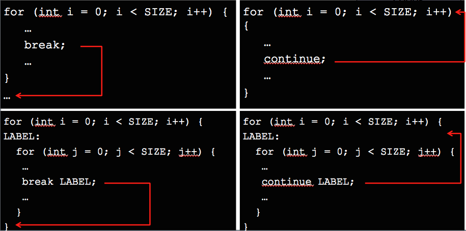

# 1.6 Εντολές Επανάληψης {#Java} 
© Γιάννης Κωστάρας

---

[<-](../1.5-ControlStatements/README.md) | [Δ](../../README.md) | [->](../1.7-Arrays/README.md)

---

Η Java διαθέτει τρεις εντολές επανάληψης: ```while```, ```for``` και ```do...while```.

## Εντολή ```while```
Σύνταξη:
```java
while (συνθήκη) {	// μπορεί να μην εκτελεστεί καμία φορά
   εντολές
}

```
Η _συνθήκη_ είναι μια λογική μεταβλητή (boolean) ή μια έκφραση που επιστρέφει λογική τιμή. Αν η _συνθήκη_ έχει τιμή ```false``` τότε τερματίζεται η εκτέλεση του βρόγχου. Αν έχει αρχικά τιμή ```false```, τότε ο βρόγχος δεν εκτελείται καμία φορά. Αν η _συνθήκη_ παίρνει συνεχώς την τιμή ```true```, τότε μιλάμε για _ατέρμονα βρόγχο_ που δεν τερματίζεται ποτέ, με αποτέλεσμα να μην μπορούμε να τερματίσουμε το πρόγραμμά μας.

Π.χ.
```java
int i = 0;
// ο έλεγχος γίνεται προτού εκτελεστεί ο βρόγχος
while (i < 10) {
   System.out.println(i++);
} // 0 1 2 3 4 5 6 7 8 9 

```

## Εντολή ```do...while```

Σύνταξη
```java
do {			// εκτελείται τουλάχιστο 1 φορά
  εντολές
} while (συνθήκη);
```
Το προηγούμενο παράδειγμα μπορεί να γραφεί και ως εξής:
```java
int i = 0;
do {
   System.out.println(i++);
} while (i < 10);
// 0 1 2 3 4 5 6 7 8 9 
```
Καθώς ο έλεγχος γίνεται στο τέλος, δηλ. αφότου εκτελεστεί ο βρόγχος, αυτός ο τύπος βρόγχου εκτελείται τουλάχιστο μια φορά.

## Εντολή ```for```
Σύνταξη:
```java
for (αρχικοποίηση μεταβλητής βρόγχου; συνθήκη; μεταβολή μεταβλητής) {
 εντολές
}
```
Το προηγούμενο παράδειγμα μπορεί να γραφεί και ως εξής:
```java
for (int i = 0; i < 10; i++) {
  System.out.print(i + " ");
}
//0 1 2 3 4 5 6 7 8 9 
```

## Εντολές ```break```, ```continue``` και ```return```
Αν και δε συνίσταται η χρήση τους, οι εντολές αυτές μας επιτρέπουν να "βγαίνουμε" από έναν βρόγχο. 



**Εικόνα 1.6.1** _Παραδείγματα χρήσης εντολών break, continue και return_

Η εντολή ```break``` σταματάει την εκτέλεση του βρόγχου και βγαίνει από τον βρόγχο (δηλ. συνεχίζει με την εντολή που ακολουθεί το βρόγχο).

Η εντολή ```continue``` αγνοεί τις εντολές που την ακολουθούν και συνεχίζει το βρόγχο από την αρχή. 

Οι εντολές αυτές δουλεύουν και δίνοντάς τους μια ετικέτα, δηλ. επιστρέφουν την εκτέλεση του προγράμματος εκεί που έχουμε ορίσει την ετικέτα.

Η εντολή ```return``` τέλος, επιστρέφει από μια μέθοδο (όπως θα δούμε παρακάτω) ή από το ίδιο το πρόγραμμα, π.χ.
```java
if (s.isEmpty()) {
	return;
}
```

## Ασκήσεις
1. Γράψτε ένα πρόγραμμα το οποίο λαμβάνει ως είσοδο ένα ποσό σε € το οποίο πιστώνεται σε έναν τραπεζικό λογαριασμό κι ένα ετήσιο επιτόκιο και υπολογίζει σε πόσα χρόνια διπλασιάζεται το αρχικό ποσό. Π.χ. έστω ότι κατατίθεται αρχικό κεφάλαιο €10,000 σε έναν τραπεζικό λογαριασμό με 5% ετήσιο επιτόκιο, τότε το κεφάλαιο θα διπλασιαστεί μετά από 15 χρόνια.
```
   Έτος 	Ισολογισμός
   0		€10000
   1		€10000 x 1.05 = €10500.00
   2		€10500 x 1.05 = €11025.00
   3		€11025.00 x 1.05 = €11576.25
   ...		...
```   
2. Πολλ/σμός αλά ρωσικά. Γράψτε ένα πρόγραμμα που διαβάζει δυο ακέραιους αριθμούς. Στη συνέχεια διαιρεί διαδοχικά τον 1ο αριθμό με το 2 (αποθηκεύοντας μόνο το ακέραιο μέρος του) μέχρις ότου να γίνει 1. Αντίστοιχα, πολλαπλασιάζει διαδοχικά τον 2ο αριθμό με το 2 τόσες φορές όσο ο 1ος να γίνει 1. Το γινόμενο των δυο αριθμών είναι το άθροισμα των αριθμών της 2ης στήλης για εκείνους τους αριθμούς της 1ης στήλης που είναι περιττοί.
   Π.χ. 
```
	45   19   19
	22   38    -
	11   76   76
	 5  152  152
	 2  304    -
	 1  608  608
 	         ---
   	     	 855
```			 
3. Υπολογίστε το το γινόμενο των κανονικών διαιρετών ενός αριθμού n (δηλ. αριθμοί μικρότεροι του n οι οποίοι διαιρούν το n χωρίς να αφήνουν υπόλοιπο). Π.χ. οι κανονικοί διαιρέτες του ```n=220``` είναι ```1, 2, 4, 5, 10, 11, 20, 22, 44, 55``` και ```110```, οπότε το γινόμενό τους ```d(220) = 284```.	

4. Μια τριπλέτα του Πυθαγόρα είναι ένα σύνολο φυσικών αριθμών, ```a < b < c```, για τους οποίους ισχύει: ```a^2 + b^2 = c^2```. Π.χ. ```32 + 42 = 9 + 16 = 25 = 52```. Υπάρχει ακριβώς μια Πυθαγόρεια τριπλέτα για την οποία ισχύει: ```a + b + c = 1000```. Βρείτε το γινόμενο ```abc```. 

## Πηγές:
1. ["The Java Tutorial"](https://docs.oracle.com/javase/tutorial/)
1. Bloch J. (2018), _Effective Java_, 3rd Edition, Addison-Wesley.
1. Deitel P., Deitel H. (2018), _Java How to Program_, 11th Ed., Safari.
1. Downey A. B., Mayfield C. (2016), _Think Java_, O' Reilly. 
1. Eckel B. (2006), _Thinking in Java_, 4th Ed., Prentice-Hall.
1. Hillar G.C. (2017), _Java 9 with JShell_, Packt.
1. Horstmann C. S. (2016), _Core Java, Volume 1 Fundamentals_, 10th Ed., Prentice-Hall.
1. Horstmann C. S. (2018), _Core Java SE 9 for the impatient_, 2nd Ed., Addison-Wesley. 
1. Naftalin M., Wadler P. (2006), _Java Generics and Collections_, O'Reilly. 
1. Sharan K. (2017), _Java 9 Revealed: For Early Adoption and Migration_, Apress.
1. Sierra K. & Bates B. (2005), _Head First Java_, 2nd Ed. for Java 5.0, O’Reilly.

---

[<-](../1.5-ControlStatements/README.md) | [Δ](../../README.md) | [->](../1.7-Arrays/README.md)

---