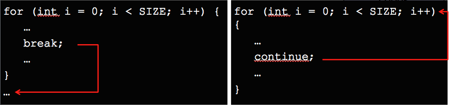

# 1.6 Εντολές Επανάληψης {#Java} 
© Γιάννης Κωστάρας

---

[<-](../1.5-ControlStatements/README.md) | [Δ](../../README.md) | [->](../1.7-Arrays/README.md)

---

Η Java διαθέτει τρεις εντολές επανάληψης: ```while```, ```for``` και ```do...while```.

## Εντολή ```while```
Σύνταξη:
```java
while (συνθήκη) {	// μπορεί να μην εκτελεστεί καμία φορά
   εντολές
}

```
Η _συνθήκη_ είναι μια λογική μεταβλητή (boolean) ή μια έκφραση που επιστρέφει λογική τιμή. Αν η _συνθήκη_ έχει τιμή ```false``` τότε τερματίζεται η εκτέλεση του βρόχου. Αν έχει αρχικά τιμή ```false```, τότε ο βρόχος δεν εκτελείται καμία φορά. Αν η _συνθήκη_ παίρνει συνεχώς την τιμή ```true```, τότε μιλάμε για _ατέρμονα βρόχο_ που δεν τερματίζεται ποτέ, με αποτέλεσμα να μην μπορούμε να τερματίσουμε το πρόγραμμά μας.

Π.χ.
```java
int i = 0;
// ο έλεγχος γίνεται προτού εκτελεστεί ο βρόχος
while (i < 10) {
   System.out.println(i++);
} // 0 1 2 3 4 5 6 7 8 9 

```

## Εντολή ```do...while```

Σύνταξη
```java
do {			// εκτελείται τουλάχιστο 1 φορά
  εντολές
} while (συνθήκη);
```
Το προηγούμενο παράδειγμα μπορεί να γραφεί και ως εξής:
```java
int i = 0;
do {
   System.out.println(i++);
} while (i < 10);
// 0 1 2 3 4 5 6 7 8 9 
```
Καθώς ο έλεγχος γίνεται στο τέλος, δηλ. αφότου εκτελεστεί ο βρόχος, αυτός ο τύπος βρόχου εκτελείται τουλάχιστο μια φορά.

## Εντολή ```for```
Σύνταξη:
```java
for (αρχικοποίηση μεταβλητής βρόχου; συνθήκη; μεταβολή μεταβλητής) {
 εντολές
}
```
Το προηγούμενο παράδειγμα μπορεί να γραφεί και ως εξής:
```java
for (int i = 0; i < 10; i++) {
  System.out.print(i + " ");
}
//0 1 2 3 4 5 6 7 8 9 
```

## Εντολές ```break```, ```continue``` και ```return```
Αν και δε συνίσταται η χρήση τους, οι εντολές αυτές μας επιτρέπουν να "βγαίνουμε" από έναν βρόχο. 



**Εικόνα 1.6.1** _Παραδείγματα χρήσης εντολών break, continue και return_

Η εντολή ```break``` σταματάει την εκτέλεση του βρόχου και βγαίνει από τον βρόχο (δηλ. συνεχίζει με την εντολή που ακολουθεί το βρόχο).

Η εντολή ```continue``` αγνοεί τις εντολές που την ακολουθούν και συνεχίζει το βρόχο από την αρχή. 

Η εντολή ```return``` τέλος, επιστρέφει από μια μέθοδο (όπως θα δούμε παρακάτω) ή από το ίδιο το πρόγραμμα, π.χ.
```java
if (s.isEmpty()) {
	return;
}
```

## Ασκήσεις
1. Γράψτε ένα πρόγραμμα το οποίο λαμβάνει ως είσοδο ένα ποσό σε € το οποίο πιστώνεται σε έναν τραπεζικό λογαριασμό κι ένα ετήσιο επιτόκιο και υπολογίζει σε πόσα χρόνια διπλασιάζεται το αρχικό ποσό. Π.χ. έστω ότι κατατίθεται αρχικό κεφάλαιο €10,000 σε έναν τραπεζικό λογαριασμό με 5% ετήσιο επιτόκιο, τότε το κεφάλαιο θα διπλασιαστεί μετά από 15 χρόνια.
```
   Έτος     Ισολογισμός
   ----     -----------
   0        €10000
   1        €10000 x 1.05 = €10500.00
   2        €10500 x 1.05 = €11025.00
   3        €11025.00 x 1.05 = €11576.25
   ...		...
```

2. Πολλ/σμός αλά ρωσικά. Γράψτε ένα πρόγραμμα που διαβάζει δυο ακέραιους αριθμούς. Στη συνέχεια διαιρεί διαδοχικά τον 1ο αριθμό με το 2 (αποθηκεύοντας μόνο το ακέραιο μέρος του) μέχρις ότου να γίνει 1. Αντίστοιχα, πολλαπλασιάζει διαδοχικά τον 2ο αριθμό με το 2 τόσες φορές όσο ο 1ος να γίνει 1. Το γινόμενο των δυο αριθμών είναι το άθροισμα των αριθμών της 2ης στήλης για εκείνους τους αριθμούς της 1ης στήλης που είναι περιττοί.
   Π.χ. 
```
	45   19   19
	22   38    -
	11   76   76
	 5  152  152
	 2  304    -
	 1  608  608
	         ---
	         855
```

3. Υπολογίστε το άθροισμα των κανονικών διαιρετών ενός αριθμού n (δηλ. αριθμοί μικρότεροι του n οι οποίοι διαιρούν το n χωρίς να αφήνουν υπόλοιπο). Π.χ. οι κανονικοί διαιρέτες του ```n=220``` είναι ```1, 2, 4, 5, 10, 11, 20, 22, 44, 55``` και ```110```, οπότε το άθροισμά τους ```d(220) = 284```.	

4. "Τέλειος" είναι ένας ακέραιος αριθμός του οποίου το άθροισμα των θετικών διαιρετών του, εκτός του ίδιου του αριθμού, είναι ίσο με τον αριθμό. Π.χ., ο μικρότερος τέλειος αριθμός είναι ο 6. Οι διαιρέτες του (εκτός του 6) είναι 1, 2, 3 και το άθροισμά τους είναι 1+2+3=6. Άλλος τέλειος αριθμός είναι ο 28 (1+2+4+7+14=28). Γράψτε ένα πρόγραμμα το οποίο θα δέχεται έναν ακέραιο θετικό αριθμό ```n``` και θα υπολογίζει όλους τους τέλειους αριθμούς από το 1 μέχρι το ```n```.

5. Μια τριπλέτα του Πυθαγόρα είναι ένα σύνολο φυσικών αριθμών, ```a < b < c```, για τους οποίους ισχύει: ```a^2 + b^2 = c^2```. Π.χ. ```3^2 + 4^2 = 9 + 16 = 25 = 5^2```. Υπάρχει ακριβώς μια Πυθαγόρεια τριπλέτα για την οποία ισχύει: ```a + b + c = 1000```. Βρείτε το γινόμενο ```abc```. 

6. Γράψτε ένα πρόγραμμα που θα αντιστρέφει τα ψηφία ενός ακέραιου αριθμού.

7. Το 2520 είναι ο μικρότερος φυσικός αριθμός που διαιρείται από όλους τους αριθμούς από το 1-10 χωρίς ν' αφήνει υπόλοιπο. Ποιος είναι ο μικρότερος φυσικός αριθμός που διαιρείται από όλους τους αριθμούς από το 1-20 χωρίς ν' αφήνει υπόλοιπο;

8. Να γραφτεί ένα πρόγραμμα που να διαβάζει ένα κείμενο και να υπολογίζει το πλήθος: (α) των μη κενών χαρακτήρων (β) των μη κενών γραμμών (γ) των λέξεων (δ) των προτάσεων και (ε) το μέσο όρο χαρακτήρων ανά λέξη και μέσο όρο λέξεων ανά πρόταση.  


---

[<-](../1.5-ControlStatements/README.md) | [Δ](../../README.md) | [->](../1.7-Arrays/README.md)

---