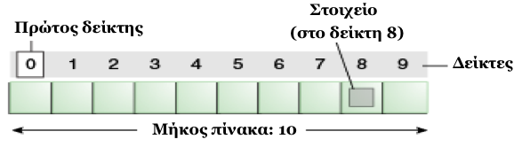
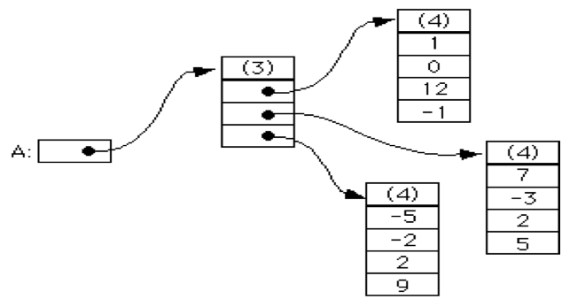

# 1.7 Πίνακες ή Συστοιχίες (Arrays){#Java} 
© Γιάννης Κωστάρας

---

[<-](../1.6-Loops/README.md) | [Δ](../../README.md) | [->](../1.8-Methods/README.md)

---

Ο _πίνακας_ ή _συστοιχία_ είναι η πιο απλή δομή δεδομένων. Αποθηκεύει ένα σύνολο στοιχείων του ίδιου τύπου δεδομένων. Τα στοιχεία του αποθηκεύονται σε συνεχόμενες θέσεις μνήμης ενώ η αναφορά σ’ ένα στοιχείο γίνεται μέσω _δεικτών_ (_indexes_). 



**Εικόνα 1.7.1** _Πίνακας_

Το 1ο στοιχείο αποθηκεύεται στη θέση ```0```:
```java
Τύπος_δεδομένων όνομα_μεταβλητής[];
```
Π.χ.
```java
// Τ[] arrayname = new Τ[n];
jshell> int SIZE = 10;
SIZE ==> 10
jshell> int[] bathmoi = new int[SIZE];
bathmoi ==> int[10] { 0, 0, …, 0}
```

### Τρόποι αρχικοποίησης πίνακα
```java
jshell> int[] numbers = { 1, 2, 3 }
numbers ==> int[3] { 1, 2, 3 }
jshell> int[] numbers2 = new int[3]
numbers2 ==> int[3] { 0, 0, 0 }
jshell> String[] strings = new String[] { "a", "b", "c" }
strings ==> String[3] { "a", "b", "c" }
jshell> strings.length  
$1==> 3
```
Η εντολή ```length``` επιστρέφει το μέγεθος του πίνακα, όχι πόσα στοιχεία έχουν καταχωρηθεί σ’ αυτόν. Π.χ.
```java
jshell> int[] array = new int[3]
array ==> int[3] { 0, 0, 0 } 
jshell> array[0]=10
$2 ==> 10
jshell> array.length
$3==> 3
```

### Βασικές λειτουργίες

Ο πίνακας αποτελεί μια από τις πολλές _δομές δεδομένων_ της γλώσσας Java. Θα εξετάσουμε αυτές τις δομές δεδομένων όσων αφορά τις ακόλουθες λειτουργίες:

| Προσπέλαση | ```int b = bathmoi[1]; // 2ο στοιχείο```
| Εισαγωγή/εκχώρηση | ```bathmoi[5] = 18```
| Διαγραφή | (βλ. παρακάτω)
| Αναζήτηση | ```int index = Arrays.binarySearch(bathmoi, key)``` 
| Ταξινόμηση | ```Arrays.sort(bathmoi)```
| Αντιγραφή | ```int[] b=Arrays.copyOfRange(bathmoi, 0, SIZE)```
| Συγχώνευση | (βλ. παρακάτω)
| Διαχωρισμός | (βλ. παρακάτω)
| Μήκος/Μέγεθος | ```bathmoi.length```

## Πολυδιάστατοι πίνακες
Ο ορισμός
```java
// Τ[] arrayname = new Τ[n];
```
ορίζει έναν μονοδιάστατο πίνακα. Η έννοια του μονοδιάστατου πίνακα μπορεί να γενικευθεί και σε πίνακες περισσοτέρων διαστάσεων, π.χ. δισδιάστατων, τρισδιάστατων κ.ο.κ.

Π.χ. ένας δισδιάστατος πίνακας ορίζεται ως εξής:
```java
// Τ[][] arrayname = new Τ[m][n];
jshell> int m = 2, n = 3;
m ==> 2
n ==> 3
jshell> int[][] matrix = new int[m][n];
matrix ==> int[2][] {int[3] {0, 0, 0}, int[3] {0, 0, 0}}
```
Τρόποι ορισμού δισδιάστατου πίνακα:
```java
jshell> int[][] numbers = { { 1, 2, 3 }, { 4, 5, 6 } }
numbers ==> int[2][] { int[3] { 1, 2, 3 }, int[3] { 4, 5, 6 }}
jshell> int[][] numbers2 = new int[2][3];
numbers2 ==> int[2][] { int[3] { 0, 0, 0 }, int[3] { 0, 0, 0}}
jshell> int[][] a = { {1}, {2, 3}, null }; // πίνακας με γραμμές διαφόρων μεγεθών (ragged table)
a ==> int[3][] { int[1] { 1 }, int[2] { 2, 3 }, null }
jshell> a.length  // επιστρέφει τον αρ. των γραμμών του πίνακα
$3==> 3
jshell> a[0]
$4 ==> int[1] {1}
jshell> a[0].length
$5 ==> 1
jshell> numbers2[0][1] = 6
$6 ==> 6
```

| 1 | 2 | 3
| 4 | 5 | 6



**Εικόνα 1.7.2** _Εσωτερική αναπαράσταση δισδιάστατου πίνακα_

## Η κλάση ```Arrays```
Η κλάση ```Arrays``` παρέχει χρήσιμες μεθόδους για τους πίνακες.
```java
jshell> String[] strings = new String[3];
strings ==> String[3] { null, null, null }

jshell> import java.util.Arrays;

jshell> Arrays.fill(strings, "a");

jshell> strings
strings ==> String[3] { "a", "a", "a" }

jshell> Arrays.fill(strings, 1, 2, "b");

jshell> strings
strings ==> { "a", "b", "a" }

jshell> String[] strings_ = new String[3];
strings_ ==> String[3] { null, null, null }

jshell> Arrays.fill(strings_, "a");

jshell> strings_
strings_ ==> String[3] { "a", "a", "a" }

jshell> Arrays.mismatch(strings, strings_);
$1 ==> 1
```
Προτού τη χρησιμοποιήσουμε, θα πρέπει να εισάγουμε το αντίστοιχο πακέτο (package) ```java.util.Arrays```. Η ```mismatch()``` είναι μια πολύ γρήγορη μέθοδος που προστέθηκε στην έκδοση 11 και μας επιτρέπει να συγκρίνουμε αν δυο συστοιχίες είναι ίσες (```-1```), διαφορετικά επιστρέφει τον πρώτο δείκτη όπου οι δυο συστοιχίες διαφέρουν. 

## Βασικές λειτουργίες πινάκων

### Προσπέλαση στοιχείων πίνακα
```java
jshell> int[] array = new int[10];
array ==> int[10] { 0, 0, 0, ..., 0 }
jshell> for (int i = 0; i < array.length; i++) {
          array[i] = i;
        }; 
jshell> array 
array ==> int[10] { 0, 1, 2, ... }
jshell> for (int e : array) {
           System.out.print(e + " ");
        }
0 1 2 3 4 5 6 7 8 9 
```
Σ' αυτό το παράδειγμα βλέπουμε μια νέα σύνταξη της εντολής βρόγχου ```for``` που χρησιμοποιείται για να προσπελάζουμε πίνακες (αλλά και άλλες συλλογές όπως θα δούμε αργότερα).

Ας δούμε πως μπορούμε να προσπελάσουμε τα στοιχεία ενός δισδιάστατου πίνακα:

```java
jshell> int[][] matrix = new int[5][5]; 
matrix ==> int[5][] { int[5] { 0, 0, 0, 0, 0 }, int[5] { 0,  ... int[5] { 0, 0, 0, 0, 0 } }
jshell> for (int i = 0; i < matrix.length; i++) {
	    for (int j = 0; j < matrix[i].length; j++) {
		matrix[i][j] = i+j;
	    }
        } 
jshell> for (int[] numbers : matrix) {
	    for (int e : numbers) {
		System.out.print(e + " ");
	    }
	    System.out.println();	
	  }
0 1 2 3 4 
1 2 3 4 5 
2 3 4 5 6 
3 4 5 6 7 
4 5 6 7 8 
```

### Εκτύπωση πινάκων
```java
jshell> int[] array = {1, 2, 3, 4, 5};
array ==> int[5] {1, 2, 3, 4, 5}
jshell> Arrays.toString(array);
$1 ==> "[1, 2, 3, 4, 5]"
jshell> int[][] array2d = {
{1, 2, 3},
{4, 5, 6},
{7, 8, 9}
};
array2d ==> int[3][] { int[3] { 1, 2, 3 }, int[3] { 4, 5, 6 }, int[3] { 7, 8, 9 } }
jshell> Arrays.deepToString(array2d)
$2 ==> "[[1, 2, 3], [4, 5, 6], [7, 8, 9]]"
```

### Ταξινόμηση πινάκων
```java
jshell> int[] array = {2, 9, -1, 4, 13};
$3 ==> int[5] {2, 9, -1, 4, 13}
jshell> Arrays.sort(array); // με αριθμητική σειρά
jshell> Arrays.toString(array);
$4 ==> "[-1, 2, 4, 9, 13]"
jshell> Arrays.sort(array, 0, array.length, Collections.reverseOrder()); // με αντίστροφη αριθμητική σειρά
Error
jshell> String[] names = {"Κώστας", "Γιάννης", "Κατερίνα", "Μαρία", "Ανάργυρος"};
names ==> String[5] { "Κώστας", "Γιάννης", "Κατερίνα", "Μαρία", "Ανάργυρος" }
jshell> Arrays.sort(names, 0, names.length, Collections.reverseOrder()); // λεξικογραφικά
// "["Μαρία", "Κώστας", "Κατερίνα", "Γιάννης", "Ανάργυρος"]"
```

### Αναζήτηση στοιχείων σε πίνακα
```java
jshell> int[] array = {1, 2, 3, 4, 5};
array ==> int[5] {1, 2, 3, 4, 5}
jshell> Arrays.binarySearch(array, 4); // εύρεση του 4
$5 ==> 3  // επιστρέφει τον δείκτη αν βρέθηκε, ή έναν αρνητικό αριθμό (-(insertion point) - 1) αν δε βρέθηκε 
```
Ο αλγόριθμος _δυαδικής αναζήτησης (BinarySearch)_ βρίσκει ένα στοιχείο σε μία _ταξινομημένη_ λίστα ψάχνοντας κάθε φορά στη μέση του πίνακα. Αν το στοιχείο είναι μεγαλύτερο τότε ο πίνακας μοιράζεται στη μέση και ο αλγόριθμος επαναλαμβάνεται μόνο στο δεξί τμήμα του πίνακα έως ότου βρεθεί το στοιχείο.

### Αντιγραφή πινάκων
```java
jshell> int[] newArray = Arrays.copyOf(array, array.length+1); // δημιουργία ενός newArray μήκους array.length+1 με τα στοιχεία του array
newArray ==> int[6] { 1, 2, 3, 4, 5, 0 }
jshell> int[] newArray = Arrays.copyOfRange(array, 1, 2); // αντιγραφή μέρους του αρχικού πίνακα
newArray ==> int[1] { 2 }
jshell> int[] clonedArray = array.clone()
clonedArray ==> int[5] { 1, 2, 3, 4, 5 }
```
ή
```java
System.arraycopy( <source table>, <source start index>, 
			<dest table>, <dest start index>, <dest end index>);
```
π.χ.
```java
jshell> int[] array2 = new int[5]
array2 ==> int[5] { 0, 0, 0, 0, 0 }

jshell> System.arraycopy(array, 0, array2, 0, 5);

jshell> array2
array2 ==> int[5] { 1, 2, 3, 4, 5 }
```

### Διαγραφή στοιχείων πινάκων
```java
jshell> int[] array = {1, 2, 3, 4, 5};
array ==> int[5] {1, 2, 3, 4, 5}
// Πώς μπορούμε να διαγράψουμε ένα στοιχείο;
jshell> int[] newArray = new int[array.length-1]
newArray ==> int[4] {0, 0, 0, 0}
jshell> int index = 1; // θέλουμε να διαγράψουμε το 2ο στοιχείο
jshell> System.arraycopy(array, 0, newArray, 0, index);
// αντιγραφή από το 0 μέχρι το array[index-1]
jshell> newArray
newArray ==> int[4] { 1, 0, 0, 0 }
jshell> System.arraycopy(array, index + 1, newArray, index, array.length - index - 1); // αντιγραφή από array[index+1] μέχρι array[array.length-1]
jshell> newArray
newArray ==> int[4] { 1, 3, 4, 5 }
```

### Ισότητα πινάκων
```java
jshell> Arrays.equals(array, newArray); 
$1 ==> false
jshell> Arrays.deepEquals(array2d, newArray2d); // για n-διαστάσεις
$1 ==> false
```

## Κατηγορίες δισδιάστατων πινάκων 

* _Τετραγωνικός_ λέγεται ο δισδιάστατος πίνακας του οποίου το μέγεθος των δυο διαστάσεων είναι ίσο (δηλ. m=n)
* _Συμμετρικός_ λέγεται ένας τετραγωνικός πίνακας με στοιχεία ```a[i][j]=a[j][i]``` για ```1<i,j<n```. Π.χ.
	
| 1 | 6 | 7 | 9
| 6 | 2 | 5 | 8
| 7 | 5 | 3 | 0
| 9 | 8 | 0 | 4

* _Τριγωνικοί_ ονομάζονται οι συμμετρικοί πίνακες που έχουν μηδενικά στοιχεία από τη μια μεριά της διαγωνίου. 
Διακρίνονται σε _άνω τριγωνικούς_ (```a[i][j] = 0``` αν ```i>j```) και _κάτω τριγωνικούς_ (```a[i][j] = 0``` αν ```i<j```). Αν τα στοιχεία της διαγωνίου είναι επίσης μηδέν, τότε ο πίνακας λέγεται _αυστηρά πάνω (κάτω) τριγωνικός_. Τέλος, η γενίκευση των τριγωνικών πινάκων σε ανώτερες διαστάσεις, ονομάζεται _τετραεδικός πίνακας_.
Π.χ. ένας κάτω τριγωνικός πίνακας
	
| 1 | 6 | 0 | 0
| 6 | 2 | 0 | 0
| 7 | 5 | 3 | 0
| 9 | 8 | 0 | 4

* Ένας _τριδιαγώνιος_ πίνακας είναι ένας τετραγωνικός πίνακας με μηδενικά όλα τα στοιχεία εκτός από τα στοιχεία της κύριας διαγωνίου και των δυο διπλανών προς την κύρια διαγώνιο. Π.χ.
	
| 1 | 6 | 0 | 0
| 6 | 2 | 9 | 0
| 0 | 5 | 3 | 8
| 0 | 0 | 9 | 4


## Ασκήσεις

1. Δοθέντων 2 πινάκων a και b γράψτε ένα πρόγραμμα που θα συγχωνεύει τους δυο πίνακες σ’ έναν τρίτο. 
2. Δοθέντος ενός πίνακα ακεραίων, δημιουργήστε δυο πίνακες που θα περιέχουν ο ένας τα ζυγά και ο άλλος τα μονά στοιχεία του πίνακα
3. Η δυαδική αναζήτηση απαιτεί τα στοιχεία του πίνακα να είναι ταξινομημένα. Πώς θα μπορούσατε να υλοποιήσετε τον αλγόριθμο χωρίς τη χρήση της ```Arrays.binarySearch```;
4. Η δυαδική αναζήτηση απαιτεί τα στοιχεία του πίνακα να είναι ταξινομημένα. Γράψτε έναν αλγόριθμο αναζήτησης που δουλεύει τόσο σε ταξινομημένους όσο και σε αταξινόμητους πίνακες.
5. Ο αλγόριθμος _ταξινόμησης με επιλογή (selection sort)_ ταξινομεί έναν πίνακα ως εξής: σε κάθε βήμα i βρίσκει το i-οστό πιο μικρό στοιχείο και το τοποθετεί στην θέση i. Υλοποιήστε αυτόν τον αλγόριθμο. 

## Πηγές:
1. ["The Java Tutorial"](https://docs.oracle.com/javase/tutorial/)
1. Bloch J. (2018), _Effective Java_, 3rd Edition, Addison-Wesley.
1. Deitel P., Deitel H. (2018), _Java How to Program_, 11th Ed., Safari.
1. Downey A. B., Mayfield C. (2016), _Think Java_, O' Reilly. 
1. Eckel B. (2006), _Thinking in Java_, 4th Ed., Prentice-Hall.
1. Hillar G.C. (2017), _Java 9 with JShell_, Packt.
1. Horstmann C. S. (2016), _Core Java, Volume 1 Fundamentals_, 10th Ed., Prentice-Hall.
1. Horstmann C. S. (2018), _Core Java SE 9 for the impatient_, 2nd Ed., Addison-Wesley. 
1. Long F. et. al. (2014), _Java Coding Guidelines_, Addison-Wesley.
1. Samoylov N. (2019), _Learn Java 12 Programming_, Packt.
1. Sharan K. (2017), _Java 9 Revealed: For Early Adoption and Migration_, Apress.
1. Sierra K. & Bates B. (2005), _Head First Java_, 2nd Ed. for Java 5.0, O’Reilly.

---

[<-](../1.6-Loops/README.md) | [Δ](../../README.md) | [->](../1.8-Methods/README.md)

---