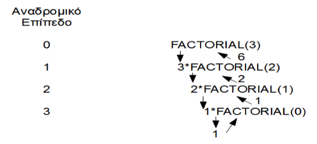

# 1.8 Μέθοδοι {#Java} 
© Γιάννης Κωστάρας

---

[<-](../1.7-Arrays/README.md) | [Δ](../../README.md)

---

## Διαίρει και βασίλευε

Για να αντιμετωπιστούν πολύπλοκα προβλήματα, ένας καλός τρόπος είναι ο μοιρασμός τους («σπάσιμο») σε μικρότερα. Άλλος λόγος είναι η αποφυγή επαναλαμβανόμενου κώδικα. Αν επαναλαμβάνουμε τμήματα κώδικα πολλές φορές, τότε αν χρειαστεί ν' αλλάξουμε αυτό το τμήμα κώδικα, θα πρέπει να το κάνουμε σε όλα τα αντίγραφα. 

**Αξίωμα: «Μην Επαναλαμβάνεσαι» (DRY – Don’t Repeat Yourself)**

Στη Java αυτό το πετυχαίνουμε τμηματοποιώντας τον κώδικα σε μεθόδους.

Μια μέθοδος ορίζεται ως εξής:
```java
τύπος_επιστροφής όνομα_μεθόδου(παράμετροι);
```
Π.χ.
```java
jshell> double perimeter(double r) {  // y = perimeter(r)
           return 2*Math.PI*r;
        }
| created method perimeter(double)
jshell> int x = 10
x ==> 10
jshell> perimeter(x)
$3 ==> 62.83185307179586
jshell> /methods
|    perimeter (double)double
```
Παραπάνω ορίσαμε μια μέθοδο ```perimeter()``` η οποία λαμβάνει ως όρισμα (παράμετρο) έναν ```double``` και επιστρέφει έναν ```double```. Μια μέθοδος είναι σαν μια συνάρτηση στα μαθηματικά, π.χ. ```y = f(x)```. Δέχεται ένα όρισμα ```x``` και επιστρέφει μια τιμή ```y```.

```java
jshell> void myPrint(String... lines) {  // varargs
           for (String e : lines) {
		       System.out.println(e);
           }
        }    
|  created method myPrint(String...)
jshell> String[] sentences = new String[] {
"Καλήν εσπέραν άρχοντες",
"πώς είναι ο ορισμός σας"
};
sentences ==> String[2] { "Καλήν εσπέραν άρχοντες", ... }
jshell> myPrint(sentences)
Καλήν εσπέραν άρχοντες
πώς είναι ο ορισμός σας
```
Η σύνταξη ```String...``` είναι ισοδύναμη με ```String[]``` και ονομάζεται _vararg_.

## Πέρασμα Παραμέτρων δια τιμής (By value) και δια αναφοράς (by reference)
Όταν καλέσαμε την μέθοδο ```perimeter(x)``` παιρνώντας της την παράμετρο ```x```, αυτό που συμβαίνει πίσω από τη σκηνή είναι ότι το όρισμα ```r``` παίρνει την τιμή της παραμέτρου ```x``` (δηλ. την τιμή ```10```) που χρησιμοποιείται στους υπολογισμούς της περιμέτρου. Αυτό καλείται _πέρασμα παραμέτρων με τιμή (by value)_ καθώς η τιμή της παραμέτρου κλήσης ```x``` αντιγράφεται στο όρισμα ```r```. Αν αλλάξουμε την τιμή της ```r```, η τιμή της ```x``` δεν αλλάζει, καθώς μόνο η τιμή της αντιγράφηκε στην ```r```. Αυτό ισχύει κατά κανόνα όταν τα ορίσματα είναι πρωτογενείς τύποι. 

```java
jshell> void changeParameter(int i) {
   ...>    i = 10;
   ...> }
|  created method changeParameter(int)

jshell> int a = 3
a ==> 3

jshell> changeParameter(a)

jshell> a
a ==> 3
```
Στο παραπάνω παράδειγμα δημιουργήσαμε μια μέθοδο ```changeParameter()``` η οποία δέχεται ένα όρισμα τύπου ```int``` και το αλλάζει στο σώμα της μεθόδου (αλλάζει την τιμή του σε ```10```). Στη συνέχεια καλούμε αυτή τη μέθοδο παιρνώντας της την μεταβλητή ```a``` την οποία έχουμε αρχικοποιήσει στην τιμή ```3```. Ενώ περιμένουμε η μέθοδος ν' αλλάξει την τιμή της μεταβλητής ```a``` σε ```10```, αυτό δε συμβαίνει, και η τιμή της ```a``` παραμένει ```3```. Όπως εξηγήσαμε πιο πάνω, επειδή ο ```int``` είναι πρωτογενής τύπος (raw type) δημιουργείται ένα _αντίγραφο_ της τιμής της ```a``` και το αντίγραφο αυτό είναι που τροποποιείται μέσα στο σώμα της μεθόδου, αφήνοντας την τιμή της αρχικής μεταβλητής ```a``` ανέπαφη.

Όταν τα ορίσματα των μεθόδων είναι όμως τύποι κλάσεων (όπως θα δούμε στα μαθήματα της επόμενης εβδομάδας) ή πίνακες (arrays) τότε δεν αντιγράφεται η τιμή τους, αλλά αντιγράφεται η διεύθυνση μνήμης του αντικειμένου/πίνακα στην μεταβλητή του ορίσματος, γι' αυτό κι αυτή η περίπτωση ονομάζεται _πέρασμα παραμέτρων με αναφορά (by reference)_. Έτσι στο ακόλουθο παράδειγμα, το όρισμα ```array``` αναφέρεται στη θέση μνήμης που δείχνει ο πίνακας ```a```. Αυτό σημαίνει ότι ο κώδικας της μεθόδου ```printArray()``` τροποποιώντας το 1ο στοιχείο του ορίσματος ```array```, τροποποιεί τα δεδομένα του πίνακα ```a```, αφού η ```array``` δείχνει στην ίδια θέση μνήμης με την ```a```. Γι' αυτό το λόγο θέλει μεγάλη προσοχή όταν αλλάζουμε τις τιμές των ορισμάτων όταν αυτά είναι αντικείμενα/συστοιχίες. Θα δούμε ακόμα ένα παράδειγμα στα μαθήματα της επόμενης εβδομάδας όταν θα μιλήσουμε για κλάσεις και αντικείμενα κλάσεων.

```java
jshell> void printArray(int[] array) {
   ...>     array[0]=100;
   ...>     for (int i=0; i<array.length; i++) {
   ...>         System.out.print(array[i] + ", ");
   ...>     }
   ...>     System.out.println();
   ...> }
|  created method printArray(int[])

jshell> int[] a = {1, 2, 3, 4, 5};
a ==> int[5] { 1, 2, 3, 4, 5 }

jshell> printArray(a)
100, 2, 3, 4, 5, 

jshell> a
a ==> int[5] { 100, 2, 3, 4, 5 }
```

## Εμβέλεια μεταβλητών

Οι μεταβλητές είναι ορατές μόνο στο μπλοκ που ορίζονται μέσα σε { } και σε εμφωλιασμένα μπλοκ.

```java
{                                     __
   int x;                               |
   {                           __       |
	int y;                  | y    | x
   }                           __       |
   ...  // η y δεν υπάρχει              |
}                                      __
```
```java
void printTree(int treeWidth) {
   int i;                                              __
   for (i = 1; i < treeWidth; i = i + 2) {               |
      int j;                                       __    |
      for (j = 0; j < (treeWidth - i) / 2; j++)	     |   |
         System.out.print(' ');                      |   |
      for (j = 0; j < i; j++)                        |   |
         System.out.print('*');	                     |   |
      System.out.println();                          |   |
   }                                                __   |
}                                                       __
```

## Αναδρομή
Μια μέθοδος ονομάζεται αναδρομική όταν καλεί τον εαυτό της.

```java
// υπολογισμός του n παραγοντικό
jshell> int factorial(int n) {
	     if (n <= 1) {
        	return 1;
	     } else {
		    return n * factorial(n-1);
	     }	
        }
|  created method factorial(int)
jshell> factorial(3)
$4 ==> 6
```


**Εικόνα 1.8.1** _Υπολογισμός παραγοντικού αναδρομικά_

Η ```factorial()``` καλεί τη ```factorial()``` μέσα στο σώμα της. Μια αναδρομική μέθοδος θα πρέπει να έχει μια συνθήκη τερματισμού διαφορετικά δε θα τερματίσει ποτέ. Η ```factorial()``` διαθέτει τη συνθήκη ```if (n <= 1)``` που πρέπει να κληθεί τελικά. 

## Ασκήσεις
1. Να γράψετε δυο μεθόδους που θα δέχονται ως παραμέτρους την ακτίνα σφαίρας και θα υπολογίζουν η μία την επιφάνεια και η άλλη τον όγκο της σφαίρας. 
2. Να γράψετε μια μέθοδο που μετράει τα κεφαλαία και μικρά γράμματα σε μια φράση που περνιέται σ’ αυτή ως παράμετρος. 
3. Να γράψετε μια μέθοδο που λαμβάνει ως παράμετρο έναν πίνακα από αριθμούς ή ένα vararg και επιστρέφει έναν πίνακα με τα μοναδικά στοιχεία του αρχικού. 
4. Να γράψετε μέθοδο ```initials(String text)``` που δέχεται ως είσοδο ένα κείμενο και επιστρέφει το κείμενο με το αρχικό μόνο σύμβολο κάθε λέξης του (π.χ. αν ```text = "Καλημέρα σας"```, επιστρέφει ```"Κ. Σ."```).
5. Να υλοποιήσετε στη Java το κόσκινο του Ερατοσθένη για να υπολογίσετε όλους τους πρώτους αριθμούς μέχρι έναν συγκεκριμένο ακέραιο ```n``` (```void Eratosthenis(int n)```) όπως περιγράφεται στη [Βικιπέδια](https://el.wikipedia.org/wiki/%CE%9A%CF%8C%CF%83%CE%BA%CE%B9%CE%BD%CE%BF_%CF%84%CE%BF%CF%85_%CE%95%CF%81%CE%B1%CF%84%CE%BF%CF%83%CE%B8%CE%AD%CE%BD%CE%B7).
6. Επαναλάβετε την άσκηση 2 (Αλγόριθμος κρυπτογράφησης του Καίσαρα) του 4ου μαθήματος γράφοντας δυο γενικές μεθόδους ```String encrypt(String plainText, int key)``` και ```String decrypt(String encryptedText, int key)``` που θα κωδικοποιούν και θα αποκωδικοποιούν ένα αλφαριθμητικό που περνιέται ως παράμετρος σύμφωνα με τον αλγόριθμο κρυπτογράφησης του Καίσαρα.
7. Να γραφτεί μια μέθοδος ```boolean anagram(String s1, String s2)``` που θα δέχεται δυο συμβολοσειρές και επιστρέφει ```true``` αν η μία είναι αναγραμματισμός της άλλης. Π.χ. η λέξη ```φάρος``` είναι αναγραμματισμός της λέξης ```αφρός```.
8. Να γράψετε μια αναδρομική μέθοδο ```long sum(int n)``` που θα υπολογίζει το άθροιμα ```1+2+...+n```. 
9. Να γράψετε μια αναδρομική μέθοδο που θα υπολογίζει τον αριθμό fibonacci. Ο αριθμός fibonacci ορίζεται ως: ```fib(n) = fib(n-1) + fib(n-2)```. **Υπόδειξη:** _Υπάρχει και ένας πιο γρήγορος αναδρομικός αλγόριθμος υπολογισμού_:

   * ```f(2n)=2*f(n-1)*f(n) + f(n)*f(n)```, αν ο ```n``` είναι ζυγός
   * ```f(2n-1)=f(n)*f(n) + f(n-1)*f(n-1)```, αν ο ```n``` είναι μονός

   _(Προσέξτε να διαιρέσετε με το 2 για να υπολογίσετε το f(n))_.
   
10) Να γραφτεί μια αναδρομική μέθοδο που θα υπολογίζει το Μέγιστο Κοινό Διαιρέτη (ΜΚΔ) δυο φυσικών αριθμών ```m``` και ```n``` σύμφωνα με τον αλγόριθμο του Ευκλείδη:
```
           n              , αν n<=m και m mod n = 0  
ΜΚΔ(m,n) = ΜΚΔ(m, n)      , αν m < n
           ΜΚΔ(m, m mod n), διαφορετικά
```

## Πηγές:
1. ["The Java Tutorial"](https://docs.oracle.com/javase/tutorial/)
1. Bloch J. (2018), _Effective Java_, 3rd Edition, Addison-Wesley.
1. Deitel P., Deitel H. (2018), _Java How to Program_, 11th Ed., Safari.
1. Downey A. B., Mayfield C. (2016), _Think Java_, O' Reilly. 
1. Eckel B. (2006), _Thinking in Java_, 4th Ed., Prentice-Hall.
1. Hillar G.C. (2017), _Java 9 with JShell_, Packt.
1. Horstmann C. S. (2016), _Core Java, Volume 1 Fundamentals_, 10th Ed., Prentice-Hall.
1. Horstmann C. S. (2018), _Core Java SE 9 for the impatient_, 2nd Ed., Addison-Wesley. 
1. Long F. et. al. (2014), _Java Coding Guidelines_, Addison-Wesley.
1. Samoylov N. (2019), _Learn Java 12 Programming_, Packt.
1. Sharan K. (2017), _Java 9 Revealed: For Early Adoption and Migration_, Apress.
1. Sierra K. & Bates B. (2005), _Head First Java_, 2nd Ed. for Java 5.0, O’Reilly.
1. [Java Notes for Professionals](https://books.goalkicker.com/JavaBook/JavaNotesForProfessionals.pdf)

---

[<-](../1.7-Arrays/README.md) | [Δ](../../README.md)

---