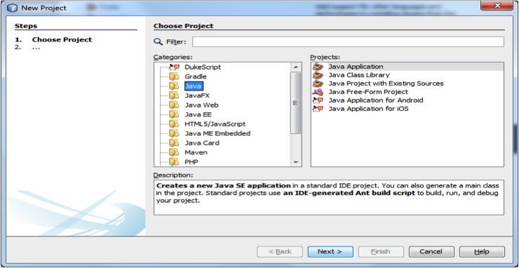
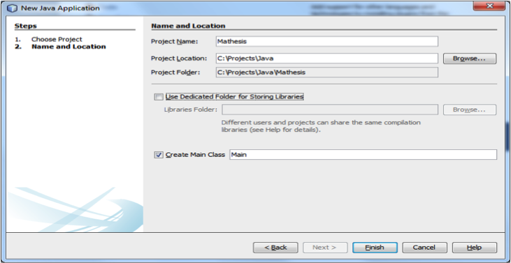
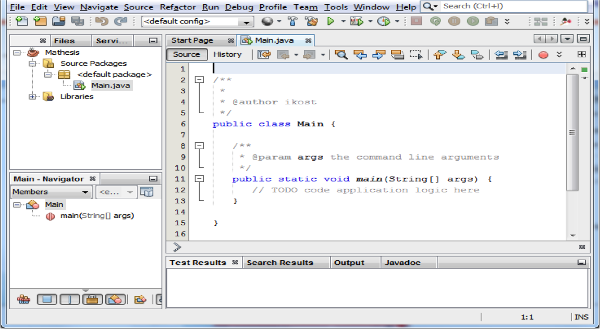
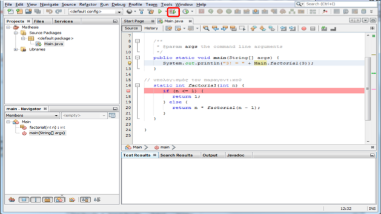
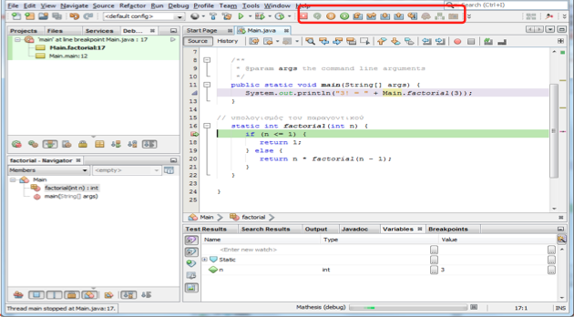

# 1.9 Αποσφαλμάτωση {#Java} 
© Γιάννης Κωστάρας

---

[Δ](../../README.md) | [<-](../1.8-Methods/README.md)

---

«Αποσφαλμάτωση» ή «εκσφαλμάτωση» (debugging) ονομάζεται η μεθοδική διαδικασία εύρεσης και εξάλειψης σφαλμάτων κώδικα ενός προγράμματος υπολογιστή ώστε να συμπεριφέρεται όπως προβλέπεται.

Η λέξη “Bug” (ή _σφάλμα_ στην ελληνική του απόδοση) προέρχεται από τη ναύαρχο Grace Hopper το 1940 καθώς εργαζόταν σε έναν Η/Υ τύπου Mark II στο Harvard. Η δυσλειτουργία του προγράμματος οφειλόταν σ’ ένα ζωύφιο (bug) που είχε κολλήσει σ’ ένα κύκλωμα, οπότε η διαδικασία αποκόλλησής του ονομάστηκε _debugging_. (Wikipedia)

Διαδικασία:

1. Πίστεψε ότι το πρόβλημα μπορεί να λυθεί και επέμενε μέχρι τη λύση του
1. Επανάληψη/επιβεβαίωση του προβλήματος (αν το πρόβλημα είναι αναπαραγώσιμο)
1. Απομόνωση του σημείου που εμφανίζεται το σφάλμα (συνήθως από τα αρχεία καταγραφής – logs)
1. Αναγνώριση της αιτίας που το προκαλεί
1. Διόρθωση του σφάλματος
1. Επιβεβαίωση της διόρθωσης

Με τη βοήθεια ενός _αποσφαλματωτή (debugger)_, ωθούμε το πρόγραμμα να εισέλθει σε μια συγκεκριμένη κατάσταση ώστε να εμφανιστεί το πρόβλημα.

Το NetBeans περιλαμβάνει έναν visual debugger που διευκολύνει τη διαδικασία.

## Εισαγωγή στο NetBeans
Ας δούμε πώς μπορούμε να χρησιμοποιήσουμε τον οπτικό αποσφαλματωτή του NetBeans. Κατ' αρχήν θα πρέπει να δημιουργήσουμε ένα νέο έργο (project). Από το μενού **File --> New Project** επιλέξτε την κατηγορία **Java** και το Project **Java Application**, όπως φαίνεται στην παρακάτω εικόνα, και πατήστε **Next**.



**Εικόνα 1.9.1** _Δημιουργία νέου έργου Java (Βήμα 1)_

Δώστε ένα όνομα για το έργο και επιλέξτε το φάκελο στον οποίο θα αποθηκευθεί (βλ. Εικόνα 2).



**Εικόνα 1.9.2** _Δημιουργία νέου έργου Java (Βήμα 2)_

Όπως βλέπετε στην εικόνα 3, έχει δημιουργηθεί μια νέα κλάση ```Main``` η οποία περιλαμβάνει τη στατική μέθοδο ```main()```.
 


**Εικόνα 1.9.3** _Δημιουργία κενού έργου Java_

Επικολλήστε τον παρακάτω κώδικα, όπως φαίνεται στην εικόνα 4.

```java
public static void main(String[] args) {
	System.out.println("3! = " + Main.factorial(3));
}

static int factorial(int n) {
	if (n <= 1) {
		return 1;
	} else {
		return n * factorial(n - 1);
	}
}
```

## Αποσφαλμάτωση με το NetBeans

Κάντε κλικ πάνω στον αριθμό γραμμής που ξεκινά η μέθοδος ```factorial()``` για να εισάγετε ένα _σημείο παύσης (breakpoint)_. Στη συνέχεια πατήστε το κουμπί **Debug** όπως φαίνεται στην παρακάτω εικόνα.



**Εικόνα 1.9.3** _Εκκίνηση του αποσφαλματωτή_

Η εκτέλεση του προγράμματος θα ξεκινήσει και θα σταματήσει στη γραμμή που 'χετε ορίσει το σημείο παύσης. Από δω και πέρα μπορείτε να χρησιμοποιήσετε τα κουμπιά αποσφαλμάτωσης για να μετακινηθείτε γραμμή-γραμμή στον κώδικα, να εξετάσετε τις τιμές των μεταβλητών κλπ. 



**Εικόνα 1.9.5** _Παύση του αποσφαλματωτή σ' ένα σημείο παύσης_

Αν επιλέξατε να μην εγκαταστήσετε ένα ΟΠΕ στον Η/Υ σας, τότε μπορείτε να χρησιμοποιήσετε αυτόν τον [online αποσφαλματωτή](http://www.pythontutor.com/visualize.html#mode=edit) με τον οποίο μπορείτε επίσης να οπτικοποιήσετε την εκτέλεση του προγράμματός σας βήμα-βήμα.

## Πηγές:
1. [Αποσφαλμάτωση](https://el.wikipedia.org/wiki/%CE%91%CF%80%CE%BF%CF%83%CF%86%CE%B1%CE%BB%CE%BC%CE%AC%CF%84%CF%89%CF%83%CE%B7), Wikipedia
1. Spinellis D. (2017), _Effective Debugging_, Addison-Wesley.
1. [Using the Visual Debugger in NetBeans IDE](https://netbeans.org/kb/docs/java/debug-visual.html)

---

[Δ](../../README.md) | [<-](../1.8-Methods/README.md)

---