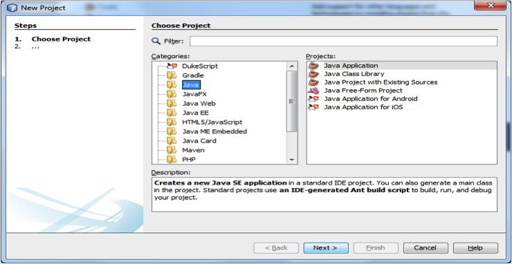
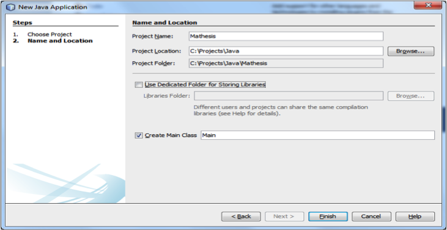
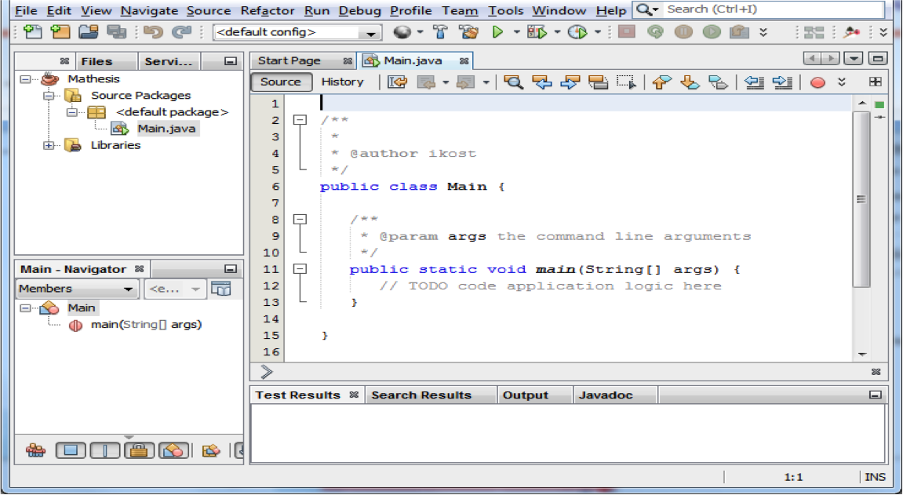
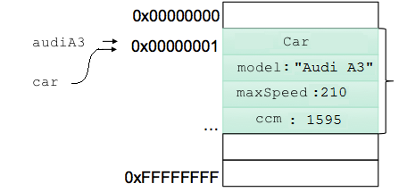

# 2.1 Αντικειμενοστραφής Προγραμματισμός {#Java} 
© Γιάννης Κωστάρας

---

[Δ](../../README.md) | [->](../2.2-UML/README.md)

---

Καθώς ο κόσμος μας αποτελείται από αντικείμενα, αναπαριστώντας τα με κάποιον τρόπο στους Η/Υ έφερε μια νέα επανάσταση στην ανάπτυξη εφαρμογών. Οι εφαρμογές που βασίζονται στα αντικείμενα είναι πιο εύκολες στην κατανόηση και στη συντήρηση.

## Κλάσεις και Αντικείμενα
Η Java διαθέτει δυο κατηγορίες τύπων δεδομένων:

* Αρχέγονους ή πρωτογενείς (raw data types) (π.χ. ```int```, ```float``` κλπ.)
* Κλάσεις (π.χ. ```String, Integer, Double``` κλπ.)

Μια _κλάση_ (class) είναι όπως ένα αρχιτεκτονικό σχέδιο, ένα πρότυπο (καλούπι), μια αφαιρετική εικόνα της πραγματικότητας που περιγράφει τις _ιδιότητες (γνωρίσματα)_ ενός αντικειμένου καθώς και τις _ενέργειες_ που μπορούν να εκτελεστούν σ’ αυτές τις ιδιότητες. Κάθε κλάση περιγράφει μία μοναδική οντότητα με ξεχωριστές ιδιότητες (γνωρίσματα). Οι κλάσεις οργανώνονται σε δενδρικές δομές μοναδικού πατρικού κόμβου (_κληρονομικότητα_).

Π.χ. το _αυτοκίνητο_ αποτελεί μια κλάση, καθώς είναι μια αφαίρεση της πραγματικότητας. Κάθε αυτοκίνητο διαθέτει κάποια γνωρίσματα, π.χ. χρώμα, τελική ταχύτητα, κυβισμό, κ.ά. Επίσης, κάθε αυτοκίνητο μπορεί να κινείται, να επιταχύνει και να επιβραδύνει, να στρίβει κλπ. Αυτά αποτελούν τις _ενέργειες_ της κλάσης.

Από μία κλάση μπορούν να δημιουργηθούν πολλά _στιγμιότυπα (αντικείμενα)_. Π.χ. μπορούμε από τη κλάση _Αυτοκίνητο_ να δημιουργήσουμε διάφορα αντικείμενα, π.χ. ένα Fiat 500, ένα Peugeot 208, ένα Audi A3. Όλα τα αντικείμενα μιας κλάσης έχουν τα ίδια γνωρίσματα, αλλά οι τιμές των γνωρισμάτων διαφέρουν.

Κάθε κλάση περιγράφει μία μοναδική οντότητα με ξεχωριστές ιδιότητες. Κάθε αντικείμενο μπορεί να: 

* παραλάβει μηνύματα από άλλα αντικείμενα
* επεξεργαστεί δεδομένα 
* στείλει μηνύματα σε άλλα αντικείμενα

Π.χ. αν θεωρήσουμε ένα αντικείμενο της κλάσης _Οδηγός_, αυτό μπορεί να επιταχύνει ή/και να επιβραδύνει το στιγμιότυπο αυτοκινήτου το οποίο οδηγεί.

## Το πρώτο μας πρόγραμμα
Την προηγούμενη εβδομάδα μάθαμε τη σύνταξη και τις βασικές εντολές και τύπους δεδομένων της Java, χάρις στο JShell. Αν και το JShell είναι ένα θαυμάσιο εργαλείο για την εκμάθηση της γλώσσας, για να αναπτύξετε προγράμματα θα πρέπει να εντρυφήσετε στον αντικειμενοστραφή προγραμματισμό. Η Java είναι μια αμιγώς αντικειμενοστραφής γλώσσα προγραμματισμού, πράγμα που σημαίνει ότι όλα (εκτός από τους αρχέγονους τύπους δεδομένων όπως π.χ. ```int```) είναι κλάσεις και αντικείμενα.

Ας δούμε πώς μπορούμε να ορίσουμε την πρώτη μας κλάση, ```HelloWorld```, η οποία θα εκτυπώνει τη φράση ```"Hello, World!"```. Μια κλάση στη Java ορίζεται με τη δεσμευμένη λέξη ```class``` ακολουθούμενη από το όνομα της κλάσης με κεφαλαίο το πρώτο γράμμα. Για την ονομασία των κλάσεων (αλλά και όλων των ονομάτων που ορίζουμε εμείς στο πρόγραμμα), ακολουθείται, εκ συμβάσεως, ο "τρόπος καμήλας" (Camel case), δηλ. όταν ξεκινά μια νέα λέξη αυτή ξεκινά με κεφαλαίο γράμμα. Έτσι, π.χ. το όνομα της κλάσης μας αποτελείται από δυο λέξης _Hello_ και _World_ και ακολουθώντας τον τρόπο καμήλας την ονομάζουμε _HelloWorld_. Σε άλλες γλώσσες προγραμματισμού χρησιμοποιείται π.χ. ο χαρακτήρας κάτω παύλα (```_```), π.χ. θα ονομαζόταν ```Hello_world``` αλλά αυτό δε συνιστάται στη Java. 

```java
public class HelloWorld {
   public static void main(String[] args) {
     System.out.println("Hello, World!");
   }
}
```
Όπως έχουμε ήδη δει, ένα μπλοκ κώδικα περικλείεται μέσα σε άγκιστρα ```{}```, οπότε τα άγκιστρα ορίζουν την αρχή και το τέλος της κλάσης. Όπως μάθαμε, μια κλάση αποτελείται από: _γνωρίσματα (attributes)_ και _ενέργειες_ ή _μεθόδους (methods)_. Η κλάση μας περιέχει μια μόνο μέθοδο με όνομα ```main``` η οποία δεν επιστρέφει τίποτα (```void```). Παίρνει ως όρισμα έναν πίνακα από συμβολοσειρές (```args```) που περιέχει τις παραμέτρους εισόδου που πληκτρολογεί ο χρήστης όταν καλεί το πρόγραμμα. Έχετε δει π.χ. εντολές του Linux ή του DOS όπως ```cp file1 dir1``` που αντιγράφει το αρχείο ```file1``` στο φάκελο ```dir1```. Τα ```file1``` και ```dir1``` είναι παράμετροι εισόδου της εντολής ```cp```. Αν η εντολή ```cp``` ήταν γραμμένη σε Java, τότε αυτές θα αποθηκεύονταν στο όρισμα ```args``` και θα ήταν διαθέσιμα στη ```main()```.

Η ```main()``` περιέχει μια μόνο εντολή η οποία τυπώνει στη μονάδα εξόδου (οθόνη) τη συμβολοσειρά ```Hello, World!```.

Τέλος, οι δεσμευμένες λέξεις ```public``` και ```static``` έχουν ειδικές σημασίες όπως θα δούμε στη συνέχεια. Η ```public``` δηλώνει ότι η κλάση ή η μέθοδος είναι προσπελάσιμες από άλλες κλάσεις. Χρησιμεύει στο να ελέγχουμε ποιες κλάσεις μπορούν να έχουν πρόσβαση στα δεδομένα της κλάσης μας (ενθυλάκωση όπως θα δούμε σε επόμενο μάθημα). Υπάρχουν επίσης, οι δεσμευμένες λέξεις ```private```, ```package``` και ```protected``` όπως θα εξηγήσουμε σε επόμενο μάθημα.

Η ```static```, τέλος, δηλώνει ότι αυτή η μέθοδος αυτή καλείται από την ίδια την κλάση κι όχι από τα στιγμιότυπά της. Θα την εξηγήσουμε καλύτερα σε επόμενο μάθημα. 

Είναι σημαντικό, αλλά όχι απαραίτητο, να αποθηκεύσουμε αυτήν την κλάση σ' ένα αρχείο με όνομα ```HelloWorld.java```. Αφού το αποθηκεύσετε, μπορείτε να το μεταγλωττίσετε με την εντολή (ανοίξτε ένα κέλυφος ή μια προτροπή του DOS):

```bash
javac HelloWorld.java
```

Το αποτέλεσμα θα είναι ένα αρχείο ```HelloWorld.class``` στον ίδιο φάκελο. Αυτό είναι το αρχείο που περιέχει τις εντολές bytecode τις οποίες καταλαβαίνει και εκτελεί η Εικονική Μηχανή της Java με την εντολή:

```bash
$ java HelloWorld
Hello, World!
```

Συγχαρητήρια! Μόλις γράψατε, μεταγλωττίσατε και εκτελέσατε το πρώτο σας πρόγραμμα Java. Φυσικά, ένα ΟΠΕ, όπως το NetBeans, διευκολύνει, όπως θα δούμε την διαδικασία. 

_Άσκηση_ Τροποποιήστε το παραπάνω πρόγραμμα ώστε να εμφανίζει στην έξοδο τις παραμέτρους γραμμής εντολής που εισήγαγε ο χρήστης σε διαφορετικές γραμμές. Π.χ.:

```bash
$ java HelloWorld Δευτέρα Τρίτη Τετάρτη
Δευτέρα
Τρίτη
Τετάρτη
```

## Εισαγωγή στο NetBeans
Αν και μπορείτε κάλλιστα να αναπτύξετε προγράμματα, να τα μεταγλωττίσετε και να τα εκτελέσετε όπως περιγράψαμε προηγουμένως, δηλ. χρησιμοποιώντας τη γραμμή εντολών, ένα ΟΠΕ σας βοηθάει να αναπτύξετε προγράμματα ευκολότερα και γρηγορότερα.
  
Ας δούμε πώς μπορούμε να γράψουμε το παραπάνω πρόγραμμα στο NetBeans. Κατ' αρχήν θα πρέπει να δημιουργήσουμε ένα νέο έργο (project). Από το μενού **File -> New Project** επιλέξτε την κατηγορία **Java** και το Project **Java Application**, όπως φαίνεται στην παρακάτω εικόνα, και πατήστε **Next**.



**Εικόνα 2.1.1** _Δημιουργία νέου έργου Java (Βήμα 1)_

Δώστε το όνομα _HelloWorld_ για το έργο και επιλέξτε το φάκελο στον οποίο θα αποθηκευθεί (βλ. Εικόνα 2).



**Εικόνα 2.1.2** _Δημιουργία νέου έργου Java (Βήμα 2)_

Όπως βλέπετε στην εικόνα 3, έχει δημιουργηθεί μια νέα κλάση ```Main``` η οποία περιλαμβάνει τη στατική μέθοδο ```main()```.
 


**Εικόνα 2.1.3** _Δημιουργία κενού έργου Java_

_Συμβουλή για NetBeans_ Πληκτρολογήστε ```psvm``` και ```Tab``` για να εμφανίσει το NetBeans ```public static void main(String[] args) {}```.

Επικολλήστε τον παρακάτω κώδικα μέσα στη μέθοδο ```main()```:

```
System.out.println("Hello, World!");
```

_Συμβουλή για NetBeans_ H συντομογραφία ```sout``` και ```Tab``` εκτυπώνει την εντολή ```System.out.println```.

Για να μεταγλωττίσετε το αρχείο ```HelloWorld.java``` και να το εκτελέσετε, πατήστε απλά το κουμπί ```Run``` όπως φαίνεται στην παραπάνω εικόνα.

## Χαρακτηριστικά των αντικειμένων

Ο αντικειμενοστραφής προγραμματισμός εισήχθηκε για να βοηθήσει τους προγραμματιστές να δημιουργούν κλάσεις και αντικείμενα ως μια αφαίρεση της πραγματικότητας και έτσι να μπορούν να σχεδιάζουν πιο εύκολα και κατανοητά τα προγράμματά τους. 

Η αφαιρετικότητα (abstraction) είναι επιλεκτική άγνοια! Είναι επιλογή του τι είναι σημαντικό και τι όχι. Δίνει έμφαση και εξάρτηση στα σημαντικά ενώ αγνοεί τα ΜΗ σημαντικά. Επιτυγχάνεται με τη χρήση _ενθυλάκωσης (encapsulation)_ όπως θα δούμε παρακάτω. Σε μια καλή αντικειμενοστραφή σχεδίαση, κάθε αντικείμενο έχει συγκεκριμένο ρόλο και ευθύνες.

Τα αντικείμενα στον αντικειμενοστραφή προγραμματισμό έχουν τρία βασικά χαρακτηριστικά:

* _Ταυτότητα (identity)_: Το “κλειδί” μέσω του οποίου μπορούμε να αποκτήσουμε πρόσβαση στο αντικείμενο (ένα όνομα ή μια διεύθυνση μνήμης)
* _Κατάσταση (state)_: Οι τιμές των ιδιοτήτων/γνωρισμάτων του αντικειμένου κάθε χρονική στιγμή
* _Συμπεριφορά (behaviour)_: Το σύνολο των ενεργειών (μεθόδων) που μπορεί να διεκπεραιώσει το αντικείμενο

Ας δούμε ένα παράδειγμα. Ας υποθέσουμε ότι θέλουμε να γράψουμε ένα παιχνίδι αγώνων αυτοκινήτων σε Java. Χρειαζόμαστε λοιπόν, μιαν αφαιρετική αναπαράσταση ενός αυτοκινήτου, δηλ. μια κλάση ```Car```. Τι γνωρίσματα θέλουμε να έχουμε για την κλάση αυτή (η κατάστασή του); Μας ενδιαφέρει να γνωρίζουμε το μοντέλο του (π.χ. _Tesla Model S_), την μέγιστη ταχύτητά του, τον κυβισμό του κλπ. καθώς επίσης και την ταχύτητά του κάθε στιγμή (καθώς θα τρέχει σε αγώνες).

Τι συμπεριφορά θα θέλαμε να έχει το αυτοκίνητο; Θα θέλαμε να μπορούμε να επιταχύνουμε όταν πατάμε το γκάζι και να επιβραδύνουμε όταν πατάμε το φρένο. Επίσης, να στρίβουμε.

Τα παραπάνω τα συνοψίζουμε στην ακόλουθη κλάση ```Class``` (στο JShell):
  
```java
class Car { // κλάση
  // ιδιότητες/γνωρίσματα
  String model;
  int maxSpeed;
  int ccm;
  int speed = 0;
  // μέθοδος δημιουργίας αντικειμένων - κατασκευαστής
  Car(String m, int s, int c) {
    model = m; maxSpeed = s; ccm = c;
  }
  // ενέργειες/μέθοδοι
  void accelerate() {
     if (speed <= maxSpeed - 10)
        speed+=10;
  }
  void decelerate() {
     if (speed >= 10)
        speed-=10;
  }  
}
```

Η κλάση ```Car``` περιέχει 4 γνωρίσματα (```model, maxSpeed, ccm, speed```) και δυο μεθόδους (```accelerate(), decelerate()```). Η μέθοδος ```Car()``` είναι μια ειδική μέθοδος που ονομάζεται _κατασκευαστής_ και χρησιμοποιείται για να δημιουργήσουμε νέα αντικείμενα τύπου ```Car```. Με άλλα λόγια, όταν δημιουργούμε νέα αντικείμενα τύπου ```Car```, όπως θα δούμε αμέσως στη συνέχεια, καλείται αυτή η μέθοδος η οποία αρχικοποιεί τα γνωρίσματα με τις παραμέτρους που του περνάμε:

```
// Αντικείμενα
jshell> Car audiA3 = new Car("Audi A3", 210, 1595);
audiA3 ==> Car@13805618
jshell> audiA3.speed
$1 ==> 0
jshell> audiA3.accelerate();
jshell> audiA3.speed
$2 ==> 10
```

Στο παραπάνω τμήμα κώδικα δημιουργήσαμε ένα νέο αντικείμενο ```audiA3``` χρησιμοποιώντας τη δεσμευμένη λέξη ```new``` και καλώντας τον κατασκευαστή της κλάσης. Αυτό που συμβαίνει στο παρασκήνιο είναι ότι η ΕΜ της Java διαθέτει την ανάλογη μνήμη που χρειάζεται για τη δημιουργία του αντικειμένου, αναθέτει μια μοναδική ταυτότητα στο αντικείμενό μας (```Car@13805618```) και εκτελεί τον κώδικα της μεθόδου κατασκευής (constructor). Στη συνέχεια ζητάμε να δούμε την τρέχουσα ταχύτητά του καλώντας το γνώρισμα χωριζόμενο από το όνομα του αντικειμένου με την ```.```. Γενικά, όπως θα δούμε στη συνέχεια, δεν είναι καλή τακτική να καλούμε απευθείας τα γνωρίσματα ενός αντικειμένου. Στη συνέχεια, καλούμε τη μέθοδο ```accelerate()``` με το ίδιο τρόπο, η οποία έχει ως αποτέλεσμα ν' αυξήσει την ταχύτητα του αυτ/του κατά 10 χλμ/ώ. Καλώντας πάλι το γνώρισμα ```speed``` βλέπουμε ότι τώρα πλέον το αυτοκίνητό μας κινείται με ταχύτητα 10χλμ/ώ.

Με τον ίδιο τρόπο μπορούμε να δημιουργήσουμε όσα στιγμιότυπα (αντικείμενα) της κλάσης ```Car``` θέλουμε παρέχοντας απλώς τις κατάλληλες τιμές (δηλ. μοντέλο, τελική ταχύτητα και κυβισμό) στη μέθοδο κατασκευαστή της κλάσης ```Car```. 

Μπορούν να υπάρχουν πολλοί κατασκευαστές με το ίδιο όνομα (overloading) αλλά όχι με την ίδια υπογραφή, δηλ. θα πρέπει να περιέχουν διαφορετικό αριθμό ή/και τύπο παραμέτρων. Ένας κατασκευαστής χωρίς παραμέτρους ονομάζεται _εξ' ορισμού κατασκευαστής (default constructor)_. Σε περίπτωση που δεν δηλωθεί κατασκευαστής, δημιουργείται αυτόματα ο default (no-args) constructor.

_Σημαντική σημείωση:_ Αν δηλώσουμε μέθοδο κατασκευής, τότε _δεν_ δημιουργείται αυτόματα default constructor. 

Η κλάση ```Truck``` μεταφέρει αυτοκίνητα:

```java
class Truck {
	private static final int MAX_CAPACITY = 10; // το πολύ 10 αυτοκίνητα
	private Car[] cars;
	private int index = 0;

	public Truck(int capacity) {
		if (capacity > 0 && capacity <= MAX_CAPACITY) {
			cars = new Car[capacity];
		else {
			cars = new Car[MAX_CAPACITY];
		}
	}
	
	public void add(Car car) {
		cars[index++] = car;
	}
	
	public Car remove(int i) {
		Car car = null;
		if (i >=0 && i < cars.length) {
			car = cars[i];
			cars[i] = null;
			if (i < cars.length - 1) {
				for (int j = i+1; j<cars.length-1; j++) {
					cars[j]=cars[j+1];
				}
			}
		}
		return car;
	} 
	
	public Car get(int i) {
		if (i >=0 && i < cars.length) {
			return cars[i];
		} else {
			return null;
		}
	}
	
	public void set(int i, Car car) {
		if (i >=0 && i < cars.length) {
			cars[i] = car;	
		}
	}
}  
```
 
## Πέρασμα παραμέτρων με αναφορά (By Reference)
Στο προηγούμενο μάθημα μάθαμε ότι αν περάσουμε έναν πρωτογενή τύπο σαν όρισμα σε μια μέθοδο, τότε δημιουργείται ένα αντίγραφο αυτού στο σώμα της μεθόδου (pass by value). Αντιθέτως, αν περάσουμε ένα αντικείμενο σαν όρισμα σε μια μέθοδο, τότε περνάμε ένα αντίγραφο της αναφοράς μνήμης αυτού του αντικειμένου (by reference), κι ό,τι αλλαγές επικαλείται η μέθοδος σ' αυτό το αντικείμενο, εφαρμόζονται στο ίδιο το αντικείμενο (δεν δημιουργείται κάποιο αντίγραφο):

```java
jshell> void setSpeed(Car car) {
   ...>    car.speed = 50;
   ...> }
|  created method setSpeed(Car)

jshell> setSpeed(audiA3)

jshell> audiA3.speed
$1 ==> 50
```
Εδώ βλέπουμε ότι περνώντας το αντικείμενο ```audiA3``` που δημιουργήσαμε πιο πάνω στη μέθοδο ```setSpeed```, όντως αλλάζει την ταχύτητα του αντικειμένου.
 
Κάτι ακόμα. Δε γίνεται μια μέθοδος να δημιουργήσει ένα αντικείμενο και να το επιστρέψει ως μια τιμή μιας παραμέτρου της.

```java
jshell> void createCar(Car car) {
   ...>    car = new Car("BMW X1", 200, 1996);
   ...> }
|  created method createCar(Car)

jshell> createCar(audiA3)

jshell> audiA3.model
$2 ==> "Audi A3"
```
Τι συνέβει; Όταν καλέσαμε τη μέθοδο ```createCar(audiA3)``` της περάσαμε ένα αντίγραφο της διεύθυνσης μνήμης του αντικειμένου ```audiA3```. Η μέθοδος όμως δημιούργησε ένα νέο αντικείμενο (σε μια νέα διεύθυνση μνήμης) και έχασε τη διεύθυνση μνήμης του αντικειμένου ```audiA3```. Το νέο αντικείμενο ```car``` που δημιούργησε χρησιμοποιείται μόνο μέσα στη μέθοδο ```createCar``` και δεν έχει αναφορά σ' αυτό καμιά άλλη μέθοδος ούτε το κυρίως πρόγραμμα. Το αντικείμενο καταστρέφεται με το τέλος του σώματος της μεθόδου.

**Σημείωση!** _Ο όρος "call by reference" που χρησιμοποιείται στη Java δεν είναι 100% σωστός, όπως περιγράφεται σ' αυτό το [άρθρο](https://en.wikipedia.org/wiki/Evaluation_strategy). Πιο σωστός είναι ο όρος "call by sharing" για το λόγο που είδαμε στο προηγούμενο παράδειγμα, δηλ. δε μπορούμε να αλλάξουμε την αναφορά μνήμης που περνιέται ως παράμετρος. Στην ουσία δημιουργείται ένα αντίγραφο της διεύθυνσης μνήμης που δείχνει η παράμετρος με το οποίο αντίγραφο μπορεί η μέθοδος ν' αλλάξει τα γνωρίσματα του αντικειμένου που δείχνει αυτή η διεύθυνση μνήμης (αν το αντικείμενο είναι μεταβλητό -- mutable)._ 



**Εικόνα 2.1.4** _Κλήση by sharing στη Java_
 
Αν θέλουμε όντως η μέθοδος να δημιουργήσει ένα νέο αντικείμενο, θα πρέπει η μέθοδος να επιστρέψει το νέο αντικείμενο όπως στην παρακάτω _μέθοδο κατασκευής (factory method)_:

```java
jshell> Car createCar(String model, int maxSpeed, int ccm) {
   ...>    return new Car(model, maxSpeed, ccm);
   ...> }
|  created method createCar(String,int,int)
```
 
## Ιδιότητες αντικειμενοστραφούς προγραμματισμού
Ο αντικειμενοστραφής προγραμματισμός περιλαμβάνει τέσσερεις βασικές ιδιότητες που τον χαρακτηρίζουν:

* Ενθυλάκωση (Encapsulation)
* Αφαιρετικότητα (Abstraction)
* Κληρονομικότητα (Inheritance)
* Πολυμορφισμός (Polymorphism)

## Αφαιρετικότητα
Η Αφαιρετικότητα (Abstraction) μας επιτρέπει να επικεντρωνόμαστε σ' εκείνα τα χαρακτηριστικά (γνωρίσματα) που είναι πιο σημαντικά για το πρόβλημά (την εφαρμογή) μας και να αγνοούμε τα μη σημαντικά. 

Π.χ. αν θέλουμε να φτιάξουμε ένα παιχνίδι αγώνων αυτοκινήτου, τότε μας ενδιαφέρουν τα εξής γνωρίσματα για το αυτοκίνητο: η ταχύτητά του, πόσο γρήγορα επιταχύνει/επιβραδύνει, το χρώμα του, πόσο γρήγορα στρίβει κλπ. Αν θέλουμε να φτιάξουμε μια εφαρμογή βάσης δεδομένων που ν' αποθηκεύει αυτοκίνητα για μια εταιρία ταξί τότε προφανώς ενδιαφέρει πόσες θέσεις έχει το κάθε αυτ/το, πόση είναι η αυτονομία του κλπ. Βλέπουμε λοιπόν ότι ανάλογα με το πρόβλημα που έχουμε να επιλύσουμε, κάθε φορά είναι άλλα τα χαρακτηριστικά που είναι σημαντικά για το πρόβλημά μας. 

Η αφαιρετικότητα είναι επομένως μια επιλεκτική άγνοια! Επιλέγουμε τι είναι σημαντικό και τι όχι. Ένα αυτ/το ή ένα κινητό τηλέφωνο έχει πάρα πολλά χαρακτηριστικά αλλά εμείς επιλέγουμε αυτά που μας ενδιαφέρουν.

## Στατικότητα
Πολλές φορές υπάρχουν δεδομένα (γνωρίσματα) που είναι τα ίδια για όλα τα αντικείμενα μιας κλάσης. Π.χ. όλα τα αυτοκίνητα έχουν 4 ρόδες, το επιτόκιο όλων των λογαριασμών είναι 2% κλπ. Αυτά τα γνωρίσματα ονομάζονται _στατικά_ (_static_). Τα στατικά δεδομένα (static) περιγράφουν πληροφορίες που ισχύουν για _όλα_ τα αντικείμενα της κλάσης από την οποία προέρχονται, ανήκουν δηλ. στην κλάση και όχι στο αντικείμενο. Ονομάζονται και _class data_.

Τα στατικά γνωρίσματα αρχικοποιούνται μόνο μία φορά, στην αρχή της εκτέλεσης του προγράμματος και πριν την δημιουργία οποιουδήποτε αντικείμενου της κλάσης. Ένα αντίγραφό τους κατανέμεται σε όλα τα αντικείμενα (στιγμιότυπα) της κλάσης. Μπορούμε να έχουμε πρόσβαση σε ένα στατικό γνώρισμα απευθείας ως εξής: ```<class-name>.<attribute-name>```:

Π.χ.

```java
public class Car {
  // ...
  public static final int WHEELS = 4;
  // ...
}
```

Στο πιο πάνω παράδειγμα ορίσαμε μια στατική μεταβλητή τύπου ```int``` η οποία τυχαίνει να είναι και ```final```, δηλ. η τιμή της δεν μπορεί ν' αλλάξει. Ορίσαμε δηλ. μια σταθερά. Ανάθεση στις ```final``` μεταβλητές μπορεί να γίνει μόνο μία φορά, είτε κατά τη δήλωσή τους είτε στις μεθόδους κατασκευής (constructors).

Μπορούμε να προσπελάσουμε αυτή τη σταθερά ως εξής: ```Car.WHEELS```. Η τιμή του γνωρίσματος αυτού είναι η ίδια για όλα τα αντικείμενα της κλάσης ```Car```.

Αντίστοιχα με τα στατικά γνωρίσματα, υπάρχουν και στατικές μέθοδοι. Ισχύουν για όλα τα αντικείμενα της κλάσης και ονομάζονται και _class methods_. Αν θέλουμε να χρησιμοποιήσουμε ένα στατικό γνώρισμα σε μια μέθοδο, πρέπει να την μετατρέψουμε κι αυτή σε στατική. 

Οι στατικές μέθοδοι μπορούν να έχουν πρόσβαση ΜΟΝΟ σε στατικά δεδομένα ενώ μπορούν να καλέσουν ΜΟΝΟ άλλες στατικές μεθόδους. Όπως και με τα στατικά γνωρίσματα, για να καλέσουμε μια στατική μέθοδο αρκεί η σύνταξη: ```<class-name>.<method-name>```. Πιο γνωστό παράδειγμα μιας στατικής μεθόδου είναι η ```public static void main()```.

Π.χ.
```java
public class StaticExample {
	private int var1;
	private static int var2;
	public void method1() {}
	public static void method2() {} 
   
	public static void main( String args[]) {
		// Error: var2 is NOT static
		var1 = 1;
		// OK var2 is static
		var2 = 2;
		// Error: method1() is NOT static
		method1();
		// OK method2() is static
		method2();		
	}
}
```

Τα στατικά γνωρίσματα μπορούν επίσης να αρχικοποιηθούν σε ένα static block κώδικα το οποίο εκτελείται αμέσως μόλις φορτωθεί η κλάση στην ΕΜ, δηλ. πιο πριν και από τον constructor. Π.χ.

```java
static {
   System.out.println("static block");
}
```

## Τύποι Επικάλυψης (Wrapper types)
Στα μαθήματα της πρώτης εβδομάδας μάθαμε για τους πρωτογενείς τύπους δεδομένων (raw data types) και την κλάση ```String```. Η Java διαθέτει αντίστοιχες κλάσεις επικάλυψης για τους πρωτογενείς τύπους δεδομένων:

| _Πρωτογενής τύπος_ | _Τύπος αναφοράς_ |
| ```byte``` | ```Byte``` |
| ```short``` | ```Short``` |
| ```int``` | ```Integer``` |
| ```long``` | ```Long``` |
| ```float``` | ```Float``` |
| ```double``` | ```Double``` |
| ```boolean``` | ```Boolean``` | 
| ```char``` | ```Character``` |

Η μετατροπή ενός πρωτογενούς τύπου στην αντίστοιχη κλάση του ονομάζεται _εγκλισμός (boxing)_ ενώ η αντίστροφη μετατροπή _απεγκλισμός (unboxing)_. Η γλώσσα κάνει αυτές τις μετατροπές αυτόματα τις περισσότερες φορές. Π.χ. η έκφραση:

```java
jshell> Integer val = 10;
val ==> 10
```
χωρίς autoboxing θα 'πρεπε να γραφτεί (όπως και συνέβαινε σε παλαιότερες εκδόσεις της γλώσσας):

```java
jshell> Integer val = new Integer(10).intValue();
val ==> 10
```

### Ασκήσεις
1. Να δημιουργήσετε μια κλάση ```Student``` με τα εξής γνωρίσματα:

* αριθμός μητρώου (θετικός ακέραιος)
* όνομα (αλφαριθμητικό και δεν μπορεί να 'ναι κενό)
* επώνυμο (αλφαριθμητικό και δεν μπορεί να 'ναι κενό)
* ηλικία (ακέραιος μεταξύ 5-18 και πρέπει να 'χει τιμή)
* τάξη (αλφαριθμητικό μπορεί να είναι κενό, π.χ. στην αρχή της χρονιάς)

   και τις αντίστοιχες μεθόδους πρόσβασης. Ο Α.Μ. θα είναι αμετάβλητος, δηλ. θα δίνεται μόνο κατά την κατασκευή του αντικειμένου της κλάσης και δε θα μπορεί να μεταβάλλεται μετά την εκχώρισή του. Θα πρέπει να μπορείτε να δημιουργήσετε αντικείμενα της κλάσης ```Student``` ως εξής:

```java
jshell> Student ioannis = new Student(1);
ioannis ==> Student@2077d4de

jshell> ioannis.setFirstName("Γιάννης");

jshell> ioannis.setLastName("Αντεκοτούμπο"); 

jshell> ioannis.setSchoolClass("Β2"); 
```
   κλπ. Οι μέθοδοι θα πρέπει να ελέγχουν για την εγκυρότητα των ορισμάτων τους.

2. Να δημιουργήσετε μια κλάση ```SchoolClass``` η οποία θα μπορεί να δέχεται μέχρι 30 μαθητές τύπου ```Student```. Η τάξη θα διαθέτει επίσης ένα αναγνωριστικό το οποίο θα είναι ίδιο με το γνώρισμα _τάξη_ που ορίσατε για τον μαθητή στην προηγούμενη άσκηση. Ο χρήστης της κλάσης θα μπορεί να προσθέτει και να αφαιρεί μαθητές σ' αυτή. Όταν ένας μαθητής προστίθεται στην τάξη, τότε θα πρέπει να εκχωρείτε αντίστοιχα και το γνώρισμα τάξη του αντικειμένου ```Student``` να είναι η σωστή τάξη.

```java
jshell> SchoolClass b2 = new SchoolClass("B2");
b2 ==> SchoolClass@7591083d

jshell> b2.add(ioannis);

jshell> ioannis.getSchoolClass();
$1 ==> "B2"

jshell> b2.remove(ioannis);

jshell> ioannis.getSchoolClass();
$2 ==> ""
```

## Πηγές:
1. ["The Java Tutorial"](https://docs.oracle.com/javase/tutorial/)
1. Bloch J. (2018), _Effective Java_, 3rd Edition, Addison-Wesley.
1. Deitel P., Deitel H. (2018), _Java How to Program_, 11th Ed., Safari.
1. Downey A. B., Mayfield C. (2016), _Think Java_, O' Reilly. 
1. Eckel B. (2006), _Thinking in Java_, 4th Ed., Prentice-Hall.
1. Hillar G.C. (2017), _Java 9 with JShell_, Packt.
1. Horstmann C. S. (2016), _Core Java, Volume 1 Fundamentals_, 10th Ed., Prentice-Hall.
1. Horstmann C. S. (2018), _Core Java SE 9 for the impatient_, 2nd Ed., Addison-Wesley. 
1. Sharan K. (2017), _Java 9 Revealed: For Early Adoption and Migration_, Apress.
1. Sierra K. & Bates B. (2005), _Head First Java_, 2nd Ed. for Java 5.0, O’Reilly.
1. [Java Notes for Professionals](https://books.goalkicker.com/JavaBook/JavaNotesForProfessionals.pdf)
1. [Google Java Style Guide](https://google.github.io/styleguide/javaguide.html)
1. [Java Style Guide](https://github.com/twitter/commons/blob/master/src/java/com/twitter/common/styleguide.md)

---

[Δ](../../README.md) | [->](../2.2-UML/README.md)

---