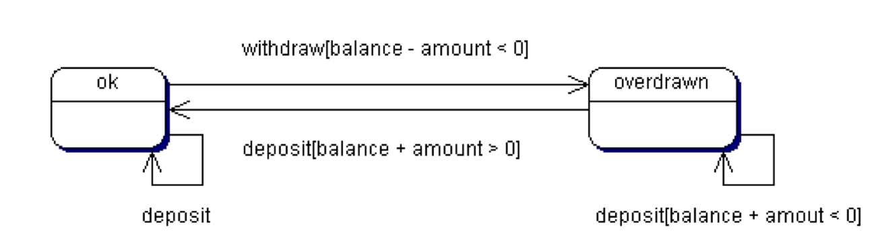

# 2.2 Εισαγωγή στη UML {#Java} 
© Γιάννης Κωστάρας

---

[<-](../2.1-OOP/README.md) | [Δ](../../README.md) | [->](../2.3-Encapsulation/README.md)

---

Η _UML_ ή _Unified Modelling Language (Ενοποιημένη Γλώσσα Μοντελοποίησης)_ είναι μια οπτικοποιημένη (visual) γλώσσα μοντελοποίησης η οποία σκοπό έχει τη δημιουργία, τον προσδιορισμό, την οπτικοποίηση και την τεκμηρίωση όλων των τεχνουργημάτων ενός συστήματος λογισμικού. Αναπτύχθηκε από τους Grady Booch, James Rumbaugh και Ivar Jacobson οι οποίοι ενοποίησαν τα μοντέλα τους (_Booch method_, _Object Modeling Technique (OMT)_ και _Object Oriented Software Engineering (OOSE)_ αντίστοιχα) για την παραγωγή μιας ενοποιημένης γλώσσας μοντελοποίησης. Αποτελείται από στοιχεία μοντελοποίησης, δηλ. αφαιρέσεις του συστήματος προς μοντελοποίηση. Είναι σημαντικό να σημειώσουμε ότι η UML _δεν_ αποτελεί μια μεθοδολογία/διαδικασία ανάπτυξης λογισμικού, μπορεί όμως να χρησιμοποιηθεί από τέτοιες διαδικασίες όπως π.χ. η [Rational Unified Process (RUP)](https://en.wikipedia.org/wiki/Rational_Unified_Process), [Iconix](http://www.iconixsw.com/), [Agile](https://dzone.com/articles/we-do-not-use-uml-we-are-agile) κ.ά.

Εκδόσεις: 1.0, 1.1, 1.2, 1.3, 1.4, 1.5, 2.0

Η έκδοση 2.0 προωθεί την _Προσανατολισμένη στα Μοντέλα Αρχιτεκτονική (Model Driven Architecture - MDA)_, δηλ. την παραγωγή 'εκτελέσιμων' μοντέλων που θα μπορούν να χρησιμοποιηθούν κατάλληλα από διάφορα εργαλεία.

Η UML 2.0 αποτελείται από 13 τύπους διαγραμμάτων τα οποία κατηγοριοποιούνται σε δυο μεγάλες κατηγορίες: _διαγράμματα δομής (structural diagrams)_ και _διαγράμματα συμπεριφοράς (behavioural diagrams)_:

### Διαγράμματα δομής (structural diagrams) ή Στατικά διαγράμματα
* Διαγράμματα κλάσεων (class diagrams)
* Διαγράμματα αντικειμένων (Object diagrams)
* Διαγράμματα συνιστωσών/εξαρτημάτων (component diagrams)
* Διαγράμματα σύνθετης δομής (Composite Structure diagrams)
* Διαγράμματα βιβλιοθηκών (Package diagrams)
* Διαγράμματα εγκατάστασης (Deployment diagrams)

### Διαγράμματα συμπεριφοράς (behavioural diagrams) ή Δυναμικά διαγράμματα
* Διαγράμματα σεναρίων (Use Case diagrams)
* Διαγράμματα δραστηριότητας (Activity diagrams)
* Διαγράμματα επικοινωνίας (Communication diagrams)
* Διαγράμματα αλληλεπίδρασης (Interaction Overview diagrams)
* Διαγράμματα ακολουθίας/αλληλουχίας (Sequence diagrams)
* Διαγράμματα μετάβασης κατάστασης (State Machine diagrams)
* Διαγράμματα χρονισμού (Timing diagrams)

Άλλη κατηγοριοποίηση είναι οι _4+1 όψεις (views)_ όπως φαίνεται στο ακόλουθο σχήμα:


**Εικόνα 1** _4+1 όψεις της UML_

### Λογική Όψη (Logical View) ή Όψη Σχεδίασης (Design View)
Αναπαριστά το πώς θα "χτιστεί" το σύστημα/πρόγραμμα δηλ. τις κλάσεις, διεπαφές και πρότυπα (patterns) που θα χρησιμοποιηθούν. Αποτελείται από:

* Διαγράμματα κλάσεων (class diagrams)
* Διαγράμματα αντικειμένων (Object diagrams)
* Διαγράμματα σύνθετης δομής (Composite Structure diagrams)
* Διαγράμματα δραστηριότητας (Activity diagrams)
* Διαγράμματα ακολουθίας/αλληλουχίας (Sequence diagrams)

### Όψη Συνιστωσών (Component View) ή Όψη Υλοποίησης (Implementation View)
Δίνει έμφαση στα αρθρώματα, βιβλιοθήκες, αρχεία, πόρους και εξαρτήσεις του συστήματος. Αποτελείται από:

* Διαγράμματα συνιστωσών/εξαρτημάτων (component diagrams)
* Διαγράμματα σύνθετης δομής (Composite Structure diagrams)
* Διαγράμματα αλληλεπίδρασης (Interaction Overview diagrams)
* Διαγράμματα μετάβασης κατάστασης (State Machine diagrams)

### Όψη Εγκατάστασης (Deployment View)
Περιγράφει πώς εγκαθίσταται, διαμορφώνεται και εκτελείται ένα σύστημα. Περιγράφει το απαιτούμενο υλικό (hardware) για να εκτελεστεί και να επικοινωνήσει το σύστημα (π.χ. πλεονασμό - redundancy, τοπολογία δικτύου κλπ.). Αποτελείται από:

* Διαγράμματα εγκατάστασης (Deployment diagrams)
* Διαγράμματα συνιστωσών/εξαρτημάτων (component diagrams)
* Διαγράμματα αλληλεπίδρασης (Interaction Overview diagrams)

### Όψη Διαδικασιών (Process View)
Περιγράφει πώς το σύστημα συμπεριφέρεται σε ένα πολυεπεξεργαστικό περιβάλλον, την απόδοση και επεκτασιμότητά του. Αποτελείται από:

* Διαγράμματα αλληλεπίδρασης (Interaction Overview diagrams)
* Διαγράμματα δραστηριότητας (Activity diagrams)
* Διαγράμματα μετάβασης κατάστασης (State Machine diagrams)
* Διαγράμματα ακολουθίας/αλληλουχίας (Sequence diagrams)

### Όψη σεναρίων (Use Case view)
Περιγράφει τη λειτουργικότητα του συστήματος με βάση τις απαιτήσεις των χρηστών. Αποτελείται από:

* Διαγράμματα σεναρίων (Use Case diagrams)
* Διαγράμματα δραστηριότητας (Activity diagrams)
* Διαγράμματα αλληλεπίδρασης (Interaction Overview diagrams)

Παρακάτω περιγράφουμε πιο αναλυτικά καθένα από τα 13 αυτά διαγράμματα.

## 1. Όψη σεναρίων (Use Case view)
Η όψη σεναρίων αποτελείται από τα (1) _διαγράμματα σεναρίων (Use Case diagrams)_ τα οποία ανήκουν στα διαγράμματα συμπεριφοράς (behavioural). Χρησιμοποιούνται στο επίπεδο της ανάλυσης για να μετατρέψουν τις απαιτήσεις του συστήματος σε σενάρια χρήσης. Παρέχουν μια όψη του συστήματος ανεξάρτητη της υλοποίησης που δείχνει _τι_ υποτίθεται ότι πρέπει να κάνει το σύστημα στοχεύοντας στο να κατανοήσει τις ανάγκες του χρήστη και όχι τις λεπτομέρειες της υλοποίησης.


**Εικόνα 2** _Συμβολολογία διαγράμματος σεναρίου_

Ένας _ρόλος (actor)_ είναι κάτι εκτός του συστήματος που έχουμε να αναπτύξουμε, π.χ. ένας χρήστης ή ακόμα κι ένα απομακρυσμένο σύστημα με το οποίο πρέπει να επικοινωνήσει το πρόγραμμά μας.

Ένα _σενάριο (use case)_ περιγράφει μια συμπεριφορά του συστήματος, δηλ. μια ακολουθία από βήματα που πρέπει να διεκπεραιώσει ένας ρόλος για να πετύχει κάτι με το σύστημα.

Όπως φαίνεται στην εικόνα 2, μπορούμε να ορίσουμε διάφορες σχέσεις σε ένα διάγραμμα σεναρίων:

* _Συσχέτιση (Relationship)_ μεταξύ σεναρίων και ρόλων δηλώνει ότι υπάρχει μια αλληλεπίδραση
* _Κληρονομικότητα (Generalization)_ μεταξύ ρόλων ή μεταξύ σεναρίων, σημαίνει ειδίκευση, δηλ. ότι εξειδικεύουμε τις λειτουργίες του γενικευμένου ρόλου ή σεναρίου μ' έναν πιο ειδικευμένο ρόλο ή σενάριο. Π.χ. στο παράδειγμα της εικόνας 3 βλέπουμε ότι ο ρόλος ```Supervisor``` μπορεί κάνει όλες τις λειτουργίες του ρόλου ```SalesPerson``` αλλά έχει και πιο ειδικευμένες αρμοδιότητες
* _Περιλαμβάνει (Includes)_ χρησιμοποιείται όταν ένα σενάριο περιλαμβάνει ένα άλλο σενάριο (π.χ. ένα σενάριο περιλαμβάνει το σενάριο ```Login```)
* _Επέκταση (Extends)_ χρησιμοποιείται όταν ένα σενάριο μπορεί να επεκταθεί με κάποιο άλλο σενάριο σε κάποια σημεία (extension points)

Στο παράδειγμα της εικόνας 3 βλέπουμε τι μπορεί ο ρόλος (actor) πελάτης (customer) (αλλά κι οι άλλοι ρόλοι: SalesPerson, Supervisor, ShippingClerk) να κάνει(-ουν) με το σύστημα. Π.χ. μπορεί να υποβάλλει μια παραγγελία (Σενάριο: Place order). 


**Εικόνα 3** _Παράδειγμα διαγράμματος σεναρίου_

Σε κάθε σενάριο επισυνάπτεται συνήθως μια λεπτομερής περιγραφή του ποια βήματα θα πρέπει ν' ακολουθήσει ο ρόλος για να διεκπεραιώσει μ' επιτυχία το σενάριο, λαμβάνοντας φυσικά υπόψιν και τις εξαιρέσεις (τι θα συμβεί αν κάτι πάει στραβά). Τα βήματα του σεναρίου μπορούν να περιγραφούν με διαγράμματα δραστηριότητας (activity diagrams). 

## 2. Λογική Όψη (Logical View) ή Όψη Σχεδίασης (Design View)
Αποτελείται από τα παρακάτω στατικά διαγράμματα:

 2. _Διαγράμματα κλάσεων (Class diagrams)_
 3. _Διαγράμματα αντικειμένων (Object diagrams)_
 4. _Διαγράμματα βιβλιοθηκών (Package diagrams)_

### Διαγράμματα κλάσεων (Class diagrams)

Τα διαγράμματα κλάσεων αναπαριστούν τις κλάσεις/διεπαφές ενός συστήματος και τις σχέσεις μεταξύ τους. Σ' αυτά τα διαγράμματα θα επικεντρωθούμε αυτή την εβδομάδα.

Μια κλάση αναπαριστά μια ομάδα ίδιων πραγμάτων που έχουν κοινή κατάσταση (state) και συμπεριφορά (behavior). Μια κλάση αναπαρίσταται στη UML ως ένα ορθογώνιο παραλληλογράμμο (βλ. εικόνα 4) που αποτελείται από τρία μέρη: το _όνομα_ της κλάσης, τα _γνωρίσματά_ της και τις _μεθόδους_ της. 


**Εικόνα 4** _Συμβολολογία διαγράμματος κλάσεων_

Μια _abstract_ κλάση δηλώνεται με _πλάγια_ γράμματα. Ένα στατικό πεδίο ή μια στατική μέθοδος φαίνεται υπογραμμισμένο(-η). Μπορούμε να κατηγοριοποιήσουμε τις κλάσεις χρησιμοποιώντας _στερεότυπα (stereotypes)_, π.χ. ```<<interface>>```.

Π.χ. η κλάση ```Car``` που είδαμε στο προηγούμενο μάθημα αναπαρίσταται ως εξής:


**Εικόνα 5** _Παράδειγμα διαγράμματος κλάσης στη UML_

Τα γνωρίσματα μιας κλάσης μπορεί να είναι κάποιου από τους τύπους δεδομένων της Java (π.χ. ```int, String``` κλπ.) ή τύπος δεδομένων μιας άλλης κλάσης και στην περίπτωση αυτή λέμε ότι οι δυο αυτές κλάσεις σχετίζονται μεταξύ τους. 

Στην εικόνα 4 βλέπουμε επίσης τις διάφορες σχέσεις μεταξύ των κλάσεων:

* συσχέτιση (association)
* κληρονομικότητα (generalisation)
* εξάρτηση (dependency)
* συσσωμάτωση (aggregation)
* σύνθετη συσσωμάτωση (composite aggregation ή composition)

Η σχέση της εξάρτησης είναι η πιο αφαιρετική από τις υπόλοιπες και σημαίνει ότι στο σώμα μιας μεθόδου της κλάσης χρησιμοποιείται μια άλλη κλάση. Πρόκειται δηλ. για μια προσωρινή σχέση που συνήθως δηλώνεται ως "χρησιμοποιεί (_uses a_)". 

Για τις υπόλοιπες σχέσεις θα μιλήσουμε στα επόμενα μαθήματα αυτής της εβδομάδας. Η εικόνα 5 δείχνει ένα παράδειγμα σύνθετης συσσωμάτωσης (composition) μεταξύ των δυο κλάσεων.

Επίσης μπορούμε να προσθέσουμε την _πολλαπλότητα (multiplicity)_ σε μια σχέση που δείχνει πόσα αντικείμενα μιας κλάσης σχετίζονται με μια άλλη. Στην εικόνα 5 βλέπουμε ότι ένα αυτοκίνητο μπορεί να έχει μια μόνο μηχανή (αν και υπάρχουν αυτοκίνητα με 2 μηχανές, η μια από τις οποίες μπορεί να είναι ηλεκτρική). Αν η πολλαπλότητα σε μια σχέση είναι >1 τότε συνήθως αυτό σημαίνει ότι υλοποιείται μέσω μιας συλλογής ή πίνακα (π.χ. ```Engine[] engines = new Engine[2]```).

Πέρα απ' τον τύπο δεδομένων, ένα γνώρισμα ή μια μέθοδος διαθέτει και _ορατότητα (visibility)_. Θα εξηγήσουμε τι σημαίνουν τα (```+, -```) και (```#```) στο επόμενο μάθημα. Τέλος, μπορούμε να προσθέσουμε και περιορισμούς (constraints) με ```{}```, π.χ. ```-maxSpeed : int {[0..250]}```. Η UML 2.0 διαθέτει μια ειδική γλώσσα, την _Object Contraint Language (OCL)_ για τη συγγραφή περιορισμών η οποία διαθέτει μια γραμματική η οποία μπορεί να επικυρωθεί από εργαλεία μοντελοποίησης. 

Τέλος, στην εικόνα 5 βλέπουμε και το σύμβολο του σχολίου/σημειώματος (note) που μπορεί να χρησιμοποιηθεί σ' όλα τα διαγράμματα.

### Διαγράμματα αντικειμένων (Object diagrams)

Τα διαγράμματα αντικειμένων έχουν την ίδια συμβολολογία με τα διαγράμματα κλάσεων και δείχνουν τις σχέσεις των αντικειμένων των κλάσεων σε μια συγκεκριμένη χρονική στιγμή. Χρησιμοποιούνται για να εμφανίσετε στιγμιότυπα των σχέσεων μεταξύ των αντικειμένων κατά την εκτέλεση του προγράμματος.


**Εικόνα 6** _Παράδειγμα διαγράμματος αντικειμένων_

### Διαγράμματα βιβλιοθηκών (Package diagrams)
Χρησιμοποιούνται για να ομαδοποιούμε κλάσεις σε πακέτα ή βιβλιοθήκες. Αντιστοιχούν στις βιβλιοθήκες (packages) της γλώσσας.


**Εικόνα 7** _Παράδειγμα διαγράμματος βιβλιοθηκών_

Μια _βιβλιοθήκη (package)_ είναι ένας υποδοχέας (container) στοιχείων μοντελοποίησης, ένας μηχανισμός γενικού σκοπού οργάνωσης στοιχείων σε ομάδες. Τα διαγράμματα βιβλιοθηκών μπορούν να χρησιμοποιηθούν σε κάθε βήμα της UML. Μια βιβλιοθήκη μπορεί να είναι υποδοχέας σεναρίων, κλάσεων, συνιστωσών κλπ.

## 3. Όψη Συνιστωσών/Εξαρτημάτων (Component View)
Αποτελείται από τα παρακάτω διαγράμματα δομής:

 5. _Διαγράμματα συνιστωσών/εξαρτημάτων (Component diagrams)_
 6. _Διαγράμματα σύνθετης δομής (Composite Structure diagrams)_ 

### Διαγράμματα συνιστωσών/εξαρτημάτων (Component diagrams)
Τα διαγράμματα συνιστωσών/εξαρτημάτων δείχνουν την οργάνωση και τις εξαρτήσεις μεταξύ των αρθρωμάτων ή των βιβλιοθηκών του συστήματος. Μπορούν να ομαδοποιήσουν μικρότερα στοιχεία, όπως κλάσεις, σε μεγαλύτερα, π.χ. βιβλιοθήκες εγκατάστασης (jar files (JAR: Java ARchive)). 


**Εικόνα 8** _Συμβολολογία διαγράμματος συνιστωσών/εξαρτημάτων_

Τα διαγράμματα συνιστωσών παρέχουν τις δομές μοντελοποίησης που απαιτούνται για την απεικόνιση της φυσικής δομής του συστήματος. Περιέχει πληροφορίες σχετικά με τα εκτελέσιμα αρχεία, τις βιβλιοθήκες που απαιτούνται για να εκτελεστεί κλπ. Π.χ.

* Οι συνιστώσες του πηγαίου κώδικα (εξαρτήσεις μεταγλώττισης) απεικονίζουν τις εξαρτήσεις μεταγλώττισης μεταξύ των αρχείων πηγαίου κώδικα
* Οι συνιστώσες εκτέλεσης (εξαρτήσεις κατά την εκτέλεση) δείχνουν την αντιστοιχία των κλάσεων σε βιβλιοθήκες (π.χ. αρχεία jar) καθώς και τις εξαρτήσεις με άλλες βιβλιοθήκες.

Υπάρχουν δυο τρόποι αναπαράστασης των εξαρτημάτων: _διαφανής (white box)_ όπου φαίνεται η εσωτερική δομή των εξαρτημάτων και _αδιαφανής (black box)_ που δε φαίνεται και φαίνονται μόνο οι δημόσιες διεπαφές του εξαρτήματος.


**Εικόνα 9** _Παράδειγμα διαγράμματος συνιστωσών/εξαρτημάτων_

### Διαγράμματα Σύνθετης Δομής (Composite Structure diagrams)
Τα διαγράμματα σύνθετης δομής εισήχθησαν στην έκδοση 2.0. Μας επιτρέπουν να μοντελοποιήσουμε σύνθετες σχέσεις/δομές (π.χ. πρότυπα σχεδίασης (design patterns) ή μοντέλα του πραγματικού κόσμου). Μας επιτρέπουν ακόμα να αποσυνθέσουμε μια σύνθετη δομή στα εσωτερικά του τμήματα και να απεικονίσουμε πώς αυτά επικοινωνούν μεταξύ τους. Έχει παρόμοιο ρόλο με ένα διάγραμμα κλάσεων αλλά σας επιτρέπει να απεικονίσετε την εσωτερική δομή πολλών κλάσεων και τις αλληλεπιδράσεις μεταξύ τους. Μπορείτε να αναπαριστήσετε γραφικά τα μέρη των κλάσεων και συσχετίσεις τόσο μεταξύ τους όσο και με άλλες κλάσεις.


**Εικόνα 10** _Συμβολολογία διαγράμματος σύνθετης δομής_

Όπως φαίνεται στην εικόνα 10, ένα διάγραμμα σύνθετης δομής αποτελείται από:

* _Δομή (structure)_: ένα σύνολο διασυνδεδεμένων στοιχείων που υπάρχουν κατά τη διάρκεια εκτέλεσης για να παρέχουν συλλογικά κάποια λειτουργία. Π.χ. υποσυστήματα/συνιστώσες/εξαρτήματα (components) ή βιβλιοθήκες (packages) ή ακόμα και κλάσεις είναι παραδείγματα δομών. Μια δομή αποτελείται από _μέρη (parts)_ και _συνδέσεις (connectors)_ μεταξύ τους. Τα μέρη μπορεί να είναι εσωτερικά (composition) ή εξωτερικά (aggregation) και μπορούμε να ορίσουμε πολλαπλότητα (multiplicity) και περιορισμούς (constraints) σ' αυτά. Επίσης, μπορούμε να απεικονίσουμε γνωρίσματα (properties) για τα μέρη (parts).
* _Σύνδεση (Connector)_: αναπαριστούν κάποιου είδους επικοινωνία μεταξύ τμημάτων (parts) μιας εσωτερικής δομής ή μεταξύ δομών. Κάθε σύνδεση μπορεί να έχει προαιρετικά ένα όνομα και έναν τύπο (κλάση) με τη μορφή ```όνομα : κλάση```. Μπορούμε ακόμα να ορίσουμε περιορισμούς (constraints) και πολλαπλότητα (multiplicity) σε μια σύνδεση.
* _Θύρα (Port)_: προσφέρει τη λειτουργικότητα μιας δομής χωρίς να εκθέτει λεπτομέρειες της εσωτερικής υλοποίησης αυτής της λειτουργίας. Οι θύρες μπορεί να 'ναι εσωτερικές στη δομή ή δημόσιες και μπορούν να έχουν όνομα.
* _διεπαφή (interface)_: όπως και στα διαγράμματα κλάσεων, προσφέρονται δυο ειδών διεπαφές: _προσφερόμενες (provided)_ και _απαιτούμενες (required)_
* _Συνεργασία (Collaborationα)_: αναπαριστούν πρότυπα μοντελοποίησης (π.χ. πρότυπα σχεδίασης (design patterns))

Ένα παράδειγμα διαγράμματος σύνθετης δομής φαίνεται στην εικόνα 11.


**Εικόνα 11** _Παράδειγμα διαγράμματος σύνθετης δομής_

Εδώ βλέπουμε την κλάση ```Car``` που είδαμε προηγούμε να αποτελείται από δυο κατηγορίες (εξωτερικών) τμημάτων: 2 μηχανές (υβριδικό) και ένα σύστημα κατεύθυνσης. Βλέπουμε τις διάφορες θύρες που παρέχονται καθώς και τις απαιτούμενες διεπαφές για να φορτιστεί (ή/και γεμίσει με καύσιμο) το αυτοκίνητο. Οι θύρες στα δεξιά διαθέτουν όνομα. Υπάρχουν 4 δημόσιες και 3 εσωτερικές (προστατευόμενες) θύρες που ενώνονται μεταξύ τους όπως φαίνεται στην εικόνα. Στην εικόνα βλέπουμε κι ένα παράδειγμα πολλαπλής σύνδεσης (multiple connector) που επιτρέπει στις δυο υποδοχές (gas, electric) να συνδέονται με τη μηχανή.

## 4. Όψη Εγκατάστασης (Deployment View)
Αποτελείται από το παρακάτω στατικό διάγραμμα:

 7. _Διαγράμματα εγκατάστασης (Deployment diagrams)_

Τα διαγράμματα εγκατάστασης δείχνουν πώς εγκαθίσταται στο υλικό (σε διακομιστές, ΒΔ, συσκευές δικτύωσης κλπ.) και πώς εκτελείται πραγματικά το σύστημα/πρόγραμμα, δηλ. τους υπολογιστές, τις δικτυακές συσκευές κλπ. που απαιτούνται.

Αποτελείται από:

* _Κόμβους (Nodes)_: Μια υπολογιστική μονάδα που αντιπροσωπεύει έναν υπολογιστικό πόρο, που γενικά έχει τουλάχιστον μνήμη και επεξεργαστική ικανότητα. Υπάρχουν δυο κατηγορίες κόμβων: _περιβάλλοντα εκτέλεσης (execution environments)_ (π.χ. ένας διακομιστής εφαρμογών - application server) και _συσκευές (devices)_ (```<<device>>```).
* _Συνιστώσες/Εξαρτήματα (Components)_: όπως στα διαγράμματα συνιστωσών/εξαρτημάτων, τα οποία αντιπροσωπεύουν τεχνουργήματα λογισμικού όπως αρχεία, πλαίσια εργασίας (frameworks) κλπ
* _Συνδέσεις (Connections)_: υποδεικνύουν μια επικοινωνία μεταξύ δύο κόμβων.
* _Τεχνουργήματα (Artifacts)_: παρέχουν πληροφορίες για το σύστημα, π.χ. το εγχειρίδιο χρήσης


**Εικόνα 12** _Συμβολολογία διαγράμματος εγκατάστασης_


**Εικόνα 13** _Παράδειγμα διαγράμματος εγκατάστασης_

## 5. Όψη Διαδικασιών (Process View)
Η όψη διαδικασιών αποτελείται από τα παρακάτω δυναμικά διαγράμματα:

 8. _Διαγράμματα ακολουθίας/αλληλουχίας (Sequence diagrams)_
 9. _Διαγράμματα επικοινωνίας (Communication diagrams)_
 10. _Διαγράμματα μετάβασης κατάστασης (State Machine diagrams)_
 11. _Διαγράμματα δραστηριότητας (Activity diagrams)_
 12. _Διαγράμματα αλληλεπίδρασης (Interaction Overview diagrams)_
 13. _Διαγράμματα χρονισμού (Timing diagrams)_

### Διαγράμματα ακολουθίας/αλληλουχίας (Sequence diagrams)
Τα διαγράμματα ακολουθίας ή αλληλουχίας είναι ένας τύπος διάγραμματος αλληλεπίδρασης (interaction) που απεικονίζει τον τύπο και τη χρονική σειρά των μηνυμάτων που ανταλλάσονται μεταξύ των αντικειμένων κατά την εκτέλεση του προγράμματος.
 
Ένα διάγραμμα ακολουθίας είναι μια γραφική απεικόνιση ενός σεναρίου που απεικονίζει αλληλεπιδράσεις αντικειμένων διατεταγμένες σε μια χρονική ακολουθία. Συνήθως, ένα διάγραμμα αλληλεπίδρασης καταγράφει τη συμπεριφορά ενός σεναρίου. Απεικονίζει αντικείμενα και τα μηνύματα που ανταλλάσονται μεταξύ τους στο πλαίσιο του σεναρίου.


**Εικόνα 14** _Συμβολολογία διαγράμματος ακολουθίας_

Ένα διάγραμμα αλληλουχίας αποτελείται από:

* _Αντικείμενα (objects)_ τα οποία παριστάνονται από κουτιά στην κορυφή μιας διακεκομμένης κάθετης γραμμής.
* Οι διακεκομμένες κάθετες γραμμές ονομάζονται _γραμμές ζωής (lifelines)_ και αντιπροσωπεύουν την ύπαρξη των αντικειμένων κατά τη διάρκεια της αλληλεπίδρασης (δηλ. από τη στιγμή δημιουργίας του μέχρι τη στιγμή καταστροφής του).
* _Συμβάντα (events)_ (ή _μηνύματα (messages)_ ή _αλληλεπιδράσεις αντικειμένων (interactions)_ ή _ενέργειες (actions)_) υποδεικνύονται από οριζόντια βέλη που κατευθύνονται από τη γραμμή ζωής που αντιπροσωπεύει το αντικείμενο πελάτη (client) στη γραμμή ζωής που αντιπροσωπεύει το αντικείμενο του προμηθευτή (supplier). Ένα αντικείμενο μπορεί να στείλει μήνυμα στον εαυτό της. Τα συμβάντα είναι στη ουσία κλήσεις μεθόδων. Μπορείτε να χρησιμοποιήσετε τα στερεότυπα ```<<create>>, <<destroy>>``` για δημιουργία, καταστροφή αντικειμένων αντίστοιχα (για την καταστροφή προσθέτουμε και ένα ```Χ``` στο τέλος του lifeline). Συνήθως τα συμβάντα είναι _σύγχρονα (synchronous)_ δηλ. μπλοκάρουν τον καλούντα μέχρις ότου διεκπεραιωθούν. 
* Τα μηνύματα μπορούν να φέρουν ετικέτα με το όνομα συμβάντος (το όνομα και τις τιμές των παραμέτρων καθώς και τις τιμές επιστροφής)
* Η χρονική σειρά των συμβάντων υποδεικνύεται με την κατακόρυφη θέση, με το πιο πρώιμο γεγονός να εμφανίζεται στην κορυφή.
* Ένα _μήνυμα επιστροφής_ απεικονίζει το αποτέλεσμα ενός μηνύματος, δηλ. το αποτέλεσμα της κλήσης μιας μεθόδου (αντιπροσωπεύεται από διακεκομμένα βέλη)· τα μηνύματα επιστροφής συνήθως σχεδιάζονται από τα δεξιά προς τα αριστερά.
* Ένα _ασύγχρονο μήνυμα_ απεικονίζεται με μισά βέλη. Με ένα ασύγχρονο μήνυμα ο καλών (client) μπορεί να συνεχίσει την επεξεργασία χωρίς να μπλοκάρεται μέχρι να λάβει απάντηση (μήνυμα επιστροφής) από τον κληθέντα (supplier). Ένα ασύγχρονο μήνυμα μπορεί: να δημιουργήσει ένα νέο νήμα (thread), να δημιουργήσει ένα νέο αντικείμενο ή να επικοινωνήσει με ένα ήδη τρέχον νήμα. Η UML 2.0 εισήγαγε ακόμα τις έννοιες των _απολεσθέντων (lost)_ και _αγνώστων (found)_ μηνυμάτων.
* Ένα _κουτί ενεργοποίησης (activation box)_  (εστίαση ελέγχου) δείχνει το χρονικό διάστημα κατά το οποίο ένα αντικείμενο εκτελεί μια ενέργεια είτε άμεσα είτε μέσω μιας υφιστάμενης διαδικασίας. Η κορυφή του είναι ευθυγραμμισμένη με τον χρόνο έναρξης και ο πυθμένας του με το χρόνο τερματισμού του.
* Η διαγραφή αντικειμένου παρουσιάζεται με ένα μεγάλο X (τα αντικείμενα μπορούν να αυτοκαταστραφούν ή να καταστραφούν από άλλο μήνυμα)
* Ένα _συνδυαστικό τμήμα (combined fragment)_ επιτρέπει να απεικονίσουμε λογικές συνθήκης ή επανάληψης. 

Ένα παράδειγμα διαγράμματος αλληλουχίας απεικονίζεται στην εικόνα 15.


**Εικόνα 15** _Παράδειγμα διαγράμματος ακολουθίας_

### Διαγράμματα επικοινωνίας (Communication diagrams)
Μετονομάστηκαν έτσι από _διαγράμματα συνεργασίας (collaboration diagrams)_ όπως ονομάζονταν στις προηγούμενες εκδόσεις.
Πρόκειται για ένα τύπο διαγράμματος αλληλεπίδρασης ο οποίος εστιάζει στα στοιχεία που εμπλέκονται σε μια συγκεκριμένη συμπεριφορά και στα ανταλλασσόμενα μηνύματα αντί για τη χρονική ακολουθία αυτών. Τα στοιχεία αυτά μπορούν να είναι αντικείμενα κλάσεων, εξαρτήματα, σενάρια κλπ.


**Εικόνα 16** _Παράδειγμα διαγράμματος επικοινωνίας_

### Διαγράμματα μετάβασης κατάστασης (State Machine diagrams ή Statechart diagrams)
Μετονομάστηκαν έτσι από _διαγράμματα μετάβασης κατάστασης (State Transition diagrams)_ στις προηγούμενες εκδόσεις. Δείχνουν τις διάφορες καταστάσεις μιας οντότητας (αντικειμένου, μεθόδου, εξαρτήματος κλπ.) κατά τη διάρκεια της ύπαρξής της στο σύστημα. Η UML ορίζει δυο τύπους τέτοιων μηχανών: _Συμπεριφοράς (behavioural)_ και _πρωτοκόλλου (protocol)_ (π.χ. HTTP, SMTP κλπ).

Τα διαγράμματα αυτά μπορούν ν' απεικονίσουν το ιστορικό ζωής μιας δεδομένης κλάσης, τα γεγονότα που προκαλούν
μια μετάβαση από μια κατάσταση στην άλλη, και τις ενέργειες που προκύπτουν από μια αλλαγή κατάστασης. Αυτός ο κύκλος ζωής εκφράζεται με τις διαφορετικές καταστάσεις που μπορούν να βρεθούν τα διάφορα αντικείμενα και τα γεγονότα που προκαλούν τις μεταβάσεις των καταστάσεων αυτών.


**Εικόνα 17** _Συμβολολογία διαγραμμάτων μετάβασης κατάστασης_

Όπως φαίνεται στην εικόνα 17, ένα διάγραμμα μετάβασης κατάστασης αποτελείται από:

* _Κατάσταση (State)_ κατά τη διάρκεια ζωής ενός αντικειμένου, η οποία ικανοποιεί κάποιες συνθήκες, εκτελεί κάποια δραστηριότητα, ή αναμένει κάποιο γεγονός, με άλλα λόγια είναι μια από τις πιθανές συνθήκες στις οποίες μπορεί να βρίσκεται το αντικείμενο. Ένα αντικείμενο έχει ένα πεπερασμένο αριθμό πιθανών καταστάσεων και μπορεί να βρίσκεται μόνο σε μία κατάσταση κάθε φορά.

* _Ενέργειες (State actions)_: πρόκειται για μια ατομική εκτέλεση που τερματίζεται χωρίς διακοπή
* _Δραστηριότητα (activity)_: είναι μια συμπεριφορά αντικειμένου το οποίο βρίσκεται σε μια καθορισμένη κατάσταση. Δεν εκτελείται ατομικά και επομένως μπορεί να διακοπεί από γεγονότα κι έτσι να τερματιστεί χωρίς επιτυχία.
* _Ενέργειες εισόδου (entry actions)_: εκτελούνται όταν το αντικείμενο εισάγεται σε μια κατάσταση.
* _Ενέργειες εκτέλεσης (do actions)_: εκτελούνται μετά από τις ενέργειες εισόδου και πριν τις ενέργειες εξόδου ή μέχρι πέρας των εργασιών τους
* _Ενέργειες εξόδου (exit actions)_: εκτελούνται όταν το αντικείμενο εξέρχεται από μια κατάσταση.
* _Ειδικές καταστάσεις (special states)_: _κατάσταση εκκίνησης start state_ (υποχρεωτική, μόνο μία επιτρέπεται) και _καταστάσεις τερματισμού (stop states)_ (προαιρετικά, μπορούν να υποδεικνύονται περισσότερες από μια).
* _Εμφωλιασμένες καταστάσεις (nested states)_.

Οι ενέργειες (actions) και οι δραστηριότητες (activities) υλοποιούνται το ίδιο, αλλά αντιμετωπίζονται διαφορετικά. Οι ενέργειες σχετίζονται με μεταβάσεις και θεωρούνται ότι συμβαίνουν ατομικά (άμεσα) και δεν μπορούν να διακοπούν,
ενώ οι δραστηριότητες συνδέονται με καταστάσεις, μπορούν να διαρκέσουν περισσότερο και φυσικά μπορούν να διακοπούν από εξωτερικά γεγονότα.

* Μια _μετάβαση (transition)_ είναι μια αλλαγή από μια αρχική κατάσταση σε μια επόμενη κατάσταση ως αποτέλεσμα ενός ερεθίσματος (stimulus). Οι μεταβάσεις μπορεί να είναι αυτόματες (μπορεί να μην μπορούν να διακοπούν) και μπορεί να φέρουν ετικέτα με ένα γεγονός, μια συνθήκη ή/και μια ενέργεια. Η σύνταξη για μια ετικέτα μετάβασης έχει τρία μέρη, όλα προαιρετικά: ```event[guard condition]/action```.
* Ένα συμβάν/γεγονός (event) ενεργοποιεί μια μετάβαση κατάστασης. Υπάρχουν πολλών ειδών συμβάντα π.χ.:
* Μια συνθήκη γίνεται αληθής (λέξη-κλειδί ```when```, π.χ. ```when (speed > 50)```)
* Μετάβαση ενός καθορισμένου χρονικού διαστήματος μετά από ένα καθορισμένο γεγονός (λέξη-κλειδί ```after```, π.χ. ```after (10 minutes)```)
* Η συνθήκη (guard condition) είναι μια λογική (boolean) έκφραση η οποία αν ικανοποιηθεί (true) τότε γίνεται η μετάβαση
* Η ενέργεια (action) τέλος είναι αυτή που θα εκτελεστεί μετά τη μετάβαση

* Σήματα (signals): χρησιμοποιούνται όταν η μετάβαση από μία κατάσταση σε μια άλλη μπορεί να προκαλέσει την αποστολή ή λήψη άλλων πληροφοριών προς/από το σύστημα σας.

Η εικόνα 18 δείχνει ένα παράδειγμα διαγράμματος μετάβασης κατάστασης. Η κατάσταση μεταβαίνει από ```OK``` σε ```Overdrawn``` αν ικανοποιείται η συνθήκη φύλακας ```[balance < amount]```. Οι μεταβάσεις που ξεκινούν και τερματίζονται στην ίδια κατάσταση καλούνται _αυτο-μεταβάσεις (self-transitions)_.



**Εικόνα 18** _Παράδειγμα διαγράμματος μετάβασης κατάστασης_

Τα διαγράμματα αυτά είναι χρήσιμα σε προγράμματα παράλληλης/ταυτόχρονης επεξεργασίας (concurrent) καθώς ένα αντικείμενο μπορεί να βρίσκεται σε πολλές καταστάσεις στα τμήματα ταυτόχρονης επεξεργασίας. Αυτό απεικονίζεται με τη βοήθεια:

* _σύνθετης κατάστασης (composite state)_ η οποία αποτελείται από πολλές εμφωλιασμένες καταστάσεις. Μια σύνθετη κατάσταση μπορεί να χωριστεί σε _περιοχές (regions)_ οι οποίες εκτελούν καταστάσεις παράλληλα/ταυτόχρονα. Η σύνθετη κατάσταση παραμένει ενεργή μέχρις ότου τερματιστούν όλες οι περιοχές που περιλαμβάνει.

### Διαγράμματα δραστηριότητας (Activity diagrams)
Τα διαγράμματα δραστηριότητας απεικονίζουν τη ροή από μια συμπεριφορά ή δραστηριότητα στην επόμενη. Είναι παρόμοια στην έννοια με τα κλασσικά διαγράμματα ροής, αλλά είναι πολύ πιο εκφραστικά.

Μια δραστηριότητα είναι μια ενέργεια που χρειάζεται κάποιο χρόνο για να ολοκληρωθεί και απεικονίζεται ως _κατάσταση ενέργειας (action state)_ (βλ. εικόνα 19). Οι διακλαδώσεις (branches) και οι συγχωνεύσεις (merges) δηλώνουν συνθήκες και απεικονίζονται με διαμάντι (βλ. εικόνα 19). Μια διακλάδωση έχει μια μόνο εισερχόμενη μετάβαση και πολλές,
αμοιβαία αποκλεισμένες, εξερχόμενες μεταβάσεις που διαχωρίζονται με βάση κάποια συνθήκη (guard). Μια συγχώνευση έχει πολλαπλές εισόδους και μια μόνο εξερχόμενη μετάβαση. Μια συγχώνευση σηματοδοτεί το τέλος μιας συνθήκης η οποία ξεκίνησε σε μια διακλάδωση. 

Η παράλληλη συμπεριφορά απεικονίζεται από διακλαδώσεις (forks) και ενώσεις (joins) (βλ. εικόνα 19). Μια διακλάδωση έχει μια εισερχόμενη μετάβαση και πολλές εξερχόμενες μεταβάσεις που συμβαίνουν παράλληλα. Μια ένωση έχει μία εξερχόμενη μετάβαση και αρκετές εισερχόμενες μεταβάσεις και τερματίζει μια διακλάδωση. Στην ένωση, η εξερχόμενη μετάβαση ενεργοποιείται μόνο όταν όλες οι καταστάσεις στις εισερχόμενες μεταβάσεις έχουν ολοκληρώσει τις δραστηριότητές τους. 


**Εικόνα 19** _Συμβολολογία διαγράμματος δραστηριότητας_

Ένα παράδειγμα διαγράμματος δραστηριότητας εμφανίζεται στην εικόνα 20. Η εικόνα δείχνει μια διακλάδωση και μια ένωση, με τις δραστηριότητες ```ReadState, ExecuteControlLaws``` και ```OutputDemands``` να εμφανίζονται παράλληλα.


**Εικόνα 20** _Παράδειγμα διαγράμματος δραστηριότητας_

Οι _Ζώνες (Swimlanes)_ ή _χωρίσματα (partitions)_, όπως μετονομάστηκαν στην έκδοση 2.0, κατανέμουν τις καταστάσεις ενεργειών στις κλάσεις ή οντότητες που είναι υπεύθυνες για αυτές. Για να χρησιμοποιήσετε τις ζώνες, πρέπει να οργανώσετε το διάγραμμα δραστηριότητας σε κάθετες ή οριζόντιες ζώνες χωρισμένες με γραμμές. Κάθε ζώνη αντιπροσωπεύει τη ζώνη ευθυνών μιας συγκεκριμένης κλάσης.

Τέλος, όπως και με τα διαγράμματα μετάβασης κατάστασης, τα διαγράμματα δραστηριότητας υποστηρίζουν _σήματα (signals)_.

### Διαγράμματα αλληλεπίδρασης (Interaction Overview diagrams)
Τα διαγράμματα αλληλεπίδρασης είναι ένας συνδυασμός διαγραμμάτων ακολουθίας (8) και δραστηριότητας (11). Βοηθούν με το ν' απεικονίζουν τη συνολική ροή εκτέλεσης ενός συστήματος.


**Εικόνα 21** _Παράδειγμα διαγράμματος αλληλεπίδρασης_

### Διαγράμματα χρονισμού (Timing diagrams)
Πρόκειται για μια ειδική έκδοση των διαγραμμάτων αλληλεπίδρασης που επικεντρώνονται στο χρονισμό των μηνυμάτων. Διαβάζονται από αριστερά προς τα δεξιά και απεικονίζουν την εναλλαγή των διαφόρων καταστάσεων σε συνάρτηση με το χρόνο. 


**Εικόνα 22** _Παράδειγμα διαγράμματος χρονισμού_ 

## Εργαλεία
Δωρεάν:

* [ArgoUML](http://argouml.tigris.org/)
* [Astah](http://astah.net/)
* [Dia](http://dia-installer.de/)
* [UMLet](http://umlet.com/)

Online:

* [Draw.io](https://www.draw.io/)
* [Diagram Editor](https://www.diagrameditor.com/)
* [PlantText](https://www.planttext.com/)
* [Creately](https://creately.com/Draw-UML-and-Class-Diagrams-Online)
* [YUML](https://yuml.me)
* [YWorks](https://www.yworks.com/products/graphity)

Εμπορικά:

* [SmartDraw](https://www.smartdraw.com/uml-diagram/uml-diagram-tool.htm)
* [Altova UModel](https://www.altova.com/umodel/uml-diagrams)
* [StarUML](http://staruml.io/)
* [VisualParadigm](https://www.visual-paradigm.com/solution/freeumltool/)

## NetBeans UML plugins
Μπορείτε να οπτικοποιήσετε τις κλάσεις σας απευθείας από το NetBeans. Υπάρχουν μερικά plugins για το NetBeans γι' αυτό το σκοπό. 

* [easyUML](http://plugins.netbeans.org/plugin/55435/easyuml)
* [plantUML](http://plugins.netbeans.org/plugin/49069/plantuml)
* [Visual Paradigm](https://www.visual-paradigm.com/tutorials/modelinginnetbeans.jsp)

Εδώ θα περιγράψουμε συντόμως το _easyUML_ plugin και στο κεφάλαιο για την τεκμηρίωση κώδικα το _plantUML_. 

Για να εγκαταστήσετε το easyUML, αφού το κατεβάσετε και το αποσυμπιέσετε, επιλέξτε στο NetBeans το μενού **Tools --> Plugins**, καρτέλα **Downloaded**, κλικ στο κουμπί **Add Plugins**, πλοηγηθείτε στο φάκελο **1407020290_easyUml**, επιλέξτε όλα τα ```*.nbm``` αρχεία και **Open** και στη συνέχεια **Install**. Ακολουθήστε τις οδηγίες του οδηγού για να το εγκαταστήσετε.

Από το μενού **Window** επιλέξτε **UML Designer**. Μπορείτε να σύρετε αντικείμενα όπως κλάση, διεπαφή, συσχέτιση από την παλέττα και να δημιουργήσετε διαγράμματα κλάσεων.

## Περίληψη
Σ' αυτό το μάθημα περιγράψαμε τα 13 διαγράμματα της UML 2.0. Η Unified Modeling Language είναι μια οπτική γλώσσα μοντελοποίησης που επιτρέπει να απεικονίσουμε όλες τις φάσεις ανάπτυξης ενός προγράμματος, από τις απαιτήσεις μέχρι την εγκατάσταση στους Η/Υ του πελάτη.

Είναι σημαντικό να κατανοήσετε ότι δεν απαιτείται να χρησιμοποιήσετε _όλα_ τα διαγράμματα για να περιγράψετε το σύστημά σας. Το ποια διαγράμματα θα χρησιμοποιήσετε εξαρτάται από το ποιούς θα χρησιμοποιηθούν και τι σκοπό εξυπηρετούν. Πάντα να έχετε υπόψιν σας ότι τα UML διαγράμματα βοηθούν στην τεκμηρίωση του κώδικά σας και βοηθούν εσάς και άλλους να κατανοήσουν καλύτερα τι προσπαθήτε να επιτύχετε με σύστημά σας ώστε να είναι σε θέση να το βελτιώσουν μελλοντικά. 
 
## Πηγές:
1. Ambler S.W. (2003), _The Elements of UML 2.0 Style_, Cambridge University Press.
1. Booch G., Rumbaugh  J., Jacobson I. (2005), _The Unified Modeling Language User Guide_, 2nd Ed, Addison Wesley
1. Cockburn A. (1999), _Surviving Object-Oriented Projects_, Addison-Wesley.
1. Eriksson H.-E., Penker M. (1998), _UML Toolkit_, John Wiley & Sons, Inc.
1. Fowler M. (2004), _UML Distilled_, 3rd Edition, Addison-Wesley.
1. Gamma E., Helm R., Johnson R., Vlissides J. (1995), _Design Patterns: Elements of Reusable Object-Oriented Software_, Addison-Wesley.
1. Graham I., Wills A., _UML Tutorial_, MMI – Trireme International
1. Halbert P., O’ Brien (1997), _Using Types and Inheritance in Object Oriented Programming_, IEEE Software, September.
1. Jacobson I., Magnus C., Patrik J., Gunnar O. (1992), _Object-Oriented Software Engineering: A Use Case Driven Approach_, Addison-Wesley.
1. Kruchten P. (2000), _The Rational Unified Process An Introduction_, 2nd Edition, Addison-Wesley.
1. Kostaras I. (2009), [UML Description and a methodology of use](http://umlmethod.freeservers.com/).
1. Martin R.C. (2002), _UML for Java Programmers_, Prentice-Hall
1. Pilone D. & Pitman N. (2005), _UML 2.0 in a Nutshell_, O’Reilly
1. Pilone D. (2006), _UML 2.0 Pocket Reference_, O’Reilly
1. Pressman R. S. (1997), _Software Engineering - A practitioner's approach_, 4th edition, European adaptation, McGraw Hill.
1. Quatrani T. (1998), _Visual Modeling with Rational Rose and UML_, Addison-Wesley.
1. Rosenberg, D. (1999), _Use Case Driven Object Modeling with UML – A practical approach_, Addison-Wesley.
1. Rumbaugh J., Blaha M., Premerlani W., Eddy F., Lorensen W. (1991), _Object-Oriented Modelling and Design_, Prentice-Hall Int.
1. Schneider G., Winters J.P. (2001), _Applying Use Cases – A practical guide_, 2nd Ed., Addison-Wesley.
1. [SDM] Software Development Magazine (1998), _Inside the UML_, Rational Software Corporation.
1. [UML Class Diagrams](http://javaboutique.internet.com/articles/AJ/UML/).

---

[<-](../2.1-OOP/README.md) | [Δ](../../README.md) | [->](../2.3-Encapsulation/README.md)

---