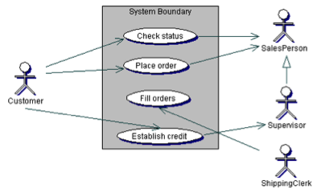
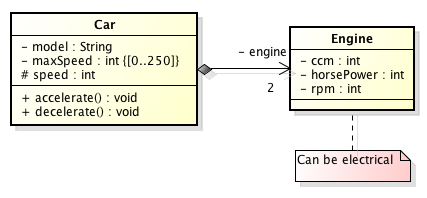
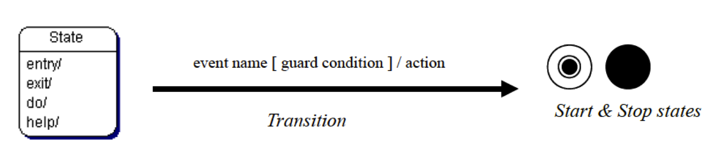

# 2.2 Εισαγωγή στη UML {#Java} 
© Γιάννης Κωστάρας

---

[<-](../2.1-OOP/README.md) | [Δ](../../README.md) | [->](../2.3-Encapsulation/README.md)

---

Η _UML_ ή _Unified Modelling Language (Ενοποιημένη Γλώσσα Μοντελοποίησης)_ είναι μια γλώσσα μοντελοποίησης η οποία σκοπό έχει τη δημιουργία, τον προσδιορισμό, την οπτικοποίηση και την τεκμηρίωση όλων των τεχνουργημάτων ενός συστήματος λογισμικού. Αναπτύχθηκε από τους Grady Booch, James Rumbaugh και Ivar Jacobson οι οποίοι ενωποίησαν τα μοντέλα τους για την παραγωγή μιας ενοποιημένης γλώσσας μοντελοποίησης. Αποτελείται από στοιχεία μοντελοποίησης, δηλ. αφαιρέσεις του συστήματος προς μοντελοποίηση. Αποτελείται από 13 τύπους διαγραμμάτων και από 5 όψεις όπως θα δούμε στη συνέχεια.

Εκδόσεις: 1.0, 1.1, 1.2, 1.3, 1.4, 1.5, 2.0

Αποτελείται από 5 όψεις όπως φαίνεται στο ακόλουθο σχήμα.


**Εικόνα 1** _5 όψεις της UML_

## 1. Όψη περιπτώσεων χρήσης (Use Case view)
Η όψη περιπτώσεων χρήσης αποτελείται από τα (1) _διαγράμματα περιπτώσεων χρήσης (Use Case diagrams)_. Χρησιμοποιούνται στο πρώτο επίπεδο της ανάλυσης για να αναλύσουν τις απαιτήσεις του συστήματος σε σενάρια χρήσης.


**Εικόνα 2** _Διαγράμματα περιπτώσεων χρήσης_




**Εικόνα 3** _Παραδείγματα διαγραμμάτων περιπτώσεων χρήσης_

## 2. Λογική Όψη (Logical View) ή Όψη Σχεδίασης (Design View)
Αποτελείται από τα παρακάτω στατικά διαγράμματα:

2. _Διαγράμματα κλάσεων (Class diagrams)_
3. _Διαγράμματα αντικειμένων (Object diagrams)_
4. _Διαγράμματα σύνθετης δομής (Composite Structure diagrams)_

Τα διαγράμματα κλάσεων αναπαριστούν τις κλάσεις ενός συστήματος και τις σχέσεις μεταξύ τους. Σ' αυτά τα διαγράμματα θα επικεντρωθούμε αυτή την εβδομάδα.


**Εικόνα 4** _Διαγράμματα κλάσεων_

Τα διαγράμματα αντικειμένων δείχνουν τις σχέσεις των αντικειμένων κλάσεων.



**Εικόνα 5** _Διαγράμματα αντικειμένων_


**Εικόνα 6** _Διαγράμματα σύνθετης δομής_

## 3. Όψη Διαδικασιών (Process View)
Η όψη διαδικασιών αποτελείται από τα παρακάτω δυναμικά διαγράμματα:

5. _Διαγράμματα ακολουθίας (Sequence diagrams)_
6. _Διαγράμματα επικοινωνίας (Communication diagrams)_
7. _Διαγράμματα μετάβασης κατάστασης (State Machine diagrams)_
8. _Διαγράμματα δραστηριότητας (Activity diagrams)_
9. _Διαγράμματα αλληλεπίδρασης (Interaction Overview diagrams)_
10. _Διαγράμματα χρονισμού (Timing diagrams)_


**Εικόνα 7** _Διαγράμματα ακολουθίας_


**Εικόνα 8** _Διαγράμματα επικοινωνίας_


**Εικόνα 9** _Διαγράμματα μετάβασης κατάστασης_


**Εικόνα 10** _Παράδειγμα διαγράμματος μετάβασης κατάστασης_


**Εικόνα 11** _Διαγράμματα δραστηριότητας_

Τα διαγράμματα αλληλεπίδρασης είναι ένας συνδυασμός διαγραμμάτων ακολουθίας (5) και δραστηριοτήτων (8)


## 4. Όψη Συνιστωσών (Component View)

11. _Διαγράμματα συνιστωσών (Component diagrams)_


## 5. Όψη Εγκατάστασης (Deployment View)

12. _Διαγράμματα εγκατάστασης (Deployment diagrams)_

## Άλλα διαγράμματα

Τέλος τα (13) _Διαγράμματα εγκατάστασης (Deployment diagrams)_ μπορούν να χρησιμοποιηθούν για να τακτοποιήσουν άλλα διαγράμματα.

 

## Εργαλεία
Δωρεάν:

* [ArgoUML](http://argouml.tigris.org/)
* [Astah](http://astah.net/)
* [Dia](http://dia-installer.de/)
* [UMLet](http://umlet.com/)

Online:

* [Draw.io](https://www.draw.io/)
* [Diagram Editor](https://www.diagrameditor.com/)
* [PlantText](https://www.planttext.com/)
* [Creately](https://creately.com/Draw-UML-and-Class-Diagrams-Online)
* [YUML](https://yuml.me)
* [YWorks](https://www.yworks.com/products/graphity)

Εμπορικά:

* [SmartDraw](https://www.smartdraw.com/uml-diagram/uml-diagram-tool.htm)
* [Altova UModel](https://www.altova.com/umodel/uml-diagrams)
* [StarUML](http://staruml.io/)
* [VisualParadigm](https://www.visual-paradigm.com/solution/freeumltool/)

## Διαγράμματα Κλάσεων

Μια κλάση αναπαρίσταται στη UML ως εξής ένα ορθογώνιο παραλληλογράμμο :



**Εικόνα 2** _Αναπαράσταση μιας κλάσης στη UML_

Όπως βλέπουμε στο παραπάνω σχήμα, αποτελείται από τρία μέρη: το όνομα της κλάσης, τα γνωρίσματά της και τις μεθόδους της.

Μια abstract κλάση δηλώνεται με πλάγια γράμματα. Ένα στατικό πεδίο ή μια στατική μέθοδος φαίνεται υπογραμμισμένο(-η).

Π.χ. η κλάση ```Car``` που είδαμε στο προηγούμενο μάθημα αναπαρίσταται ως εξής:


**Εικόνα 2** _Παράδειγμα κλάσης στη UML_

Θα εξηγήσουμε τι σημαίνουν τα (+) και (-) στο επόμενο μάθημα.

## NetBeans UML plugins
Μπορείτε να οπτικοποιήσετε τις κλάσεις σας απευθείας από το NetBeans. Υπάρχουν μερικά plugins για το NetBeans γι' αυτό το σκοπό. 

* [easyUML](http://plugins.netbeans.org/plugin/55435/easyuml)
* [plantUML](http://plugins.netbeans.org/plugin/49069/plantuml)
* [Visual Paradigm](https://www.visual-paradigm.com/tutorials/modelinginnetbeans.jsp)

Εδώ θα περιγράψουμε συντόμως το _easyUML_ plugin και στο κεφάλαιο για την τεκμηρίωση κώδικα το _plantUML_. 

Για να εγκαταστήσετε το easyUML, αφού το κατεβάσετε και το αποσυμπιέσετε, επιλέξτε στο NetBeans το μενού **Tools --> Plugins**, καρτέλα **Downloaded**, κλικ στο κουμπί **Add Plugins**, πλοηγηθείτε στο φάκελο **1407020290_easyUml**, επιλέξτε όλα τα ```*.nbm``` αρχεία και **Open** και στη συνέχεια **Install**. Ακολουθήστε τις οδηγίες του οδηγού για να το εγκαταστήσετε.

Από το μενού **Window** επιλέξτε **UML Designer**. Μπορείτε να σύρετε αντικείμενα όπως κλάση, διεπαφή, συσχέτιση από την παλέττα και να δημιουργήσετε διαγράμματα κλάσεων.
 
## Πηγές:
1. Ambler S.W. (2003), _The Elements of UML 2.0 Style_, Cambridge University Press.
1. Booch G., Rumbaugh  J., Jacobson I. (2005), _The Unified Modeling Language User Guide_, 2nd Ed, Addison Wesley
1. Cockburn A. (1999), _Surviving Object-Oriented Projects_, Addison-Wesley.
1. Eriksson H.-E., Penker M. (1998), _UML Toolkit_, John Wiley & Sons, Inc.
1. Fowler M. (2004), _UML Distilled_, 3rd Edition, Addison-Wesley.
1. Fowler M. (2000), _Refactoring_, Addison-Wesley.
1. Gamma E., Helm R., Johnson R., Vlissides J. (1995), _Design Patterns: Elements of Reusable Object-Oriented Software_, Addison-Wesley.
1. Graham I., Wills A., _UML Tutorial_, MMI – Trireme International
1. Halbert P., O’ Brien (1997), _Using Types and Inheritance in Object Oriented Programming_, IEEE Software, September.
1. Jacobson I., Magnus C., Patrik J., Gunnar O. (1992), _Object-Oriented Software Engineering: A Use Case Driven Approach_, Addison-Wesley.
1. Kruchten P. (2000), _The Rational Unified Process An Introduction_, 2nd Edition, Addison-Wesley.
1. Kostaras I. (2009), [UML Description and a methodology of use](http://umlmethod.freeservers.com/).
1. Martin R.C. (2002), _UML for Java Programmers_, Prentice-Hall
1. Pilone D. & Pitman N. (2005), _UML 2.0 in a Nutshell_, O’Reilly
1. Pilone D. (2006), _UML 2.0 Pocket Reference_, O’Reilly
1. Pressman R. S. (1997), _Software Engineering - A practitioner's approach_, 4th edition, European adaptation, McGraw Hill.
1. Quatrani T. (1998), _Visual Modeling with Rational Rose and UML_, Addison-Wesley.
1. Rosenberg, D. (1999), _Use Case Driven Object Modeling with UML – A practical approach_, Addison-Wesley.
1. Rumbaugh J., Blaha M., Premerlani W., Eddy F., Lorensen W. (1991), _Object-Oriented Modelling and Design_, Prentice-Hall Int.
1. Schneider G., Winters J.P. (2001), _Applying Use Cases – A practical guide_, 2nd Ed., Addison-Wesley.
1. [SDM] Software Development Magazine (1998), _Inside the UML_, Rational Software Corporation.
1. [UML Class Diagrams](http://javaboutique.internet.com/articles/AJ/UML/).

---

[<-](../2.1-OOP/README.md) | [Δ](../../README.md) | [->](../2.3-Encapsulation/README.md)

---