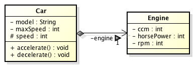
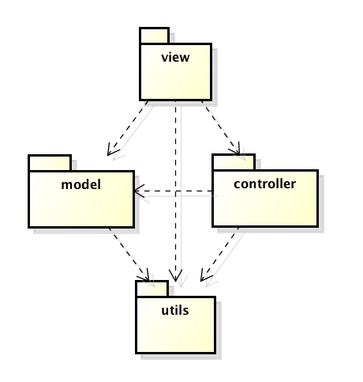

# 2.3 Ενθυλάκωση, Πακέτα και Αρθρώματα {#Java} 
© Γιάννης Κωστάρας

---

[<-](../2.2-UML/README.md) | [Δ](../../README.md) | [->](../2.4-Inheritance/README.md)

---

## Ενθυλάκωση (Encapsulation)

Ένα από τα πολλά προβλήματα που υπήρχαν με το διαδικαστικό μοντέλο προγραμματισμού ήταν ότι υπήρχε πρόσβαση χωρίς κάποιον έλεγχο στις καθολικές μεταβλητές, δηλ. οποιοδήποτε τμήμα του προγράμματος μπορούσε να τις αλλάξει. Αυτό καθιστούσε πολύ δύσκολη την αποσφαλμάτωση, όταν εμφανίζονταν bugs που οφείλονταν στη μεταβολή των καθολικών μεταβλητών.

Το αντικειμενοστραφές μοντέλο έφερε περιορισμούς στην πρόσβαση των δεδομένων. Έτσι, πλέον, οι μεταβλητές ορίζονται και χρησιμοποιούνται μόνο από το τμήμα κώδικα που τις χρειάζεται. Επίσης τα δεδομένα ορίζονται πλέον μαζί με τις μεθόδους που τις αλλάζουν, δηλ. μέσα στις κλάσεις, όπως είδαμε στο προηγούμενο μάθημα. 

Η ενθυλάκωση:

* επιτρέπει τον έλεγχο πρόσβασης στα δεδομένα ενός αντικειμένου μόνο μέσω από τις μεθόδους του
* η χρήση του αντικειμένου δεν αλλάζει αν αλλάξουν τα δεδομένα

Πώς επιτυγχάνεται η ενθυλάκωση; Η Java παρέχει κάποιες δεσμευμένες λέξεις για το σκοπό αυτό:

* ```public``` σημαίνει ότι το γνώρισμα ή η μέθοδος ή η κλάση μπορούν να προσπελαστούν από άλλες κλάσεις (η πρόσβαση είναι ανοικτή σε όλους)
* ```private``` σημαίνει ότι το γνώρισμα ή η μέθοδος ή η κλάση μπορούν να προσπελαστούν μόνο από την ίδια κλάση

Υπάρχουν δυο ακόμα τρόποι πρόσβασης που θα δούμε στη συνέχεια:

* ```package``` σημαίνει ότι το γνώρισμα ή η μέθοδος ή η κλάση μπορούν να προσπελαστούν από άλλες κλάσεις που ανήκουν στο ίδιο πακέτο (package) με την εν λόγω κλάση
* ```protected``` σημαίνει ότι το γνώρισμα ή η μέθοδος ή η κλάση μπορούν να προσπελαστούν από τις υποκλάσεις της εν λόγω κλάσης

Συνήθως τα δεδομένα χαρακτηρίζονται σχεδόν πάντα ως ```private``` (ή ```protected```) και οι μέθοδοι που επιτρέπουν πρόσβαση σ' αυτά τα δεδομένα ως ```public```.

Τα παραπάνω συνοψίζονται στον παρακάτω πίνακα:

| Τροποποιητής πρόσβασης | Ίδια κλάση | Ίδιο πακέτο | Υποκλάση | Άλλα πακέτα |
| ```public``` | X | X | X | X |
| ```protected``` | X | X | X | |
| ```package``` ή τίποτα | X | X | | |
| ```private``` | X | | | |

Ας δούμε πώς θα έπρεπε να είχαμε γράψει τη κλάση ```Car``` της προηγούμενης διάλεξης, κάνοντας σωστή χρήση της ενθυλάκωσης.
  
```java
public class Car { // κλάση
  // ιδιότητες/γνωρίσματα
  private String model;
  private int maxSpeed;
  private int ccm;
  private int speed = 0;
  // μέθοδος δημιουργίας αντικειμένων - κατασκευαστής
  public Car(String m, int s, int c) {
    model = m; maxSpeed = s; ccm = c;
  }
  // ενέργειες/μέθοδοι
  public void accelerate() {
     if (speed <= maxSpeed - 10)
        speed+=10;
  }
  public void decelerate() {
     if (speed >= 10)
        speed-=10;
  }  
  public String getModel() {
  	return model;
  }
  public int getMaxSpeed() {
  	return maxSpeed;
  }
  public int getCcm() {
  	return ccm;
  }
  public int getSpeed() {
  	return speed;
  }
}
```

Πλέον έχουμε ενθυλακώσει τα γνωρίσματα της κλάσης ορίζοντάς τα ως ```private``` και την κλάση και τις μεθόδους της ως ```public``` πράγμα που σημαίνει ότι είναι προσβάσιμες από οποιαδήποτε άλλη κλάση του προγράμματος.

```bash
// Αντικείμενα
jshell> Car audiA3 = new Car("Audi A3", 210, 1595);
audiA3 ==> Car@6d00a15d
jshell> audiA3.speed
|  Error:
|  speed has private access in Car
|  audiA3.speed
|  ^----------^
jshell> audiA3.getSpeed()
$1 ==> 0
jshell> audiA3.accelerate();
jshell> audiA3.getSpeed()
$2 ==> 10
```

Πλέον δεν μπορούμε να καλέσουμε το γνώρισμα ```speed``` της κλάσης ```Car``` καθώς η πρόσβαση σ' αυτό έχει οριστεί ως ```private```. Θα πρέπει να χρησιμοποιήσουμε την αντίστοιχη μέθοδο ```get``` για να προσπελάσουμε το γνώρισμα. Το γνώρισμα έχει πλέον ενθυλακωθεί στην κλάση και δεν είναι προσβάσιμο πέραν των αντικειμένων της κλάσης.

Είναι καλή τακτική να περιορίζετε όσο γίνεται την πρόσβαση στα γνωρίσματα, τις μεθόδους και τις κλάσεις. Π.χ. αν γνωρίζετε ότι μια μέθοδος θα καλείται μόνο μέσα από την κλάση, τότε καλό είναι να την ορίσετε ως ```private```. Μια κλάση που θα καλείται μόνο από κλάσεις από το ίδιο πακέτο στο οποίο ανήκει, καλό είναι να ορίζεται με τον εξ' ορισμού τροποποιητή (δηλ. ```package```).

Ο παρακάτω πίνακας δείχνει την αντιστοιχία μεταξύ των τροποποιητών πρόσβασης και του αντίστοιχου συμβόλου της UML:

| Τροποποιητής πρόσβασης | Συμβολισμός UML |
| ```public``` | ```+``` | 
| ```protected``` | ```#```|
| ```package``` ή τίποτα | ```~``` |
| ```private``` | ```-``` |

Αν ένα γνώρισμα υπολογίζεται (derived) από άλλα, τότε χρησιμοποιείται το σύμβολο ```/```.

## Εσωτερικές (inner) και Εμφωλιασμένες (nested) κλάσεις
Μπορούμε να ενθυλακώσουμε και άλλες κλάσεις μέσα σε κλάσεις. Αυτού του είδους οι κλάσεις λέγονται _εσωτερικές (inner)_ κλάσεις. Διακρίνονται στις ακόλουθες κατηγορίες:

* Ονομαστικές εσωτερικές κλάσεις (named inner classes)
* Ανώνυμες εσωτερικές κλάσεις (anonymous inner classes)
* Στατικές εμφωλιασμένες κλάσεις (static nested classes)

Μια _εσωτερική (inner) κλάση_ είναι μια _μη_ στατική κλάση που δηλώνεται μέσα σε μια άλλη κλάση. Αν η εσωτερική κλάση δηλωθεί ως static, τότε θεωρείται _εμφωλιασμένη (nested) κλάση_.

```java
class OuterClass {
   private String aField;
   private int anotherField;
   
   class InnerClass {
   	  private int innerField;
   }
}
```
Για ν' αρχικοποιήσουμε αντικείμενα μιας εσωτερικής κλάσης χρησιμοποιούμε την ακόλουθη σύνταξη:
```java
OuterClass outerObject = new OuterClass();
OuterClass.InnerClass innerObject = outerObject.new InnerClass();
```
ή πιο συνοπτικά:
```java
OuterClass.InnerClass innerObject = (new OuterClass()).new InnerClass();
```
Με άλλα λόγια, μια εσωτερική κλάση σχετίζεται πάντα με ένα στιγμιότυπο της περικλείουσας εξωτερικής κλάσης. Ένα αντικείμενο της εσωτερικής κλάσης υπάρχει/ζει μόνο μέσα στα πλαίσια ενός αντικειμένου της εξωτερικής κλάσης. Για το λόγο αυτό δεν μπορεί να δηλώσει κανένα στατικό μέλος (γνώρισμα ή μέθοδο) ούτε να προσπελάσει τα στατικά μέλη της εξωτερικής κλάσης.

Μια εμφωλιασμένη κλάση ορίζεται, όπως είπαμε, ως στατική. 
```java
class OuterClass {
   private String aField;
   private int anotherField;
   
   static class NestedClass {
   	  private int nestedField;
   }
}
```
Αυτό σημαίνει ότι μπορούμε να δημιουργήσουμε αντικείμενα της εμφωλιασμένης κλάσης χωρίς να δημιουργήσουμε αντικείμενα της εξωτερικής κλάσης.
```java
OuterClass.NestedClass nestedObject = new OuterClass.NestedClass();
```

Όπως συμβαίνει για όλα τα μέλη μιας κλάσης, έτσι και για τις εσωτερικές/εμφωλιασμένες κλάσεις μπορούμε να καθορίζουμε την εμβέλεια τους ως ```public, private, protected``` ή ```package```.

Μια εσωτερική κλάση μπορεί να οριστεί:

* ως πεδίο  
* στο εσωτερικό μιας μεθόδου (ακόμα και μιας μεθόδου κατασκευής)

και ανάλογα καθορίζεται και η εμβέλειά της.

Για τις εσωτερικές ανώνυμες κλάσεις θα μιλήσουμε στο επόμενο μάθημα.

Ας δούμε ένα παράδειγμα. Ορίζουμε την εσωτερική κλάση ```Engine``` μέσα στην κλάση ```Car```.

```java
public class Car {
    // ιδιότητες/γνωρίσματα
    private String model;
    private int maxSpeed;
    private int speed = 0;
    private Engine engine;

    // μέθοδος δημιουργίας αντικειμένων - κατασκευαστής
    public Car(String m, int s, int c, int r, int p) {
        model = m;
        maxSpeed = s;
        this.engine = new Engine(c, r, p);
    }
	
    // μέθοδος δημιουργίας αντικειμένων - κατασκευαστής
    public Car(String m, int s, Engine e) {
        model = m;
        maxSpeed = s;
        this.engine = e;
    }	

    // ενέργειες/μέθοδοι
    public void accelerate() {
        if (speed <= maxSpeed - 10)
            speed += 10;
    }

    public void decelerate() {
        if (speed >= 10)
            speed -= 10;
    }

    public String getModel() {
        return model;
    }

    public int getMaxSpeed() {
        return maxSpeed;
    }

    public int getSpeed() {
        return speed;
    }

    public Engine getEngine() {
        return engine;
    }

    class Engine {
        private int ccm;
        private int rpm;
        private int horsePower;

        public Engine(int ccm, int rpm, int power) {
            this.ccm = ccm;
            this.rpm = rpm;
            this.horsePower = power;
        }

        public int getCcm() {
            return this.ccm;
        }

        public int getRpm() {
            return this.rpm;
        }

        public int getPower() {
            return this.horsePower;
        }
    }
}

jshell> Car car = new Car("Audi A3", 210, 1984, 6000, 170);
``` 

Όπως είπαμε, δεν μπορούμε να δηλώσουμε στατικές μεταβλητές ή μεθόδους σε μια εσωτερική κλάση εκτός κι αν πρόκεται για σταθερές πρωτογενούς τύπου ή τύπου συμβολοσειράς. Μια εσωτερική κλάση έχει πρόσβαση σε όλα τα γνωρίσματα και τις μεθόδους της εξωτερικής κλάσης. Μπορούμε να προσπελάσουμε το αντικείμενο ```this``` της εξωτερικής κλάσης από την εσωτερική ως: ```Car.this```.

Η παραπάνω κλάση ```Engine``` είναι εσωτερική της κλάσης ```Car```. Μια εσωτερική κλάση μπορεί να δηλωθεί και μέσα στο σώμα μιας μεθόδου της εξωτερικής κλάσης. 

Η σχέση μεταξύ της εσωτερικής και της εξωτερικής κλάσης είναι μια σχέση _συσσωμάτωσης (aggregation)_ και μάλιστα _σύνθετης συσσωμάτωσης (composite aggregation)_, που σημαίνει ότι όταν η εξωτερική κλάση καταστραφεί, καταστρέφεται μαζί της και η εσωτερική. Π.χ. χωρίς την κλάση _Τράπεζα_ δε δύναται να υπάρχει η κλάση _Λογαριασμός_ (άμα χρεωκοπήσει μια τράπεζα "εξαφανίζονται" κι όλοι οι λογαριασμοί). Η κλάση ```Car``` ενσωματώνει την κλάση ```Engine```˙ όταν ένα αντικείμενο της κλάσης ```Car``` καταστραφεί, καταστρέφεται και η μηχανή της. 



**Εικόνα 2.3.1** _Παράδειγμα σύνθετης συσσωμάτωσης (composite aggregation) στη UML_

Αν ορίσουμε την ακόλουθη μέθοδο μέσα στη κλάση ```Car```:
```java
public class Car {
//...

    public static void main(String[] args) {
		Car.Engine engine = new Car.Engine(1984, 6000, 170);
        Car car = new Car("Audi A3", 210, engine);
    }
```

ο μεταγλωττιστής θα παραπονεθεί καθώς η ```Engine``` δεν μπορεί να κληθεί από μια στατική μέθοδο όπως είναι η ```main()```. Το λάθος διορθώνεται εύκολα αν ορίσουμε την εσωτερική κλάση ```Engine``` ως ```static``` (η ```Engine``` γίνεται πλέον εμφωλιασμένη (nested)):

```java
static class Engine {
//...
}
```
Η ```Engine``` πλέον έχει πρόσβαση στα στατικά γνωρίσματα και μεθόδους της ```Car```. Στην περίπτωση αυτή, η ```Engine``` μπορεί να "επιβιώσει" και χωρίς την ```Car```, δηλ. η σχέση μεταξύ τους είναι απλής _συσσωμάτωσης (aggregation)_.

```java
jshell> Car car = new Car("Audi A3", 210, new Car.Engine(1984, 6000, 170));
car ==> Car@589838eb
```
Αν πρέπει να καλέσουμε την ```Engine``` από ένα στατικό περιβάλλον όπως η ```main()``` τότε η μόνη λύση είναι να την ορίσουμε ως ```static```. Κάθε άλλη λύση, όπως φαίνεται παρακάτω δε δουλεύει:
```java
jshell> Car car = new Car("Audi A3", 210, new Car.Engine(1984, 6000, 170));
|  Error:
|  an enclosing instance that contains Car.Engine is required
|  Car car = new Car("Audi A3", 210, new Car.Engine(1984, 6000, 170));
|    

jshell> Car.Engine engine = new Car.Engine(1984, 6000, 170);
|  Error:
|  an enclosing instance that contains Car.Engine is required
|  Car.Engine engine = new Car.Engine(1984, 6000, 170);
|                      ^-----------------------------^

jshell> Car.Engine engine = car.new Engine(1984, 6000, 170);
|  Error:
|  cannot find symbol
|    symbol:   variable car
|  Car.Engine engine = car.new Engine(1984, 6000, 170);
|                      ^-^

jshell> Car car = new Car("Audi A3", 210, car.new Engine(1984, 6000, 170));
|  Exception java.lang.NullPointerException
|        at Objects.requireNonNull (Objects.java:221)
|        at (#5:1)
```
Στην περίπτωση αυτή, χρειαζόμαστε ένα αντικείμενο τύπου ```Car``` για να μπορέσουμε να δημιουργήσουμε ένα αντικείμενο τύπου ```Engine```. Καθώς όμως το αντικείμενο τύπου ```Car``` δεν έχει δημιουργηθεί ακόμα (καλούμε τον constructor του), η ```car.new Engine(...)``` επιστρέφει ```NullPointerException```. Είναι δηλ. μια περίπτωση 'chicken and egg', η μέθοδος κατασκευής της ```Car``` χρειάζεται ένα αντικείμενο τύπου ```Engine``` για να δημιουργηθεί ενώ ταυτόχρονα η ```Engine``` χρειάζεται να υπάρχει ένα αντικείμενο τύπου ```Car```. Μια άλλη πιθανή λύση (αν δε θέλουμε να μετατρέψουμε την ```Engine``` σε ```static```) είναι να δημιουργήσουμε ένα αντικείμενο τύπου ```Car``` χωρίς μηχανή και στη συνέχεια να προσθέσουμε μια μηχανή με μια μέθοδο π.χ. ```addEngine(Engine engine)``` (αφήνεται ως άσκηση για τον αναγνώστη).

Χρησιμοποιήστε στατικές εμφωλιασμένες κλάσεις όταν θέλετε η κατάσταση (state) που αποθηκεύουν να είναι προσβάσιμη κι από άλλες κλάσεις. Ένα παράδειγμα είναι η εμφωλιασμένη κλάση ```Entry``` της ```Map``` όπως θα δούμε στα μαθήματα της επόμενης εβδομάδας. Διαφορετικά χρησιμοποιήστε εσωτερικές (inner) κλάσεις. 

Η σχέση συσσωμάτωσης είναι μια σχέση τύπου "ΈΧΕΙ (HAS-A)" σε αντίθεση με τη σχέση της κληρονομικότητας που θα δούμε στο επόμενο κεφάλαιο που είναι σχέση τύπου "ΕΊΝΑΙ (IS-A)". Π.χ. η κλάση ```Car``` "έχει μια" ```Engine```. 

## Βιβλιοθήκες (packages)
Οι τροποποιητές πρόσβασης είναι ένας τρόπος περιορισμού της πρόσβασης στις κλάσεις. Ένας άλλος είναι οι βιβλιοθήκες (packages). Μπορούμε να ομαδοποιήσουμε τις κλάσεις σε βιβλιοθήκες.

Π.χ. ```utils\Util.java```
```java
package utils;
public class Util {
   static double circumference(double radius) { ... }
   private static void helper() { ... }
   public static area(double radius) { ... }
}
```
Αρκεί να χρησιμοποιήσουμε την λέξη-κλειδί ```package``` μαζί με το όνομα της βιβλιοθήκης, στην αρχή κάθε αρχείου, το οποίο θέλουμε να εντάξουμε στην βιβλιοθήκη. Καλό είναι να αποθηκεύσουμε τα αρχεία κλάσεων της βιβλιοθήκης σε έναν αντίστοιχο φάκελο του λειτουργικού συστήματος. Έτσι, η παραπάνω κλάση ```Util``` θα πρέπει να αποθηκευθεί σε ένα φάκελο ```utils```. Αν δεν ορίσουμε ```package``` τότε η κλάση μας ανήκει στο εξ' ορισμού (default) package.

Τα ονόματα των βιβλιοθηκών ακολουθούν συνήθως την ονοματολογία των πεδίων διαδικτύου (internet domains) τα οποία θεωρούνται μοναδικά, π.χ.
```java
gr.mycompany.app                // αποθηκεύεται στη διαδρομή φακέλων gr/mycompany/app
gr.mycompany.app.model
gr.mycompany.app.view
gr.mycompany.app.controller
gr.mycompany.app.utils
```
Ο εξ' ορισμού τροποποιητής πρόσβασης επιτρέπει σε κλάσεις της βιβλιοθήκης να έχουν πρόσβαση σε άλλες κλάσεις της ίδιας βιβλιοθήκης. Π.χ.

```java
package utils;
class Helper {
   void prettyPrint(String... s) { ... }
}
private class Secret {

}
```
Η κλάση Helper μπορεί να έχει πρόσβαση στις μεθόδους ```circumference()``` και ```area()``` της κλάσης ```Util``` αλλά όχι και στη ```helper()``` η οποία είναι ```private```. Αντίστοιχα η ```Util``` μπορεί να προσπελάσει την κλάση ```Helper``` και τη μέθοδό της ```prettyPrint()``` αλλά όχι τη ```Secret```.

Αν η κλάση που θέλουμε να χρησιμοποιήσουμε ανήκει σε κάποια άλλη βιβλιοθήκη, τότε μπορούμε να την εισάγουμε με την εντολή ```import```:
```java
import utils.*;
...
Util.circumference(12.0);  	// Error: έχει πρόσβαση package
Util.area(12.0);  			// OK: έχει πρόσβαση public
```
διαφορετικά αν δεν χρησιμοποιήσουμε την ```import```:
```java
utils.Util.area(12.0);  			
```

Ο βασικός λόγος της εισαγωγής βιβλιοθηκών στην Java, μέσα στον πηγαίο κώδικα, οφείλεται στην ανάγκη διαχείρισης της
ονοματολογίας (name spaces) για την αποφυγή συγκρούσεων (name clashes). Π.χ. τι θα συνέβαινε αν ορίζαμε δυο κλάσεις ```Util``` ή υπήρχε μια κλάση ```Util``` μέσα σε μια εξωτερική βιβλιοθήκη (```jar```) που χρησιμοποιούμε στο πρόγραμμά μας;

Με τη χρήση στατικής εισαγωγής (static import) μπορούμε να κάνουμε χρήση των στατικών πεδίων μιας κλάσης, χωρίς να χρησιμοποιούμε το όνομα της κλάσης στην οποία ανήκουν. Μπορούμε να εισάγουμε τα στατικά μέλη μιας κλάσης χρησιμοποιώντας την ```import static```. Π.χ. 
```java
double radius = Math.sin(Math.PI * theta);
```
μπορεί να γραφτεί:
```java
import static java.lang.Math.*;
double radius = sin(PI * theta);
```

Ο διερμηνέας εντοπίζει τις κλάσεις μιας βιβλιοθήκης ως εξής:

* Πρώτα εντοπίζει και διαβάζει την μεταβλητή περιβάλλοντος ```CLASSPATH```, η οποία περιέχει μια σειρά από καταλόγους από τους οποίους μπορεί να ξεκινήσει την αναζήτηση των κλάσεων. 
* Στη συνέχεια «επιλύει» το όνομα μιας βιβλιοθήκης σε όνομα καταλόγου του συστήματος αρχείων. Π.χ. το ```package foo.bar``` επιλύεται σε ```foo/bar```
* Το όνομα του καταλόγου αυτού επικολλάται στα περιεχόμενα του ```CLASSPATH```, δημιουργώντας έτσι την ακριβή διεύθυνση στο σύστημα αρχείων απʼ όπου μπορούν να αναζητηθούν οι κλάσεις της βιβλιοθήκης.
* Σημειώστε ότι στο ```CLASSPATH``` πρέπει να έχετε τοποθετήσει και τον τρέχοντα κατάλογο ```.```.

Από την γραμμή εντολών θα πρέπει να ορίσουμε το ```CLASSPATH``` στη γραμμή εκτέλεσης:
```bash
java -cp .:util MyClass.class
```

Για εξοικονόμηση χώρου, οι βιβλιοθήκες προγραμμάτων Java αποθηκεύονται σε αρχεία τύπου ```.jar``` (Java Archive). Αν θέλουμε να χρησιμοποιήσουμε μια εξωτερική βιβλιοθήκη θα πρέπει να την προσθέσουμε στο ```CLASSPATH```, π.χ. στην παρακάτω γραμμή εκτέλεσης προσθέσαμε την εξωτερική βιβλιοθήκη ```log4j.jar``` που είναι βιβλιοθήκη αρχείων καταγραφής όπως θα δούμε σε επόμενα μαθήματα:

```bash
java -cp .:log4j.jar MyClass.class
```

Η UML διαθέτει τα διαγράμματα πακέτων (package diagrams). Στην παρακάτω Εικόνα 2.3.βλέπουμε ένα διάγραμμα βιβλιοθηκών με 4 βιβλιοθήκες καθώς και τις συσχετίσεις (dependencies) μεταξύ τους.



**Εικόνα 2.3.2** _Παράδειγμα διαγράμματος βιβλιοθηκών στη UML_

## Αρθρώματα (modules)
Προηγουμένως είδαμε πώς μπορούμε να περιορίσουμε την πρόσβαση σε άλλες κλάσεις χρησιμοποιώντας τα πακέτα ή/και τους τροποποιητές πρόσβασης. 

Ας υποθέσουμε ότι έχουμε τις εξής κλάσεις:
```java
package app.foo;
public class Foo {

}

package app.foo;
public class Bar {

}

package app.bla;
class Bla {

}
```
Θα θέλαμε η κλάση ```Foo``` να έχει πρόσβαση στην κλάση ```Bla``` αλλά όχι η κλάση ```Bar```. Ο μόνος τρόπος είναι ν' αλλάξουμε την κλάση ```Bla``` από πρόσβαση ```package``` σε ```public```. Έτσι θα μπορεί η κλάση ```Foo``` να έχει πρόσβαση στην ```Bla``` αλλά τότε όμως και η ```Bar``` θα έχει πρόσβαση στην ```Bla```. Πώς μπορούμε να το αποτρέψουμε αυτό; Δεν μπορούμε.
 
Από την έκδοση 9 και μετά, η γλώσσα εισήγαγε άλλο ένα επίπεδο ενθυλάκωσης, τα αρθρώματα (modules). Με τ'αρθρώματα η γλώσσα επιτρέπει τη δημιουργία προγραμμάτων με αρθρωτή αρχιτεκτονική (modular architecture), δηλ. συστημάτων με τα εξής χαρακτηριστικά:

* _Ενισχυμένη ενθυλάκωση (strong encapsulation)_: Ένα άρθρωμα πρέπει να μπορεί να αποκρύψει μέρος του κώδικα από άλλα αρθρώματα. Κατά συνέπεια, ενθυλακωμένος κώδικας μπορεί να αλλάξει ελεύθερα χωρίς να επηρρεάζει άλλα αρθρώματα.
* _Προκαθορισμένες διεπαφές (well defined interfaces)_: τα αρθρώματα θα πρέπει να ορίζουν καθορισμένες διεπαφές στα άλλα αρθρώματα.
* _Ρητές εξαρτήσεις (explicit dependencies)_: κατά τον ορισμό των αρθρωμάτων θα πρέπει να ορίζονται και οι εξαρτήσεις τους.

Ένα άρθρωμα έχει ένα όνομα (π.χ. ```java.base```), ομαδοποιεί σχετικό κώδικα και πόρους και περιγράφεται με έναν _περιγραφέα αρθρώματος (module descriptor)_. Ο περιγραφέας αρθρώματος είναι ένα αρχείο ```module-info.java``` (στο αρχικό πακέτο).


**Εικόνα 2.3.3** _Περιγραφέας αρθρώματος (module descriptor)_

Στην παραπάνω εικόνα, δημιουργώντας το αρχείο ```module-info.java``` στον αρχικό κατάλογο του προγράμματος ```AnagramGame```, το μετατρέπουμε σε άρθρωμα. Το όνομά του είναι ```com.toy.anagrams```. Το άρθρωμα εκθέτει ένα από τα πακέτα του, το ```com.toy.anagrams.util```. Άλλα αρθρώματα μπορούν να προσπελάσουν μόνο αυτό το πακέτο του αρθρώματος. Επίσης, για να μπορεί να μεταγλωττιστεί και να εκτελεστεί το πρόγραμμα εξαρτάται από δυο ακόμα αρθρώματα τα ```java.logging``` και ```java.desktop```.

Με την ευκαιρία της υποστήριξης αρθρωμάτων, ολόκληρο το JDK από την έκδοση 9 και μετά έχει τμηματοποιηθεί σε 19 αρθρώματα. 


**Εικόνα 2.3.4** _Το JDK 9 τμηματοποιημένο σε αρθρώματα_

Το άρθρωμα ```java.base``` είναι το βασικό άρθρωμα που εισάγεται εξ' ορισμού σε όλα τα προγράμματα Java. Εκθέτει διάφορες βασικές βιβλιοθήκες όπως ```java.lang``` και ```java.util```. Από εκεί και πέρα μπορείτε να προσθέσετε μόνο τα αρθρώματα που χρειάζεστε για την εφαρμογή σας. Π.χ. αν χτίζετε μια εφαρμογή desktop, προσθέστε μια εξάρτηση στο άρθρωμα ```java.desktop``` κλπ.

To Apache NetBeans υποστηρίζει modules.


**Εικόνα 2.3.5** _Δημιουργία αρθρώματος με το NetBeans_


**Εικόνα 2.3.6** _Γραφική αναπαράσταση εξαρτήσεων από το NetBeans_

```
module AnagramGame {
	requires java.logging;
	requires java.desktop;
	exports com.toy.anagrams.lib;
}
```

Στο παραπάνω παράδειγμα βλέπουμε ότι το άρθρωμά μας ```AnagramGame``` διαθέτει εξαρτήσεις σε δυο αρθρώματα της Java και εξάγει ένα πακέτο της προς διάθεση σε άλλα αρθρώματα. Εξάγοντας ένα πακέτο σημαίνει απλά ότι άλλα πακέτα έχουν πρόσβαση στα ```public``` (ή ```package```) τμήματα (κλάσεις, μεθόδους, υπο-πακέτα κλπ.) του πακέτου. Δηλαδή, οι κανόνες πρόσβασης σε επίπεδο κλάσης, πακέτου κλπ. συνεχίζουν να ισχύουν.

Γενικά ισχύουν οι ακόλουθες λέξεις-κλειδιά σ' ένα άρθρωμα:

* _exports_: Εξάγει (εκθέτει) ένα πακέτο
* _opens_: επιτρέπει τη χρήση reflection στις κλάσεις του πακέτου
* _provides_: Παρέχει έναν service provider
* _requires_: Ορίζει μια εξάρτηση σ' ένα άλλο πακέτο
* _uses_: Χρησιμοποιεί μια υπηρεσία


**Εικόνα 2.3.7** _Απαγορεύονται οι κυκλικές εξαρτήσεις μεταξύ αρθρωμάτων_

Στη UML τα αρθρώματα μπορούν να αναπαρασταθούν ως υποσυστήματα (subsystems). Στο παράδειγμα της παρακάτων εικόνας βλέπουμε πως διάφοα υποσυστήματα (αρθρώματα) εξαρτώνται το ένα από το άλλο αλλά και πως εμφωλιάζουν (nest) άλλα πακέτα ή υποσυστήματα.


**Εικόνα 2.3.8** _Παράδειγμα διαγράμματος αρθρωμάτων στη UML_

## Πηγές:
1. ["The Java Tutorial"](https://docs.oracle.com/javase/tutorial/)
1. Bloch J. (2018), _Effective Java_, 3rd Edition, Addison-Wesley.
1. Deitel P., Deitel H. (2018), _Java How to Program_, 11th Ed., Safari.
1. Downey A. B., Mayfield C. (2016), _Think Java_, O' Reilly. 
1. Eckel B. (2006), _Thinking in Java_, 4th Ed., Prentice-Hall.
1. Hillar G.C. (2017), _Java 9 with JShell_, Packt.
1. Horstmann C. S. (2016), _Core Java, Volume 1 Fundamentals_, 10th Ed., Prentice-Hall.
1. Horstmann C. S. (2018), _Core Java SE 9 for the impatient_, 2nd Ed., Addison-Wesley.  
1. Sharan K. (2017), _Java 9 Revealed: For Early Adoption and Migration_, Apress.
1. Sierra K. & Bates B. (2005), _Head First Java_, 2nd Ed. for Java 5.0, O’Reilly.
1. [Apache NetBeans](https://netbeans.apache.org/help/index.html)
1. [Jenkov Nested Classes](http://tutorials.jenkov.com/java/nested-classes.html)

---

[<-](../2.2-UML/README.md) | [Δ](../../README.md) | [->](../2.4-Inheritance/README.md)

---