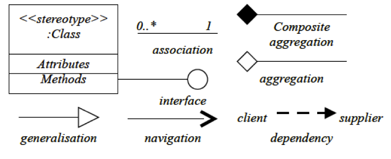

# 2.4 Κληρονομικότητα {#Java} 
© Γιάννης Κωστάρας

---

[<-](../2.3-Encapsulation/README.md) | [Δ](../../README.md) | [->](../2.5-Polymorphism/README.md)

---

## Κληρονομικότητα

Άλλο ένα "όπλο" που έχουν οι προγραμματιστές αντικειμενοστραφών προγραμμάτων στο "οπλοστάσιό" τους για τη δημιουργία πιο κατανοητού και ευκολότερα συντηρήσιμου κώδικα είναι η κληρονομικότητα (inheritance). Επιτρέπει την επαναχρησιμοποίηση κώδικα (DRY principle - Don't Repeat Yourself).

Τα κοινά στοιχεία δυο ή περισσοτέρων παρόμοιων κλάσεων μπορούν να οριστούν σε μια κοινή _υπερκλάση (superclass)_. Μία _υποκλάση (subclass)_ μπορεί να κληρονομήσει όλα τα "επιτρεπτά" γνωρίσματα και μεθόδους από τους "προγόνους" της (δηλ. όσα είναι δηλωμένα ως ```protected``` και ```public``` αλλά και ```package``` αν βρίσκεται στο ίδιο πακέτο με τους προγόνους της) εκτός από τις μεθόδους κατασκευής.

Μια υποκλάση μπορεί να ορίσει νέα γνωρίσματα και μεθόδους, μπορεί να επεκτείνει υφιστάμενες μεθόδους (overloading) ή ακόμα και να επανακαθορίσει υφιστάμενες μεθόδους (overriding). Όλες οι κλάσεις στη Java κληρονομούν από την κλάση ```Object```.

Ας δούμε ένα παράδειγμα. Ο κύκλος, το ορθογώνιο παραλληλόγραμμο κλπ. είναι όλα σχήματα (κληρονομούν από την υπερκλάση ```Shape```). Αυτό δηλώνεται με τη λέξη-κλειδί ```extends```.

```java
public abstract class Shape {   
  protected final Point[] points;
 
  Shape(int edges) {
     this.points = new Point[edges];
  }  

  Shape(Point[] points) {
     this.points = points;
  }

  public int getEdges() {
     return this.points.length;
  }
 
  protected abstract double area();

  protected abstract double perimeter();
}

final class Point {
  private final int x, y;

  public Point(int x, int y) {
    this.x = x;
      this.y = y;
  }

  public int getX() {
     return this.x;
  }

  public int getY() {
     return this.y;
  } 

}

public class Circle extends Shape {  
  private final int radius;

  Circle() {
    super(1);
	this.radius = 1;
  }  

  Circle(Point[] points, int radius) {
    super(points);
    this.radius = radius;
  }    
  
  public int getRadius() {
    return radius;
  }

  @Override
  public double area() {
      return Math.PI * (radius * radius);
  } 

  @Override
  public double perimeter() {
    return Math.PI * 2*radius;
  } 
}

public class Rectangle extends Shape {  
  private int width, height; 

  Rectangle(int width, int height) {
    super(4);
    this.width = width;
    this.height = height;
  }  

  Rectangle(Point[] points, int width, int height) {
    super(points);
    this.width = width;
    this.height = height;
  }
  
  public int getWidth() {
  	return width;
  }
  
  public int getHeight() {
  	return height;
  }
  

  @Override
  public double area() {
      return width * height;
  } 
  
  @Override
  public double perimeter() {
    return 2*width + 2*height;
  }  
}

```

Η λέξη-κλειδί ```super``` χρησιμοποιείται για να καλέσει η υποκλάση την υπερκλάση. Μπορεί να χρησιμοποιηθεί με δύο τρόπους:

* Για να καλέσει τον constructor της υπερκλάσης καθώς αυτοί δεν κληρονομούνται. Στην περίπτωση αυτή πρέπει να είναι η πρώτη εντολή στον κώδικα της μεθόδου κατασκευής της υποκλάσης.
* Για να καλέσει μία μέθοδο της υπερκλάσης

Η κληρονομικότητα ονομάζεται και ως _σχέση είναι τύπου (is-a)_ επειδή οι υποκλάσεις είναι του τύπου της υπερκλάσης. Ως συνέπεια αυτού μπορούμε να γράψουμε:

```java
Shape shape = new Circle();
```

## Αφαιρετικές Κλάσεις (Abstract class)
Ο κύριος λόγος της κληρονομικότητας είναι η εξαφάνιση διπλότυπου κώδικα (αρχή "Μην επαναλαμβάνεσαι" - "Don't Repeat Yourself" ή DRY principle). Δεν μπορούν να δημιουργηθούν αντικείμενα από αφαιρετικές κλάσεις. Πρέπει να κληρονομηθούν και να υλοποιηθούν οι αφαιρετικές μεθόδοι τους από τις υποκλάσεις.

Μια κλάση δηλώνεται ως αφαιρετική με την λέξη-κλειδί ```abstract```. Μια κλάση η οποία περιλαμβάνει έστω και μια «αφαιρετική» μέθοδο, καθίσταται επίσης αφαιρετική και πρέπει να δηλωθεί ως αφαιρετική (abstract). Μια κλάση που κληρονομεί από μια αφαιρετική κλάση θα πρέπει να υλοποιήσει όλες τις αφαιρετικές μεθόδους της υπερκλάσης, διαφορετικά ο μεταφραστής επιβάλλει να οριστεί και η υποκλάση ως αφαιρετική. 

Η κλάση ```Shape``` έχει δυο ```abstract``` μεθόδους (```area()``` και ```perimeter()```) και πρέπει να δηλωθεί κι αυτή ως ```abstract```.

Το παρακάτω UML διάγραμμα αναπαριστά την ανωτέρω ιεραρχία:


**Εικόνα 1** _Παράδειγμα ιεραρχίας κλάσεων στη UML_

Η σχέση μεταξύ των κλάσεων ```Shape```, ```Circle``` και ```Rectangle``` ονομάζεται _γενίκευση (generalization)_.

```Abstract``` κλάσεις και μέθοδοι αναπαρίστανται με πλάγια γραφή. Στο παραπάνω διάγραμμα βλέπουμε μια ακόμα σχέση μεταξύ κλάσεων, την _συσσωμάτωση (aggregation)_. Η σχέση αυτή δηλώνει ότι η κλάση ```Shape``` περιλαμβάνει μια συλλογή από σημεία (```Points```) τα οποία τα αποθηκεύει στην ```protected``` μεταβλητή ```points```.

Όπως μπορείτε να δείτε στην εικόνα 4 του 2ου μαθήματος αυτής τη εβδομάδας (το οποίο επαναλαμβάνεται παρακάτω)



**Εικόνα 2.2.4** _Διαγράμματα κλάσεων_

η UML υποστηρίζει διάφορους τύπους σχέσεων μεταξύ κλάσεων. Είδαμε τη _συσσωμάτωση (aggregation)_ αλλά υπάρχει και η _σύνθετη συσσωμάτωση (composite aggregation)_. Η διαφορά τους είναι ότι στη δεύτερη περίπτωση, αν καταστραφή το αντικείμενο που περιέχει τη συλλογή των συσσωματωμένων αντικειμένων, τότε καταστρέφονται και τα συσσωματωμένα αντικείμενα, ενώ στην περίπτωση της απλής συσσωμάτωσης, τα συσσωματωμένα αντικείμενα παραμένουν και μετά την καταστροφή του αντικειμένου που τα περιέχει. Π.χ. αν καταστραφή ένα αντικείμενο τύπου ```Rectangle``` το οποίο περιέχει τα 4 αντικείμενα τύπου ```Point``` για τις κορυφές του, τότε ανάλογα με το αν η εφαρμογή μας υποστηρίζει το ```Point``` ως σχήμα ή όχι, η σχέση θα μπορεί να είναι _aggregation_ (αν υποστηρίζει) ή _composite aggregation_ (αν δεν υποστηρίζει οπότε τα σημεία θα πρέπει να καταστραφούν μαζί με το αντικείμενο). Και στις δυο περιπτώσεις, αναπαρίσταται στον κώδικα με κάποια συλλογή (π.χ. πίνακα) πολλών αντικειμένων στη συσσωματωμένη κλάση. Συνήθως η σύνθετη συσσωμάτωση υλοποιείται ως εμφωλιασμένη κλάση (ώστε αντικείμενά της να καταστρέφονται όταν καταστρέφονται και τα αντικείμενα που τις περιέχουν).

Π.χ. 

```java
public abstract class Shape {   
  protected final Point[] points;
 
  Shape(int edges) {
     this.points = new Point[edges];
  }  

  Shape(Point[] points) {
     this.points = points;
  }

  public int getEdges() {
     return this.points.length;
  }
 
  protected abstract double area();

  protected abstract double perimeter();

  // nested class
  final class Point {
  	private final int x, y;
  	
  	public Point(int x, int y) {
  	  this.x = x;
  	    this.y = y;
  	}
  	
  	public int getX() {
  	   return this.x;
  	}
  	
  	public int getY() {
  	   return this.y;
  	} 
  }
}
```

Η σχέση _συσχέτιση (association)_ χρησιμοποιείται όταν μια κλάση σχετίζεται με μια άλλη, δηλ. την έχει ως γνώρισμά της.

Π.χ.

```java
class Fighter {
	private Weapon weapon;
}

class Weapon {
}
````


**Εικόνα 2** _Παράδειγμα association στη UML_

Τέλος, αν μέσα σε μια μέθοδο μιας κλάσης χρησιμοποιούμε ένα αντικείμενο μιας άλλης κλάσης αλλά χωρίς να την ορίζουμε ως γνώρισμα της κλάσης, τότε χρησιμοποιούμε τη σχέση _εξάρτηση (dependency)_.

## Διεπαφές (Interfaces)
Η Java (αντίθετα με άλλες γλώσσες προγραμματισμού όπως η C++) δεν υποστηρίζει πολλαπλή κληρονομικότητα κλάσεων. Αντιθέτως, υποστηρίζει πολλαπλή κληρονομικότητα διεπαφών.

Μία διεπαφή (interface) είναι μία δομή (παρόμοια με την κλάση) ή οποία περιέχει:

* Δηλώσεις μεθόδων (δηλ. αφαιρετικές - abstract) ή εξ'ορισμού (default) μεθόδους με τις υλοποιήσεις τους
* Σταθερές (constant) μεταβλητές

Με άλλα λόγια, αποτελεί ένα "συμβόλαιο" που θα πρέπει να υλοποιήσει μια κλάση. 

```java
public interface IShape {
	double PI = 3.1415;
	double area();
	double perimeter();
} 
```
Οι μέθοδοι και οι σταθερές μιας διεπαφής είναι εξ' ορισμού ```public```. 

Μια κλάση μπορεί να υλοποιεί (```implements```) μια ή περισσότερες διεπαφές. Επίσης, μια διεπαφή μπορεί να κληρονομήσει άλλες διεπαφές (```extends```) αλλά όχι άλλες κλάσεις.

Μία κλάση πρέπει να υλοποιεί _όλες_ τις μεθόδους μίας διεπαφής εκτός και αν είναι δηλωμένη ως ```abstract```.

```java
public abstract Shape implements IShape {
    protected final Point[] points;

    Shape(int edges) {
        this.points = new Point[edges];
    }

    Shape(Point[] points) {
        this.points = points;
    }

    public int getEdges() {
        return this.points.length;
    }
}
```

Στη UML ένα interface αναπαρίσταται με δυο τρόπους όπως φαίνεται στην ακόλουθη εικόνα (βλ. και Εικόνα 2.2.4):


**Εικόνα 3** _Παράδειγμα intefaces στη UML_

Χαρακτηριστικές διεπαφές της γλώσσας Java:

* ```Serializable```: ονομάζεται και marker interface καθώς δεν περιέχει καμία μέθοδο προς υλοποίηση.
* ```Comparable```: καθορίζει μία φυσική σειρά για τα αντικείμενα όπως ισχύει π.χ. για τους αριθμούς.
```java
interface Comparable {
	int compareTo(T o);
}
``` 
Π.χ.
```java
class Circle extends Shape implements Comparable {

	public int compareTo(Object o) {
		if (getRadius() > ((Circle) o).getRadius())
			return 1;
		else if (getRadius() < ((Circle) o).getRadius())
			return -1;
		else
			return 0;
	}
}
```
Επιστρέφει ```0``` αν τα δυο αντικείμενα είναι ίσα (έχουν ίσες ακτίνες), ```1``` αν το αντικείμενο ```this``` είναι μεγαλύτερο απ' αυτό που περνάμε για σύγκριση, ή ```-1``` στην αντίθετη περίπτωση.

* ```Cloneable```: επιτρέπει τη δημιουργία κλώνων της κλάσης
* ```Runnable```: υλοποιείται από κάθε κλάση που προορίζεται να εκτελείται ως νήμα (thread)
```java
interface Runnable {
	public void run();
}
```
Π.χ.
```java
public class Job implements Runnable {

	public void run() {
		System.out.println("Runs in a new thread.");
	}
}
```

## Ασκήσεις

1. Μετατρέψτε τα ακόλουθα UML διάγραμματα σε κώδικα Java


## Πηγές:
1. ["The Java Tutorial"](https://docs.oracle.com/javase/tutorial/)
1. Bloch J. (2018), _Effective Java_, 3rd Edition, Addison-Wesley.
1. Deitel P., Deitel H. (2018), _Java How to Program_, 11th Ed., Safari.
1. Downey A. B., Mayfield C. (2016), _Think Java_, O' Reilly. 
1. Eckel B. (2006), _Thinking in Java_, 4th Ed., Prentice-Hall.
1. Hillar G.C. (2017), _Java 9 with JShell_, Packt.
1. Horstmann C. S. (2016), _Core Java, Volume 1 Fundamentals_, 10th Ed., Prentice-Hall.
1. Horstmann C. S. (2018), _Core Java SE 9 for the impatient_, 2nd Ed., Addison-Wesley. 
1. Naftalin M., Wadler P. (2006), _Java Generics and Collections_, O'Reilly. 
1. Sharan K. (2017), _Java 9 Revealed: For Early Adoption and Migration_, Apress.
1. Sierra K. & Bates B. (2005), _Head First Java_, 2nd Ed. for Java 5.0, O’Reilly.

---

[<-](../2.3-Encapsulation/README.md) | [Δ](../../README.md) | [->](../2.5-Polymorphism/README.md)

---