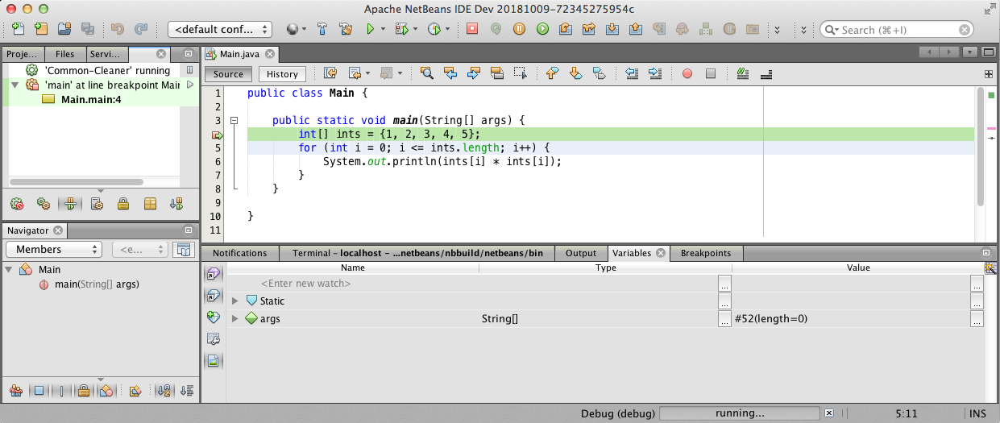

# 2.7 Αποσφαλμάτωση {#Java} 
© Γιάννης Κωστάρας

---

[<-](../2.6-JavaDoc/README.md) | [Δ](../../README.md) | [->](../2.8-BestPractices/README.md)

---

«Αποσφαλμάτωση» ή «εκσφαλμάτωση» (debugging) ονομάζεται η μεθοδική διαδικασία εύρεσης και εξάλειψης σφαλμάτων κώδικα ενός προγράμματος υπολογιστή ώστε να συμπεριφέρεται όπως προβλέπεται.

Η λέξη “Bug” (ή _σφάλμα_ στην ελληνική του απόδοση) προέρχεται από τη ναύαρχο Grace Hopper το 1940 καθώς εργαζόταν σε έναν Η/Υ τύπου Mark II στο Harvard. Η δυσλειτουργία του προγράμματος οφειλόταν σ’ ένα ζωύφιο (bug) που είχε κολλήσει σ’ ένα κύκλωμα, οπότε η διαδικασία αποκόλλησής του ονομάστηκε _debugging_. (Wikipedia)

Διαδικασία:

1. Πίστεψε ότι το πρόβλημα μπορεί να λυθεί και επέμενε μέχρι τη λύση του
1. Επανάληψη/επιβεβαίωση του προβλήματος (αν το πρόβλημα είναι αναπαραγώσιμο)
1. Απομόνωση του σημείου που εμφανίζεται το σφάλμα (συνήθως από τα αρχεία καταγραφής – logs)
1. Αναγνώριση της αιτίας που το προκαλεί
1. Διόρθωση του σφάλματος
1. Επιβεβαίωση της διόρθωσης

Με τη βοήθεια ενός _αποσφαλματωτή (debugger)_, ωθούμε το πρόγραμμα να εισέλθει σε μια συγκεκριμένη κατάσταση ώστε να εμφανιστεί το πρόβλημα.

Το NetBeans περιλαμβάνει έναν visual debugger που διευκολύνει τη διαδικασία.

## Αποσφαλμάτωση με το NetBeans
Δημιουργήστε ένα νέο έργο (project) με όνομα ```Debug``` στο NetBeans όπως μάθαμε στο πρώτο μάθημα αυτής της εβδομάδας. 
Επικολλήστε τον παρακάτω κώδικα μέσα στη μέθοδο ```main()```:

```java
public static void main(String[] args) {
   int[] ints = {1, 2, 3, 4, 5};
   for (int i = 0; i <= ints.length; i++) {
       System.out.println(ints[i]*ints[i]);
   }
}
```

Εκτελώντας το πρόγραμμα βλέπουμε το παρακάτω αποτέλεσμα (μενού ```Window --> Output```):
```java
1
4
9
16
25
Exception in thread "main" java.lang.ArrayIndexOutOfBoundsException: 5
```
Αν και το πρόγραμμα υπολογίζει σωστά τα τετράγωνα των 5 αριθμών (1-5), στο τέλος πετά μια εξαίρεση εκτέλεσης που μας δηλώνει ότι κάπου έχουμε κάνει κάποιο λογικό λάθος (τα λάθη μεταγλώττισης τα 'πιάνει' ο μεταγλωττιστής).

Μπορούμε να ελέγξουμε γραμμή-γραμμή που μπορεί να έχουμε κάνει λάθος, αλλά μπορούμε να χρησιμοποιήσουμε τον οπτικό μεταγλωττιστή του NetBeans.

Κάντε κλικ πάνω στον αριθμό γραμμής της πρώτης γραμμής της μεθόδου ```main()``` για να εισάγετε ένα _σημείο παύσης (breakpoint)_. Στη συνέχεια πατήστε το κουμπί **Debug** όπως φαίνεται στην παρακάτω εικόνα.



**Εικόνα 1** _Εκκίνηση του αποσφαλματωτή_

Η εκτέλεση του προγράμματος θα ξεκινήσει και θα σταματήσει στη γραμμή που έχετε ορίσει το σημείο παύσης. Από δω και πέρα μπορείτε να χρησιμοποιήσετε τα κουμπιά αποσφαλμάτωσης για να μετακινηθείτε γραμμή-γραμμή στον κώδικα, να εξετάσετε τις τιμές των μεταβλητών κλπ. 


**Εικόνα 2** _Παύση του αποσφαλματωτή σ' ένα σημείο παύσης_

Τα κουμπιά που φαίνονται μέσα στο κόκκινο πλαίσιο στην εικόνα 2 είναι τα εξής:

* Τερματισμός του αποσφαλματωτή (```Shift+F5```)
* Παύση εκτέλεσης
* Συνέχεια εκτέλεσης (```F5```)
* Εκτέλεση ενός βήματος χωρίς είσοδο μέσα στις μεθόδους, δηλ. οι μέθοδοι εκτελούνται σαν εντολές (```F8```)
* Εκτέλεση ενός βήματος χωρίς είσοδο μέσα στις εκφράσεις (```Shift+F8```)
* Εκτέλεση ενός βήματος μπαίνοντας μέσα στις μεθόδους (```F7```)
* Έξοδος από τη μέθοδο
* Εκτέλεση μέχρι εκεί που βρίσκεται ο δρομέας (```F4```)
* Εφαρμόζει τις αλλαγές στον κώδικα κατά τη διάρκεια της αποσφαλμάτωσης 
* Λαμβάνει ένα στιγμιότυπο  

Αν επιλέξατε να μην εγκαταστήσετε ένα ΟΠΕ στον Η/Υ σας, τότε μπορείτε να χρησιμοποιήσετε αυτόν τον [online αποσφαλματωτή](http://www.pythontutor.com/visualize.html#mode=edit) με τον οποίο μπορείτε επίσης να οπτικοποιήσετε την εκτέλεση του προγράμματός σας βήμα-βήμα.

## Πηγές:
1. [Αποσφαλμάτωση](https://el.wikipedia.org/wiki/%CE%91%CF%80%CE%BF%CF%83%CF%86%CE%B1%CE%BB%CE%BC%CE%AC%CF%84%CF%89%CF%83%CE%B7), Wikipedia
1. Spinellis D. (2017), _Effective Debugging_, Addison-Wesley.
1. [Using the Visual Debugger in NetBeans IDE](https://netbeans.org/kb/docs/java/debug-visual.html)

---

[<-](../2.6-JavaDoc/README.md) | [Δ](../../README.md) | [->](../2.8-BestPractices/README.md)

---