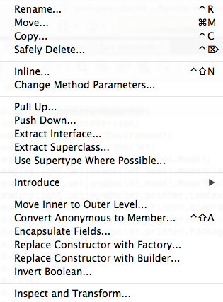

# 2.8 Καλές τεχνικές προγραμματισμού {#Java} 
© Γιάννης Κωστάρας

---

[<-](../2.7-Debugging/README.md) | [Δ](../../README.md)

---

Η συγγραφή κώδικα είναι τόσο επιστήμη όσο και τέχνη. Ένας καλός προγραμματιστής πρέπει να έχει υπόψιν του πολλές, πολλές φορές αντιδιαμετρικές, συνισταμένες ώστε να μπορέσει να γράψει ποιοτικό κώδικα.

Με τον όρο _ποιοτικό κώδικα_ εννοούμε κώδικα που είναι:

* Σωστός (correct), χωρίς λάθη ικανοποιώντας τις απαιτήσεις
* Εύρωστος (robust), δηλ. ανεκτικός σε μη αναμενόμενες συνθήκες (αμυντικός προγραμματισμός)
* Αποδοτικός (efficient), αποδοτική χρήση των πόρων
* Συντηρήσιμος (maintainable), δηλ. επεκτάσιμος (χωρίς να 'χαλάμε' άλλες λειτουργίες)
* (Επανα)Χρησιμοποιήσιμος (usable), δηλ. εύκολος στην κατανόηση και την χρήση

Η δουλειά μας ως προγραμματιστές είναι να βρούμε τη χρυσή τομή σ' όλα τα παραπάνω. 

Παρακάτω παρουσιάζουμε μερικές χρήσιμες συμβουλές που θα σας βοηθήσουν να γράφετε συντηρήσιμο και αποτελεσματικό κώδικα. Ο ποιοτικός κώδικας πρέπει να είναι: σωστός (bug free), επεκτάσιμος (extendable), συντηρήσιμος (maintenant), να μπορεί να τεστάρεται (testable), κλιμακωτός (scalable), αποδοτικός (performant) και ασφαλής (secure).

* Καλό είναι να σχολιάζετε τις κλάσεις και τις μεθόδους σας (χρησιμοποιώντας JavaDoc). Έτσι βοηθάτε και τους άλλους αλλά και τον εαυτό σας όταν ξαναεπισκέπτεστε τον κώδικα αργότερα χωρίς να χρειάζεται να διαβάζετε τον κώδικα για να καταλάβετε τι κάνει. (Βλ. π.χ. [εδώ](https://stackoverflow.com/questions/184618/what-is-the-best-comment-in-source-code-you-have-ever-encountered)). Βάλτε στα σχόλια ότι είναι χρήσιμο για τον προγραμματιστή, π.χ. μονάδα μέτρησης μιας παραμέτρου, URL όπου βρήκατε τον αλγόριθμο, ταυτότητα απαίτησης που υλοποιεί κλπ. 
* Αποφεύγετε να γράφετε "κρυπτοκώδικα", δηλ. δυσανάγνωστο κώδικα με "μαγικούς αριθμούς" χωρίς να εξηγείτε τι κάνουν. Ο κώδικας θα πρέπει να είναι ευκολοδιάβαστος έτσι ώστε, όπως λέμε, να μη χρειάζεται σχολιασμό, αν κι αυτό δεν είναι τις πιο πολλές φορές δυνατό. 
* Μια μέθοδος θα πρέπει να κάνει μόνο ένα πράγμα, π.χ. ```calculateSum()```. Μέθοδοι που κάνουν περισσότερα από ένα πράγματα π.χ. ```calculateSumAndAverage()``` καλό είναι να σπάνε σε μικρότερες μεθόδους. Οι περισσότερες μέθοδοί σας δε πρέπει να ξεπερνούν τις 10-15 γραμμές κώδικα. Αυτό δεν βοηθάει μόνο στην ευαναγνωσιμότητα του κώδικα αλλά και τον compiler να παράγει πιο αποδοτικό κώδικα.
* Προσπαθήστε ο κώδικάς σας και κυρίως οι μεθόδοι σας να είναι όσο πιο αυτόνομες γίνεται. Π.χ. να μην εξαρτιώνται από γνωρίσματα (καθολικές μεταβλητές). Ότι χρειάζεται μια μέθοδος καλό είναι να της το περνάτε ως όρισμα και να επιστρέφει την τιμή που πρέπει αντί ν' αλλάζει την τιμή ενός γνωρίσματος. Με αυτόν τον τρόπο μπορείτε αργότερα να μεταφέρετε τη μέθοδο σε άλλη κλάση χωρίς να χρειάζεται να κάνετε αλλαγές σ'αυτή καθώς δεν έχει εξαρτήσεις από την κλάση που την περιέχει.
* Χρησιμοποιείτε ```enum```s για να περιορίσετε τα πεδία τιμών των μεταβλητών όπου αυτό είναι δυνατό.

## Αμετάβλητες (Immutable) κλάσεις 
Κλάσεις που μπορούν ν' αλλάξουν τις τιμές των γνωρισμάτων τους μετά τη δημιουργία τους λέγονται μεταβαλλόμενες (mutable) κλάσεις. Αυτές συνήθως διαθέτουν μεθόδους ```setXXX()``` που επιτρέπουν ν' αλλάξουν την τιμή ενός γνωρίσματος. Μεταβάλλοντας την κατάσταση ενός αντικειμένου κατά τη διάρκεια εκτέλεσης ενός προγράμματος μερικές φορές είναι επικίνδυνο, ιδιαίτερα αν οι τιμές των γνωρισμάτων αλλάζουν από διαφορετικές διαδικασίες (processes) ή νήματα (threads) με μη ελεγχόμενα αποτελέσματα.
Οι immutable classes είναι ευκολότερες να σχεδιαστούν και να υλοποιηθούν απ' ότι οι mutable classes, πιο ασφαλής και είναι λιγότερο ευάλωτες σε λάθη.

Οι καλές τεχνικές προγραμματισμού προωθούν τη χρήση αμετάβλητων (immutable) κλάσεων. Οι τιμές των γνωρισμάτων (δηλ. η κατάσταση) ενός στιγμιοτύπου μιας immutable class δεν μπορούν (μπορεί) να αλλάξουν (αλλάξει) μετά τη δημιουργία του. Ας δούμε ένα παράδειγμα μιας αμετάβλητης κλάσης:

```java
public final class Point {
	private final int x, y;
	
	public Point() {
		x=0;
		y=0;
	}
	
	public Point(int x, int y) {
		this.x = x;
		this.y = y;
	}
	
	public int getX() {
		return x;
	}
	
	public int getY() {
		return y;
	}
}
```
Το πρώτο πράγμα που παρατηρούμε στην παραπάνω κλάση είναι ότι δε διαθέτει setters, ενώ τα γνωρίσματά του δηλώνονται ως σταθερές που σημαίνει ότι όταν λάβουν την αρχική τιμή τους, αυτή δεν μπορεί ν' αλλάξει αργότερα. Αν θέλουμε ν' αλλάξουμε τις συντεταγμένες ενός σημείου, θα πρέπει να δημιουργήσουμε ένα νέο στιγμιότυπο της κλάσης ```Point```. Επίσης η κλάση δηλώνεται ως ```final``` που σημαίνει ότι δεν μπορεί να κληρονομηθεί ώστε μια υποκλάση ν' αλλάξει αυτή τη συμπεριφορά.

Ακολουθήστε τους παρακάτω πέντε κανόντες για να δημιουργήσετε αμετάβλητες κλάσεις:

1. μην παρέχετε mutators (δηλ. μεθόδους που αλλάζουν τις τιμές των γνωρισμάτων της κλάσης)
1. μην επιτρέψετε στην κλάση να κληρονομηθεί (ορίστε τη ως ```final```)
1. όλα τα γνωρίσματα της κλάσης πρέπει να είναι σταθερές
1. όλα τα γνωρίσματα της κλάσης πρέπει να είναι ```private```
1. αν η κλάση σας διαθέτει μεταβλητά γνωρίσματα τότε αν δεν τα εκθέτετε σε άλλες κλάσεις η κλάση σας μπορεί να χαρακτηριστεί ως immutable

Η Java διαθέτει πολλά παραδείγματα αμετάβλητων κλάσεων όπως ```String```, ```Double```, ```Integer```, ```Color```, ```BigInteger``` και ```BigDecimal``` (αν και οι δυο τελευταίες δεν πληρούν όλα τα κριτήρια όπως θα δούμε σε επόμενο μάθημα) κλπ.

Είναι επίσης πολύ σημαντικό να καταλάβουμε τι σημαίνει η δήλωση π.χ. ```final Car car = new Car(...);```. Η δήλωση αυτή δηλώνει ότι η μεταβλητή ```car``` είναι ένας _δείκτης_ σε μια διεύθυνση της κύριας μνήμης η οποία αποθηκεύει ένα αντικείμενο τύπου ```Car```. Η δήλωση ```final``` σημαίνει ότι ο _δείκτης_ δεν μπορεί ν' αλλάξει, δηλ. να λάβει μια νέα τιμή. Δε σημαίνει όμως ότι και το αντικείμενο στο οποίο δείχνει δεν μπορεί ν' αλλάξει, εκτός κι αν το αντικείμενο αυτό είναι αμετάβλητο (immutable). Η κλάση ```Car``` όμως μπορεί να μεταβληθεί (mutable), όπως είδαμε στα προηγούμενα μαθήματα, με αποτέλεσμα κώδικας που χρησιμοποιεί την μεταβλητή ```car``` μπορεί να τροποποιήσει τα γνωρίσματα του αντικειμένου στο οποίο δείχνει η ```car``` παρόλο που δηλώνουμε ότι είναι ```final``` (γιατί το ```final``` αναφέρεται μόνο στον δείκτη της μνήμης κι όχι στο αντικείμενο αυτό καθαυτό που δείχνει ο δείκτης αυτός).

## Εγγραφές (records)
Από την έκδοση 14 και μετά εισήχθηκαν στη γλώσσα οι _εγγραφές (records)_. Όταν αναπαριστούμε ως κλάσεις αντικείμενα του πραγματικού κόσμου, συνήθως γράφουμε μια κλάση που περιέχει απλά τα γνωρίσματα (attributes) και μεθόδους προσπέλασης αυτών των αντικειμένων (δηλ. ```getXXX()``` και ```setXXX()```). Π.χ.

```java
public final class Point {
    private final int x;
    private final int y;

    public Point(int x, int y) {
        this.x = x;
        this.y = y;
    }

    public int getX() {
        return x;
    }

    public int getY() {
        return y;
    }

    @Override
    public int hashCode() {
        int hash = 7;
        hash = 37 * hash + this.x;
        hash = 37 * hash + this.y;
        return hash;
    }

    @Override
    public boolean equals(Object obj) {
        if (this == obj) {
            return true;
        }
        if (obj == null) {
            return false;
        }
        if (getClass() != obj.getClass()) {
            return false;
        }
        final Point other = (Point) obj;
        if (this.x != other.x) {
            return false;
        }
        if (this.y != other.y) {
            return false;
        }
        return true;
    }

    @Override
    public String toString() {
        return "Point{" + "x=" + x + ", y=" + y + '}';
    }  
  
}
```
Πολύς κώδικας για να περιγράψετε ένα σημείο στο δισδιάστατο χώρο, έτσι δεν είναι; Από την έκδοση 14 και μετά εισήχθηκε στη γλώσσα η εγγραφή. Ο παρακάτω κώδικας είναι ισοδύναμος με τον παραπάνω!

```java
public record Point(int x, int y) { 
}
```
και μπορούμε δημιουργήσουμε αντικείμενα της ```Point``` κατά τα γνωστά:

```java
Point p = new Point (0, 0);
int x = p.x();
```
Παρατηρήστε ότι πλέον οι μέθοδοι ανάγνωσης των τιμών των γνωρισμάτων δεν ονομάζονται πλέον ```getXXX()``` αλλά ```XXX()```. Επίσης, ένα record είναι αμετάβλητο (immutable), δεν επιτρέπεται να κληρονομήσει άλλες κλάσεις (```extends```) αλλά επιτρέπεται να υλοποιήσει (```implements```) διεπαφές. Οι εγγραφές είναι ως επί των πλείστων _πλειάδες (tuples)_ αλλά με περισσότερες δυνατότητες.

Φυσικά, μπορείτε να ορίσετε και τις δικές σας μεθόδους σε μια εγγραφή, να ορίσετε compact constructors, όπως:

```java
public record Point(int x, int y) { 
	public Point {
		if (x < 0 || y < 0) 
			throw new IllegalArgumentException(
			      "x and y must be positive");
	}
}
```
ή ακόμα και εναλλακτικές μεθόδους κατασκευής (alternative constructors), π.χ.
```java
public record Point(int x, int y) { 
	public static Point of(int x, int y) {
		this.x = x;
		this.y = y;
	}
}
```

## Αναδιοργάνωση Κώδικα (Refactoring)
Πολλές φορές συμβαίνει να θέλετε να προσθέσετε ένα νέο χαρακτηριστικό σε ένα πρόγραμμα, αλλά η δομή του προγράμματος είναι τέτοια που δεν είναι εύκολο ή εφικτό να προστεθεί αυτό το νέο χαρακτηριστικό. Σ' αυτήν την περίπτωση, θα πρέπει πρώτα να αναδιοργανώσετε τον κώδικα ώστε να είναι ευκολότερο να εισάγετε νέα χαρακτηριστικά.

**Ορισμός**: Με τον όρο _Αναδιοργάνωση Κώδικα (Refactoring)_ εννούμε μια αλλαγή στην δομή ενός προγράμματος ώστε να κάνουμε τον κώδικα πιο κατανοητό και ευκολότερο στην αλλαγή χωρίς όμως να αλλάξουμε τη συμπεριφορά του. Συνήθως, η αναδιοργάνωση κώδικα βελτιώνει την ποιότητα του κώδικα, τον καθιστά πιο κατανοητό ή/και ευκολότερο ν' αλλάξει/επεκταθεί.

Παραδείγματα: _Εξαγωγή κώδικα σε νέα μέθοδο (Extract Method)_, _Μετακίνηση Μεθόδου σε Άλλη Κλάση (Move Method)_, 

Όλα τα μοντέρνα ΟΠΕ (Integrated Development Environments - IDEs) προσφέρουν δυνατότητες refactoring. Π.χ. το NetBeans διαθέτει το μενού **Refactor**.



**Εικόνα 2.8.1** _Μενού Refactor του NetBeans_ 

Η **Rename** είναι η πιο συνήθης εντολή αναδιοργάνωσης καθώς σας επιτρέπει ν' αλλάξετε το όνομα μια μεταβλητής, μεθόδου, κλάσης κλπ. με ασφάλεια χωρίς να "σπάτε" τον κώδικα.

Δείτε [εδώ](https://netbeans.org/kb/docs/java/editor-inspect-transform.html) για το μενού **Inspect and Transform**.

## Πηγές:
1. ["The Java Tutorial"](https://docs.oracle.com/javase/tutorial/)
1. Bloch J. (2018), _Effective Java_, 3rd Edition, Addison-Wesley.
1. Deitel P., Deitel H. (2018), _Java How to Program_, 11th Ed., Safari.
1. Downey A. B., Mayfield C. (2016), _Think Java_, O' Reilly. 
1. Eckel B. (2006), _Thinking in Java_, 4th Ed., Prentice-Hall.
1. Evans B. (2020), [Records Come to Java](https://blogs.oracle.com/javamagazine/records-come-to-java), Java Magazine.
1. Fowler M. (1999), _Refactoring, Improving the Design of Existing Code_, Addison-Wesley.
1. Fowler M. (2019), _Refactoring, Improving the Design of Existing Code_, 2nd Ed., Addison-Wesley.
1. Hillar G.C. (2017), _Java 9 with JShell_, Packt.
1. Horstmann C. S. (2016), _Core Java, Volume 1 Fundamentals_, 10th Ed., Prentice-Hall.
1. Horstmann C. S. (2018), _Core Java SE 9 for the impatient_, 2nd Ed., Addison-Wesley. 
1. Sharan K. (2017), _Java 9 Revealed: For Early Adoption and Migration_, Apress.
1. Sierra K. & Bates B. (2005), _Head First Java_, 2nd Ed. for Java 5.0, O’Reilly.
1. Visser J. (2016), _Building Maintainable Software, Java Edition_, O’Reilly.
1. [Java Notes for Professionals](https://books.goalkicker.com/JavaBook/JavaNotesForProfessionals.pdf)

---

[<-](../2.7-Debugging/README.md) | [Δ](../../README.md)

---