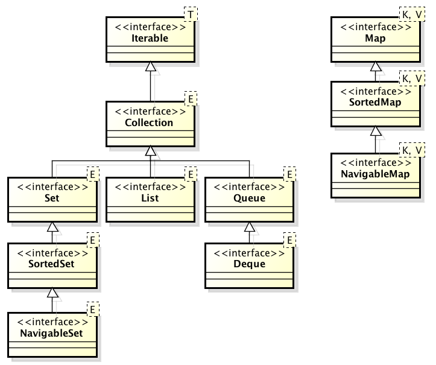

# 3.1 Δομές Δεδομένων {#Java} 
© Γιάννης Κωστάρας

---

[Δ](../../README.md) | [->](../3.2-Lists/README.md)

---

_Δεδομένα (data)_ είναι η αφαιρετική αναπαράσταση της πραγματικότητας και συνεπώς μια απλοποιημένη όψη της. _Πληροφορία (information)_ είναι η συλλογή δεδομένων και ο συσχετισμός τους. _Πληροφορική_ είναι η επιστήμη που μελετά τα δεδομένα κάτω απ’ τις ακόλουθες σκοπιές:

* Υλικού
* Γλωσσών προγραμματισμού
* Δομών Δεδομένων
* Ανάλυσης Δεδομένων

Με τον όρο _Δομή Δεδομένων (data structure)_ εννοούμε ένα σύνολο δεδομένων μαζί μ’ ένα σύνολο επιτρεπτών λειτουργιών στα δεδομένα αυτά. Υπάρχουν τριών ειδών τύποι δεδομένων:

* _υλικού_, π.χ. προσημασμένος ακέραιος σταθερής υποδιαστολής
* _ιδεατοί_, δηλ. τύπους δεδομένων που προσφέρει η γλώσσα προγραμματισμού όπως int, boolean κλπ.
* _αφηρημένοι_, δηλ. τύποι δεδομένων που δημιουργεί ο προγραμματιστής για ν’ απεικονίσει καλύτερα τα δεδομένα του προβλήματός του.

Μια δομή δεδομένων αποτελείται από τα εξής τρία στοιχεία:

* μια δομή αποθήκευσης
* ένα σύνολο συναρτήσεων που εκτελούν μια λειτουργία στο περιεχόμενο της δομής
* ένα σύνολο από αλγορίθμους, έναν αλγόριθμο ανά συνάρτηση, που περιγράφουν τις λειτουργίες στο περιεχόμενο της δομής.

_Αλγόριθμος_ είναι ένα πεπερασμένο σύνολο εντολών αυστηρά καθορισμένων και εκτελέσιμων σε πεπερασμένο χρόνο για να επιτευχθεί ένα επιθυμητό αποτέλεσμα. Και μην ξεχνάμε:

**Αλγόριθμοι + Δομές Δεδομένων = Προγράμματα** 

Οι βασικές λειτουργίες (ή πράξεις) επί των δομών είναι οι ακόλουθες:

* Προσπέλαση 
* Εισαγωγή
* Διαγραφή
* Αναζήτηση
* Ταξινόμηση
* Αντιγραφή
* Συγχώνευση
* Διαχωρισμός

Δεν χρησιμοποιούνται πάντα όλες οι παραπάνω πράξεις σε όλες τις δομές. Στη συνέχεια αυτής της εβδομάδας θα μελετήσουμε τις διάφορες δομές δεδομένων της γλώσσας προγραμματισμού Java με βάση τις παραπάνω πράξεις. Έχουμε ήδη δει τη δομή δεδομένων πίνακας την 1η εβδομάδα.

Μια δομή δεδομένων αποτελείται από _κόμβους (nodes)_. Ένας _κόμβος_ με τη σειρά του αποτελείται από _πεδία (fields)_ τα οποία διακρίνονται σε _δεδομένα (data)_ και _δείκτες (links)_. Ένας _δείκτης_ δείχνει στη διεύθυνση ενός κόμβου και η διεύθυνση αυτή μπορεί να είναι είτε απόλυτη, είτε σχετική, είτε μια διεύθυνση βάσης. 

Ανάλογα, επομένως, με το πόσους δείκτες διαθέτει μια δομή δεδομένων, μπορούμε να τις ταξινομήσουμε στις ακόλουθες κατηγορίες:

* κανένας δείκτης, δηλ. μόνο δεδομένα (πίνακες)
* ένας δείκτης (γραμμικές λίστες)
* δύο δείκτες (δυαδικά δέντρα)
* περισσότεροι από δύο δείκτες (δέντρα, γράφοι)

Επίσης, θα μιλήσουμε και για τις δυνατότητες αναζήτησης και ταξινόμησης που προσφέρει η γλώσσα.

## Δομές Δεδομένων στη Java

Προτού προχωρήσουμε, θα δώσουμε μια σύντομη περιγραφή των δομών δεδομένων που προσφέρει η γλώσσα Java. 



**Εικόνα 1** _Οι βασικές κλάσεις συλλογών της Java_

Όπως βλέπετε στην παραπάνω εικόνα, αυτές χωρίζονται σε δυο μεγάλες κατηγορίες:

* _Συλλογές (```Collection```s)_ ή _Ακολουθίες (Sequences)_ 
* _Πίνακες κατακερματισμού (```Map```s) ή Συσχετιζόμενοι πίνακας (associative maps)_

Οι συλλογές αποθηκεύουν τα δεδομένα με ακολουθιακό τρόπο και κατηγοριοποιούνται σε:

* _Σύνολα (```Set```s)_ που δεν περιέχουν διπλότυπα, δηλ. την ίδια τιμή πάνω από μια φορά, ενώ δεν έχει σημασία η σειρά των δεδομένων. Η υποκλάση ```SortedSet``` ταξινομεί τα δεδομένα της. Η ```NavigableSet``` διαθέτει μεθόδους που επιτρέπουν να βρείτε το στοιχείο που είναι πιο κοντά σ' ένα στοιχείο που αναζητάτε σ' αυτήν.
* _Λίστες (```List```s)_ όπου η σειρά των δεδομένων έχει σημασία αλλά μπορούν να περιέχουν διπλότυπα
* _Ουρές ()_ που δέχονται δεδομένα από την ουρά τους (tail) και εξάγουν δεδομένα προς επεξεργασία από την κεφαλή τους (head). Η υποκλάση ```Deque``` είναι μια διπλή ουρά, δηλ. επιτρέπει την εισαγωγή/εξαγωγή δεδομένων κι από τα δυο άκρα της.  
Οι πίνακες κατακερματισμού αποτελούν συσχετίσεις _κλειδιού-τιμής (key-value)_, δηλ. μπορείτε να ανακτάτε την τιμή αν γνωρίζετε το κλειδί. Η υποκλάση ```SortedMap``` εγγυάται ότι θα επιστρέψει τις τιμές με αύξουσα τιμή του κλειδιού, ενώ η ```NavigableMap``` (όπως και η ```NavigableSet```) βρίσκει το στοιχείο που είναι πιο κοντά σ' ένα στοιχείο που αναζητάτε σ' αυτήν.

## Πηγές
1. ["The Java Tutorial"](https://docs.oracle.com/javase/tutorial/)
1. Bloch J. (2018), _Effective Java_, 3rd Edition, Addison-Wesley.
1. Deitel P., Deitel H. (2018), _Java How to Program_, 11th Ed., Safari.
1. Downey A. B., Mayfield C. (2016), _Think Java_, O' Reilly. 
1. Eckel B. (2006), _Thinking in Java_, 4th Ed., Prentice-Hall.
1. Hillar G.C. (2017), _Java 9 with JShell_, Packt.
1. Horstmann C. S. (2016), _Core Java, Volume 1 Fundamentals_, 10th Ed., Prentice-Hall.
1. Horstmann C. S. (2018), _Core Java SE 9 for the impatient_, 2nd Ed., Addison-Wesley. 
1. Naftalin M., Wadler P. (2006), _Java Generics and Collections_, O'Reilly. 
1. Sharan K. (2017), _Java 9 Revealed: For Early Adoption and Migration_, Apress.
1. Sierra K. & Bates B. (2005), _Head First Java_, 2nd Ed. for Java 5.0, O’Reilly.

---

[Δ](../../README.md) | [->](../3.2-Lists/README.md)

---