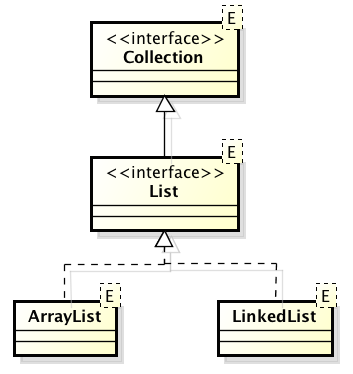

# 3.2 Λίστες {#Java} 
© Γιάννης Κωστάρας

---

[<-](../3.1-DataStructures/README.md) | [Δ](../../README.md) |  [->](../3.3-Generics/README.md) 
 
---

_Γραμμική λίστα Χ_ είναι ένα πεπερασμένο σύνολο ```n>0``` κόμβων, ```X[0], X[1], ..., X[n-1]``` με την ιδιότητα το στοιχείο ```Χ[0]``` είναι ο πρώτος κόμβος και κάθε κόμβος ```Χ[k]``` προηγείται του ```Χ[k+1]``` και έπεται του κόμβου ```Χ[k-1]```, όπου ```1<k<n-1```. 

Ο πρώτος κόμβος λέγεται _κεφαλή (head)_ ενώ ο τελευταίος _ουρά (tail)_. Η πιο συνηθισμένη μορφή γραμμικής λίστας είναι η _διατεταγμένη γραμμική λίστα_. Οι πίνακες, που εξετάστηκαν στην πρώτη εβδομάδα, είναι μια μορφή γραμμικής λίστας. Ενδιαφέρον παρουσιάζουν οι λίστες όπου οι εισαγωγές/διαγραφές/προσπελάσεις στους κόμβους γίνονται πάντα είτε στον πρώτο είτε στον τελευταίο κόμβο:

* _στοίβες (stacks)_, όπου η εισαγωγή/εξαγωγή των κόμβων γίνεται από μια μόνο άκρη (LIFO - Last In First Out), όπως ακριβώς και μια στοίβα από πιάτα
* _πολλαπλές στοίβες (multiple stacks)_
* _ουρές (queues)_, όπου η εισαγωγή/εξαγωγή κόμβων γίνεται από διαφορετικά άκρα (FIFO - First In First Out), όπως ακριβώς και σε μια ουρά τραπέζης 
* _διπλές ουρές (double ended queues ή dequeues)_
* _διπλές ουρές μόνο με εισαγωγές (output restricted dequeues)_
* _διπλές ουρές μόνο με εξαγωγές (input restricted dequeues)_

Οι γραμμικές λίστες κατατάσσονται σε δυο κατηγορίες:

* _σειριακές (sequential)_, όπου οι κόμβοι καταλαμβάνουν συνεχόμενες θέσεις μνήμης
* _συνδεδεμένες (linked)_, όπου οι κόμβοι καταλαμβάνουν απομακρυσμένες θέσεις μνήμης συνδεδεμένες μεταξύ τους με δείκτες.

Όλα τα είδη γραμμικών λιστών μπορούν να υλοποιηθούν και με τους δυο παραπάνω τρόπους, δηλ. και ως σειριακές και ως συνδεδεμένες. 

Επίσης, οι γραμμικές λίστες κατατάσσονται και ως:

* _στατικές_, δηλ. έχει προκαθοριστεί η ακριβής χωρητικότητα της κύριας μνήμης που απαιτείται για την αποθήκευση των κόμβων τους
* _δυναμικές_, δηλ. καταλαμβάνουν μεταβλητό χώρο στη μνήμη καθώς επιτρέπεται η επέκταση/συρρίκνωση τους κατά τη διάρκεια του προγράμματος.

Οι πίνακες που είδαμε την 1η εβδομάδα είναι _σειριακές_ δομές δεδομένων (οι κόμβοι τους καταλαμβάνουν συνεχόμενες θέσεις μνήμης) και _στατικές_, αφού πρέπει να προκαθορίσουμε την ακριβή χωρητικότητα μνήμης που απαιτείται για την αποθήκευση των κόμβων τους.

## Λίστες Πινάκων (```ArrayList```)
Το γεγονός ότι ο πίνακας είναι μια στατική δομή δεδομένων δημιουργεί πολλούς περιορισμούς στην ανάπτυξη προγραμμάτων όταν χρειαζόμαστε μια δυναμική δομή, δηλ. μια δομή που το μέγεθός της μπορεί ν' αλλάζει δυναμικά. Η κλάση ```ArrayList``` διορθώνει αυτόν τον περιορισμό. Κληρονομεί από τη διεπαφή ```List```.



**Εικόνα 1** _Λίστες στη Java_

```java
jshell> List array = new ArrayList();
array ==> []

jshell> array.add(10);
|  Warning:
|  unchecked call to add(E) as a member of the raw type java.util.List
|  array.add(10)
|  ^-----------^
$1 ==> true

jshell> array.add(20);
$2 ==> true

jshell> array.add(30);
$3 ==> true

jshell> array
array ==> [10, 20, 30]

jshell> array.size()
$4 ==> 3
```

Στο πιο πάνω παράδειγμα, δημιουργήσαμε μια νέα ```ArrayList``` και προσθέσαμε 3 αριθμούς σ' αυτή. Θα δούμε πως θα εξαφανίσουμε την προειδοποίηση (warning) που εμφανίζεται στο επόμενο μάθημα. Τέλος καλέσαμε τη μέθοδο ```size()``` για να δούμε το μέγεθός της. Όπως ίσως παρατηρήσατε, δεν απαιτείται να δώσουμε κάποιο μέγεθος στην ```ArrayList```. Αυτή μεγαλώνει αυτόματα καθώς προσθέτουμε στοιχεία σ' αυτή.

Θα μπορούσαμε ν' αρχικοποιήσουμε την παραπάνω λίστα και ως εξής:

```java
jshell> List array = List.of(10, 20, 30);
array = [10, 20, 30]

jshell> List array = Arrays.asList(10, 20, 30);
array = [10, 20, 30]
```

Προσοχή όμως. Και στις δυο αυτές περιπτώσεις επιστρέφεται μια λίστα η οποία _δεν_ μπορεί να μεταβληθεί.

```java
jshell> array.add(40)
|  Warning:
|  unchecked call to add(E) as a member of the raw type java.util.List
|  array.add(40)
|  ^-----------^
|  java.lang.UnsupportedOperationException thrown
|        at AbstractList.add (AbstractList.java:153)
|        at AbstractList.add (AbstractList.java:111)
|        at (#43:1)

```
Για να μπορέσουμε να δημιουργήσουμε μια μεταβαλλόμενη λίστα σ' αυτή την περίπτωση, πρέπει να χρησιμοποιήσουμε την μέθοδο κατασκευής της ```ArrayList``` που δέχεται μια άλλη συλλογή:

```java
jshell> List array = new ArrayList(Arrays.asList(10, 20, 30));
|  Warning:
|  unchecked call to ArrayList(java.util.Collection<? extends E>) as a member of the raw type java.util.ArrayList
|  List array = new ArrayList(Arrays.asList(10, 20, 30));
|               ^--------------------------------------^
array ==> [10, 20, 30]

jshell> array.add(40)
|  Warning:
|  unchecked call to add(E) as a member of the raw type java.util.List
|  array.add(40)
|  ^-----------^
$5 ==> true

jshell> array
array ==> [10, 20, 30, 40]
```

Η ```ArrayList``` κληρονομεί από τη διεπαφή ```List``` η οποία με τη σειρά της κληρονομεί από την ```Collection```.


**Εικόνα 2** _Διεπαφή ```Collection```_


**Εικόνα 3** _Διεπαφή ```List```_

Στη συνέχεια θα δούμε τις διάφορες μεθόδους της κλάσης.

### Προσπέλαση στοιχείων
Παρακάτω βλέπουμε 4 τρόπους προσπέλασης των στοιχείων μιας λίστας. Για να προσπελάσουμε κάποιο στοιχείο της λίστας αν γνωρίζουμε το δείκτη του:

```java
jshell> array.get(0);
$6 ==> 10
```

Ο κλασικός τρόπος προσπέλασης των στοιχείων της λίστας:
```java
jshell> int sum = 0;
sum ==> 0

jshell> for (int i=0; i < array.size(); i++)
	...>    sum += (int)array.get(i);

jshell> sum
sum ==> 60
```
Παρατηρήστε ότι τα στοιχεία της λίστας αποθηκεύονται ως τύπου ```Object``` οπότε θα πρέπει να κάνουμε cast στον σωστό τύπο δεδομένων όταν τα προσπελάζουμε. 

Ο παραπάνω τρόπος προσπέλασης των στοιχείων της λίστας έχει το μειονέκτημα ότι εκθέτει τον εσωτερικό τρόπο αποθήκευσης των δεδομένων (δηλ. ότι η δομή ```ArrayList``` χρησιμοποιεί δείκτες εσωτερικά). Ο ακόλουθος τρόπος, με τη χρήση επαναλήπτη (iterator), 'κρύβει' τις λεπτομέρειες υλοποίησης της συλλογής και δείχνει έναν πιο καθολικό τρόπο προσπέλασης των δεδομένων. Παρατηρήστε ότι και πάλι πρέπει να κάνουμε cast στο σωστό τύπο δεδομένων.

```java
jshell> int sum = 0
sum ==> 0

jshell> Iterator iter = array.iterator();
iter ==> java.util.Arrays$ArrayItr@13805618

jshell> while (iter.hasNext()) 
	...>    sum += (int)iter.next();
```

Η διεπαφή ```Collection``` επεκτείνει τη διεπαφή ```Iterable```:
```java
interface Iterable {
	public Iterator iterator();
}

interface Iterator {
	public boolean hasNext();
	public Object next();
	public void remove();
}
```

Τέλος, με τον αναβαθμισμένο βρόγχο ```for``` που εισήχθηκε στην έκδοση 5:

```java
jshell> sum = 0
sum ==> 0

jshell> for (Object n : array) 
	...>    sum += (int)n;
```

Στο επόμενο μάθημα θα δούμε πώς μπορούμε να ξεφορτωθούμε το casting. 

### Εισαγωγή στοιχείων
Όπως είδαμε, η εισαγωγή δεδομένων στο τέλος της λίστας γίνεται με την μέθοδο ```add()```. Η μέθοδος επιστρέφει ```true``` αν η εισαγωγή του στοιχείου ήταν επιτυχής, αλλοιώς επιστρέφει ```false```. Υπάρχει και η ακόλουθη έκδοση της μεθόδου που μας επιτρέπει να εισάγουμε ένα στοιχείο σε μια συγκεκριμένη θέση της λίστας.

```java
jshell> array.add(1, 15)
|  Warning:
|  unchecked call to add(int,E) as a member of the raw type java.util.List
|  array.add(1, 15)
|  ^--------------^

jshell> array
array ==> [10, 15, 20, 30]
```
Η παραπάνω μέθοδος εισάγει ένα νέο στοιχείο (```15```) στη 2η θέση (```1```) της λίστας ```array```. Αυτό σημαίνει ότι τα υπόλοιπα στοιχεία της λίστας (δεξιά του δεύτερου στοιχείου) μετακινούνται δεξιότερα κατά μια θέση για ν' αφήσουν χώρο για το νέο στοιχείο.

Με τις μεθόδους ```addAll(Collection c)``` και ```addAll(int i, Collection c)``` μπορούμε να προσθέσουμε με τη μια μια συλλογή από στοιχεία στη λίστα μας.

Υπάρχει και η μέθοδος ```set(int i, E e)``` που αντικαθιστά το στοιχείο στη θέση ```i``` με το νέο στοιχείο ```e``` και επιστρέφει το προηγούμενο στοιχείο στη θέση ```i```.

```java
jshell> array.set(3, 25)
|  Warning:
|  unchecked call to set(int,E) as a member of the raw type java.util.List
|  array.set(3, 25)
|  ^--------------^
$7 ==> 30

jshell> array
array ==> [10, 15, 20, 25]
```

### Διαγραφή στοιχείων
Η μέθοδος ```remove(int i)``` διαγράφει το στοιχείο της λίστας στη θέση ```i``` και επιστρέφει το στοιχείο που διέγραψε από τη λίστα. Υπάρχει όμως και η μέθοδος ```remove(Object o)``` η οποία διαγράφει το πρώτο στοιχείο που θα βρει που είναι ίσο με το ```ο``` και επιστρέφει ```true``` αν τα κατάφερε.

Εδώ χρειάζεται μεγάλη προσοχή όταν διαθέτουμε λίστες τα στοιχεία των οποίων είναι ```int``` (ή ```Integer```). Καλώντας π.χ. ```remove(25)```, ποια από τις δυο παραπάνω εκδόσεις καλείται, η ```remove(int i)``` ή η ```remove(Object o)```;

```java
jshell> array.remove(15)
|  java.lang.IndexOutOfBoundsException thrown: Index 15 out-of-bounds for length 3
|        at Preconditions.outOfBounds (Preconditions.java:64)
|        at Preconditions.outOfBoundsCheckIndex (Preconditions.java:70)
|        at Preconditions.checkIndex (Preconditions.java:248)
|        at Objects.checkIndex (Objects.java:372)
|        at ArrayList.remove (ArrayList.java:517)
|        at (#57:1)
```

Όπως καταλαβαίνετε από το λάθος της παραπάνω κλήσης, καλείται η ```remove(int i)```. Καθώς δεν υπάρχει 16ο στοιχείο, εμφανίζεται το λάθος ```IndexOutOfBoundsException```. Γιατί η Java προτιμάει την ```remove(int i)``` από την ```remove(E e)```; Η ```remove(int i)``` αποτελεί μέρος της ```List``` ενώ η ```remove(E e)``` της υπερκλάσης ```Collection```, επομένως η ```ArrayList``` πρώτα ψάχνει στην πιο κοντινή της κλάσης/διεπαφή από την οποία κληρονομεί.

Πώς θα μπορούσαμε σ' αυτή την περίπτωση να καλέσουμε τη σωστή μέθοδο;

```java
jshell> array.remove((Integer)15)
$8 ==> false 
```
επειδή το στοιχείο ```15``` δεν υπάρχει στη λίστα μας.

Επίσης, πολύ μεγάλη προσοχή χρειάζεται αν διαγράφετε στοιχεία από μια λίστα ενώ προσπελάζετε τα στοιχεία της:

```java
jshell> array
array ==> [5, 10, 20, 30]

jshell> for (int i=0; i < array.size(); i++) 
   ...> if (array.get(i) == 5)
   ...> array.remove(i)
   
jshell> array
array ==> [10, 20, 30]

jshell> for (Iterator i = array.iterator(); i.hasNext(); ) {
   ...> int n = (int)i.next(); 
   ...> if (n == 10) i.remove();
   ...> }

jshell> array
array ==> [20, 30]

jshell> for (Object n : array) {
   ...> if ((int)n == 30) array.remove((Integer)n) ;
   ...> }
}

jshell> array
array ==> [20]
```

Τέλος, η διεπαφή ```Collection``` παρέχει και τις ακόλουθες δυο μεθόδους οι οποίες μπορούν να διαγράψουν με τη μία από τη λίστα μας όλα τα στοιχεία της παρεχόμενης συλλογής ```c``` (```removeAll(Collection c)```) και επιστρέφει ```true``` αν τα κατάφερε (αν δεν κατάφερε να διαγράψει έστω και ένα από τα στοιχεία της ```c``` από τη λίστα μας, τότε επιστρέφει ```false```).

Η ```retainAll(Collection c)``` κρατάει από τη λίστα μας μόνο τα στοιχεία που περιέχονται στη ```c``` και διαγράφει όλα τα υπόλοιπα. 

### Αναζήτηση στοιχείων
Όπως οι πίνακες διαθέτουν τη βοηθητική κλάση ```java.util.Arrays```, έτσι και οι συλλογές διαθέτουν τη δική τους βοηθητική κλάση ```Collections```.
```java
jshell> array 
array ==> [10, 20, 30]

jshell> array.contains(10)
$9 ==> true

jshell> Collections.binarySearch(array, 30); // εύρεση του 4
$10 ==> 2  // επιστρέφει τον δείκτη αν βρέθηκε, ή έναν αρνητικό αριθμό (-(insertion point) - 1) αν δε βρέθηκε 
// Άσκηση: πώς θα μπορούσατε να κάνετε αναζήτηση χωρίς τη χρήση της παραπάνω μεθόδου;
```

Το αν η ```contains()``` επιστρέψει σωστά αποτελέσματα ή όχι εξαρτάται αν έχετε υλοποιήσει σωστά τη ```hashCode()```.

### Ταξινόμηση λίστας
```java
jshell> array
array ==> [10, 20, 30, 5]

jshell> Collections.sort(array); // με αριθμητική σειρά

jshell> array
array ==> [5, 10, 20, 30]

jshell> Collections.sort(array, Collections.reverseOrder())

jshell> array
array ==> [30, 20, 10, 5]
```

Από την έκδοση 8 και μετά, μια μέθοδος ```sort()``` προστέθηκε στην διεπαφή ```List```: ```void List.sort(Comparator c)``` η οποία δέχεται έναν ```Comparator```:

```java
jshell> array
src ==> [10, 20, 5, 30]

jshell> array.sort(Comparator.naturalOrder())

jshell> array
array ==> [5, 10, 20, 30]

jshell> array.sort(Comparator.reverseOrder())

jshell> array
array ==> [30, 20, 10, 5]
```

### Αντιγραφή λιστών
Ήδη είδαμε τον copy constructor ```ArrayList(Collection c)``` που δημιουργεί μια νέα ```ArrayList``` από τη συλλογή που της περνάμε ως όρισμα.

Η ```void Collections.copy(List dest, List src)``` αντιγράφει τη λίστα ```src``` στη ```dest```. Η μέθοδος αυτή δουλεύει με γενικευμένες λίστες (όπως θα δούμε στο επόμενο μάθημα). 

```java
jshell> Collections.copy (dest, array)
|  Warning:
|  unchecked method invocation: method copy in class java.util.Collections is applied to given types
|    required: java.util.List<? super T>,java.util.List<? extends T>
|    found: java.util.List,java.util.List<java.lang.Integer>
|  Collections.copy (dest, array)
|  ^----------------------------^
|  Warning:
|  unchecked conversion
|    required: java.util.List<? super T>
|    found:    java.util.List
|  Collections.copy (dest, array)
|                    ^--^
|  java.lang.IndexOutOfBoundsException thrown: Source does not fit in dest
|        at Collections.copy (Collections.java:558)
|        at (#71:1)
```
Επίσης η λίστα ```dest``` πρέπει να 'χει αρκετό χώρο για να χωρέσει τα περιεχόμενα της ```src```:

```java
jshell> Collections.copy (dest, array)
|  java.lang.IndexOutOfBoundsException thrown: Source does not fit in dest
|        at Collections.copy (Collections.java:558)
|        at (#74:1)
```

Η μέθοδος ```List sublist(int fromIndex, int toIndex)``` επιστρέφει μια λίστα με τα στοιχεία της λίστας μεταξύ των δεικτών [fromIndex, toIndex).

### Συγχώνευση λιστών
Σαν άσκηση, γράψτε ένα πρόγραμμα στο jshell που θα συγχωνεύει δυο ταξινομημένες λίστες με ακέραια στοιχεία σε μια νέα λίστα η οποία θα διατηρεί την ταξινόμηση των ακεραίων στοιχείων της.

### Διαχωρισμός λιστών
Σαν άσκηση, γράψτε ένα πρόγραμμα στο jshell που θα διαχωρίζει μια λίστα με ακέραια στοιχεία σε δυο νέες λίστες που η μία θα φυλάσσει τα ζυγά και η άλλη τα μονά στοιχεία της αρχικής λίστας.

### Ισότητα λιστών
```java
jshell> src
src ==> [1, 2, 3, 4, 5]

jshell> dest
dest ==> [1, 2, 3, 4, 5]

jshell> dest.equals(src); 
$11 ==> true
```

## Συνδεδεμένες Λίστες (Linked List)

Κοινό χαρακτηριστικό των δομών που εξετάστηκαν στα προηγούμενα κεφάλαια είναι ότι οι διαδοχικοί κόμβοι των δομών αποθηκεύονται σε συνεχόμενες θέσεις της κύριας μνήμης. Οι δομές αυτές παρουσιάζουν προβλήματα τόσο στην εισαγωγή όσο και τη διαγραφή κόμβων (με εξαίρεση τον πρώτο και τον τελευταίο κόμβο) όσο και στην αποδοτική εκμετάλλευση της διαθέσιμης μνήμης. Στο υποκεφάλαιο αυτό θα παρουσιαστούν οι _συνδεδεμένες λίστες_ ως μια εναλλακτική αποτελεσματική υλοποίηση των σειριακών λιστών.

Κύριο χαρακτηριστικό των συνδεδεμένων λιστών είναι ότι οι κόμβοι τους συνήθως βρίσκονται σε απομακρυσμένες θέσεις μνήμης και η σύνδεσή τους γίνεται με _δείκτες_. Έτσι διευκολύνονται οι λειτουργίες της εισαγωγής και της διαγραφής δεδομένων στις λίστες. Όταν η υλοποίησή τους γίνεται έτσι ώστε να μην απαιτείται εκ των προτέρων καθορισμός του μέγιστου αριθμού κόμβων της λίστας, τότε οι συνδεδεμένες λίστες λέγονται _δυναμικές_ επειδή επιτρέπουν την επέκταση και τη συρρίκνωσή τους κατά τη διάρκεια εκτέλεσης του προγράμματος.

Οι παλαιότερες γλώσσες προγραμματισμού (όπως οι FORTRAN, COBOL κλπ.) δεν υποστηρίζουν δυναμικές δομές γιατί δεν προσφέρουν τη δυνατότητα δυναμικής επέκτασης και συρρίκνωσης των δομών κατά την εκτέλεση του προγράμματος. 

```java
jshell> List list = new LinkedList();
list ==> []
jshell> list.add(10);
jshell> list.add(20);
jshell> list.add(30);
jshell> list
list ==> [10, 20, 30]
jshell> list.size()
$12 ==> 3
```


**Εικόνα 3** _Παράδειγμα συνδεδεμένης λίστας_

```java
jshell> List list = new LinkedList(Arrays.asList(10,20,5,30));
list ==> [10, 20, 5, 30]
```

Οι πράξεις στις συνδεδεμένες λίστες είναι ίδιες με αυτές της λίστας πίνακα.

## Σύγκριση ```ArrayList``` και ```LinkedList```

Σύγκριση απόδοσης ```ArrayList``` και ```LinkedList```

| | ```get``` | ```add``` |  ```contains``` | ```next``` | ```remove(0)``` | ```iterator.remove```
| ```ArrayList```  | O(1) | O(1) | O(n) | O(1) | O(n) | O(n)
| ```LinkedList``` | O(n) | O(1) | O(n) | O(1) | O(1) | O(1)

Αν η εφαρμογή σας προσθέτει/διαβάζει/διαγράφει στοιχεία από/στο το τέλος της λίστας, τότε καλύτερη απόδοση έχει η ```ArrayList``` από την ```LinkedList```, διαφορετικά η ```LinkedList``` συμπεριφέρεται πιο αποδοτικά.

## Πηγές:
1. ["The Java Tutorial"](https://docs.oracle.com/javase/tutorial/)
1. Bloch J. (2018), _Effective Java_, 3rd Edition, Addison-Wesley.
1. Deitel P., Deitel H. (2018), _Java How to Program_, 11th Ed., Safari.
1. Downey A. B., Mayfield C. (2016), _Think Java_, O' Reilly. 
1. Eckel B. (2006), _Thinking in Java_, 4th Ed., Prentice-Hall.
1. Hillar G.C. (2017), _Java 9 with JShell_, Packt.
1. Horstmann C. S. (2016), _Core Java, Volume 1 Fundamentals_, 10th Ed., Prentice-Hall.
1. Horstmann C. S. (2018), _Core Java SE 9 for the impatient_, 2nd Ed., Addison-Wesley. 
1. Naftalin M., Wadler P. (2006), _Java Generics and Collections_, O'Reilly. 
1. Sharan K. (2017), _Java 9 Revealed: For Early Adoption and Migration_, Apress.
1. Sierra K. & Bates B. (2005), _Head First Java_, 2nd Ed. for Java 5.0, O’Reilly.

---

[<-](../3.1-DataStructures/README.md) | [Δ](../../README.md) | [->](../3.3-Generics/README.md)

---