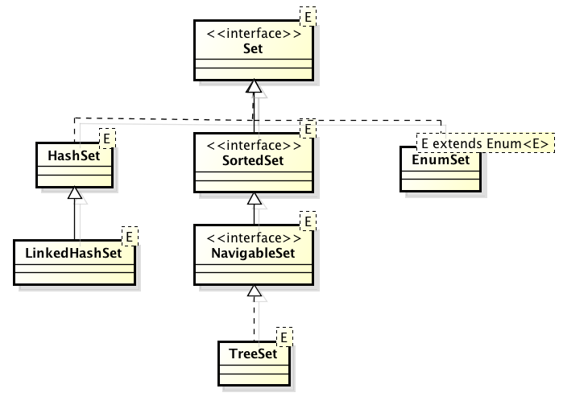

# 3.4 Σύνολα (Sets) {#Java} 
© Γιάννης Κωστάρας

---

[<-](../3.3-Generics/README.md) | [Δ](../../README.md) |  [->](../3.5-Queues/README.md) 
 
---

Τα σύνολα (sets) αποθηκεύουν μόνο μοναδικά στοιχεία, δηλ. δεν επιτρέπουν διπλότυπα.



**Εικόνα 1** _Σύνολα στη Java_

Το _Συσχετισμένο Σύνολο (HashSet)_ είναι η πιο συνηθισμένη υλοποίηση ενός συνόλου. Όπως συνάγεται και από το όνομά του, υλοποιείται ως ένα πίνακας κατακερματισμού (HashMap).

```java
jshell> Set<Integer> set = new HashSet<>();
set ==> []

jshell> set.add(10);
$1 ==> true

jshell> set.add(20);
$2 ==> true

jshell> set.add(20);
$3 ==> false

jshell> set
set ==> [20, 10]
```

Στο πιο πάνω παράδειγμα, βλέπουμε ότι η εισαγωγή της τιμής ```20``` δυο φορές αποτυγχάνει. Παρατηρήστε επίσης ότι τα σύνολα δεν αποθηκεύουν τα στοιχεία τους με κάποια συγκεκριμένη σειρά, όπως οι λίστες, όπου η σειρά των στοιχείων είναι ίδια με τη σειρά εισαγωγής των στοιχείων στη λίστα.

Θα μπορούσαμε ν' αρχικοποιήσουμε το σύνολο και ως εξής:

```java
jshell> Set set = Set.of(10, 20, 30);
set = [10, 20, 30]
```

Προσοχή όμως. Σ' αυτήν την περίπτωση επιστρέφεται ένα σύνολο το οποίο _δεν_ μπορεί να μεταβληθεί.

```java
jshell> set.add(40)
|  Warning:
|  unchecked call to add(E) as a member of the raw type java.util.List
|  array.add(40)
|  ^-----------^
|  java.lang.UnsupportedOperationException thrown
|        at ImmutableCollections.uoe (ImmutableCollections.java:71)
|        at ImmutableCollections$AbstractImmutableSet.add (ImmutableCollections.java:281)
|        at (#62:1)

```
Για να μπορέσουμε να δημιουργήσουμε μια μεταβαλλόμενη λίστα σ' αυτή την περίπτωση, πρέπει να χρησιμοποιήσουμε την μέθοδο κατασκευής της ```HashSet``` που δέχεται μια άλλη συλλογή:

```java
jshell> Set<Integer> set = new HashSet<>(Set.of(10, 20, 30));
set ==> [20, 10, 30]

jshell> set.add(40)
$5 ==> true

jshell> set
array ==> [10, 20, 30, 40]
```

Στη συνέχεια θα δούμε τις διάφορες μεθόδους της κλάσης.

### Προσπέλαση στοιχείων
Παρακάτω βλέπουμε τρόπους προσπέλασης των στοιχείων ενός συνόλου. Καθώς τα στοιχεία ενός συνόλου δεν αποθηκεύονται με τη σειρά, δε μπορούμε να προσπελάσουμε κάποιο στοιχείο του συνόλου χρησιμοποιώντας δείκτες, καθώς δεν υπάρχουν δείκτες.

Για να προσπελάσουμε όλα τα στοιχεία ενός συνόλου, χρησιμοποιούμε τον επαναλήπτη (iterator):

```java
jshell> int sum = 0
sum ==> 0

jshell> Iterator<Integer> iter = set.iterator();
iter ==> java.util.HashMap$KeyIterator@1a1d6a08

jshell> while (iter.hasNext()) 
	...>    sum += iter.next();
```

Η διεπαφή ```Collection```, την οποία επεκτείνει η ```Set```, επεκτείνει με τη σειρά της τη διεπαφή ```Iterable```:
```java
interface Iterable {
	public Iterator iterator();
}

interface Iterator {
	public boolean hasNext();
	public Object next();
	public void remove();
}
```

Άλλος τρόπος είναι με τον αναβαθμισμένο βρόγχο ```for``` που εισήχθηκε στην έκδοση 5:

```java
jshell> sum = 0
sum ==> 0

jshell> for (int n : set) 
	...>    sum += n;
```

Όπως είδαμε παραπάνω, η δομή δεδομένων _Σύνολο_ δεν είναι ταξινομημένη και δεν μπορεί να ταξινομηθεί. Υπάρχει όμως η ```TreeSet``` (η οποία κληρονομεί από την ```SortedSet```) και  ταξινομεί τα στοιχεία της:

```java
jshell> TreeSet<Integer> sortedSet = new TreeSet<>(set);
sortedSet ==> [10, 20, 30, 40]

jshell> sortedSet.first();
$1 ==> 10

jshell> sortedSet.last();
$2 ==> 40

jshell> sortedSet.subSet(20,40);	// 20 &lt;= στοιχεία &lt; 40 
$3 ==> [20, 30]

jshell> sortedSet.subSet(20, true, 40, true);  // inclusive = true
$4 ==> [20, 30, 40]

jshell> sortedSet.headSet(20);	   	// στοιχεία &lt; 20
$5 ==> [10]

jshell> sortedSet.headSet(20, true);	// inclusive = true
$6 ==> [10, 20]

jshell> sortedSet.tailSet(20);			// στοιχεία &gt;= 20
$7 ==> [20, 30, 40]

jshell> sortedSet.tailSet(20, false);	// inclusive = false
$8 ==> [30, 40]

jshell> sortedSet.tailSet(25);		// στοιχεία &gt;= 25
$9 ==> [30, 40]

jshell> sortedSet.tailSet(25, true);	// inclusive = true
$10 ==> [30, 40]

jshell> sortedSet.ceiling(25);		// το μικρότερο στοιχείο &gt;= 25
$11 ==> 30

jshell> sortedSet.floor(25);		// το μεγαλύτερο στοιχείο &lt;= 25
$12 ==> 20

jshell> sortedSet.higher(20);		// το μικρότερο στοιχείο &gt; 20
$13 ==> 30

jshell> sortedSet.lower(20);		// το μεγαλύτερο στοιχείο &lt; 20
$14 ==> 10

jshell> sortedSet.descendingSet()
$15 ==> [40, 30, 20, 10]

jshell> Iterator<Integer> i = sortedSet.descendingIterator()
i ==> java.util.TreeMap$NavigableSubMap$DescendingSubMapKeyIterator@544fe44c

jshell> while (i.hasNext()) 
   ...> System.out.print(i.next() + " ");
40 30 20 10 
```

### Εισαγωγή στοιχείων
Όπως είδαμε, η εισαγωγή δεδομένων σ' ένα σύνολο γίνεται με την μέθοδο ```add()```. Η μέθοδος επιστρέφει ```true``` αν η εισαγωγή του στοιχείου ήταν επιτυχής, αλλοιώς επιστρέφει ```false```. 

Η μέθοδος ```addAll(Collection<?> c)``` μας επιτρέπει να προσθέσουμε μια συλλογή από στοιχεία στο σύνολό μας.

### Διαγραφή στοιχείων
Η μέθοδος ```remove(Object o)``` διαγράφει το στοιχείο του συνόλου που είναι ίσο με το το ```ο``` αν βρέθηκε και επιστρέφει ```true``` σ' αυτήν την περίπτωση.

Επίσης, πολύ μεγάλη προσοχή χρειάζεται αν διαγράφετε στοιχεία από ένα σύνολο ενώ προσπελάζετε τα στοιχεία του:

```java
jshell> set
set ==> [20, 40, 10, 30]

jshell> for (Iterator<Integer> i = set.iterator(); i.hasNext(); ) {
   ...> int n = i.next(); 
   ...> if (n == 10) i.remove();
   ...> }

jshell> set
set ==> [20, 30, 40]

jshell> for (int n : set) {
   ...> if (n == 30) set.remove(n) ;
   ...> }
}

jshell> set
set ==> [20, 40]
```

Τέλος, η διεπαφή ```Collection``` παρέχει και τις ακόλουθες δυο μεθόδους οι οποίες μπορούν να διαγράψουν με τη μία από το σύνολό μας όλα τα στοιχεία της παρεχόμενης συλλογής ```c``` (```removeAll(Collection<?> c)```) και επιστρέφει ```true``` αν τα κατάφερε (αν δεν κατάφερε να διαγράψει έστω και ένα από τα στοιχεία της ```c``` από το σύνολό μας, τότε επιστρέφει ```false```).

Η ```retainAll(Collection<?> c)``` κρατάει από το σύνολό μας μόνο τα στοιχεία που περιέχονται στη ```c``` και διαγράφει όλα τα υπόλοιπα. 

Η ```NavigableSet``` διαθέτει δυο ακόμα μεθόδους που διαγράφουν το πρώτο και το τελευταίο στοιχείο του ταξινομημένου συνόλου: ```pollFirst()``` και ```pollLast()```.

### Αναζήτηση στοιχείων
Δυστυχώς η κλάση ```Collections``` δε διαθέτει κάποια μέθοδο για να αναζητήσει κάποιο στοιχείο σε ένα σύνολο (οι μέθοδοι ```binarySearch()``` δέχονται ως όρισμα λίστα).

```java
jshell> set 
set ==> [30, 10, 20]

jshell> set.contains(20); 
$9 ==> true
```

### Ταξινόμηση 
Όπως είπαμε, η δομή δεδομένων Σύνολο δεν είναι ταξινομημένη και δεν μπορεί να ταξινομηθεί. Υπάρχει όμως η ```TreeSet``` (η οποία κληρονομεί από την ```SortedSet```) και  ταξινομεί τα στοιχεία της:

```java
jshell> TreeSet<Integer> sortedSet = new TreeSet<>(set);
sortedSet ==> [10, 20, 30, 40]	
```

### Αντιγραφή 
Ήδη είδαμε τον copy constructor ```HashSet(Collection<?> c)``` που δημιουργεί ένα νέο ```HashSet``` από τη συλλογή που του περνάμε ως όρισμα.

### Συγχώνευση 
Σαν άσκηση, γράψτε μια μέθοδο ```union()``` στο jshell που θα ενώνει τα στοιχεία δυο συνόλων που περνάτε ως ορίσματα στη μέθοδο.

### Διαχωρισμός 
Σαν άσκηση, γράψτε μια μέθοδο ```split()``` στο jshell που θα διαχωρίζει ένα σύνολο με ακέραια στοιχεία σε δυο νέα σύνολα που το ένα θα αποθηκεύει τα ζυγά και η άλλη τα μονά στοιχεία του αρχικού συνόλου.

### Ισότητα
```java
jshell> src
src ==> [1, 2, 3, 4, 5]

jshell> dest
dest ==> [1, 2, 3, 4, 5]

jshell> dest.equals(src); 
$1 ==> true
```

## Συνδεδεμένα Συσχετισμένα Σύνολα (```LinkedHashSet```)
Το Συνδεδομένο Συσχετισμένο Σύνολο (```LinkedHashSet```) κληρονομεί από την κλάση ```HashSet``` αλλά επιπλέον διατηρεί και μια συνδεδεμένη λίστα (```LinkedList```) με τα στοιχεία του που βελτιώνει την απόδοσή του σε σχέση με το HashSet αν θέλετε να προσπελάσετε όλα τα στοιχεία του. Με αυτόν τον τρόπο οι επαναλήπτες της (iterators) επιστρέφουν τα στοιχεία της με τη σειρά που εισήχθηκαν (θυμηθείτε ότι στην κλάση ```HashSet``` δεν υπάρχει κάποια σειρά στα στοιχεία).

```java
jshell> Set<Character> characterSet = new LinkedHashSet<>();
characterSet ==> []
jshell> Collections.addAll(characterSet, 'z', 'y', 'x');
$2 ==> true
jshell> characterSet.toString().equals("[z, y, x]");
$3 ==> true
```
Οι πράξεις στα συνδεδεμένα συσχετισμένα σύνολα είναι ίδιες με αυτές των συσχετισμένων συνόλων (```HashSet```s).

## ```EnumSet```
Χρησιμοποιείται όταν ο αριθμός των στοιχείων είναι γνωστός εξ' αρχής και δεν αλλάζει και μπορούμε να αναθέσουμε ένα ευρετήριο (index) σ' αυτά. Ως αποτέλεσμα, είναι πολύ πιο αποδοτικό από τις υπόλοιπες υλοποιήσεις. 

```java
jshell> enum Faces {JACK, QUEEN, KING};
|  created enum Faces
jshell> Set<Faces> faceCards = EnumSet.of(Faces.JACK, Faces.QUEEN, Faces.KING);
faceCards ==> [JACK, QUEEN, KING]
jshell> Set<Faces> faceCards = EnumSet.allOf(Faces.class);
faceCards ==> [JACK, QUEEN, KING]
```
Επιστρέφει τα στοιχεία του με τη σειρά που ορίζονται στο ```enum```.

## Σύγκριση των διαφόρων υλοποιήσεων της ```Set```

| | ```add``` |  ```contains``` | ```next``` | 
| ```HashSet```  | O(1) | O(n) | O(k*/n) |  
| ```LinkedHashSet``` | O(1) | O(1) | O(1) | 
| ```EnumSet``` | O(1) | O(n) | O(1)** | 
| ```TreeSet``` | O(logn) | O(logn) | O(logn) | 

*k είναι η χωρητικότητα του συνόλου
** για ```EnumSet```s μέχρι 64 στοιχείων, μετά γίνεται O(logn)

_Πηγή: [Naftalin, Wadler (2006)]_

Αν η εφαρμογή σας διαβάζει συχνότερα στοιχεία τότε καλύτερη απόδοση έχει η ```LinkedHashSet```.

## Πηγές:
1. ["The Java Tutorial"](https://docs.oracle.com/javase/tutorial/)
1. Bloch J. (2018), _Effective Java_, 3rd Edition, Addison-Wesley.
1. Deitel P., Deitel H. (2018), _Java How to Program_, 11th Ed., Safari.
1. Downey A. B., Mayfield C. (2016), _Think Java_, O' Reilly. 
1. Eckel B. (2006), _Thinking in Java_, 4th Ed., Prentice-Hall.
1. Hillar G.C. (2017), _Java 9 with JShell_, Packt.
1. Horstmann C. S. (2016), _Core Java, Volume 1 Fundamentals_, 10th Ed., Prentice-Hall.
1. Horstmann C. S. (2018), _Core Java SE 9 for the impatient_, 2nd Ed., Addison-Wesley. 
1. Naftalin M., Wadler P. (2006), _Java Generics and Collections_, O'Reilly. 
1. Sharan K. (2017), _Java 9 Revealed: For Early Adoption and Migration_, Apress.
1. Sierra K. & Bates B. (2005), _Head First Java_, 2nd Ed. for Java 5.0, O’Reilly.

---

[<-](../3.3-Generics/README.md) | [Δ](../../README.md) |  [->](../3.5-Queues/README.md) 

---