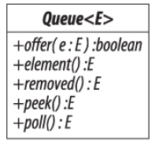
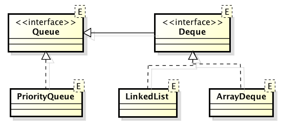
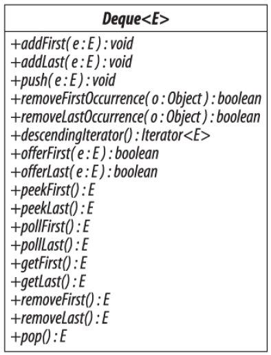
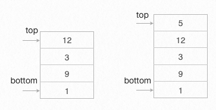

# 3.5 Ουρές (Queues) {#Java} 
© Γιάννης Κωστάρας

---

[<-](../3.4-Sets/README.md) | [Δ](../../README.md) |  [->](../3.6-Maps/README.md) 
 
---
Η έννοια της _ουράς_ συναντάται πολύ συχνά στην καθημερινή ζωή. Ουρές δημιουργούνται όταν άνθρωποι, εργασίες, προγράμματα κλπ. περιμένουν για να εξυπηρετηθούν. Το θέμα είναι τόσο σημαντικό και με τέτοιες πρακτικές επιπτώσεις ώστε ένας ιδιαίτερος κλάδος της Επιχειρησιακής Έρευνας, η _Θεωρία Ουρών (Queueing Theory)_, μελετά τη συμπεριφορά και την επίδοση των ουρών. Σε μια ουρά αναμονής με ανθρώπους, εξυπηρετείται συνήθως εκείνος που στέκεται πρώτος στην ουρά. Αυτή η μέθοδος επεξεργασίας ονομάζεται _Πρώτο μέσα, πρώτο έξω_, ή απλούστερα _FIFO (First In, First Out)_.
 
Οι εισαγωγές σε μια ουρά επιτρέπονται μόνο από το ένα άκρο ενώ οι εξαγωγές μόνο από το άλλο άκρο. Επομένως, απαιτούνται δυο δείκτες: _εμπρός (front)_ και _πίσω (rear)_.

Η Java παρέχει την ακόλουθη διεπαφή η οποία διαθέτει τις παρακάτω μεθόδους αλλά και άλλες που δεν εμφανίζονται:



**Εικόνα 1** _Η διεπαφή Ουρά της Java_

```java
public interface Queue<E> { 
   /** Insert */
   boolean offer(E e);
   /** Remove */
   E poll();
   /** Examine */
   E peek();
}
```

Η μέθοδος ```offer(E e)``` εισάγει ένα νέο στοιχείο στο τέλος της ουράς. Η μέθοδος ```E poll()``` εξάγει το στοιχείο από την αρχή της ουράς. Η μέθοδος ```E peek()``` επιστρέφει το στοιχείο από την αρχή της ουράς χωρίς να το αφαιρεί από την ουρά.



**Εικόνα 2** _Ουρές στη Java_

Η ```Deque``` είναι μια διπλή ουρά, μπορούμε δηλ. να εισάγουμε/εξάγουμε στοιχεία από οποιοδήποτε άκρο της. Επίσης, διατηρεί τη σειρά με την οποία εισάγονται τα στοιχεία σ' αυτήν. Αν εξάγουμε τα στοιχεία από το ίδιο άκρο από το οποίο τα εισάγαμε, τότε η ```Deque``` λειτουργεί ως _Στοίβα_ (```Stack```) δηλ. _Τελευταίο μέσα, πρώτο έξω_, ή απλούστερα _LIFO (Last In, First Out)_. Η ```ArrayDeque``` υλοποιείται ως ένας κυκλικός πίνακας, ενώ η ```LinkdedList``` ως συνδεδεμένη λίστα. Η τελευταία είναι η μόνη που μπορεί ν' αποθηκεύσει ```null``` στοιχεία.



**Εικόνα 3** _Η διεπαφή Διπλής Ουράς της Java_

Όπως βλέπουμε στην εικόνα 3, η ```Deque``` επεκτείνει τη διεπαφή ```Queue``` με μεθόδους συμμετρικές ως προς την αρχή ή το τέλος της ουράς.

Η ουρά μπορεί να υλοποιηθεί είτε με τη βοήθεια ενός πίνακα είτε με τη βοήθεια μιας συνδεδεμένης λίστας. 

```java
jshell> Queue<Integer> q = new ArrayDeque<>();
q ==> []

jshell> Queue<Integer> q = new LinkedList<>();
q ==> []
```
με την πρώτη υλοποίηση να είναι πιο αποδοτική από τη δεύτερη.

```java
public class Q<E> {
 private final Deque<E> queue;
 private final int size;
 
 public Q(int numElements) {
  this.size = numElements;
  queue = new ArrayDeque<E>(this.size);
 }
 
 // προσθήκη στο τέλος της ουράς
 public boolean push(E e) {  
  return !isFull() && queue.offer(e);
 }
 
 // αφαίρεση από την αρχή της ουράς
 public E pop() {			
   return queue.poll();
 }
 
 // προσπέλαση της αρχής της ουράς
 public E peek() {			
   return queue.peek();
 }
 
 public boolean isEmpty() {
  return queue.isEmpty();
 }
 
 public boolean isFull() {
	return queue.size() == size;
 }
}
```

Μια ουρά που υλοποιείται με πίνακα κινδυνεύει να γεμίσει ενώ υπάρχει ακόμα χώρος στην αρχή της, δηλ. πριν από το δείκτη εμπρός. Μια πιο αποτελεσματική υλοποίηση είναι η _κυκλική ουρά (circular queue)_ ή _δακτύλιος (ring)_.

### Εισαγωγή στοιχείων
Χρησιμοποιήστε τη μέθοδο ```boolean offer(E e)``` για να εισάγετε ένα στοιχείο στο τέλος της ουράς. Η μέθοδος επιστρέφει ```true``` αν η εισαγωγή του στοιχείου ήταν επιτυχής, αλλοιώς επιστρέφει ```false```. Αποφύγετε τη χρήση της ```boolean add(E e)``` από την ```Collection``` η οποία εμφανίζει ```IllegalStateException``` αν η ουρά είναι γεμάτη.

```java
jshell> q.offer(10);
$1 ==> true

jshell> q.offer(20);
$2 ==> true

jshell> q.offer(30);
$3 ==> true

jshell> q
q ==> [10, 20, 30]
```

Αν χρησιμοποιείτε διπλή ουρά, τότε χρησιμοποιήστε τις μεθόδους ```boolean offerFirst(E e)```, ```boolean offerLast(E e)``` για να εισάγετε ένα στοιχείο στην αρχή ή στο τέλος της ουράς αντίστοιχα. Οι μέθοδοι επιστρέφουν ```true``` αν η εισαγωγή του στοιχείου ήταν επιτυχής, αλλοιώς επιστρέφουν ```false```. Αποφύγετε τη χρήση των ```boolean addFirst(E e), boolean addLast(E e)``` από την ```Collection``` οι οποίες εμφανίζουν ```IllegalStateException``` αν η ουρά είναι γεμάτη.

```java
jshell> Deque<Integer> deque = new ArrayDeque<>();
deque ==> []

jshell> deque.offerLast(10);
$4 ==> true

jshell> deque.offerLast(20);
$5 ==> true

jshell> deque.offerLast(30);
$6 ==> true

jshell> deque
deque ==> [10, 20, 30]
```

Η μέθοδος ```void push(E e)``` είναι συνώνυμη της ```void addFirst(E e)``` και χρησιμοποιείται όταν χρησιμοποιούμε την ```Deque``` ως στοίβα (όπως και η ```boolean offerLast(E e)``` είναι συνώνυμη της ```boolean offer(E e)```).
 
### Προσπέλαση στοιχείων
Φυσικά υπάρχει η μέθοδος ```iterator()``` ενώ η ```Deque``` διαθέτει και την ```descendingIterator()``` όπου μπορούμε να προσπελάσουμε τη διπλή ουρά αντίστροφα.

Η διεπαφή ```Queue``` διαθέτει δυο μεθόδους που επιστρέφουν το πρώτο στοιχείο της χωρίς να το σβήνουν από την ουρά: ```E element()``` και ```E peek()```. Η διαφορά τους είναι ότι η πρώτη εμφανίζει μια εξαίρεση (exception) αν η ουρά είναι άδεια, ενώ η δεύτερη απλά επιστρέφει ```null```.

```java
jshell> q.element()
$7 ==> 10

jshell> q.peek()
$8 ==> 10

jshell> Queue<Integer> qq = new LinkedList<>();
qq ==> []

jshell> qq.element()
|  java.util.NoSuchElementException thrown
|        at LinkedList.getFirst (LinkedList.java:248)
|        at LinkedList.element (LinkedList.java:667)
|        at (#10:1)

jshell> qq.peek()
$9 ==> null
```

Αντίστοιχα αν δουλεύετε με την ```Deque```:

```java
jshell> deque
deque ==> [10, 20, 30]

jshell> deque.peekFirst()			// επιστρέφει null αν η ουρά είναι άδεια
$10 ==> 10

jshell> deque.peekLast()			// επιστρέφει null αν η ουρά είναι άδεια
$11 ==> 30

jshell> deque.getFirst()			// εμφανίζει NoSuchElementException αν η ουρά είναι άδεια
$12 ==> 10

jshell> deque.getLast()				// εμφανίζει NoSuchElementException αν η ουρά είναι άδεια
$13 ==> 30
```

### Διαγραφή στοιχείων
Οι μέθοδοι ```E remove()``` και ```E poll()``` εξάγουν το πρώτο στοιχείο της ουράς. Η διαφορά τους είναι ότι η πρώτη εμφανίζει μια εξαίρεση (```NoSuchElementException```) αν η ουρά είναι άδεια, ενώ η δεύτερη απλά επιστρέφει ```null```.

```java
jshell> q.remove();
$14 ==> 10

jshell> q
q ==> [20, 30]

jshell> q.poll();
$15 ==> 20

jshell> q
q ==> [30]

jshell> q.poll();
$16 ==> 30

jshell> q
q ==> []

jshell> q.poll();
$17 ==> null

jshell> q.remove();
|  java.util.NoSuchElementException thrown
|        at LinkedList.removeFirst (LinkedList.java:274)
|        at LinkedList.remove (LinkedList.java:689)
|        at (#22:1)
```

Αντίστοιχες μεθόδους έχει και η ```Deque```:

```java
jshell> deque
deque ==> [10, 20, 30]

jshell> deque.pollFirst()
$18 ==> 10

jshell> deque.pollLast()
$19 ==> 30

jshell> deque
deque ==> [20]

jshell> deque.removeFirst()
$20 ==> 20

jshell> deque.removeLast()
|  java.util.NoSuchElementException thrown
|        at ArrayDeque.removeLast (ArrayDeque.java:369)
|        at (#21:1)

```
Τέλος, η ```pop()``` είναι συνώνυμη της ```removeFirst()``` (όπως και οι ```getFirst()``` και ```removeFirst()``` είναι συνώνυμες των ```element()``` και ```remove()``` της ```Queue```).

### Αναζήτηση στοιχείων
Η δομή δεδομένων Ουρά δε συνίσταται για αναζήτηση στοιχείων.

### Ταξινόμηση 
Αν η σειρά με την οποία θέλουμε να προσπελάσουμε τα στοιχεία είναι σημαντική, τότε μπορούμε να χρησιμοποιήσουμε μια ουρά προτεραιότητας ή ```PriorityQueue```. Η σειρά (ταξινόμηση) των στοιχείων βασίζεται είτε στη φυσική σειρά των στοιχείων (αν υλοποιούν τη διεπαφή ```Comparable```), είτε τη σειρά που ορίζει ένας ```Comparator``` που παρέχεται στη μέθοδο κατασκευής της ```PriorityQueue```.

```java
PriorityQueue() 				// φυσική ταξινόμηση, αρχική χωρητικότητα (11)
PriorityQueue(Collection<? extends E> c) 				// φυσική ταξινόμηση, εκτός κι αν c είναι τύπου PriorityQueue ή 
				// SortedSet οπότε κληρονομεί τη σειρά ταξινόμησης της
PriorityQueue(int initialCapacity)				// φυσική ταξινόμηση
PriorityQueue(int initialCapacity, Comparator<? super E> comparator)	// η ταξινόμηση ορίζεται από τον Comparator
PriorityQueue(PriorityQueue<? extends E> c)					// ταξινόμηση αυτή της c
PriorityQueue(SortedSet<? extends E> c)  					// ταξινόμηση αυτή της c
```

Έστω π.χ. ότι έχουμε μια κλάση ```Task```:

```java
class Task {
	private String description;
	private LocalDate dueDate;
	private Priority priority;
	// getters/setters
	// hashCode/equals
	// toString()
	...
}

enum Priority {HIGH, MEDIUM, LOW};
```
Αν θέλουμε να επεξεργαστούμε αυτά τα έργα με βάση την προτεραιότητά τους:

```java
Comparator<Task> priorityComparator = new Comparator<Task>() {
	public int compare(Task t1, Task t2) {
		return t1.getPriority().compareTo(t2.getPriority());
	}
};

Queue<Task> priorityQueue = new PriorityQueue<>(20, priorityComparator);
priorityQueue.add(new Task("Doctor appointment", LocalDate.parse("2019-11-18"), Priority.MEDIUM));
priorityQueue.add(new Task("Birthday party", LocalDate.parse("2019-09-02"), Priority.HIGH));
priorityQueue.add(new Task("Book hotel", LocalDate.parse("2019-07-15"), Priority.MEDIUM));
...
Task nextTask = priorityQueue.poll();   // θα επιστρέψει το Task με Priority.HIGH
```


### Αντιγραφή 
Οι διάφοροι τύποι ουρών διαθέτουν copy constructors:

```java
PriorityQueue(Collection<? extends E> c);
PriorityQueue(PriorityQueue<? extends E> c);
PriorityQueue(SortedSet<? extends E> c);

ArrayDeque(Collection<? extends E> c);

LinkedList(Collection<? extends E> c);
```

### Συγχώνευση 
Σαν άσκηση, γράψτε μια μέθοδο ```union()``` στο jshell που θα ενώνει τα στοιχεία δυο ουρών προτεραιότητας που περνάτε ως ορίσματα στη μέθοδο.

### Διαχωρισμός 
Σαν άσκηση, γράψτε μια μέθοδο ```split()``` στο jshell που θα διαχωρίζει ένα μια ουρά με ακέραια στοιχεία σε δυο νέες ουρές που το ένα θα αποθηκεύει τα ζυγά και η άλλη τα μονά στοιχεία της αρχικής ουράς.

### Ισότητα
```java
jshell> Queue<Integer> q1 = new ArrayDeque<>();
q1 ==> []

jshell>  Queue<Integer> q2 = new LinkedList<>();
q2 ==> []

jshell> q1
q1 ==> [10, 20, 30]

jshell> q2
q2 ==> [10, 20, 30]

jshell> q1.equals(q2); 
$1 ==> false
```

## Σύγκριση των διαφόρων υλοποιήσεων της ```Queue```

| | ```offer``` |  ```peek``` | ```poll``` | ```size``` |  
| ```PriorityQueue```  | O(logn) | O(1) | O(logn) | O(1)  
| ```LinkedList``` | O(1) | O(1) | O(1) | O(1)
| ```ArrayDeque``` | O(1) | O(1) | O(1) | O(1) 

_Πηγή: [Naftalin, Wadler (2006)]_

Όπως είπαμε, καλύτερη απόδοση έχει η ```ArrayDeque```.

## Ασκήσεις
1. Στο μάθημα 3.2 είδαμε ότι υπάρχει η κληρονομημένη κλάση ```Stack```. Υλοποιήστε τη δική σας πιο αποδοτική κλάση ```Stack``` χρησιμοποιώντας μια υλοποίηση της ```Deque```.



**Εικόνα 4** _Παράδειγμα στοίβας_

## Πηγές:
1. ["The Java Tutorial"](https://docs.oracle.com/javase/tutorial/)
1. Bloch J. (2018), _Effective Java_, 3rd Edition, Addison-Wesley.
1. Deitel P., Deitel H. (2018), _Java How to Program_, 11th Ed., Safari.
1. Downey A. B., Mayfield C. (2016), _Think Java_, O' Reilly. 
1. Eckel B. (2006), _Thinking in Java_, 4th Ed., Prentice-Hall.
1. Hillar G.C. (2017), _Java 9 with JShell_, Packt.
1. Horstmann C. S. (2016), _Core Java, Volume 1 Fundamentals_, 10th Ed., Prentice-Hall.
1. Horstmann C. S. (2018), _Core Java SE 9 for the impatient_, 2nd Ed., Addison-Wesley. 
1. Naftalin M., Wadler P. (2006), _Java Generics and Collections_, O'Reilly. 
1. Sharan K. (2017), _Java 9 Revealed: For Early Adoption and Migration_, Apress.
1. Sierra K. & Bates B. (2005), _Head First Java_, 2nd Ed. for Java 5.0, O’Reilly.

---

[<-](../3.4-Sets/README.md) | [Δ](../../README.md) |  [->](../3.6-Maps/README.md) 

---