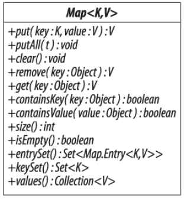
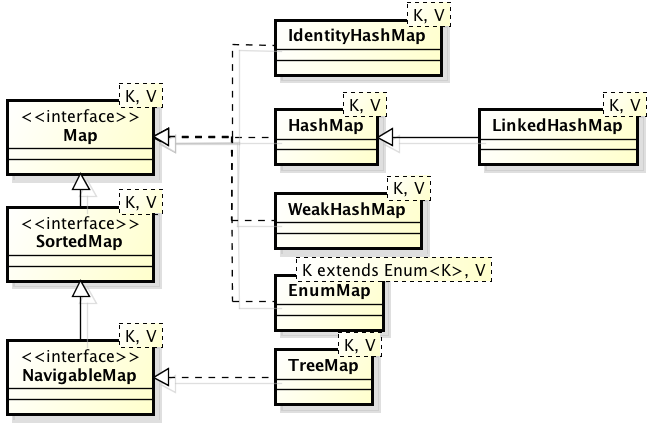
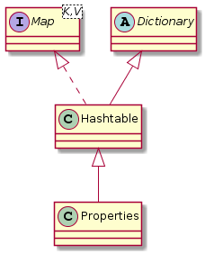

# 3.6 Πίνακες Κατακερματισμού (Maps) {#Java} 
© Γιάννης Κωστάρας

---

[<-](../3.5-Queues/README.md) | [Δ](../../README.md) | [->](../3.7-OtherCollections/README.md)
 
---
Ο πίνακας κατακερματισμού (```Map```) είναι η μόνη δομή δεδομένων που δεν κληρονομεί από την ```Collection```. Ονομάζεται και πίνακας συσχέτισης καθώς συσχετίζει κλειδιά με τιμές. Τα κλειδιά είναι μοναδικά, δηλ. δεν μπορούμε να έχουμε το ίδιο κλειδί δυο φορές.




**Εικόνα 3.6.1** _Η διεπαφή Map της Java_



**Εικόνα 3.6.2** _Πίνακες κατακερματισμού στη Java_

```java
jshell> Map<String, Integer> map = new HashMap<>();
map ==> {}
```
Μέθοδοι κατασκευής:

* ```HashMap() 	// δημιουργεί έναν άδειο πίνακα κατακερματισμού```
* ```HashMap(Map<? extends K,? extends V> map)	// δημιουργεί ένα νέο πίνακα κατακερματισμού από τον map```
* ```HashMap(int initialCapacity)	// δημιουργεί έναν άδειο πίνακα κατακερματισμού με αρχικό μέγεθος initialCapacity```
* ```HashMap(int initialCapacity, float loadFactor)	// δημιουργεί έναν άδειο πίνακα κατακερματισμού με αρχικό μέγεθος initialCapacity και το ποσοστό loadFactor μετά το οποίο θα ανακατανεμηθεί (rehash) ο πίνακας κατακερματισμού```

### Εισαγωγή στοιχείων
Η κλάση ```Map``` διαθέτει τις εξής μεθόδους για εισαγωγή στοιχείων στον πίνακα κατακερματισμού: 

* ```V put (K key, V value)     // προσθέτει ή αντικαθιστά την τιμή του κλειδιού key με τη νέα τιμή value και επιστρέφει την παλιά τιμή, ή null αν το κλειδί δεν υπήρχε```
* ```V putIfAbsent(K key, V value)		// συσχετίζει το κλειδί key με τη τιμή value μόνο αν το κλειδί δε συσχετίζεται με κάποια τιμή, ή η τιμή του είναι null, διαφορετικά επιστρέφει την τιμή του κλειδιού```
* ```void putAll(Map<? extends K, ? extends V> map)		// προσθέτει τα στοιχεία του πίνακα κατακερματισμού map σ' αυτόν τον πίνακα κατακερματισμού```
* ```Map<K,V> of(K k1, V v1, ..., K k10, V v10)		// δημιουργεί έναν αμετάβλητο πίνακα κατακερματισμού από τις συσχετίσεις που περνάμε ως παραμέτρους```

```java
jshell> map.put("Ζηνοβία", 11);
$1 ==> null

jshell> map.put("Κατερίνα", 9);
$2 ==> null

jshell> map.put("Αδριάνα", 11);
$3 ==> null

jshell> map.put("Ζηνοβία", 12);
$4 ==> 11

jshell> Map<String, Integer> roMap = Map.of("Ζηνοβία", 11, "Κατερίνα", 9, "Αδριάνα", 11, "Ζηνοβία", 12);
|  Exception java.lang.IllegalArgumentException: duplicate key: Ζηνοβία
|        at ImmutableCollections$MapN.<init> (ImmutableCollections.java:800)
|        at Map.of (Map.java:1373)
|        at (#4:1)

jshell> Map<String, Integer> roMap = Map.of("Ζηνοβία", 12, "Κατερίνα", 9, "Αδριάνα", 11);
roMap ==> {Αδριάνα=11, Κατερίνα=9, Ζηνοβία=12}
```

Η ```of()``` δεν επιτρέπει ```null``` στοιχεία. Θα μπορούσατε να χρησιμοποιήσετε και τη μέθοδο ```Map.ofEntries()``` η οποία χρησιμοποιεί την εμφωλιασμένη κλάση ```Map.Entry``` όπως θα δούμε παρακάτω:
```java
jshell> import static java.util.Map.entry;
 
jshell> Map<String, Integer> roMap = Map.ofEntries(
   ...> entry("Ζηνοβία", 12), 
   ...> entry("Κατερίνα", 9), 
   ...> entry("Αδριάνα", 11));
roMap ==> {Αδριάνα=11, Κατερίνα=9, Ζηνοβία=12}
```

### Αντικατάσταση στοιχείων
* ```V replace (K key, V value)     // αντικαθιστά την τιμή του κλειδιού key με τη νέα τιμή value και επιστρέφει την παλιά τιμή, ή null αν το κλειδί δεν υπήρχε```
* ```boolean replace (K key, V oldValue, V newValue)		// αντικαθιστά την τιμή του κλειδιού key με τη νέα τιμή newValue μόνο αν συσχετίζεται με την oldValue```

### Προσπέλαση στοιχείων

* ```V get(Object key)	// επιστρέφει την τιμή του κλειδιού key ή null αν το κλειδί δεν υπάρχει```
* ```V getOrDefault(Object key, V defaultValue)		// επιστρέφει την τιμή του κλειδιού key ή defaultValue αν το κλειδί δεν υπάρχει ή δε συσχετίζεται με κάποια τιμή```

```java
jshell> map.get("Αδριάνα");
$5 ==> 11
```

* ```Set<Map.Entry<K, V>> entrySet()	// επιστρέφει ένα σύνολο με τις συσχετίσεις κλειδιών/τιμών του πίνακα κατακερματισμού```
* ```Map.Entry<K, V> entry(K k, V v)	// επιστρέφει μια αμετάβλητη συσχέτιση Map.Entry του δοθέντος κλειδιού/τιμής```
* ```Set<K> keySet() 	// επιστρέφει ένα σύνολο με τα κλειδιά του πίνακα κατακερματισμού```
* ```Collection<V> values()		// επιστρέφει μια συλλογή με τις τιμές του πίνακα κατακερματισμού```

```java
jshell> for (String name : map.keySet()) 
   ...> System.out.println(name);
Κατερίνα
Ζηνοβία
Αδριάνα

jshell> for (Map.Entry<String, Integer> entry : map.entrySet()) 
   ...> System.out.println(entry.getKey() + " : " + entry.getValue())
Κατερίνα : 9
Ζηνοβία : 12
Αδριάνα : 11
```

Η κλάση ```Map.Entry<K, V>``` είναι μια συσχέτιση κλειδιού-τιμής του πίνακα κατακερματισμού, π.χ. ```<"Ζηνοβία", 12>```

```java
interface Map.Entry<K,V> {
	K getKey();
	V getValue();
	V setValue(V value);
}
```
Η κλάση ```HashMap``` δε διατηρεί τη σειρά των στοιχείων της. Αν θέλουμε να διατηρήσουμε τη σειρά εισαγωγής των στοιχείων, μπορούμε να χρησιμοποιήσουμε την ```LinkedHashMap```.

### Διαγραφή στοιχείων
Η κλάση ```Map``` διαθέτει τις εξής μεθόδους για διαγραφή στοιχείων από τον πίνακα κατακερματισμού: 

* ```V remove (Object key)     // διαγράφει το κλειδί key και επιστρέφει την τιμή του```
* ```V remove (Object key, Object value)     // διαγράφει το κλειδί key και επιστρέφει την τιμή του μόνο αν συσχετίζεται με την τιμή value```
* ```void clear()     // διαγράφει όλα τα στοιχεία του πίνακα κατακερματισμού```

```java
jshell> map.remove("Αδριάνα");
$6 ==> 11
```

Η ```NavigableMap``` διαθέτει δυο ακόμα μεθόδους που διαγράφουν το πρώτο και το τελευταίο κλειδί του ταξινομημένου πίνακα κατακερματισμού: ```pollFirstEntry()``` και ```pollLastEntry()```.

### Αναζήτηση στοιχείων

```java
jshell> map.containsKey("Αδριάνα");
$7 ==> false

jshell> map.containsValue(9);
$8 ==> true
```
Όπως και με την ```Set```, μπορούμε να εφαρμόσουμε γραμμική αναζήτηση είτε στα κλειδιά είτε στις τιμές του πίνακα κατακερματισμού (αφήνεται ως άσκηση στον αναγνώστη).

### Ταξινόμηση 
Όπως και η ```Set```, έτσι και η ```Map``` διαθέτει την ```TreeMap``` η οποία κληρονομεί από τις ```SortedMap``` και ```NavigableMap``` και η οποία ταξινομεί τα κλειδιά της:

```java
jshell> TreeMap<String, Integer> treeMap = new TreeMap<>(map);
treeMap ==> {Αδριάνα=11, Ζηνοβία=12, Κατερίνα=9}

jshell> treeMap.firstKey();		// NoSuchElementException αν ο πίνακας κατακερματισμού είναι άδειος
$1 ==> "Αδριάνα"

jshell> treeMap.firstEntry();		// NoSuchElementException αν ο πίνακας κατακερματισμού είναι άδειος
$2 ==> Αδριάνα=11

jshell> treeMap.lastKey();		// NoSuchElementException αν ο πίνακας κατακερματισμού είναι άδειος
$3 ==> "Κατερίνα"

jshell> treeMap.lastEntry()		// NoSuchElementException αν ο πίνακας κατακερματισμού είναι άδειος
$4 ==> Κατερίνα=9

jshell> treeMap.subMap("Ζ","Λ");	// "Ζ" <= στοιχεία < "Λ" 
$5 ==> {Ζηνοβία=12, Κατερίνα=9}

jshell> treeMap.subMap("Ζ", true, "Κω", true);  // inclusive = true
$6 ==> {Ζηνοβία=12, Κατερίνα=9}

jshell> treeMap.headMap("Ζηνοβία");		// στοιχεία < "Zηνοβία"
$7 ==> {Αδριάνα=11}	   	

jshell> treeMap.headMap("Ζηνοβία", true);		// inclusive = true
$8 ==> {Αδριάνα=11, Ζηνοβία=12}

jshell> treeMap.tailΜap("Ζηνοβία");			// στοιχεία >= "Ζ"
$9 ==> {Ζηνοβία=12, Κατερίνα=9}

jshell> treeMap.tailMap("Ζηνοβία", false);		// inclusive = false
$10 ==> {Κατερίνα=9}

jshell> treeMap.ceilingEntry("Ζ");		// το μικρότερο στοιχείο >= "Ζηνοβία"
$11 ==> Ζηνοβία=12

jshell> treeMap.floorEntry("Ζ");		// το μεγαλύτερο στοιχείο <= "Ζηνοβία"
$12 ==> Αδριάνα=11

jshell> treeMap.higherEntry("Ζηνοβία");		// το μικρότερο στοιχείο > "Ζηνοβία"
$13 ==> Κατερίνα=9

jshell> treeMap.lowerEntry("Ζηνοβία");		// το μεγαλύτερο στοιχείο < "Ζηνοβία"
$14 ==> Αδριάνα=11

jshell> treeMap.descendingMap()
$15 ==> {Κατερίνα=9, Ζηνοβία=12, Αδριάνα=11}

jshell> treeMap.navigableKeySet()
$16 ==> [Αδριάνα, Ζηνοβία, Κατερίνα]

jshell> Iterator<String> i = treeMap.descendingKeySet().iterator()
i ==> java.util.TreeMap$NavigableSubMap$DescendingSubMapKeyIterator@1b68ddbd

jshell> while (i.hasNext()) 
   ...> System.out.print(i.next() + " ");
Κατερίνα Ζηνοβία Αδριάνα
```

### Αντιγραφή 
Όπως έχουμε ήδη δει, οι διάφορες κλάσεις πινάκων κατακερματισμού διαθέτουν τους λεγόμενους copy constructors για αντιγραφή στοιχείων:

* ```HashMap(Map<? extends K,? extends V> map)	// δημιουργεί ένα νέο πίνακα κατακερματισμού από τον map```
* ```IdentityHashMap(Map<? extends K,? extends V> map)```
* ```EnumMap(EnumMap<K, ? extends V> map)```		
* ```EnumMap(Map<K, ? extends V> map)``` 
* ```TreeMap(SortedMap<K, ? extends V> map)```

Επίσης, η:

* ```void putAll(Map<? extends K, ? extends V> map)		// αντιγράφει τα στοιχεία του πίνακα κατακερματισμού map```

### Συγχώνευση 
Σαν άσκηση, γράψτε μια μέθοδο ```union()``` στο jshell που θα ενώνει τα στοιχεία δυο πινάκων κατακερματισμού που περνάτε ως ορίσματα στη μέθοδο.

### Διαχωρισμός
Σαν άσκηση, γράψτε μια μέθοδο ```split()``` στο jshell που θα διαχωρίζει ένα πίνακα κατακερματισμού με ακέραια κλειδιά σε δυο νέους πίνακες κατακερματισμού που το ένα θα αποθηκεύει τα ζυγά και η άλλη τα μονά κλειδιά του αρχικού πίνακα.

### Ισότητα
```java
jshell> map.equals(roMap)
$12 ==> true
```

## Συνδεδεμένοι Συσχετισμένοι Πίνακες (```LinkedHashMap```)
Όπως και η ```LinkedHashSet```, διατηρεί τη σειρά εισαγωγής των στοιχείων. Πηγαίνει όμως και πιο πέρα:

* ```LinkedHashMap(int initialCapacity, float loadFactor, boolean accessOrder)		// αν η accessOrder == true τότε τα στοιχεία επιστρέφονται ανάλογα με το πόσο πρόσφατα προσπελάστηκαν, διαφορετικά επιστρέφονται με τη σειρά εισαγωγής στον πίνακα κατακερματισμού``` 

## Συσχετισμένοι Πίνακες Ταυτοποίησης (```IdentityMap```)
Η μόνη τους διαφορά από τους πίνακες κατακερματισμού είναι ότι η σύγκριση των κλειδιών γίνεται με βάση τον τελεστή σύγκρισης ```==``` αντί για την ```equals()```.

```java
jshell> Map<Integer, String> idMap = new IdentityHashMap<>();  // Α.Μ., όνομα
idMap ==> {}

jshell> Integer i1 = new Integer(1);
i1 ==> 1

jshell> Integer i2 = new Integer(1);
i2 ==> 1

jshell> idMap.put(i1, "Γιάννης")
$4 ==> null

jshell> idMap.put(i2, "Νίκος")
$5 ==> null

jshell> idMap
idMap ==> {1=Γιάννης, 1=Νίκος}
```
Όπως βλέπουμε στο παραπάνω παράδειγμα, αν και ```i1.equals(i2)```, ```i1 != i2``` γιατί ο τελεστής ```==``` ελέγχει ισότητα ταυτοτήτων αντικειμένων, και τα δυο αντικείμενα ```i1``` και ```i2``` δεν είναι τα ίδια, παρόλο που έχουν τις ίδιες τιμές, με αποτέλεσμα να υπάρχουν φαινομενικά δυο ίδια κλειδιά. Σαν άσκηση, δοκιμάστε τον παραπάνω κώδικα χρησιμοποιώντας ```HashMap``` αντί για ```IdentityHashMap```. 

## Συσχετισμένοι Πίνακες Απαριθμημένων Τύπων (```EnumMap```)
Χρησιμοποιείται όταν ο αριθμός των κλειδιών είναι γνωστός εξ' αρχής και δεν αλλάζει και μπορούμε να αναθέσουμε ένα ευρετήριο (index) σ' αυτά. Ως αποτέλεσμα, είναι πολύ πιο αποδοτικοί από τις υπόλοιπες υλοποιήσεις. 

Π.χ. ας ξαναθυμηθούμε την κλάση ```Task``` του προηγούμενου μαθήματος και ας ορίσουμε έναν πίνακα κατακερματισμού που κρατάει λίστες με τα διάφορα έργα που έχουμε να κάνουμε βάσει προτεραιότητας:

```java
Map<Priority, ArrayDeque<Task>> taskMap = new EnumMap<>(Priority.class);
for (Priority p : Priority.values()) {
    taskMap.put(p, new ArrayDeque<>());
}

taskMap.get(Priority.HIGH).add(new Task("Birthday party", LocalDate.parse("2019-09-02"), Priority.HIGH));
taskMap.get(Priority.MEDIUM).add(new Task("Doctor appointment", LocalDate.parse("2019-11-18"), Priority.MEDIUM));
taskMap.get(Priority.HIGH).add(new Task("Book hotel", LocalDate.parse("2019-07-15"), Priority.MEDIUM));

Queue<Task> highPriorityTaskList = taskMap.get(Priority.HIGH);
System.out.println("Next high priority task: " + highPriorityTaskList.peek());
```

## Σύγκριση των διαφόρων υλοποιήσεων της ```Map```

| |  ```get``` |  ```containsKey``` | ```next``` 
| ```HashMap```  | O(1) | O(1) | O(k*/n) 
| ```LinkedHashMap``` | O(1) | O(1) | O(1)  
| ```IdentityHashMap``` | O(1) | O(1) | O(k*/n)   
| ```EnumMap``` | O(1) | O(1) | O(1) 
| ```TreeMap``` | O(logn) | O(logn) | O(logn)   

_Πηγή: [Naftalin, Wadler (2006)]_

*k είναι η χωρητικότητα του πίνακα

| Ιδιότητα | ```HashMap``` |  ```LinkedHashMap``` | ```TreeMap``` | 
| Δομή δεδομένων | 	```Hashtable``` | ```Hashtable```+```LinkedList``` | Ισοζυγισμένο (red-black) δέντρο  |  
| Σειρά εισαγωγής | Δε διατηρείται | Διατηρείται | Δε διατηρείται | 
| Διπλότυπα κλειδιά | Δεν επιτρέπονται | Δεν επιτρέπονται | Δεν επιτρέπονται | 
| Δυνατότητα ταξινόμησης | Όχι | Όχι | Ναι |
| Ετερογενή κλειδιά | Ναι | Ναι | Όχι |
| ```null``` κλειδιά | Ναι | Ναι | Όχι, μόνο ως πρώτη εισαγωγή, δηλ. ως ρίζα του δέντρου | 

## Η μέθοδος ```hashCode()```
Στο 1ο μάθημα της προηγούμενης εβδομάδας μάθαμε ότι κάθε κλάση που ενδέχεται να εισαχθεί σε μια συλλογή ή σ' έναν πίνακα κατακερματισμού θα πρέπει να υπερσκελίσει (override) τις μεθόδους ```equals()``` και ```hashCode()``` της κλάσης ```Object```. Γιατί άραγε; Ας δούμε το παρακάτω παράδειγμα:

```java
public class Id {		// Α.Μ.
    private int id;

    public Id(int id) {
        this.id = id;
    }

    public int getId() {
        return id;
    }

    @Override
    public boolean equals(Object o) {
        if (this == o) return true;
        if (o == null || getClass() != o.getClass()) return false;
        Id id1 = (Id) o;
        return id == id1.id;
    }

    @Override
    public int hashCode() {
        return id;
    }

    @Override
    public String toString() {
        return id + "";
    }
}
```
Προσέξτε πώς υλοποιείται η μέθοδος ```hashCode()```. 
Ας δούμε πώς αποθηκεύονται τα δεδομένα σ' έναν πίνακα κατακερματισμού:

```java
jshell> Map<Id, String> students = new HashMap<>(11, 0.75f);
students.put(new Id(5), "A");
students.put(new Id(2), "B");
students.put(new Id(15), "C");
students.put(new Id(23), "D");
students.put(new Id(16), "F");
```

| 0 | |
| 1 | 23 => "D" |
| 2 | 2 => "B" |
| 3 | |
| 4 | 15 => "C" |
| 5 | 5 => "A", 16 => "F" |
| 6 | |
| 7 | |
| 8 | |
| 9 | |
| 10 | | 

Ο σκοπός είναι να έχουμε όσο το δυνατό λιγότερες "συγκρούσεις" (collisions), δηλ σε κάθε κελί να μπαίνει μόνο ένα entry.
Αν αλλάξουμε την ```hashCode()```:

```java
    @Override
    public int hashCode() {
        return id % 9;
    }
```
τότε:

| 0 | |
| 1 |  |
| 2 | 2 => "B" |
| 3 | |
| 4 |  |
| 5 | 5 => "A", 23 => "D" |
| 6 | 15 => "C" |
| 7 | 16 => "F" |
| 8 | |
| 9 | |
| 10 | | 

Αν και η κατάσταση δε βελτιώθηκε, μια καλή υλοποίηση της ```hashCode()``` που κατανέμει σωστά τα στοιχεία στους κουβάδες του πίνακα κατακερματισμού είναι πολύ σημαντική και πολλές φορές πηγή σφαλμάτων.

Σε γενικές γραμμές, ένας καλός hashcode θα πρέπει να:

* παράγει την ίδια τιμή κάθε φορά που καλείται
* βασίζεται στα γνωρίσματα εκείνα που προσδιορίζουν το αντικείμενο
* χρησιμοποιεί τα ίδια γνωρίσματα με την ```equals()```
* είναι γρήγορη

## Παρωχημένοι Πίνακες Κατακερματισμού (Legacy maps)
Πρόκειται για δομές δεδομένες που κληρονομήθηκαν από παλαιότερες εκδόσεις της Java, αλλά που δε συνίσταται να τις χρησιμοποιείτε στην πλειονότητα των περιπτώσεων:

* ```Dictionary		// αφαιρετική κλάση```  
* ```Hashtable		// κληρονομεί από την Dictionary αλλά υλοποιεί και τη διεπαφή Map˙ προτιμήστε την HashMap η οποία είναι πιο αποδοτική```
* ```Properties		// κληρονομεί από την Hashtable και χρησιμοποιείται για ν' αποθηκεύει ιδιότητες των προγραμμάτων που αποθηκεύονται σε αρχεία κειμένου ώστε να μη χρειάζεται η επαναμεταγλώττιση των προγραμμάτων όταν αυτές αλλάζουν. Αν και legacy χρησιμοποιείται ακόμα.```



**Εικόνα 3.6.3** _Ιεραρχία παρωχημένων πινάκων κατακερματισμού_

## Ασκήσεις
1. Ένα από τα πιο συνηθισμένα μενού των μοντέρνων γραφικών εφαρμογών είναι η ύπαρξη μιας λίστας με τα πιο πρόσφατα αρχεία που έχει ανοίξει ο χρήστης. Το αρχείο που επισκέφτηκε ο χρήστης πιο πρόσφατα να είναι το πρώτο αρχείο της λίστας. Γράψτε μια κλάση ```RecentFileList``` η οποία θα αποθηκεύει μια τέτοια λίστα. 
2. Γράψτε ένα πρόγραμμα το οποίο διαβάζει χαρακτήρες από την μονάδα εισόδου και τυπώνει ένα ραβδόγραμμα με αστεράκια για κάθε έναν από τους εμφανιζόμενους χαρακτήρες. Επιπλέον για τους χαρακτήρες που εμφανίζονται στην είσοδο του προγράμματος τις μέγιστες και τις ελάχιστες φορές εμφανίζει τον αντίστοιχο χαρακτήρα καθώς και τον αριθμό των φορών που εμφανίστηκε. Παράδειγμα εξόδου:
```
a ********
d ****
h ************
k *
Most frequent: h; 12 time(s).
Least frequent: k; 1 time(s). 
```
3. Γράψτε ένα πρόγραμμα που θα δημιουργεί ένα ευρετήριο ενός κειμένου. Ένα ευρετήριο είναι μια αλφαβητική λίστα των διακεκριμένων λέξεων του κειμένου. Για κάθε γράμμα (Α, Β κλπ.) δημιουργείστε μια λίστα λέξεων που αρχίζουν από αυτό το γράμμα. 
4. Οι πίνακες κατακερματισμού χρησιμοποιούνται συνήθως για να υλοποιήσουν λανθάνουσες μνήμες (cache). Μια λανθάνουσα μνήμη είναι μια περιοχή της μνήμης που περιέχει ένα αντίγραφο των δεδομένων που προσπελάστηκαν συχνά και τα οποία είναι κατά τα άλλα δαπανηρά για να ανακτήσετε ή να υπολογίσετε. Μια λανθάνουσα μνήμη διαθέτει ένα μέγιστο μέγεθος στοιχείων που μπορεί ν' αποθηκεύσει. Όταν ο αριθμός στοιχείων που αποθηκεύεται στη μνήμη είναι μεγαλύτερος του μέγιστου μεγέθους που χωράει η λανθάνουσα μνήμη, τότε το στοιχείο που έχει τις λιγότερες προσπελάσεις σβήνεται από την λανθάνουσα μνήμη. Επομένως, κάθε στοιχείο που αποθηκεύεται στη λανθάνουσα μνήμη διαθέτει έναν απαριθμητή που απαριθμεί πόσες φορές προσπελάστηκε αυτό. Υλοποιήστε την κλάση ```Cache```:
```java
public class Cache<K, V> {
	private long size = 0;
	private Map<K, V> cacheMap;
	
	protected class CacheObject {
        private long counter = 0;
	    private V value;
 
	    protected CacheObject(V value) {
	       this.value = value;
	    }
		//...
	}
	
	public Cache(...) {
	//...
	}
	
	public void put(K key, V value) {
	// ...	
	}
	
	public V get(K key) {
	//...	
	}
	
	public V remove(K key) {
	//...	
	}
	
	public int size() {
	//...	
	}
	
	public void cleanup() {
	//...
	}
}
```
5. Υποθέστε ότι θέλετε να δημιουργήσετε ένα ηλεκτρονικό ευρετήριο ενός κειμένου, δηλ. μια μηχανή αναζήτησης για τα περιεχόμενα του κειμένου. Σαν κείμενο σας δίνετε ο εθνικός μας ύμνος (βλ. παρακάτω).

α) Ο χρήστης θα μπορεί να δίνει μια ή περισσότερες λέξεις κλειδιά και το πρόγραμμα θα επιστρέφει τις σελίδες που περιέχουν τις λέξεις κλειδιά. Π.χ. ```Ελευθεριά``` επιστρέφει ```2, 16, 21, 74, 85, 87, 90, 115, 147```, ενώ ```χαίρε Ελευθεριά``` επιστρέφει ```2, 16, 74, 87```.

β) Ο χρήστης θα μπορεί να δίνει φράσεις και το πρόγραμμα θα του επιστρέφει τις σελίδες που περιέχουν τη φράση, π.χ. ```"χαίρε Ελευθεριά"``` επιστρέφει ```2, 16, 74, 87``` (εδώ τυχαίνει να επιστρέφει τα ίδια αποτελέσματα όπως το ```χαίρε Ελευθεριά```· αν ο ύμνος είχε τη φράση ```Ελευθεριά χαίρε``` τότε η ```χαίρε Ελευθεριά``` θα το θεωρούσε σωστό αποτέλεσμα ενώ η ```"χαίρε Ελευθεριά"``` όχι).

```
1. 
Σε γνωρίζω από την κόψη του σπαθιού την τρομερή,
σε γνωρίζω από την όψη που με βία μετράει τη γη.
2. 
Απ' τα κόκαλα βγαλμένη των Ελλήνων τα ιερά,
και σαν πρώτα ανδρειωμένη, χαίρε, ω χαίρε, Ελευθεριά!
3. 
Εκεί μέσα εκατοικούσες πικραμένη, εντροπαλή,
κι ένα στόμα εκαρτερούσες, «έλα πάλι», να σου πεί.
4. 
'Αργειε νάλθει εκείνη η μέρα κι ήταν όλα σιωπηλά,
γιατί τά 'σκιαζε η φοβέρα και τα πλάκωνε η σκλαβιά.
5. 
Δυστυχής! Παρηγορία μόνη σού έμενε να λές
περασμένα μεγαλεία και διηγώντας τα να κλαις.
6. 
Κι ακαρτέρει κι ακαρτέρει φιλελεύθερη λαλιά
το ένα εκτύπαε τ' άλλο χέρι από την απελπισιά
7. 
Κι έλεες: «Πότε, α, πότε βγάνω το κεφάλι από τσ' ερμιές;».
Και αποκρίνοντο από πάνω κλάψες, άλυσες, φωνές.
8. 
Τότε εσήκωνες το βλέμμα μες στα κλάιματα θολό,
και εις το ρούρούχα αιματωμέναχο σου έσταζ' αίμα πλήθος αίμα ελληνικό.
9. 
Με τα  ξέρω ότι έβγαινες κρυφά
να γυρεύεις εις τα ξένα άλλα χέρια δυνατά.
10.
Μοναχή το δρόμο επήρες, εξανάλθες μοναχή·
δεν είν' εύκολες οι θύρες εάν η χρεία τες κουρταλεί.
11. 
'Αλλος σου έκλαψε εις τα στήθια, αλλ' ανάσαση καμμιά·
άλλος σου έταξε βοήθεια και σε γέλασε φρικτά.
12. 
΄Αλλοι, οϊμέ, στη συμφορά σου οπού εχαίροντο πολύ,
«σύρε νά 'βρεις τα παιδιά σου, σύρε», έλεγαν οι σκληροί.
13. 
Φεύγει οπίσω το ποδάρι και ολογλήγορο πατεί
ή την πέτρα ή το χορτάρι που τη δόξα σού ενθυμεί.
14. 
Ταπεινότατη σου γέρνει η τρισάθλια κεφαλή,
σαν πτωχού που θυροδέρνει κι είναι βάρος του η ζωή.
15. 
Ναι, αλλά τώρα αντιπαλεύει κάθε τέκνο σου με ορμή,
πού ακατάπαυστα γυρεύει ή τη νίκη ή τη θανή.
16. 
Απ' τα κόκαλα βγαλμένη των Ελλήνων τα ιερά,
και σαν πρώτα ανδρειωμένη, χαίρε, ω χαίρε, Ελευθεριά!
17. 
Μόλις είδε την ορμή σου ο ουρανός που για τσ' εχθρούς
εις τη γη τη μητρική σου έτρεφ' άνθια και καρπούς,
18. 
εγαλήνεψε· και εχύθει καταχθόνια μια βοή,
και του Ρήγα σού απεκρίθη πολεμόκραχτη η φωνή.
19. 
΄Ολοι οι τόποι σου σ' εκράξαν χαιρετώντας σε θερμά,
και τα στόματα εφωνάξαν όσα αισθάνετο η καρδιά.
20. 
Εφωνάξανε ως τ' αστέρια του Ιονίου και τα νησιά,
κι εσηκώσανε τα χέρια για να δείξουνε χαρά,
21. 
μ' όλον πού 'ναι αλυσωμένο το καθένα τεχνικά,
και εις το μέτωπο γραμμένο έχει: «Ψεύτρα Ελευθεριά».
22. 
Γκαρδιακά χαροποιήθει και του Βάσιγκτον η γη,
και τα σίδερα ενθυμήθει που την έδεναν κι αυτή.
23. 
Απ' τον πύργο του φωνάζει, σα να λέει σε χαιρετώ,
και τη χήτη του τινάζει το λιοντάρι το Ισπανό.
24. 
Ελαφιάσθη της Αγγλίας το θηρίο, και σέρνει ευθύς
κατά τ' άκρα της Ρουσίας τα μουγκρίσματα τσ' οργής.
25. 
Εις το κίνημα του δείχνει πως τα μέλη ειν' δυνατά·
και στου Αιγαίου το κύμα ρίχνει μια σπιθόβολη ματιά.
26. 
Σε ξανοίγει από τα νέφη και το μάτι του Αετού,
που φτερά και νύχια θρέφει με τα σπλάχνα του Ιταλού·
27. 
και σ' εσέ καταγυρμένος, γιατί πάντα σε μισεί,
έκρωζ' έκρωζ' ο σκασμένος, να σε βλάψει, αν ημπορεί.
28. 
΄Αλλο εσύ δεν συλλογιέσαι πάρεξ που θα πρωτοπάς·
δεν μιλείς και δεν κουνιέσαι στες βρισιές οπού αγρικάς·
29. 
σαν το βράχο οπού αφήνει κάθε ακάθαρτο νερό
εις τα πόδια του να χύνει ευκολόσβηστον αφρό·
30. 
οπού αφήνει ανεμοζάλη και χαλάζι και βροχή
να του δέρνουν τη μεγάλη, την αιώνιαν κορυφή.
31. 
Δυστυχιά του, ω, δυστυχιά του, οποιανού θέλει βρεθεί
στο μαχαίρι σου αποκάτου και σ' εκείνο αντισταθεί.
32. 
Το θηρίο π' ανανογιέται πως του λείπουν τα μικρά,
περιορίζεται, πετιέται, αίμα ανθρώπινο διψά·
33. 
τρέχει, τρέχει όλα τα δάση, τα λαγκάδια, τα βουνά,
κι όπου φθάσει, όπου περάσει, φρίκη, θάνατος, ερμιά·
34. 
Ερμιά, θάνατος και φρίκη όπου επέρασες κι εσύ·
ξίφος έξω από τη θήκη πλέον ανδρείαν σου προξενεί.
35. 
Ιδού, εμπρός σου ο τοίχος στέκει της αθλίας Τριπολιτσάς·
τώρα τρόμου αστροπελέκι να της ρίψεις πιθυμάς.
36. 
Μεγαλόψυχο το μάτι δείχνει πάντα οπώς νικεί,
κι ας ειν' άρματα γεμάτη και πολέμιαν χλαλοή.
37. 
Σου προβαίνουνε και τρίζουν για να ιδείς πως ειν' πολλά·
δεν ακούς που φοβερίζουν άνδρες μύριοι και παιδιά;
38. 
Λίγα μάτια, λίγα στόματα θα σας μείνουνε ανοιχτά.
για να κλαύσετε τα σώματα που θε νά 'βρει η συμφορά!
39. 
Κατεβαίνουνε, και ανάφτει του πολέμου αναλαμπή·
το τουφέκι ανάβει, αστράφτει, λάμπει, κόφτει το σπαθί.
40. 
Γιατί η μάχη εστάθει ολίγη; Λίγα τα αίματα γιατί;
Τον εχθρό θωρώ να φύγει και στο κάστρο ν' ανεβεί.
41. 
Μέτρα! Ειν' άπειροι οι φευγάτοι, οπού φεύγοντας δειλιούν·
τα λαβώματα στην πλάτη δέχοντ', ώστε ν' ανεβούν.
42. 
Εκεί μέσα ακαρτερείτε την αφεύγατη φθορά·
να, σας φθάνει· αποκριθείτε στης νυκτός τη σκοτεινιά!
43. 
Αποκρίνονται και η μάχη έτσι αρχίζει, οπού μακριά
από ράχη εκεί σε ράχη αντιβούιζε φοβερά.
44. 
Ακούω κούφια τα τουφέκια, ακούω σμίξιμο σπαθιών,
ακούω ξύλα, ακούω πελέκια, ακούω τρίξιμο δοντιών.
45. 
Α, τι νύκτα ήταν εκείνη που την τρέμει ο λογισμός!
΄Αλλος ύπνος δεν εγίνει πάρεξ θάνατου πικρός.
46. 
Της σκηνής η ώρα, ο τόπος, οι κραυγές, η ταραχή,
ο σκληρόψυχος ο τρόπος του πολέμου, και οι καπνοί,
47. 
και οι βροντές και το σκοτάδι οπού αντίσκοφτε η φωτιά,
επαράσταιναν τον ΄Αδη που ακαρτέρειε τα σκυλιά·
48. 
Τ' ακαρτέρειε. Εφαίνον' ίσκιοι αναρίθμητοι, γυμνοί,
κόρες, γέροντες, νεανίσκοι, βρέφη ακόμη εις το βυζί.
49. 
'Ολη μαύρη μυρμηγκιάζει, μαύρη η εντάφια συντροφιά,
σαν το ρούχο οπού σκεπάζει τα κρεβάτια τα στερνά.
50. 
Τόσοι, τόσοι ανταμωμένοι επετιούντο από τη γη,
όσοι ειν' άδικα σφαγμένοι από τούρκικην οργή.
51. 
Τόσα πέφτουνε τα θερισμένα αστάχια εις τους αγρούς·
σχεδόν όλα εκειά τα μέρη εσκεπάζοντο απ' αυτούς.
52. 
Θαμποφέγγει κανέν' άστρο και αναδεύοντο μαζί,
ανεβαίνοντας το κάστρο με νεκρώσιμη σιωπή.
53.
'Ετσι χάμου εις την πεδιάδα μες στο δάσος το πυκνό,
όταν στέλνει μίαν αχνάδα μισοφέγγαρο χλωμό,
54.
Eάν οι άνεμοι μες στ' άδεια τα κλαδιά μουγκοφυσούν,
σειούνται, σειούνται τα μαυράδια, οπού οι κλώνοι αντικτυπούν.
55.
Με τα μάτια τους γυρεύουν όπου είν' αίματα πηχτά,
και μες στα αίματα χορεύουν με βρυχίσματα βραχνά·
56.
και χορεύοντας μανίζουν εις τους ΄Ελληνες κοντά,
και τα στήθια τους εγγίζουν με τα χέρια τα ψυχρά.
57.
Εκειό το έγγισμα πηγαίνει βαθειά μες στα σωθικά,
όθεν όλη η λύπη βγαίνει και άκρα αισθάνονται ασπλαχνιά.
58.
Τότε αυξαίνει του πολέμου ο χορός τρομακτικά,
σαν το σκόρπισμα του ανέμου στου πελάου τη μοναξιά.
59.
Κτυπούν όλοι απάνου κάτου· κάθε κτύπημα που εβγεί
είναι κτύπημα θανάτου χώρις να δευτερωθεί.
60.
Κάθε σώμα ιδρώνει, ρέει·λες κι εκείθενε η ψυχή
απ' το μίσος που την καίει πολεμάει να πεταχθεί.
61.
Της καρδίας κτυπίες βροντάνε μες στα στήθια τους αργά,
και τα χέρια όπου χουμάνε περισσότερο ειν' γοργά.
62.
Ουρανός γι' αυτούς δεν είναι, ουδέ πέλαγο, ουδέ γη·
γι' αυτούς όλους το παν είναι μαζωμένο αντάμα εκεί.
63.
Τόση η μάνητα κι η ζάλη, που στοχάζεσαι μη πως
από μία μεριά και απ' άλλη δεν είν΄ ένας ζωντανός.
64.
Κοίτα χέρια απελπισμένα πώς θερίζουνε ζωές!
Χάμου πέφτουνε κομμένα χέρια, πόδια, κεφαλές,
65.
και παλάσκες και σπαθία με ολοσκόρπιστα μυαλά,
και με ολόσχιστα κρανία, σωθικά λαχταριστά.
66.
Προσοχή καμία δεν κάνει κανείς, όχι, εις τη σφαγή·
πάνε πάντα εμπρός. Ω, φθάνει, φθάνει· έως πότε οι σκοτωμοί;
67.
Ποιος αφήνει εκεί τον τόπο, πάρεξ όταν ξαπλωθεί;
Δεν αισθάνονται τον κόπο και λες κι είναι εις την αρχή.
68.
Ολιγόστευαν οι σκύλοι, και «Αλλά», εφώναζαν, «Αλλά»,
και των Χριστιανών τα χείλη «φωτιά», εφώναζαν, «φωτιά».
69.
Λιονταρόψυχα, εκτυπιούντο, πάντα εφώναζαν «φωτιά»,
και οι μιαροί κατασκορπιούντο, πάντα σκούζοντας «Αλλά».
70.
Παντού φόβος και τρομάρα και φωνές και στεναγμοί·
παντού κλάψα, παντού αντάρα, και παντού ξεψυχισμοί.
71.
Ήταν τόσοι! Πλέον το βόλι εις τ' αυτιά δεν τους λαλεί.
'Ολοι χάμου εκείτοντ' όλοι εις την τέταρτην αυγή.
72.
Σαν ποτάμι το αίμα εγίνη και κυλάει στη λαγκαδιά,
και το αθώο χόρτο πίνει αίμα αντίς για τη δροσιά.
73.
Της αυγής δροσάτο αέρι, δεν φυσάς τώρα εσύ πλιο
στων ψευδόπιστων το αστέρι· φύσα, φύσα εις το ΣΤΑΥΡΟ!
74.
Απ' τα κόκαλα βγαλμένη των Ελλήνων τα ιερά,
και σαν πρώτα ανδρειωμένη, χαίρε, ω χαίρε, Ελευθεριά!
75.
Της Κορίνθου ιδού και οι κάμποι· δεν λάμπ' ήλιος μοναχά
εις τους πλάτανους, δεν λάμπει εις τ' αμπέλια, εις τα νερά.
76.
Εις τον ήσυχον αιθέρα τώρα αθώα δεν αντηχεί
τα λαλήματα η φλογέρα, τα βελάσματα το αρνί.
77.
Τρέχουν άρματα χιλιάδες σαν το κύμα εις το γιαλό,
αλλ' οι ανδρείοι παλληκαράδες δεν ψηφούν τον αριθμό.
78.
Ω τρακόσιοι, σηκωθείτε και ξανάλθετε σε μας·
τα παιδιά σας θελ' ιδείτε πόσο μοιάζουνε με σας.
79.
'Ολοι εκείνοι τα φοβούνται και με πάτημα τυφλό
εις την Κόρινθο αποκλειούνται κι όλοι χάνουνται απ' εδώ.
80.
Στέλνει ο άγγελος του ολέθρου πείνα και θανατικό,
που με σχήμα ενός σκελέθρου περπατούν αντάμα οι δυο·
81.
και πεσμένα εις τα χορτάρια απεθαίνανε παντού
τα θλιμμένα απομεινάρια της φυγής και του χαμού.
82.
Κι εσύ αθάνατη, εσύ θεία, που ότι θέλεις ημπορείς.
εις τον κάμπο, Ελευθερία, ματωμένη περπατείς.
83.
Στη σκια χεροπιασμένες, στη σκια βλέπω κι εγώ
κρινοδάχτυλες παρθένες οπού κάνουνε χορό.
84.
Στο χορό γλυκογυρίζουν ωραία μάτια ερωτικά,
και εις την αύρα κυματίζουν μαύρα, ολόχρυσα μαλλιά.
85.
Η ψυχή μου αναγαλλιάζει πως ο κόρφος καθεμιάς
γλυκοβύζαστο ετοιμάζει γάλα ανδρείας κι ελευθεριάς.
86.
Μες στα χόρτα, τα λουλούδια, το ποτήρι δεν βαστώ·
φιλελεύθερα τραγούδια σαν τον Πίνδαρο εκφωνώ.
87.
Απ' τα κόκαλα βγαλμένη των Ελλήνων τα ιερά,
και σαν πρώτα ανδρειωμένη, χαίρε, ω χαίρε, Ελευθεριά!
88.
Πήγες εις το Μεσολόγγι την ημέρα του Χριστού,
μέρα που άνθισαν οι λόγγοι για το τέκνο του Θεού.
89.
Σου 'λθε εμπρός λαμποκοπώντας η Θρησκεία μ' ένα σταυρό,
και το δάκτυλο κινώντας οπού ανεί τον ουρανό,
90.
«σ' αυτό», εφώναξε, «το χώμα στάσου ολόρθη, Ελευθεριά!».
Και φιλώντας σου το στόμα μπαίνει μες στην εκκλησιά.
91.
Εις την τράπεζα σιμώνει, και το σύγνεφο το αχνό
γύρω γύρω της πυκνώνει που σκορπάει το θυμιατό.
92.
Αγρικάει την ψαλμωδία οπού εδίδαξεν αυτή·
βλέπει τη φωταγωγία στους Αγίους εμπρός χυτή.
93.
Ποιοι είν' αυτοί που πλησιάζουν με πολλή ποδοβολή,
κι άρματ', άρματα ταράζουν; Επετάχτηκες εσύ!
94.
Α, το φως που σε στολίζει, σαν ηλίου φεγγοβολή,
και μακρίθεν σπινθηρίζει, δεν είναι, όχι, από τη γη.
95.
Λάμψιν έχει όλη φλογώδη χείλος, μέτωπο, οφθαλμός·
φως το χέρι, φως το πόδι, κι όλα γύρω σου είναι φως.
96.
Το σπαθί σου αντισηκώνεις, τρία πατήματα πατάς,
σαν τον πύργο μεγαλώνεις, κι εις το τέταρτο κτυπάς.
97.
Με φωνή που καταπείθει προχωρώντας ομιλείς:
«Σήμερ', άπιστοι, εγεννήθη, ναι, του κόσμου ο Λυτρωτής.
98.
Αυτός λέγει, αφοκρασθείτε: "Εγώ ειμ' 'Αλφα, Ωμέγα εγώ·
πέστε, που θ' αποκρυφθείτε εσείς όλοι, αν οργισθώ;
99.
Φλόγα ακοίμητην σας βρέχω, που, μ' αυτήν αν συγκριθεί
κείνη η κάτω οπού σας έχω, σαν δροσιά θέλει βρεθεί.
100.
Κατατρώγει, ωσάν τη σχίζα, τόπους άμετρα υψηλούς,
χώρες, όρη από τη ρίζα, ζώα και δέντρα και θνητούς.
101.
Και το παν το κατακαίει, και δεν σώζεται πνοή,
πάρεξ του άνεμου που πνέει μες στη στάχτη τη λεπτή"».
102.
Κάποιος ήθελε ερωτήσει: Του θυμού Του εισ' αδελφή;
Ποιος είν' άξιος να νικήσει ή με σε να μετρηθεί;
103.
Η γη αισθάνεται την τόση του χεριού σου ανδραγαθιά,
που όλην θέλει θανατώσει τη μισόχριστη σπορά.
104.
Την αισθάνονται και αφρίζουν τα νερά, και τ' αγρικώ
δυνατά να μουρμουρίζουν σαν ρυάζετο θηριό.
105.
Κακορίζικοι, πού πάτε του Αχελώου μες στη ροή
και πιδέξια πολεμάτε από την καταδρομή
106.
να αποφύγετε; Το κύμα έγινε όλο φουσκωτό·
εκεί ευρήκατε το μνήμα πριν να ευρείτε αφανισμό.
107.
Βλασφημάει, σκούζει, μουγκρίζει κάθε λάρυγγας εχθρού,
και το ρεύμα γαργαρίζει τες βλασφήμιες του θυμού.
108.
Σφαλερά τετραποδίζουν πλήθος άλογα, και ορθά
τρομασμένα χλιμιντρίζουν και πατούν εις τα κορμιά.
109.
Ποίος στο σύντροφον απλώνει χέρι, ωσάν να βοηθηθεί·
ποίος τη σάρκα του δαγκώνει όσο που να νεκρωθεί.
110.
Κεφαλές απελπισμένες, με τα μάτια πεταχτά,
κατά τ' άστρα σηκωμένες για την ύστερη φορά.
111.
Σβιέται -αυξαίνοντας η πρώτη του Αχελώου νεροσυρμή-
το χλιμίντρισμα και οι κρότοι και του ανθρώπου οι γογγυσμοί.
112.
Έτσι ν' άκουα να βουίξει τον βαθύν Ωκεανό,
και στο κύμα του να πνίξει κάθε σπέρμα αγαρηνό!
113.
Και εκεί πού 'ναι η Αγία Σοφία μες στους λόφους τους επτά,
όλα τ' άψυχα κορμία, βραχοσύντριφτα, γυμνά,
114.
σωριασμένα να τα σπρώξει η κατάρα του Θεού,
κι απ' εκεί να τα μαζώξει ο αδελφός του Φεγγαριού.
115.
Κάθε πέτρα μνήμα ας γένει, κι η Θρησκεία κι η Ελευθεριά
μ' αργό πάτημα ας πηγαίνει μεταξύ τους και ας μετρά.
116.
Ένα λείψανο ανεβαίνει τεντωτό, πιστομητό,
κι άλλο ξάφνου κατεβαίνει και δεν φαίνεται, και πλιο
117.
και χειρότερα αγριεύει και φουσκώνει ο ποταμός·
πάντα, πάντα περισσεύει· πολύ φλοίσβισμα και αφρός.
118.
Α, γιατί δεν έχω τώρα τη φωνή του Μωυσή;
Μεγαλόφωνα την ώρα οπού εσβιούντο οι μισητοί,
119.
το Θεόν ευχαριστούσε στου πελάου τη λύσσα εμπρός,
και τα λόγια ηχολογούσε αναρίθμητος λαός.
120.
Ακλουθάει την αρμονία η αδελφή του Ααρών,
η προφήτισσα Μαρία, μ' ένα τύμπανο τερπνόν
121.
και πηδούν όλες οι κόρες με τσ' αγκάλες ανοικτές,
τραγουδώντας, ανθοφόρες, με τα τύμπανα κι εκειές.
122.
Σε γνωρίζω από την κόψη του σπαθιού την τρομερή,
σε γνωρίζω από την όψη που με βία μετράει τη γη.
123.
Εις αυτήν, είν' ξακουσμένο, δεν νικιέσαι εσύ ποτέ·
όμως, όχι, δεν είν' ξένο και το πέλαγο για σε.
124.
Το στοιχείον αυτό ξαπλώνει κύματ' άπειρα εις τη γη,
με τα οποία την περιζώνει, κι είναι εικόνα σου λαμπρή.
125.
Με βρυχίσματα σαλεύει που τρομάζει η ακοή·
κάθε ξύλο κινδυνεύει και λιμνιώνα αναζητεί.
126.
Φαίνετ' έπειτα η γαλήνη και το λάμψιμο του ηλιού,
και τα χρώματα αναδίνειτου γλαυκότατου ουρανού.
127.
Δεν νικιέσαι, είν' ξακουσμένο, στην ξηράν εσύ ποτέ·
όμως όχι δεν είν' ξένο και το πέλαγο για σέ.
128.
Περνούν άπειρα τα ξάρτια, και σαν λόγγος στριμωχτά
τα τρεχούμενα κατάρτια, τα ολοφούσκωτα πανιά.
129.
Συ τες δύναμές σου σπρώχνεις, και αγκαλά δεν είν' πολλές,
πολεμώντας, άλλα διώχνεις, άλλα παίρνεις, άλλα καις.
130.
Μ' επιθυμία να τηράζεις δύο μεγάλα σε θωρώ,
και θανάσιμον τινάζεις εναντίον τους κεραυνό.
131.
Πιάνει, αυξαίνει, κοκκινίζει, και σηκώνει μια βροντή,
και το πέλαο χρωματίζει με αιματόχροη βαφή.
132.
Πνίγοντ' όλοι οι πολεμάρχοι και δεν μνέσκει ένα κορμί·
χαίρου, σκιά του Πατριάρχη, που σε πέταξαν εκεί.
133.
Εκρυφόσμιγαν οι φίλοι με τσ' εχθρούς τους τη Λαμπρή,
και τους έτρεμαν τα χείλη δίνοντάς τα εις το φιλί.
134.
Κειες τες δάφνες που εσκορπίστε τώρα πλέον δεν τες πατεί,
και το χέρι οπού εφιλήστε πλέον, α, πλέον δεν ευλογεί.
135.
'Ολοι κλαψτε· αποθαμένος ο αρχηγός της Εκκλησιάς·
κλάψτε, κλάψτε· κρεμασμένος ωσάν να 'τανε φονιάς!
136.
'Εχει ολάνοικτο το στόμα π' ώρες πρώτα είχε γευθεί
τ' Άγιον Αίμα, τ' Άγιον Σώμα·λες πως θε να ξαναβγεί
137.
η κατάρα που είχε αφήσει, λίγο πριν να αδικηθεί,
εις οποίον δεν πολεμήσει κι ημπορει να πολεμει
138.
Την ακούω, βροντάει, δεν παύει εις το πέλαγο, εις τη γη,
και μουγκρίζοντας ανάβει την αιώνιαν αστραπή.
139.
Η καρδιά συχνοσπαράζει. Πλην τι βλέπω; Σοβαρά
να σωπάσω με προστάζει με το δάκτυλο η θεά.
140.
Κοιτάει γύρω εις την Ευρώπη τρεις φορές μ' ανησυχιά·
προσηλώνεται κατόπι στην Ελλάδα, και αρχινά:
141.
«Παλληκάρια μου, οι πολέμοι για σας όλοι είναι χαρά,
και το γόνα σας δεν τρέμει στους κινδύνους εμπροστά.
142.
Απ' εσάς απομακραίνει κάθε δύναμη εχθρική,
αλλά ανίκητη μια μένει που τες δάφνες σας μαδεί.
143.
Μία, που όταν ωσάν λύκοι ξαναρχόστενε ζεστοί,
κουρασμένοι από τη νίκη, αχ, το νου σάς τυραννεί.
144.
Η Διχόνοια που βαστάει ένα σκήπτρο η δολερή
καθενός χαμογελάει, "πάρ' το", λέγοντας, "και συ".
145.
Κειο το σκήπτρο που σας δείχνει έχει αλήθεια ωραία θωριά·
μην το πιάστε, γιατί ρίχνει εισέ δάκρυα θλιβερά.
146.
Από στόμα οπού φθονάει, παλληκάρια, ας μην πωθεί,
πως το χέρι σας κτυπάει του αδελφού την κεφαλή.
147.
Μην ειπούν στο στοχασμό τους τα ξένη έθνη αληθινά:
"Εάν μισούνται ανάμεσό τους δεν τους πρέπει ελευθεριά".
148.
Τέτοια αφήστενε φροντίδα· όλο το αίμα οπού χυθεί
για θρησκεία και για πατρίδα όμοιαν έχει την τιμή.
149.
Στο αίμα αυτό, που δεν πονείτε για πατρίδα, για θρησκειά,
σας ορκίζω, αγκαλισθείτε σαν αδέλφια γκαρδιακά.
150.
Πόσο λείπει, στοχασθείτε, πόσο ακόμη να παρθεί·
πάντα η νίκη, αν ενωθείτε, πάντα εσάς θ' ακολουθεί.
151.
Ω ακουσμένοι εις την ανδρεία καταστήστε ένα Σταυρό
και φωνάξετε με μία: «Βασιλείς, κοιτάξτ' εδώ!»
152.
Το σημείον που προσκυνάτε είναι τούτο, και γι' αυτό
ματωμένους μας κοιτάτε στον αγώνα το σκληρό.
153.
Ακατάπαυστα το βρίζουν τα σκυλιά και το πατούν
και τα τέκνα του αφανίζουν και την πίστη αναγελούν.
154.
Εξ αιτίας του εσπάρθη, εχάθη αίμα αθώο χριστιανικό,
που φωνάζει από τα βάθη της νυκτός: Να εκδικηθώ.
155.
Δεν ακούτε, εσείς εικόνες του Θεού, τέτοια φωνή;
Τώρα επέρασαν αιώνες και δεν έπαυσε στιγμή.
156.
Δεν ακούτε; Εις κάθε μέρος σαν του Άβελ καταβοά·
δεν ειν' φύσημα του αέρος που σφυρίζει εις τα μαλλιά.
157.
Τι θα κάμετε; Θ' αφήστε να αποκτήσομεν εμείς
λευθεριάν, ή θα την λύστε εξ αιτίας πολιτικής;
158.
Τούτο ανίσως μελετάτε ιδού εμπρός σας τον Σταυρό:
Βασιλείς, ελάτε, ελάτε, και κτυπήσετε κι εδώ!"»
``` 

## Πηγές
1. Kabutz H. (2014), "Recent File List", _Java Specialists Newsletter_. 

---

[<-](../3.5-Queues/README.md) | [Δ](../../README.md) | [->](../3.7-OtherCollections/README.md)

---