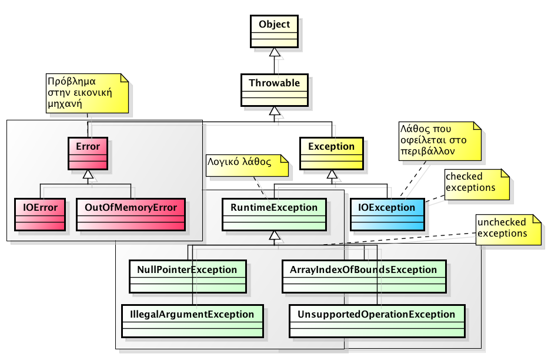
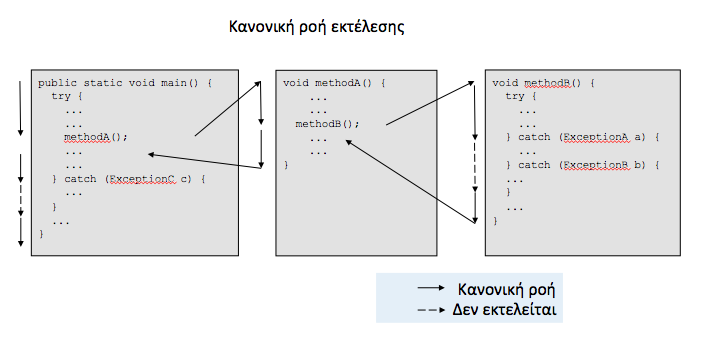
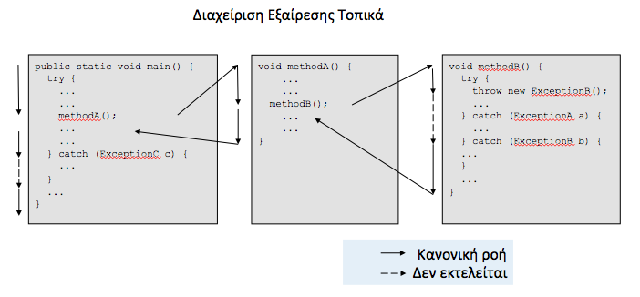
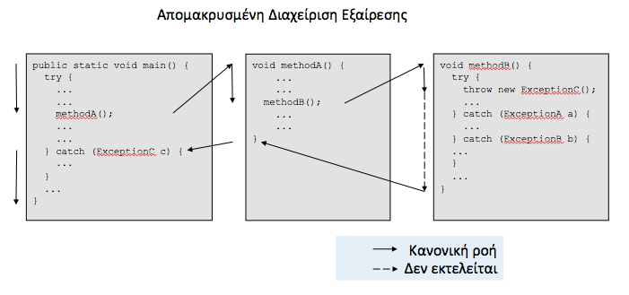
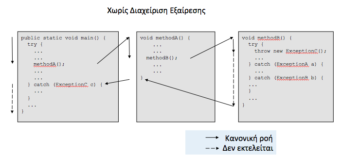

# 4.1 Εξαιρέσεις (Exceptions) {#Java} 
© Γιάννης Κωστάρας

---

[Δ](../../README.md) | [->](../4.2-Enums/README.md)  
 
---

Όπως και στην πραγματική ζωή, τα πράγματα δεν έρχονται πάντα όπως τα περιμένουμε. Μια _εξαίρεση_ είναι ένα μη αναμενώμενο γεγονός, μια ανώμαλη συνθήκη, που διαταράσει την κανονική ροή του προγράμματος. Είναι ένας τρόπος να επικοινωνήσουμε ένα λάθος. Π.χ. ανάγνωση ενός αρχείου που δεν υπάρχει, επικοινωνία με κάποιον διακομιστή ενώ δεν υπάρχει δικτυακή επικοινωνία, γέμισμα της μνήμης ή του δίσκου, διαίρεση με το μηδέν κλπ. 

Όσοι έχουν/είχαν την "τύχη" να δουλεύουν με γλώσσες προγραμματισμού που δεν διαχειρίζονται εξαιρέσεις, βλέπουν ότι στις άτυχες αυτές περιπτώσεις το πρόγραμμα "κρασάρει" και θα πρέπει να ελέγξουν τα υπολείμματα του σωρού (heap dump) ή του πυρήνα (core dump) για να δουν για ποιο λόγο "κράσαρε" το πρόγραμμα.

Είναι πολύ σημαντικό να _μην_ αγνοείτε τις εξαιρέσεις αλλά να τις αντιμετωπίζετε ώστε τα προγράμματά σας να μην "κρασάρουν" αλλά να τερματίζουν ομαλά. Όταν λέμε ότι πρέπει να διαχειριζόμαστε τις εξαιρέσεις, δεν εννοούμε να διορθώνουμε το πρόβλημα σώνει και καλά, απλά ότι πρέπει να βρίσκουμε εναλλακτικούς τρόπους ώστε να μπορεί το πρόγραμμα να συνεχίσει την εκτέλεσή του αν γίνεται. Π.χ. ας υποθέσουμε ότι το πρόγραμμά μας θα πρέπει να ανακτήσει ένα αρχείο από το διαδίκτυο. Εκείνη τη στιγμή όμως, ο διακομιστής (server) που διαθέτει το αρχείο δεν είναι διαθέσιμος (offline). Θα πρέπει να διαχειριστούμε αυτή την εξαίρεση της εκτέλεσης του προγράμματός μας, διαθέτοντας εναλλακτικά ένα τοπικό αρχείο.

```java
try {
 // διάβασε το αρχείο από το διαδίκτυο
} catch (FileNotFoundException e) {
 // διάβασε το αρχείο τοπικά
}
``` 
ή
```java
void readFile(String filename) throws IOException {
	//...
}
```

Λέξεις κλειδιά:

* ```throw``` εγείρει μια εξαίρεση στο σημείο που συνέβηκε το λάθος
* ```try``` μαρκάρει την αρχή του μπλοκ κώδικα που θα αναλάβει να συλλάβει μιαν εξαίρεση
* ```catch``` δηλώνει ένα μπλοκ κώδικα που αναλαμβάνει να διαχειριστεί την εξαίρεση
* ```finally``` χρησιμοποιείται για καθαριθμό των ανοικτών πόρων και εκτελείται πάντα

## Ιεραρχία κλάσεων εξαιρέσεων



**Εικόνα 4.1.1** _Ιεραρχία κλάσεων εξαιρέσεων_

Όπως βλέπουμε στην παραπάνω εικόνα, όλες οι εξαιρέσεις κληρονομούν από την κλάση ```Throwable```:

```java
public class Throwable {
	// Constructors
	Throwable();
	Throwable(String message);
	Throwable(String message, Throwable cause);
	Throwable(Throwable cause);
	
	// Methods
	String getMessage();
	void printStackTrace();
	Throwable getCause();
	StackTraceElement[] getStackTrace();
	Throwable[] getSuppressed();
}
```

Εξαιρέσεις της κλάσης ```Error``` και των υποκλάσεών της εμφανίζονται στην περίπτωση που συμβεί λάθος στην εικονική μηχανή της Java (JVM), π.χ. δεν υπάρχει άλλη διαθέσιμη μνήμη. Σε αυτήν την περίπτωση δεν μπορούμε να κάνουμε τίποτα. Η ΕΜ "κράσαρε" με core dump. Συνήθως δημιουργείται ένα αρχείο καταγραφής της μορφής ```hs_er_pid<process_id>.log```.

Ο προγραμματιστής ασχολείται μόνο με εξαιρέσεις τύπου ```Exception```. Αυτές διακρίνονται σε δυο κατηγορίες:

* _Μη Ελεγχόμενες (Unchecked)_ πρόκειται συνήθως για λογικά λάθη ή λάθη που εμφανίζονται κατά την εκτέλεση του προγράμματος  (```RuntimeException```) και _δεν_ ελέγχονται από τον μεταγλωττιστή. Π.χ. ```IllegalArgumentException```, η μέθοδος που λαμβάνει το μη έγκυρο όρισμα δεν μπορεί να κάνει κάτι για να το εμποδίσει, άρα θα πρέπει να έχει μεριμνήσει τι θα κάνει στην περίπτωση αυτή ώστε να μην κρασάρει το πρόγραμμα. Συνήθως, στην περίπτωση αυτή, η συνέχιση του προγράμματος είναι είτε αδύνατη ή δεν έχει νόημα. 
* _Ελεγχόμενες (Checked)_ πρόκειται για λάθη που ελέγχονται από τον μεταγλωττιστή για την ομαλή λειτουργία του προγράμματος και οφείλονται σε κάποια λαθεμένη κατάσταση ή αλλαγή του περιβάλλοντος, π.χ. μη ύπαρξη ενός αρχείου (```FileNotFoundException```) ή μιας σύνδεσης στο δίκτυο, η οποία όμως μπορεί να διορθωθεί (π.χ. επανάληψη της ενέργειας πολλές φορές, επανασύνδεση με το δίκτυο κλπ.). Ο προγραμματιστής οφείλει να διαχειριστεί (catch) αυτές τις εξαιρέσεις σε ένα μπλοκ ```catch``` (διαφορετικά υπάρχει λάθος μεταγλώττισης).

## Έγερση Εξαιρέσεων

Ο παρακάτω κώδικας εγείρει (raises) μια εξαίρεση 
```java
double arcsine(double sine)  {
	if (sine < -1.0 || sine > 1.0) 
		throw new IllegalArgumentException("sine must be in [-1.0, 1.0]");
	// υπολόγισε την γωνία
}
```

Όταν συμβεί μια εξαίρεση, τότε οι γραμμές που την ακολουθούν στο ίδιο μπλοκ, δεν εκτελούνται και ο έλεγχος περνάει στο πρώτο μπλοκ ```try-catch``` που διαχειρίζεται την εξαίρεση.

## Διαχείριση Εξαιρέσεων
Η Java επιστρέπει τη διαχείριση εξαιρέσεων σε κάποιο άλλο μέρος (βλ. κλάση) του προγράμματος. 
```java
double func(double x) {
	try {
		double angle = arcsine(x);
		return angle;	// αν συμβεί εξαίρεση στην προηγούμενη γραμμή, αυτή η γραμμή δεν εκτελείται
	} catch (IllegalArgumentException e) {
		e.printlnStackTrace();
		return 0.0;
	}
}
```
Όταν συμβεί μια εξαίρεση, τότε οι γραμμές που την ακολουθούν στο ίδιο μπλοκ, δεν εκτελούνται και ο έλεγχος περνάει στο μπλοκ ```catch``` που διαχειρίζεται την εξαίρεση.

Στην παρακάτω εικόνα βλέπουμε μια κανονική εκτέλεση ροής χωρίς έγερση εξαιρέσεων. Η μέθοδος ```main()``` καλεί μια άλλη μέθοδο ```methodA()``` η οποία με τη σειρά της καλεί μια μέθοδο ```methodB```.



**Εικόνα 4.1.2** _Κανονική ροή προγράμματος χωρίς έγερση εξαιρέσεων_

Στη Εικόνα 4.1.3 βλέπουμε πώς γίνεται η διαχείριση μιας εξαίρεσης τοπικά. Μια εξαίρεση εγείρεται στη μέθοδο ```methodB()``` η οποία όμως διαχειρίζεται από ένα ```catch``` μπλοκ αυτής της μεθόδου.



**Εικόνα 4.1.3** _Τοπική διαχείριση εξαιρέσεων_

Στη Εικόνα 4.1.4 βλέπουμε πώς γίνεται η διαχείριση μιας εξαίρεσης απομακρυμένα. Μια εξαίρεση εγείρεται στη μέθοδο ```methodB()``` η οποία όμως δε διαχειρίζεται από κανένα ```catch``` μπλοκ αυτής της μεθόδου με αποτέλεσμα η διαχείρισής της να μεταφέρεται στη καλούσα μέθοδο. Καθώς δε γίνεται διαχείριση εξαιρέσεων από τη μέθοδο ```methodA()``` η ροή μεταφέρεται στα ```catch``` μπλοκ της ```main()``` όπου εκεί, ευτυχώς, υπάρχει ```catch``` μπλοκ που διαχειρίζεται την εξαίρεση τύπου ```ExceptionC```.



**Εικόνα 4.1.4** _Απομακρυσμένη διαχείριση εξαιρέσεων_

Στην παρακάτω εικόνα βλέπουμε ότι δεν υπάρχει ```catch``` μπλοκ που να μπορεί να διαχειριστεί την εξαίρεση που εγείρεται στη μέθοδο ```methodB()``` με αποτέλεσμα το πρόγραμμα να τερματίζεται.



**Εικόνα 4.1.5** _Χωρίς διαχείριση εξαιρέσεων_

Συνίσταται να διαχειρίζεστε _πάντα_ τις εξαιρέσεις (βλ. και τις συμβουλές παρακάτω). Ας δούμε ένα παράδειγμα:

```java
System.out.println("Γειά σας");
System.out.println(10/0);
System.out.println("Αντίο");
```
και το αποτέλεσμα:
```
Γειά σας
Exception in thread "main" java.lang.ArithmeticException: / by zero
	at Main.main(Main.java:5)
	Java returned: 1
```
Αντιθέτως, αν διαχειριστούμε την εξαίρεση:
```java
try {
    System.out.println("Γειά σας");
    System.out.println(10 / 0);
    System.out.println("Αντίο");
} catch (ArithmeticException e) {
    System.err.println("Διαίρεση με το μηδέν");
}
````
τότε το πρόγραμμά μας τερματίζει κανονικά:
```
Γειά σας
Διαίρεση με το μηδέν
```

Μια μέθοδος μπορεί να δηλώσει πολλές εξαιρέσεις. Όταν εμφανίζεται μια εξαίρεση, διάφοροι πόροι μπορεί να μην έχουν προλάβει να καθαριστούν (π.χ. ανοικτά αρχεία, ανοικτές συνδέσεις με βάσεις δεδομένων κλπ.). Χρησιμοποιήστε το μπλοκ ```finally``` για να τους καθαρίσετε: 

```java
try {
	readFile(filename);
} catch (FileNotFoundException fe) {
	System.err.print("File not found " + fe.getMessage());
	fe.printStackTrace();
} catch (IOException ioe) {
	ioe.printStackTrace();
} catch (Exception e) {
	e.printStackTrace();
} finally {
	try {
		file.close();            // μπορεί να υπάρξει λάθος κατά το κλείσιμο του αρχείου
	} catch (Exception ex) {
		ex.printStackTrace();
	}		
}
```

Η σειρά διαχείρισης των εξαιρέσεων έχει σημασία. Πάντα να ξεκινάτε με την πιο ειδικευμένη εξαίρεση και μετά να ακολουθούν οι πιο γενικευμένες (δηλ. από υποκλάση προς υπερκλάση). Π.χ. στο παραπάνω παράδειγμα, ```FileNotFoundException extends IOException extends Exception```. Διαφορετικά θα λάβετε το λάθος ```exception XXX has already been caught```.
```java
try {
	System.out.println(10/0);
} catch (Exception e) {
	e.printStackTrace();
} catch (ArithmeticException ae) {
	ae.printStackTrace();
}
```
```
|  Error:
|  exception java.lang.ArithmeticException has already been caught
|  } catch (ArithmeticException ae) {
|    ^-------------------------------...
```

Η έκδοση 7 παρέχει βελτιωμένη διαχείριση εξαιρέσεων. Η εντολή ```try-with-resources``` κλείνει αυτόματα τους πόρους που ανοίξαμε για επεξεργασία (π.χ. αρχείο, socket κλπ). Προηγούμενα, όταν χρησιμοποιούσαμε στον κώδικά μας εξωτερικούς πόρους, έπρεπε να φροντίσουμε να τους κλείσουμε ώστε να μπορούν να ξαναχρησιμοποιηθούν. Πλέον, αυτό γίνεται αυτόματα μ’ αυτή την εντολή την οποία θα εκτιμήσουν ιδιαίτερα ξεχασιάρηδες προγραμματιστές κι όχι μόνο.

Ας δούμε τον παρακάτω κώδικα σε Java 6 που δημιουργεί ένα αντίγραφο ενός αρχείου ```test.txt``` (θα μάθουμε περισσότερα για διαχείριση αρχείων στα μαθήματα της επόμενης εβδομάδας):

```java
InputStream in = null;
try {
  final File input = 
       new File("test.txt");
  in = new FileInputStream(input);
  final File output = 
       new File("backup.txt");
  final OutputStream out = 
       new FileOutputStream(output);
  try {
   byte[] buf = new byte[4096];
   int len;
   while ((len = in.read(buf)) >= 0)
    out.write(buf, 0, len);
  } catch (IOException ioEx) {
   // Handle this exception 
  } finally  {
     try {
       out.close();
     } catch (
         IOException closeOutEx) {
     // Suppress this exception
     }
  }
} catch (FileNotFoundException fnfEx) {
     // Handle this exception
} catch (IOException openEx) {
     // Handle this exception
} finally  {
    try {
      if (in != null) in.close();
    } catch (IOException closeInx) {
     // Suppress this exception
    }
}
```
Σύμφωνα με το Νόμο του Μέρφυ, μπορεί να συμβεί κάτι απ' τα ακόλουθα:

α.  Ν' αποτύχει το ```InputStream```: 

* το άνοιγμα του αρχείου ```test.txt```	
* η ανάγνωσή του
* το χωρίς λάθη κλείσιμό του

β. Ν' αποτύχει το ```OutputStream```: 

* το άνοιγμα του αρχείου ```backup.txt```	
* η εγγραφή σ' αυτό
* το χωρίς λάθη κλείσιμό του	

γ. Κάποιος συνδυασμός των παραπάνω.
       
Ας δούμε πώς μεταφράζεται ο παραπάνω κώδικας σε Java 7 ή νεώτερη έκδοση:
```java 
final File input = new File("test.txt");
final File output = new File("backup.txt");
try (
  FileOutputStream out = 
     new FileOutputStream(output);
  InputStream in = 
     new FileInputStream(input);) {
     byte[] buf = new byte[4096];
     int len;
     while ((len=in.read(buf))>0) {
       out.write(buf, 0, len);
   }
} catch (IOException e) {
   // If file is not found
}
```

Όπως βλέπετε στον παραπάνω κώδικα, η εντολή
```java
try (εντολές) { } 
```
δεν απαιτεί μπλοκ ```finally { }``` για να κλείσετε τους πόρους που ανοίξατε. Ο κώδικας αυτός κλείνει τον πόρο ακόμα και στην περίπτωση που συνέβη κάποια εξαίρεση.

Οι εντολές πρέπει να υλοποιούν τη διεπαφή ```AutoCloseable``` η οποία επεκτείνει τη διεπαφή ```Closeable``` και περιέχει μια μέθοδο ```close()``` η οποία αναλαμβάνει να κλείσει τους ανοικτούς πόρους. 

Ας δούμε και το παρακάτω παράδειγμα:
```java
try (
 BufferedReader br = 
  new BufferedReader(
   new InputStreamReader(
    new FileInputStream(
               "nofile.txt")))) {
  String strLine;
  while ((strLine = br.readLine()) != null) {
    System.out.println(strLine);
   }
} catch (IOException e) { 
   // If file is not found
   e.printStackTrace();
}
```
Αν το αρχείο ```nofile.txt``` δεν υπάρχει, τότε ο παραπάνω κώδικας θα εγείρει μια εξαίρεση ```java.io.FileNotFoundException``` και θα κλείσει αυτόματα τον πόρο που αναφέρεται από τη μεταβλητή ```br```. Τι γίνεται όμως με τους πόρους που άνοιξαν οι ```InputStreamReader``` και ```FileInputStream```; Καθώς δεν αποθηκεύτηκαν σε κάποια μεταβλητή θα παραμείνουν ανοικτοί! Γι' αυτό το λόγο, ο παραπάνω κώδικας θα πρέπει να γραφτεί ως εξής για να κλείσουν σωστά οι πόροι σε περίπτωση εξαίρεσης:
```java
try (
 FileInputStream fis = 
   new FileInputStream(
               "nofile.txt");
 InputStreamReader isr = 
   new InputStreamReader(fis);
 BufferedReader br = 
  new BufferedReader(isr);) {
  String strLine;
  while ((strLine = br.readLine()) != null) {
    System.out.println(strLine);
   }
} catch (IOException e) { 
   // If file is not found
   e.printStackTrace();
}
```
Η Java επιτρέπει επίσης την ομαδοποίηση διαφορετικών τύπων εξαιρέσεων ενός μπλοκ κώδικα, όπως π.χ.
```java
try {
//...
} catch (FileNotFoundException | IOException e) {
//...
}
```

## Συμβουλές χρήσης εξαιρέσεων

* Οι εξαιρέσεις _δεν_ πρέπει να χρησιμοποιούνται για έλεγχο ροής. Για έλεγχο ροής χρησιμοποιήστε τις δομές ```if``` και ```switch```.
* "Εγείρετε" μιαν εξαίρεση όσο γίνεται πιο νωρίς και εκεί ακριβώς όπου συμβαίνει
* Διαχειριστείτε την εξαίρεση όσο γίνεται αργότερα. Πολλές φορές μπορούμε να αφήσουμε μια εξαίρεση προς διαχείριση σε ανώτερα επίπεδα, δηλ. από μεθόδους που κάλεσαν τη μέθοδο.

```java
try {
... 
} catch (LowerLevelException e) {
	throw new HigherLevelException(...);
}
```
* Μην "καταπίνετε" (swallow) ελεγχόμενες εξαιρέσεις, δηλ. μην τις αφήνετε χωρίς να τις διαχειριστείτε (uncaught exceptions), π.χ.

```java
try {
//...
} catch (IOException ioe) {
}
```
Αν το κάνετε, όταν το πρόγραμμά σας "κρασάρει" δε θα γνωρίζετε σε ποια γραμμή του κώδικά σας οφείλεται.

* Αποφεύγετε να διαχειρίζεστε (catch) ```NullPointerException```s. Όπως θα δούμε στη συνέχεια, οι ```NullPointerException```s ανήκουν στην κατηγορία των μη ελεγχόμενων εξαιρέσεων. Συνήθως δηλώνει ότι υπάρχει κάποιο λάθος στο πρόγραμμά μας, οπότε το καλύτερο είναι να διορθώσετε αυτό το πρόβλημα.

Π.χ.
```java
Boolean flag = false;
try {
	flag = null; // μετά από κάποιον υπολογισμό
	// άλλες εντολές που μπορεί να εμφανίσουν NullPointerException
	// με αποτέλεσμα ο έλεγχος να μεταφέρεται στο catch
	// και ο παρακάτω έλεγχος να μην εκτελείται
	if (!flag) {
		throw new SecurityException("Invalid Credentials");
	}
} catch(NullPointerException npe) {
	// καταγραφή της εξαίρεσης και συνέχιση της εκτέλεσης
}
// κώδικας που εκτελείται ενώ δε θα 'πρεπε να εκτελεστεί
// στην περίπτωση που flag == false
```   
Καλύτερα να ελέγχετε για ```null```.

* Μην εγείρετε ```RuntimeException, Exception, Throwable```. Πάντα εγείρετε την πιο ειδική εξαίρεση ώστε να γνωρίζετε τι ακριβώς συνέβηκε στο πρόγραμμά σας, αντί για μια από τις πιο γενικές αυτές εξαιρέσεις.

Π.χ. αντί για
```java
private void myMethod() throws Exception {
}
```
προτιμήστε:
```java
private void myMethod() throws IOException {
}
```
ή όποια άλλη πιο ειδικευμένη εξαίρεση μπορεί να εγείρει η μέθοδός σας. 

Επίσης, μη διαχειρίζεστε κάποια από αυτές τις εξαιρέσεις καθώς υπάρχει ο κίνδυνος να διαχειριστείτε κάποια εξαίρεση που είναι προς διαχείριση σε άλλο επίπεδο του προγράμματος:

```java
double avg(int sum, int num) throws ArithmeticException, IOException {
	double av = sum/num;
	// εντολές που μπορεί να εγείρουν IOException ή άλλου είδους εξαιρέσεις
	return av;
}

try {
	avg(s,n);
} catch (Exception e) {
	// διαχειρίζεται πέραν των ArithmeticException, 
	// IOException και όλες τις πιθανές άλλες εξαιρέσεις που 
	// ενδέχεται να πρέπει να διαχειριστούν σε άλλο σημείο
}

```

## Συνήθεις Εξαιρέσεις
### Συνήθεις Μη Ελεγχόμενες Εξαιρέσεις

* ```IllegalArgumentException``` όταν ο κώδικας που καλεί τη μέθοδο περνάει όρισμα που η τιμή του είναι ακατάλληλη, π.χ. αρνητική τιμή ενώ η μέθοδος δέχεται μόνο θετικούς αριθμούς
* ```IllegalStateException``` όταν η κατάσταση ενός αντικειμένου δεν είναι έγκυρη π.χ. καλείται ένα αντικείμενο το οποίο δεν έχει αρχικοποιηθεί ακόμα
* ```NullPointerException``` όταν περνιέται όρισμα με τιμή ```null``` ενώ αυτή η τιμή δεν είναι έγκυρη
* ```IndexOutOfBoundsException``` όταν ο δείκτης μιας δομής δεδομένων είναι εκτός των ορίων της 
* ```ConcurrentModificationException``` όταν μια δομή αντιλαμβάνεται ότι τα στοιχεία της έχουν τροποποιηθεί καθώς προσπελάζονται τα στοιχεία της
* ```ClassCastException``` όταν απέτυχε η μετατροπή ενός τύπου δεδομένων σ' έναν άλλον
* ```UnsupportedOperationException``` όταν ένα αντικείμενο δεν υποστηρίζει κάποια μέθοδο (που π.χ. κληρονόμησε)
* ```ArithmeticException``` όταν μια πράξη καταλήγει σε μη έγκυρο αποτέλεσμα, π.χ. διαίρεση με το μηδέν
* ```NumberFormatException``` όταν γίνεται μια μη έγκυρη μετατροπή μεταξύ αριθμών

### Συνήθεις Ελεγχόμενες Εξαιρέσεις
* ```ClassNotFoundException``` όταν δεν μπορεί να βρεθεί μια κλάση επειδή δε βρέθηκε ο ορισμός της
* ```IOException``` όταν απέτυχε ή διακόπηκε μια λειτουργία που 'χει σχέση με πόρους εισόδου/εξόδου
* ```FileNotFoundException``` όταν δε βρέθηκε το αρχείο κατά την προσπάθεια ανάγνωσης ή εγγραφής σ' αυτό
* ```NoSuchMethodException``` όταν μια μέθοδο που καλούμε δε βρέθηκε

### Συνήθη Λάθη
* ```AssertionError``` για να δηλώσει ότι απέτυχε ένας ισχυρισμός (assertion) (βλ. παρακάτω)
* ```VirtualMachineErro``` λάθος στην ΕΜ
* ```OutOfMemoryError``` όταν δεν υπάρχει άλλη κύρια μνήμη να διαθέσει για δημιουργία νέων αντικειμένων
* ```NoClassDefFoundError``` όταν η ΕΜ δεν μπορεί να βρει μια κλάση η οποία υπήρχε κατά τη διάρκεια της μεταγλώττισης
* ```StackOverflowError``` όταν συμβεί υπερχήλιση της στοίβας της ΕΜ

## Τεκμηρίωση Εξαιρέσεων
Για την τεκμηρίωση των εξαιρέσεων, η γλώσσα διαθέτει την ετικέττα javadoc ```@throws```, π.χ.
```java
/**
  * Sets the user's age.
  * @param age the age of the user
  * @throws IllegalArgumentException if age is not in [18-65]
 */
public void setAge(short age) {
  if (age < 18 || age > 65)
   	  throw new IllegalArgumentException("A valid user of the service must be [18-65].");
  this.age = age;
} 
```  
Καλό είναι να τεκμηριώνετε και τις ελεγχόμενες (checked) και τις μη ελεγχόμενες (unchecked) εξαιρέσεις. Οι τελευταίες δηλώνουν τις προσυνθήκες που πρέπει να είναι αναγκαίες για την επιτυχημένη εκτέλεση της μεθόδου. Η αναφορά [2] υπογραμμίζει ότι πρέπει οπωσδήποτε να τεκμηριώνονται οι ελεγχόμενες εξαιρέσεις, αλλά όχι οι μη ελεγχόμενες.

## Δημιουργία Νέων Εξαιρέσεων
Καλό είναι ν' αποφεύγετε να δημιουργείτε νέες εξαιρέσεις και να προσπαθήτε να χρησιμοποιείτε εκείνες που παρέχονται από τη γλώσσα. Στην περίπτωση που δεν σας καλύπτουν, τότε μπορείτε να δημιουργήσετε τις δικές σας, π.χ.

```java
public class ArgumentOutOfRangeException extends IllegalArgumentException {
	
	public ArgumentOutOfRangeException(int lower, int upper, int val) {
		super("Out of range exception: " + val + " must be in the range [" + lower + ", " + upper + "]");
	}
}
```
Στην περίπτωση αυτή, συνίσταται να δημιουργείτε ```RuntimeException```s (κι όχι checked exceptions).

## Ισχυρισμοί (Assertions) 

Οι _Ισχυρισμοί (Assertions)_ βοηθούν στην ανίχνευση λαθών. Αν εμφανιστεί κάποιο λάθος που ελέγχει ένας ισχυρισμός, τότε εμφανίζεται ```AssertionError``` (```AssertionError extends Error```).

Οι ισχυρισμοί μπορούν να (απ)ενεργοποιηθούν σε επίπεδο κλάσης, πακέτου, ή ακόμα και ΕΜ (JVM).

```java
java -ea:<package> ...		// ενεργοποίηση ισχυρισμών για το πακέτο
java -da:<package> ...    	// απενεργοποίηση ισχυρισμών για το πακέτο
java -esa ...		// ενεργοποίηση ισχυρισμών συστήματος 
java -dsa ...		// απενεργοποίηση ισχυρισμών συστήματος
```

Σύνταξη:

```java
assert Expression

assert Expression : ErrorMessage 
```

Π.χ.

```java
assert var1 > 0;
```

Μπορείτε να χρησιμοποιήσετε τους ισχυρισμούς σε μεθόδους για να ελέγξετε αν ικανοποιούνται οι _προσυνθήκες (pre-conditions)_ ή οι _μετασυνθήκες (post-conditions)_ καθώς και _αξιώματα (invariants)_:

* Οι προσυνθήκες πρέπει να ισχύουν όταν καλείται μια μέθοδος, π.χ. τα ορίσματα δεν πρέπει να είναι ```null```
* Οι μετασυνθήκες πρέπει να ισχύουν όταν η μέθοδος τερματίζεται με επιτυχία π.χ. το αποτέλεσμα ενός υπολογισμού
* Τα αξιώματα πρέπει να ισχύουν πάντοτε, π.χ. το μέγεθος ενός πίνακα πρέπει να είναι πάντα ίσο με τον αριθμό των στοιχείων του

Οι ισχυρισμοί δεν μπορούν ν' αντικαταστήσουν τις συνθήκες. Να έχετε πάντοτε υπόψιν σας ότι οι ισχυρισμοί μπορούν να απενεργοποιούνται. Καλό είναι να ενεργοποιούνται όταν ακόμα τεστάρετε τον κώδικα, και να απενεργοποιούνται όταν το πρόγραμμα είναι στην παραγωγή.

## Προαιρετικό (Optional)

Ο Sir Tony Hoare, ο δημιουργός του ```null```, θεωρεί αυτή του τη δημιουργία ως το μεγαλύτερο λάθος του (βλ. [εδώ](https://en.wikipedia.org/wiki/Tony_Hoare#Apologies_and_retractions) και [εδώ](https://www.infoq.com/presentations/Null-References-The-Billion-Dollar-Mistake-Tony-Hoare)).

Η κλάση ```Optional<T>``` εισήχθηκε στην έκδοση 8 με σκοπό να αντιμετωπίσει μια από τις πιο συνηθισμένες εξαιρέσεις, την ```NullPointerException```. Η κλάση ```Optional<T>``` αναπαριστά μια αμετάβλητη αποθήκη μνήμης που μπορεί να φυλάσσει
ένα όχι ```null``` στοιχείο ```T``` ή τίποτα (άδεια). Μια προαιρετική (```optional```) μεταβλητή είναι στην ουσία μια αμετάβλητη συλλογή (αν και δεν κληρονομεί από την διεπαφή ```Collection<T>```) που μπορεί να αποθηκεύσει το πολύ ένα στοιχείο. 

```java
jshell> String s1 = null
s1 ==> null

jshell> String s2 = "Hello"
s2 ==> "Hello" 

jshell> Optional<String> o1 = Optional.ofNullable(s1)
o1 ==> Optional.empty

jshell> Optional<String> o2 = Optional.of(s2)
o2 ==> Optional[Hello]

jshell> o1.isPresent()
$1 ==> false

jshell> o2.isPresent()
$2 ==> true

jshell> o1.orElse("") + o2.get()    
$3 ==> "Hello"					// αντί για NullPointerException
```

Είναι καλή ιδέα οι μεθόδοι σας να επιστρέφουν ```Optional<T>``` αντί για ```Τ``` αν νομίζετε ότι η ```Τ``` μπορεί να είναι ```null``` δηλ. όχι τιμή και οι χρήστες αυτής της μεθόδου πρέπει να ελέγξουν αυτήν την περίπτωση. Π.χ. η παρακάτω μέθοδος αναζητά σειριακά ένα στοιχείο σε μια συλλογή, κι αν δεν το βρει επιστρέφει ```null```:
```java
public static <E extends Comparable<E>> E find(E el, Collection<E> c) {
	for (E e : c) {
		if (e.equals(el)) {
			return el;
		}
	}
	return null;
}
//...
if (find("Ελένη", names) != null) {
//...
}
```
Θα ήταν καλύτερα αν επέστρεφε ```Optional<E>```:
```java
public static <E extends Comparable<E>> Optional<E> find(E el, Collection<E> c) {
	for (E e : c) {
		if (e.equals(el)) {
			return Optional.of(el);
		}
	}
	return Optional.empty();
}
//...
String foundName = find("Ελένη", names).orElse("Not found...");
```
Αποφύγετε να χρησιμοποιείτε ```Optional``` στις ακόλουθες περιπτώσεις:

* μην επιστρέφετε συλλογές ως ```Optional``` (π.χ. ```Optional<List<T>>```) 
* μην χρησιμοποιείτε ```Optional```s ως κλειδιά σε πίνακες κατακερματισμού
* αν η μέθοδός σας επιστρέφει κάποιον πρωτογενή τύπο, προτιμήστε τα ξαδελφάκια της ```Optional```, ```OptionalInt, OptionalLong``` και ```OptionalDouble```

---

[Δ](../../README.md) | [->](../4.2-Enums/README.md)  

---