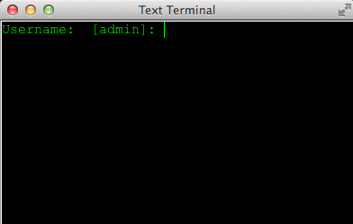

# 4.3 Χρήσιμες κλάσεις {#Java} 
© Γιάννης Κωστάρας

---

[<-](../4.2-Enums/README.md) | [Δ](../../README.md) | [->](../4.4-Internationalisation/README.md)  
 
---
Σ' αυτό το μάθημα θα δούμε κάποιες χρήσιμες κλάσεις της γλώσσας.

## ```StringBuilder``` και ```StringJoiner```
Όπως μάθαμε στα μαθήματα της πρώτης εβδομάδας, η κλάση ```String``` είναι αμετάβλητη (immutable). Κάθε φορά που εκχωρείτε κάποια τιμή σε μια συμβολοσειρά, δημιουργείται ένα νέο αντικείμενο της κλάσης (δεν τροποποιείται το προηγούμενο). Π.χ. στο ακόλουθο παράδειγμα δημιουργείται κάθε φορά ένα νέο αντικείμενο ```String```:

```java
jshell> String s1 = "Hello "
s1 ==> "Hello "

jshell> String s2 = "World"
s2 ==> "World"

jshell> String s1 = s1 + s2
s1 ==> "Hello World"

jshell> String sentence=""
sentence ==> ""

jshell> for (String s : strings)
   ...> sentence += s + " "

jshell> sentence
sentence ==> "This is a String "
```
Μέσα στο βρόγχο ```for``` δημιουργείται κάθε φορά ένα νέο ```String``` που αποθηκεύει το αποτέλεσμα της συνένωσης (```s + " "```), ένα για την συγχώνευση με το ```sentence``` (```+=```) και τέλος ένα νέο για την εκχώρηση (δημιουργείται μια νέα θέση μνήμης που ονομάζεται πάλι ```sentence```). Καταλαβαίνετε ότι αν έχουμε έναν βρόγχο με πολλές επαναλήψεις, δημιουργούνται πολλά νέα αντικείμενα χωρίς λόγο πράγμα που έχει επίπτωση στην απόδοση του προγράμματός μας. Να θυμάστε ότι κάθε φορά που συνενώνετε δυο αλφαριθημτικά, δημιουργούνται νέα αντίγραφα αυτών καθώς η κλάση ```String``` είναι immutable. 

Η γλώσσα παρέχει μια μεταβαλλόμενη (mutable) έκδοση της ```String```, την ```StringBuilder``` (και την παρωχημένη ```StringBuffer```). 

```java
jshell> StringBuilder sb = new StringBuilder(4)
sb ==> 

jshell> for (String s : strings)
   ...> sb.append(s).append(" ")

jshell> sb.toString()
$1 ==> "This is a String "
```

Από την έκδοση 9 και μετά, η απόδοση της κλάσης ```String``` έχει βελτιωθεί πολύ με αποτέλεσμα ο τελεστής συγχώνευσης ```+``` να είναι πιο αποτελεσματικός από τη χρήση της ```StringBuilder```. Χρησιμοποιήστε την ```StringBuilder``` μόνο όταν χρειάζεται να συγχωνεύσετε αλφαριθμητικά μέσα σε βρόγχους. Σε όλες τις άλλες περιπτώσεις, ο τελεστής ```+``` είναι πλέον πολύ αποδοτικός.

Η κλάση ```StringJoiner``` εισήχθηκε στην έκδοση 8 και επιτρέπει τη δημιουργία αλφαριθμητικών συνενώνοντας άλλα αλφαριθμητικά:
 
```java
jshell> StringJoiner sj = new StringJoiner(", ", "[", "]");  // StringJoiner(CharSequence delimiter, CharSequence prefix, CharSequence suffix)
sj ==> []

jshell> for (String s : new String[]{"α", "β", "γ"}) {
   ...> sj.add(s);
   ...> }

jshell> sj
sj ==> [α, β, γ]
```

Για να διαχωρίσουμε αλφαριθμητικά:

```java
jshell> String s = "Ιαν Φεβ Μάρ"
s ==> "Ιαν Φεβ Μάρ"

jshell> StringTokenizer st = new StringTokenizer(s, " ")
st ==> java.util.StringTokenizer@55d56113

jshell> while (st.hasMoreTokens()) {
   ...> System.out.println(st.nextToken());
   ...> }
Ιαν
Φεβ
Μάρ

jshell> String[] split = s.split(" ")
split ==> String[3] { "Ιαν", "Φεβ", "Μάρ" }

jshell> for (String str : split)
   ...> System.out.println(str);
Ιαν
Φεβ
Μάρ
```

## ```Formatter, NumberFormat, System.out.printf()```
Έχουμε μάθει ότι οι	```System.out.print()``` και ```System.out.println()``` εμφανίζουν τα ορίσματά τους στη μονάδα εξόδου (συνήθως οθόνη). Η ```System.out.printf()``` λειτουργεί όπως η ```printf()``` της C και παρέχει περισσότερες δυνατότητες μορφοποίησης με τη βοήθεια της ```Formatter```:

```java
jshell> Formatter f = new Formatter();
f ==> 

jshell> System.out.print(f.format("Όνομα: %s, ηλικία: %d%n", "Νίκος", 1))
Όνομα: Νίκος, ηλικία: 1

jshell> System.out.print(String.format("Όνομα: %s, ηλικία: %d%n", "Νίκος", 1))
Όνομα: Νίκος, ηλικία: 1
```
Τα ```%s, %d``` είναι ειδικοί χαρακτήρες μορφοποίησης που δηλώνουν ότι τα ορίσματα που ακολουθούν είναι αλφαριθμητικό και ακέραιος αριθμός (decimal) αντίστοιχα, ενώ ο ```%n``` δηλώνει το χαρακτήρα αλλαγής γραμμής. 

Το πρώτο όρισμα ονομάζεται αλφαριθμητικό μορφοποίησης (format string) και έχει τη γενική μορφή:

```
%[argument_index$][flags][width][.precision]conversion
```

Το ```[argument_index$]``` είναι προαιρετικό και δηλώνει τη θέση το κάθε ορίσματος, π.χ. ```1$``` είναι το 1ο όρισμα κλπ. Π.χ.

```java
jshell> System.out.print(f.format("Όνομα: %2$s, ηλικία: %1$d%n", 1, "Νίκος"))
Όνομα: Νίκος, ηλικία: 1
```

Το προαιρετικό ```flags``` είναι ένα σύνολο από χαρακτήρες που εξαρτώνται από τη μετατροπή (conversion) και μορφοποιούν ανάλογα το όρισμα.

| Flag | Μορφή
| - | Αριστερή στοίχιση
| + | Με πρόσημο
|   | κενό πριν 
| 0 | συμπλήρωμα με 0 πριν
| , | διαχωριστικό
| ( | οι αρνητικοί αριθμοί μέσα σε παρενθέσεις

Το προαιρετικό ```width``` είναι ένας θετικός αριθμός που δηλώνει τον ελάχιστο αριθμό χαρακτήρων που θα εμφανιστούν στην έξοδο (οθόνη).

Το προαιρετικό ```precision``` είναι ένας θετικός ακέραιος που περιορίζει τον αριθμό των χαρακτήρων (π.χ. αρ. δεκαδικών ψηφίων).

Το ```conversion``` είναι ένας ειδικός χαρακτήρας που δηλώνει πως θα μορφοποιηθεί το όρισμα, π.χ. ```s```. Συνοπτικά:

| Conversion | Μορφή 
| ```b``` | ```boolean```
| ```h``` | ```hexadecimal```
| ```s``` | ```String```
| ```c``` | χαρακτήρας
| ```d``` | ακέραιος αριθμός
| ```o``` | οκταδικός αριθμός
| ```x``` | δεκαεξαδικός αριθμός
| ```e``` | επιστημονική μορφή ακεραίου π.χ. 2Ε-2
| ```f``` | ```float```
| ```g``` | επιστημονική μορφή δεκαδικού
| ```a``` | δεκαεξαδικός δεκαδικός αριθμός
| ```t``` | ημερομηνία/ώρα
| ```%``` | %
| ```n``` | αλλαγή γραμμής

Για μια πλήρη περιγραφή βλ. [Formatter ΑΡΙ](https://docs.oracle.com/en/java/javase/11/docs/api/java.base/java/util/Formatter.html).

Π.χ.

```java
jshell> f.format(locale, "e=%+10.4f", Math.E)
$1 ==> e=   +2,7183
```

όπου ```Math.E``` είναι το e (η βάση των φυσικών λογαρίθμων). Στο αλφαριθμητικό μορφοποίησης θέλουμε να υπάρχει πρόσημο, το μήκος να είναι 10 χαρακτήρες και 4 δεκαδικά ψηφία, ενώ αναπαριστούμε δεκαδικό αριθμό (```f```).

```java
jshell> f.format(locale, "%(,.2f €", -1850.362)
$2 ==> (1.850,36) €
```
Οι αρνητικοί αριθμοί εμφανίζονται μέσα σε παρενθέσεις, χρησιμοποιούμε την υποδιαστολή σύμφωνα με το εκάστοτε ```Locale``` και επιτρέπουμε 2 δεκαδικά ψηφία.

Ίδιοι κανόνες ισχύουν και για την ```printf()```:

```java
jshell> String s = "Hello World";
s ==> "Hello World"

jshell> System.out.printf("Το αλφαριθμητικό %s έχει hash code %h%n", s, s);
Το αλφαριθμητικό Hello World έχει hash code cc969a84

jshell> System.out.printf("% 4d", 2)       // συμπλήρωση με κενά 
   2
   
jshell> System.out.printf("%10.5s%n", Math.PI)
     3.141
```

## Γεννήτριες τυχαίων αριθμών
Αν θέλετε να παράγετε (ψευδο)τυχαίους αριθμούς, τότε η γλώσσα παρέχει μια επιλογή από κλάσεις γι' αυτό το σκοπό:

* ```ThreadLocalRandom```: συνίσταται (από τη Java 7)
* ```SecureRandom```: μια κρυπτογραφικά ισχυρή γεννήτρια τυχαίων αριθμών
* ```Random```: Δε συνίσταται. Η υπερκλάση των ```ThreadLocalRandom``` και ```SecureRandom```
* ```Math.random()```: παράγει τυχαίους δεκαδικούς αριθμούς ίσα κατανεμημένους μεταξύ [0, 1) αλλά είναι πιο αργή

Ας δούμε τη χρήστη καθεμιάς.

Η ```java.util.Random``` είναι η πρώτη υλοποίηση γεννήτριας (ψευδο)τυχαίων αριθμών. 

```java
jshell> Random random = new Random();
random ==> java.util.Random@5b87ed94

jshell> int randInt = random.nextInt();
randInt ==> 952055508

jshell> random.nextInt(101)	// τυχαίος ακέραιος μεταξύ 0 και 100
$1 ==> 23

jshell> Math.abs(random.nextInt()) % 101;	// άλλος τρόπος παραγωγής τυχαίου ακεραίου μεταξύ 0 και 100
$2 ==> 44

jshell> long randLong = random.nextLong();
randLong ==> -4114678850336351970

jshell> double randDouble = random.nextDouble();	// επιστρέφει μια τιμή μεταξύ [0.0, 1.0)
randDouble ==> 0.6538224564592681

jshell> float randFloat = random.nextFloat();	// όπως και η προηγούμενη
randFloat ==> 0.28607237

jshell> boolean randBoolean = random.nextBoolean()
randBoolean ==> true

jshell> byte[] randBytes = new byte[16];
randBytes ==> byte[16] { 0, 0, 0, 0, 0, 0, 0, 0, 0, 0, 0, 0, 0, 0, 0, 0 }

jshell> random.nextBytes(randBytes);	// γεμίζει μια συστοιχία από bytes με τυχαίους αριθμούς

jshell> randBytes
randBytes ==> byte[16] { -45, -53, 81, -21, -52, 101, -67, 6, -20, -2, 83, 69, 67, -92, -31, -5 }
```
Η ```Random``` δεν ενδείκνυται για χρήση από εφαρμογής κρυπτογράφησης. 

Π.χ. η ```Math.abs(random.nextInt()) % n```, όπου ```n``` το πάνω όριο, έχει έναν αριθμό από προβλήματα:

1. η ακολουθία που παράγεται δεν είναι ακριβώς τυχαία. Τα 2/3 από τους παραγόμενους αριθμούς είναι στο κάτω μισό τους εύρους τιμών της. 
2. αν το ```n``` είναι πολλ/σιο του 2 τότε η ακολουθία παραγόμενων αριθμών θα επαναληφθεί μετά από λίγο. 
 
Η ```random.nextInt(n)```, τουναντίον, συνίσταται για χρήση και προτιμάται από την ```Math.random() * n``` η οποία είναι πολύ πιο αργή σύμφωνα με αυτό το [νήμα](https://community.oracle.com/message/6596485?#6594485).

Αντί για τη ```Random```, από την Java 7 και μετά, συνίσταται να χρησιμοποιείτε την ```ThreadLocalRandom```:

```java
jshell> Random random = ThreadLocalRandom.current();
random ==> java.util.concurrent.ThreadLocalRandom@cd2dae5

jshell> random.nextInt(101)
$3 ==> 50
```

_Σημείωση: η ```nextInt(int n)``` συμπεριφέρεται περίεργα όταν το ```n=2^30+1```_

Μπορείτε να παρέχετε κι έναν "σπόρο" (seed) στη γεννήτρια τυχαίων αριθμών ώστε να μην παίρνετε κάθε φορά την ίδια ακολουθία αριθμών:

```java
jshell> Random random = new Random(12345L);
random ==> java.util.Random@3dfc5fb8

jshell> Random random = new Random(System.currentTimeMillis());
random ==> java.util.Random@467aecef

jshell> ThreadLocalRandom.current().setSeed(System.currentTimeMillis());
|  Exception java.lang.UnsupportedOperationException
|        at ThreadLocalRandom.setSeed (ThreadLocalRandom.java:191)
|        at (#69:1)
```

Τόσο η ```Random``` όσο και η ```ThreadLocalRandom``` βασίζονται στη λεγόμενη [γραμμική συστοιχιακή γεννήτρια](https://en.wikipedia.org/wiki/Linear_congruential_generator) κι έτσι οι παραγόμενες τιμές μπορούν να προβλεφθούν. Για ασφαλής παραγωγή τυχαίων αριθμών, χρησιμοποιήστε την πιο αργή αλλά σίγουρη ```SecureRandom```:

```java
jshell> import java.security.SecureRandom

jshell> SecureRandom rng = new SecureRandom();
rng ==> NativePRNG

jshell> byte[] randomBytes = new byte[4];
randomBytes ==> byte[4] { 0, 0, 0, 0 }

jshell> rng.nextBytes(randomBytes); // Fills randomBytes with random bytes (duh)

jshell> System.out.println(Arrays.toString(randomBytes));
[-86, 9, -104, -95]
```

Τέλος, αν θέλουμε να παράγουμε πολύ μεγάλους τυχαίους αριθμούς, μπορούμε να χρησιμοποιήσουμε την αντίστοιχη μέθοδος κατασκευής της ```BigInteger``` όπως θα δούμε παρακάτω.

## ```BigInteger```
Στα μαθήματα της 1ης εβδομάδας μάθαμε για τους πρωτογενείς τύπους δεδομένων της γλώσσας ```int, long, float``` και ```double```. Εξηγήσαμε τους περιορισμούς καθενός. Είδαμε π.χ. ότι ο τύπος ```int``` μπορεί ν' αποθηκεύσει ακέραιους αριθμούς μέχρι το ```Integer.MAX = 2^31-1``` κι ότι αν οι υπολογισμοί σας τον ξεπεράσουν τότε έχουμε υπερχείλιση και λάθος αποτελέσματα. Επίσης, λόγω του [τρόπου αναπαράστασης των αριθμών κινητής υποδιαστολής](https://en.wikipedia.org/wiki/IEEE_754) από τους Η/Υ, δεν μπορείτε να βασίζεστε στην ακρίβεια των πράξεων τέτοιων αριθμών. Η Java παρέχει τις κλάσεις ([BigInteger](https://docs.oracle.com/javase/10/docs/api/java/math/BigInteger.html) και [BigDecimal](https://docs.oracle.com/javase/10/docs/api/java/math/BigDecimal.html)) γι' αυτό το σκοπό. Σημειώστε ότι και οι δυο κλάσεις είναι αμετάβλητες (immutable) (αν και δεν πληρούν όλα τα κριτήρια). Από σχεδιαστικό λάθος των ```BigInteger``` και ```BigDecimal```, έπρεπε να δηλωθούν ```final``` (άρα δεν ικανοποιούν πλήρως τα κριτήρια της αμεταβλητότητας - immutability). Δυστυχώς πλέον είναι αργά, κι έτσι κάποιος μπορεί να δημιουργήσει μια νέα κακόβουλη ```BigInteger``` η οποία κληρονομεί από την ```BigInteger``` την οποία μπορεί να χρησιμοποιήσετε κατά λάθος στο πρόγραμμά σας με καταστροφικά αποτελέσματα (βλ. πηγή [10]).

Για να μετατρέψετε έναν ακέραιο τύπου ```int``` ή ```long``` σε ```BigInteger``` προτιμήστε τη στατική μέθοδο ```valueOf```:

```java
jshell> long longValue = Long.MAX_VALUE;
longValue ==> 9223372036854775807

jshell> BigInteger valueFromLong = BigInteger.valueOf(longValue);
valueFromLong ==> 9223372036854775807
```

Μπορεί ν' αναπαραστήσει και αριθμούς διαφορετικής βάσης (```BigInteger(String val, int radix)```):

```java
jshell> new BigInteger("10", 2)  // το 10 στο δυαδικό σύστημα ==> 2
$2 ==> 2
```
Μπορεί επίσης να μετατρέψει μια ακολουθία από ```bytes```:
```java
jshell> byte[] bytes = new byte[] { (byte) 0x80 };
bytes ==> byte[1] { -128 }

jshell> BigInteger valueFromBytes = new BigInteger(bytes);
valueFromBytes ==> -128

jshell> BigInteger valueFromBytes = new BigInteger(1, bytes);    // BigInteger(int signum, byte[] magnitude)
valueFromBytes ==> 128
```

Η ```BigInteger``` σας δίνει ακόμα τη δυνατότητα να παράγετε τυχαίους αριθμούς: 

```java
jshell> new BigInteger(32, new Random());    // BigInteger(int numBits, Random rnd)
$3 ==> 1009907818
```
Μπορείτε να χρησιμοποιήστε και την ```SecureRandom()``` όπως μάθαμε προηγούμενα. 

### Μαθηματικοί τελεστές
* ```add()```
* ```subtract()```
* ```multiply()```
* ```divide()```
* ```remainder()```
* ```pow()```
* ```max()```
* ```min()```
* ```gcd()```     // μέγιστος κοινός διαιρέτης 

### Δυαδικοί τελεστές
* ```and()```
* ```or()```
* ```xor()```
* ```not()```
* ```andnot()```       		// nand
* ```shiftLeft()```			// <<
* ```shiftRight()```		// >>

Τέλος, αποφύγετε να δουλεύετε με πρωτογενή δυαδικά δεδομένα σα να ήταν κωδικοποιημένοι χαρακτήρες. Στο παρακάτω παράδειγμα, κάποια bytes δεν αντιπροσωπεύουν χαρακτήρες, με αποτέλεσμα με την εξ'ορισμού κωδικοποίηση US-ASCII να χάνεται πληροφορία.

```java
jshell> BigInteger x = new BigInteger("530500452766");
x ==> 530500452766

jshell> byte[] byteArray = x.toByteArray();
byteArray ==> byte[5] { 123, -124, 74, -127, -98 }

jshell> String s = new String(byteArray);
s ==> "{�J��"

jshell> byteArray = s.getBytes();
byteArray ==> byte[11] { 123, -17, -65, -67, 74, -17, -65, -67, -17, -65, -67 }

jshell> 

jshell> x = new BigInteger(byteArray);
x ==> 149830058370101340468658109
```

Η λύση στο παραπάνω πρόβλημα:

```java
jshell> BigInteger x = new BigInteger("530500452766");
x ==> 530500452766

jshell> String s = x.toString(); // έγκυρη μετατροπή
s ==> "530500452766"

jshell>  try {
   ...>  byte[] byteArray = s.getBytes("UTF8");
   ...>  String ns = new String(byteArray, "UTF8");
   ...>  System.out.println("ns="+ns);
   ...>  BigInteger x1 = new BigInteger(ns);
   ...>  System.out.println("x1="+x1);
   ...>  } catch (UnsupportedEncodingException ex) {
   ...>  }
ns=530500452766
x1=530500452766
```

Ως άσκηση, γράψτε τη μέθοδο υπολογισμού του παραγοντικού χρησιμοποιώντας τη κλάση ```BigInteger```.

## ```BigDecimal```
Ας δούμε ένα παράδειγμα. Ας υποθέσουμε ότι έχουμε χαρτζιλίκι 1€ και θέλουμε να βρούμε πόσες καραμέλες μπορούμε να αγοράσουμε που κοστίζουν 0.10€, 0.20€, 0.30€ κλπ.  

```java
jshell> double budget = 1.00;
budget ==> 1.0

jshell> int candies = 0;
candies ==> 0

jshell> for (double price = 0.10; budget >= price; price += 0.10) {
   ...> budget -= price;
   ...> candies++;
   ...> }

jshell> candies
candies ==> 3

jshell> budget
budget ==> 0.3999999999999999
```

Όταν αγοράσουμε μια καραμέλα 0.10€, μας περισσεύουν 0.90€, στη συνέχεια μια καραμέλα 0.20€, μας περισσεύουν 0.70€, στη συνέχεια μια των 0.30€, μας περισσεύουν 0.40€ και επομένως μπορούμε να αγοράσουμε ακόμα μια των 0.40€, αλλά το πρόγραμμα Java έχει άλλη γνώμη!

Ας δούμε τη χρήση της ```BigDecimal```:
```java
jshell> BigDecimal ten_cents = new BigDecimal(".10");
ten_cents ==> 0.10

jshell> BigDecimal budget = new BigDecimal("1.0");
budget ==> 1.0

jshell> int candies = 0;
candies ==> 0

jshell> for (BigDecimal price = TEN_CENTS; budget.compareTo(price) >= 0; price = price.add(TEN_CENTS)) {
   ...> budget = budget.subtract(price);
   ...> candies++;
   ...> }
   
jshell> candies
candies ==> 4

jshell> budget
budget ==> 0.00
```
Δυστυχώς οι ```BigDecimal``` και ```BigInteger``` είναι λιγότερο βολικοί στη χρήση τους και πολύ πιο αργοί. Στο συγκεκριμένο παράδειγμα θα μπορούσατε να χρησιμοποιήσετε ```int``` ή ```long```:

```java
jshell> int candies = 0
candies ==> 0

jshell> int budget = 100
budget ==> 100

jshell> for (int price = 10; budget >= price; price += 10) {
   ...> budget -= price;
   ...> candies++;
   ...> }

jshell> candies
candies ==> 4

jshell> budget
budget ==> 0
```

Χρησιμοποιείστε ```int``` αν οι αριθμοί σας δεν ξεπερνούν τα 9 δεκαδικά ψηφία, ```long``` αν δεν ξεπερνούν τα 18, διαφορετικά χρησιμοποιείστε ```BigDecimal```.

Οι ```BigDecimal``` και ```BigInteger``` έχουν κι άλλα προβλήματα οπότε πρέπει να τους χρησιμοποιείτε με προσοχή. **Πάντα** χρησιμοποιείτε την μέθοδο κατασκευής ```BigDecimal(String)``` και **ποτέ** την ```BigDecimal(double)```. Η τελευταία δημιουργεί ένα αντικείμενο με την ακριβή τιμή του ορίσματός της, π.χ.: 

```java
jshell> new BigDecimal(.1)
$3 ==> 0.1000000000000000055511151231257827021181583404541015625
```

ή προτιμήστε τη στατική μέθοδο ```valueOf```:

```java
jshell> BigDecimal.valueOf(.1);
$4 ==> 0.1
```

Οι μέθοδοι ```equals()``` και ```compareTo()``` της ```BigDecimal``` δεν συμφωνούν:
```java
jshell> BigDecimal one = new BigDecimal("1.0")
one ==> 1.0

jshell> BigDecimal one1 = new BigDecimal("1.00")
one1 ==> 1.00

jshell> one.equals(one1)
$5 ==> false

jshell> one.compareTo(one1)
$6 ==> 0
```

Αυτό οφείλεται στο ότι η ```equals()``` λαμβάνει υπόψιν τον αριθμό δεκαδικών ψηφίων (```scale```). Γι' αυτό χρησιμοποιείτε **πάντα** την ```compareTo()```.

### Μαθηματικοί τελεστές
* ```add()```
* ```subtract()```
* ```multiply()```

Η ```multiply(BigDecimal multiplicand, MathContext mc)``` παρέχει δυνατότητες στρογγυλοποίησης και ακρίβειας του αποτελέσματος. Η ```MathContext(int setPrecision, RoundingMode setRoundingMode)``` δίνει τη δυνατότητα να ορίσουμε τον αριθμό των δεκαδικών ψηφίων και τον τρόπο στρογγυλοποίησης (```RoundingMode.CEILING, RoundingMode.DOWN, RoundingMode.UP, RoundingMode.HALF__DOWN, RoundingMode.HALF__UP, RoundingMode.HALF__EVEN, RoundingMode.UNECESSARY```).

* ```divide()```

```java
jshell> BigDecimal a = new BigDecimal("5");
a ==> 5

jshell> BigDecimal b = new BigDecimal("7");
b ==> 7

jshell> BigDecimal result = a.divide(b);
|  Exception java.lang.ArithmeticException: Non-terminating decimal expansion; no exact representable decimal result.
|        at BigDecimal.divide (BigDecimal.java:1716)
|        at (#9:1)
```
Η διαίρεση αποτυγχάνει αν το αποτέλεσμα δεν είναι ντετερμενιστικός αριθμός. Η ```BigDecimal``` εμφανίζει πάντα αυτήν την εξαίρεση όταν πρέπει να "αποκόψει" δεκαδικά ψηφία για οποιαδήποτε λόγο. Γι' αυτό καλύτερα να χρησιμοποιείτε κάποιες από τις άλλες μεθόδους ```divide()``` όπου μπορείτε να παρέχετε την ακρίβεια και τον τρόπο στρογγυλοποίησης, π.χ.

```java
jshell> BigDecimal result = a.divide(b, 10, RoundingMode.HALF_UP);  // χρησιμοποιείται στις περισσότερες περιπτώσεις
result ==> 0.7142857143
```
* ```divideAndRemainder()```

```java
jshell> BigDecimal[] result = a.divideAndRemainder(b);
result ==> BigDecimal[2] { 0, 5 }
```
* ```divideToIntegralValue()```	// ακέραιο μέρος της διαίρεσης
* ```remainder()```
* ```pow()```
* ```max()```
* ```min()```
* ```movePointLeft()```   	// μετακίνηση υποδιαστολής αριστερά
* ```movePointRight()```	// μετακίνηση υποδιαστολής αριστερά

## ```Math```
Στα προηγούμενα μαθήματα είδαμε κάποιες χρήσεις της κλάσης ```Math``` (π.χ. ```Math.PI, Math.E, Math.sin(), Math.random(), Math.abs()```) κλπ. 

```java
jshell> Math.
E                 IEEEremainder(    PI                abs(              acos(             addExact(         asin(           atan(             atan2(            cbrt(             ceil(             class             copySign(         cos(            cosh(             decrementExact(   exp(              expm1(            floor(            floorDiv(         floorMod(       
fma(              getExponent(      hypot(            incrementExact(   log(              log10(            log1p(          
max(              min(              multiplyExact(    multiplyFull(     multiplyHigh(     negateExact(      nextAfter(      
nextDown(         nextUp(           pow(              random()          rint(             round(            scalb(         
signum(           sin(              sinh(             sqrt(             subtractExact(    tan(              tanh(           
toDegrees(        toIntExact(       toRadians(        ulp(      
```

Η κλάση αυτή παρέχει μερικές μεθόδους ως λύση για το πρόβλημα της υπερχείλισης που είδαμε στα μαθήματα της 1ης εβδομάδας:
```java
Math.addExact()
Math.subtractExact()
Math.multiplyExact()
Math.negateExact()
Math.incrementExact()
Math.decrementExact()
Math.toIntExact()
```
Οι μέθοδοι αυτές εμφανίζουν ```ArithmeticException``` αν υπάρξει λάθος εκτέλεσης, π.χ. υπερχείλιση.
Π.χ.
```java
jshell> Math.addExact((int)1E30, 1000)
|  Exception java.lang.ArithmeticException: integer overflow
|        at Math.addExact (Math.java:825)
|        at (#18:1)
```

## Είσοδος

Υπάρχουν διάφοροι τρόποι να διαβάσουμε από τη μονάδα εισόδου (συνήθως το πληκτρολόγιο):

### ```System.console```
Δε δουλεύει με το jshell αλλά διαθέτει τη δυνατότητα να αποκρύπτει την είσοδο (π.χ. για να εισάγετε έναν κωδικό).

```java
String name = System.console().readLine("Εισάγετε όνομα χρήστη και πατήστε Enter%n");
System.out.printf("Γειά σου %s!", name);
System.out.print("Εισάγετε κωδικό και πατήστε Enter: ");
char[] password = System.console().readPassword();
```

### ```java.util.Scanner```
```java
jshell> import java.util.Scanner

jshell> Scanner scanner = new Scanner(System.in);
scanner ==> java.util.Scanner[delimiters=\p{javaWhitespace}+] ... \E][infinity string=\Q∞\E]

jshell> System.out.print("Όνομα χρήστη: ");
Όνομα χρήστη: 
jshell> String username = scanner.next();
john
username ==> "john"
```
Δεν υποστηρίζει απόκρυψη εισόδου (π.χ. για ανάγνωση κωδικού όπως η ```System.console```).

* ```next()``` ανάγνωση κειμένου μέχρι το επόμενο κενό (ανάγνωση ενός token)
* ```nextLine()``` ανάγνωση κειμένου μέχρι την αλλαγή γραμμής
* ```nextByte()```
* ```nextShort()```
* ```nextInt()```
* ```nextLong()```
* ```nextFloat()```
* ```nextDouble()```
* ```nextBigInteger()```
* ```nextBigDecimal()```
* ```hasNextByte()```
* ```hasNextShort()```
* ```hasNextInt()```
* ```hasNextLong()```
* ```hasNextFloat()```
* ```hasNextDouble()```
* ```hasNextBigInteger()```
* ```hasNextBigDecimal()```

```java
if (scanner.hasNextFloat()){ 
	float fValue = scanner.nextFloat(); 
}else{
	String sValue = scanner.next(); 
}
```

Αν θέλετε να δέχεστε το ENTER ως έγκυρη είσοδο:

```java
Scanner IN = new Scanner(System.in).useDelimiter("(\\b|\\B)");
String s = null;
do { 
    s = IN.nextLine();
} while (s.isEmpty());
```

### ```BufferedReader```

```java
jshell> System.out.print("Όνομα χρήστη: ")
Όνομα χρήστη: 
jshell> BufferedReader reader = new BufferedReader(new InputStreamReader(System.in));
reader ==> java.io.BufferedReader@7a187f14

jshell> try {
   ...> String username = reader.readLine();
   ...> } catch(IOException e) {
   ...> e.printStackTrace();
   ...> }
john

jshell> username
username ==> "john"
```

### Text-IO
Η εξωτερική βιβλιοθήκη [Text-IO](https://github.com/beryx/text-io) προσπαθεί να συνδυάσει τα πλεονεκτήματα των ανωτέρω τριών τρόπων χωρίς τα προβλήματά τους. Για να τη χρησιμοποιήσετε με το jshell, ακολουθήστε τα εξής βήματα:

1. Κατεβάστε τις βιβλιοθήκες [text-io-x.x.x.jar](https://search.maven.org/search?q=a:text-io) και [slf4j-api-x.x.x.jar](https://search.maven.org/search?q=a:slf4j-parent)
2. Εκκινήστε το jshell ως ```jshell --class-path /<path-to>/text-io-x.x.x.jar:/<path-to>/slf4j-api-x.x.x.jar``` ή εκκινήστε το κανονικά και δώστε την εντολή ```jshell> /env -class-path /<path-to>/text-io-x.x.x.jar:/<path-to>/slf4j-api-x.x.x.jar``` (για τα Windows χρησιμοποιήστε ```\```)

```java
jshell> import org.beryx.textio.*

jshell> TextIO textIO = TextIoFactory.getTextIO();
SLF4J: No SLF4J providers were found.
SLF4J: Defaulting to no-operation (NOP) logger implementation
SLF4J: See http://www.slf4j.org/codes.html#noProviders for further details.
textIO ==> org.beryx.textio.TextIO@31304f14

jshell> String username = textIO.newStringInputReader().withDefaultValue("admin").read("Username: ");
username ==> "admin"
```
Εμφανίζεται το ξεχωριστό παράθυρο ```TextTerminal``` το οποίο δέχεται την είσοδο του χρήστη. Μπορείτε να πατήσετε απλά ```ENTER``` ώστε η μεταβλητή ```username``` να λάβει την εξ' ορισμού τιμή ```"admin"```.



**Εικόνα 4.3.1** _Παράθυρο ```TextTerminal```_ 

```java
jshell> String password = textIO.newStringInputReader().withMinLength(6).withInputMasking(true).read("Password: ");
password ==> "123456"
```
με το αποτέλεσμα:

```
Username:  [admin]: ​
Password:  ​
Invalid value.
Expected a string with at least 6 characters.

Password:  ​******
```
Επίσης μπορείτε να χρησιμοποιήσετε το παράθυρο ```TextTerminal``` όχι μόνο για είσοδο αλλά και για έξοδο, π.χ.

```java
jshell> textIO.getTextTerminal().printf("Username: %s, password %s.\n", username, password);
```

Για περισσότερα, αναφερθείτε στις πηγές.

## Πηγές:
1. ["The Java Tutorial"](https://docs.oracle.com/javase/tutorial/)
1. Bloch J. & Gafter N. (2005), _Java™ Puzzlers: Traps, Pitfalls, and Corner Cases_, Addison-Wesley, Puzzle 2.
1. Bloch J. (2018), _Effective Java_, 3rd Edition, Addison-Wesley, Item 63.
1. Deitel P., Deitel H. (2018), _Java How to Program_, 11th Ed., Safari.
1. Downey A. B., Mayfield C. (2016), _Think Java_, O' Reilly. 
1. Eckel B. (2006), _Thinking in Java_, 4th Ed., Prentice-Hall.
1. Hillar G.C. (2017), _Java 9 with JShell_, Packt.
1. Horstmann C. S. (2016), _Core Java, Volume 1 Fundamentals_, 10th Ed., Prentice-Hall.
1. Horstmann C. S. (2018), _Core Java SE 9 for the impatient_, 2nd Ed., Addison-Wesley. 
1. Iordache S. (2016), ["Interactive Console Applications in Java"](https://dzone.com/articles/interactive-console-applications-in-java).
1. Long F. et al. (2012), _The CERT® Oracle® Secure Coding Standard for Java™_, Addison-Wesley. 
1. Sharan K. (2017), _Java 9 Revealed: For Early Adoption and Migration_, Apress.
1. Sierra K. & Bates B. (2005), _Head First Java_, 2nd Ed. for Java 5.0, O’Reilly.
1. [Java Notes for Professionals](https://books.goalkicker.com/JavaBook/JavaNotesForProfessionals.pdf)
1. [Generate Random Numbers](http://www.javapractices.com/topic/TopicAction.do?Id=62)
1. [Java printf( ) Method Quick Reference](https://www.cs.colostate.edu/~cs160/.Spring16/resources/Java_printf_method_quick_reference.pdf)

---

[<-](../4.2-Enums/README.md) | [Δ](../../README.md) | [->](../4.4-Internationalisation/README.md)  

---