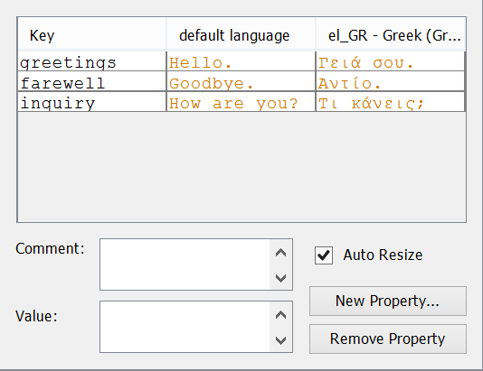
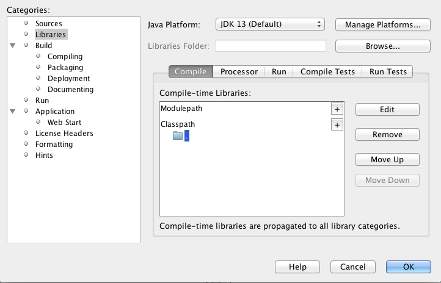

# 4.4 Διεθνοποίηση (Internationalisation) {#Java} 
© Γιάννης Κωστάρας

---

[<-](../4.3-UsefulClasses/README.md) | [Δ](../../README.md) | [->](../4.5-Logging/README.md)  
 
---
Αν και τα Αγγλικά είναι η πιο ομιλούμενη γλώσσα (τα κινέζικα θα πουν μερικοί), θα θέλαμε να αναπτύσουμε εφαρμογές και στη γλώσσα μας ή σε άλλες γλώσσες. 

_Διεθνοποίηση (Internationalization)_ είναι η διαδικασία σχεδίασης μιας εφαρμογής ώστε να μπορεί να προσαρμόζεται σε διάφορες γλώσσες και περιοχές χωρίς να χρειάζεται να επαναμεταγλωττίσουμε το πρόγραμμά μας. Για συντομία ονομάζεται _i18n_ γιατί υπάρχουν 18 γράμματα μεταξύ του i και του n στη λέξη internationalization. Αυτό πετυχαίνεται με το να αποθηκεύεται το κείμενο που πρέπει να εμφανίζεται σε διάφορες γλώσσες σε αρχεία εκτός του πηγαίου κώδικα του προγράμματος. Ανάλογα με το σε ποια γλώσσα/περιοχή θέλουμε να εκτελέσουμε το πρόγραμμα, φορτώνουμε και το αντίστοιχο αρχείο που εμφανίζει τα μηνύματα, ετικέτες κλπ. στην κατάλληλη γλώσσα.

_Τοπικοποίηση (Localization)_ είναι η διαδικασία προσαρμογής μιας εφαρμογής σε μια συγκεκριμένη περιοχή ή γλώσσα. Για συντομία ονομάζεται _l10n_ γιατί υπάρχουν 10 γράμματα μεταξύ του l και του n στη λέξη localization. Αυτό σημαίνει να εμφανίζονται σωστά οι αριθμοί, ημερομηνίες, νόμισμα κλπ. σύμφωνα με τους κανόνες της χώρας που εκτελείται η εφαρμογή.

Η Java διαθέτει τις εξής κλάσεις για το σκοπό αυτό:

* ```java.util.Locale```
* ```ResourceBundle```

Η κλάση ```java.util.Locale``` αναπαριστά μια "γεωγραφική, πολιτική ή πολιτιστική" περιοχή. Μπορεί να περιλαμβάνει μια χώρα, μια περιοχή, μια γλώσσα ή διάλεκτο που μιλάται σ' αυτή τη χώρα. Π.χ. στο Βέλγιο μιλούν Γαλλικά και Ολλανδικά αλλά δεν υπάρχει "Βελγική" γλώσσα.

## Διεθνοποίηση (Internationalization)
Ας δούμε ένα παράδειγμα:

```java
public class Main {

    /**
     * @param args the command line arguments
     */
    public static void main(String[] args) {
        System.out.println("Hello.");
        System.out.println("How are you?");
        System.out.println("Goodbye.");
    }
}
```

Θα θέλαμε το παραπάνω πρόγραμμα να "μιλάει" ελληνικά όταν "εκτελείται" στην Ελλάδα.

```java
Locale locale = new Locale("el", "GR");
ResourceBundle messages = ResourceBundle.getBundle("MessagesBundle", locale);
System.out.println(messages.getString("greetings"));
System.out.println(messages.getString("inquiry"));
System.out.println(messages.getString("farewell"));
```

Αλλάξαμε τον κώδικα της ```main()``` με τον παραπάνω. Κατ' αρχήν, ορίζουμε ένα νέο ```Locale``` το οποίο λαμβάνει ως παραμέτρους τη _γλώσσα_ και τη _χώρα_. Η ```Locale``` διαθέτει 3 μεθόδους κατασκευής (constructors):

* ```Locale(String language)```
* ```Locale(String language, String country)```
* ```Locale(String language, String country, String variant)```

Οι γλώσσες (language) ([ISO 639](http://www.loc.gov/standards/iso639-2/php/code_list.php) και [IETF BCP 47](https://tools.ietf.org/html/bcp47)) και οι χώρες  (country) ([ISO 3166](http://www.chemie.fu-berlin.de/diverse/doc/ISO_3166.html) ή [UN M.49](https://en.wikipedia.org/wiki/UN_M49)) ορίζονται [εδώ](http://www.iana.org/assignments/language-subtag-registry/language-subtag-registry). Μια χώρα ορίζεται από 2 ή 3 χαρακτήρες. Τέλος, η παραλλαγή χρησιμοποιείται για να δείξει μια παραλλαγή ενός Locale, π.χ. ```"polyton"``` (πολυτονικά ελληνικά), ```"POSIX"``` κλπ. Μπορείτε να βρείτε τις κωδικοποιήσεις (encodings) που υποστηρίζει η γλώσσα [εδώ](https://docs.oracle.com/javase/8/docs/technotes/guides/intl/encoding.doc.html).

Υπάρχουν φυσικά και σταθερές για τις πιο δημοφιλής γλώσσες:

```java
jshell> Locale.
CANADA				CANADA_FRENCH
CHINA				CHINESE                    
ENGLISH                    
FRANCE				FRENCH                     
GERMAN				GERMANY
ITALIAN				ITALY
JAPAN				JAPANESE
KOREA				KOREAN
SIMPLIFIED_CHINESE
TAIWAN				TRADITIONAL_CHINESE
UK					US                         
```

Στη συνέχεια ορίζουμε το αρχείο ```MessagesBundle.properties``` στον ίδιο φάκελο με την ```Main.java```:

```
greetings = Hello.
farewell = Goodbye.
inquiry = How are you?
```

ως εξής:

1. Δεξί κλικ στο ```<default package>``` (όψη _Projects_) και κλικ στο μενού **New --> Other**
1. **Categories:** _Other_, **File Types:** _Properties File_
1. Κλικ στο **Next**
1. **File Name:** ```MessagesBundle```
1. Κλικ στο **Finish**

και το με τον ίδιο τρόπο το αρχείο ```MessagesBundle_el_GR.properties```:

```
greetings = Γειά σου.
farewell = Αντίο.
inquiry = Τι κάνεις;
```

Μάλιστα το NetBeans σας βοηθάει εμφανίζοντας το εξής:



**Εικόνα 4.4.1** _Επεξεργασία Resource Bundles στο NetBeans_

Μπορείτε να προσθέσετε όσα ```MessagesBundle_xx_YY.properties``` αρχεία θέλετε υποστηρίζοντας όσες γλώσσες θέλετε και περνώντας τους κατάλληλους κωδικούς γλώσσας και χώρας στη ```Locale``` μπορείτε να εμφανίζετε τα μηνύματα σ' αυτές τις γλώσσες. Μπορείτε επίσης να περάσετε τον κωδικό γλώσσας και χώρας στη γραμμή εντολών καθώς εκτελείται το πρόγραμμα, π.χ.

```bash
$ java Main el GR
```

```java
public static void main(String[] args) {
    String language;
    String country;

    if (args.length != 2) {
        language = new String("en");
        country = new String("US");
    } else {
        language = new String(args[0]);
        country = new String(args[1]);
    }

    Locale currentLocale = new Locale(language, country);
    ResourceBundle messages = ResourceBundle.getBundle("MessagesBundle", currentLocale);
    System.out.println(messages.getString("greetings"));
    System.out.println(messages.getString("inquiry"));
    System.out.println(messages.getString("farewell"));
}
```
Επομένως, τα βήματα για να διεθνοποιήσετε την εφαρμογής σας είναι τα παρακάτω:

1. Δημιουργήστε ένα αρχείο ιδιοτήτων (properties file) το οποίο περιέχει ως κλειδιά-τιμές τα αλφαριθμητικά που θέλετε να μεταφράσετε σε άλλες γλώσσες (π.χ. ```MessagesBundle.properties```). Αυτό συνήθως τα εμφανίζει στην αγγλική γλώσσα.
2. Δημιουργήστε τα αρχεία ιδιοτήτων των άλλων γλωσσών φροντίζοντας να τα ονομάζετε σωστά (π.χ. ```MessagesBundle_el_GR.properties```). Τα κλειδιά (οι λέξεις αριστερά του =) πρέπει να παραμένουν τα ίδια σ' όλα τ' αρχεία.
3. Δημιουργήστε στον κώδικά σας ένα αντικείμενο τύπου ```Locale``` παρέχοντάς του τους κατάλληλους κωδικούς γλώσσας και χώρας.
4. Δημιουργήστε στον κώδικά σας ένα αντικείμενο τύπου ```ResouceBundle``` για να φορτώσετε το κατάλληλο αρχείο ιδιοτήτων που περιέχει τις μεταφράσεις που επιθυμείτε
5. Ανακτήστε την αντίστοιχη μετάφραση δίνοντας το κλειδί στο ```ResourceBundle``` με τη μέθοδο ```getString()```.

**Σημείωση 1** _Ένα πρόγραμμα Java εκτελείται με την εξ' ορισμού κωδικοποίηση του συστήματος που είναι εγκατεστημένη η ΕΜ της Java. Μπορείτε όμως να εκκινήσετε ένα πρόγραμμα Java περνώντας του την παράμετρο ```-Dfile.encoding=<encoding>``` π.χ. ```-Dfile.encoding=UTF-8``` για να το εκτελέσετε με άλλη κωδικοποίηση απ' αυτή του συστήματος. Π.χ. ```java -Dfile.encoding=UTF-8 Main el GR```._

**Σημείωση 2** _Αν δημιουργήσετε τα αρχεία `.properties` στο ριζικό φάκελο του έργου (Project) αντί για το φάκελο που βρίσκεται η κλάση ```Main```, θα λάβετε λάθος εκτέλεσης ```java.util.MissingResourceException: Can't find bundle for base name MessagesBundle, locale el_GR```. Ο λόγος είναι ότι δεν μπορεί να βρει τα ```MessagesBundle.properties``` γιατί δεν τα βρίσκει ούτε στο ```classpath``` ούτε στο ```modulepath```. Μπορείτε να ορίσετε το ```classpath``` σύμφωνα με τις παρακάτω οδηγίες:_

1. Δεξί κλικ στο έργο και **Properties**
1. Κλικ στην κατηγορία **Libraries**
1. Κλικ στο **+** του Classpath και **Add JAR/Folder**
1. Επιλέξτε το όνομα του έργου σας (θα πρέπει το _Relative Path_ να γίνει **.**) (βλ. παρακάτω εικόνα)



**Εικόνα 4.4.2** _Ορισμός classpath στο NetBeans_

## Τοπικοποίηση (Localization)
Πιο πάνω είδαμε δυο τρόπους δημιουργίας ```Locale```:

* με τις σταθερές, π.χ. ```Locale.ITALIAN```
* με την μέθοδο κατασκευής που δέχεται ως παραμέτρους τη γλώσσα και τη χώρα

Μπορούμε να δημιουργήσουμε αντικείμενα ```Locale``` με τις μεθόδους χτισίματος:

```java
Locale cLocale = new Locale.Builder().setLanguage("en").setRegion("GB").build();
```

Τέλος, με τη στατική μέθοδο κατασκευής ```forLanguageTag(String)```:

```java
Locale locale = Locale.forLanguageTag("el-GR");
locale ==> el_GR
```

```java
jshell> locale.getDisplayName()
$8 ==> "Ελληνικά (Ελλάδα)"

jshell> locale.getDisplayCountry()
$9 ==> "Ελλάδα"

jshell> locale.getDisplayLanguage()
$10 ==> "Ελληνικά"
```

Πολλές κλάσεις διαθέτουν μεθόδους που χρειάζονται το ```Locale``` για να δουλέψουν σωστά.

Π.χ. 

```java
jshell> Locale.getDefault()
$1 ==> en_US

jshell> import java.text.NumberFormat

jshell> NumberFormat.getInstance().format(902304)
$3 ==> "902,304"

jshell> Locale.setDefault(new Locale("el", "GR"))

jshell> NumberFormat.getInstance().format(902304)
$4 ==> "902.304"

jshell> Locale locale = new Locale("el", "GR");
locale ==> el_GR

jshell> NumberFormat.getInstance(locale).format(902304)
$5 ==> "902.304"

jshell> NumberFormat.getCurrencyInstance(locale).format(902304)
$6 ==> "902.304,00 €"

jshell> NumberFormat.getPercentInstance(locale).format(99.999)
$7 ==> "10.000%"

jshell> NumberFormat.getInstance(locale).parse("100,00");
$8 ==> 100
```

Μπορείτε να ορίσετε τον ελάχιστο-μέγιστο αριθμό ψηφίων για ακεραίους και δεκαδικούς:
```java
numberFormat.setMinimumIntegerDigits(int digits)
numberFormat.setMaximumIntegerDigits(int digits)
numberFormat.setMinimumFractionDigits(int digits)
numberFormat.setMaximumFractionDigits(int digits)

int digits = numberFormat.getMinimumIntegerDigits();
int digits = numberFormat.getMaximumIntegerDigits();
int digits = numberFormat.getMinimumFractionDigits();
int digits = numberFormat.getMaximumFractionDigits();
```

Μπορείτε να ορίσετε επίσης ```numberFormat.setRoundingMode(RoundingMode.HALF_DOWN)``` όπως μάθαμε στο προηγούμενο μάθημα. 

Όταν υπάρχουν μέθοδοι που υπάρχει η επιλογή να περάσετε ή όχι ένα ```Locale```, συνίσταται να περνάτε πάντα ```Locale```. Η μέθοδος χωρίς ```Locale``` χρησιμοποιεί το ```Locale``` του συστήματος και τ' αποτελέσματα μπορεί να 'ναι λάθος.

Π.χ.

```java
jshell> Locale.getDefault()
$11 ==> el_GR

jshell> "title".toUpperCase()
$12 ==> "TITLE"

jshell> Locale.setDefault(Locale.forLanguageTag("tr-TR"))	// τούρκικα

jshell> "title".toUpperCase()
$14 ==> "T?TLE"

jshell> "title".toUpperCase(Locale.ENGLISH)
$15 ==> "TITLE"
```
Άλλες μέθοδοι που δέχονται ```Locale```:

* ```String.toLowerCase()```
* ```String.equalsIgnoreCase()```
* ```System.out.printf(locale, format, arguments)```

```java
jshell> System.out.printf(locale, "%,d %n", 10000);
10.000
```

Αν θέλετε να συγκρίνετε δυο αλφαριθμητικά λαμβάνοντας υπόψιν το ```Locale```, τότε υπάρχει η κλάση [Collator](https://docs.oracle.com/en/java/javase/11/docs/api/java.base/java/text/Collator.html):

```java
Collator collator = Collator.getInstance(Locale.GERMAN);
collator.setStrength(Collator.PRIMARY);
collator.equals("Gärten", "gaerten"); // returns true
```

## Πηγές
1. [Wikipedia](https://en.wikipedia.org/wiki/Internationalization_and_localization)
1. [Java Internationalization](http://tutorials.jenkov.com/java-internationalization/index.html)

---

[<-](../4.3-UsefulClasses/README.md) | [Δ](../../README.md) | [->](../4.5-Logging/README.md)  

---