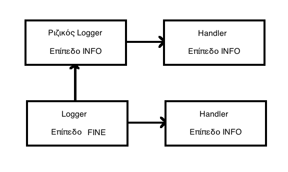
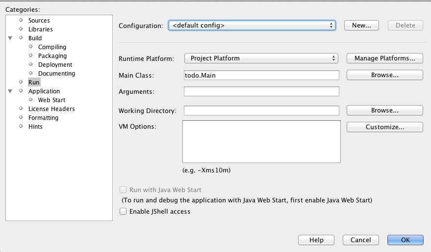

# 4.5 Αρχεία Καταγραφής (Logging) {#Java} 
© Γιάννης Κωστάρας

---

[<-](../4.4-Internationalisation/README.md) | [Δ](../../README.md) | [->](../4.6-UnitTesting/README.md)   

---

Τα προγράμματα έχουν γίνει πλέον τόσο πολύπλοκα που ένα σωρό πράγματα μπορούν να συμβούν. Προβλήματα μπορούν να συμβούν ακόμα και όταν το πρόγραμμα βγει στην παραγωγή στις εγκαταστάσεις του πελάτη. Θα θέλουμε να έχουμε κάποιον τρόπο, επομένως, για να μπορούμε να βρούμε τι μπορεί να πήγε λάθος. Αυτό το πετυχαίνουμε με τα _αρχεία καταγραφής (logs)_. Δημιουργώντας λεπτομερή αρχεία καταγραφής μας βοηθάει στο να εντοπίσουμε τα λάθη και να τα διορθώσουμε. 

Παρόλ' αυτά, τ' αρχεία καταγραφής έχουν επίπτωση στην απόδοση της εφαρμογής μας και χρησιμοποιούν πόρους (π.χ. μεγάλο χώρο στο δίσκο) γι' αυτό χρειαζόμαστε διαφορετικά επίπεδα (levels) καταγραφής. Κάθε σύστημα καταγραφής θα πρέπει να ικανοποιεί τουλάχιστο τα παρακάτω κριτήρια:

* πολλαπλά επίπεδα καταγραφής
* δυναμική προσαρμογή των επιπέδων καταγραφής καθώς τρέχει η εφαρμογή
* δυνατότητα καταγραφής σε διαφορετικά μέσα (π.χ. κονσόλα, ΒΔ κλπ.)

Επιπλέον, θα επιθυμούσαμε να είχαμε στατιστικά, μετρήσεις απόδοσης, ασύγχρονη καταγραφή κλπ.

Υπάρχουν διάφορες βιβλιοθήκες καταγραφής:

* ```java.util.logging``` περιέχεται στην ίδια τη γλώσσα Java από την έκδοση 1.4
* [Apache Log4J](https://logging.apache.org/log4j/2.x/)
* [Jakarta Commons Logging](http://commons.apache.org/logging/)
* [SLF4J](http://www.slf4j.org)

## ```java.util.logging```

```java
import java.util.logging.Level;
import java.util.logging.Logger;

public class MyClass {
	private static final Logger LOG = Logger.getLogger(MyClass.class.getName());
	public void myMethod() {
		//Logger.getGlobal().info("Opening file " + filename);  // default logger
		LOG.setLevel(Level.FINE);
		LOG.info("An info log message");
		LOG.log(Level.INFO, "Another info log message");
		LOG.fine("A fine message");
		try {
			// code might throw an exception
		} catch (Exception ex) {
			LOG.log(Level.SEVERE, "Something went wrong", ex);
		}
	}
}
```

Για εξαιρέσεις παρέχονται οι εξής μέθοδοι:

```java
void log(Level l, String message, Throwable t)
void throwing(String className, String methodName, Throwable t)
```

Υποστηρίζει 7 επίπεδα (σε φθήνουσα σειρά):

* ```OFF```
* ```SEVERE```
* ```WARNING```
* ```INFO``` (εξ' αρισμού)
* ```CONFIG```
* ```FINE```
* ```FINER```
* ```FINEST```
* ```ALL```

```java
LOG.severe("SEVERE");
LOG.warning("WARNING");
LOG.info("INFO");
LOG.config("CONFIG");
LOG.fine("FINE");
LOG.finer("FINER");
LOG.finest("FINEST");
// ή χρησιμοποιήστε αυτή τη μορφή
LOG.log(Level.FINEST, "FINEST");
```
Αν θέσουμε π.χ. το επίπεδο σε ```INFO```, αυτό σημαίνει ότι θα καταγραφούν και όλα τ' ανώτερα επίπεδα, δηλ. ```WARNING``` και ```SEVERE```. Τα επίπεδα ```INFO, WARNING``` και ```SEVERE``` εμφανίζουν εξ' ορισμού το μήνυμα στην οθόνη.

Για να βελτιώσετε την απόδοση του προγράμματος, καλό είναι να κάνετε έλεγχο πριν από κάθε καταγραφή, π.χ.

```java
if (LOG.isLoggable(Level.FINE)) {
	LOG.log(Level.FINEST, "FINEST");
}
```

Το βασικό αρχείο διαμόρφωσης βρίσκεται στην τοποθεσία ```jre/lib/logging.properties``` για εκδόσεις της Java πριν την 9 και ```conf``` για τις μετέπειτα εκδόσεις. Το κλειδί ```java.util.logging.config.file``` αποθηκεύει τη θέση του εξ' ορισμού αρχείου καταγραφής. Μπορείτε ν' αλλάξετε το ```.level= INFO``` σε κάποιο άλλο επίπεδο.

Με τη βοήθεια των ```Διαχειριστών (Handlers)``` μπορείτε να καταγράφετε σε διαφορετικές τοποθεσίες ταυτόχρονα. Π.χ. ο ```ConsoleHandler``` καταγράφει στην κονσόλα ενώ μπορείτε να ορίσετε και διαφορετικά επίπεδα για τους διάφορους handlers. Άλλοι διαχειριστές: ```FileHandler, SocketHandler``` κ.ά. Καλό είναι να ορίσετε μια ακολουθία περιστροφής (rotation sequence) π.χ. ```myapp.log.0, myapp.log.1, myapp.log.2``` όταν ξεπεραστεί το μέγεθος του αρχείου καταγραφής ορισμένου στο ```java.util.logging.FileHandler.limit``` ορίζοντας το κλειδί ```java.util.logging.FileHandler.count``` με κάποιον αριθμό >1. 

Τέλος, μπορείτε να μορφοποιήσετε τις καταγραφές με το κλειδί ```java.util.logging.SimpleFormatter.format```.

Αν τρέξουμε όμως το παραπάνω πρόγραμμα θα δούμε:

```
Feb 28, 2019 10:42:19 AM MyClass myMethod
INFO: An info log message
Feb 28, 2019 10:42:19 AM MyClass myMethod
INFO: Another info log message
```

Που πήγε το μήνυμα fine; Ας προσθέσουμε κι ένα διαχειριστή αρχείων (file handler) για να καταγράψουμε τα μηνύματα και σ' ένα αρχείο καταγραφής (όχι μόνο στην κονσόλα):

```java
    public void myMethod() {
//		Logger.getGlobal().info("Opening file " + filename);  // default logger
        FileHandler fh = null;
        try {
            fh = new FileHandler("log.xml");
            LOG.addHandler(fh);
        } catch (IOException ioexc) {
            ioexc.printStackTrace();
        }
        LOG.setLevel(Level.FINE);
//..
```
Στο αρχείο ```log.xml``` καταγράφεται το μήνυμα fine. Τι συμβαίνει; 

Ανοίγοντας το αρχείο ```logging.properties```, παρατηρούμε ότι το εξ' ορισμού επίπεδο που ορίζεται εκεί για τον logger είναι ```.level= INFO```. Κάθε Logger έχει έναν πατέρα και η ιεραρχία φτάνει μέχρι τον ριζικό που ορίζεται στο ```logging.properties```. Καλούνται πάντα οι γονικοί handlers εκτός κι αν ορίσουμε ```setUseParentHandlers(false)```. Θα πρέπει να προσέξουμε ότι υπάρχουν επίπεδα για τους loggers και επίπεδα για τους handlers. Πρέπει να προσέξουμε όμως το επίπεδο για τον handler δεν μπορεί να είναι χαμηλότερο από του logger. Έτσι, π.χ. στο ```logging.properties``` ορίζεται για τον logger το επίπεδο ```.level= INFO``` και για τον ```java.util.logging.ConsoleHandler``` ορίζεται ```java.util.logging.ConsoleHandler.level = INFO```. Επομένως, αν και ορίζουμε το επίπεδο του logger μας να είναι ```FINE```, καθώς ο ```ConsoleHandler``` έχει ορισμένο επίπεδο ```INFO```, θα εμφανίσει μόνο τις καταγραφές ```INFO``` και πάνω. Αντιθέτως, ο ```FileHandler``` έχει εξ' ορισμού επίπεδο ```ALL```, οπότε μπορεί να καταγράψει επίπεδα ```FINE```.



**Εικόνα 4.5.1** _Loggers και Handlers και levels_

Όπως φαίνεται στην παραπάνω εικόνα, για καταγραφές υψηλότερες του επιπέδου που ορίζεται στον Logger (δηλ. ```FINE```), καλείται ο γονικός Logger (ο ριζικός στο πιο πάνω σχήμα). Ο ριζικός logger στέλνει τις καταγραφές με επίπεδο ```INFO``` και πάνω στον handler του ο οποίος καταγράφει μόνο τις καταγραφές στο επίπεδό του και πάνω (```INFO``` αλλά θα μπορούσε να ήταν και διαφορετικό). Επίσης, ο Logger στέλνει τις καταγραφές υψηλότερες του επιπέδου του (δηλ. ```FINE```) και στον handler του ο οποίος καταγράφει μόνο τις καταγραφές που είναι στο επίπεδό του και πάνω (δηλ. ```INFO```).

Για να εμφανίσουμε τις καταγραφές του σωστού επιπέδου και στην κονσόλα, θα πρέπει να δημιουργήσουμε τον δικό μας ```ConsoleHandler``` και να δηλώσουμε ότι δε θέλουμε να χρησιμοποιήσουμε τον πατρικό handler:

```java
    public void myMethod() {
//		Logger.getGlobal().info("Opening file " + filename);  // default logger
        ConsoleHandler ch = new ConsoleHandler();
        LOG.addHandler(ch);
        FileHandler fh = null;
        try {
            fh = new FileHandler("log.xml");
            LOG.addHandler(fh);
        } catch (IOException ioexc) {
            ioexc.printStackTrace();
        }
        LOG.setLevel(Level.FINE);
        LOG.setUseParentHandlers(false);
        ch.setLevel(Level.FINE);
        fh.setLevel(Level.FINE);
//...
```
Τώρα η έξοδος στην κονσόλα είναι πλέον σωστή:

```
Feb 28, 2019 11:17:00 AM MyClass myMethod
INFO: An info log message
Feb 28, 2019 11:17:01 AM MyClass myMethod
INFO: Another info log message
Feb 28, 2019 11:17:01 AM MyClass myMethod
FINE: A fine message
```
## Apache Log4j 2.x

Αφού το κατεβάσετε από την τοποθεσία, θα χρειαστείτε τα εξής δυο αρχεία:

* ```log4j-api-2.xx.jar```
* ```log4j-core-2.xx.jar```

Αποτελείται από 3 μέρη:
* Loggers
* Appenders (για καταγραφή σε διάφορους προορισμούς)
* Layouts (για μορφοποίηση των καταγραφών)

```java
import org.apache.logging.log4j.Logger;
public class MyClass {
	private static final Logger LOG = LogManager.getLogger(MyClass.class);

	public void myMethod() {
		if (LOG.isInfoEnabled()) {
			LOG.info("Param value: " + parameter);
			LOG.log(LEVEL.WARN, "Exception: " + exception)
		}
		if (LOG.isDebugEnabled()) {
			LOG.debug("...");
		}
	}
}
```

Υποστηρίζει 6 επίπεδα (σε φθήνουσα σειρά):

* ```OFF```
* ```FATAL```
* ```ERROR```
* ```WARN``` 
* ```INFO``` (εξ' αρισμού)
* ```DEBUG```
* ```TRACE```
* ```ALL```


Αν π.χ. ορίσουμε το επίπεδο σε ```WARN``` (```LOG.setLevel(LEVEL.WARN)```) τότε θα καταγράφονται και τα ```ERROR``` και τα ```FATAL```.

Παρέχει τη δυνατότητα καταγραφής σε διάφορους προορισμούς, π.χ. τόσο στην κονσόλα όσο και σε αρχείο ταυτόχρονα. Δημιουργήστε το αρχείο ```log4j.properties``` με την ακόλουθη διαμόρφωση:
```
# Root logger option
log4j.rootLogger=DEBUG, stdout, file
# Redirect log messages to console
log4j.appender.stdout=org.apache.log4j.ConsoleAppender
log4j.appender.stdout.Target=System.out
log4j.appender.stdout.layout=org.apache.log4j.PatternLayout
log4j.appender.stdout.layout.ConversionPattern=%d{yyyy-MM-dd HH:mm:ss} %-5p %c{1}:%L - %m%n
# Redirect log messages to a log file, support file rolling.
log4j.appender.file=org.apache.log4j.RollingFileAppender
log4j.appender.file.File=C:\\log4j-application.log
log4j.appender.file.MaxFileSize=5MB
log4j.appender.file.MaxBackupIndex=10
log4j.appender.file.layout=org.apache.log4j.PatternLayout
log4j.appender.file.layout.ConversionPattern=%d{yyyy-MM-dd HH:mm:ss} %-5p %c{1}:%L - %m%n
```
Άλλος τρόπος είναι διαμορφώνοντας το αρχείο ```log4j.xml```:
```xml
<?xml version="1.0" encoding="UTF-8"?>
<Configuration>
	<Appenders>
		<Console name="STDOUT" target="SYSTEM_OUT">
			<PatternLayout pattern="%d %-5p [%t] %C{2} %m%n"/>
		</Console>
	</Appenders>
	<Loggers>
		<Root level="debug">
			<AppenderRef ref="STDOUT"/>
		</Root>
	</Loggers>
</Configuration>
```

Προορισμοί:
* Κονσόλα
* Αρχεία
* Βάσεις δεδομένων (JDBC)
* Sockets
* SMTP (email)
* Java Message System
* Swing GUI
* Γεγονότα Windows NT και Unix Syslog
* Telnet

Η καταγραφή μπορεί να μορφοποιηθεί με τους διαμορφωτές (layouts):

* SimpleLayout
* TTCCLayout (Time, Thread, Category and diagnostic context info)
* PatternLayout
* HTMLLayout
* XMLLayout

Π.χ.
```java
Layout layout = new TTCCLayout("yyyy-MM-dd HH:mm:ss");
ConsoleAppender appender = new ConsoleAppender(layout);
LOG.addAppender(appender);
```

Ένας ```AsyncAppender``` επιτρέπει ασύγχρονη καταγραφή, δηλ. ένα άλλο νήμα (thread) αναλαμβάνει την καταγραφή. 

Μπορείτε να δημιουργήσετε ιεραρχίες καταγραφέων, με έναν ριζικό (root): ```Logger.getRootLogger()```. 

## Περίληψη
Είδαμε τη χρήση δυο βιβλιοθηκών αρχείων καταγραφής, της ```java.util.Logging``` και της _Apache Log4j_. Οι καταγραφές έχουν επίπεδα ενώ παρέχουν δυνατότητες καταγραφής σε διαφορετικούς προορισμούς καθώς και μορφοποίησης των καταγραφών. 

Όλες οι εξαιρέσεις θα πρέπει να καταγράφονται (αλλά όχι περισσότερο από μια φορά):

* ```RuntimeException```s που φανερώνουν προγραμματιστικά λάθη που πρέπει να διορθώσουμε
* ```Error```s λάθη που δεν διορθώνονται (ως ```fatal()```)
* _Ελεγχόμενες εξαιρέσεις (Checked Exception)_ ως ```error()``` ή ```fatal()``` αν δεν μπορούν να αντιμετωπιστούν

Η καταγραφή καθυστερεί γενικά μια εφαρμογή οπότε καταγράφετε ότι πιστεύετε ότι είναι απαραίτητο για ν' ανιχνευτούν λάθη αργότερα. Στην παραγωγή, ίσως και να θέλετε να μην κάνετε καθόλου καταγραφή για καλύτερη απόδοση (```OFF``` ή καλύτερα ```WARN``` ώστε να λαμβάνετε τουλάχιστο τα λάθη). Πάντα κάντε έλεγχο αν είστε στο κατάλληλο επίπεδο καταγραφής προτού κάνετε καταγραφή.

Μην καταγράφετε ευαίσθητες πληροφορίες της εφαρμογής όπως π.χ. διευθύνσεις ΙΡ, ονόματα χρηστών και κωδικούς, διευθύνσεις ηλεκτρονικού ταχυδρομείου (Η/Τ), αριθμούς πιστωτικών καρτών, ΑΜΚΑ κλπ. για λόγους ασφαλείας αλλά και συμμόρφωσης στην υπάρχουσα νομοθεσία. Επίσης τα αρχεία καταγραφής καλό είναι να αποθηκεύονται σε τοποθεσίες που μόνο διαχειριστές μπορούν να έχουν πρόσβαση. 

## Ασκήσεις
1. Είδαμε στο υποκεφάλαιο για το ```java.util.Logging``` πώς μπορούμε να ορίσουμε προγραμματιστικά έναν ```FileHandler``` για να καταγράψουμε και σε ένα αρχείο εκτός από την κονσόλα. Μπορούμε όμως να ρυθμίσουμε τον logger χωρίς να χρειαστεί να ορίσουμε handler προγραμματιστικά. Αντιγράψτε το αρχείο ```logging.properties``` που θα βρείτε στην εγκατάσταση του JDK, όπως περιγράφεται παραπάνω, σε ένα έργο σας java. Επεξεργαστείτε το αρχείο σύμφωνα με τα σχόλια που θα βρείτε μέσα σ' αυτό ώστε να καταγράφετε τόσο στην κονσόλα όσο και σ' ένα αρχείο ```log/mylog.log``` σ' έναν υποφάκελο ```log```. Ορίστε έναν μορφοποιητή ημερομηνίας για τον ```FileHandler```. Η μορφή καταγραφής να μην είναι τύπου XML αλλά ίδια μ' αυτή της κονσόλας. Τέλος, ορίστε το επίπεδο καταγραφής να είναι ```FINE```. Στη συνέχεια τροποποιήστε το πρόγραμμά σας ώστε να χρησιμοποιήσει αυτό το ```logging.properties``` για να καταγράψετε διάφορα γεγονότα (περάστε την παράμετρο ```-Djava.util.logging.config.file=logging.properties``` όταν εκτελείτε το πρόγραμμά σας από την γραμμή εντολών, ή στο πεδίο _Arguments_ στο NetBeans όπως φαίνεται στην παρακάτω εικόνα). Επιβεβαιώστε ότι η καταγραφή στο ```mylog.log``` δουλεύει σωστά. Επαναχρησιμοποιήστε το ```logging.properties``` στα δικά σας προγράμματα.



**Εικόνα 4.5.2** _Ορισμός παραμέτρων προγράμματος σε έργο του NetBeans_

## Πηγές:
1. ["The Java Tutorial"](https://docs.oracle.com/javase/tutorial/)
1. Daconta M. C. et al. (2003), _More Java Pitfalls_, Wiley.
1. Eckel B. (2006), _Thinking in Java_, 4th Ed., Prentice-Hall.
1. Horstmann C. S. (2016), _Core Java, Volume 1 Fundamentals_, 10th Ed., Prentice-Hall.
1. Horstmann C. S. (2018), _Core Java SE 9 for the impatient_, 2nd Ed., Addison-Wesley. 
1. Long F. et al. (2012), _The CERT® Oracle® Secure Coding Standard for Java™_, Addison-Wesley.
1. [Java Notes for Professionals](https://books.goalkicker.com/JavaBook/JavaNotesForProfessionals.pdf).
1. Jenkov J. [Java Logging](http://tutorials.jenkov.com/java-logging/index.html).
1. Joshi R. (2014), [java.util.logging Example](https://examples.javacodegeeks.com/core-java/util/logging/java-util-logging-example/)
1. Vogel L. (2016), [Java Logging API - Tutorial](https://www.vogella.com/tutorials/Logging/article.html).
1. [Logging messages](http://www.javapractices.com/topic/TopicAction.do?Id=143).

---

[<-](../4.4-Internationalisation/README.md) | [Δ](../../README.md) | [->](../4.6-UnitTesting/README.md)  

---