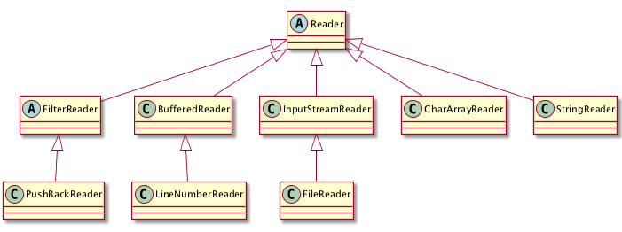
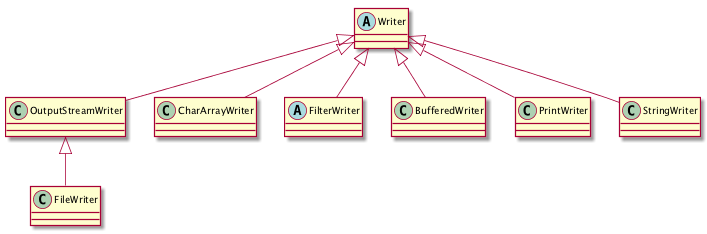

# 5.2 Αρχεία {#Java} 
© Γιάννης Κωστάρας

---

[<-](../5.1-Date-Time/README.md)  | [Δ](../../README.md) | [->](../5.3-NIO/README.md) 

---

## Εισαγωγή
Μέχρι τώρα, όλα τα προγράμματά μας αποθήκευαν τ' αποτελέσματα στην κύρια μνήμη (και ίσως και στη λανθάνουσα μνήμη - cache - του Η/Υ). Η κύρια μνήμη (Κ.Μ.) έχει το καλό ότι είναι πολύ γρήγορη, όμως με το σβήσιμο του Η/Υ τα δεδομένα που είναι αποθηκευμένα σ' αυτήν σβήνονται επίσης. Γι' αυτό το λόγο υπάρχουν οι εξωτερικές μονάδες μνήμης (π.χ. σκληρός δίσκος, δίσκος SSD, CD-ROM, DVD-ROM) κλπ. που διατηρούν τα δεδομένα που αποθηκεύονται σ' αυτές ακόμα κι όταν δεν τροφοδοτούνται με ρεύμα. Οι μονάδες αυτές λέγονται και _μονάδες μόνιμης αποθήκευσης_.

Τα δεδομένα αποθηκεύονται σε μια μονάδα αποθήκευσης υπό τη μορφή _αρχείων (files)_ σε μια _ιεραρχική (δενδρική) δομή_. Υπάρχουν δυο κατηγορίες: _αρχεία κειμένου_ και _δυαδικά αρχεία (binary files)_. Τα αρχεία ομαδοποιούνται σε _φακέλους (folders)_ ή _καταλόγους (directories)_. Ένα σύνολο αρχείων και φακέλων αποτελεί ένα _σύστημα αρχείων (filesystem)_. Συνήθως αποτελείται από κάποιους top-level καταλόγους οι οποίοι αποθηκεύουν μια ιεραρχία από αρχεία και υποκαταλόγους. Ο αρχικός κατάλογος ονομάζεται _ριζικός κατάλογος ή root_. Παραδείγματα συστημάτων αρχείων στα συστήματα Windows είναι ```C:\, D:\``` ενώ σε συστήματα Unix ```/```.

## Java I/O

Οι κλάσεις διαχείρισης ενός συστήματος αρχείων βρίσκονται στη βιβλιοθήκη ```java.io```. Η πιο βασική κλάση είναι η [File](https://docs.oracle.com/en/java/javase/11/docs/api/java.base/java/io/File.html), η οποία βασικά δείχνει τη διαδρομή ή το μονοπάτι (path) ενός αρχείου, οπότε ένα πιο σωστό όνομα για την κλάση αυτή θα ήταν ```Path```. Υπάρχουν σχετικά/αναφορικά (relative) και απόλυτα (absolute) μονοπάτια, μονοπάτια δηλ. που ξεκινούν από τον ριζικό κατάλογο. Π.χ. ```/home/john``` ή ```C:\temp``` είναι απόλυτα μονοπάτια (ξεκινούν με το ριζικό κατάλογο), ενώ ```temp``` ή ```john``` είναι σχετικά μονοπάτια (σχετικά δηλ. με τον κατάλογο που βρισκόμαστε).

* ```.``` ο τρέχων κατάλογος
* ```..``` ο πατρικός κατάλογος

```java
jshell> File file = new File("test.txt");
file ==> test.txt

jshell> File folder = new File("C:/temp");
folder ==> C:

jshell> File fileInFolder = new File(folder, "test.txt");
fileInFolder ==> C:/test.txt

jshell> file.exists()
$1 ==> false

jshell> folder.exists()
$2 ==> false

jshell> folder.mkdir()
$3 ==> true

jshell> fileInFolder.exists()
$4 ==> false

jshell> fileInFolder.createNewFile()
$5 ==> true

jshell> fileInFolder.canRead()
$6 ==> true

jshell> fileInFolder.canWrite()
$7 ==> true

jshell> fileInFolder.canExecute()
$8 ==> false

jshell> fileInFolder.setWritable(false)  // setReadable(), setReadOnly()
$9 ==> true

jshell> fileInFolder.getName()
$10 ==> "test.txt"

jshell> fileInFolder.getParent()
$11 ==> "C:\temp"

jshell> fileInFolder.length()
$12 ==> 0

jshell> import java.time.*;

jshell>LocalDateTime lastmodified =
   ...>     Instant.ofEpochMilli(fileInFolder.lastModified()).atZone(ZoneId.systemDefault()).toLocalDateTime();
lastmodified ==> 2016-06-13T19:14:03

jshell> folder.list()
$13 ==> String[1] { "test.txt" }

jshell> for (File selectedFile : folder.listFiles()) {
   ...> System.out.println((selectedFile.isDirectory() ? "d" : "f") + " " + selectedFile.getAbsolutePath());
   ...> }
f C:\temp\test.txt

jshell> void recurseFolder(File folder) {
   ...> for (File file : folder.listFiles()) {
   ...> System.out.println((file.isDirectory() ? "d" : "f") + " " + file.getAbsolutePath());
   ...> if (file.isDirectory()) {
   ...> recurseFolder(file);    // αν υπάρχουν links θα τα ακολουθήσει
   ...> }
   ...> }
   ...> }
|  created method recurseFolder(File)

jshell> recurseFolder(folder)
f C:\temp\test.txt

jshell> fileInFolder.getCanonicalPath()
$14 ==> C:\temp\test.txt

jshell> fileInFolder.getFreeSpace()
$15 ==> 5795504128

jshell> fileInFolder.getTotalSpace()
$16 ==> 239197650944

jshell> fileInFolder.getUsableSpace()
$17 ==> 5533339648
```

* Η ```getPath()``` επιστρέφει τη διαδρομή που περάσαμε στη μέθοδο κατασκευής της ```File```, π.χ. 

```java
jshell> file.getPath()
$18 ==> "test.txt"
```

* Η ```getAbsolutePath()``` επιστρέφει την απόλυτη διαδρομή (absolute path), δηλ. τη διαδρομή από τον ριζικό φάκελο, όπως είδαμε στα παραδείγματα πιο πάνω.
* Η ```getCanonicalPath()``` επιστρέφει την απόλυτη διαδρομή και επιλύει (resolve) τα ```.``` και ```..``` που πιθανόν να υπάρχουν στη διαδρομή. Επίσης επιλύει τα symbolic links (τις συντομεύσεις) στα Unix/Linux συστήματα και εμφανίζει το γράμμα του οδηγού στα συστήματα Windows. 

```java
jshell> File f = new File("/tmp/../tmp/test.txt");
f ==> /tmp/../tmp/test.txt

jshell> file.getAbsolutePath()
$19 ==> "/tmp/../tmp/test.txt"

jshell> file.getCanonicalPath()
$20 ==> "/private/tmp/test.txt"
```

Όταν κάνετε έλεγχο (επικύρωση - validation) για το κατά πόσο υπάρχει μια διαδρομή, ο ασφαλέστερος τρόπος είναι να χρησιμοποιείτε την ```getCanonicalPath()```.

Μπορείτε ν' αλλάξετε τα δικαιώματα πρόσβασης (permissions) με τις παρακάτω μεθόδους της κλάσης ```File``` (το αρχείο πρέπει να υπάρχει):

* ```setReadable(boolean readable)``` // για ανάγνωση μόνο από τον ιδιοκτήτη του αρχείου/φακέλου δηλ. ```r--------```
* ```setReadable(boolean readable, boolean ownerOnly)``` // αν ```ownerOnly == false``` ```r--r--r--``` αλλοιώς ```r--------```
* ```setReadOnly()``` // ```r--r--r--```
* ```setWritable(boolean writable)``` // για εγγραφή μόνο από τον ιδιοκτήτη του αρχείου/φακέλου δηλ. ```-w-------```
* ```setWritable(boolean writable, boolean ownerOnly)``` // αν ```ownerOnly == false``` ```-w--w--w-``` αλλοιώς ```-w--------```
* ```setExecutable(boolean executable)``` // για εκτέλεση μόνο από τον ιδιοκτήτη του αρχείου/φακέλου δηλ. ```--x------```
* ```setExecutable(boolean executable, boolean ownerOnly)``` // αν ```ownerOnly == false``` ```--x--x--x``` αλλοιώς ```--x------```
Αν εκτελεστούν με επιτυχία τότε επιστρέφουν ```true```.

## Ανάγνωση/εγγραφή αρχείων

Η ανάγνωση/εγγραφή σε αρχεία γίνεται με τη βοήθεια _ροών (streams)_. Μία ροή εισόδου (εξόδου) (input(output) stream) χρησιμοποιείται για να διαβάσουμε(γράψουμε) δεδομένα από(σε) μία πηγή (είτε αυτή είναι αρχείο στο δίσκο, είτε δεδομένα από το δίκτυο, είτε από άλλα προγράμματα κλπ.). Οι ροές υποστηρίζουν πολλά είδη δεδομένων όπως απλά bytes, πρωτογενείς τύπους, τοπικοποιημένους χαρακτήρες και αντικείμενα. Κάποιες ροές απλά μεταφέρουν δεδομένα, άλλες τα διαμορφώνουν και τα μετασχηματίζουν με διάφορους τρόπους (π.χ. σε δυαδικά).

Ένα πρόγραμμα χρησιμοποιεί μία _ροή εισόδου (input stream)_ για να διαβάσει δεδομένα από μία πηγή.


**Εικόνα 5.2.1** _Ιεραρχία κλάσεων ροών εισόδου_ 

Ένα πρόγραμμα χρησιμοποιεί μία _ροή εξόδου (output stream)_ για να γράψει δεδομένα σε μία πηγή.


**Εικόνα 5.2.2** _Ιεραρχία κλάσεων ροών εξόδου_ 

Οι βασικές διεπαφές ```InputStream``` και ```OutputStream``` μεταφέρουν δεδομένα σε μορφή bytes. Για ανάγνωση από ή εγγραφή σε αρχεία χρησιμοποιήστε τις ```FileInputStream, FileOutputStream``` (σε συνδυασμό με ```BufferedInputStream, BufferedOutputStream``` αντίστοιχα για καλύτερη απόδοση). Για ανάγνωση ή εγγραφή αρχέγονων (raw) τύπων δεδομένων (```byte, short, int, long, float, double```) χρησιμοποιήστε ```DataInputStream, DataOutputStream```. Για ανάγνωση/εγγραφή αντικειμένων, χρησιμοποιήστε ```ObjectInputStream, ObjectOutputStream``` (η κλάση θα πρέπει να υλοποιεί τη διεπαφή ```Serializable```). Τέλος, για ανάγνωση/εγγραφή χαρακτήρων (αλφαριθμητικών), υπάρχουν οι διεπαφές ```Reader, Writer``` αντίστοιχα.



**Εικόνα 5.2.3** _Ιεραρχία κλάσεων ανάγνωσης χαρακτήρων_ 



**Εικόνα 5.2.4** _Ιεραρχία κλάσεων εγγραφής χαρακτήρων_ 

Η Java υποστηρίζει 3 βασικές ροές: _Standard Input_(```System.in```) τύπου ```java.io.InputStream```, _Standard Output_ (```System.out```) και _Standard Error_ (System.err) τύπου ```java.io.PrintStream```.

Στο μάθημα των εξαιρέσεων της προηγούμενης εβδομάδας, είδαμε παραδείγματα χρήσης των παραπάνω. Θα πρέπει πάντα να κλείνουμε μια ροή ή να χρησιμοποιούμε την ```try-with-resources``` που κλείνει τη ροή αυτόματα.

### Εγγραφή αρχείων
Στα ακόλουθα υποκεφάλαια θα δούμε πώς μπορούμε να αποθηκεύσουμε bytes, χαρακτήρες, αρχέγονους (raw) τύπους και αντικείμενα σε αρχεία. 
#### Εγγραφή bytes
Η διεπαφή ```OutputStream``` διαθέτει τη μέθοδο ```write(int b)``` για εγγραφή ενός byte σε έναν πόρο (π.χ. αρχείο). Δέχεται σαν όρισμα έναν _ακέραιο_ (κι όχι ένα byte) μεταξύ 0 και 255 (0xFF) (γι' αυτό και θα πρέπει να γίνεται έλεγχος ώστε το byte προς εγγραφή να βρίσκεται σ' αυτό το διάστημα). Μόνο τα 8 χαμηλότερα bits γράφονται στην έξοδο, τα υψηλότερα 24 bits αγνοούνται (ένας ακέραιος έχει 32 bits):

```java
jshell> String filepath ="/tmp/test.txt";
filepath ==> "/tmp/test.txt"

jshell> int value = 300;
i ==> 300

jshell> try (OutputStream out = new FileOutputStream(filepath)) {
   ...> if (value < 0 || value > 255) {
   ...> throw new ArithmeticException("Value is out of range");
   ...> }
   ...> out.write(value);
   ...> out.flush();
   ...> }
```
Eναλλακτικά αν θέλουμε να γράψουμε τιμές μεγαλύτερες του 255:

```java
jshell> try (DataOutputStream out = new DataOutputStream(new FileOutputStream(filepath))) {
   ...> out.writeInt(value);
   ...> out.flush();
   ...> }
```

Χρησιμοποιούμε την ```try-with-resources``` η οποία κλείνει αυτόματα τους ανοικτούς πόρους (στην περίπτωσή μας το αρχείο που γράφουμε) κι έτσι δε χρειάζεται να κλείσουμε το μπλοκ με τη ```finally```: 

```java
finally {
  try {	
  	if (bos != null)
	   bos.close();
	} catch (IOException x) {
		// handle error
	}
}
```

Η ```BufferedOutputStream``` είναι πιο αποδοτική από την ```FileOutputStream``` καθώς διατηρεί μια εσωτερική μνήμη (buffer):

```java
jshell> String filepath ="/tmp/test.txt";
filepath ==> "/tmp/test.txt"

jshell> String s = "Σε γνωρίζω από την κόψη\r\n του σπαθιού την τρομερή";
s ==> "Σε γνωρίζω από την κόψη\r\n του σπαθιού την τρομερή"

jshell> try (BufferedOutputStream bos = new BufferedOutputStream(new FileOutputStream(filepath))) {
   ...> byte[] buffer = s.getBytes("UTF-8");
   ...> bos.write(buffer, 0, buffer.length);
   ...> } catch (FileNotFoundException e) {
   ...> e.printStackTrace();
   ...> } catch (IOException e) {
   ...> e.printStackTrace();
   ...> }

jshell> List<String> lines = Arrays.asList(
   ...> new String[]{"Σε γνωρίζω από την κόψη", "του σπαθιού την τρομερή"});
lines ==> [Σε γνωρίζω από την κόψη, του σπαθιού την τρομερή]

jshell> try (BufferedOutputStream outputStream = new BufferedOutputStream(new FileOutputStream(file))) {
   ...> for (String line : lines) {
   ...> outputStream.write((line + System.lineSeparator()).getBytes(StandardCharsets.UTF_8));
   ...> }
   ...> }
```

#### Εγγραφή αρχέγονων δεδομένων
Είδαμε μια χρήση της ```DataOutputStream``` προηγουμένως. Πέραν της μεθόδου ```writeInt()``` υπάρχουν και οι ```writeByte(), writeShort(), writeLong(), writeFloat()``` και ```writeDouble()```.

#### Εγγραφή αντικειμένων
Τα αντικείμενα που πρόκειται να αποθηκευθούν σε κάποιο αρχείο θα πρέπει να υλοποιούν τη διεπαφή ```Serializable```. Οι τιμές των στατικών (static) γνωρισμάτων δεν αποθηκεύονται. Τέλος, γνωρίσματα που δεν θέλουμε ν' αποθηκευθούν τα δηλώνουμε ως ```transient```.

Ας δούμε την ακόλουθη ιεραρχία κλάσεων:

```java
public abstract class Track implements Serializable {

    protected TrackType trackType;
    protected int speed;
    protected double x, y;

    public enum TrackType {
        AIR, LAND, SPACE;
    }

    public Track(int speed, double x, double y) {
        this.speed = speed;
        this.x = x;
        this.y = y;
    }
// getters και setters
}

public class AirTrack extends Track {

    protected int height;

    public AirTrack(int height, int speed, double x, double y) {
        super(speed, x, y);
        this.trackType = TrackType.AIR;
        this.height = height;
    }

    public int getHeight() {
        return height;
    }

    public void setHeight(int height) {
        this.height = height;
    }
}

public class LandTrack extends Track {
    
    public LandTrack(int speed, double x, double y) {
        super(speed, x, y);
        this.trackType = TrackType.LAND;
    }
    
}
```
Εφόσον η υπερκλάση ```Track``` υλοποιεί τη διεπαφή ```Serializable```, οι υποκλάσεις δε χρειάζεται να την υλοποιήσουν κι αυτές.

```java
public class Main {
	
   public static void main(String[] args) {
        Track airTrack = new AirTrack(5000, 10000, 20.0, -20.0);    
        Track landTrack = new LandTrack(20, 10.0, -25.0);            
        List<Track> tracks = new ArrayList<>();
        tracks.add(airTrack);
        tracks.add(landTrack);

        try (ObjectOutputStream oos =
                new ObjectOutputStream(new FileOutputStream("./tracks.dump"))) {
            oos.writeObject(tracks);
        } catch(FileNotFoundException fnfe) {
            System.err.println("Cannot create a file with the given file name.");
        } catch(IOException ioe) {
            System.err.println("An I/O error occurred while processing the file.");
        }
}
```
Σημειώστε ότι ένα αντικείμενο σειριοποιείται (serialized) μια φορά μόνο. Αν αλλάξετε κάποια γνωρίσματά του και δοκιμάσετε να το ξανα-σειριοποιήσετε τότε η ΕΜ της Java δεν το ξανα-σειριοποιεί. 

**Σημείωση** _Ο όρος Σειριοποίηση (Serialization) σημαίνει τη μετατροπή δεδομένων σε μορφή ροής από bytes (byte-stream) για αποθήκευση σε κάποιον πόρο ή αποστολή στο δίκτυο. Χρησιμοποιείται και η ορολογία Παράταξη bytes (Marshalling). Η αντίστροφή διαδικασία λέγεται Αποσειριοποίηση (Deserialization) ή Αντιπαράταξη bytes(Unmarshalling)._

#### Εγγραφή χαρακτήρων
Η διεπαφή ```Writer``` διαθέτει τη μέθοδο ```write(int c)``` για εγγραφή ενός χαρακτήρα σε έναν πόρο (π.χ. ένα αρχείο κειμένου). Δέχεται σαν όρισμα έναν _ακέραιο_ (όχι χαρακτήρα) αλλά μόνο τα 16 χαμηλότερα bits γράφονται στην έξοδο, τα υψηλότερα 16 bits αγνοούνται (ένας ακέραιος έχει 32 bits). Όπως και στην περίπτωση της ```OutputStream.write()``` θα πρέπει να γίνεται έλεγχος ώστε ο ακέραιος προς εγγραφή να βρίσκεται σ' αυτό το διάστημα. Για ευκολία διαθέτει και την ```Writer.write(String s)```.

Αν θέλετε να μετατρέψετε συστοιχίες από bytes σε χαρακτήρες (με συγκεκριμένη κωδικοποίηση), τότε υπάρχει η [OutputStreamWriter](https://docs.oracle.com/en/java/javase/11/docs/api/java.base/java/io/OutputStreamWriter.html).

```java
jshell> Writer writer = new BufferedWriter(new OutputStreamWriter(new FileOutputStream("C:/temp/test.txt"), StandardCharsets.UTF_8));
writer ==> java.io.BufferedWriter@5f71c76a

jshell> writer.write(s);

jshell> writer.flush(); // write data to file

jshell> writer.close(); // close() calls flush()
```

Καθώς η ```BufferedWriter``` δεν έχει κάτι αντίστοιχο της ```BufferedReader.readLine()```, χρησιμοποιήστε την ```PrintStream``` ή την ```PrintWriter``` οι οποίες παρέχουν μία οικογένεια από μεθόδους για εκτύπωση σε ροές (π.χ. ```print(), println(), format()```):

```java
jshell> import java.time.*

jshell> String destination = "C:/temp/bla.txt";
destination ==> "C:/temp/bla.txt"

jshell> String name = "Ζηνοβία";
name ==> "Ζηνοβία"

jshell> int age = 12;
age ==> 12

jshell> LocalDate registration = LocalDate.now();
registration ==> 2019-12-24

jshell> try(PrintStream ps = new PrintStream(destination)) {
   ...> ps.println("Όνομα: " + name);
   ...> ps.println("Ηλικία: " + age);
   ...> ps.printf("Registration: %1$td/%1$tm/%1$tY", registration);
   ...> ps.flush();
   ...> } catch (FileNotFoundException e) {
   ...> e.printStackTrace();
   ...> }
```

Το αποτέλεσμα είναι ένα αρχείο κειμένου με περιεχόμενα:

```
Όνομα: Ζηνοβία
Ηλικία: 12
Registration: 24/12/2019
```

### Ανάγνωση αρχείων
Στα ακόλουθα υποκεφάλαια θα δούμε πώς μπορούμε να διαβάσουμε bytes, χαρακτήρες, αρχέγονους (raw) τύπους και αντικείμενα από αρχεία. 
#### Ανάγνωση bytes
Η διεπαφή ```InputStream``` διαθέτει τη μέθοδο ```read()``` για ανάγνωση ενός byte από έναν πόρο. Επιστρέφει έναν ακέραιο μεταξύ 0 και 255 (0xFF) ή -1 (0xFFFFFFF) αν διάβασε το τέλος του πόρου. Ένα σύνηθες λάθος πολλών προγραμματιστών (που έχουν εκμετταλευτεί πολλές φορές οι hackers) είναι η πρόωρη μετατροπή του byte που διαβάζεται σε ```byte```:

```java
jshell> String filepath ="/tmp/test.txt";
filepath ==> "/tmp/test.txt

jshell> try (InputStream in = new FileInputStream(filepath)) {
   ...> byte data;
   ...> while ((data = (byte) in.read()) != -1) {
   ...> // ...
   ...> }
```
Στον παραπάνω έλεγχο γίνεται πρώτα η μετατροπή του χαρακτήρα που διαβάζεται από την ροή σε ```byte``` και μετά ελέγχεται αν αυτός είναι ο -1. Αν το -1 υπάρχει μέσα στο αρχείο που διαβάζεται, μετατρέποντάς το πρώτα σε```byte``` (δηλ. στο ```0xFF```), θα 'χει ως αποτέλεσμα ο βρόγχος να τερματιστεί πρόωρα (το ```0xFF``` θα μετατραπεί πάλι στον ακέραιο ```0xFFFFFFF``` για να συγκριθεί με το -1). 

Ο σωστός τρόπος είναι:

```java
jshell> try (InputStream in = new FileInputStream(filepath)) {
   ...> int dataIn;
   ...> byte data;
   ...> while ((dataIn = in.read()) != -1) {
   ...> data = (byte)dataIn;
   ...> // ...
   ...> }
```
Παρατηρήστε ότι ο παραπάνω κώδικας χρησιμοποιεί την ```try-with-resources``` η οποία κλείνει αυτόματα τους ανοικτούς πόρους (στην περίπτωσή μας το αρχείο που διαβάζουμε) κι έτσι δε χρειάζεται να κλείσουμε το μπλοκ με τη ```finally```: 

```java
finally {
  try {
    if (bis != null)
	   bis.close();
  } catch (IOException x) {
  // handle error
  }	   
}
```
Υπενθυμίζουμε εδώ ότι για να μπορέσουμε να χρησιμοποιήσουμε την ```try-with-resources```, η κλάση θα πρέπει να υλοποιεί το interface ```Autocloseable```.

Στο παρακάτω παράδειγμα διαβάζουμε έναν ακέραιο από τη μονάδα εισόδου (συνήθως το πληκτρολόγιο):

```java
jshell> int num = 0;
num ==> 0

jshell> try {
   ...> num = System.in.read();
   ...> } catch(IOException ioe) {
   ...> System.err.println("Cannot read input " + ioe);
   ...> }
1

jshell> System.out.println(num);
49
```

Το αποτέλεσμα δεν είναι όμως το αναμενόμενο. Ο τύπος επιστροφής της μεθόδου ```System.in.read()``` είναι ```int``` αλλά επιστρέφει μια τιμή τύπου ```byte``` (στην περιοχή 0 έως 255). Συνεπώς, για την είσοδο ```1```, το πρόγραμμα εκτυπώνει την τιμή ASCII 49. Η μέθοδος ανάγνωσης "μπλοκάρει" μέχρι να λάβει την είσοδο του χρήστη. Αν υπάρξει εξαίρεση κατά την ανάγνωση, η μέθοδος εγείρει μια ```IOException```.

Αυτό το πρόγραμμα απεικονίζει τη χρήση και των τριών ρευμάτων: η ```System.in``` χρησιμοποιείται εδώ για να λάβει το πρόγραμμα την είσοδο από την κονσόλα, η ```System.out``` χρησιμοποιείται για την εκτύπωση της τιμής ακέραιας ανάγνωσης στη μονάδα εξόδου (συνήθως οθόνη) και η ```System.err``` χρησιμοποιείται στην περίπτωση που υπάρξει κάποια εξαίρεση και εμφανίζει ένα μήνυμα στη μονάδα σφάλματος (συνήθως οθόνη).

Η ```BufferedInputStream``` είναι πιο αποδοτική από την ```FileInputStream``` καθώς διατηρεί μια εσωτερική μνήμη (buffer) οπότε συνίσταται αν θέλετε να διαβάσετε μεγάλα αρχεία.

Ο παρακάτω κώδικας που διαβάζει ένα αρχείο στο σύνολό του χρησιμοποιεί μια υπερφορτωμένη μέθοδο της ```read()```, την ```int read(byte[] buffer, int offset, int length)``` η οποία επιστρέφει τον αριθμό των bytes που διαβάστηκαν:

```java
jshell> String filepath ="/tmp/test.txt";
filepath ==> "/tmp/test.txt"

jshell> try (BufferedInputStream bis = new BufferedInputStream(new FileInputStream(filepath))) {
   ...> int length = (int) new File(filepath).length();
   ...> byte[] buffer = new byte[length];
   ...> if (bis.read(buffer, 0, length) == length) {	// read(byte[] buffer, int offset, int length)
   ...> System.out.println(new String(buffer, "UTF-8"));
   ...> }
   ...> } catch (FileNotFoundException e) {
   ...> e.printStackTrace();
   ...> } catch (IOException e) {
   ...> e.printStackTrace();
   ...> }
```

Άλλος τρόπος για να διαβάσουμε ένα αρχείο. Αν δε διαβαστεί ολόκληρο εγείρεται μια εξαίρεση.

```java
jshell> try (DataInputStream dis = new DataInputStream(new FileInputStream(filepath))) {
   ...> int length = (int) new File(filepath).length();
   ...> byte[] buffer = new byte[length];
   ...> dis.readFully(buffer);
   ...> System.out.println(new String(buffer, "UTF-8"));
   ...> } catch (FileNotFoundException e) {
   ...> e.printStackTrace();
   ...> } catch (IOException e) {
   ...> e.printStackTrace();
   ...> }
```

#### Ανάγνωση αρχέγονων δεδομένων
Είδαμε μια χρήση της ```DataInputStream``` προηγουμένως. Πέραν της μεθόδου ```readFully``` που διαβάζει μια συστοιχία από bytes υπάρχουν και οι ```readByte(), readShort(), readInt(), readLong(), readFloat()``` και ```readDouble()```.

#### Ανάγνωση αντικειμένων
```java
try (ObjectInputStream ois =
         new ObjectInputStream(new FileInputStream("./tracks.dump"))) {
    Object obj = ois.readObject();
    if (obj != null && obj instanceof List) {
        List<Track> tracksRead = (List<Track>) obj;
        for (Track track : tracksRead) {
            System.out.println(track.toString());
        }
    }
} catch(FileNotFoundException fnfe) {
    System.err.println("Cannot read a file with the given file name.");
} catch(IOException ioe) {
    System.err.println("An I/O error occurred while processing the file.");
} catch(ClassNotFoundException cnfe) {
    System.err.println("Cannot recognize the object's class. Is the file corrupted?");
}
```
Το αποτέλεσμα θα πρέπει να είναι παρόμοιο του παρακάτω:
```
Track{trackType=AIR, speed=10000, x=20.0, y=-20.0 height=5000} 
Track{trackType=LAND, speed=20, x=10.0, y=-25.0} 
```
αν έχετε υλοποιήσει κατάλληλα την μέθοδο ```toString()``` των κλάσεων ```Track, AirTrack, LandTrack```.

#### Ανάγνωση χαρακτήρων
Η διεπαφή ```Reader``` διαθέτει τη μέθοδο ```read()``` για να διαβάσει έναν χαρακτήρα από κάποιον πόρο και επιστρέφει την τιμή του ως ακέραιο μεταξύ 0 και 65,535 ή −1 αν διάβασε το τέλος του αρχείου (επειδή πρέπει να διαβάσει το -1 που δηλώνει το τέλος του αρχείου, και το -1 είναι εκτός του εύρους χαρακτήρων 0-65536 επιστρέφει ```int``` αντί για ```char```). Ένα σύνηθες λάθος (που έχει εκμετταλευτεί πολλές φορές από hackers) είναι η πρόωρη μετατροπή του χαρακτήρα που διαβάζεται σε ```char```:

```java
jshell> String filepath ="/tmp/test.txt";
filepath ==> "/tmp/test.txt

jshell> try (Reader in = new FileReader(filepath)) {
   ...> char data;
   ...> while ((data = (char) in.read()) != -1) {
   ...> // ...
   ...> }
```
Στον παραπάνω έλεγχο γίνεται πρώτα η μετατροπή ανάγνωσης του χαρακτήρα σε ```char``` και μετά ελέγχεται αν αυτός είναι ο -1. Στην περίπτωση της πρόωρης μετατροπής σε ```char```, ο -1 μετατρέπεται στον χαρακτήρα ```Character.MAX_VALUE``` ή ```0xFFFF``` και ποτέ πίσω σε ```int``` με αποτέλεσμα ο βρόγχος να μην τερματίζεται ποτέ.

Ο σωστός τρόπος είναι:

```java
jshell> try (Reader in = new FileReader(filepath)) {
   ...> int dataIn;
   ...> char data;
   ...> while ((dataIn = in.read()) != -1) {
   ...> data = (char)dataIn;
   ...> // ...
   ...> }
```

Αν θέλετε να μετατρέψετε συστοιχίες από bytes σε χαρακτήρες (με συγκεκριμένη κωδικοποίηση), τότε υπάρχει η [InputStreamReader](https://docs.oracle.com/en/java/javase/11/docs/api/java.base/java/io/InputStreamReader.html) για καλύτερη απόδοση.

```java
jshell> import java.nio.charset.*

jshell> BufferedReader reader = new BufferedReader(new InputStreamReader(new FileInputStream("C:/temp/test.txt"), StandardCharsets.UTF_8));
reader ==> java.io.BufferedReader@51b279c9

jshell> String line;
line ==> null

jshell> while((line = reader.readLine()) != null) {
   ...> System.out.println(line);
   ...> }
Σε γνωρίζω από την κόψη
 του σπαθιού την τρομερή
```

Για να διορθώσουμε το πρόβλημα με την ```System.in``` που είδαμε πιο πάνω:

```java
BufferedReader br = new BufferedReader(new InputStreamReader(System.in));
String line = br.readLine();
// ή
Scanner scanner = new Scanner(System.in);
String line = scanner.next();
```

### Αντιγραφή αρχείων

#### Ανά byte
```java
String srcFile = ...;
String destFile = ...;
final int BUFFER_SIZE = 4096;
try (BufferedInputStream bis = new BufferedInputStream(new FileInputStream(srcFile));
     BufferedOutputStream bos = new BufferedOutputStream(new FileOutputStream(dstFile));) {
    byte[] buffer = new byte[BUFFER_SIZE];
    int bytesRead = 0;
    while ((bytesRead = bis.read(buffer)) >= 0)
        bos.write(buffer, 0, (int) bytesRead);
} catch (FileNotFoundException e) {
    e.printStackTrace();
} catch (IOException e) {
    e.printStackTrace();
}
```

#### Ανά χαρακτήρα
```java
String srcFile = ...;
String destFile = ...;
try (BufferedReader inFile = new BufferedReader(new FileReader(srcFile));
	 BufferedWriter outFile = new BufferedWriter(new FileWriter(dstFile))) {
	int ch = 0;
	while( (ch = inFile.read()) != -1) {
		outFile.write((char)ch);
	}
} catch (FileNotFoundException e) {
    e.printStackTrace();
} catch (IOException e) {
    e.printStackTrace();
}
```

### Μετονομασία αρχείου
```java
jshell> File srcFile = new File("C:\temp\test.txt");
srcFile ==> C:\temp\test.txt

jshell> File destFile = new File(C:\temp\test.bak");
destFile ==> C:\temp\test.bak

jshell> srcFile.exists();
$1 ==> false

jshell> srcFile.createNewFile();
$2 ==> true

jshell> srcFile.renameTo(destFile);
$3 ==> false
```

Αν η μετονομασία αποτύχει, δεν εγείρεται κάποια εξαίρεση. Ο μόνος τρόπος να γνωρίζουμε αν κάτι πήγε στραβά είναι να ελέγξουμε την τιμή επιστροφής της εντολής, αλλά και πάλι δεν είναι ξεκάθαρο τι μπορεί να έχει συμβεί (π.χ. το αρχείο στο οποίο προσπαθούμε να μετονομάσουμε το αρχείο μας υπάρχει ήδη ή προσπαθούμε να μετονομάσουμε ένα αρχείο που δεν υπάρχει;).

Η μετονομασία στο παραπάνω παράδειγμα αποτυγχάνει επειδή δεν υπάρχει το πηγαίο αρχείο ```srcFile```.

```java
jshell> srcFile.createNewFile();
$4 ==> true

jshell> srcFile.exists();
$5 ==> true

jshell> destFile.exists();
$6 ==> false

jshell> srcFile.renameTo(destFile);
$7 ==> true

jshell> srcFile.delete()
$8 ==> false
```
Προσέξτε ότι η ```renameTo(File f)``` δέχεται ως παράμετρο ένα αντικείμενο τύπου ```File``` αντί για ```String```. Έτσι, το ```srcFile``` δεν υπάρχει πια, κι αν θέλετε να διαγράψετε το αρχείο θα πρέπει να δώσετε:

```java
jshell> destFile.delete()
$9 ==> true
``` 
Ως άσκηση δοκιμάστε διάφορες περιπτώσεις και δείτε τι συμβαίνει σε κάθε περίπτωση:

* όταν το ```destFile``` υπάρχει ήδη
* όταν τα αρχεία ```srcFile``` και ```destFile``` βρίσκονται σε διαφορετικά συστήματα αρχείων (filesystems) ή drives (στα Windows)
* δοκιμάστε να τρέξετε το πρόγραμμά σας σε διάφορα λειτουργικά συστήματα (Windows, MacOS, Linux/Unix). Βλέπετε διαφορετική συμπεριφορά;

### Διαγραφή αρχείων
Όπως είδαμε προηγουμένως:
```java
jshell> file.delete()
$1 ==> false
```

Αν η διαγραφή αποτύχει, δεν εγείρεται κάποια εξαίρεση. Ο μόνος τρόπος να γνωρίζουμε αν κάτι πήγε στραβά είναι να ελέγξουμε την τιμή επιστροφής της εντολής:

```java
jshell> if (!file.delete()) {
   ...> System.out.println("Deletion failed");
   ...> } 
Deletion failed
```

## Δυαδικά αρχεία τυχαίας προσπέλασης
Πέρα από τα αρχεία κειμένου υπάρχουν και τα δυαδικά αρχεία ή αλλοιώς _Αρχεία Τυχαίας Προσπέλασης (Random Access Files)_.

```java
jshell> File dataFile = new File("C:/temp/data.bin")
dataFile ==> C:\temp\data.bin

jshell> RandomAccessFile data = new RandomAccessFile(dataFile, "rw")
data ==> java.io.RandomAccessFile@1e9e725a

jshell> data.writeUTF("Κατερίνα")

jshell> data.writeInt(35)

jshell> data.close()
```
Δημιουργήσαμε ένα νέο δυαδικό αρχείο στο οποίο αποθηκεύσαμε ένα αλφαριθμητικό και έναν ακέραιο αριθμό.
```java
jshell> RandomAccessFile data = new RandomAccessFile(dataFile, "r")
data ==> java.io.RandomAccessFile@797badd3

jshell> data.readUTF()
$7 ==> "Κατερίνα"

jshell> data.readInt()
$8 ==> 35

jshell> data.length()
$9 ==> 22
```
Το αλφαριθμητικό "Κατερίνα" χρησιμοποιεί 2x8 = 16 bytes (κάθε χαρακτήρας σε μορφή Unicode χρησιμοποιεί 2 bytes) και ο ακέραιος άλλα 4 bytes οπότε σύνολο 20 bytes. Από που προέκυψαν τα 22 bytes; H ```writeUTF()``` χρησιμοποιεί άλλα 2 bytes στην αρχή που περιέχουν το μήκος των bytes του αλφαριθμητικού που θα γραφεί. Επομένως, αν θέλουμε να διαβάσουμε την ηλικία της Κατερίνας, θα πρέπει να μετακινηθούμε 2+16 = 18 bytes: 

```java
jshell> RandomAccessFile data = new RandomAccessFile(dataFile, "r")
data ==> java.io.RandomAccessFile@709ba3fb

jshell> data.seek(18)

jshell> data.readInt()
$10 ==> 35
```

**Σημείωση** _Αν το αλφαριθμητικό αποτελείται μόνο από λατινικούς χαρακτήρες (ASCII) τότε κάθε χαρακτήρας αποθηκεύεται σε ένα μόνο byte (αντί για 2 στην περίπτωση UTF8). Π.χ. αν αντί για "Κατερίνα" πληκτρολογούσατε "Katerina" το ```data.length()``` θα επέστρεφε 14 bytes αντί για 22, 8+2 για το αλφαριθμητικό + 4 για την ηλικία._

## Περίληψη
Σ' αυτό το μάθημα μάθαμε πώς να διαχειριζόμαστε το σύστημα αρχείων του Η/Υ μας, να προσπελάζουμε αρχεία και φακέλους, να δημιουργούμε αρχεία και φακέλους και να διαβάζουμε/γράφουμε σε αρχεία, τόσο κειμένου όσο και δυαδικά. Το ΑΡΙ της Java για διαχείριση αρχείων δεν είναι και το καλύτερο καθώς εξελίχθηκε μαζί με τη γλώσσα. Υπάρχουν πολλές ασυνέπειες, πολλές από τις οποίες προσπαθεί να διορθώσει το New I/O (ΝΙΟ) όπως θα δούμε στο επόμενο μάθημα. 

Κλάσεις για τις οποίες δε μιλήσαμε:

```java
interface FileNameFilter {
	boolean accept(File dir, String filename); // Tests if a specified file should be included in a file list.
}

interface FileFilter {
	boolean accept(File pathname); // Tests whether or not the specified abstract pathname should be included in a pathname list.
}

class FileDescriptor { // ένα χειριστήριο (handle) προς μια δομή αρχείου του Λ.Σ.
	void sync(); // Force all system buffers to synchronize with the underlying device.
	boolean	valid(); // Tests if this file descriptor object is valid.
} 

/*
Actions:
* read 
* write
* execute (επιτρέπει την κλήση της Runtime.exec() και αντιστοιχεί στην SecurityManager.checkExec())
* delete (επιστρέπει την κλήσει της File.delete και αντιστοιχεί στην SecurityManager.checkDelete())
* readlink (επιστρέπει την ανάγνωση του προορισμού ενός symbolic link καλώντας τη μέθοδο readSymbolicLink())
*/
class FilePermission {
	FilePermission(String path, String actions); // actions, βλ. παραπάνω
}
```

Στο επόμενο μάθημα θα δούμε τις δυνατότητες του New I/O 2 για τη διαχείριση συστημάτων αρχείων. 

## Ασκήσεις
1) Να δημιουργήσετε ένα πρόγραμμα σε Java το οποίο θα διαβάζει το όνομα ενός αρχείου ή φακέλου που δίνεται από τον χρήστη και θα επιστρέφει το μέγεθός του σε KiloBytes.

```java
System.out.print("Enter a file or directory: ");
Scanner input = new Scanner(System.in);
String directory = input.nextLine();
System.out.println(getSize(new File(directory)) + " KB");

long getSize(File file) {
// υλοποιήστε αυτή τη μέθοδο
}
``` 

2) Κάθε τύπος αρχείου διακρίνεται από κάποιον 'μαγικό αριθμό' που το χαρακτηρίζει. Ο 'μαγικός αριθμός' που χαρακτηρίζει ένα αρχείο ```.class``` αποθηκεύεται στα τέσσερα πρώτα bytes. Χρησιμοποιώντας αυτά που μάθατε σ' αυτό το μάθημα βρείτε ποιος είναι αυτός ο 'μαγικός αριθμός' διαβάζοντας τα 4 πρώτα bytes ενός οποιουδήποτε αρχείου ```.class```.

3) Στο παράδειγμα με την ιεραρχία κλάσεων ```Track, AirTrack, LandTrack```, αντί να αποθηκεύετε/διαβάζετε μια λίστα από Tracks, δημιουργήστε δυο μεθόδους στην κλάση ```Track``` που θα μετατρέπουν το κάθε ίχνος σε/από μια συστοιχία από bytes για αποθήκευση σε/ανάγνωση από ένα δυαδικό αρχείο και τροποιήστε την main() ώστε να χρησιμοποιεί αυτές τις μεθόδους.

```java
public byte[] toByteArray() { ... }

public Track toObject(byte[] bytes) { ... }
```

## Πηγές
1. ["The Java Tutorial"](https://docs.oracle.com/javase/tutorial/)
1. Bloch J. (2018), _Effective Java_, 3rd Edition, Addison-Wesley.
1. Daconta M.C. et al. (2003), _More Java Pitfalls_, Wiley.
1. Darwin I. F. (2014), _Java Cookbook_, 3rd Ed., O’ Reilly.
1. Deitel P., Deitel H. (2018), _Java How to Program_, 11th Ed., Safari.
1. Downey A. B., Mayfield C. (2016), _Think Java_, O' Reilly. 
1. Eckel B. (2006), _Thinking in Java_, 4th Ed., Prentice-Hall.
1. Horstmann C. S. (2016), _Core Java, Volume 1 Fundamentals_, 10th Ed., Prentice-Hall.
1. Horstmann C. S. (2018), _Core Java SE 9 for the impatient_, 2nd Ed., Addison-Wesley. 
1. Long F. et al. (2012), _The CERT® Oracle® Secure Coding Standard for Java™_, Addison-Wesley.
1. Long F. et al. (2014), _Java Coding Guidelines_, Pearson.
1. Sharan K. (2017), _Java 9 Revealed: For Early Adoption and Migration_, Apress.
1. Sierra K. & Bates B. (2005), _Head First Java_, 2nd Ed. for Java 5.0, O’Reilly.
1. [Java Notes for Professionals](https://books.goalkicker.com/JavaBook/JavaNotesForProfessionals.pdf)

---

[<-](../5.1-Date-Time/README.md)  | [Δ](../../README.md) | [->](../5.3-NIO/README.md) 

---