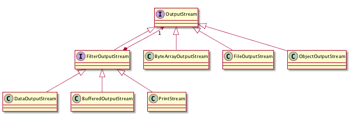

# 5.2 Αρχεία {#Java} 
© Γιάννης Κωστάρας

---

[<-](../5.1-Date-Time/README.md)  | [Δ](../../README.md) | [->](../5.3-NIO/README.md) 

---

## Εισαγωγή
Μέχρι τώρα, όλα τα προγράμματά μας αποθήκευαν τ' αποτελέσματα στην κύρια μνήμη (και ίσως και στη λανθάνουσα μνήμη - cache - του Η/Υ). Η κύρια μνήμη (Κ.Μ.) έχει το καλό ότι είναι πολύ γρήγορη, όμως με το σβήσιμο του Η/Υ τα δεδομένα που είναι αποθηκευμένα σ' αυτήν σβήνονται επίσης. Γι' αυτό το λόγο υπάρχουν οι εξωτερικές μονάδες μνήμης (π.χ. σκληρός δίσκος, δίσκος SSD, CD-ROM, DVD-ROM) κλπ. που διατηρούν τα δεδομένα που αποθηκεύονται σ' αυτές ακόμα κι όταν δεν τροφοδοτούνται με ρεύμα. Οι μονάδες αυτές λέγονται και _μονάδες μόνιμης αποθήκευσης_.

Τα δεδομένα αποθηκεύονται σε μια μονάδα αποθήκευσης υπό τη μορφή _αρχείων (files)_ σε μια _ιεραρχική (δενδρική) δομή_. Υπάρχουν δυο κατηγορίες: _αρχεία κειμένου_ και _δυαδικά αρχεία (binary files)_. Τα αρχεία ομαδοποιούνται σε _φακέλους (folders)_ ή _καταλόγους (directories)_. Ένα σύνολο αρχείων και φακέλων αποτελεί ένα _σύστημα αρχείων (filesystem)_. Συνήθως αποτελείται από κάποιους top-level καταλόγους οι οποίοι αποθηκεύουν μια ιεραρχία από αρχεία και υποκαταλόγους. Ο αρχικός κατάλογος ονομάζεται _ριζικός κατάλογος ή root_. Παραδείγματα συστημάτων αρχείων στα συστήματα Windows είναι ```C:\, D:\``` ενώ σε συστήματα Unix ```/```.

## Java I/O

Οι κλάσεις διαχείρισης ενός συστήματος αρχείων βρίσκονται στη βιβλιοθήκη ```java.io```. Η πιο βασική κλάση είναι η [File](https://docs.oracle.com/en/java/javase/11/docs/api/java.base/java/io/File.html), η οποία βασικά δείχνει τη διαδρομή ή το μονοπάτι (path) ενός αρχείου, οπότε ένα πιο σωστό όνομα για την κλάση αυτή θα ήταν ```Path```. Υπάρχουν σχετικά/αναφορικά (relative) και απόλυτα (absolute) μονοπάτια, μονοπάτια δηλ. που ξεκινούν από τον ριζικό κατάλογο. Π.χ. ```/home/users/john``` ή ```C:\temp``` είναι απόλυτα μονοπάτια (ξεκινούν με το ριζικό κατάλογο), ενώ ```temp``` ή ```users/john``` είναι σχετικά μονοπάτια.

```java
jshell> File file = new File("test.txt");
file ==> test.txt

jshell> File folder = new File("C:/temp");
folder ==> C:

jshell> File fileInFolder = new File(folder, "test.txt");
fileInFolder ==> C:/test.txt

jshell> file.exists()
$1 ==> false

jshell> folder.exists()
$2 ==> false

jshell> folder.mkdir()
$3 ==> true

jshell> fileInFolder.exists()
$4 ==> false

jshell> fileInFolder.createNewFile()
$5 ==> true

jshell> fileInFolder.canRead()
$6 ==> true

jshell> fileInFolder.canWrite()
$7 ==> true

jshell> fileInFolder.canExecute()
$8 ==> false

jshell> fileInFolder.setWritable(false)  // setReadable(), setReadOnly()
$9 ==> true

jshell> fileInFolder.getName()
$10 ==> "test.txt"

jshell> fileInFolder.getParent()
$11 ==> "/tmp/temp"

jshell> fileInFolder.length()
$12 ==> 0

jshell> folder.list()
$13 ==> String[1] { "test.txt" }

jshell> for (File selectedFile : folder.listFiles()) {
   ...> System.out.println((selectedFile.isDirectory() ? "d" : "f") + " " + selectedFile.getAbsolutePath());
   ...> }
f C:\temp\test.txt

jshell> void recurseFolder(File folder) {
   ...> for (File file : folder.listFiles()) {
   ...> System.out.println((file.isDirectory() ? "d" : "f") + " " + file.getAbsolutePath());
   ...> if (file.isDirectory()) {
   ...> recurseFolder(file);    // αν υπάρχουν links θα τα ακολουθήσει
   ...> }
   ...> }
   ...> }
|  created method recurseFolder(File)

jshell> recurseFolder(folder)
f C:\temp\test.txt

jshell> fileInFolder.getFreeSpace()
$14 ==> 5795504128

jshell> fileInFolder.getTotalSpace()
$15 ==> 239197650944

jshell> fileInFolder.getUsableSpace()
$16 ==> 5533339648
```

Μπορείτε ν' αλλάξετε τα δικαιώματα πρόσβασης (permissions) με τις εντολές:

* ```setReadable(boolean readable)```		// για ανάγνωση μόνο από τον ιδιοκτήτη του αρχείου/φακέλου δηλ. ```r--------```
* ```setReadable(boolean readable, boolean ownerOnly)```  // αν ```ownerOnly == false``` ```r--r--r--``` αλλοιώς ```r--------```
* ```setReadOnly()```  // ```r--r--r--```
* ```setWritable(boolean writable)```		// για εγγραφή μόνο από τον ιδιοκτήτη του αρχείου/φακέλου δηλ. ```-w-------```
* ```setWritable(boolean writable, boolean ownerOnly)```  // αν ```ownerOnly == false``` ```-w--w--w-``` αλλοιώς ```-w--------```
* ```setExecutable(boolean executable)```		// για εκτέλεση μόνο από τον ιδιοκτήτη του αρχείου/φακέλου δηλ. ```--x------```
* ```setExecutable(boolean executable, boolean ownerOnly)```  // αν ```ownerOnly == false``` ```--x--x--x``` αλλοιώς ```--x------```

Η ανάγνωση/εγγραφή σε αρχεία γίνεται με τη βοήθεια _ροών (streams)_. Μία ροή εισόδου (εξόδου) (input(output) stream) χρησιμοποιείται για να διαβάσουμε(γράψουμε) δεδομένα από(σε) μία πηγή (είτε αυτή είναι αρχείο στο δίσκο, είτε δεδομένα από άλλες συσκευές, είτε από άλλα προγράμματα κλπ.). Οι ροές υποστηρίζουν πολλά είδη δεδομένων όπως απλά bytes, πρωτογενείς τύπους, τοπικοποιημένους χαρακτήρες και αντικείμενα. Κάποιες ροές απλά μεταφέρουν δεδομένα, άλλες τα διαμορφώνουν και τα μετασχηματίζουν με διάφορους τρόπους (π.χ. σε δυαδικά).

Η Java υποστηρίζει 3 βασικές ροές: _Standard Input (System.in), Standard Output(System.out)_ και _Standard Error(System.err)_.

Ένα πρόγραμμα χρησιμοποιεί μία _ροή εισόδου (input stream)_ για να διαβάσει δεδομένα από μία πηγή.


**Εικόνα 1** _Ιεραρχία κλάσεων ροών εισόδου_ 

Ένα πρόγραμμα χρησιμοποιεί μία _ροή εξόδου (output stream)_ για να γράψει δεδομένα σε μία πηγή.



**Εικόνα 2** _Ιεραρχία κλάσεων ροών εξόδου_ 

Οι βασικές διεπαφές ```InputStream``` και ```OutputStream``` μεταφέρουν δεδομένα σε μορφή bytes. Για ανάγνωση από ή εγγραφή σε αρχεία χρησιμοποιήστε τις ```FileInputStream, FileOutputStream``` (σε συνδυασμό με ```BufferedInputStream, BufferedOutputStream``` αντίστοιχα για καλύτερη απόδοση). Για ανάγνωση ή εγγραφή δυαδικών δεδομένων (πρωτογενείς τύπους και/ή αλφαριθμητικά) χρησιμοποιήστε ```DataInputStream, DataOutputStream```. Για ανάγνωση/εγγραφή αντικειμένων, χρησιμοποιήστε ```ObjectInputStream, ObjectOutputStream``` (η κλάση θα πρέπει να υλοποιεί τη διεπαφή ```Serializable```).

Στο μάθημα των εξαιρέσεων της προηγούμενης εβδομάδας, είδαμε παραδείγματα χρήσης των παραπάνω. Θα πρέπει πάντα να κλείνουμε μια ροή ή να χρησιμοποιούμε την ```try-with-resources``` που κλείνει τη ροή αυτόματα.

## Ανάγνωση αρχείων

```java
jshell> String filepath ="/tmp/test.txt";
filepath ==> "/tmp/test.txt"

jshell> try (BufferedInputStream bis = new BufferedInputStream(new FileInputStream(filepath))){
   ...> int length = (int) new File(filepath).length();
   ...> byte[] buffer = new byte[length];
   ...> bis.read(buffer, 0, length);
   ...> System.out.println(new String(buffer, "UTF-8"));
   ...> } catch (FileNotFoundException e) {
   ...> e.printStackTrace();
   ...> } catch (IOException e) {
   ...> e.printStackTrace();
   ...> }
```

Χρησιμοποιεί την ```try-with-resources``` η οποία κλείνει αυτόματα τους ανοικτούς πόρους (στην περίπτωσή μας το αρχείο που διαβάζουμε) κι έτσι δε χρειάζεται: 

```java
finally {
  if(bis != null)
	bis.close();
}
```
Υπενθυμίζουμε εδώ ότι για να μπορέσουμε να χρησιμοποιήσουμε την try-with-resources, η κλάση θα πρέπει να υλοποιεί το interface ```Autocloseable```.

Η ```BufferedInputStream``` είναι πιο αποδοτική από την ```FileInputStream``` καθώς διατηρεί μια εσωτερική μνήμη (buffer).

Αν θέλετε να μετατρέψετε τις συστοιχίες από bytes σε χαρακτήρες (με συγκεκριμένη κωδικοποίηση), τότε υπάρχει η [InputStreamReader](https://docs.oracle.com/en/java/javase/11/docs/api/java.base/java/io/InputStreamReader.html).

```java
jshell> import java.nio.charset.*

jshell> BufferedReader reader = new BufferedReader(new InputStreamReader(new FileInputStream("C:/temp/test.txt"), StandardCharsets.UTF_8));
reader ==> java.io.BufferedReader@51b279c9

jshell> String line;
line ==> null

jshell> while((line = reader.readLine()) != null) {
   ...> System.out.println(line);
   ...> }
Σε γνωρίζω από την κόψη
 του σπαθιού την τρομερή
```

## Εγγραφή αρχείων

```java
jshell> String filepath ="/tmp/test.txt";
filepath ==> "/tmp/test.txt"

jshell> String s = "Σε γνωρίζω από την κόψη\r\n του σπαθιού την τρομερή";
s ==> "Σε γνωρίζω από την κόψη\r\n του σπαθιού την τρομερή"

jshell> try (BufferedOutputStream bos = new BufferedOutputStream(new FileOutputStream(filepath))) {
   ...> byte[] buffer = s.getBytes("UTF-8");
   ...> bos.write(buffer, 0, buffer.length);
   ...> } catch (FileNotFoundException e) {
   ...> e.printStackTrace();
   ...> } catch (IOException e) {
   ...> e.printStackTrace();
   ...> }

jshell> List<String> lines = Arrays.asList(
   ...> new String[]{"Σε γνωρίζω από την κόψη", "του σπαθιού την τρομερή"});
lines ==> [Σε γνωρίζω από την κόψη, του σπαθιού την τρομερή]

jshell> try (BufferedOutputStream outputStream = new BufferedOutputStream(new FileOutputStream(file))) {
   ...> for (String line : lines) {
   ...> outputStream.write((line + System.lineSeparator()).getBytes(StandardCharsets.UTF_8));
   ...> }
   ...> }
```

Χρησιμοποιεί την try-with-resources η οποία κλείνει αυτόματα τους ανοικτούς πόρους (στην περίπτωσή μας το αρχείο που γράφουμε) κι έτσι δε χρειάζεται: 

```java
finally {
  if(bos != null)
	bos.close();
}
```

Η ```BufferedOutputStream``` είναι πιο αποδοτική από την ```FileOutputStream``` καθώς διατηρεί μια εσωτερική μνήμη (buffer).

Αν θέλετε να μετατρέψετε τις συστοιχίες από bytes σε χαρακτήρες (με συγκεκριμένη κωδικοποίηση), τότε υπάρχει η [OutputStreamWriter](https://docs.oracle.com/en/java/javase/11/docs/api/java.base/java/io/OutputStreamWriter.html).

```java
jshell> Writer writer = new BufferedWriter(new OutputStreamWriter(new FileOutputStream("C:/temp/test.txt"), StandardCharsets.UTF_8));
writer ==> java.io.BufferedWriter@5f71c76a

jshell> writer.write(s);

jshell> writer.flush();

jshell> writer.close();
```

Καθώς η ```BufferedWriter``` δεν έχει κάτι αντίστοιχο της ```BufferedReader.readLine()```, χρησιμοποιήστε την ```PrintStream``` ή την ```PrintWriter``` οι οποίες παρέχουν μία οικογένεια από μεθόδους για εκτύπωση σε ροές (π.χ. ```print(), println(), format()```):

```java
jshell> import java.time.*

jshell> String destination = "C:/temp/bla.txt";
destination ==> "C:/temp/bla.txt"

jshell> String name = "Ζηνοβία";
name ==> "Ζηνοβία"

jshell> int age = 12;
age ==> 15

jshell> LocalDate registration = LocalDate.now();
registration ==> 2019-02-24

jshell> try(PrintStream ps = new PrintStream(destination)){
   ...> ps.println("Όνομα: " + name);
   ...> ps.println("Ηλικία: " + age);
   ...> ps.printf("Registration: %1$td/%1$tm/%1$tY", registration);
   ...> ps.flush();
   ...> } catch (FileNotFoundException e) {
   ...> e.printStackTrace();
   ...> }
```

Το αποτέλεσμα είναι ένα αρχείο κειμένου με περιεχόμενα:

```
Όνομα: Ζηνοβία
Ηλικία: 12
Registration: 24/02/2019
```

## Διαγραφή αρχείων

```java
jshell> file.delete()
$6 ==> false
```

## Δυαδικά αρχεία
Μέχρι στιγμής μιλήσαμε μόνο για αρχεία κειμένου. Υπάρχουν όμως και τα δυαδικά αρχεία ή αλλοιώς Αρχεία Τυχαίας Προσπέλασης (Random Access Files).

```java
jshell> File dataFile = new File("C:/temp/data.bin")
dataFile ==> C:\temp\data.bin

jshell> RandomAccessFile data = new RandomAccessFile(dataFile, "rw")
data ==> java.io.RandomAccessFile@1e9e725a

jshell> data.writeUTF("Κατερίνα")

jshell> data.writeInt(35)

jshell> data.close()
```
Δημιουργήσαμε ένα νέο δυαδικό αρχείο στο οποίο αποθηκεύσαμε ένα αλφαριθμητικό και έναν ακέραιο αριθμό.
```java
jshell> RandomAccessFile data = new RandomAccessFile(dataFile, "r")
data ==> java.io.RandomAccessFile@797badd3

jshell> data.readUTF()
$7 ==> "Κατερίνα"

jshell> data.readInt()
$8 ==> 35
```
Ας υποθέσουμε τώρα ότι θέλουμε να γράψουμε κάτι ακόμα στο τέλος του αρχείου:
```java
jshell> data.length()
$9 ==> 22
```
Το αλφαριθμητικό "Κατερίνα" χρησιμοποιεί 2x8 = 16 bytes (κάθε χαρακτήρας σε μορφή Unicode χρησιμοποιεί 2 bytes) και ο ακέραιος άλλα 4 bytes οπότε σύνολο 20 bytes. H ```writeUTF()``` όμως χρησιμοποιεί άλλα 2 bytes στην αρχή που περιέχουν το μήκος των bytes του αλφαριθμητικού που θα γραφεί. Επομένως, αν θέλουμε να διαβάσουμε την ηλικία της Κατερίνας, θα πρέπει να μετακινηθούμε 2+16 = 18 bytes: 

```java
jshell> RandomAccessFile data = new RandomAccessFile(dataFile, "r")
data ==> java.io.RandomAccessFile@709ba3fb

jshell> data.seek(18)

jshell> data.readInt()
$10 ==> 35
```

## Περίληψη
Σ' αυτό το μάθημα μάθαμε πώς να διαχειριζόμενα το σύστημα αρχείων του Η/Υ μας, να προσπελάζουμε αρχεία και φακέλους, να δημιουργούμε αρχεία και φακέλους και να διαβάζουμε/γράφουμε σε αρχεία, τόσο κειμένου όσο και δυαδικά. Στο επόμενο μάθημα θα δούμε τις δυνατότητες του New I/O 2 για διαχείριση συστημάτων αρχείων. 

## Ασκήσεις
1. Να δημιουργήσετε ένα πρόγραμμα σε Java το οποίο θα διαβάζει το όνομα ενός αρχείου ή φακέλου που δίνεται από τον χρήστη και θα επιστρέφει το μέγεθός του σε KiloBytes.

```java
System.out.print("Enter a file or directory: ");
Scanner input = new Scanner(System.in);
String directory = input.nextLine();
System.out.println(getSize(new File(directory)) + " KB");

long getSize(File file) {
...
}
``` 

## Πηγές
1. ["The Java Tutorial"](https://docs.oracle.com/javase/tutorial/)
1. Bloch J. (2018), _Effective Java_, 3rd Edition, Addison-Wesley.
1. Darwin I. F. (2014), _Java Cookbook_, 3rd Ed., O’ Reilly.
1. Deitel P., Deitel H. (2018), _Java How to Program_, 11th Ed., Safari.
1. Downey A. B., Mayfield C. (2016), _Think Java_, O' Reilly. 
1. Eckel B. (2006), _Thinking in Java_, 4th Ed., Prentice-Hall.
1. Horstmann C. S. (2016), _Core Java, Volume 1 Fundamentals_, 10th Ed., Prentice-Hall.
1. Horstmann C. S. (2018), _Core Java SE 9 for the impatient_, 2nd Ed., Addison-Wesley. 
1. Sharan K. (2017), _Java 9 Revealed: For Early Adoption and Migration_, Apress.
1. Sierra K. & Bates B. (2005), _Head First Java_, 2nd Ed. for Java 5.0, O’Reilly.
1. [Java Notes for Professionals](https://books.goalkicker.com/JavaBook/JavaNotesForProfessionals.pdf)

---

[<-](../5.1-Date-Time/README.md)  | [Δ](../../README.md) | [->](../5.3-NIO/README.md) 

---