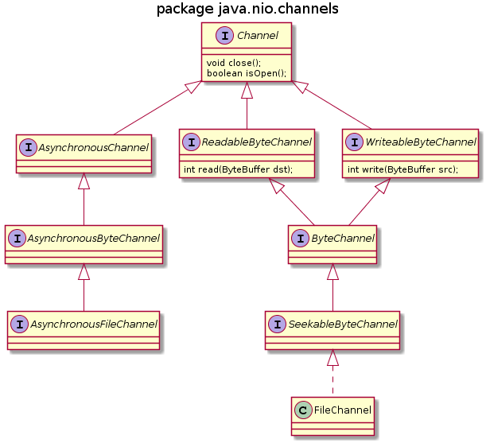
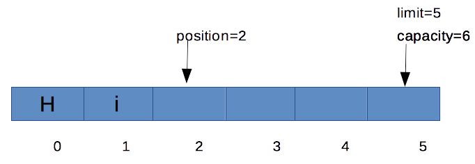

# 5.3 NIO.2 {#Java} 
© Γιάννης Κωστάρας

---

[<-](../5.2-Files/README.md)  | [Δ](../../README.md) | [->](../5.4-JDBC/README.md) 

---

Στο προηγούμενο μάθημα μάθαμε τις βασικές κλάσεις για επικοινωνία με τις μονάδες μόνιμης αποθήκευσης. Στην έκδοση 1.4 η γλώσσα εισήγαγε το NIO (New I/O) ενώ στην έκδοση 7 το NIO.2, δηλ. ένα νέο πλούσιο ΑΡΙ για το σκοπό αυτό.

| I/O | NIO.2
| ```java.io``` | ```java.nio.file```
| ```File``` | ```Path```
| ```File``` | ```Paths```
| - | ```FileSystems```
| ```-``` | ```FileSystem```
| ```-``` | ```FileStore```   

Το NIO ΑΡΙ είναι non-blocking, σε αντίθεση με το blocking API του προηγούμενου μαθήματος που περιμένει να διαβαστούν/γραφτούν όλα τα δεδομένα προτού μπορέσει να εκτελέσει άλλες εντολές. Οι κλάσεις NIO δουλεύουν με _κανάλια (channels)_ και _προσωρινές μνήμες (buffers)_ αντί για _ροές (streams)_. Αν ένα νήμα (thread) ζητήσει να διαβάσει ή να γράψει σε ένα κανάλι τότε θα του επιστραφεί ότι υπάρχει στο κανάλι ή την προσωρινή μνήμη ενώ παράλληλα μπορεί να εκτελέσει άλλες εντολές. Επίσης, μπορεί να μετακινηθεί στον buffer μπρος/πίσω (σ' αντίθεση με τις ροές που τα δεδομένα μεταφέρονται προς μια μόνο κατεύθυνση), οπότε μπορούμε να έχουμε ταυτόχρονα ανάγνωση και εγγραφή.
 
Ας δούμε πώς "μεταφράζονται" τα παραδείγματα του προηγούμενου μαθήματος στο ΝΙΟ.2.

### ```java.nio.file.Path``` & ```java.nio.file.Paths```

Η κλάση ```Path``` είναι αντίστοιχη της ```File``` (αν και δεν την αντικαθιστά πλήρως).
```java
jshell> import java.nio.file.*

jshell> Path path = Paths.get("test.txt");
path ==> test.txt

jshell> Path path = Paths.get("C:/temp/test.txt");    // absolute path
path ==> C:/temp/test.txt

jshell> Path path = Paths.get("temp/test.txt");    // relative path
path ==> temp/test.txt

jshell> Path path = Paths.get("C:","temp","test.txt");    
path ==> C:/temp/test.txt

jshell> Path path = Paths.get("C:/temp/../temp/test.txt").normalize();    
path ==> C:/temp/test.txt

jshell> Path path = Paths.get(URI.create("file:///home/user/test.txt"));
path ==> /home/user/test.txt

jshell> Path path = FileSystems.getDefault().getPath("C:\\temp\\test.txt");
path ==> C:\temp\test.txt

jshell> Path path = Paths.get(System.getProperty("user.home"), "downloads", "test.txt");
path ==> /Users/MyMacBook/downloads/test.txt

jshell> Path path1 = Paths.get("C:");    
path1 ==> C:

jshell> Path path2 = Paths.get("temp/test.txt");    
path2 ==> temp/test.txt

jshell> path1.equals(path2)
$1 ==> false

jshell> path1.compareTo(path2) // το path1 < path2 (λεξικογραφικά)
$2 ==> -49

jshell> path1.resolve(path2) // συνένωση
$3 ==> C:/temp/test.txt

jshell> path1.relativize(path2)
$4 ==> ../temp/test.txt

jshell> path
path ==> C:/temp/test.txt

jshell> path.endsWith("test.txt")
$5 ==> true

jshell> path.resolveSibling("file.txt")	// συνένωση
$6 ==> C:/temp/file.txt

jshell> path.getFileName()
$7 ==> test.txt

jshell> path.getNameCount()
$8 ==> 3

jshell> path.getName(1)
$9 ==> temp

jshell> path.getParent()
$10 ==> C:/temp

jshell> path.getRoot()
$11 ==> null

jshell> Paths.get("/Users/").getRoot()
$12 ==> /

jshell> path.subpath(1,2); // beginIndex, endIndex; index starts from 0
$13 ==> temp

jshell> path.toString()
$14 ==> "C:/temp/test.txt"

jshell> path.toUri()
$15 ==> file:///C:/temp/test.txt

jshell> path.isAbsolute()
$16 ==> true

jshell> path.toAbsolutePath()
$17 ==> /C:/temp/test.txt

jshell> Path path = Paths.get("/","tmp","test.txt");    
path ==> /tmp/test.txt

jshell> path.toRealPath()
$18 ==> /private/tmp/test.txt

jshell> path.startsWith("/")
$19 ==> true

jshell> File f = path.toFile()	// Path ==> File
f ==> /tmp/test.txt
```

* ```.``` ο τρέχων κατάλογος
* ```..``` ο πατρικός κατάλογος

### ```java.nio.file.Files```

```java
jshell> Files.exists(path)
$16 ==> true

jshell> Files.notExists(path)    // !Files.exists() != Files.notExists(), π.χ. λόγω δικαιωμάτων πρόσβασης
$17 ==> false

jshell> Files.isDirectory(path)
$18 ==> false 

jshell> Files.isRegularFile(path)
$19 ==> true

jshell> Files.isReadable(path)
$20 ==> true

jshell> Files.isWritable(path)
$21 ==> true

jshell> Files.isExecutable(path)
$22 ==> false

jshell> Files.isHidden(path)
$23 ==> false

jshell> Files.isSymbolicLink(path)
$22 ==> false

jshell> Files.probeContentType(path)
$23 ==> "text/plain"

jshell> Files.size(path)
$24 ==> 0

jshell> Path p = Paths.get("/tmp/test.txt")
p ==> /tmp/test.txt

jshell> Files.isSameFile(path, p); // άλλος τρόπος πέραν του Path.exists(). Τα paths πρέπει να υπάρχουν.
$25 ==> true
```

* ```text/plain``` δηλώνει αρχείο κειμένου
* ```text/html ```δηλώνει σελίδα HTML
* ```application/pdf``` δηλώνει αρχείο PDF
* ```image/png ``` δηλώνει αρχείο εικόνας PNG

```java
jshell> Files.getAttribute(path, "creationTime")
$26 ==> 2019-12-30T21:40:04Z

jshell> Files.getAttribute(path, "lastModifiedTime")
$27 ==> 2019-12-30T21:40:04Z

jshell> Files.getAttribute(path, "size")
$28 ==> 0

jshell> Files.getAttribute(path, "isDirectory")
$29 ==> false

jshell> Files.getAttribute(path, "dos:hidden") // δουλεύει μόνο στα Windows
|  Exception java.lang.UnsupportedOperationException: View 'dos' not available
```
Το 2ο όρισμα της ```getAttribute``` είναι της μορφής _view:attribute_ όπου _view_ μπορεί να είναι: ```basic, dos, posix``` με την ```basic``` να είναι η εξ'ορισμού. Άλλος τρόπος να διαβάσουμε τα γνωρίσματα (attributes) αρχείων και καταλόγων είναι:
```java
jshell> import java.nio.file.attribute.*;

jshell> BasicFileAttributes attr = Files.readAttributes(path, BasicFileAttributes.class);
attr ==> null

jshell> attr.size()
$30 ==> 0

jshell> attr.creationTime()
$31 ==> 2019-02-19T19:52:50Z

jshell> attr.lastAccessTime()
$32 ==> 2019-02-19T19:52:50Z

jshell> attr.lastModifiedTime()
$33 ==> 2019-02-19T19:52:50Z

jshell> attr.isDirectory()
$34 ==> false

jshell> attr.isRegularFile()
$35 ==> true

jshell> attr.isSymbolicLink()
$36 ==> false

jshell> attr.isOther()
$37 ==> false

jshell> FileTime fileTime = FileTime.fromMillis(System.currentTimeMillis());
fileTime ==> 2019-02-19T21:10:44.927Z

jshell> Files.setLastModifiedTime(path, fileTime);

jshell> Files.getLastModifiedTime(path)
$38 ==> 2019-02-19T21:10:44Z
```

* ```BasicFileAttributes```
* ```DosFileAttributes```
* ```PosixFileAttributes```
* ```FileOwnerFileAttributes```
* ```AclFileAttributes```
* ```UserDefinedFileAttributes```

#### ```DosFileAttributes```

* ```isReadOnly()```
* ```isHidden()```
* ```isArchive()```
* ```isSystem()```

#### ```PosixFileAttributes```

```java
jshell> PosixFileAttributes attr = Files.readAttributes(path, PosixFileAttributes.class);

jshell> attr.owner().getName()
$13 ==> "john"

jshell> attr.group().getName()
$14 ==> "staff"

jshell> attr.permissions().toString()
$15 ==> "[OWNER_WRITE, GROUP_READ, OTHERS_READ, OWNER_READ]"

jshell> Set<PosixFilePermission> permissions = PosixFilePermissions.fromString("rw-r--r--");
permissions ==> [OWNER_READ, OWNER_WRITE, GROUP_READ, OTHERS_READ]

jshell> Files.setPosixFilePermissions(path, permissions);

jshell> FileSystem fs = FileSystems.getDefault();
fs ==> sun.nio.fs.MacOSXFileSystem@50d0686

jshell> for (FileStore store : fs.getFileStores()) {
   ...> try {
   ...> long totalSpace = store.getTotalSpace() / 1024;
   ...> long usedSpace = (store.getTotalSpace() - store.getUnallocatedSpace()) / 1024;
   ...> long availableSpace = store.getUsableSpace() / 1024;
   ...> boolean isReadOnly = store.isReadOnly();
   ...> System.out.println("--- " + store.name() + " --- " + store.type());
   ...> System.out.println("Total space: " + totalSpace);
   ...> System.out.println("Used space: " + usedSpace);
   ...> System.out.println("Available space: " + availableSpace);
   ...> System.out.println("Is read only? " + isReadOnly);
   ...> } catch (IOException e) {
   ...> System.err.println(e);
   ...> }
   ...> }
--- /dev/disk0s2 --- hfs
Total space: 233591456
Used space: 226233780
Available space: 7101676
Is read only? false
--- devfs --- devfs
Total space: 228
Used space: 228
Available space: 0
Is read only? false
--- map -hosts --- autofs
Total space: 0
Used space: 0
Available space: 0
Is read only? false
--- map auto_home --- autofs
Total space: 0
Used space: 0
Available space: 0
Is read only? false
--- /dev/disk1s0 --- cd9660
Total space: 575606
Used space: 575606
Available space: 0
Is read only? true
```

## Δημιουργία

Δημιουργία καταλόγου:

```java
jshell> Path newdir = Paths.get("/tmp/newdir");
newdir ==> /tmp/newdir

jshell> Files.createDirectory(newdir);    //  throws exception if directory exists

jshell> Files.exists(newdir)
$1 ==> true

jshell> Path newdir2 = Paths.get("/tmp/newdir2");
newdir2 ==> /tmp/newdir2

jshell> Set<PosixFilePermission> perms = PosixFilePermissions.fromString("rwxr-x---");
perms ==> [OWNER_READ, OWNER_WRITE, OWNER_EXECUTE, GROUP_READ, GROUP_EXECUTE]

jshell> FileAttribute<Set<PosixFilePermission>> attr = PosixFilePermissions.asFileAttribute(perms);
attr ==> java.nio.file.attribute.PosixFilePermissions$1@72d818d1

jshell> import java.nio.file.attribute.*;

jshell> Set<PosixFilePermission> perms = PosixFilePermissions.fromString("rwxr-x---");
perms ==> [OWNER_READ, OWNER_WRITE, OWNER_EXECUTE, GROUP_READ, GROUP_EXECUTE]

jshell> FileAttribute<Set<PosixFilePermission>> attr = PosixFilePermissions.asFileAttribute(perms);
attr ==> java.nio.file.attribute.PosixFilePermissions$1@72d818d1

jshell> Files.createDirectory(newdir2, attr);

jshell> Files.exists(newdir2)
$2 ==> true

jshell> Path newdir3 = FileSystems.getDefault().getPath("/tmp/", "test", "newdir3");
newdir3 ==> /tmp/test/newdir3

jshell> Files.createDirectories(newdir3);  // creates intermediate directories too, if they do not exist

jshell> Files.exists(newdir3)
$3 ==> true
```


Δημιουργία αρχείου:

```java
jshell> Path newfile = Paths.get("/tmp/", "newfile");
newfile ==> /tmp/newfile

jshell> Files.createFile(newfile);
```

## Εμφάνιση καταλόγου

```java
jshell> Path directoryPath = Paths.get("C:/temp");
directoryPath ==> C:\temp

jshell> try (DirectoryStream<Path> ds = Files.newDirectoryStream(directoryPath)) {
   ...> for (Path file : ds) {
   ...> System.out.println(file.getFileName());
   ...> }
   ...> }catch(IOException e) {
   ...> System.err.println(e);
   ...> }
test.txt
```

Μπορούμε να χρησιμοποιήσουμε και χαρακτήρες μπαλαντέρ (globbing):

* ```*``` οποιοσδήποτε αριθμός χαρακτήρων
* ```**``` όπως και το ```*``` αλλά ψάχνει σε όλους τους υποφακέλους
* ```?``` οποιοσδήποτε ένας μόνο χαρακτήρας
* ```{}``` μόνο χαρακτήρες που περιέχονται στα άγκιστρα, π.χ. ```{α, ά, ε, έ}```
* ```[]``` σύνολο χαρακτήρων, π.χ. ```[Α-Ω, Ά, Έ, Ή, Ί, Ό, Ώ]```. Οι χαρακτήρες ```*, ?, \``` δεν είναι χαρακτήρες μπαλαντέρ μέσα στις αγκύλες
* ```\*, \?, \\``` αν θέλουμε να ταιριάζουμε κάποιον από τους χαρακτήρες ```*, ?, \```

Π.χ.
```java
try (DirectoryStream<Path> ds = Files.newDirectoryStream(path, "*.{png,jpg,bmp}")) {
...
``` 
Μπορούμε να φιλτράρουμε τ' αποτελέσματα (π.χ. μόνο αρχεία):
```java
jshell> DirectoryStream.Filter<Path> fileFilter = new DirectoryStream.Filter<Path>() {
   ...> @Override
   ...> public boolean accept(Path path) throws IOException { 
   ...> return (Files.isRegularFile(path));
   ...> }
   ...> };
fileFilter ==> 1@617faa95

jshell> try (DirectoryStream<Path> ds = Files.newDirectoryStream(path, fileFilter)) {
...
```
Για αναδρομική προσπέλαση καταλόγων, το ΝΙΟ.2 προσφέρει τη διεπαφή ```FileVisitor``` και την υλοποίησή της ```SimpleFileVisitor```. Ένα παράδειγμα χρήσης φαίνεται παρακάτω:

```java
jshell> Files.walkFileTree(directoryPath, new SimpleFileVisitor<Path>() {
   ...> @Override
   ...> public FileVisitResult preVisitDirectory(Path dir, BasicFileAttributes attrs) throws 
   ...> IOException {
   ...> System.out.println("d " + dir.toAbsolutePath());
   ...> return FileVisitResult.CONTINUE;
   ...> }
   ...> @Override
   ...> public FileVisitResult visitFile(Path dir, BasicFileAttributes attrs) throws
   ...> IOException {
   ...> System.out.println("f " + dir.toAbsolutePath());
   ...> return FileVisitResult.CONTINUE;
   ...> }
   ...> });
d C:\temp
f C:\temp\test.txt
$3 ==> C:\temp
```
Άλλο ένα παράδειγμα, εύρεση μόνο των φακέλων:
```java
jshell> Files.walkFileTree(directoryPath, new SimpleFileVisitor<Path>() {  
   ...>  @Override
   ...>  public FileVisitResult postVisitDirectory(Path dir, IOException e) throws
   ...>  IOException {
   ...>  System.out.println("d " + dir.toAbsolutePath());
   ...>  return FileVisitResult.CONTINUE;
   ...>  }
   ...>  });
d C:\temp
$4 ==> C:\temp
```
Η διεπαφή διαθέτει τις εξής μεθόδους:

```java
public interface FileVisitor {
   FileVisitResult preVisitDirectory(Path dir, BasicFileAttributes attrs);
   FileVisitResult visitFile(Path dir, BasicFileAttributes attrs);
   FileVisitResult postVisitDirectory(Path dir, IOException e);
   FileVisitResult visitFileFailed(Path dir, IOException e);
}
```

* ```FileVisitResult.CONTINUE```: να συνεχιστεί η προσπέλαση
* ```FileVisitResult.SKIP_SIBLINGS```: να συνεχιστεί η προσπέλαση αλλά χωρίς να επισκεφτούν τα υπόλοιπα αρχεία/φακέλους σ' αυτόν τον φάκελο
* ```FileVisitResult.SKIP_SUBTREE```: να συνεχιστεί η προσπέλαση αλλά χωρίς να επισκεφτούν τα υπόλοιπα αρχεία/φακέλους σ' αυτόν τον φάκελο και τους υποφακέλους
* ```FileVisitResult.TERMINATE```: να σταματήσει η προσπέλαση

Ας δούμε ένα ακόμα παράδειγμα, εύρεση ενός αρχείου:

```java
jshell>  Path searchedFile = Paths.get("test.txt");
searchedFile ==> test.txt

jshell> Files.walkFileTree(directoryPath, new SimpleFileVisitor<Path>() {
   ...>  @Override
   ...>  public FileVisitResult preVisitDirectory(Path dir, BasicFileAttributes attrs) throws
   ...>  IOException {
   ...>  return FileVisitResult.CONTINUE;
   ...>  }
   ...>  @Override
   ...> public FileVisitResult postVisitDirectory(Path dir, IOException exc) {
   ...> return FileVisitResult.CONTINUE;
   ...> }
   ...>
   ...> @Override
   ...> public FileVisitResult visitFile(Path file, BasicFileAttributes attrs) throws
   ...> IOException {
   ...>     Path name = file.getFileName();
   ...>     if (name != null && name.equals(searchedFile)) {
   ...>         System.out.println("Searched file was found: " + searchedFile +
   ...>         " in " + file.toRealPath().toString());
   ...>         return FileVisitResult.TERMINATE;
   ...>     } else {
   ...>         return FileVisitResult.CONTINUE;
   ...>     }
   ...> }
   ...> @Override
   ...> public FileVisitResult visitFileFailed(Path file, IOException exc)
   ...> throws IOException {
   ...> //report an error if necessary
   ...> return FileVisitResult.CONTINUE;
   ...> }
   ...> });
Searched file was found: test.txt in C:\temp\test.txt
$5 ==> C:\temp
```

## Ανάγνωση αρχείου

```java
jshell> import java.nio.charset.*;

jshell> List<String> linesOfContent = Files.readAllLines(path, StandardCharsets.UTF_8);
linesOfContent ==> []

jshell> byte[] content = Files.readAllBytes(path)
content ==> byte[87] { -50, -93, -50, -75, 32, -50, -77, -50, ... -75, -49, -127, -50, -82 }

jshell> String s = new String(content, "UTF-8");
s ==> "Σε γνωρίζω από την κόψη, του σπαθιού την τρομερή"

jshell> try (BufferedReader reader = Files.newBufferedReader(path, Charset.forName("UTF-8"))) {
   ...> String line = null;
   ...> while ((line = reader.readLine()) != null) {
   ...> System.out.println(line);
   ...> }
   ...> } catch (IOException e) {
   ...> System.err.println(e);
   ...> }
Σε γνωρίζω από την κόψη, του σπαθιού την τρομερή
```

## Εγγραφή αρχείου

```java
jshell> List<String> lines = Arrays.asList(
   ...> new String[]{"Σε γνωρίζω από την κόψη", "του σπαθιού την τρομερή"});
lines ==> [Σε γνωρίζω από την κόψη, του σπαθιού την τρομερή]

jshell> Files.write(path, lines, Charset.forName("UTF-8"), StandardOpenOption.APPEND)
$1 ==> /tmp/test.txt

jshell> List<String> linesOfContent = Files.readAllLines(path, StandardCharsets.UTF_8);
linesOfContent ==> [Σε γνωρίζω από την κόψη, του σπαθιού την τρομερή]

jshell> try (OutputStream outputStream = Files.newOutputStream(path, StandardOpenOption.CREATE_NEW)) {
   ...> for (String line : lines) {
   ...> outputStream.write((line + System.lineSeparator()).getBytes(StandardCharsets.UTF_8));
   ...> }
   ...> }
   
jshell> String s = "Σε γνωρίζω από την κόψη, του σπαθιού την τρομερή"
s ==> "Σε γνωρίζω από την κόψη, του σπαθιού την τρομερή"

jshell> byte[] bytes = s.getBytes("UTF-8")
bytes ==> byte[87] { -50, -93, -50, -75, 32, -50, -77, -50, ... -75, -49, -127, -50, -82 }

jshell> Files.write(newfile, bytes)
$2 ==> /tmp/newfile  

jshell> try (BufferedWriter writer = Files.newBufferedWriter(path, Charset.forName("UTF-8"), StandardOpenOption.APPEND)) {
   ...> writer.write(text);
   ...> } catch (IOException e) {
   ...> System.err.println(e);
   ...> }
```
Υπάρχουν οι εξής επιλογές:

``` StandardOperation. ``` :

* ```READ``` 
* ```WRITE``` 
* ```CREATE```
* ```CREATE_NEW``` 
* ```APPPEND``` 
* ```DELETE_ON_CLOSE``` 
* ```TRUNCATE_EXISTING``` 

## Αντιγραφή αρχείου/φακέλου
Στο προηγούμενο μάθημα και στο μάθημα με τις εξαιρέσεις είδαμε έναν τρόπο αντιγραφής ενός αρχείου. Η ```Files.copy()``` κάνει την ίδια δουλειά:

```java
jshell> path // το πηγαίο αρχείο πρέπει να υπάρχει
path ==> /tmp/test.txt

jshell> Path backup = Paths.get("/tmp/test.bak")
backup ==> /tmp/test.bak

jshell> Files.copy(path, backup) 
$1 ==> /tmp/test.bak

jshell> Files.copy(path, dest)
|  Exception java.nio.file.FileAlreadyExistsException: /tmp/test.bak

jshell> Files.copy(path, dest, StandardCopyOption.REPLACE_EXISTING);
$2 ==> /tmp/test.bak
```

Η ```Files.copy()``` δουλεύει και για φακέλους αλλά να θυμάστε ότι δεν αντιγράφει υπο-φακέλους. Θα πρέπει να την χρησιμοποιήσετε για ν' αντιγράψετε κάθε υπο-φάκελο.

Ένας γρήγορος τρόπος αντιγραφής αρχείων είναι και ο παρακάτω:

```java
jshell> File sourceFile = path.toFile() // το πηγαίο αρχείο πρέπει να υπάρχει
sourceFile ==> /tmp/test.txt

jshell> File destFile = Paths.get("/tmp/backup.txt").toFile()
destFile ==> /tmp/backup.txt

jshell> Files.createFile(destFile.toPath());  // καλό είναι να υπάρχει τ' αρχείο προορισμού
$1 ==> /tmp/backup.txt

jshell> import java.nio.channels.*

jshell> if (sourceFile.exists() && destFile.exists()) {
   ...> try (FileChannel srcChannel = new FileInputStream(sourceFile).getChannel();
   ...> FileChannel sinkChannel = new FileOutputStream(destFile).getChannel()) {
   ...> srcChannel.transferTo(0, srcChannel.size(), sinkChannel);
   ...> } catch (IOException e) {
   ...> e.printStackTrace();
   ...> }
   ...> }
```

## Μετονομασία/μετακίνηση αρχείου/φακέλου
```java
jshell> Path path = Files.createFile(Paths.get("C:/temp/test.txt")); // το αρχείο πρέπει να υπάρχει
path ==> C:\temp\test.txt

jshell> Path targetPath = Paths.get("C:/Users/john/"); // must be a directory
targetPath ==> C:\Users\john
 
jshell> Files.move(path, targetPath.resolve(path.getFileName()), StandardCopyOption.REPLACE_EXISTING, StandardCopyOption.ATOMIC_MOVE); 
$1 ==> C:\Users\john\test.txt
```
Η παράμετρος ```StandardCopyOption.ATOMIC_MOVE``` εγγυάται ότι αν αποτύχει η μετακίνηση τότε το πηγαίο αρχείο/φάκελος παραμένει άθικτο/ς.

Δουλεύει και για φακέλους αν θέλετε μόνο να μετονομάσετε το φάκελο. Δε δουλεύει αν θέλετε να μετακινήσετε το φάκελο σε άλλο σύστημα αρχείων ή drive.

Εάν μετακινήσετε (move) μια συντόμευση (symbolic link), μετακινείται η ίδια η συντόμευση, όχι το αρχείο που δείχνει η συντόμευση. Είναι σημαντικό να σημειωθεί ότι στην περίπτωση της αντιγραφής (copy) που είδαμε προηγούμενα, αντιγράφεται το αρχείο που δείχνει η συντόμευση κι όχι η ίδια η συντόμευση. (Περισσότερα για τις συντομεύσεις παρακάτω).

## Διαγραφή αρχείου/φακέλου

```java
jshell> Files.deleteIfExists(path)
$1 ==> true
```
Οι εντολές ```deleteIfExists(), delete()``` εγείρουν εξαιρέσεις σε περίπτωση που κάτι πάει στραβά:

```java
jshell> try {
   ...> Files.delete(path);
   ...> } catch (IOException x) {
   ...> System.out.println("Deletion failed");
   ...> }	
Deletion failed
```
Οι ακόλουθες εξαιρέσεις μπορούν να εγερθούν: ```NoSuchFileException, DirectoryNotEmptyException, IOException, SecurityException```.

Στην περίπτωση διαγραφής καταλόγου (φακέλου), θα πρέπει να είναι άδειος. 

Στην περίπτωση μιας συντόμευσης (symbolic link), διαγράφεται η συντόμευση, όχι το αρχείο που δείχνει η συντόμευση.

## Συντομεύσεις (Symbolic links)
Στα συστήματα Unix, υπάρχει η δυνατότητα δημιουργίας συνδέσμων (links) και μάλιστα hard links και soft ή symbolic links. Στα Windows είναι οι αντίστοιχες συντομεύσεις (shortcuts). Το hard link είναι στην ουσία ένα αντίγραφο ενός αρχείου (δεν υπάρχουν hard links για φακέλους). Το soft link είναι απλά ένας δείκτης σ' ένα αρχείο ή φάκελο. Θα πρέπει να υπάρχει το αρχείο για να δημιουργηθεί ένα soft link γι' αυτό. Αντιθέτως, ο "στόχος" που δείχνει ένα soft link μπορεί και να μην υπάρχει με αποτέλεσμα το soft link να είναι "τζούφιο, άδειο", να μη δείχνει πουθενά (π.χ. επειδή το αρχείο ή ο φάκελος στο οποίο έδειχνε διαγράφηκε). Αντιθέτως, αν διαγράψετε το αρχείο που δείχνει το hard link, τότε το hard link συνεχίζει να υπάρχει ως αντίγραφο του αρχικού αρχείου. 

Στο Unix/Linux δημιουργούμε ένα hard link με την εντολή ```mklink``` ενώ ένα soft link με την εντολή ```ln -s``` (παρέχοντας πρώτα το αρχείο/φάκελο προορισμού και μετά το soft link).

Π.χ. η συντόμευση ```/usr/tmp -> ../var/tmp``` δηλώνει ότι το ```/usr/tmp``` δείχνει στο ```../var/tmp```. Εν τέλει, που δείχνει αυτή η συντόμευση; ```/usr/../var/tmp``` η οποία αποτιμάται στη διαδρομή ```/var/tmp```.

Η κλάση ```java.nio.file.Files``` παρέχει τις ακόλουθες μεθόδους:

```java
* createLink() 
* createSymbolicLink()
* isSymbolicLink()
* readSymbolicLink()
```

Ας δούμε μερικά παραδείγματα:
```java
jshell> Path slink = Paths.get("C:/temp/slink.txt")
slink ==> C:\temp\slink.txt

jshell> Files.createSymbolicLink(slink, path)

jshell> Files.isSymbolicLink(slink)
$1 ==> true

jshell> Files.readSymbolicLink(slink);
$2 ==>
```
Να σημειωθεί ότι πολλές μέθοδοι δέχονται ως παράμετρο αν θα πρέπει ν' ακολουθήσουν τις συντομεύσεις ή όχι (```LinkOption.NOFOLLOW_LINKS```).

## Κανάλια 
Στην αρχή του μαθήματος είπαμε ότι το ΝΙΟ είναι non-blocking. Αυτό το επιτυγχάνει χάρις στις νέες ασύγχρονες κλάσεις που εισάγει στη βιβλιοθήκη ```java.nio.channels``` όπως φαίνεται στην ακόλουθη εικόνα:



**Εικόνα 5.3.1** _Διάγραμμα κλάσεων ιεραρχίας Καναλιών (Channels)_

Στην εικόνα προσέξτε την ιεραρχία διαμάντι μεταξύ των διεπαφών ```Channel, ReadableByteChannel, WritableByteChannel, ByteChannel``` που, όπως είδαμε στα μαθήματα της 2ης εβδομάδας, είναι κάτι που πρέπει να αποφεύγεται. Στην συγκεκριμένη περίπτωση καθώς δεν υπάρχουν επικαλυπτώμενες μέθοδοι, δεν υπάρχει κάποιο πρόβλημα.

Θα επικεντρωθούμε στα κανάλια διαχείρισης αρχείων (```AsynchronousFileChannel``` και ```FileChannel```), αλλά υπάρχουν και ```AsynchronousSocketChannel, AsynchronousServerSocketChannel, AsynchronousDatagramChannel``` για ασύγχρονη διαχείριση TCP και UDP sockets. Όπως είπαμε, με τον όρο _ασύγχρονο Ι/Ο_ εννοούμε Ι/Ο (Input/Output) που δεν μπλοκάρει περιμένοντας δεδομένα από τη ροή ή το κανάλι επικοινωνίας. Όταν δεν υπάρχουν δεδομένα να διαχειριστεί, ελευθερώνει τον επεξεργαστή ώστε να εκτελέσει άλλες ενέργειες και αναλαμβάνει πάλι δράση όταν υπάρχουν δεδομένα προς επεξεργασία (δέχεται κάποια διακοπή - interrupt). 

Σ' ένα εισαγωγικό μάθημα σαν κι αυτό, δε θα εντρυφήσουμε στα κανάλια, ένα παράδειγμα χρήσης των οποίων είδαμε πιο πάνω στην αντιγραφή αρχείου. Τα κανάλια δουλεύουν με ```ByteBuffer```s τα οποία ξεφεύγουν από τις ανάγκες ενός εισαγωγικού μαθήματος της γλώσσας. Παρόλ' αυτά θα δώσουμε εδώ μια μικρή εισαγωγή κι ένα παράδειγμα χρήσης. 

Ένας ```java.nio.ByteBuffer```, όπως λέει και τ' όνομά του, είναι μια προσωρινή/ενδιάμεση θέση μνήμης για αποθήκευση bytes, ή πιο σωστά μια όψη (view) σε μια ακολουθία από bytes. Υπάρχουν δυο κατηγορίες: αυτοί που χρησιμοποιούν μια συστοιχία (array) και αυτές που χρησιμοποιούν απευθείας ένα μέρος της μνήμης σωρού (heap).  

Όπως βλέπετε στο παρακάτω σχήμα, ένας ByteBuffer διαθέτει κάποιους δείκτες:

* ```capacity```: δείχνει στο τέλος του ByteBuffer και δηλώνει τη χωρητικότητά του, δηλ. τον αριθμό bytes που χωράει
* ```limit```: δείχνει στο τέλος των δεδομένων, δηλ. στην επόμενη θέση από την θέση του τελευταίου δεδομένου
* ```position```: δείχνει στη θέση του επόμενου στοιχείου προς ανάγνωση ή εγγραφή
* ```mark```: δείχνει σε μια θέση που εσείς θέλετε, κάτι σαν σελιδοδείκτης

Ισχύει: 0 <= mark <= position <= limit <= capacity



**Εικόνα 5.3.2** _ByteBuffer συστοιχίας_

Διαβάστε περισσότερα στις πηγές (π.χ. [Schuller, 2012]).

Στο προηγούμενο μάθημα είδαμε ένα παράδειγμα αποθήκευσης (σειριοποίησης) μιας ιεραρχίας κλάσεων (```Track```) σ' ένα αρχείο με τη χρήση της ```ObjectOutputStream```. Το μέγεθος του αρχείου ```tracks.dump``` είναι 329 bytes. 

Ένα ```AirTrack``` όμως καταλαμβάνει 25 bytes στη μνήμη:

* ```TrackType trackType; // 1 byte```
* ```int speed; // 4 bytes```
* ```int height; // 4 bytes```
* ```double x; // 8 bytes```
* ```double y; // 8 bytes```

και αντίστοιχα ένα ```LandTrack``` καταλαμβάνει 21 bytes. 

```java
Track airTrack = new AirTrack(5000, 10000, 20.0, -20.0);    // 25 bytes 
Track landTrack = new LandTrack(20, 10.0, -25.0);           // 21 bytes 
List<Track> tracks = new ArrayList<>();
tracks.add(airTrack);
tracks.add(landTrack);
```
Επιπλέον θα πρέπει ν' αποθηκεύσουμε πόσα ίχνη θ' αποθηκεύσουμε στο αρχείο, στο παράδειγμά μας 2 ίχνη, ένα αέρος και ένα εδάφους, που είναι άλλος ένας ακέραιος, δηλ. άλλα 4 bytes. Άρα συνολικά χρειαζόμαστε έναν ```ByteBuffer``` μεγέθους 25 + 21 + 4 = 50 bytes.

```java
ByteBuffer buffer = ByteBuffer.allocate(50);    // 25 + 21 + 4 bytes
// try (RandomAccessFile store = new RandomAccessFile(new File("./tracks.dump"), "rw");
//      FileChannel channel = store.getChannel()) {
try (SeekableByteChannel channel = (Files.newByteChannel("./tracks.dump",
     EnumSet.of(StandardOpenOption.CREATE, StandardOpenOption.WRITE)))) {
     channel.position(0);
     buffer.putInt(tracks.size()); // 4 bytes
     for (Track track : tracks) {
         System.out.println(track.toString());
         buffer.put((byte) track.getTrackType().ordinal());  // 1 byte
         buffer.putDouble(track.getX());     // 8 bytes
         buffer.putDouble(track.getY());     // 8 bytes
         buffer.putInt(track.getSpeed());    // 4 bytes
         if (track.getTrackType() == Track.TrackType.AIR) {
             buffer.putInt(((AirTrack) track).getHeight());  // 4 bytes
         }
	 }
    buffer.flip();  // limit = position; position = 0; <-- don't forget this!!!
    int nOfBytes = channel.write(buffer);
    System.out.println("Bytes written: " + nOfBytes);
    buffer.clear();
} catch (IOException ex) {
    System.err.println(ex);
}
```
Το μέγεθος του αρχείου ```tracks.dump``` είναι πλέον μόνο 50 bytes.

Για να διαβάσετε το αρχείο ```tracks.dump```:

```java
// try (RandomAccessFile store = new RandomAccessFile(new File("./tracks.dump"), "r");
//      FileChannel channel = store.getChannel()) {
try (SeekableByteChannel channel = (Files.newByteChannel("./tracks.dump",
     EnumSet.of(StandardOpenOption.READ)))) {
     channel.position(0);
//   buffer.flip();      // limit = position; position = 0;
//   buffer.rewind();    // position = 0; mark discarded
//   buffer.clear();     // position =0; limit = capacity; mark discarded
    int nbytes;
    do {
        nbytes = channel.read(buffer);
    } while (nbytes != -1 && buffer.hasRemaining());
    System.out.println("Bytes read: " + nbytes);
    buffer.flip(); // limit = position; position = 0; <-- don't forget this!!!
    int numOfTracks = buffer.getInt();
    for (int i = 0; i < numOfTracks; i++) {
        byte type = buffer.get();      // 1 byte
        Track.TrackType trackType = Track.TrackType.values()[type];
        Track t = null;
        double x = buffer.getDouble();      // 8 bytes
        double y = buffer.getDouble();      // 8 bytes
        int speed = buffer.getInt();        // 4 bytes
        if (trackType == Track.TrackType.AIR) {
            int height = buffer.getInt();  // 4 bytes
            t = new AirTrack(height, speed, x, y);
        } else if (trackType == Track.TrackType.LAND) {
            t = new LandTrack(speed, x, y);
        }
        if (t != null) {
            System.out.println(t.toString());
        }
    }
} catch (IOException ex) {
    System.err.println(ex);
}
```
Υπάρχουν πολλοί τρόποι να λάβουμε ένα κανάλι, είδαμε μερικούς πιο πάνω κι άλλον έναν παρακάτω:

```java
ByteBuffer buffer = ByteBuffer.allocateDirect(50);
try (FileChannel rdr = (new FileInputStream("./tracks.dump")).getChannel()) {
   while (rdr.read(buffer) > 0) {
     // Do something with the buffer
     buffer.clear();
   }
} catch (IOException ex) {
   System.err.println(ex);
}
```

## Περίληψη
Σ' αυτό το μάθημα είδαμε κάποιες από τις δυνατότητες του NIO.2. Μιλήσαμε για τις δυο βασικές κλάσεις ```java.nio.file.Path``` και ```java.nio.file.Files```, για symbolic links και είδαμε ένα παράδειγμα καναλιών (Channels) με τη χρήση ```ByteBuffer```s. Δεν αναφερθήκαμε στις δυνατότητες που παρέχει το NIO.2 API να ανιχνεύουμε αλλαγές στο σύστημα αρχείων (```java.nio.file.WatchService```).

Πέρα από τα αρχεία, μπορείτε να αποθηκεύσετε τα δεδομένα σας και σε βάσεις δεδομένων, που είναι το θέμα του επόμενου μαθήματος. 

## Ασκήσεις
1) Επιλύστε την άσκηση 1 του προηγούμενου μαθήματος χρησιμοποιώντας το ΝΙΟ.2 ΑΡΙ.

## Πηγές
1. ["The Java Tutorial"](https://docs.oracle.com/javase/tutorial/)
1. Baeldung (2019), [Guide to Java FileChannel](https://www.baeldung.com/java-filechannel)
1. Darwin I. F. (2014), _Java Cookbook_, 3rd Ed., O’ Reilly.
1. Deitel P., Deitel H. (2018), _Java How to Program_, 11th Ed., Safari.
1. Gupta L. [Working With Buffers – Java NIO 2.0](https://howtodoinjava.com/java7/nio/java-nio-2-0-working-with-buffers/)
1. Jenkov, [Java NIO Buffer](http://tutorials.jenkov.com/java-nio/buffers.html)
1. Leonard A. (2011), _Pro Java 7 NIO.2_, Apress.
1. Horstmann C. S. (2016), _Core Java, Volume 1 Fundamentals_, 10th Ed., Prentice-Hall.
1. Horstmann C. S. (2018), _Core Java SE 9 for the impatient_, 2nd Ed., Addison-Wesley.
1. Long F. et al. (2012), _The CERT® Oracle® Secure Coding Standard for Java™_, Addison-Wesley.
1. Long F. et al. (2014), _Java Coding Guidelines_, Pearson. 
1. Schuller P. (2012), ["The Java ByteBuffer – a crash course"](https://www.javacodegeeks.com/2012/12/the-java-bytebuffer-a-crash-course.html), JavaCodeGeeks.
1. [Java Notes for Professionals](https://books.goalkicker.com/JavaBook/JavaNotesForProfessionals.pdf)
1. [Java NIO Buffer](https://javapapers.com/java/java-nio-buffer/)

---

[<-](../5.2-Files/README.md)  | [Δ](../../README.md) | [->](../5.4-JDBC/README.md) 

---