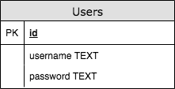

# 5.4 Επικοινωνία με Βάσεις Δεδομένων {#Java} 
© Γιάννης Κωστάρας

---

[<-](../5.3-NIO/README.md)  | [Δ](../../README.md) | [->](../5.5-XML-JSON/README.md) 

---

Στα προηγούμενα μαθήματα είδαμε πώς μπορούμε ν' αποθηκεύουμε μόνιμα τα δεδομένα μας σε συστήματα αρχείων. Σ' αυτό το μάθημα θα μάθουμε πώς ν' αποθηκεύουμε τα δεδομένα μας σε βάσεις δεδομένων.

## Κατηγορίες Βάσεων Δεδομένων
Υπάρχουν διάφορες κατηγορίες βάσεων δεδομένων:

* Σχεσιακές Βάσεις Δεδομένων
* Αντικειμενοστραφής Βάσεις Δεδομένων
* XML Βάσεις Δεδομένων
* NoSQL Βάσεις Δεδομένων

### Σχεσιακές Βάσεις Δεδομένων
Το πιο παραδοσιακό μοντέλο είναι οι σχεσιακές βάσεις δεδομένων (Σχεσιακά Συστήματα Διαχείρισης Βάσεων Δεδομένων - ΣΣΔΒΔ ή Relational Database Management Systems - RDBMS). Σ' αυτές, τα δεδομένα αποθηκεύονται σε πίνακες οι οποίοι σχετίζονται μεταξύ τους. Η επικοινωνία μ' αυτές γίνεται με τη 4ης γενιάς γλώσσα _Structured Query Language (SQL)_. Οι εντολές της SQL χωρίζονται στις εξής δυο κατηγορίες:

* Γλώσσα Ορισμού Δεδομένων (Data Definition Language - DDL): ```CREATE (DROP) TABLE/VIEW/INDEX, ALTER TABLE```
* Γλώσσα Διαχείρισης Δεδομένων (Data Manipulation Language - DML): ```SELECT, INSERT, UPDATE, DELETE```

Τα πιο δημοφιλή ΣΣΔΒΔ είναι τα ακόλουθα:

* [Apache Derby](https://db.apache.org/derby/)
* [HSQLDB](http://hsqldb.org/)
* [IBM DB2](https://www.ibm.com/analytics/db2/)
* [MS Access](http://office.microsoft.com/access)
* [MS SQL Server](https://www.microsoft.com/en-us/sql-server)
* [MySQL](https://www.mysql.com/)
* [Oracle](http://oracle.com/database)
* [Postgresql](https://postgresql.org/)
* [SQLite](https://sqlite.org)


Η Java μπορεί να επικοινωνήσει με ΣΣΔΒΔ για να επεξεργαστεί δεδομένα που είναι αποθηκευμένα σ' αυτά, χάρις στο _Java Database Connectivity Bridge (JDBC)_ (τελευταία έκδοση [4.3](https://jcp.org/aboutJava/communityprocess/mrel/jsr221/index3.html)). Η ιδέα πίσω από το JDBC είναι ότι κάθε κατασκευαστής προσφέρει τον οδηγό του (driver) που υλοποιεί το JDBC.

#### Επικοινωνία με Σχεσιακές ΒΔ

Στα παρακάτω θα χρησιμοποιήσουμε την SQLite ως ΣΔΒΔ και θα δημιουργήσουμε το σχήμα (schema) της ακόλουθης ΒΔ η οποία αποτελείται από έναν πίνακα ```Users```:


**Εικόνα 1** _Πίνακας Users_

Κατεβάστε τα:

* [SQLiteBrowser](https://sqlitebrowser.org/)
* [SQLite JDBC Driver](https://bitbucket.org/xerial/sqlite-jdbc/downloads/) 

Με τον SQLiteBrowser δημιουργήστε μια νέα ΒΔ με όνομα ```UserDB.sqlite3``` και τον πίνακα ```Users``` όπως φαίνεται στην ακόλουθη εικόνα:



**Εικόνα 2** _Δημιουργία πίνακα Users με τον SQLiteBrowser_

Συγχαρητήρια! Μόλις δημιουργήσατε μια SQLite3 ΒΔ. Μπορείτε να εισάγετε κάποι

Ας δούμε τώρα πώς μπορούμε να δημιουργήσουμε την ίδια ΒΔ με το NetBeans και πώς μπορούμε να επικοινωνήσουμε μ' αυτή.

1. Κάντε κλικ στο μενού **Window --> Services** για να εμφανίσετε το παράθυρο _Services_
1. Εμφανίστε τον κόμβο _Databases_ και κάντε δεξί κλικ στον κόμβο _Drivers_ και επιλέξτε **New Driver**
1. Στο διαλογικό παράθυρο _New JDBC Driver_ που εμφανίζεται, πατήστε το κουμπί **Add...** και επιλέξτε το αρχείο ```sqlite-jdbc-3.xx.xx.jar``` που κατεβάσατε. Ως όνομα δώστε ```SQLite3```
1. Κάντε δεξί κλικ στον κόμβο _Databases_ και επιλέξτε **New Connection**. Στο διαλογικό παράθυρο που εμφανίζεται, επιλέξτε τον οδηγό _SQLite3_ που δημιουργήσατε στο προηγούμενο βήμα και πατήστε **Next**. 
1. Προαιρετικά δώστε ένα _User Name_ και _Password_ για να συνδεθείτε στη ΒΔ, και ως _JDBC URL_ δώστε τη διαδρομή που θέλετε ν' αποθηκεύσετε τη ΒΔ (ή τη διαδρομή της ΒΔ που δημιουργήσαμε προηγούμενα): ```jdbc:sqlite:<path>/UserDB.sqlite3```
1. Πατήστε **Finish**

Το NetBeans δημιούργησε μια νέα σύνδεση (Connection) στη ΒΔ που δημιουργήσατε που περιέχει 3 κόμβους: _Tables, Views, Procedures_. Μπορείτε να δημιουργήσετε πίνακες, να δείτε τα δεδομένα τους κλπ.	


**Εικόνα 3** _Πίνακας Users στο NetBeans_

Στη συνέχεια θα δημιουργήσουμε ένα πρόγραμμα Java για να επικοινωνήσουμε με τη ΒΔ ```UserDB.sqlite3```.

1. Στο NetBeans, δημιουργήστε ένα νέο έργο Java Application και δώστε ένα όνομα στην εφαρμογή, π.χ. ```UserDBApp```
1. Επιλέξτε τα _Use Dedicated Folder for Storing Libraries_ και _Create Main Class_, αφήστε τα προτεινόμενα ονόματα και πατήστε το **Finish**
1. Δεξί κλικ στο _Libraries_ και **Add JAR/Folder**. Επιλέξτε το ```sqlite-jdbc-3.xx.xx.jar``` και **Copy to Libraries Folder** και στη συνέχεια το κουμπί **Choose**
1. Στη ```main()``` μέθοδο της κλάσης εισάγετε τον εξής κώδικα:

```java
import java.sql.*;

public class UserDBApp {
    private static final String URL = "jdbc:sqlite:<path_to>/UserDB.sqlite3";
    private static final String DB_ADMIN_USERNAME = "admin";
    private static final String DB_ADMIN_PASSWORD = "admin";	
    
    /**
     * @param args the command line arguments
     */
    public static void main(String[] args) {
        Connection dbConnection = getConnection();
    }

    /**
     * @return connection to database
     */
    public static Connection getConnection() {
        Connection connection = null;
        try {
            // create a connection to the database
            connection = DriverManager.getConnection(URL, DB_ADMIN_USERNAME, DB_ADMIN_PASSWORD);
        } catch (SQLException e) {
            System.err.println(e.getMessage());
        }
        return connection;
    }
}
```
Η μέθοδος ```getConnection()``` δημιουργεί μια σύνδεση (```Connection```) με τη ΒΔ που ορίζεται με το ```URL```. Το όνομα χρήστη και ο κωδικός του διαχειριστή της ΒΔ δεν απαιτούνται από την SQLite, αλλά απαιτούνται από άλλες ΒΔ όπως π.χ. MySQL κλπ.

Ας δούμε πώς μπορούμε να διαβάσουμε τα περιεχόμενα του πίνακα ```Users```:

```java
//...
	private static final String SQL_SELECT_ALL = "SELECT username, password FROM users ORDER BY username";

    /**
     * @param args the command line arguments
     */
    public static void main(String[] args) {
        Connection dbConnection = getConnection();
        selectAll(dbConnection);
    }
	
    /**
     * Select all rows in the {@code Users} table
     * @param dbConnection database connection
     */
    public static void selectAll(Connection dbConnection) {
        try (Statement stmt = dbConnection.createStatement();
             ResultSet rs = stmt.executeQuery(SQL_SELECT_ALL)) {

            // loop through the result set
            while (rs.next()) {
                System.out.println(rs.getString("username") + "\t"
                        + rs.getString("password"));
            }
        } catch (SQLException e) {
            System.out.println(e.getMessage());
        }
    }	
//...	
```
Η μέθοδος ```selectAll()``` δημιουργεί μια νέα εντολή (```Statement```) με την οποία εκτελεί ένα ερώτημα SQL στη ΒΔ με τη μέθοδο ```executeQuery```. Το αποτέλεσμα αποθηκεύεται σ' ένα αντικείμενο τύπου ```ResultSet```. Στη συνέχεια ανακτούμε ένα ένα τα αποθηκευμένα δεδομένα στην ```ResultSet``` και τα εμφανίζουμε στην οθόνη. Η ```ResultSet``` μοιάζει με έναν ```Iterator``` αλλά διαφέρει αρκετά απ' αυτόν. Π.χ. δεν υπάρχει μέθοδος ```hasNext()```, η ```next()``` δείχνει αρχικά πριν από την πρώτη εγγραφή, και πρέπει να την καλέσετε τουλάχιστο μια φορά ώστε να μετακινηθεί στην πρώτη εγγραφή, εκτός κι αν δεν υπάρχει καμία εγγραφή οπότε επιστρέφει ```false```.

Η ```executeQuery()``` παράγει μια εντολή SQL ```SELECT```. Για αλλαγή των δεδομένων (εντολές SQL ```INSERT, UPDATE, DELETE, CREATE, DROP, ALTER```), χρησιμοποιήστε την ```executeUpdate()```. 

Ανάλογα με τον τύπο των δεδομένων, υπάρχουν διάφορες μέθοδοι ανάκτησης αυτών π.χ. ```getString(), getDouble()``` κλπ. Προσέξτε ότι υπάρχει η ```getDate()``` η οποία επιστρέφει ```java.sql.Date``` (κι όχι ```java.util.Date```), η ```getTime()``` η οποία επιστρέφει ```java.sql.Time``` και η ```getTimeStamp()``` η οποία επιστρέφει ```java.sql.TimeStamp```. Θα πρέπει να τις μετατρέψετε στις αντίστοιχες κλάσεις ημερομηνίας και ώρας για να τις χρησιμοποιήσετε στο Java πρόγραμμά σας.

Επίσης, χρησιμοποιήσαμε την try-with-resources για να κλείσουμε αυτόματα τη σύνδεση με την ΒΔ, διαφορετικά θα 'πρεπε να έχουμε μια ακόμα μέθοδο:

```java
    /**
     * Close connection
     *
     * @param connection to close
     */
    public static void closeConnection(Connection connection) {
        try {
            if (connection != null) {
                connection.close();
            }
        } catch (SQLException ex) {
            System.out.println(ex.getMessage());
        }
    }
```  

Ας δούμε ένα ακόμα παράδειγμα. Η παρακάτω μέθοδος ```isValid()``` ελέγχει αν ένας χρήστης είναι έγκυρος για σύνδεση στην εφαρομγή ή όχι:

```java
    /**
     * @param username username
     * @param pwd password
     * @return {@code true} if the user credentials are valid 
     */
    public static boolean isValid(String username, String pwd) {
        if (username == null || username.isBlank() || pwd == null || pwd.isBlank()) {
            return false;
        }
        final String sqlString
                = "SELECT * FROM users WHERE username = '" + username
                + "' AND password = '" + pwd + "'";
        try (Connection dbConnection = getConnection();
                Statement stmt = dbConnection.createStatement();
                ResultSet rs = stmt.executeQuery(sqlString)) {
            return rs.next();
        } catch (SQLException e) {
            System.out.println(e.getMessage());
        }
        return false;
    }
```
Με τον ίδιο τρόπο όπως και πριν, η ```executeQuery()``` καλεί την κατάλληλη εντολή SQL. Αν αυτή επιστρέψει κάποιο αποτέλεσμα, αυτό σημαίνει ότι υπάρχει κάποια εγγραφή στον πίνακα και άρα η μέθοδος επιστρέφει ```true``` διαφορετικά ```false```.  Έτσι, π.χ. η παρακάτω εντολή επιστρέφει ```Username: user, Password: user is valid? true``` (ή ```false```) αν ο χρήστης ```user``` με κωδικό ```user``` υπάρχει στον πίνακα ```Users```.

```java
System.out.println("Username: user, Password: user is valid? " + isValid("user", "user"));
```

Ένας χρήστης όμως δίνει τα εξής διαπιστευτήρια:

```
Username: user' OR '1'='1
Password: any
```
τα οποία μεταφράζονται:

```java
System.out.println("Username: user' OR '1'='1, Password: any is valid? " + isValid("user' OR '1'='1", "any"));
```

και λαμβάνει το αποτέλεσμα: ```Username: user' OR '1'='1, Password: any is valid? true```!

Πώς τα καταφέρνει; Ας δούμε πώς διαμορφώνεται το τελικό ```sqlString``` με αυτές τις παραμέτρους:

```sql
SELECT * FROM users WHERE username = 'user' OR '1'='1' AND password = 'any';
```
Με αυτόν τον τρόπο, όπως καταλαβαίνετε, καταφέρνει να περάσει μια συνθήκη η οποία είναι πάντα αληθής (```'1'='1'```) και να ξεγελάσει το πρόγραμμά μας ώστε να παρακάμψει τον έλεγχο και να συνδεθεί στην εφαρμογή μας χωρίς εξουσιοδότηση. Αυτού του είδους η 'επίθεση' λέγεται _SQL Injection_ και είναι πολύ συνήθης.

Ευτυχώς, υπάρχει λύση. Χρησιμοποιείτε **πάντα** ```PreparedStatement``` αντί για ```Statement```:

```java
    /**
     * @param username username
     * @param pwd password
     * @return {@code true} if the user credentials are valid
     */
    public static boolean isValid2(String username, String pwd) {
        if (username == null || username.isBlank() || pwd == null || pwd.isBlank()) {
            return false;
        }
        final String sqlString
                = "SELECT * FROM users WHERE username = ? AND password = ?";
        try (Connection dbConnection = getConnection();
                PreparedStatement stmt = dbConnection.prepareStatement(sqlString)) {
            stmt.setString(1, username);
            stmt.setString(2, pwd);
            try (ResultSet rs = stmt.executeQuery()) {
                return rs.next();
            } catch (SQLException e) {
                System.out.println(e.getMessage());
            }
        } catch (SQLException e) {
            System.out.println(e.getMessage());
        }
        return false;
    }
```
Προσέξτε ότι στις ΒΔ η πρώτη εγγραφή είναι η ```1``` (κι όχι η ```0``` όπως στις συστοιχίες ή στις συλλογές της Java). 

Πλέον το SQL Injection δεν έχει καμία πιθανότητα:

```java
System.out.println("Username: user' OR '1'='1, Password: any is valid? " + isValid2("user' OR '1'='1", "any"));

Username: user' OR '1'='1, Password: any is valid? false
```
Φυσικά, δεν είναι καθόλου καλή τεχνική να αποθηκεύουμε τα διαπιστευτήρια χρηστών ή του διαχειριστή της ΒΔ μέσα στον κώδικά μας καθώς είναι πολύ εύκολο για κάποιον τρίτο να τα βρει:

```java
connection = DriverManager.getConnection(URL, DB_ADMIN_USERNAME, DB_ADMIN_PASSWORD);
```
Το σωστό είναι να τ' αποθηκεύσουμε σε κάποιο αρχείο στο οποίο περιορίζουμε την πρόσβαση σε τρίτους ή να τα ζητάμε από τον χρήστη κατά την εκτέλεση του προγράμματος. (Γενικά είναι καλή τεχνική ν' αποθηκεύουμε όλα τα δεδομένα που απαιτούνται για τη σύνδεση σε μια ΒΔ σ' ένα αρχείο ```.properties``` και να τα διαβάζουμε από κει, ώστε αν μελλοντικά αλλάξουμε ΣΔΒΔ να μη χρειάζεται να επαναμεταγλωττίσουμε το πρόγραμμά μας).

Επίσης, είναι πολύ κακή τεχνική να αποθηκεύουμε τους κωδικούς ως έχει στη ΒΔ. Όποιος αποκτήσει πρόσβαση στη ΒΔ θα μπορεί να διαβάσει τους κωδικούς των χρηστών της εφαρμογής. Μια συνήθης τεχνική είναι αντί για τους ίδιους τους κωδικούς ν' αποθηκεύονται τα hash codes αυτών. Μ' αυτόν τον τρόπο αρκεί να συγκρίνουμε αν το hashCode που περνά ο χρήστης ως διαπιστευτήριο είναι ίδιο με το hashCode που είναι αποθηκευμένο στη ΒΔ. 

```java
//...
String hashPassword(char[] password) {
// δημιουργία hash
}
//...
public static boolean isValid2(String username, String pwd) {
//...
String pwdHash = hashPassword(pwd);
//...
stmt.setString(2, pwdHash);
}
```
Μπορείτε ακόμα να αποθηκεύσετε τα αποτελέσματα σε μια προσωρινή μνήμη (cache) ώστε να είναι διαθέσιμα και αφού κλείσει η σύνδεση με τη ΒΔ, με τη βοήθεια των rowsets 

```java
import javax.sql.rowset.*;
//...
    public static void selectAllCached(Connection dbConnection) {
        try {
            RowSetFactory rsFactory = RowSetProvider.newFactory();
            try (CachedRowSet crs = rsFactory.createCachedRowSet()) {
                try (Statement stmt = dbConnection.createStatement();
                        ResultSet rs = stmt.executeQuery(SQL_SELECT_ALL)) {
                    crs.populate(rs);
                    // loop through the result set
                } catch (SQLException e) {
                    System.out.println(e.getMessage());
                } finally {
                    dbConnection.close();
                }
                while (crs.next()) {
                    System.out.println(crs.getString("username") + "\t"
                            + crs.getString("password"));
                }
            } catch (SQLException ex) {
                Logger.getLogger(UserDBApp.class.getName()).log(Level.SEVERE, null, ex);
            }
        } catch (SQLException ex) {
            Logger.getLogger(UserDBApp.class.getName()).log(Level.SEVERE, null, ex);
        }
    }
```

Η 

```java
 try (Statement stmt = dbConnection.createStatement();
         ResultSet rs = stmt.executeQuery(SQL_SELECT_ALL)) {
     crs.populate(rs);
     // loop through the result set
 } catch (SQLException e) {
     System.out.println(e.getMessage());
 } finally {
     dbConnection.close();
 }
```
κλείνει τη σύνδεση με τη ΒΔ (αν και η ```finally``` δεν είναι απαραίτητη καθώς χρησιμοποιούμε try-with-resources).

Με τη βοήθεια των ```RowSetFactory``` και ```CachedRowSet``` βλέπουμε ότι μπορούμε ν' ανακτήσουμε δεδομένα χωρίς να είμαστε συνδεδεμένοι με τη ΒΔ. Υπάρχουν επίσης οι ```WebRowSet, FilteredRowSet, JoinRowSet``` και ```JdbcRowSet```.

Μπορείτε επίσης να ορίσετε τη μέθοδο ```crs.setPageSize(20)``` για να λάβετε π.χ. μόνο 20 αποτελέσματα (στην περίπτωση που σας επιστρέφονται πολλά αποτελέσματα). Για να μεταβείτε στην επόμενη σελ. αποτελεσμάτων, ```crs.nextPage()```, ενώ αν τροποποιήσατε τα δεδομένα, θα πρέπει να καλέσετε την ```crs.acceptChanges()``` για να ενημερώσετε τη ΒΔ.

Αν θέλετε να μάθετε περισσότερα για τη δομή (σχήμα) της ΒΔ σας:

```java
DatabaseMetaData metadata = dbConnection.getMetaData();
// (String catalog, String Schema, String tableNamepattern, string type)
metadata.getTables(null, null, null, new String[]{"TABLE"}); 
ResultSetMetaData metadata = rs.getMetaData();
for (int i = 1; i <= metadata.getColumnCount(); i++) {
    System.out.println(metadata.getColumnLabel(i) + "\t" + metadata.getColumnDisplaySize(i));
}
```
Τέλος, αν θέλετε να χρησιμοποιήσετε _συναλλαγές (transactions)_ δηλ. να εκτελέσετε μαζικά μια σειρά από SQL queries που θα πρέπει να επιτύχουν όλες (αν αποτύχει έστω και μία τότε αποτυγχάνουν όλες), θα πρέπει να:

```java
dbConnection.setAutoCommit(false);
//...
stmt.executeUpdate(sqlCommand1);
stmt.executeUpdate(sqlCommand2);
//...
dbConnection.commit();
```
ενώ σε περίπτωση λάθους:
```java
dbConnection.rollback();
```

Μπορείτε ακόμα να χρησιμοποιήσετε Batch Updates και Save Points αλλά ξεφεύγουν από το σκοπό ενός εισαγωγικού μαθήματος.

### Μη σχεσιακές ΒΔ
Με την παραγωγή πολλών δεδομένων, εμφανίστηκαν οι περιορισμοί των σχεσιακών ΒΔ. Με τον ορισμό "Πολλά Δεδομένα (Big Data)" εννοούμε μεγάλες ποσότητες δεδομένων που αλλάζουν συχνά και δεν έχουν την ίδια δομή ή μπορεί να είναι αδόμητα (π.χ. μετεωρολογικά/σεισμικά δεδομένα, πωλήσεις κλπ.). Δουλεύοντας με πολλά δεδομένα σημαίνει να μπορούμε να μπορούμε να:

* αποκτούμε αποτελεσματικά αυτά τα δεδομένα
* αποθηκεύουμε αποτελεσματικά και φθηνά αυτά τα δεδομένα
* επεξεργαζόμαστε τα δεδομένα γρήγορα
* αναλύουμε τ' αποτελέσματα

Οι ΒΔ που μπορούν ν' αποθηκεύουν τέτοιου είδους δεδομένα λέγονται _NoSQL_. Συνήθως δεν έχουν κάποιο schema (αδόμητα δεδομένα). Οι NoSQL ΒΔ χωρίζονται στις παρακάτω κατηγορίες ([λίστα με NoSQL ΒΔ](http://nosql-database.org)):

* Key–value: ένα μεγάλο ```HashMap``` όπου τα δεδομένα διαβάζονται πολύ γρήγορα μέσω του κλειδιού ([Redis](https://redis.io/) για επικοινωνία με Java χρησιμοποιήστε το [Jedis](https://code.google.com/p/jedis/), [Amazon DynamoDB](https://aws.amazon.com/dynamodb/), [Microsoft Azure Table Storage](https://azure.microsoft.com/en-us/services/storage/tables/), [Riak](https://riak.com/products/), [Oracle NoSQL Database](https://www.oracle.com/technetwork/database/database-technologies/nosqldb/downloads/index.html))
* Document: ιεραρχικές χωρίς σχήμα όπου κι εδώ είναι key-value με τη διαφορά ότι το value είναι ένα έγγραφο ([MongoDB](https://www.mongodb.com/), [Amazon DocumentDB](https://aws.amazon.com/documentdb/), [CouchDB](http://couchdb.apache.org/), [MarkLogic](https://www.marklogic.com/), [Terrastore](https://code.google.com/archive/p/terrastore/))
* Column: σχετιζόμενα δεδομένα αποθηκεύονται μαζί ([Cassandra](https://cassandra.apache.org/), [Hbase](http://hbase.apache.org/), [Accumulo](https://accumulo.apache.org/), [Amazon DynamoDB](https://aws.amazon.com/dynamodb/), [Hypertable](https://dbdb.io/db/hypertable))
* Graph: επιτρέπουν ερωτήματα βασισμένα στις σχέσεις μεταξύ των κόμβων ([Neo4j](https://neo4j.com/), [Infinite Graph](https://www.objectivity.com/products/infinitegraph/), [FlockDB](https://github.com/twitter-archive/flockdb), [Fallen 8](http://fallen-8.com/))
  
#### Επικοινωνία με NoSQL ΒΔ
Ως παράδειγμα, θα χρησιμοποιήσουμε τη MongoDB. Κατεβάστε:

* τη [MongoDB](https://www.mongodb.com/) (MongoDB Community Server για το Λ.Σ. σας) και αποσυμπιέστε το σε κάποιον φάκελο. 
* το [NBMongo](http://plugins.netbeans.org/plugin/52638/nbmongo) plugin και εγκαταστήστε το στο NetBeans κατά τα γνωστά. Με το που θα εγκαταστήσετε το πρόσθετο, στην καρτέλα _Services_ εμφανίζεται ένας νέος κόμβος _MongoDB_.
* το [MongoDB Java Driver](https://mongodb.github.io/mongo-java-driver/). Καθώς δεν έχουμε μάθει κάποιο από τα build frameworks όπως τα maven, gradle, πλοηγηθείτε στο [maven central](https://search.maven.org) και αναζητήστε ```mongodb-driver-sync``` και κατεβάστε την τελευταία έκδοση.

1. Εξ' ορισμού ο διακομιστής MongoDB (```mongod```) δημιουργεί τη ΒΔ στην τοποθεσία (```/data/db```). Στα Windows, ενημερώστε το κλειδί ```dbpath``` στο αρχείο ```mongo.config``` με τη διαδρομή που θέλετε να αποθηκεύεται τη ΒΔ. Στο Unix/Linux, εκκινήστε το διακομιστή ως εξής: ```./mongod --dbpath <path>``` όπου θα πρέπει να έχετε ήδη δημιουργήσει το φάκελο, π.χ. ```../db``` (άρα θα αποθηκευθεί στο ```mongodb-x.x.x/db```). Ο διακομιστής εξυπηρετεί στη θύρα ```27017```.
1. Κάντε δεξί κλικ στο _MongoDB_ στην καρτέλα _Services_ και επιλέξτε **New Connection**. Δώστε ένα όνομα, π.χ. ```TestMongoDB```, πατήστε το κουμπί ```...``` και δώστε ένα όνομα στη ΒΔ (π.χ. ```testdb```) και προαιρετικά _Username, Password_ για περισσότερη ασφάλεια και **OK**.
1. Δεξί κλικ στον κόμβο _TestMongoDB_ και **Connect**. 
1. Δεξί κλικ στον κόμβο _TestMongoDB_ και **CreateDatabase**. Δώστε ένα όνομα, π.χ. ```testdb`.
1. Δεξί κλικ στον κόμβο _testdb_ και **Add Collection**. Δώστε ως _Collection name_ ```user```. Μια ΒΔ περιέχει συλλογές.
1. Δεξί κλικ στον κόμβο _user_ και **Open**. 
1. Πατήστε το κουμπί **Add Document** από τη μπάρα εργαλείων και εισάγετε ένα νέο έγγραφο σε μορφή JSON (για την οποία θα μιλήσουμε στο επόμενο μάθημα). Μια συλλογή περιέχει έγγραφα.

```json
{username:'admin', password:'admin'}
```


**Εικόνα 4** _Συλλογή User στο NetBeans_

Μπορείτε να αναζητήσετε ένα έγγραφο από το άνω μέρος του παραθύρου, πατώντας **Edit** και δίνοντας π.χ. το παρακάτω κριτήριο:

```json
{ "username" : "admin" }
```

Ας δημιουργήσουμε ένα νέο έργο ```MongoDBApp``` (όπως δημιουργήσατε το ```UserDBApp```) και ας δούμε πώς μπορούμε να επικοινωνήσουμε με τη ΒΔ από ένα πρόγραμμα Java. 

## Περίληψη
Στο μάθημα αυτό μάθαμε πώς να χρησιμοποιούμε βάσεις δεδομένων για ν' αποθηκεύουμε τα δεδομένα μας. Είδαμε πώς να επικοινωνούμε με σχεσιακές βάσεις δεδομένων μέσω JDBC. Στα μαθήματα της προχωρημένης Java θα δούμε έναν άλλο (πιο αντικειμενοστραφή) τρόπο, το Java Persistence API (JPA). Είδαμε επίσης πώς να επικοινωνούμε με NoSQL βάσεις δεδομένων, δηλ. ΒΔ που δεν ακολουθούν το σχεσιακό μοντέλο.

Στο επόμενο μάθημα, θα δούμε δυο ακόμα τρόπους αναπαράστασης δεδομένων, XML και JSON.

## Πηγές
1. Darwin I. F. (2014), _Java Cookbook_, 3rd Ed., O’ Reilly.
1. Date C.J. (1991), _An Introduction to Data Base Systems_, Vοlume 1, 6th Edition, Addison Wesley.
1. Horstmann C. S. (2018), _Core Java, Volume II--Advanced Features_, 11th Edition, 
1. Kreibich J. A. (2010), _Using SQLite_, O'Reilly.
1. Long F. et al. (2012), _The CERT® Oracle® Secure Coding Standard for Java™_, Addison-Wesley. 
1. O'Donahue J. (2002), _Java Database Programming Bible_, John Wiley & Sons.
1. Reese G. (2001), _Database Programming with JDBC and Java_, 2nd Ed., O'Reilly.
1. Thomas T. M. (2002), _Java Data Access—JDBC, JNDI, and JAXP_, M&T Books.
1. Αβούρης Ν. (2001), [Βάσεις Δεδομένων και Γνώσεων](https://hci.ece.upatras.gr/various/c901-trans_partA.pdf).
1. Κόλλιας Ι. (1991), _Βάσεις Δεδομένων_, Τόμος 1, Συμμετρία.
1. Ξένος Μ. & Χριστοδουλάκης Δ. (2000), _Βάσεις Δεδομένων_, Τόμος Γ', ΕΑΠ.
1. [SQLite Java](http://www.sqlitetutorial.net/sqlite-java/)
1. [Datatypes In SQLite Version 3](https://www.sqlite.org/datatype3.html)
1. [MongoDB Java tutorial](http://www.mkyong.com/tutorials/java-mongodb-tutorials/)

---

[<-](../5.3-NIO/README.md)  | [Δ](../../README.md) | [->](../5.5-XML-JSON/README.md) 

---