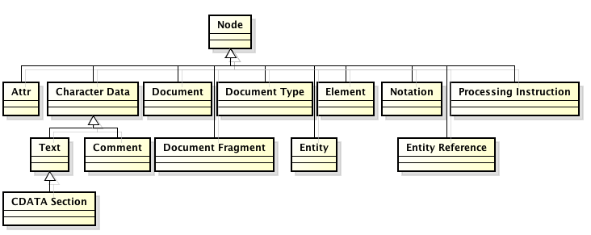

# 5.5 XML & JSON {#Java} 
© Γιάννης Κωστάρας

---

[<-](../5.4-JDBC/README.md) | [Δ](../../README.md)  

---

## XML
Η γλώσσα XML (Extensible Markup Language) είναι μια φορητή, φιλική στον άνθρωπο μορφή για ανταλλαγή δεδομένων μεταξύ προγραμμάτων. Όπως και η πιο γνωστή markup γλώσσα, η HTML (HyperText Markup Language) προέρχεται από το πρότυπο SGML (Standard Generalized Markup Language).

Ένα παράδειγμα αρχείου XML φαίνεται στη συνέχεια (για λόγους ασφαλείας οι κωδικοί θα πρέπει να είναι hashed αλλά για το παράδειγμά μας τους αφήνουμε ως έχει):

```xml
<?xml version="1.0" encoding="UTF-8" standalone="yes"?>
<users>
    <user userID="123456">
        <username>user</username>
        <password>pwd</password>
    </user>
    <user userID="13569">
        <username>admin</username>
        <password>admin</password>
    </user>
</users>
```
Η 1η γραμμή δηλώνει ότι πρόκειται για αρχείο XML. Οι ετικέττες (tags) χαρακτηρίζουν τα δεδομένα, ενώ μπορούν να δέχονται και γνωρίσματα (attributes). Έτσι, π.χ. στο παραπάνω παράδειγμα, το ```username``` είναι ένα tag ενώ το ```userID``` ένα attribute.

Υπάρχουν 4 κατηγορίες συντακτών (parsers) που μπορούν να επεξεργαστούν αρχεία XML:

* _Event Based Push_: [SAX (Simple API for XML)](http://www.saxproject.org) 
* _Event Based Pull_: StAX (Stream API for XML), [XMLPULL](http://www.xmlpull.org/)
* _Δενδρικοί_: DOM (Document Object Model), [JDOM](http://www.jdom.org/), [dom4j](https://dom4j.github.io/), [XOM](http://www.xom.nu/) κ.ά.
* _Data Binding_: [JAXB](https://github.com/javaee/jaxb-v2), [Castor](http://castor-data-binding.github.io/castor/), [JaxMe](http://jaxme.sourceforge.net/docs/site/index.html) κ.ά.

Οι _επικυρωτές (validators)_ επικυρώνουν το κατά πόσο ένα αρχείο XML είναι έγκυρο, π.χ. ότι έχει τις σωστές ετικέττες κλπ. Η σύνταξη ενός αρχείου XML περιγράφεται είτε σε ένα _Document Type Definition (DTD)_ είτε σ' ένα _XML Schema_. Οι επικυρωτές ελέγχουν κατά πόσο ένα αρχείο XML είναι _σωστά μορφοποιημένο (well formed)_ (π.χ. ότι υπάρχει μια ριζική ετικέττα, ότι υπάρχει ετικέττα κλεισίματος κλπ.) και _έγκυρο (valid)_ (δηλ. ότι είναι γραμμένο σύμφωνα με τους κανόνες στο DTD ή XML Schema). 

Με τη βοήθεια της γλώσσας _XSL (Extensible Style Language)_ μπορούμε να μετατρέψουμε ένα αρχείο XML σε μια άλλη μορφή (π.χ. HTML, PDF κλπ.).

### ```java.xml```
Το άρθρωμα ```java.xml``` περιλαμβάνει τους παρακάτω συντάκτες για XML:

* JAXP (Java API for XML Processing) επιτρέπει να χρησιμοποιήσετε βιβλιοθήκες από τρίτους πέραν απ' αυτές που προσφέρει το JDK 
* [SAX (Simple API for XML)](http://www.saxproject.org) η υλοποίηση του JDK για αναλυτή SAX
* StAX (Streaming API for XML) όπως ο SAX αλλά χωρίς event handlers
* DOM (W3C Document Object Model API) η υλοποίηση του JDK για αναλυτή SAX

Δυστυχώς, το πολύ γνωστό JAXB ([Java Architecture for XML Binding](https://en.wikipedia.org/wiki/Java_Architecture_for_XML_Binding)) δεν αποτελεί πλέον μέρος του JDK ([JEP 320](http://openjdk.java.net/jeps/320)).

#### SAX
Υπάρχουν δυο συντάκτες SAX: SAX 1 και SAX 2 (για τον οποίο θα μιλήσουμε εδώ). Ο συντάκτης SAX είναι πιο γρήγορος και χρησιμοποιεί λιγότερη μνήμη από τον DOM καθώς δεν απαιτεί να φορτώσει όλο το αρχείο XML στη μνήμη. Φυσικά, δε μπορούμε να χρησιμοποιήσουμε XPath μ' αυτόν τον συντάκτη.

Ας δούμε πώς μπορούμε να αναλύσουμε (parse) το πιο πάνω XML αρχείο με τον SAX 2.

Δημιουργήστε ένα νέο έργο Java στο NetBeans (π.χ. ```XMLParsersApp``` με μια κλάση με ```main()``` μέθοδο). Αντιγράψτε/δημιουργήστε το αρχείο XML (```users.xml```) στο φάκελο του έργου στο ίδιο επίπεδο με το φάκελο ```src``` (μεταβείτε στην καρτέλα _Files_ αντί για την _Projects_). 

```java
import static java.lang.System.*;
import java.io.IOException;
import java.util.logging.Level;
import java.util.logging.Logger;
import javax.xml.parsers.ParserConfigurationException;
import javax.xml.parsers.SAXParser;
import javax.xml.parsers.SAXParserFactory;
import org.xml.sax.SAXException;
import org.xml.sax.XMLReader;
import org.xml.sax.ext.DefaultHandler2;
import org.xml.sax.Attributes;
import org.xml.sax.SAXParseException;

public class SAXParserApp {

    public static void main(String[] args) {
        parse("users.xml");
    }

    static void parse(String file) {
        SAXParserFactory factory = SAXParserFactory.newInstance(); // newDefaultInstance();
//        factory.setNamespaceAware(true);
		try {
            SAXParser saxParser = factory.newSAXParser();
            XMLReader xmlReader = saxParser.getXMLReader();
			xmlReader.setContentHandler(new Handler());
            xmlReader.parse(file);
        } catch (ParserConfigurationException | SAXException | IOException e) {
            Logger.getLogger(SAXParserApp.class.getName()).log(Level.SEVERE, null, e);
        }
    }
}
```
Με τη βοήθεια του ```SAXParserFactory``` μπορούμε να λάβουμε έναν ```SAXParser```. Η μέθοδος ```SAXParserFactory.newDefaultInstance()``` εισήχθηκε στην έκδοση 9 και επιστρέφει την εξ'ορισμού υλοποίηση του συστήματος. Από τον ```SAXParser``` μπορούμε να λάβουμε έναν ```XMLReader``` του οποίου καλούμε τη μέθοδο ```parse()``` παρέχοντάς του το αρχείο XML που θέλουμε ν' αναλύσουμε. Θα πρέπει προηγουμένως να του παρέχουμε έναν ```Handler``` που θα κάνει τη δουλειά της ανάλυσης και του οποίου ο κώδικας παρέχεται στη συνέχεια:

```java
private static class Handler extends DefaultHandler2 {

   @Override
   public void startElement(String uri, String localName, String qName, Attributes attributes) {
       out.printf("<%s", qName);
       for (int i = 0; i < attributes.getLength(); i++) {
           out.printf(" @%s=%s", attributes.getLocalName(i), attributes.getValue(i));
           if (i != attributes.getLength()-1) {
             out.print(", ");
           }
       }
       out.println(">");
   }

   @Override
   public void characters(char[] ch, int start, int length) {
       for (int i = start; i < start + length; i++) {
           out.print(ch[i]);
       }
	   out.println();
   }

   @Override
   public void endElement(String uri, String localName, String qName) {
       out.printf("</%s>%n", qName);
   }

   @Override
   public void warning(SAXParseException saxpe) {
       out.printf("warning() %s%n", saxpe.toString());
   }

   @Override
   public void error(SAXParseException saxpe) {
       out.printf("error() %s%n", saxpe.toString());
   }

   @Override
   public void fatalError(SAXParseException saxpe) {
       out.printf("fatalError() %s%n", saxpe.toString());
   }
 }
``` 
Το αποτέλεσμα της εκτέλεσης:

```xml
<users>
<user userID=123456>
<username>
user
</username>
<password>
pwd
</password>
</user>
<user userID=13569>
<username>
admin
</username>
<password>
admin
</password>
</user>
</users>
```
Επεκτείνει τον ```DefaultHandler2``` (SAX2) (ο οποίος υλοποιεί τις διεπαφές ```ContentHandler, DTDHandler, EntityResolver, ErrorHandler```) και υπερφορτώνει τις μεθόδους:

* ```startElement()``` η οποία δηλώνει ότι βρήκε κάποια ετικέττα, π.χ. ```<user>``` και επίσης επεξεργάζεται τα γνωρίσματα (attributes)
* ```endElement()``` η οποία δηλώνει ότι βρήκε το κλείσιμο κάποιας ετικέττας, π.χ. ```</user>```
* ```characters()``` η οποία επεξεργάζεται τα δεδομένα μεταξύ ετικεττών
 
Υπάρχουν φυσικά πολλές περισσότερες μέθοδοι που επεξεργάζονται τα πάντα όπως μπορείτε να δείτε στο [ΑΡΙ](https://docs.oracle.com/en/java/javase/11/docs/api/java.xml/org/xml/sax/ext/DefaultHandler2.html) αλλά ξεφεύγουν από το σκοπό αυτών των εισαγωγικών μαθημάτων.

Μπορείτε ακόμα να επικυρώσετε το αρχείο ```users.xml``` με βάση κάποιο DTD ή XMLSchema. Το NetBeans σας επιτρέπει να παράγετε εύκολα ένα DTD αρχείο κάνοντας δεξί κλικ στο XML αρχείο σας και επιλέγοντας το μενού **Generate DTD**. Στη συνέχεια θα πρέπει να κάνετε τις εξής αλλαγές στο πρόγραμμά σας:

```java
public class SAXParserApp {
   private final static String FEAT_VAL = "http://xml.org/sax/features/validation";
//...

      xmlReader.setFeature(FEAT_VAL, true);
//...
```

#### StAX
Είναι παρόμοιος με τον SAX, αλλά αντί να χρειάζεται έναν event handler, επεξεργάζεται επαναληπτικά κάθε στοιχείο σε μια ροή.

Δημιουργήστε μια νέα κλάση ```StAXParserApp``` στο έργο που δημιουργήσατε προηγούμενα στο NetBeans και τη μέθοδο ```main()```.

```java
import java.io.File;
import java.io.FileInputStream;
import java.io.IOException;
import java.io.InputStream;
import static java.lang.System.out;
import javax.xml.stream.XMLInputFactory;
import javax.xml.stream.XMLStreamException;
import javax.xml.stream.XMLStreamReader;

public class StAXParserApp {

    public static void main(String[] args) {
        parse("users.xml");
    }

    private static void parse(String file) {
        XMLInputFactory factory = XMLInputFactory.newInstance();
        factory.setProperty(XMLInputFactory.IS_NAMESPACE_AWARE, false);  // εξ' ορισμού είναι true
        try (InputStream is = new FileInputStream(new File(file))) {
            XMLStreamReader parser = factory.createXMLStreamReader(is);
            while (parser.hasNext()) {
                int event = parser.next();
                switch (event) {
                    case XMLStreamReader.START_ELEMENT:
                        out.printf("<%s", parser.getLocalName()); // </element>
                        if (parser.getAttributeCount() > 0) {
                            out.printf(" %s=%s", parser.getAttributeName(0), parser.getAttributeValue(0));
                        }
                        out.println(">");
                        break;
                    case XMLStreamReader.CHARACTERS:
                        if (parser.hasText()) {
                            out.printf("%s%n", parser.getText());
                        }
                        break;
                    case XMLStreamReader.END_ELEMENT:
                        out.printf("</%s>%n", parser.getLocalName());  // </element>
                        break;
                    default:
                        break;
                }
            }
        } catch (IOException | XMLStreamException e) {
            e.printStackTrace();
        }
    }
}
```
Ο ```XMLStreamReader``` διαθέτει μια σειρά από γεγονότα (events):

* ```XMLStreamReader.START_ELEMENT```
* ```XMLStreamReader.CHARACTERS```
* ```XMLStreamReader.END_ELEMENT```

τα οποία επεξεργαζόμαστε σ' ένα βρόγχο επανάληψης.

#### DOM
Δημιουργεί ένα δέντρο ή γράφο στην μνήμη με βάση τα δεδομένα του αρχείου. Απαιτεί πολύ μνήμη για μεγάλα αρχεία. 

Για την ανάλυση ενός XML αρχείου με τη βοήθεια του αναλυτή DOM η διαδικασία είναι παρόμοια. Θα πρέπει να δημιουργήσετε έναν ```DocumentBuilder``` τον οποίο λαμβάνεται από ένα ```DocumentBuilderFactory``` κι από εκεί ν' αναλύσετε το αρχείο XML.

Δημιουργήστε μια νέα κλάση ```DOMParserApp``` στο έργο που δημιουργήσατε προηγούμενα στο NetBeans και τη μέθοδο ```main()```.

```java
public class DOMParserApp {

    public static void main(String[] args) {
        parse("users.xml");
    }

    private static void parse(String file) {
        DocumentBuilderFactory factory = DocumentBuilderFactory.newInstance();
        try {
            DocumentBuilder builder = factory.newDocumentBuilder();
            Document doc = builder.parse(file);
            Element root = doc.getDocumentElement();
            processElement(root);
        } catch (ParserConfigurationException | SAXException | IOException ex) {
            Logger.getLogger(DOMParserApp.class.getName()).log(Level.SEVERE, null, ex);
        }
    }
}
```

To ```Document``` δημιουργεί μια δενδρική μορφή του αρχείου μας στη μνήμη και μπορούμε να ανακτήσουμε το ριζικό στοιχείο, στην περίπτωσή μας το ```<users>```. Αποτελείται από αντικείμενα που υλοποιούν τη διεπαφή ```Node``` η ιεραρχία των οποίων φαίνεται στην ακόλουθη εικόνα.



**Εικόνα 1** _Ιεραρχία κλάσεων DOM_
	
Στη συνέχεια καλούμε την αναδρομική μέθοδο ```processElement()``` για να επεξεργαστούμε το DOM μοντέλο:
	
```java
/**
  * Recursively process each element in DOM.
  *
  * @param element
  */
 private static void processElement(Element element) {
     out.printf("<%s", element.getTagName());  // <element>
     NamedNodeMap attributes = element.getAttributes();  
     for (int i = 0; i < attributes.getLength(); i++) {
         Node attribute = attributes.item(i);
         out.printf(" %s=%s", attribute.getNodeName(), attribute.getNodeValue());  // attr=value
     }
     out.println(">");
     var textNode = (Text) element.getFirstChild();  
     out.printf("%s%n", textNode.getData().trim());	// <element>text</element>
     NodeList children = element.getChildNodes();
     for (int i = 0; i < children.getLength(); i++) {
         Node child = children.item(i);
         if (child instanceof Element) {
             var childElement = (Element) child;
             processElement(childElement);
         }
     }
     out.printf("</%s>%n", element.getTagName());  // </element>
 }
```	
Αποτέλεσμα:

```xml
<users>
<user userID=123456>
<username>
user
</username>
<password>
pwd
</password>
</user>
<user userID=13569>
<username>
admin
</username>
<password>
admin
</password>
</user>
</users>
```
Μπορείτε να χρησιμοποιήσετε και XPath με το DOM για ν' αναζητήσετε στοιχεία στο αρχείο XML:

```java
    private static String find(String path, Document doc) {
        String found = "";
        XPathFactory xpfactory = XPathFactory.newInstance();
        XPath xpath = xpfactory.newXPath();
        try {
            found = xpath.evaluate(path, doc);
        } catch (XPathExpressionException ex) {
            Logger.getLogger(DOMParserApp.class.getName()).log(Level.SEVERE, null, ex);
        }
        return found;
    }
```

Π.χ.

```java
out.println(find("/users/user/username", doc));   // επιστρέφει user
```
Για καλύτερη απόδοση, μπορείτε να μεταγλωττίσετε (compile) μια έκφραση XPath, αν πρόκειται να τη χρησιμοποιήσετε πολλές φορές, π.χ.:

```java
XPathExpression exp = xPath.compile("//password");
...
NodeList passwords = (NodeList) exp.evaluate(doc, XPathConstants.NODESET);
```


Μπορείτε επίσης να δημιουργήσετε XML αρχεία. Στο παρακάτω παράδειγμα δείχνουμε πώς μπορείτε να δημιουργήσετε τα περιεχόμενα του ```users.xml```:

```java
import java.io.FileNotFoundException;
import java.io.FileOutputStream;
import java.util.logging.Level;
import java.util.logging.Logger;
import javax.xml.parsers.DocumentBuilder;
import javax.xml.parsers.DocumentBuilderFactory;
import javax.xml.parsers.ParserConfigurationException;
import javax.xml.transform.OutputKeys;
import javax.xml.transform.Transformer;
import javax.xml.transform.TransformerConfigurationException;
import javax.xml.transform.TransformerException;
import javax.xml.transform.TransformerFactory;
import javax.xml.transform.dom.DOMSource;
import javax.xml.transform.stream.StreamResult;
import org.w3c.dom.Document;
import org.w3c.dom.Element;

public class DOMCreator {

    public static void main(String[] args) {
        generate("users_.xml");
    }

    private static void generate(String file) {
        DocumentBuilderFactory factory = DocumentBuilderFactory.newInstance();
        try {
            DocumentBuilder builder = factory.newDocumentBuilder();
            Document doc = builder.newDocument();
            Element root = doc.createElement("users");		// <users>
            Element user = doc.createElement("user");		// <user>   
            user.setAttribute("userID", "123456");		// <user userID="123456">
            Element username = doc.createElement("username");		//<username>
            username.appendChild(doc.createTextNode("admin"));		//admin
            user.appendChild(username);							
            Element password = doc.createElement("password");		//<password>
            password.appendChild(doc.createTextNode("admin"));		//admin
            user.appendChild(password);
            root.appendChild(user);
            doc.appendChild(root);
            writeToFile(doc, file);
        } catch (ParserConfigurationException ex) {
            Logger.getLogger(DOMParserApp.class.getName()).log(Level.SEVERE, null, ex);
        }
    }

    private static void writeToFile(Document doc, String file) {
        try {
            Transformer transformer = TransformerFactory.newInstance().newTransformer();
            transformer.setOutputProperty(OutputKeys.INDENT, "yes");
            transformer.transform(new DOMSource(doc), new StreamResult(new FileOutputStream(file)));
        } catch (TransformerConfigurationException ex) {
            Logger.getLogger(DOMCreator.class.getName()).log(Level.SEVERE, null, ex);
        } catch (FileNotFoundException | TransformerException ex) {
            Logger.getLogger(DOMCreator.class.getName()).log(Level.SEVERE, null, ex);
        }
    }
}
```

## JSON
Μια άλλη αναπαράσταση δεδομένων είναι η μορφή JSON (JavaScript Object Notation). Το JSON μπορεί ν' αναπαραστήσει δυο δομημένους τύπους: _αντικείμενα_ και _συστοιχίες (arrays)_. Υποστηρίζει τους παρακάτω τύπους δεδομένων: ```number, string, boolean, array, object, null```. Χρησιμοποιείται συχνά σε εφαρμογές Ajax, υπηρεσίες ιστού REST (RESTful web services) κ.α. Φυσικά, όπως και με την XML, μπορείτε να επικυρώσετε μια δομή JSON σε κάποιο σχήμα (schema) (βλ. [schemavalidator](https://www.jsonschemavalidator.net/) και [άλλες υλοποιήσεις](http://json-schema.org/implementations.html)).

Το [Java API for JSON Processing](https://www.oracle.com/technetwork/articles/java/json-1973242.html) παρέχει τη δυνατότητα να αναλύσετε (parse), παράγετε (generate), μετατρέψετε (transform), και να δημιουργήσετε ερωτήματα (query) δομές JSON. [Η JSON απαιτεί λιγότερη πληκτρολόγηση από την XML](www.json.org/xml.html). Το [JEP 198: Light-Weight JSON API](http://
openjdk.java.net/jeps/198) για την προσθήκη του JSON API στη Java _δεν_ είναι ακόμα μέρος του JDK. Άλλες βιβλιοθήκες:

* [GSon](https://mvnrepository.com/artifact/com.google.code.gson/gson) από τη Google
* [Jackson](https://mvnrepository.com/artifact/com.fasterxml.jackson.core/jackson-databind)
* [mJson](http://bolerio.github.io/mjson/)
* [JSON-Simple](https://code.google.com/archive/p/json-simple/)
* [JSON-P](https://jcp.org/en/jsr/detail?id=353) που αποτελεί μέρος του JEE

Είδαμε ήδη μια χρήση της JSON στο προηγούμενο μάθημα για επικοινωνία με τη MongoDB. Ένα παράδειγμα JSON φαίνεται παρακάτω:

```json
{
	"username": "admin", 
	"password": "admin",
	"blocked": false,
	"tries": 2
}
```
Δημιουργήστε ένα νέο έργο Java στο NetBeans και **New --> Other --> JSON File** για να δημιουργήσετε ένα νέο κενό αρχείο ```user.json``` και να επικολλήσετε τα ανωτέρω δεδομένα. Αποθηκεύστε το αρχείο στο ίδιο επίπεδο με το φάκελο ```src```. Δημιουργήστε μια νέα κλάση Java με μια ```main()``` μέθοδο.

Θα χρησιμοποιήσουμε τη βιβλιοθήκη GSon. Κατεβάστε την τελευταία έκδοση της [GSon](https://mvnrepository.com/artifact/com.google.code.gson/gson) και προσθέστε το αρχείο ```gson-x.x.x.jar``` στις βιβλιοθήκες (Libraries) του έργου.

Για να διαβάσουμε το αρχείο ```user.json```, δημιουργούμε ένα νέο αντικείμενο ```GSon``` και καλούμε τη μέθοδο ```.fromJson``` παρέχοντας έναν ```Reader``` και την κλάση στην οποία θα μετατραπεί το JSON: 

```java
public class JSONGSonApp {
	
	public static void main(String[] args) {
	    System.out.println(parseJSON("user.json"));
	}
	
    private static User parseJSON(String file) {
        Gson gson = new Gson();
        try (Reader r = new FileReader(file)) {
            return gson.fromJson(r, User.class);
        } catch (IOException e) {
            e.printStackTrace();
        }
        return null;
    }
	
	static class User {

	    private String username;
	    private String password;
	    private boolean blocked;
	    private int tries;
        
	    public User(String username, String password, boolean blocked, int tries) {
	        this.username = username;
	        this.password = password;
	        this.blocked = blocked;
	        this.tries = tries;
	    }
        
	    public String getUsername() {
	        return username;
	    }
        
	    public String getPassword() {
	        return password;
	    }
        
	    public boolean isBlocked() {
	        return blocked;
	    }
        
	    public int getTries() {
	        return tries;
	    }
        
	    @Override
	    public String toString() {
	        return "User{" + "username=" + username + ", password=" + password + ", blocked=" + blocked + ", tries=" + tries + '}';
	    }
	}	
}
```
Άλλος τρόπος είναι η μετατροπή του σ' ένα ```JsonObject``` με τη βοήθεια του ```JsonParser```:

```java
    public static void main(String[] args) {
		System.out.println(parseAsJsonObject("user.json"));
	}

    private static JsonObject parseAsJsonObject(String file) {
        try (Reader r = new FileReader(file)) {
            return new JsonParser().parse(r).getAsJsonObject();
        } catch (IOException e) {
            e.printStackTrace();
        }
        return null;
    }
```

Ένα ```JsonObject``` αποτελείται από ζεύγη ```key-value``` όπου ```value``` είναι τύπου ```JsonElement```. Μπορούμε ν' ανακτήσουμε οποιοδήποτε γνώρισμα, π.χ. 

```java
JsonObject jsonObject = new JsonParser().parse(r).getAsJsonObject();
jsonObject.get("tries").getAsInt();
```

Υπάρχουν, εκτός του ```JsonElement``` και τα ```JsonNull```, ```JsonArray``` και ```JsonPrimitive```.

Αντίστοιχα, για να γράψετε ένα αντικείμενο ```User``` ως JSON:

```java
public static void main(String[] args) {
        User user = new User("admin", "admin", false, 2);
        generateJSON(user, "user_.json");
}

private static void generateJSON(Object o, String file) {
    Gson gson = new Gson();
    try (Writer w = new FileWriter(file)) {
        w.append(gson.toJson(o));
    } catch (IOException e) {
        e.printStackTrace();
    }
}
```

Άλλος τρόπος:
```java
public static void main(String[] args) {
        JsonObject userObj = new JsonObject();
        userObj.addProperty("username", "user");
        userObj.addProperty("password", "user");
        userObj.addProperty("blocked", false);
        userObj.addProperty("tries", 2);
        generateJSON(userObj, "user__.json");
		
        for (String key : userObj.keySet()) {
            System.out.println(key + ":" + userObj.get(key));
        }		
}

private static void generateJSON(JsonObject o, String file) {
    Gson gson = new Gson();
    try (Writer w = new FileWriter(file)) {
        w.append(gson.toJson(o));
    } catch (IOException e) {
        e.printStackTrace();
    }
}
```
## Περίληψη
Σ' αυτό το μάθημα είδαμε δυο πολύ διάσημες αναπαραστάσεις δεδομένων: XML και JSON και είδαμ πώς μπορούμε να διαβάσουμε και να γράψουμε σ' αυτές τις μορφές με τη Java. 

## Ασκήσεις
1. Είδαμε πώς να δημιουργήσουμε το ```users.xml``` με το DOM parser. Επαναλάβετε το ίδιο με τον StAX parser.
1. Ξαναγράψτε τα παραδείγματα JSON χρησιμοποιώντας τις βιβλιοθήκες mJSon και Jackson. 

## Πηγές
1. ["The Java Tutorial"](https://docs.oracle.com/javase/tutorial/)
1. Darwin I. F. (2014), _Java Cookbook_, 3rd Ed., O’ Reilly.
1. Deitel P., Deitel H. (2018), _Java How to Program_, 11th Ed., Safari.
1. Friesen J. (2019), _Java XML and JSON_, 2nd Ed., APress.
1. Eckel B. (2006), _Thinking in Java_, 4th Ed., Prentice-Hall.
1. Horstmann C. S. (2016), _Core Java, Volume ΙΙ_, 11th Ed., Pearson.
1. Horstmann C. S. (2018), _Core Java SE 9 for the impatient_, 2nd Ed., Addison-Wesley.
1. Long F. et al. (2012), _The CERT® Oracle® Secure Coding Standard for Java™_, Addison-Wesley.  
1. [Java Notes for Professionals](https://books.goalkicker.com/JavaBook/JavaNotesForProfessionals.pdf)
1. [GSon user guide](https://github.com/google/gson/blob/master/UserGuide.md)
1. [JSON Path](http://www.javadoc.io/doc/com.jayway.jsonpath/json-path/2.4.0) 

---

[<-](../5.4-JDBC/README.md) | [Δ](../../README.md)  

---