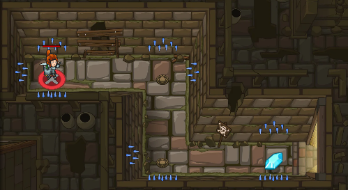
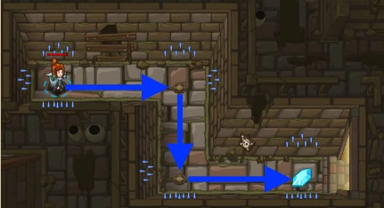
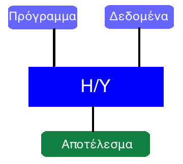
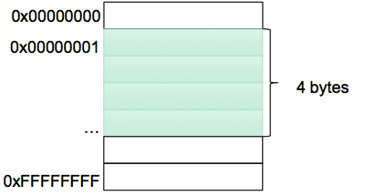

# 1.2 Αλγόριθμοι και Προγράμματα {#Intro} 
© Γιάννης Κωστάρας

---

[<](../1.1-Introduction/README.md) | [Δ](../../README.md)  | [>](../1.3-JavaHistory/README.md)

---
[](1.2-Algorithm.ipynb)

_Στο μάθημα 1.4 θα μάθουμε πώς να εγκαταστήσουμε το Jupyter Lab ώστε να μπορούμε να ανοίγουμε αρχεία ```.ipynb```. Μέχρι τότε, μπορείτε να τα ανοίξετε στο [Colab](https://colab.research.google.com/) και επιλέγοντας **Upload**. Δυστυχώς δεν υποστηρίζει Java αλλά θα μπορέσετε να διαβάσετε το αρχείο._

_Tell me and I forget.
Teach me and I remember.
Involve me and I learn.
(Benjamin Franklin)_

### Μαθησιακοί στόχοι
Σε αυτήν την ενότητα θα μάθουμε:

* την έννοια του αλγορίθμου
* τι είναι πρόγραμμα
* τις κατηγορίες γλωσσών προγραμματισμού
* για τα σφάλματα προγραμματισμού (bugs)

## Αλγόριθμος
Όλα τα προγράμματα βασίζονται σε αλγορίθμους. Ως _αλγόριθμος_ ορίζεται ως ένα σύνολο καθορισμένων βημάτων που εκτελούνται σε πεπερασμένο χρόνο για την επίλυση ενός προβλήματος. Με απλά λόγια, ένας αλγόριθμος είναι μια "συνταγή" που καθορίζει επακριβώς τη συγκεκριμένη ακολουθία βημάτων που απαιτούνται για να λυθεί ένα πρόβλημα. Ένας αλγόριθμος τροφοδοτείται με τα δεδομένα του προβλήματος, τα επεξεργάζεται ακολουθώντας τα βήματα από τα οποία αποτελείται και παράγει ένα αποτέλεσμα που αντιστοιχεί στη λύση του προβλήματος.

Π.χ. πώς μπορούμε να επιλύσουμε το πρόβλημα της [οργάνωσης μιας εκπαιδευτικής εκδρομής](https://photodentro.edu.gr/v/item/ds/8521/1011) ή του [ποσού πληρωμής σε χώρο στάθμευσης αυτοκινήτων](http://photodentro.edu.gr/aggregator/lo/photodentro-lor-8521-1003);

Χρησιμοποιούμε αλγόριθμους καθημερινά χωρίς να το γνωρίζουμε. Ας δούμε μερικά παραδείγματα.

Τι οδηγίες θα δώσετε σε κάποιον άπειρο στη μαγειρική για να μαγειρέψει δυο τηγανητά αυγά;

1. Άναψε το μάτι της κουζίνας στο 3
1. Τοποθέτησε το τηγάνι στο μάτι της κουζίνας, που έχεις ήδη ανάψει.
1. Πρόσθεσε στο τηγάνι 3 κουταλιές της σούπας λάδι.
1. Βγάλε 2 αυγά από το ψυγείο.
1. Για καθένα από τα αυγά
   α. Χτύπα το στην άκρη του τηγανιού μέχρι να ραγίσει
   β. Πιάσε με τα δυο χέρια τις δυο άκρες του αυγού και άνοιξέ το πάνω από το τηγάνι ώστε να πέσει το περιεχόμενο μέσα στο τηγάνι
1. Περίμενε 5' μέχρι να ψηθούν τ' αυγά
1. Κλείσε το μάτι της κουζίνας που άνοιξες
1. Βγάλε το τηγάνι από το μάτι της κουζίνας
1. Πάρε ένα καθαρό πιάτο από το συρτάρι
1. Άδειασε τα αυγά από το τηγάνι στο πιάτο
1. Πρόσθεσε λίγο αλάτι ή πιπέρι
1. Σερβίρισε τα αυγά

Όπως βλέπετε, οι οδηγίες είναι εκνευριστικά λεπτομερείς για έναν άνθρωπο, όχι όμως και για ένα ρομπότ αν του αναθέτατε να κάνει τη δουλειά.

Άλλο ένα παράδειγμα, είναι αυτό της πρόσθεσης δυο αριθμών:
```
         1     1    
 123    123    123   123
+789   +789   +789  +789
____   ____   ____  ____
          2     12   912
```

1. Πρόσθεσε μεταξύ τους τα τελευταία ψηφία του αριθμού.
1. Γράψε το τελευταίο ψηφίο του αποτελέσματος κι αν το αποτέλεσμα έχει κι άλλα ψηφία πρόσθεσε 1 στα ψηφία της προηγούμενης στήλης
1. Επανέλαβε το προηγούμενο βήμα μέχρι να μην υπάρχουν άλλα ψηφία

Παρατηρήστε ότι ο τρόπος είναι μηχανικός ώστε να μπορεί να εκτελεστεί από έναν Η/Υ. Άλλο ένα χαρακτηριστικό του είναι ότι λειτουργεί _πάντα_ άσχετα από το ποιους αριθμούς (δηλ. δεδομένα) του δώσουμε. 

Στην εικόνα 1.2.1 βλέπετε τον πρωταγωνιστή ενός παιχνιδιού ο οποίος πρέπει να φτάσει μέχρι το διαμάντι χωρίς να ακουμπήσει στα καρφιά που προεξέχουν από τους τείχους. Πώς θα καθοδηγήσετε τον πρωταγωνιστή ώστε να φτάσει με επιτυχία τον στόχο του; 



**Εικόνα 1.2.1** _Πρόβλημα (Πηγή: [CodeCombat](https://codecombat.com))_ 

Ας το σκεφτούμε λίγο. Ο ήρωάς μας θα πρέπει να προχωρήσει δεξιά, μόλις φθάσει στον τοίχο να μετακινηθεί προς τα κάτω, μόλις φθάσει στον τοίχο να μετακινηθεί πάλι δεξιά για να πάρει το διαμάντι. Αν θέλαμε να δώσουμε τις παραπάνω οδηγίες στον Η/Υ και με την προϋπόθεση ότι ο τελευταίος μιλάει τη γλώσσα μας, θα του δίναμε κάποιες σαν τις παρακάτω:

1. Προχώρα δεξιά 10 βήματα 
1. Προχώρα κάτω 10 βήματα
1. Προχώρα δεξιά 10 βήματα
1. Πάρε το διαμάντι

Ή αν το παιχνίδι διαθέτει εντολές όπως οι παρακάτω:

1. Προχώρα μπροστά για 10 βήματα
1. Στρίψε δεξιά 90 μοίρες
1. Προχώρα μπροστά για 10 βήματα
1. Στρίψε αριστερά 90 μοίρες
1. Προχώρα μπροστά για 10 βήματα
1. Πάρε το διαμάντι

Μόλις δημιουργήσατε δυο αλγορίθμους για τη επίλυση του προβλήματος του παιχνιδιού της εικόνας 1.2.1. Το αποτέλεσμα του αλγορίθμου φαίνεται στην εικόνα 1.2.2.



**Εικόνα 1.2.2** _Λύση παιχνιδιού (Πηγή: [CodeCombat](https://codecombat.com))_ 

Παρατηρήστε ότι είναι σημαντικό να ακολουθήσετε τα βήματα του αλγορίθμου κατά γράμμα. Αν π.χ. προχωρήσετε 11 βήματα αντί για 10 θα πέσετε πάνω στα καρφιά με αποτέλεσμα να χάσετε τον ήρωά σας. Επίσης, τα παραπάνω βήματα δουλεύουν για οποιονδήποτε άλλον χαρακτήρα πάρει τη θέση του πρωταγωνιστή μας.

Τα βήματα που αποτελούν έναν αλγόριθμο ονομάζονται ''οδηγίες'' ή ''εντολές''. Αν ακολουθηθούν οι οδηγίες ενός αλγορίθμου στο τέλος πρέπει να προκύπτει ένα αποτέλεσμα, ένα ''έργο''. 

Οι αλγόριθμοι που κατασκευάζουμε πρέπει να πληρούν κάποιες προϋποθέσεις: 

1. τα βήματα πρέπει να είναι πεπερασμένα, δηλ. ότι κάποτε θα τελειώσει επιτυγχάνοντας τον αρχικό σκοπό δηλ. τη λύση του προβλήματος
1. οι εντολές ενός αλγορίθμου πρέπει να έχουν ακρίβεια και σαφήνεια, ώστε να μην μπερδευτεί αυτός που θα υλοποιήσει τον αλγόριθμο και τις εκτελέσει με λανθασμένο τρόπο. Διαφορετικά λέμε ότι έχουμε ένα λογικό σφάλμα ή bug.

   Το όνομα _αλγόριθμος_ προέρχεται από τον πέρση μαθηματικό _Muhammed ibn-Musa al-Khu-warizmi_ (780-850 μ.Χ.) ο οποίος εισήγαγε την έννοια του αλγορίθμου αναφερόμενος σε μια μαθηματική επεξεργασία αριθμών. Για την ονομασία αυτής της διαδικασίας χρησιμοποιήθηκε στην αρχή η λατινική λέξη _algorismus_, που δημιουργήθηκε από την παραφθορά του συνθετικού του ονόματος al-Khuwarizmi (ο άνθρωπος από την πόλη Khuwarizmi). Στα τέλη του 17ου αιώνα η ονομασία συνδυάστηκε με την ελληνική λέξη _αριθμός_ και μετατράπηκε στη λέξη _αλγόριθμος_ (_algorithm_).

Ας δούμε ακόμα ένα παράδειγμα: «Ένας βαρκάρης θέλει να περάσει με μια βάρκα ένα πρόβατο, ένα λύκο και ένα καφάσι με φράουλες στην απέναντι όχθη ενός ποταμού. Η βάρκα όμως είναι μικρή και μπορεί να μεταφέρει, εκτός από τον ίδιο, ακόμα άλλο ένα αντικείμενο. Ωστόσο δεν πρέπει να μείνουν μαζί ο λύκος με το πρόβατο και το πρόβατο με τις φράουλες (για ευνόητους λόγους). Μπορείτε να δώσετε οδηγίες στο βαρκάρη για το πώς πρέπει να κάνει τη μεταφορά τους;»

Ας σκεφτούμε λίγο το πρόβλημα:

* Δεδομένα: 1 πρόβατο, 1 λύκος, 1 καφάσι με φράουλες, μία θέση επιπλέον στη βάρκα, 2 όχθες ποταμού.
* Περιορισμοί:	Ο λύκος δεν πρέπει να μείνει μαζί με το πρόβατο. Το πρόβατο δεν πρέπει να μείνει μαζί με τις φράουλες.
* Ζητούμενο: Να περάσει ο λύκος, το πρόβατο και το καφάσι με τις φράουλες στην απέναντι όχθη.

Σκεφτείτε μια πιθανή λύση του προβλήματος, δηλ. έναν αλγόριθμο. Μπορείτε να την εφαρμόσετε σ' αυτήν την [ιστοσελίδα](http://photodentro.edu.gr/lor/r/8521/760?locale=el); 

    (_Απάντηση στο τέλος της σελίδας_).

## Πρόγραμμα
Πώς όμως μπορεί να εκτελέσει ένας Η/Υ έναν αλγόριθμο αντί για μας; Η απάντηση είναι με ένα _πρόγραμμα_. 

Ένα **πρόγραμμα** είναι η αναπαράσταση ενός αλγορίθμου γραμμένη σε γλώσσα κατανοητή για έναν υπολογιστή. Ένα πρόγραμμα αποτελείται από μία σειρά εντολών που δίνονται στον υπολογιστή με σκοπό να εκτελέσει κάποια συγκεκριμένη λειτουργία ή να υπολογίσει κάποιο επιθυμητό αποτέλεσμα. Η εργασία σύνταξης των προγραμμάτων ονομάζεται **προγραμματισμός**, ενώ τα άτομα που γράφουν και συντάσσουν ένα πρόγραμμα ονομάζονται **προγραμματιστές**, κάτι το οποίο επιθυμείτε να γίνετε κι εσείς παρακολουθώντας αυτό το μάθημα! Τέλος, οι γλώσσες που γράφονται τα προγράμματα λέγονται **γλώσσες προγραμματισμού**.




**Εικόνα 1.2.3** _Πρόγραμμα + Δεδομένα = Αποτέλεσμα_ 

Προγραμματισμός είναι η μέθοδος με την οποία ένας χρήστης μπορεί να καθοδηγήσει έναν Η/Υ στην επίλυση προβλημάτων. Ένα πρόγραμμα είναι μια λίστα από οδηγίες αναγκαίες για τον Η/Υ ώστε να εκτελέσει μια εργασία. Οι οδηγίες αυτές είναι γραμμένες σε μια γλώσσα προγραμματισμού. Ο προγραμματισμός είναι μια διαδικασία η οποία αποτελείται από 7 βήματα:

1. Καθορισμός του προβλήματος
2. Ανάλυση του προβλήματος
3. Σχεδίαση του προγράμματος και δημιουργία αλγορίθμων 
4. Υλοποίηση του προγράμματος σε μια γλώσσα προγραμματισμού
5. Έλεγχος του προγράμματος και διόρθωση σφαλμάτων
6. Συντήρηση του προγράμματος σε μελλοντικές αλλαγές
7. Τεκμηρίωση

Σε έναν Η/Υ εκτελούνται πολλά προγράμματα. Σίγουρα τα έχετε χρησιμοποιήσει κι εσείς. Έτσι, ένας πλοηγός (browser) για να πλοηγηθείτε στο Διαδίκτυο όπως ο Firefox ή ο Edge είναι ένα πρόγραμμα. Άλλα προγράμματα είναι τα προγράμματα ζωγραφικής, επεξεργασίας κειμένου, ακόμα και τα ηλεκτρονικά παιχνίδια αλλά και το ίδιο το Λειτουργικό Σύστημα, όπως τα Windows, το Linux, το MacOS, είναι κι αυτά προγράμματα γραμμένα σε κάποια ή κάποιες γλώσσες προγραμματισμού. 

Όπως είπαμε στην αρχή αυτού του μαθήματος, ένας Η/Υ είναι ένας συνδυασμός από Υλικό (Hardware) και Λογισμικό (Software). Ένας Η/Υ χωρίς λογισμικό (δηλ. χωρίς προγράμματα) μας είναι άχρηστος (μπορούμε μόνο να τον εκκινήσουμε και να τον κλείσουμε). Επίσης, αν έχουμε μόνο προγράμματα σε κάποιες μονάδες αποθήκευσης (π.χ. σε κάποιο DVD ή usb stick) χωρίς το υλικό (κάποιον Η/Υ) για να τα εκτελέσουμε, πάλι μας είναι άχρηστα.

Είναι σημαντικό να υπογραμμίσουμε ότι ένας αλγόριθμος μπορεί να εκτελεστεί από διαφορετικά προγράμματα γραμμένα σε διαφορετικές γλώσσες προγραμματισμού! Αλλά για ποιο λόγο χρειαζόμαστε μια γλώσσα προγραμματισμού για να γράψουμε προγράμματα;

Οι Η/Υ αποτελούνται από μικροκυκλώματα (τρανζίστορς) τα οποία μεταφέρουν μικρούς παλμούς ηλεκτρικού ρεύματος οι οποίοι μπορούν να αναπαρασταθούν ως μια μορφή κώδικα. Οι Η/Υ καταλαβαίνουν μόνο δυο καταστάσεις (αν και πλέον υπάρχουν κβαντικοί Η/Υ που καταλαβαίνουν περισσότερες από 2 καταστάσεις αλλά δεν θα μας απασχολήσουν σε αυτό το εισαγωγικό μάθημα): 

* ```0``` Ανοιχτό κύκλωμα, δεν περνάει ρεύμα
* ```1``` Κλειστό κύκλωμα, περνάει ρεύμα

_[Γραφική αναπαράσταση](https://photodentro.edu.gr/v/item/ds/8521/1008)_

Το παραπάνω είναι το δυαδικό σύστημα αρίθμησης όπως ίσως γνωρίζετε από τα μαθηματικά. Οι άνθρωποι όμως νιώθουμε πιο άνετα με το δεκαδικό σύστημα αρίθμησης:

| Δεκαδικό | 0 | 1 | 2 | 3 | 4 | 5 | 6 | 7 | 8 | 9 | 10 | 11 | 12 | 13 | 14 | 15
| Δυαδικό | 0 | 1 | 10 | 11 | 100 | 101 | 110 | 111 | 1000 | 1001 | 1010 | 1011 | 1100 | 1101 | 1110 | 1111

Παρατηρούμε ότι όπως και στο δεκαδικό σύστημα αρίθμησης (το οποίο περιλαμβάνει τα ψηφία 0 - 9), αν θέλουμε να αναπαραστήσουμε αριθμούς μεγαλύτερους του 9, συνδυάζουμε δυο ψηφία, το ίδιο κάνουμε και στο δυαδικό για να αναπαραστήσουμε αριθμούς μεγαλύτερους του 1.

Αλλά όλοι γνωρίζουμε ότι εκτός από αριθμούς, μπορούμε να γράψουμε και λέξεις και προτάσεις σε έναν Η/Υ. Πώς είναι δυνατόν όταν ο Η/Υ καταλαβαίνει μόνο 0 και 1; 

Η απάντηση είναι απλή. Με τον ίδιο τρόπο που αναπαριστούμε αριθμούς στο δυαδικό σύστημα μπορούμε να αναπαραστήσουμε και οποιονδήποτε χαρακτήρα, αρκεί να συμφωνήσουμε όλοι ότι π.χ. με τον κωδικό ```01000100``` αναπαριστούμε το γράμμα ```Α```. Δείτε πώς σε [αυτήν την ιστοσελίδα](https://photodentro.edu.gr/v/item/ds/8521/1171). Για το σκοπό αυτό έχουν αναπτυχθεί κώδικες αναπαράστασης χαρακτήρων όπως είναι ο [ASCII - American Standard Code for Information Exchange](https://www.pliroforiki-edu.gr/unit/ch02ch07ch02-kodikas-xaraktiron-ascii/) ο οποίος μπορούσε να απεικονίζει 2<sup>7</sup> (=128) διαφορετικούς χαρακτήρες. Το μειονέκτημά του είναι ότι δεν είναι δυνατή η αναπαράσταση χαρακτήρων άλλου αλφαβήτου εκτός από το λατινικό. Αργότερα επεκτάθηκε στους 2<sup>8</sup> = 256 διαφορετικούς χαρακτήρες κι έτσι μπορεί να αναπαριστά και το αλφάβητο μιας δεύτερης γλώσσας (π.χ. ελληνικά, φιλανδικά κλπ.). Για το σκοπό αυτό αναπτύχθηκαν τα συστήματα αναπαράστασης [Unicode](https://el.wikipedia.org/wiki/Unicode) τα οποία μπορούν να αναπαραστήσουν τους χαρακτήρες για όλες τις γλώσσες του πλανήτη (2<sup>16</sup> = 65.536 χαρακτήρες). Το πλήθος αυτό αρκεί για να συμπεριλάβει όλους τους χαρακτήρες των γλωσσών, όπως ελληνικά, κινέζικα, κορεάτικα και αραβικά.

Χάρις στους διάφορους τύπους αρχείων (π.χ. ```jpg, png, mp3, mpeg, mp4```) οι δυαδικοί κώδικες μπορούν να αναπαραστήσουν ήχο, εικόνα και βίντεο.

Η κύρια μνήμη του υπολογιστή μπορεί να θεωρηθεί ως ένας μεγάλος μονοδιάστατος πίνακας από bytes, όπως φαίνεται στο ακόλουθο σχήμα. (1 byte = 8 bits ή δυαδικά ψηφία όπως μάθαμε στο προηγούμενο μάθημα).



**Εικόνα 1.2.4** _Αναπαράσταση της κύριας μνήμης του Η/Υ ως μονοδιάστατος πίνακας από bytes_

Κάθε byte της κύριας μνήμης αναγνωρίζεται από μια μοναδική διεύθυνση όπως βλέπουμε στην παραπάνω εικόνα. Οι διευθύνσεις αυτές συνήθως αναπαραρίστανται στο δεκαεξαδικό σύστημα αρίθμησης (το οποίο αποτελείται από τα ψηφία 0, 1, 2, ..., 9, A, B, C, D, E, F).

Οι πρώτοι Η/Υ προγραμματίζονταν με τις λεγόμενες [γλώσσες μηχανής](http://cgi.di.uoa.gr/~std06249/pliroforiki&ekpaideusi/___3.html), ή γλώσσες 1ης γενιάς, οι οποίες αποτελούνταν από μακροσκελείς ακολουθίες από δυαδικά ψηφία. Όπως, καταλαβαίνετε, ο προγραμματισμός ήταν πολύ δύσκολος και ένα λάθος σε ένα ψηφίο ήταν πολύ δύσκολο να βρεθεί.

**Παράδειγμα προγράμματος γλώσσας μηχανής**
```
Διεύθυνση  Δεδομένα
0001007c   e2503001
00010080   da000002
00010084   e0000093
00010088   e2533001
0001008c   1afffffc
```

Το επόμενο βήμα ήταν η δημιουργία γλωσσών που ήταν πιο φιλικές στους ανθρώπους, τις λεγόμενες [συμβολικές γλώσσες ή γλώσσες assembly](http://cgi.di.uoa.gr/~std06249/pliroforiki&ekpaideusi/__2.html), ή γλώσσες 2ης γενιάς. Στις γλώσσες αυτές οι εντολές της γλώσσας μηχανής αντιστοιχίζονται με μία λέξη η οποία θυμίζει το τι πραγματικά κάνει η εντολή. Αν και ήταν ένα βήμα προς τη σωστή κατεύθυνση, οι γλώσσες αυτές ήταν εξαρτημένες από την αρχιτεκτονική του επεξεργαστή του Η/Υ στον οποίο έπρεπε να εκτελεστεί το πρόγραμμα. 

```
Διεύθυνση  Δεδομένα   Εντολή Assembly
0001007c   e2503001   subs r3, r0, #1
00010080   da000002   ble   0x10090
00010084   e0000093   mul   r0, r3, r0
00010088   e2533001   subs r3, r3, #1
0001008c   1afffffc   bne   0x10084
00010090   ---
```

Οι [γλώσσες υψηλού επιπέδου](http://cgi.di.uoa.gr/~std06249/pliroforiki&ekpaideusi/___4.html) ή γλώσσες γενικού σκοπού ή γλώσσες τρίτης γενιάς, χρησιμοποιούν πλέον λεξιλόγιο και συντακτικό που είναι κατανοητά από τον άνθρωπο και βοήθησαν στο να συγγράφουμε προγράμματα που είναι ανεξάρτητα της μηχανής που θα τα εκτελέσει (παρόλο που υπάρχουν και γλώσσες που είναι γραμμένες για συγκεκριμένες πλατφόρμες). Σ' αυτές τις γλώσσες περιγράφουμε στον Η/Υ τον τρόπο (δηλ. τον αλγόριθμο) με τον οποίο θέλουμε να εκτελέσει κάποια εργασία χρησιμοποιώντας τις εντολές και τη σύνταξη της γλώσσας. 

Υπάρχουν και οι [γλώσσες 4ης γενιάς](http://cgi.di.uoa.gr/~std06249/pliroforiki&ekpaideusi/___5.html) όπου δεν εξηγούμε στον Η/Υ το _πώς_ αλλά το _τι_ θέλουμε να εκτελέσει. Παραδείγματα τέτοιων γλωσσών προγραμματισμού είναι η γλώσσα _SQL - Structured Query Language_ η οποία χρησιμοποιείται για να επεξεργαζόμαστε δεδομένα στις βάσεις δεδομένων.

**Παράδειγμα γλώσσας SQL**
```SELECT * FROM Employee WHERE salary > 2000```

Ας δούμε πώς θα μπορούσαμε να εκτελέσουμε τον αλγόριθμο της εικόνας 1.2.2 σε μια υποθετική γλώσσα προγραμματισμού:

```
hero.moveRight(10)
hero.moveDown(10)
hero.moveRight(10)
hero.pick(diamond)
```

```hero``` είναι ο ήρωάς μας και μπορεί να εκτελέσει κάποιες ενέργειες, όπως να μετακινηθεί δεξιά (```moveRight```), πάνω (```moveUp```), κάτω (```moveDown```) ή αριστερά (```moveLeft```) και να συλλέξει αντικείμενα (```pick```). Επίσης, μπορούμε να του δώσουμε περισσότερες πληροφορίες (π.χ. πόσα βήματα να κινηθεί, τι αντικείμενα να συλλέξει κλπ.). 

Δοκιμάστε να γράψετε το [πρώτο σας πρόγραμμα που θα εκτελέσει η γάτα για να φάει όλα τα τυράκια](https://photodentro.edu.gr/v/item/ds/8521/2455). 

**Το γνωρίζατε;** _Ο πρώτος προγραμματιστής ήταν γυναίκα! Πρόκειται για τη σύζυγο του Charles Babbage ο οποίος προσπάθησε να δημιουργήσει τον πρώτο υπολογιστή. Η φίλη του, Ada, κοντέσσα του Lovelace, έγραψε, το 1842, μια σειρά από εντολές για να υπολογίσουν πολύπλοκες μαθηματικές πράξεις οι οποίες θα έτρεχαν στη μηχανή του Babbage όταν αυτή ολοκληρωνόταν. Για χάριν της, σήμερα υπάρχει μια γλώσσα προγραμματισμού η οποία ονομάζεται Ada._

## Γλώσσες προγραμματισμού
Στην προηγούμενη ενότητα είδαμε ένα παράδειγμα μιας υποθετικής γλώσσας προγραμματισμού. Οι γλώσσες προγραμματισμού είναι τεχνητές γλώσσες που χρησιμοποιούνται για την επικοινωνία του ανθρώπου με τον Η/Υ. Όπως και οι ανθρώπινες γλώσσες (αγγλική, ελληνική κλπ.) έχουν κι αυτές το δικό τους λεξιλόγιο και συντακτικό τα οποία πρέπει να μάθουμε για να μπορούμε να γράφουμε σωστά προγράμματα και να επικοινωνούμε έτσι με τους Η/Υ. Αν και μια μέρα οι Η/Υ θα μπορούν να καταλαβαίνουν τις ανθρώπινες γλώσσες, μέχρι τότε θα πρέπει να μάθουμε εμείς κάποια γλώσσα προγραμματισμού για να επικοινωνούμε μαζί τους.

Μια γλώσσα προγραμματισμού χαρακτηρίζεται από:

* το _αλφάβητό_ της, δηλ. τους επιτρεπτούς χαρακτήρες και σύμβολα που μπορούμε να χρησιμοποιήσουμε
* το _λεξιλόγιό_ της, δηλ. το σύνολο των λέξεων, ή εντολών, που αποτελούν τη γλώσσα
* το _συντακτικό_ της, δηλ. το σύνολο των κανόνων που πρέπει να ακολουθήσουμε προκειμένου να δημιουργήσουμε προγράμματα με τις εντολές τα οποία είναι συντακτικά σωστά 

Γιατί δεν υπάρχει μόνο μια γλώσσα προγραμματισμού; Δυστυχώς, δεν υπάρχει μόνο μια γλώσσα προγραμματισμού που να τα κάνει όλα τέλεια, όπως δεν υπάρχει ένα μόνο ρούχο, ένας μόνο τύπος αυτοκινήτου, μια μόνο κατηγορία κινητού τηλεφώνου. 

Σε αυτό το μάθημα θα μάθουμε να προγραμματίζουμε με τη γλώσσα προγραμματισμού Java, και το πιο σημαντικό, θα μάθουμε πώς να σκεπτόμαστε αλγοριθμικά ώστε να λύνουμε προβλήματα, ή πιο σωστά, να προγραμματίζουμε τους Η/Υ να τα λύνουν για εμάς. Μην ξεχνάτε ότι ο προγραμματισμός και η αλγοριθμική, εν τέλει, είναι η επίλυση προβλημάτων με την βοήθεια των Η/Υ. 

Δυστυχώς ο προγραμματισμός δεν διδάσκεται. Δεν μπορούμε να μάθουμε να προγραμματίζουμε διαβάζοντας βιβλία για προγραμματισμό, γράϕοντας προγράμματα στο χαρτί, ή απλά παρακολουθώντας αυτό το μάθημα χωρίς οι ίδιοι να μπούμε στον κόπο να λύσουμε ασκήσεις. Ο μόνος τρόπος να μάθουμε να προγραμματίζουμε είναι να γράϕουμε προγράμματα στον υπολογιστή, να τα εκτελούμε, να βρίσκουμε τα λάθη που σίγουρα έχουμε κάνει, να τα διορθώνουμε, να εκτελούμε πάλι τα προγράμματα, να ξαναβρίσκουμε λάθη, να τα διορθώνουμε πάλι, μέχρι να καταϕέρουμε να κάνουμε τα προγράμματά μας να επιλύουν τα προβλήματά μας όπως πρέπει. H ανάγνωση και κατανόηση καλογραμμένων, τεκμηριωμένων και ορθών προγραμμάτων αν και χρήσιμη, από μόνη της δεν αρκεί. Είναι σαν το κολύμπι, δεν μαθαίνεται αν δεν κολυμπήσεις. 

## Σφάλματα (bugs)
Μια σύντομη αναφορά στα σφάλματα. Ένα σφάλμα (bug) στον κώδικά μας οδηγεί σε λάθος αποτελέσματα που ανάλογα με την εφαρμογή μπορεί να είναι και καταστροφικά. Η αγγλική ονομασία προήλθε από ένα σκώρο που βρέθηκε στον Η/Υ Harvard Mark II το 1945! Κατά γενική ομολογία όλα τα προγράμματα έχουν bugs, όσο καλά και να τα τεστάρουμε. Μερικά από τα πιο καταστροφικά υπολογιστικά σφάλματα είναι τα παρακάτω:

1. Η καταστροφή του διαστημοπλοίου [Ariane 5](https://en.wikipedia.org/wiki/Ariane_5), μόλις 37'' μετά την απογείωση, οφείλεται σε ένα υπολογιστικό λάθος όπου μια μεταβλητή 64-bit μετατράπηκε σε 16-bit χάνοντας πολύτιμη ακρίβεια με αποτέλεσμα ο πύραυλος να στρίψει κατά 90º προς λάθος κατεύθυνση.
1. Ο [Therac-25](https://en.wikipedia.org/wiki/Therac-25) ήταν μια μηχανή ελεγχόμενη από Η/Υ που στόχευε σε θεραπεία μέσω ακτινοβολίας ακτίνων Χ. Λόγω σφαλμάτων του λογισμικού του, σε μερικές περιπτώσεις οι ασθενείς εκτέθηκαν σε ακτινοβολία που ήταν 100 φορές περισσότερη του κανονικού με αποτέλεσμα θάνατο ή σοβαρές βλάβες.

Ένας τρόπος αντιμετώπισης των σφαλμάτων είναι η _εκσφαλμάτωση_ ή _αποσφαλμάτωση (debugging)_, όπως θα δούμε, όπου εκτελούμε το πρόγραμμα βήμα-βήμα μελετώντας κάθε φορά τις τιμές των μεταβλητών. Επίσης, απαιτείται εκτεταμένος έλεγχος (testing) κάτω από όλες τις πιθανές εισόδους. Πολλά από τα προγράμματά μας θα έχουν bugs καθώς για εκπαιδευτικούς λόγους δε θα καλύπτουν όλες τις περιπτώσεις. Θα μπορείτε να τα βρείτε;

## Ασκήσεις - Εργασίες
1. Γράψτε τα βήματα του αλγορίθμου για την πρόσθεση 5 ακέραιων αριθμών. Πώς θα αλλάξετε τον αλγόριθμο ώστε να υπολογίσετε τον μέσο όρο (Μ.Ο.) των 5 αριθμών;
1. Προσθέτετε 10.000€ σε έναν τραπεζικό με ετήσιο επιτόκιο 5%. Σε πόσα χρόνια θα διπλασιαστεί το κεφάλαιό σας; Γράψτε τον αλγόριθμο επίλυσης του προβλήματος.
1. Υποθέστε ότι ο πάροχος κινητής τηλεφωνίας σας χρεώνει 29,95€ για μέχρι 300 λεπτά χρόνο ομιλίας και από 0,45€ για κάθε επιπλέον λεπτό, συν 12,5% φόρους και άλλες χρεώσεις. Γράψτε τον αλγόριθμο υπολογισμού της μηναίας χρέωσης για έναν δοθέν αριθμό λεπτών ομιλίας του μήνα, π.χ. 200', 300', 333'.

## Λύση προβλήματος του βαρκάρη αυτής της σελίδας
1. Βάλε το πρόβατο στη βάρκα.
1. Πήγαινε στην απέναντι όχθη.
1. Άφησε το πρόβατο στην όχθη.
1. Γύρνα πίσω στην αρχική όχθη.
1. Φόρτωσε το καφάσι με τις φράουλες.
1. Πήγαινε στην απέναντι όχθη.
1. Άφησε το καφάσι στην όχθη.
1. Βάλε το πρόβατο στη βάρκα.
1. Πήγαινε στην αρχική όχθη.
1. Άφησε το πρόβατο στην όχθη.
1. Βάλε το λύκο στη βάρκα.
1. Πήγαινε στην απέναντι όχθη.
1. Άφησε το λύκο στην όχθη.
1. Γύρνα πίσω στην αρχική όχθη.
1. Βάλε το πρόβατο στη βάρκα.
1. Πήγαινε στην απέναντι όχθη.
1. Άφησε το πρόβατο στην όχθη.

Μπορείτε να την εφαρμόσετε σ' αυτήν την [ιστοσελίδα](http://photodentro.edu.gr/lor/r/8521/760?locale=el).

## Πηγές
1. [Εισαγωγή στην Έννοια του Αλγορίθμου και στον Προγραμματισμό](http://ebooks.edu.gr/modules/ebook/show.php/DSB102/536/3538,14536/index1_1.html)
1. Ανδριωτάκης Μ. (2020), ["Η επανάσταση των αλγορίθμων"](https://www-kathimerini-gr.cdn.ampproject.org/c/s/www.kathimerini.gr/opinion/interviews/561206089/i-epanastasi-ton-algorithmon/amp/).
1. Gifford C. (2015), _Awsome Algorithms and Creative Coding_, Wayland.
1. Horstmann C. (), [Big Java 5 - Chapter 1 - Introduction](https://www.cs.ryerson.ca/~aferworn/courses/CPS109/CLASSES/week01/ch01/index.html)

---

[<](../1.1-Introduction/README.md) | [Δ](../../README.md)  | [>](../1.3-JavaHistory/README.md)

---