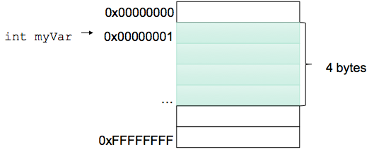

# 1.6 Πρωτογενείς τύποι δεδομένων, μεταβλητές, εκφράσεις
© Γιάννης Κωστάρας

---

[<](../1.5-JavaBasics/README.md) | [∆](../../README.md) | [>](../1.7-Strings/README.md)

---

[](1.6-PrimitiveDataTypes.ipynb)

### Μαθησιακοί στόχοι
Σε αυτήν την ενότητα θα μάθουμε:

* για τους πρωτογενείς τύπους δεδομένων (primitive data types) της γλώσσας 
* την προτεραιότητα των πράξεων
* τι είναι μεταβλητή (variable) και την εμβέλειά της
* τι είναι σταθερά (constant)
* για μετατροπές μεταξύ τύπων δεδομένων (casting)
* για τη δήλωση ```var```

## Εισαγωγή

Η Java διαθέτει 8 πρωτογενείς τύπους δεδομένων (primitive data types):

* 4 ακέραιους τύπους δεδομένων
* 2 δεκαδικούς τύπους δεδομένων
* 1 λογικό τύπο
* 1 τύπο δεδομένων για χαρακτήρες 

## Αριθμητικοί τύποι δεδομένων
Οι παρακάτω πίνακες δείχνουν τους αριθμητικούς τύπους δεδομένων που υποστηρίζονται από τη γλώσσα καθώς και το εύρος τιμών καθενός από αυτούς.

**Πίνακας 1.6.1** _Ακέραιοι τύποι δεδομένων_

| Τύπος δεδομένων | Αποθηκευτικός χώρος | Ελάχιστη τιμή | Μέγιστη τιμή |
| ```byte``` | 1 byte | ```–128``` (-2<sup>7</sup>) (```Byte.MIN_VALUE```)  | ```127```  (2<sup>7</sup>-1) ```Byte.MAX_VALUE``` |
| ```short``` | 2 bytes | ```–32,768``` (-2<sup>15</sup>) (```Short.MIN_VALUE```) | ```32,767``` (2<sup>15</sup>-1) (```Short.MAX_VALUE```) | 
| ```int``` | 4 bytes | ```–2,147,483,648``` (-2<sup>31</sup>) (```Integer.MIN_VALUE```) | ```2,147,483,647``` (2<sup>31</sup>-1) ```Integer.MAX_VALUE``` |
| ```long``` | 8 bytes | ```–9,223,372,036,854,775,808``` (-2<sup>63</sup>) ```Long.MIN_VALUE``` | ```9,223,372,036,854,775,807```  (2<sup>63</sup>-1) ```Long.MAX_VALUE``` |

Οι ακέραιοι αριθμοί μπορούν να αναπαρασταθούν με τις ακόλουθες μορφές:

* Δεκαδικός: π.χ. ```15```
* Οκταδικός: π.χ. ```023```
* Δεκαεξαδικός: π.χ. ```0xAB```
* Δυαδικός: π.χ. ```0b101```
* Αναπαράσταση μεγάλων αριθμών: π.χ. ```123_456_789```

**Σημείωση.** _Στο [API](https://docs.oracle.com/en/java/javase/17/docs/api/java.base/java/lang/Integer.html) της γλώσσας μπορείτε να βρείτε χρήσιμες εντολές όπως π.χ. η ```Integer.parseInt(String s, int radix)``` που επιτρέπει τη μετατροπή ενός αριθμού σε μια άλλη βάση (radix, π.χ. δυαδικό σύστημα) στο δεκαδικό σύστημα. Π.χ. ```Integer.parseInt("0101", 2)```._

Τέλος, η δήλωση 
```java
jshell> 10
$1 ==> 10
```
δηλώνει έναν αριθμό τύπου ```int```.
```java
jshell> Integer.class.isInstance(10);
$2 ===> true

jshell> Long.class.isInstance(10);
$3 ===> false
```
Αν θέλετε να ορίσετε έναν αριθμό τύπου ```long``` θα πρέπει να προσθέσετε ένα ```l``` ή καλύτερα ένα ```L``` στο τέλος του.
```java
jshell> Long.class.isInstance(10L);
$4 ===> true
```
**Πίνακας 1.6.2** _Τύποι δεδομένων κινητής υποδιαστολής σύμφωνα με το πρότυπο ΙΕΕΕ 754_

| Τύπος δεδομένων | Αποθηκευτικός χώρος | Ελάχιστη τιμή | Μέγιστη τιμή |
| ```float``` | 4 bytes | από -3.40282347<sup>+38</sup> (```Float.MIN_VALUE```) έως -1.4<sup>-45</sup> | από 1.4<sup>-45</sup> έως 3.4028235<sup>+38</sup> (```Float.MAX_VALUE```) |
| ```double``` | 8 bytes | από -1.7976931348623157<sup>+308</sup> (```Double.MIN_VALUE```) έως -4.9<sup>-324</sup> | από 4.9<sup>-324</sup> έως 1.7976931348623157<sup>+308</sup> (```Double.MAX_VALUE```) |

* ```float```: 1 bit για το πρόσημο, 23 bits για την mantissa (~7 δεκαδικά ψηφία), 8 bits για τον εκθέτη
* ```double```: 1 bit για το πρόσημο, 52 bits για την mantissa (~16 δεκαδικά ψηφία), 11 bits για τον εκθέτη

**Σημείωση** _Υπενθυμίζουμε ότι 1 byte = 8 bits (1 bit είναι ένα δυαδικό ψηφίο, δηλ. 0 ή 1)_

Οι πραγματικοί ή δεκαδικοί αριθμοί ή αριθμοί κινητής υποδιαστολής (π.χ. ```3.14```) μπορούν να έχουν και τις ακόλουθες μορφές:
  
* ```125E-3 // 10^-3 = 0.125```
* ```0x1.0p-3 // 2^-3 = 0.125```

Τέλος, η δήλωση 
```java
jshell> 3.14
$1 ==> 3.14
```
δηλώνει έναν αριθμό τύπου ```double```.
```java
jshell> Double.class.isInstance(3.14);
$2 ===> true

jshell> Float.class.isInstance(3.14);
$3 ===> false
```
Αν θέλετε να ορίσετε έναν αριθμό τύπου ```float``` θα πρέπει να προσθέσετε ένα ```f``` ή καλύτερα ένα ```F``` στο τέλος του.
```java
jshell> Float.class.isInstance(3.14f);
$4 ===> true
```

### Προτεραιότητα αριθμητικών πράξεων

Οι τελεστές και η προτεραιότητά τους φαίνεται στον ακόλουθο πίνακα (όσο πιο πάνω τόσο μεγαλύτερη η προτεραιότητα).

**Πίνακας 1.6.3** _Προτεραιότητα αριθμητικών πράξεων_

| ```+ -``` | Πρόσημα
| ```()``` | Παρενθέσεις
| ```* / %``` | Πολλ/σμός, Διαίρεση, Υπόλοιπο διαίρεσης ```(a / b) * b + r = a```
| ```+ -``` | Πρόσθεση, Αφαίρεση
| ```< > <= >= == !=``` | Μεγαλύτερο, μικρότερο, μεγαλύτερο ίσο, μικρότερο ίσο, ίσο, άνισο

Π.χ. πόσο κάνει η παρακάτω πράξη;
```java
jshell> 5 + 2 * 4
```
Αν απαντήσατε ```28``` τότε δε λάβατε υπόψιν σας την προτεραιότητα των τελεστών όπως φαίνεται στον παραπάνω πίνακα. Καθώς ο πολλ/σμός (```*```) έχει υψηλότερη προτεραιότητα από την πρόσθεση, θα εκτελεστεί πρώτα και μετά η πρόσθεση. Η σωστή απάντηση είναι ```13```.

Πώς μπορούμε να αλλάξουμε την προτεραιότητα των πράξεων; Μα με παρενθέσεις φυσικά.

```java
jshell> (5 + 2) * 4
$1 ==> 28
```

Επίσης η υλοποίηση του υπόλοιπου διαίρεσης, ή modulo (```%```) διαφέρει στις διάφορες γλώσσες προγραμματισμού (βλ. [Wikpedia](https://en.wikipedia.org/wiki/Modulo_operation)). Π.χ. στη Java το πρόσημο εξαρτάται μόνο από τον πρώτο τελεστέο:

```java
jshell> 3 % -5
$1 ==> 3

jshell> -3 % 5
$2 ==> -3

jshell> -3 % -5
$3 ==> -3
```

### Υπερχείλιση (overflow) & υποχείλιση (underflow)

Καλό είναι να χρησιμοποιείτε τον κατάλληλο τύπο δεδομένων ανάλογα με τις ανάγκες του προγράμματός σας. Αν χρησιμοποιήσετε τύπο δεδομένων με μεγαλύτερο εύρος τιμών από αυτό που χρειάζεται το πρόγραμμά σας, τότε σπαταλάτε άσκοπα μνήμη. Αν από την άλλη, χρησιμοποιήσετε τύπο δεδομένων με μικρότερο εύρος τιμών απ' ότι χρειάζεται το πρόγραμμά σας, τότε κινδυνεύετε να έχετε υπερχείλιση (overflow) ή υποχείλιση (underflow) και τα αποτελέσματα που θα πάρετε να μην είναι σωστά. 

Π.χ.

```java
jshell> System.out.println(1000000 * 1000000)
-727379968
```
Το 10<sup>12</sup> είναι ο μεγαλύτεροs ακέραιος που μπορεί να χωρέσει στον τύπο δεδομένων ```int```. Μεγαλύτεροι αριθμοί απ' αυτόν αποκόπτονται (truncated) για να χωρέσουν στα 4 bytes, με αποτελέσματα παρόμοια του προηγούμενου παραδείγματος. Και το κυριότερο, δεν δίνεται καμιά προειδοποίηση (warning) κάτι που μπορεί να έχει καταστροφικά αποτελέσματα όπως, π.χ. η καταστροφή του διαστημοπλοίου [Ariane 5](https://en.wikipedia.org/wiki/Ariane_5).

### Λάθη στρογγυλοποίησης
Μεγάλη προσοχή επίσης χρειάζεται στις πράξεις μεταξύ δεδομένων κινητής υποδιαστολής, όπως βλέπετε στο παρακάτω παράδειγμα:
```java
jshell> 2.0d - 2.01d
$1 ==> -0.009999999999999787
```
Λόγω του τρόπου [αναπαράστασής τους](https://en.wikipedia.org/wiki/IEEE_754) από τους Η/Υ, δεν μπορείτε να βασίζεστε στις πράξεις τέτοιων αριθμών. Η Java παρέχει κάποιες κλάσεις ([BigInteger](https://docs.oracle.com/en/java/javase/17/docs/api/java.base/java/math/BigInteger.html), [BigDecimal](https://docs.oracle.com/en/java/javase/17/docs/api/java.base/java/math/BigDecimal.html)) γι' αυτό το σκοπό, όπως θα δούμε σε ακόλουθα μαθήματα. Αν θέλετε να συγκρίνετε δυο αριθμούς τύπου ```float``` χρησιμοποιήστε την εντολή ```Float.compare(float,float)``` και για τύπου ```double``` την ```Double.compare(double, double)``` αντίστοιχα. 

## Μεταβλητές
Τα δεδομένα που χρησιμοποιούμε στα προγράμματά μας αποθηκεύονται στη μνήμη του Η/Υ και καλούνται από την Κ.Μ.Ε. για επεξεργασία. Η μνήμη του υπολογιστή μπορεί να θεωρηθεί ως ένας μεγάλος μονοδιάστατος πίνακας από bytes, όπως φαίνεται στο ακόλουθο σχήμα.



**Εικόνα 1.6.1** _Αναπαράσταση της κύριας μνήμης του Η/Υ ως μονοδιάστατος πίνακας από bytes_

Για πολλούς λόγους (π.χ. ασφάλειας) δεν μπορούμε να έχουμε άμεση πρόσβαση σε μια διεύθυνση μνήμης. Αντιθέτως, πρόσβαση στη μνήμη μας παρέχει η γλώσσα προγραμματισμού μέσω κλήσεων του Λ.Σ. Πώς όμως μπορούμε να προσπελάσουμε τη θέση μνήμης που μας παρείχε το Λ.Σ.; Αυτό γίνεται μέσω των μεταβλητών. Οι μεταβλητές είναι ονόματα που η γλώσσα προγραμματισμού αντιστοιχίζει με τη βοήθεια του Λ.Σ. σε κάποια φυσική διεύθυνση μνήμης.

Οι μεταβλητές της Java έχουν τρεις ιδιότητες:

* αναφέρονται σε μια φυσική θέση μνήμης
* δέχονται συγκεριμένη μορφή τιμών
* έχουν ένα όνομα


Το όνομα μιας μεταβλητής στη Java μπορεί να περιλαμβάνει λατινικούς χαρακτήρες ```a..Z, A..Z``` αριθμούς ```0..9, $``` και ```_```. Δεν μπορεί να αρχίζει όμως με αριθμητικό ψηφίο ούτε μπορεί να είναι δεσμευμένη λέξη (δηλ. κάποια από τις εντολές) της γλώσσας. Από την έκδοση 9 και μετά το ```_``` είναι δεσμευμένη λέξη της γλώσσας.

Πιο αναλυτικά:

*  Ο πρώτος χαρακτήρας μιας μεταβλητής πρέπει να είναι είτε ένας από τους λατινικούς χαρακτήρες ```'A'-'Z', 'a'-'z'```, είτε το ```'_'```, ή το ```'$'```
*  Μετά από το πρώτο γράμμα μπορούμε να συμπεριλάβουμε και αριθμούς (```0-9```) στο όνομα
*  Αν το όνομα αποτελείται από δύο ή περισσότερες λέξεις δεν επιτρέπεται το κενό ανάμεσα τους
*  Δεν επιτρέπονται άλλα σύμβολα όπως ```+``` ή ```©```
*  Μπορούμε να χρησιμοποιήσουμε όσους χαρακτήρες θέλουμε χωρίς να υπάρχει όριο
*  Η Java είναι case sensitive οπότε τα κεφαλαία και τα πεζά γράμματα είναι διαφορετικά
*  Δεν μπορεί το όνομα της μεταβλητής να είναι μια από τις εντολές (δεσμευμένες λέξεις) της γλώσσας

Επίσης, ο τύπος δεδομένων που διαλέξαμε για να ορίσουμε μια μεταβλητή λέει στη Java πόσες θέσεις μνήμης να δεσμεύσει γι' αυτή τη μεταβλητή (ανάλογα με το εύρος τιμών του τύπου δεδομένων). Π.χ. για έναν ακέραιο δεσμεύονται 4 bytes συνεχόμενων θέσεων μνήμης.

Π.χ.
```java
int myVar;    // ορισμός μια νέας μεταβλητής με όνομα myVar τύπου int
```
Μπορείτε ν' αρχικοποιήσετε μια μεταβλητή τη στιγμή του ορισμού της:
```
Τύπος_μεταβλητής όνομα_μεταβλητής = έκφραση
```
Π.χ.
```java
jshell> int x = 3;
x ==> 3

jshell> int y = 5*x*x-2;        // y=5∙x^2-2
y ==> 43

jshell> /vars
|    int x = 3
|    int y = 43
```
Η παρακάτω έκφραση είναι έγκυρη στη Java, υπάρχει για να τρελάνει τους μαθηματικούς και αυξάνει την τιμή της μεταβλητής ```c``` κατά ένα:

```java
jshell> int c = 0;
c ==> 0

jshell> c = c + 1;
c ==> 1
```
Η παρεξήγηση υφίσταται στο γεγονός ότι ενώ στα μαθηματικά ο τελεστής ```=``` σημαίνει _ισότητα_, στη Java και άλλες γλώσσες προγραμματισμού σημαίνει _εκχώρηση_. Έτσι η παραπάνω έκφραση σημαίνει: "λάβε την τρέχουσα τιμή της ```c```, πρόσθεσε ```1``` και εκχώρησε το αποτέλεσμα της πράξης πάλι στη μεταβλητή ```c```". Ο τελεστής ισότητας είναι ο ```==```. Υπάρχουν και οι τελεστές εκχώρησης (ή συντομογραφίας) (βλ. Πίνακα 1.6.12). Π.χ. ο ισοδύναμος τελεστής εκχώρησης και προσαύξησης τιμής είναι:

```java
jshell> c += 1;   // ισοδυναμεί με c = c + 1;
c ==> 2

jshell> c++;	// ισοδυναμεί με c = c + 1;
c ==> 3
```

Οι τελεστές προσαύξησης (```++```) και προσαφαίρεσης (```--```) μπορούν να είναι είτε επιθεματικοί (π.χ. ```c++```) είτε προθεματικοί (π.χ. ```++c```). Η διαφορά τους είναι ότι στον προθεματικό πρώτα αυξάνεται η τιμή της μεταβλητής και μετά επιστρέφεται η τιμή της μεταβλητής, ενώ στον επιθεματικό πρώτα επιστρέφεται η τιμή της μεταβλητής και μετά αυξάνεται η τιμή της.

Ας δούμε μερικά παραδείγματα:

```java
jshell> int x = 3;
x ==> 3

jshell> int answer = x++ * 10;  // answer = 30, x = 4
answer ==> 30

jshell> int x = 3;
x ==> 3

jshell> answer = ++x * 10;      // answer = 40, x = 4
answer ==> 40
```

Στο πρώτο παράδειγμα χρησιμοποιούμε τον επιθεματικό τελεστή προσαύξησης. Ως αποτέλεσμα πολλαπλασιάζεται η τρέχουσα τιμή της μεταβλητής ```x``` (```3```) με το ```10``` και αποθηκεύεται στην μεταβλητή ```answer``` και στη συνέχεια αυξάνεται η τιμή της ```x``` κατά ```1```.

Στο δεύτερο παράδειγμα χρησιμοποιούμε τον προθεματικό τελεστή προσαύξησης. Ως αποτέλεσμα πρώτα προσαυξάνεται η τιμή της ```x``` κατά ```1``` (```4```) και στη συνέχεια πολλαπλασιάζεται με το ```10``` και αποθηκεύεται στην μεταβλητή ```answer```.

## Εμβέλεια μεταβλητών
Τα άγκιστρα στη Java δηλώνουν ένα μπλοκ κώδικα. Οι μεταβλητές είναι ορατές μόνο στο μπλοκ που ορίζονται μέσα σε ```{ }``` και σε εμφωλιασμένα μπλοκ.

```java
{                                     __
   int x;                               |
   {                           __       |
	int y;                       | y    | x
   }                           __       |
   ...  // η y δεν υπάρχει              |
}                                      __
```

## Σταθερές
Ενώ οι μεταβλητές μπορούν ν' αλλάξουν την τιμή τους κατά τη διάρκεια εκτέλεσης του προγράμματος, αυτό δεν μπορεί να γίνει με τις σταθερές. Ορίζετε μια σταθερά με τη λέξη ```final```:
```java
final double PI = 3.14159; 
final int ARRAY_SIZE = 100;
```
Από σύμβαση, οι σταθερές δηλώνονται με κεφαλαία γράμματα.

_**Προσοχή!** Στο jshell οι δεσμευμένες λέξεις ```public, protected, private, static, final``` δεν αναγνωρίζονται._ Επομένως, μπορείτε άνετα να γράψετε:

```java
jshell> final double PI = 3.14159;
PI ==> 3.14159

jshell> PI=1
PI ==> 1.0
```
Στο προγράμματα Java όμως που θα μάθουμε να γράφουμε σε επόμενα μαθήματα, αν προσπαθήσουμε ν' αλλάξουμε την τιμή μιας σταθεράς, τότε ο μεταγλωττιστής θα εγείρει λάθος μεταγλώττισης.

## Λογικοί τύποι δεδομένων και λογικές πράξεις

**Πίνακας 1.6.4** _Λογικός τύπος δεδομένων_

| Τύπος δεδομένων | Αποθηκευτικός χώρος | Τιμές |
| boolean | 1 bit | ```true,false``` |

**Πίνακας 1.6.5** _Λογικές πράξεις_

| ```!``` | Λογικό Όχι (Not)
| ```&&, ||``` | Λογικό ΚΑΙ (And), Ή (Or)
| ```&, |``` | Λογικό ΚΑΙ (And), Ή (Or)
| ```^``` | Λογικό XOR

Παρακάτω φαίνονται οι πίνακες αληθείας των πράξεων αυτών (F: Ψευδής, T: Αληθής) (διαβάστε περισσότερα [εδώ](https://schoolpress.sch.gr/macs/?p=250)):

**Πίνακας 1.6.6** _Λογικό ΌΧΙ (NOT)_
| ```x``` | ```!x``` |
| F | T |
| T | F |

**Πίνακας 1.6.7** _Λογικό ΚΑΙ (AND)_
| ```x``` | ```y``` | ```x && y``` ή ```x & y```
| F | F | F
| F | T | F
| T | F | F
| T | T | T

**Πίνακας 1.6.8** _Λογικό Ή (OR)_
| ```x``` | ```y``` | ```x || y``` ή ```x | y```
| F | F | F
| F | T | T
| T | F | T
| T | T | T

**Πίνακας 1.6.9** _Λογικό XOR_
| ```x``` | ```y``` | ```x ^ y```
| F | F | F
| F | T | T
| T | F | T
| T | T | F


Όπως παρατηρείτε, υπάρχουν δυο είδη λογικών τελεστών για το λογικό ΚΑΙ (```&&``` και ```&```) και το λογικό Ή (```||``` και ```|```). Η διαφορά τους είναι η εξής:

* Οι λογικοί τελεστές ```&&, ||```, ή _τελεστές συνθήκης_, ελέγχουν το 2ο όρισμα μόνο αν δεν μπορούν να συνάγουν αποτέλεσμα από το πρώτο μόνο όρισμα. Π.χ. στη συνθήκη ```x && y```, αν το ```x == false``` τότε δεν ελέγχεται το δεύτερο όρισμα καθώς γνωρίζουμε ήδη ότι η τιμή της συνθήκης είναι ```false```
* Οι λογικοί τελεστές ```&, |```, ή _δυαδικοί τελεστές_, ελέγχουν πάντα και τα δυο ορίσματα

Αυτό πολλές φορές μπορεί ν' αποτελέσει πηγή λάθους (bug). Π.χ. στο παρακάτω παράδειγμα (που χρησιμοποιεί πίνακες ή συστοιχίες για τις οποίες θα μιλήσουμε σε επόμενο μάθημα), ο πίνακας ```array``` μπορεί να έχει τιμή ```null```, αλλά επειδή χρησιμοποιείται ο τελεστής ```&``` αντί για τον ```&&```, ελέγχονται όλες οι παραμέτροι με αποτέλεσμα π.χ. η ```array.lenght``` να επιστρέφει λάθος εκτέλεσης καθώς προσπαθούμε να καλέσουμε τη μέθοδο ```length``` στην ```array``` που είναι ```null```. ```null``` σημαίνει το τίποτα.

```java
if (array != null & i >= 0 & i < array.length) {
	// ...
} else {
	// ...
}
```
Στην πλειονότητα των περιπτώσεων, χρησιμοποιείτε τους τελεστές συνθήκης καθώς είναι πιο αποδοτικοί.

Εξασκηθείτε στους λογικούς τελεστές κάνοντας την τελευταία άσκηση.

## Τύπος δεδομένων χαρακτήρας

**Πίνακας 1.6.10**  _Τύπος δεδομένων χαρακτήρας_

| Τύπος δεδομένων | Αποθηκευτικός χώρος | Ελάχιστη τιμή | Μέγιστη τιμή |
| ```char``` | 2 bytes (16-bit Unicode) | ```'\u0000'``` (```Character.MIN_VALUE```) |  ```'\uffff'``` (```Character.MAX_VALUE```) |

Είναι ο μόνος τύπος δεδομένων της γλώσσας που είναι μη προσημασμένος (δηλ. παίρνει μόνο θετικές τιμές).

**Πίνακας 1.6.11** _Πράξεις σε χαρακτήρες_

| ```+``` | ```char``` μετατρέπεται σε ```int```
| ```++``` | προσαύξηση
| ```--``` | προσαφαίρεση

Οι χαρακτήρες αναπαρίστανται στους Η/Υ ως δυαδικοί αριθμοί. Υπάρχουν διάφορα πρότυπα αναπαράστασης χαρακτήρων στους Η/Υ έτσι ώστε να αναπαρίστανται με τον ίδιο κωδικό. Το πιο γνωστό τέτοιο πρότυπο είναι ο κώδικας [ASCII](http://www.asciitable.com/).

```java
jshell> char char1 = 'α'
char1 ==> 'α’

jshell> char char2 = 'γ'
char2 ==> 'γ’

jshell> char char3 = char1 + char2
|  Error:
|  incompatible types: possible lossy conversion from int to char
|  char char3 = char1 + char2;
|               ^-----------^
```
Αν το παραπάνω τμήμα κώδικα σας μπέρδεψε, έχετε δίκιο. Κατά πρώτον, ο τύπος δεδομένων ```char``` θεωρείται αριθμητικός τύπος δεδομένων. Κατά δεύτερον, ο τελεστής ```+``` (αλλά και οι ```-, *, /, %```) μετατρέπει σιωπηλά τα ορίσματά του σε ```int``` με αποτέλεσμα το αποτέλεσμα να είναι ```int``` και να μη χωράει σε ```char```. Οπότε υπάρχουν δυο τρόποι να διορθώσουμε το λάθος. 

Ο πρώτος είναι να αλλάξουμε τον τύπο δεδομένων του αποτελέσματος σε ```int```: 

```java
jshell> int char3 = char1 + char2
char3 ==> 1892
```
Ο 2ος τρόπος είναι να κάνουμε μετατροπή τύπου δεδομένων (casting) όπως θα δούμε στην επόμενη υποενότητα.
```java
jshell> char char3 = (char) (char1 + char2);
char3 ==> 'ݤ' 

jshell> int char1 = 'α'	 // κωδικός ASCII
char1 ==> 945

jshell> char char1 = 945  // κωδικός ASCII
char1 ==> 'α'

jshell> ++char1
$1 ==> 'β'

jshell> --char1
$2 ==> 'α'
```

## Μετατροπές τύπων δεδομένων (casting)

Μερικές φορές είναι απαραίτητο να μετατρέψετε μια μεταβλητή ενός τύπου δεδομένων σ' έναν άλλον, όπως φαίνεται στο ακόλουθο σχήμα:


**Εικόνα 1.6.2** _Διάγραμμα μετατροπών τύπων δεδομένων_

* ```--->``` δηλώνει ότι μπορεί να χαθεί ακρίβεια (π.χ. μετατροπή από ```float ---> int```)

Όταν η μετατροπή γίνεται σε κάποιον τύπο δεδομένων μεγαλύτερης χωρητικότητας (διεύρυνση τύπου δεδομένων), τότε δεν υπάρχει πρόβλημα (έμμεση μετατροπή), όταν όμως γίνεται σε κάποιον τύπο δεδομένων μικρότερης χωρητικότητας (συρρίκνωση), τότε μπορεί να χαθεί ακρίβεια με ίσως τραγικά αποτελέσματα. 

Η σύνταξη μετατροπής σε άλλον τύπο δεδομένων (casting) γίνεται δηλώνοντας τον νέο τύπο δεδομένων μέσα σε παρενθέσεις μπροστά από το δεδομένο. Στο παρακάτω παράδειγμα βλέπουμε πώς μπορεί να χαθεί ακρίβεια κάνοντας casting ενός ακέραιου αριθμού σε byte (το byte μπορεί να πάρει τιμή μέχρι το 127): 

```java
jshell> (byte)260
$1 ==> 4 
```
(Ο τύπος ```byte``` 'χωράει' μέχρι το ```127``` (βλ. πίνακα 1.6.1). Το αποτέλεσμα υπολογίζεται ως εξής: ```260 % 128 = 4```).

Ας δούμε άλλο ένα παράδειγμα. Τι επιστρέφει η παρακάτω ακολουθία μετατροπών;

```java
jshell> (int) (char) (byte) -1
$2 ==> 65535
```
αντί για ```-1```! Η μετατροπή ```(byte) -1``` μετατρέπει τον ακέραιο ```-1``` σε ```byte``` (32 bits -> 8 bits). Η 2η μετατροπή μετατρέπει το ```byte``` σε ```char``` (8 bits -> 16 bits). Η τρίτη μετατρέπει το ```char``` σε ```int``` (16 bits -> 32 bits). Η μετατροπή ```int -> byte``` αφήνει τον ```-1``` αμετάβλητο. Η μετατροπή όμως ```byte -> char``` όχι, γιατί ο τύπος δεδομένων ```char``` είναι απρόσημος (```0 - 2^16-1```), με αποτέλεσμα ο ```-1``` να μετατρέπεται στον ```2^16-1``` ή ```65535```:

```java
jshell> Integer.toBinaryString(-1)
$3 ==> "11111111111111111111111111111111"

jshell> Integer.toBinaryString((int) (char) (byte) -1)
$4 ==> "1111111111111111"
```

## Προτεραιότητα τελεστών
**Πίνακας 1.6.12** _Προτεραιότητα τελεστών_

| ```+ -``` | Πρόσημα
| ```++ --``` | προσαύξηση, προσαφαίρεση (προθεματικός, επιθεματικός)
| ```(cast)``` | Μετατροπή δεδομένων
| ```!``` | Λογικό ΟΧΙ
| ```()``` | Παρενθέσεις
| ```* / %``` | Πολλ/σμός, Διαίρεση, Υπόλοιπο διαίρεσης (a / b) * b + r = a
| ```+ -``` | Πρόσθεση, Αφαίρεση
| ```< > <= >= == !=``` | Μεγαλύτερο, μικρότερο, μεγαλύτερο ίσο, μικρότερο ίσο, ίσο, άνισο
| ```^ && ||``` | Λογικοί τελεστές XOR, AND, OR
| ```= += -= *= /= %= ++ -- <<= >>= >>>= &= |= ^=``` | Τελεστές εκχώρησης

## Η δήλωση ```var```
Όπως είδαμε σε προηγούμενο μάθημα, η Java είναι μια στατική γλώσσα προγραμματισμού, πράγμα που σημαίνει ότι πρέπει να ορίζουμε εξ' αρχής τον τύπο δεδομένων μιας μεταβλητής. Από την έκδοση 10 όμως και μετά, η γλώσσα υποστηρίζει την δήλωση ```var``` με την οποία μπορούμε να ορίζουμε μεταβλητές χωρίς να δηλώνουμε τον τύπο τους και ο μεταγλωττιστής μπορεί να συνάγει (infer) τον τύπο δεδομένων από την αρχική τιμή τους, π.χ.

```
jshell> var i = 0;
i ==> 0

jshell> ++i
$1 ==> 1

jshell> var k;
|  Error:
|  cannot infer type for local variable k
|    (cannot use 'var' on variable without initializer)
|  var k;
|  ^----^
```

Παρόλ' αυτά η πολλαπλή δήλωση στην ίδια γραμμή δεν επιτρέπεται:
```java
jshell> var a=1, b=2;
|  Error:
|  'var' is not allowed in a compound declaration
|  var a=1, b=2;
|  ^
```
Η ```var``` μπορεί να συνάγει (infer) μόνο τύπους τοπικών μεταβλητών (local variable type inference), επομένως, εκτός από το παραπάνω, και τα παρακάτω προκαλούν λάθη μεταγλώττισης:

```java
jshell> public class MyClass { 
  var aField = calc(x, y);
  
  int calc (int x, int y) {
	  return x + y;
  }
}
|  Error:
|  'var' is not allowed here
|    var aField = calc(x, y);
|    ^-^

jshell> void aMethod(var v) {}
|  Error:
|  'var' is not allowed here
|  void aMethod(var v) {}
|               ^-^
```

Θα μάθουμε για τις κλάσεις σε επόμενο μάθημα. 

_Σημείωση:_ Η ```var``` είναι ανάλογη της ```auto``` της C++11. 

_Σημείωση:_ Η ```var``` _δεν_ είναι λέξη κλειδί της γλώσσας! Ο μεταγλωττιστής δεν παραπονιέται αν γράψουμε ```var var = 42;```.

## Εφαρμογές
Πώς μπορούμε να επιλύσουμε την 1η άσκηση; Ας ορίσουμε δυο μεταβλητές τύπου ```int```:

```java
jshell> int a = 3;
a ==> 3

jshell> int b = 4;
b ==> 4
```

Θέλουμε η ```a``` να πάρει την τιμή της ```b``` και η ```b``` την τιμή της ```a```. Ας δοκιμάσουμε:

```java
jshell> a = b;
a ==> 4

jshell> b = a;
b ==> 4
```
Παρόλο που η μεταβλητή ```a``` έχει την τιμή της ```b```, η ```b``` αντί να έχει την τιμή ```3```, έχει την τιμή ```4```. Τι κάναμε λάθος; Αφού ανταλλάξαμε τις τιμές των δυο μεταβλητών; 

Ας παρατηρήσουμε από κοντά τι κάναμε. Η πρώτη εντολή ```a = b``` αναθέτει την τιμή της ```b``` στην ```α```. Μετά την εκτέλεσή της η ```a``` έχει πλέον την τιμή ```4```. Η παλιά της τιμή, ```3```, έχει πλέον εξαφανιστεί (έχει αντικατασταθεί με το ```4```). Όταν επομένως καλούμε την επόμενη εντολή, ```b = a```, στην ```b``` ανατίθεται πλέον η νέα τιμή της ```a```, δηλ. το ```4```. 

Φανταστείτε ότι έχετε δυο κουτιά, και στο ένα από αυτά έχετε έναν κόκκινο βώλο και στο άλλο έναν μπλε βώλο. Πώς θα μπορέσετε να αντιμεταθέσετε τους βώλους στα δυο κουτιά χωρίς να κρατήσετε κάποιον βώλο στο χέρι σας; Θα πρέπει να βάλετε π.χ. τον μπλε βώλο κάπου προσωρινά (σε ένα τρίτο κουτί), να μεταφέρετε τον κόκκινο βώλο στο κουτί που ήταν ο μπλε βώλος και στη συνέχεια να μεταφέρετε τον μπλε βώλο από το τρίτο κουτί στο κουτί που ήταν ο κόκκινος βώλος. Αυτό θα κάνουμε και με τη Java.

```java
jshell> var temp = a;
temp ==> 3

jshell> a = b;
a ==> 4

jshell> b = temp;
b ==> 3
```  

Δείτε και στο [φωτόδεντρο](http://photodentro.edu.gr/aggregator/lo/photodentro-lor-8521-10555) έναν ακόμα τρόπο. Και φυσικά υπάρχουν πολλά βίντεο στο [youtube](https://www.youtube.com/watch?v=G0mFJUFMzjs) πάνω στο θέμα.

Ας δούμε τη 2η άσκηση. Για να την επιλύσουμε χρειαζόμαστε τη μαθηματική φόρμουλα μετατροπής. Με μια γρήγορη αναζήτηση στο Internet βρίσκουμε ότι η μαθηματική φόρμουλα μετατροπής από βαθμούς Φαρενάιτ σε βαθμούς Κελσίου είναι: ```Celsius (°C) = (Fahrenheit - 32) / 1.8```. Με βάση αυτή ας γράψουμε το πρόγραμμά μας:

```java
jshell> System.out.println("Δώστε τη θερμοκρασία σε βαθμούς Φαρενάιτ: ");
Δώστε τη θερμοκρασία σε βαθμούς Φαρενάιτ: 

jshell> Scanner sc = new Scanner(System.in);
sc ==> java.util.Scanner[delimiters=\p{javaWhitespace}+] ... \E][infinity string=\Q∞\E]

jshell> double f = sc.nextDouble();
86
f ==> 86.0

jshell> double c = (f - 32) / 1.8;
c ==> 30.0
```
Η εντολή ```Scanner``` μας επιτρέπει να διαβάζουμε δεδομένα από την μονάδα εισόδου, ```System.in``` (δηλ. το πληκτρολόγιο). Παραπάνω δηλώσαμε μια μεταβλητή ```sc``` τύπου ```Scanner```. Η ```Scanner``` είναι μια κλάση και το ```sc``` ένα αντικείμενο της κλάσης αυτής. Θα μιλήσουμε για τον τύπο δεδομένων ```class``` στα μαθήματα επόμενης εβδομάδας. 

Στο παραπάνω παράδειγμα διαβάζουμε έναν δεκαδικό αριθμό και τον αποθηκεύουμε στη μεταβλητή ```f```. Η ```nextDouble()``` είναι μια μέθοδος της ```Scanner```. Η ```Scanner``` διαθέτει κι άλλες μεθόδους όπως ```nextInt(), nextBoolean(), nexLong()``` κλπ. για να μετατρέπει την είσοδο του χρήστη σε διάφορους τύπους δεδομένων. 

Στη συνέχεια, εφαρμόζουμε την φόρμουλα μετατροπής και υπολογίζουμε την αντίστοιχη θερμοκρασία σε βαθμούς Κελσίου. Πλέον μπορείτε να δοκιμάσετε κι άλλες θερμοκρασίες όπως:

```java
jshell> f = sc.nextDouble();
32
f ==> 32.0

jshell> c = (f - 32) / 1.8;
c ==> 0.0
```
Παρατηρήστε ότι δεν χρειάζεται να ξαναδηλώσετε τον τύπο δεδομένων των ```f``` και ```c``` αφού τους έχετε ήδη δηλώσει προηγούμενα.

Σαν άσκηση, επιλύστε μόνοι σας την αντίστροφη μετατροπή, δηλ. τη μετατροπή από βαθμούς κελσίου σε βαθμούς φαρενάιτ. Παρόμοια λύνεται και η άσκηση 6. 

Ας δούμε τώρα την άσκηση 4. Θα χρειαστούμε βοήθεια από τον παγκόσμιο ιστό. Με μια μικρή αναζήτηση στον παγκόσμιο ιστό μας δίνει τους παρακάτω τύπους:

* Ώρες: ```n / 3600```
* Λεπτά: ```(n % 3600) / 60```
* Δευτερόλεπτα: ```n % 60```

Οπότε η μετατροπή τους σε πρόγραμμα Java δεν είναι και τόσο δύσκολη:

```java
jshell> System.out.println("Δώστε τον αριθμό των δευτερολέπτων: ");
Δώστε τον αριθμό των δευτερολέπτων: 

jshell> Scanner sc = new Scanner(System.in);
sc ==> java.util.Scanner[delimiters=\p{javaWhitespace}+] ... \E][infinity string=\Q∞\E]

jshell> var secs = sc.nextInt();
4700
secs ==> 4700

jshell> var hours = secs / 3600
hours ==> 1

jshell> var minutes = (secs % 3600) / 60
minutes ==> 18

jshell> var seconds = secs % 60
seconds ==> 20
```

Προσπαθήστε μόνοι σας τις υπόλοιπες ασκήσεις. 

## Ασκήσεις
1. Να αντιμεταθέσετε τις τιμές δυο μεταβλητών ```a``` και ```b```. Π.χ. αν ```a = 3``` και ```b = 4``` τότε μετά την εκτέλεση του προγράμματός σας ```a = 4``` και ```b = 3```.
2. Να μετατρέψετε μια θερμοκρασία από βαθμούς Φαρενάιτ σε βαθμούς Κελσίου 
3. Να υπολογίσετε τον ετήσιο φόρο που θα πληρώσει κάποιος που παίρνει μισθό 800 ευρώ το μήνα και η κλίμακα φορολόγησης είναι 50%
4. Να υπολογίσετε τις ώρες, τα λεπτά και τα δευτερόλεπτα ενός χρόνου που δίνεται σε δευτερόλεπτα. Π.χ. "4700 δευτερόλεπτα είναι 1 ώρα 18 λεπτά και 20 δευτερόλεπτα". 
5. Να γραφτεί ένα πρόγραμμα το οποίο να υπολογίζει το άθροισμα και τη διαφορά 2 τριψήφιων αριθμών και να εμφανίζει το αποτέλεσμα όπως παρακάτω:

```
 456      456
+123     -123
----     ---- 
 579      333
```

6) Ο [τύπος του Ήρωνα](https://el.wikipedia.org/wiki/Τύπος_του_Ήρωνα) δίνει το εμβαδόν ενός τριγώνου συναρτήσει του μήκους των πλευρών του ```E=√s(s-a)(s-b)(s-c)```, όπου ```s``` είναι η ημιπερίμετρος του τριγώνου ```s=(a+b+c)/2```. Να γραφτεί ένα πρόγραμμα που να τυπώνει το εμβαδόν ενός τριγώνου με πλευρές ```a```, ```b```, ```c``` χρησιμοποιώντας τον τύπο του Ήρωνα. _Συμβουλή: Θα χρειαστείτε την ```Math.sqrt()``` για να υπολογίσετε την τετραγωνική ρίζα ενός αριθμού._

7) Υπολογίστε τις ακόλουθες λογικές εκφράσεις και συμπληρώστε τον παρακάτω πίνακα κατάλληλα (_η ```Math.abs()``` επιστρέφει την απόλυτη τιμή_):

| **Λογική έφραση** | **Αληθής (Α)/Ψευδής (Ψ)** |
| ```6 / 8 >= 8 * 5```  |  |
| ```3 * 2 <= 6 % 3``` |  |
| ```7 + 7 == 3 % 2```  |  |
| ```5 * 7 <= 3 * 4``` |  |
| ```6 * 7 <= 2 + 8``` | |
| ```9 * 9 != 2 + 5``` | |
| ```3 / 4 == (3 / 7) || !(3 * 8 > 9 / 7)``` |  |
| ```2 - Math.abs(-6) > 1 + 1``` | |
| ```!(7 / 3 < 3 + 1)``` | |
| ```2 % 9 != 9 / 2 && !(2 + 7 == 4 / 4)``` | |
| ```4 % 4 > 7 * 8 || 3 / 5 == 1 / 4``` | |
| ```9 + 8 <= 2 % 7 && 8 % 7 >= 6 % 4``` | |

## Πηγές
1. Horstmann C., [Big Java 5 - Chapter 4 - Fundamental Data Types](https://www.cs.ryerson.ca/~aferworn/courses/CPS109/CLASSES/week04/ch04/index.html)
1. Kabutz H. (2018). "Java 10: Inferred Local Variables", _JavaSpecialists Newsletter_, [Issue 255](https://www.javaspecialists.eu/archive/Issue255.html)

---

[<](../1.5-JavaBasics/README.md) | [∆](../../README.md) | [>](../1.7-Strings/README.md)

---