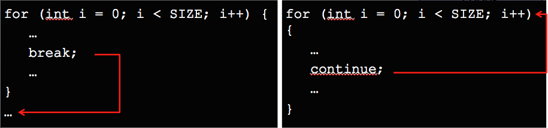

# 2.2 Εντολές Επανάληψης
© Γιάννης Κωστάρας

---

[🏠](https://jkost.github.io) | [⬆️](../../README.md) | [◀️](../2.1-ControlStatements/README.md) | [▶️](../2.3-Arrays/README.md)

---

[](2.2-Loops.ipynb)

### Μαθησιακοί στόχοι
Σε αυτήν την ενότητα θα μάθουμε:

* τις διάφορες εντολές επανάληψης (```while, do-while``` και ```for```)
* για τους εμφωλιασμένους βρόγχους
* τις εντολές ```break, continue, return```

## Εισαγωγή

Οι Η/Υ είναι πολύ καλοί στο να εκτελούν ακούραστα και ταχύτατα πολλούς βαρετούς υπολογισμούς. Π.χ. μπορεί να μετρήσει σε microseconds από το 1 μέχρι το 100. Αν θέλαμε να γράψουμε αυτό το πρόγραμμα με τα όσα έχουμε μάθει μέχρι τώρα θα γράφαμε:

```java
System.out.print("1 ");
System.out.print("2 ");
...
System.out.print("100");
```

Υπάρχουν όμως κι άλλοι τρόποι να πετύχουμε το ίδιο αποτέλεσμα χρησιμοποιώντας τις εντολές που θα μάθουμε σε τούτο το μάθημα.

Η Java διαθέτει τρεις εντολές επανάληψης: ```while```, ```for``` και ```do...while```. Οι εντολές επανάληψης ή βρόγχοι είναι από τα πιο δύσκολα προς κατανόηση θέματα για έναν αρχάριο.

## Εντολή ```while```
Σύνταξη:
```java
while (συνθήκη) {	// μπορεί να μην εκτελεστεί καμία φορά
   εντολές
}

```
Η _συνθήκη_ είναι μια λογική μεταβλητή (boolean) ή μια έκφραση που επιστρέφει λογική τιμή. Αν η _συνθήκη_ έχει τιμή ```false``` τότε τερματίζεται η εκτέλεση του βρόχου. Αν η συνθήκη έχει αρχικά τιμή ```false```, τότε ο βρόχος δεν εκτελείται καμία φορά. Αν η _συνθήκη_ παίρνει συνεχώς την τιμή ```true```, τότε μιλάμε για _ατέρμονα βρόχο_ που δεν τερματίζεται ποτέ, με αποτέλεσμα να μην μπορούμε να τερματίσουμε το πρόγραμμά μας.

Π.χ.
```java
int i = 0;
// ο έλεγχος γίνεται προτού εκτελεστεί ο βρόχος
while (i < 10) {
	i++;
   	System.out.print(" " + i);
} // 0 1 2 3 4 5 6 7 8 9 
```
Σαν άσκηση, πώς μπορείτε να τροποποιήσετε τον παραπάνω βρόγχο ώστε να τυπώσετε μόνο τους ζυγούς αριθμούς ```0, 2, 4, 6, 8```;

## Εντολή ```do...while```

Σύνταξη
```java
do {			// εκτελείται τουλάχιστο 1 φορά
  εντολές
} while (συνθήκη);
```
Το προηγούμενο παράδειγμα μπορεί να γραφεί και ως εξής:
```java
int i = 0;
do {
   System.out.print(" " + i++);
} while (i < 10);
// 0 1 2 3 4 5 6 7 8 9 
```
Καθώς ο έλεγχος γίνεται στο τέλος, δηλ. αφότου εκτελεστεί ο βρόχος, αυτός ο τύπος βρόχου εκτελείται τουλάχιστο μια φορά.

## Εντολή ```for```
Σύνταξη:
```java
for (αρχικοποίηση μεταβλητής βρόχου; συνθήκη; μεταβολή μεταβλητής) {
 εντολές
}
```
Το προηγούμενο παράδειγμα μπορεί να γραφεί και ως εξής:
```java
for (int i = 0; i < 10; i++) {
  System.out.print(" " + i);
}
//0 1 2 3 4 5 6 7 8 9 
```

Η μεταβλητή ```i``` αρχικοποιείται στην τιμή ```0```. Στη συνέχεια ελέγχεται η συνθήκη (```i < 10```) κι αν αυτή ικανοποιείται, εκτελείται το σώμα του βρόγχου και αυξάνεται η ```i``` κατά ```1``` (```i++```). Ελέγχεται πάλι η συνθήκη (```1 < 10```), εκτελείται το σώμα του βρόγχου και αυξάνεται η ```i``` κατά ```1``` (```i++```) κ.ο.κ. 

Πολύ βοηθάει η δημιουργία ενός πίνακα για να παρακολουθήσετε πώς αλλάζουν οι μεταβλητές κατά τη διάρκεια εκτέλεσης του βρόγχου.

Π.χ. το παρακάτω τμήμα κώδικα υπολογίζει το άθροισμα από το 1 μέχρι το 10:
```java
int sum = 0;
for (int i = 1; i <= 10; i++) {
  	sum += i;
}
System.out.print(sum);
```
Ο παραπάνω πίνακας βοηθάει να κατανοήσουμε πώς δουλεύει το πρόγραμμα σε κάθε επανάληψη:

| ```sum``` | ```i``` |
| ```0``` | ```1``` |
| ```1``` | ```2``` |
| ```3``` | ```3``` |
| ```6``` | ```4``` |
| ```10``` | ```5``` |
| ```15``` | ```6``` |
| ```21``` | ```7``` |
| ```28``` | ```8``` |
| ```36``` | ```9``` |
| ```45``` | ```10``` |
| ```55``` | ```11``` |

Δοκιμάστε επίσης να αντικαταστήσετε τη γραμμή 3 του προγράμματος που υπάρχει [εδώ](https://pythontutor.com/visualize.html#mode=edit) με τον παραπάνω κώδικα και να δείτε πώς εκτελείται το πρόγραμμα επιλέγοντας _Java 8_ και το κουμπί **Visualize Execution**.

Μπορείτε να υπολογίσετε το άθροισμα 1-10 χρησιμοποιώντας τους άλλους δυο τύπους βρόγχων;

```java
int sum = 0;
int i = 1;
while (i <= 10) {
	sum += 1;
	i++;
}
System.out.print(sum);
```

και 

```java
int sum = 0;
int i = 1;
do {
	sum += 1;
	i++;
} while (i <= 10);
System.out.print(sum);
```

Σαν επιπλέον ασκήσεις εξάσκησης, υπολογίστε το γινόμενο των αριθμών 1-10 καθώς και το άθροισμα των τετραγώνων των αριθμών 1-10.

## Εμφωλιασμένοι βρόγχοι
Μπορούμε να εμφωλιάσουμε βρόγχους ή/και εντολές αποφάσεων. 

```java
for (int i=0; i<10; i++) {
	for (int j=0; j<10; j++) {
		System.out.print(" " + (i+j));
	}
    System.out.println();
}
```
Στα πρώτα μαθήματα της 1ης εβδομάδας είχαμε ως ασκήσεις να εμφανίσουμε κάποια σχήματα στην έξοδο, π.χ.

```
    *     
   ***    
  *****   
 *******  
*********
```
Αντί να χρησιμοποιήσουμε 5 εντολές ```System.out.println()``` για να εμφανίσουμε το αποτέλεσμα, θα μπορούσαμε να χρησιμοποιήσουμε βρόγχους. Π.χ. για να εμφανίσουμε τα 9 αστεράκια της τελευταίας γραμμής:

```java
for (int i=1; i<=9; i++) {
	System.out.print("*");
}
*********
```
Αν θέλαμε να τυπώσουμε 5 γραμμές από 9 αστεράκια η καθεμιά τότε θα γράφαμε:
```java
for (int i=1; i<=5; i++) {
	for (int j=1; j<=9; j++) {
		System.out.print("*");
	}
	System.out.println(); // αλλαγή γραμμής
}
*********
*********
*********
*********
*********
```
Παρατηρούμε ότι χρησιμοποιούμε δυο δείκτες, ```i, j``` για καθέναν από τους δυο βρόγχους. Ο εξωτερικός βρόγχος εκτελείται 5 φορές, ενώ ο εσωτερικός 9. 

Φυσικά, θα μπορούσαμε να κάνουμε τη ζωή μας πιο εύκολη χρησιμοποιώντας την κατάλληλη μέθοδο ```repeat()``` της ```String```:

```java
for (int i=1; i<=5; i++) {
	System.out.println("*".repeat(9));
}	
```
αλλά θέλουμε να δείξουμε πώς δουλεύουν οι εμφωλιασμένοι βρόγχοι.

Πώς θα μπορέσουμε να τροποποιήσουμε το αρχικό μας πρόγραμμα ώστε να εμφανίσουμε το δεντράκι; Θα πρέπει στην 1η γραμμή να εμφανίσουμε 1 αστεράκι και 4 κενά μπροστά του, στη 2η γραμμή 3 αστεράκια και 3 κενά μπροστά τους και στην 3η γραμμή 5 αστεράκια με 1 κενό μπροστά τους. Το 4 προκύπτει από την ακέραια διαίρεση 9 / 2 = 4. Ας δούμε πώς θα μπορούσαμε να εμφανίσουμε τα κενά (εμφανίζοντας τον χαρακτήρα ```_``` για να τα βλέπουμε):

```java
for (int i=1; i<=5; i++) {
	for (int j=4; j>0; j--) {
		System.out.print("_");
	}
	System.out.println(); // αλλαγή γραμμής
}
____
____
____
____
____
```
Η πρώτη μας προσπάθεια απέτυχε. Παρατηρήστε ότι ο εμφωλιασμένος βρόγχος μειώνει αντί να αυξάνει τη μεταβλητή ```j``` μέχρις ότου αυτή γίνει ```0```. Το πρόβλημα είναι ότι η ```j``` ξεκινάει πάντα από το 4 επομένως τυπώνει 4 κενά. Θα θέλαμε την 1η φορά να τυπώνει 4 κενά, στην επόμενη επανάληψη 3, στη συνέχεια 2 και τέλος 1. Πώς μπορούμε να το καταφέρουμε αυτό; Θα πρέπει να γνωρίζουμε σε ποια γραμμή είμαστε, δηλ. την τιμή της ```i```. Αν καθίσουμε να το σκεφτούμε λίγο, βρίσκουμε τη φόρμουλα: ```j = 4 - i + 1```. Η φόρμουλα αυτή την πρώτη φορά έχει τιμή ```4-1+1=4```, τη δεύτερη φορά ```4-2+1=3``` κλπ.
```java
for (int i=1; i<=5; i++) {
	for (int j=4 - i + 1; j>0; j--) {
		System.out.print("_");
	}
	System.out.println(); // αλλαγή γραμμής
}
____
___
__
_

```
Πώς μπορούμε να συνδυάσουμε τώρα τα κενά και τ' αστεράκια; Θα πρέπει να κάνουμε παρόμοιο τρικ για να υπολογίσουμε πόσα αστεράκια θα τυπώνουμε σε κάθε γραμμή. Στην 1η ένα, στη 2η τρία, στην 3η πέντε, στην 4η επτά και στην 5η εννιά. Η φόρμουλα φαίνεται να είναι η ```j = 2 * i - 1```. 

```java
for (int i=1; i<=5; i++) {
	for (int j=4 - i + 1; j>0; j--) {
		System.out.print("_");
	}
	for (int j=2*i-1; j<=9; j++) {
		System.out.print("*");
	}	
	System.out.println(); // αλλαγή γραμμής
}
____*********
___*******
__*****
_***
*
```
Μάλλον θα πρέπει να θέσουμε τη φόρμουλα στη συνθήκη όπου δηλώνει πότε να τελειώσει ο βρόγχος.

```java
for (int i=1; i<=5; i++) {
	for (int j=4 - i + 1; j>0; j--) {
		System.out.print("_");
	}
	for (int j=1; j<=2*i-1; j++) {
		System.out.print("*");
	}	
	System.out.println(); // αλλαγή γραμμής
}
____*
___***
__*****
_*******
*********
```
Και αντικαθιστώντας τον χαρακτήρα underscore με το κενό:
```java
for (int i=1; i<=5; i++) {
	for (int j=4-i+1; j>0; j--) {
		System.out.print(" ");
	}
	for (int j=1; j<=2*i-1; j++) {
		System.out.print("*");
	}	
	System.out.println(); // αλλαγή γραμμής
}
    *
   ***
  *****
 *******
*********
```
Βλέπουμε ότι η δημιουργία προγραμμάτων δεν είναι εύκολη υπόθεση. Χρειάζεται να δοκιμάσουμε πολλά πράγματα (trial and error) προτού φθάσουμε στην επιθυμητή λύση. Επίσης, ίσως παρατηρήσατε ότι χρησιμοποιήσαμε δυο εμφωλιασμένους βρόγχους με την ίδια μεταβλητή ```j```. Αν και θα μπορούσαμε να μετονομάσουμε την μεταβλητή του δεύτερου εμφωλιασμένου βρόγχου αλλιώς, δώσαμε το ίδιο όνομα για να δείξουμε πώς δουλεύει η εμβέλεια των μεταβλητών. Η πρώτη μεταβλητή ```j``` υπάρχει μέχρι το τέλος του πρώτου εμφωλιασμένου βρόγχου, δηλ.
```java
	for (int j=4-i+1; j>0; j--) {
		System.out.print(" ");
	}  // η j παύει να υπάρχει από δω και πέρα
``` 
επομένως από το ```}``` και πέρα μπορούμε να ξαναορίσουμε άλλη μεταβλητή με το ίδιο όνομα ```j``` χωρίς πρόβλημα. Ομοίως,
```java
	for (int j=1; j<=2*i-1; j++) {
		System.out.print("*");
	}  // η j παύει να υπάρχει από δω και πέρα
```
Αντιθέτως, η ```i``` υπάρχει μέχρι το τελικό άγκριστρο του εξωτερικού βρόγχου. Θα μπορούσαμε να ορίσουμε πάλι μια μεταβλητή ```i``` μέσα στο μπλοκ του εξωτερικού βρόγχου, η οποία θα επισκίαζε (shadow) την ```i``` της ```for``` αλλά αυτό είναι πολύ κακή τεχνική και θα πρέπει να αποφεύγεται.

Αν θέλουμε η μεταβλητή του βρόγχου να υπάρχει μετά το τέλος του, πρέπει να την ορίσουμε πριν από τον βρόγχο, όπως παρακάτω:

```java
int i = 0;
for (i = 0; i<10; i++) {
//...
}
System.out.println(i); // 10
```

Δοκιμάστε να επιλύσετε την παραπάνω άσκηση χρησιμοποιώντας την ```repeat()``` της ```String```.

Δοκιμάστε να επιλύσετε τις ασκήσεις του κεφαλαίου 1.5 χρησιμοποιώντας βρόγχους.

## Εντολές ```break```, ```continue``` και ```return```
Αν και δε συνίσταται η χρήση τους, οι εντολές αυτές μας επιτρέπουν να "βγαίνουμε" από έναν βρόχο. 



**Εικόνα 2.2.1** _Παραδείγματα χρήσης εντολών break, continue και return_

Η εντολή ```break``` σταματάει την εκτέλεση του βρόχου και βγαίνει από τον βρόχο (δηλ. συνεχίζει με την εντολή που ακολουθεί το βρόχο). Π.χ.

```java
for (int i = 9; i > 0; i--) {
   ...>     if (i == 5) {
   ...>        break;
   ...>     }
   ...>     System.out.print(" " + i);
   ...> }
 9 8 7 6
```
Η εντολή ```continue``` αγνοεί τις εντολές που την ακολουθούν και συνεχίζει το βρόχο από την αρχή. Π.χ.
```java
jshell> for (int i = 10; i > 0; i--) {
   ...>     if (i % 2 != 0) {
   ...>        continue;
   ...>     }
   ...>     System.out.print(" " + i);
   ...> }
 10 8 6 4 2
```
Η εντολή ```return``` τέλος, επιστρέφει από μια μέθοδο (όπως θα δούμε παρακάτω) ή από το ίδιο το πρόγραμμα, π.χ.
```java
if (s.isEmpty()) {
	return;
}
```

Μπορείτε να πειραματιστείτε περαιτέρω εδώ <a href="sandbox/loops.html" target="_blank"></a>.

## Εφαρμογές
Η πιο συνηθισμένη εφαρμογή των βρόγχων είναι κατά τον έλεγχο της εισόδου του χρήστη. Ας υποθέσουμε ότι θέλουμε ο χρήστης να δώσει μια τιμή μεταξύ 0 και 99 (_δοκιμάστε το στο https://tryjshell.org/ για καλύτερα αποτελέσματα_):

```java
jshell> Scanner sc = new Scanner(System.in);
sc ==> java.util.Scanner[delimiters=\p{javaWhitespace}+] ... \E][infinity string=\Q∞\E]

jshell> int age = -1;   // αρχικοποιούμε με μια μη έγκυρη ηλικία εκτός του πεδίου τιμών της age

jshell> do {
   ...>    System.out.print("Δώσε την ηλικία: ");
   ...>    age = sc.nextInt();
   ...> } while (age < 0 || age > 99);
Δώσε την ηλικία: -7
Δώσε την ηλικία: 100
Δώσε την ηλικία: 99
```

Επιλέξαμε την ```do - while``` επειδή θέλουμε να λάβουμε την απάντηση του χρήστη τουλάχιστο μια φορά. Αν ο χρήστης δώσει ηλικία μέσα στα επιτρεπόμενα όρια, ο βρόγχος εκτελείται μόνο μια φορά, διαφορετικά θα συνεχίσει να εκτελείται όσες φορές ο χρήστης δίνει τιμή εκτός των επιτρεπτών ορίων.

Βέβαια ο παραπάνω κώδικας δεν μας καλύπτει στην περίπτωση που ο χρήστης εισάγει μη ακέραιο αριθμό.

```java
jshell> do {
   ...>    System.out.print("Δώσε την ηλικία: ");
   ...>    age = sc.nextInt();
   ...> } while (age < 0 || age > 99);
Δώσε την ηλικία: p
|  Exception java.util.InputMismatchException
|        at Scanner.throwFor (Scanner.java:939)
|        at Scanner.next (Scanner.java:1594)
|        at Scanner.nextInt (Scanner.java:2258)
|        at Scanner.nextInt (Scanner.java:2212)
|        at (#3:3)
```
Θα χρειαστεί να κάνουμε λίγα πράγματα παραπάνω για να καλύψουμε όλες τις πιθανές περιπτώσεις:
```java
jshell> int age = -1;
age ==> -1

jshell> do {
   ...>     System.out.print("Δώσε την ηλικία: ");
   ...>     try {   
   ...>         age = Integer.parseInt(sc.next());
   ...>     } catch (NumberFormatException e) {
   ...>         age = -1;
   ...>     }
   ...>  }
   ...>  while (age < 0 || age > 99);
Δώσε την ηλικία: p
Δώσε την ηλικία: 100
Δώσε την ηλικία: 99    
```
Αν και η ```Scanner``` διαθέτει πολλές μεθόδους ελέγχου της εισόδου (π.χ. ```hasNextInt()```), δυστυχώς αυτές δεν δουλεύουν ικανοποιητικά (βλ. π.χ. [εδώ](https://stackoverflow.com/questions/69929312/java-scanner-hasnextint-does-not-wait-for-input)).

Η ```try-catch``` είναι μια εντολή που ελέγχει για πιθανά λάθη κατά την εκτέλεση. Η είσοδος από την ```sc.next()``` περνά στην ```Integer.parseInt()``` η οποία προσπαθεί να την μετατρέψει σε ακέραιο. Αν αποτύχει, τότε εγείρεται μια εξαίρεση ```NumberFormatException``` η οποία συλλέγεται από το ```catch``` μπλοκ και θέτει ```age = -1```. Με αυτόν τον τρόπο δεν κρασάρει το πρόγραμμά μας ενώ δεν ικανοποιείται ούτε η συνθήκη οπότε ο βρόγχος επαναλαμβάνεται. Θα μιλήσουμε για τη διαχείριση εξαιρέσεων σε επόμενο μάθημα.

Ας δούμε πως μπορούμε να επιλύσουμε την 3η άσκηση. Ας σκεφτούμε τι θα χρειαστούμε κατ' αρχήν. Θα χρειαστούμε μια μεταβλητή για να αποθηκεύσουμε το κεφάλαιο (```capital```), μια για το επιτόκιο (```interest```) και μια για να υπολογίσουμε στα πόσα έτη το κεφάλαιο διπλασιάζεται (```years```). Θα χρειαστούμε και μια μεταβλητή που θα υπολογίζει πόσος θα είναι ο ισολογισμός (```balance```) του λογαριασμού στο τέλος κάθε έτους η οποία αρχικοποιείται με το κεφάλαιο. Ας δοκιμάσουμε να επιλύσουμε την άσκηση χειροκίνητα.

| ```years``` | ```capital``` | ```interest``` | ```balance``` | **Συνθήκη** |
| ```0``` | ```10000.00``` | ```1.05``` | ```10000.00``` |  ```10000.00 < 20000.00``` ? |
| ```1``` |  |  | ```10000.00 * 1.05 = 10500.00``` | ```10500.00 < 20000.00``` ? |
| ```2``` |  |  | ```10500.00 * 1.05 = 11025.00``` | ```11025.00 < 20000.00``` ? |
| ```3``` |  |  | ```11025.00 * 1.05 = 11576.25``` | ```11576.00 < 20000.00``` ? |
|  ... | ... | ... | ... | ... |

Ας δοκιμάσουμε να το μετατρέψουμε σε πρόγραμμα Java. Θα χρειαστούμε έναν βρόγχο η συνθήκη του οποίου θα ελέγχει κατά πόσο το ```balance < 2*capital```. Στο σώμα του βρόγχου θα υπολογίζουμε το νέο ```balance``` (```balance = balance * interest```) και θα αυξάνουμε και την τιμή της ```years``` κατά ένα.

```java
jshell> System.out.print("Δώσε το αρχικό κεφάλαιο: ");
Δώσε το αρχικό κεφάλαιο:

jshell> Scanner sc = new Scanner(System.in);
sc ==> java.util.Scanner[delimiters=\p{javaWhitespace}+] ... \E][infinity string=\Q∞\E]

jshell> double capital = sc.nextDouble();
10000
capital ==> 10000.0

jshell> System.out.print("Δώσε το επιτόκιο: ")
Δώσε το αρχικό επιτόκιο:

jshell> double interest = sc.nextDouble();
1.05
interest ==> 1.05

jshell> int years = 0;
years ==> 0

jshell> var balance = capital;
c ==> 10000.00

jshell> while (balance < 2*capital) {
   ...>     years++;
   ...>     balance *= interest;
   ...> }
   
jshell> System.out.println("Το κεφάλαιο σας θα διπλασιαστεί μετά από " + years + " χρόνια.");
Το κεφάλαιο σας θα διπλασιαστεί μετά από 15 χρόνια.
```
Δοκιμάστε το και στο [pythontutor](https://pythontutor.com/visualize.html#mode=edit).

Χρησιμοποιήσαμε έναν βρόγχο ```while``` γιατί δεν γνωρίζουμε εκ των προτέρων πόσες επαναλήψεις θα χρειαστούν. Σε κάθε επανάληψη ελέγχουμε κατά πόσο η μεταβλητή ```c``` η οποία κάθε φορά αυξάνεται με το επιτόκιο (```balance *= interest <=> balance = balance * interest```). Παρόλ' αυτά, για πιο προχωρημένους, θα μπορούσαμε να χρησιμοποιήσουμε και βρόγχο ```for``` ως εξής (και υπάρχουν κι άλλοι συνδυασμοί που ξεφεύγουν από αυτό το εισαγωγικό μάθημα):

```java
jshell> var balan = capital;
c ==> 10000.00

jshell> for (; balan < 2*capital; years++) {
   ...>     balan *= interest;
   ...> }

jshell> balan
20789.281794113682
```
Βγάλαμε την αρχικοποίηση της μεταβλητής ```balan``` έξω από τον βρόγχο επειδή τη χρειαζόμαστε μετά το τέλος του βρόγχου. Αν την ορίζαμε μέσα στη ```for``` όπως παρακάτω, δεν θα μπορούσαμε να την προσπελάσουμε καθώς η εμβέλειά της θα ήταν μέχρι το }.

```java
jshell> for (var bal = capital; bal < 2*capital; years++) {
   ...>     bal *= interest;
   ...> }

jshell> bal
|  Error:
|  cannot find symbol
|    symbol:   variable bal
|  bal
|  ^-^
```
Μπορούμε να αφήσουμε κενά οποιαδήποτε από τα τρία μέρη μιας ```for```. Π.χ. η παρακάτω εντολή είναι ένας ατέρμονας βρόγχος:
```java
for (; ;) {
   // ατέρμον βρόγχος   
}
```

Τροποποιήστε το πρόγραμμα ώστε να απαντήσετε στα παρακάτω ερωτήματα:

1. Σε πόσα χρόνια τριπλασιάζεται το κεφάλαιο;
1. Αν το επιτόκιο είναι 10% αντί για 5%, σε πόσα χρόνια διπλασιάζεται το κεφάλαιο;

Ας δούμε τώρα την άσκηση 4. Όπως και στα μαθηματικά, για να επιλύσετε μια άσκηση πρέπει να έχετε μάθει απέξω την εκφώνηση. 

Αφού διαβάσουμε δυο ακέραιους αριθμούς, διαιρούμε διαδοχικά τον 1ο με 2 μέχρις ότου γίνει 1 και παράλληλα πολλ/ζουμε αντίστοιχα τόσες φορές τον 2ο με το 2. Αν ο 1ος αριθμός είναι μονός, τότε προσθέτουμε τον 2ο αριθμό στη μεταβλητή που αποθηκεύει το γινόμενο. Αυτή η μεταβλητή αρχικοποιείται με τον 2ο αριθμό.

```java
jshell> System.out.print("Δώσε τον 1ο αριθμό: ");
Δώσε τον 1ο αριθμό:

jshell> var a = sc.nextInt();
45
a ==> 45

jshell> System.out.print("Δώσε τον 2ο αριθμό: ");
Δώσε τον 2ο αριθμό:

jshell> var b = sc.nextInt();
19
b ==> 19

jshell> int product = b;
product ==> 19

jshell> while (a > 1) {
	a /= 2;
	b *= 2;
	if (a % 2 != 0) {
		product += b;
	}	
}

jshell> System.out.println("a * b = " + product);
product ==> 855
```

Ας δούμε την άσκηση 5. Ένας κανονικός διαιρέτης ενός αριθμού ```n``` είναι αυτός που δεν αφήνει υπόλοιπο. Π.χ. αν ```n%2 == 0``` τότε το 2 είναι ένας κανονικός διαιρέτης του ```n```. Η άσκηση μας ζητάει να υπολογίσουμε το άθροισμα όλων των κανονικών διαιρετών ενός αριθμού. Θα μπορούσαμε να ελέγξουμε αν ο χρήστης εισάγει όντως έναν θετικό ακέραιο αριθμό, αλλά το αφήνουμε σαν άσκηση στον αναγνώστη.

```java
jshell> System.out.print("Δώσε έναν θετικό ακέραιο αριθμό: ");
Δώσε έναν θετικό ακέραιο αριθμό:

jshell> var n = sc.nextInt();
220
n ==> 220

jshell> long sum = 0;
sum ==> 0

jshell> for (int i = 1; i < n; i++) {
   ...>     if (n % i == 0) {
   ...>        sum += i;
   ...>     }
   ...> }
   
jshell> System.out.println("d("+n+")="+sum);
d(220)=284
```
Η άσκηση 8 μας ζητάει να αντιστρέψουμε έναν αριθμό.

Η άσκηση 9 μας ζητάει να αντιστρέψουμε μια συμβολοσειρά. Θα μπορούσαμε να έχουμε δυο δείκτες σε έναν βρόγχο, ο ένας να αυξάνεται από την αρχή της συμβολοσειράς και ο άλλος να μειώνεται από το τέλος της συμβολοσειράς και να αλλάζουν τις θέσεις των χαρακτήρων που δείχνουν ο καθένας μέχρις ότου οι δυο δείκτες να συναντηθούν στο μέσο της συμβολοσειράς. Αυτό ακριβώς κάνει το παρακάτω πρόγραμμα:

```java
jshell> String s = sc.next();
s ==> "γειά"

jshell> char[] sa = s.toCharArray();
sa ==> char[4] { 'γ', 'ε', 'ι', 'ά' }

jshell> for (int i=0, j=sa.length-1; i < j; i++, j--) {
    char c = sa[i];
    sa[i] = sa[j];
    sa[j] = c;
}

jshell> new String(sa)
$13 ==> "άιεγ"
```

Η άσκηση 12 είναι λίγο πιο πολύπλοκη, αλλά αρκετά χρήσιμο να γνωρίζουμε πότε πέφτει το Ορθόδοξο Πάσχα. Θα ζητάμε κάθε φορά από το χρήστη να μας δίνει το έτος και θα υπολογίζουμε πότε πέφτει η Κυριακή του Ορθόδοξου Πάσχα για εκείνο το έτος.

```java
Scanner in = new Scanner(System.in);
System.out.print("Δώσε το έτος: ");
int year = in.nextInt();
int a, b, c, d, e;
a = year % 19; // κύκλος του Μέτωνα
b = year % 4;  // κάθε 4 χρόνια το έτος είναι δίσεκτο
c = year % 7;  // οι 7 ημέρες της Μεγάλης Εβδομάδος
d = (19*a+15) % 30;
e = (2*b+4*c+6*d+6) % 7;
System.out.print("Το Ορθόδοξο Πάσχα πέφτει στις ");
if (d+e+4 > 30) /* Πάσχα το Μάιο */
  System.out.println((d+e-26) + " Μαΐου " + year);
else /* Πάσχα τον Απρίλιο */
  System.out.println((d+e+4) + " Απριλίου " + year);
```

Ας δούμε την άσκηση 7. Είναι μια δύσκολη άσκηση. Θα τη δοκιμάσουμε στο [OneCompiler](https://onecompiler.com/jshell/) ή στο NetBeans. Ξεκινάμε με τρεις φυσικούς αριθμούς ```a, b, c``` για τους οποίους ισχύει ```a < b < c```, π.χ. ```a = 0, b = 1, c = 2```. Στη συνέχεια πρέπει να βρούμε την τριάδα για την οποία ισχύει a<sup>2</sup> + b<sup>2</sup> = c<sup>2</sup> και  ```a + b + c = 1000```, δηλ.

```java
if (a * a + b * b == c * c && a + b + c == 1000) {
    System.out.print(a * b * c);
}
```
Πώς θα καταφέρουμε να τηρήσουμε τις συνθήκες; Το ```a``` θα πρέπει να αυξάνεται μέχρι την τιμή του ```b``` κι όχι παραπάνω και το ```b``` μέχρι την τιμή του ```c``` ώστε να ικανοποιείται η συνθήκη ```a < b < c```.

```java
for (a = 0; a < b; a++) {
    for (b = a + 1; b < c; b++) {
        for (c = b + 1; c < 1000; c++) {
			//...
		}
	}
}
```
Το ```a``` αυξάνεται μέχρις ότου φθάσει στο ```b```, το ```b``` αυξάνεται από την τιμή ```a+1``` και χωρίς να ξεπερνά το ```c```, το δε ```c``` από την τιμή ```b+1``` μέχρι το ```1000```. Εκτελείται ο εσωτερικός βρόγχος προτού η εκτέλεση περάσει στον πιο εξωτερικό βρόγχο.

Ας οπτικοποιήσουμε τα παραπάνω σε έναν πίνακα:

| ```a``` | ```b``` | ```c``` |
| ```0``` | ```1``` | ```2``` |
| ```0``` | ```1``` | ```3``` |
| ```0``` | ```1``` | ```4``` |
| ... | ... | ... |
| ```0``` | ```1``` | ```1000``` |
| ```0``` | ```2``` | ```3``` |
| ```0``` | ```2``` | ```4``` |
| ... | ... | ... |
| ```0``` | ```2``` | ```1000``` |
| ... | ... | ... |
| ```0``` | ```999``` | ```1000``` |
| ... | ... | ... |
| ```1``` | ```2``` | ```3``` |
| ... | ... | ... |
| ```998``` | ```999``` | ```1000``` |

Αν τα βάλουμε όλα μαζί:
```java
int a = 0, b = a + 1, c = b + 1;
for (a = 0; a < b; a++) {
    for (b = a + 1; b < c; b++) {
        for (c = b + 1; c < 1000; c++) {
            if (a * a + b * b == c * c && a + b + c == 1000) {
                System.out.println("a=" + a + " b=" + b + " c=" +c); // a=200 b=375 c=425
                break;  // αφού υπάρχει μια μόνο τριπλέτα δεν χρειάζεται να συνεχίσουμε
            }
        }
    }
}
```
Ο καλύτερος τρόπος για να μάθετε τους βρόγχους είναι με πολλές ασκήσεις. Εμείς θα σας συνιστούσαμε:

1. Να κάνετε τις ασκήσεις της πηγής [1], οι οποίες περιγράφονται συνοπτικά στη συνέχεια, και να συγκρίνετε τις λύσεις σας με αυτές της πηγής [1]:
   * Υπολογίστε το άθροισμα και τον Μ.Ο. δεκαδικών αριθμών (Common Loop Algorithm: Sum and Average)
   * Υπολογίστε πόσα κενά υπάρχουν σε μια συμβολοσειρά, String (Common Loop Algorithm: Counting Matches)
   * Υπολογίστε πόσα λέξεις το πολύ τριών χαρακτήρων υπάρχουν σε μια συμβολοσειρά (Common Loop Algorithm: Counting Matches continued)
   * Βρείτε το πρώτο κενό σε μια συμβολοσειρά (Common Loop Algorithm: Finding the First Match)
   * Βρείτε τον μέγιστο και τον ελάχιστο αριθμό από αυτούς που εισάγει ο χρήστης (Common Loop Algorithm: Maximum and Minimum)
   * Ελέγξτε αν μια ακολουθία από αριθμούς περιλαμβάνει επαναλαμβανόμενες τιμές, όπως π.χ. στην ακολουθία 1 7 2 9 9 4 9 (Common Loop Algorithm: Comparing Adjacent Values)
1. Να επιλύσετε τις υπόλοιπες ασκήσεις αυτού του κεφαλαίου

Χρήσιμο θα σας είναι το [Python Tutor](https://pythontutor.com/visualize.html#mode=edit) ώστε να μπορέσετε να εκτελέσετε βήμα-βήμα τα προγράμματά σας. Εναλλακτικά, μπορείτε να δείτε τα μαθήματα [2.6-NetBeans](../2.6-NetBeans/README.md) και [2.7-Debugging](../2.7-Debugging/README.md) για να μάθετε πώς μπορείτε να κάνετε εκσφαλμάτωση με το NetBeans.

## Ασκήσεις
1. Επιλύστε την άσκηση [Δόσεις Αγορών](https://photodentro.edu.gr/v/item/ds/8521/10535) σε [Java](https://codecheck.io/files/2310152045f1anq64czotafls5xd37opnkm). 
 
2. Επιλύστε την άσκηση [Χωρητικότητα Αίθουσας](https://photodentro.edu.gr/v/item/ds/8521/10634) σε [Java](https://codecheck.io/files/23110413579jev4ptbn7dbpecy7xkxglk5w). 

3. [Γράψτε ένα πρόγραμμα το οποίο λαμβάνει ως είσοδο ένα ποσό σε € το οποίο πιστώνεται σε έναν τραπεζικό λογαριασμό κι ένα ετήσιο επιτόκιο και υπολογίζει σε πόσα χρόνια διπλασιάζεται το αρχικό ποσό. Π.χ. έστω ότι κατατίθεται αρχικό κεφάλαιο €10,000 σε έναν τραπεζικό λογαριασμό με 5% ετήσιο επιτόκιο, τότε το κεφάλαιο θα διπλασιαστεί μετά από 15 χρόνια.](https://codecheck.io/files/23110414208vcggwfz7bio0bbznry7ehftl)
```
   Έτος     Ισολογισμός
   ----     -----------
   0        €10000
   1        €10000 x 1.05 = €10500.00
   2        €10500 x 1.05 = €11025.00
   3        €11025.00 x 1.05 = €11576.25
   ...		...
```

4. [Πολλ/σμός αλά ρωσικά. Γράψτε ένα πρόγραμμα που διαβάζει δυο ακέραιους αριθμούς. Στη συνέχεια διαιρεί διαδοχικά τον 1ο αριθμό με το 2 (αποθηκεύοντας μόνο το ακέραιο μέρος του) μέχρις ότου να γίνει 1. Αντίστοιχα, πολλαπλασιάζει διαδοχικά τον 2ο αριθμό με το 2 τόσες φορές όσο ο 1ος να γίνει 1. Το γινόμενο των δυο αριθμών είναι το άθροισμα των αριθμών της 2ης στήλης για εκείνους τους αριθμούς της 1ης στήλης που είναι περιττοί.](https://codecheck.io/files/23110414293fhb6b5jjlq2v4o9wqkwuesus)
   Π.χ. 
```
	45   19   19
	22   38    -
	11   76   76
	 5  152  152
	 2  304    -
	 1  608  608
	         ---
	         855
```

5. [Υπολογίστε το άθροισμα των κανονικών διαιρετών ενός αριθμού n (δηλ. αριθμοί μικρότεροι του n οι οποίοι διαιρούν το n χωρίς να αφήνουν υπόλοιπο). Π.χ. οι κανονικοί διαιρέτες του ```n=220``` είναι ```1, 2, 4, 5, 10, 11, 20, 22, 44, 55``` και ```110```, οπότε το άθροισμά τους ```d(220) = 284```.](https://codecheck.io/files/23110414367gbpfejt7hrwnbh3qdf5xvn7j)

6. ["Τέλειος" είναι ένας ακέραιος αριθμός του οποίου το άθροισμα των θετικών διαιρετών του, εκτός του ίδιου του αριθμού, είναι ίσο με τον αριθμό. Π.χ., ο μικρότερος τέλειος αριθμός είναι ο 6. Οι διαιρέτες του (εκτός του 6) είναι 1, 2, 3 και το άθροισμά τους είναι 1+2+3=6. Άλλος τέλειος αριθμός είναι ο 28 (1+2+4+7+14=28). Γράψτε ένα πρόγραμμα το οποίο θα δέχεται έναν ακέραιο θετικό αριθμό ```n``` και θα υπολογίζει όλους τους τέλειους αριθμούς από το 1 μέχρι το ```n```.](https://codecheck.io/files/2311041450e1x2cah0p83wq2cc646nw4q31)

7. Μια τριπλέτα του Πυθαγόρα είναι ένα σύνολο φυσικών αριθμών, ```a < b < c```, για τους οποίους ισχύει: a<sup>2</sup> + b<sup>2</sup> = c<sup>2</sup>. Π.χ. 3<sup>2</sup> + 4<sup>2</sup> = 9 + 16 = 25 = 5<sup>2</sup> . Υπάρχει ακριβώς μια Πυθαγόρεια τριπλέτα για την οποία ισχύει: ```a + b + c = 1000```. [Βρείτε αυτήν την τριπλέτα ```a, b, c```.](https://codecheck.io/files/23102915172imzhejhaed9ukvr82atlvlbh)

8. [Γράψτε ένα πρόγραμμα που θα αντιστρέφει τα ψηφία ενός ακέραιου αριθμού.](https://codecheck.io/files/2311051358eu1g2rc6vbab8twukojbbiefh)

9. [Γράψτε ένα πρόγραμμα που θα αντιστρέφει μια συμβολοσειρά.](https://codecheck.io/files/2311051330enul8q36klt4d0sqplj66n7bu)

10. [Το 2520 είναι ο μικρότερος φυσικός αριθμός που διαιρείται από όλους τους αριθμούς από το 1-10 χωρίς ν' αφήνει υπόλοιπο. Ποιος είναι ο μικρότερος φυσικός αριθμός που διαιρείται από όλους τους αριθμούς από το 1-20 χωρίς ν' αφήνει υπόλοιπο;](https://codecheck.io/files/2311051407u80tfcpl0klvvh2uk8fajxef)

11. [Να γραφτεί ένα πρόγραμμα που να διαβάζει ένα κείμενο και να υπολογίζει το πλήθος: (α) των μη κενών χαρακτήρων (β) των μη κενών γραμμών (γ) των λέξεων (δ) των προτάσεων και (ε) το μέσο όρο χαρακτήρων ανά λέξη και μέσο όρο λέξεων ανά πρόταση.](https://codecheck.io/files/240707170353s8188w0oioay1neo29za2r9)

12. [Υπολογίστε πότε πέφτει το ορθόδοξο Πάσχα](https://codecheck.io/files/24070716022up2r9a3lqs4svvqklkp8epd0) με βάση τον [αλγόριθμο του Gauss](https://www.ma8imatikos.gr/%CE%B1%CE%BB%CE%B3%CF%8C%CF%81%CE%B9%CE%B8%CE%BC%CE%BF%CF%82-gauss-%CE%B3%CE%B9%CE%B1-%CF%84%CE%BF%CE%BD-%CF%85%CF%80%CE%BF%CE%BB%CE%BF%CE%B3%CE%B9%CF%83%CE%BC%CF%8C-%CE%B7%CE%BC%CE%B5%CF%81%CE%BF/). Tο Ορθόδοξο Πάσχα πέφτει στις (```d+e+4```) Απριλίου (αν η ημερομηνία αυτή είναι μεγαλύτερη από 30, τότε πέϕτει μέσα στον Μάιο), όπου ```d = (19 · a + 15) mod 30, e = (2 · b + 4 · c + 6 · d + 6) mod 7, a = year mod 19, b = year mod 4 και c = year mod 7```.

13. [Υπολογίστε πόσα 8 υπάρχουν μεταξύ του 1 και του 1000.](https://codecheck.io/files/24070716186l79e9awdm37b2f80dt7ozq0c)

## Πηγές
1. Horstmann C. (), [Big Java 5 - Chapter 6 - Loops](https://www.cs.ryerson.ca/~aferworn/courses/CPS109/CLASSES/week06/ch06/index.html)
1. Horstmann C. Unblog (2022), [Loop Patterns (Java Edition)](https://horstmann.com/unblog/2022-01-25/index.html)

---

[🏠](https://jkost.github.io) | [⬆️](../../README.md) | [◀️](../2.1-ControlStatements/README.md) | [▶️](../2.3-Arrays/README.md)

---