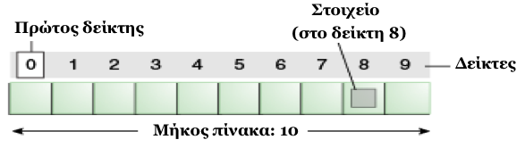
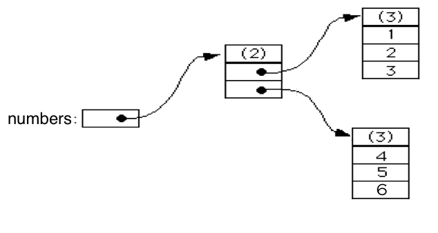
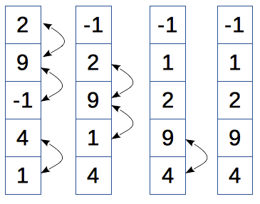

# 2.3 Πίνακες ή Συστοιχίες (Arrays)
© Γιάννης Κωστάρας

---

[<](../2.2-Loops/README.md) | [Δ](../../README.md) | [>](../2.4-Methods/README.md)

---

[](2.3-Arrays.ipynb)

### Μαθησιακοί στόχοι
Σε αυτήν την ενότητα θα μάθουμε:

* τον τύπο δεδομένων πίνακας ή συστοιχία (array) μιας και πολλών διαστάσεων
* τρόπους αρχικοποίησης πινάκων
* τις βασικές λειτουργίες τους
* την κλάση ```Arrays```

## Εισαγωγή

Υποθέστε ότι σας έχουν αναθέσει την ανάπτυξη ενός προγράμματος Java που σκοπός του είναι η καταγραφή των υπαλλήλων της εταιρίας στην οποία δουλεύετε. Με τα όσα έχετε μάθει μέχρι τώρα, θα δημιουργούσατε τόσες διαφορετικές μεταβλητές όσες και οι υπάλληλοι της εταιρίας. Για μια μικρή εταιρία ίσως αυτό να είναι αποδεκτό, αλλά τι θα κάνατε αν δουλεύατε σε μια εταιρία 1000 ατόμων;

Ο _πίνακας_ ή _συστοιχία_ είναι η πιο απλή _δομή δεδομένων (data structure)_. Αποθηκεύει ένα σύνολο στοιχείων του ίδιου τύπου δεδομένων. Τα στοιχεία του αποθηκεύονται σε συνεχόμενες θέσεις μνήμης ενώ η αναφορά σ’ ένα στοιχείο γίνεται μέσω _δεικτών_ (_indexes_). 



**Εικόνα 2.3.1** _Πίνακας ή συστοιχία (array)_

Το 1ο στοιχείο αποθηκεύεται στη θέση ```0```:
```java
Τύπος_δεδομένων όνομα_μεταβλητής[];
```
Π.χ. το παρακάτω τμήμα κώδικα δημιουργεί μια συστοιχία που μπορεί να αποθηκεύσει μέχρι 10 στοιχεία.
```java
// Τ[] arrayname = new Τ[n];
jshell> int SIZE = 10;
SIZE ==> 10
jshell> int[] bathmoi = new int[SIZE];
bathmoi ==> int[10] { 0, 0, …, 0}
```

### Τρόποι αρχικοποίησης πίνακα
```java
jshell> int[] numbers = { 1, 2, 3 }
numbers ==> int[3] { 1, 2, 3 }
jshell> int[] numbers2 = new int[3]
numbers2 ==> int[3] { 0, 0, 0 }
jshell> String[] strings = new String[] { "a", "b", "c" };
strings ==> String[3] { "a", "b", "c" }
jshell> strings.length  
$1==> 3
```
Η εντολή ```length``` επιστρέφει το μέγεθος του πίνακα, όχι πόσα στοιχεία έχουν καταχωρηθεί σ’ αυτόν. Π.χ.
```java
jshell> int[] array = new int[3]
array ==> int[3] { 0, 0, 0 } 
jshell> array[0]=10
$2 ==> 10
jshell> array.length
$3==> 3
```

### Βασικές λειτουργίες

Ο πίνακας αποτελεί μια από τις πολλές _δομές δεδομένων_ της γλώσσας Java. Θα εξετάσουμε αυτές τις δομές δεδομένων όσων αφορά τις ακόλουθες λειτουργίες:

| Προσπέλαση | ```int b = bathmoi[1]; // 2ο στοιχείο```
| Εισαγωγή/εκχώρηση | ```bathmoi[5] = 18```
| Διαγραφή | (βλ. παρακάτω)
| Αναζήτηση | ```int index = Arrays.binarySearch(bathmoi, key)``` 
| Ταξινόμηση | ```Arrays.sort(bathmoi)```
| Αντιγραφή | ```int[] b=Arrays.copyOfRange(bathmoi, 0, SIZE)```
| Συγχώνευση | (βλ. παρακάτω)
| Διαχωρισμός | (βλ. παρακάτω)
| Μήκος/Μέγεθος | ```bathmoi.length```

## Πολυδιάστατοι πίνακες
Ο ορισμός
```java
// Τ[] arrayname = new Τ[n];
```
ορίζει έναν μονοδιάστατο πίνακα. Η έννοια του μονοδιάστατου πίνακα μπορεί να γενικευθεί και σε πίνακες περισσοτέρων διαστάσεων, π.χ. δισδιάστατων, τρισδιάστατων κ.ο.κ.

Π.χ. ένας δισδιάστατος πίνακας ορίζεται ως εξής:
```java
// Τ[][] arrayname = new Τ[m][n];
jshell> int m = 2, n = 3;
m ==> 2
n ==> 3
jshell> int[][] matrix = new int[m][n];
matrix ==> int[2][] {int[3] {0, 0, 0}, int[3] {0, 0, 0}}
```
Τρόποι ορισμού δισδιάστατου πίνακα:
```java
jshell> int[][] numbers = { { 1, 2, 3 }, { 4, 5, 6 } };
numbers ==> int[2][] { int[3] { 1, 2, 3 }, int[3] { 4, 5, 6 }}
jshell> int[][] numbers2 = new int[2][3];
numbers2 ==> int[2][] { int[3] { 0, 0, 0 }, int[3] { 0, 0, 0}}
jshell> int[][] a = { {1}, {2, 3}, null }; // πίνακας με γραμμές διαφόρων μεγεθών (ragged table)
a ==> int[3][] { int[1] { 1 }, int[2] { 2, 3 }, null }
jshell> a.length  // επιστρέφει τον αρ. των γραμμών του πίνακα
$3==> 3
jshell> a[0]
$4 ==> int[1] {1}
jshell> a[0].length
$5 ==> 1
jshell> numbers2[0][1] = 6
$6 ==> 6
```

| 1 | 2 | 3
| 4 | 5 | 6



**Εικόνα 2.3.2** _Εσωτερική αναπαράσταση δισδιάστατου πίνακα_

## Η κλάση ```Arrays```
Η κλάση ```Arrays``` παρέχει χρήσιμες μεθόδους για τους πίνακες.
```java
jshell> String[] strings = new String[3];
strings ==> String[3] { null, null, null }

jshell> import java.util.Arrays;

jshell> Arrays.fill(strings, "a");

jshell> strings
strings ==> String[3] { "a", "a", "a" }

jshell> Arrays.fill(strings, 1, 2, "b");

jshell> strings
strings ==> { "a", "b", "a" }

jshell> String[] strings_ = new String[3];
strings_ ==> String[3] { null, null, null }

jshell> Arrays.fill(strings_, "a");

jshell> strings_
strings_ ==> String[3] { "a", "a", "a" }

jshell> Arrays.mismatch(strings, strings_);
$1 ==> 1
```
Προτού τη χρησιμοποιήσουμε, θα πρέπει να εισάγουμε το αντίστοιχο πακέτο (package) ```java.util.Arrays```. Η ```mismatch()``` είναι μια πολύ γρήγορη μέθοδος που προστέθηκε στην έκδοση 11 και μας επιτρέπει να συγκρίνουμε αν δυο συστοιχίες είναι ίσες (```-1```), διαφορετικά επιστρέφει τον πρώτο δείκτη όπου οι δυο συστοιχίες διαφέρουν. 

Παρόμοια είναι και η ```Arrays.compare()``` η οποία συγκρίνει δυο συστοιχίες λεξικογραφικά. Μια αρνητική τιμή σημαίνει ότι η πρώτη συστοιχία είναι λεξικογραφικά πριν από την δεύτερη, μια θετική τιμή ότι η είναι μετά ενώ μηδενική τιμή σημαίνει ότι οι δυο συστοιχίες είναι ίσες. Ας δούμε ένα παράδειγμα για να το καταλάβουμε καλύτερα:

```java
jshell> Arrays.compare(strings, strings_);
1
```
Αυτό σημαίνει ότι η ```strings``` είναι λεξικογραφικά μετά την ```strings_``` επειδή το δεύτερο στοιχείο της (```b```) είναι λεξικογραφικά μετά το δεύτερο στοιχείο της ```strings_``` (```a```).

## Βασικές λειτουργίες πινάκων

### Προσπέλαση στοιχείων πίνακα
```java
jshell> int[] array = new int[10];
array ==> int[10] { 0, 0, 0, ..., 0 }
jshell> for (int i = 0; i < array.length; i++) {
          array[i] = i;
        }; 
jshell> array 
array ==> int[10] { 0, 1, 2, ... }
jshell> for (int e : array) {
           System.out.print(e + " ");
        }
0 1 2 3 4 5 6 7 8 9 
```
Σ' αυτό το παράδειγμα βλέπουμε μια νέα σύνταξη της εντολής βρόγχου ```for``` που χρησιμοποιείται για να προσπελάζουμε πίνακες (αλλά και άλλες συλλογές όπως θα δούμε αργότερα).

Ας δούμε πως μπορούμε να προσπελάσουμε τα στοιχεία ενός δισδιάστατου πίνακα:

```java
jshell> int[][] matrix = new int[5][5]; 
matrix ==> int[5][] { int[5] { 0, 0, 0, 0, 0 }, int[5] { 0,  ... int[5] { 0, 0, 0, 0, 0 } }
jshell> for (int i = 0; i < matrix.length; i++) {
           for (int j = 0; j < matrix[i].length; j++) {
              matrix[i][j] = i+j;
           }
        } 
jshell> for (int[] numbers : matrix) {
           for (int e : numbers) {
              System.out.print(e + " ");
           }
           System.out.println();    
        }
0 1 2 3 4 
1 2 3 4 5 
2 3 4 5 6 
3 4 5 6 7 
4 5 6 7 8 
```

### Εκτύπωση πινάκων
```java
jshell> int[] array = {1, 2, 3, 4, 5};
array ==> int[5] {1, 2, 3, 4, 5}
jshell> Arrays.toString(array);
$1 ==> "[1, 2, 3, 4, 5]"
jshell> int[][] array2d = {
{1, 2, 3},
{4, 5, 6},
{7, 8, 9}
};
array2d ==> int[3][] { int[3] { 1, 2, 3 }, int[3] { 4, 5, 6 }, int[3] { 7, 8, 9 } }
jshell> Arrays.deepToString(array2d)
$2 ==> "[[1, 2, 3], [4, 5, 6], [7, 8, 9]]"
```

### Ταξινόμηση πινάκων
```java
jshell> int[] array = {2, 9, -1, 4, 13};
$3 ==> int[5] {2, 9, -1, 4, 13}

jshell> Arrays.sort(array); // με αριθμητική σειρά

jshell> Arrays.toString(array);
$4 ==> "[-1, 2, 4, 9, 13]"

jshell> Arrays.sort(array, 0, array.length, Collections.reverseOrder()); // με αντίστροφη αριθμητική σειρά
|  Error:
|  no suitable method found for sort(int[],int,int,java.util.Comparator<java.lang.Object>)
|      method java.util.Arrays.<T>sort(T[],java.util.Comparator<? super T>) is not applicable
|        (cannot infer type-variable(s) T
|          (actual and formal argument lists differ in length))
|      method java.util.Arrays.<T>sort(T[],int,int,java.util.Comparator<? super T>) is not applicable
|        (inference variable T has incompatible bounds
|          equality constraints: int
|          lower bounds: java.lang.Object)
|  Arrays.sort(array, 0, array.length, Collections.reverseOrder());
|  ^---------^

jshell> String[] names = {"Κώστας", "Γιάννης", "Κατερίνα", "Μαρία", "Ανάργυρος"};
names ==> String[5] { "Κώστας", "Γιάννης", "Κατερίνα", "Μαρία", "Ανάργυρος" }

jshell> Arrays.sort(names, 0, names.length, Collections.reverseOrder()); // λεξικογραφικά
// "["Μαρία", "Κώστας", "Κατερίνα", "Γιάννης", "Ανάργυρος"]"
```
Παρατηρήστε ότι δουλεύει μόνο σε αντικείμενα κλάσεων (όπως η ```String[]```) και όχι σε πρωτογενής τύπους (π.χ. ```int[]```).

### Αναζήτηση στοιχείων σε πίνακα
```java
jshell> int[] array = {1, 2, 3, 4, 5};
array ==> int[5] {1, 2, 3, 4, 5}
jshell> Arrays.binarySearch(array, 4); // εύρεση του 4
$5 ==> 3  // επιστρέφει τον δείκτη αν βρέθηκε, ή έναν αρνητικό αριθμό (-(insertion point) - 1) αν δε βρέθηκε 
```
Ο αλγόριθμος _δυαδικής αναζήτησης (BinarySearch)_ βρίσκει ένα στοιχείο σε μία _ταξινομημένη_ λίστα ψάχνοντας κάθε φορά στη μέση του πίνακα. Αν το στοιχείο είναι μεγαλύτερο τότε ο πίνακας μοιράζεται στη μέση και ο αλγόριθμος επαναλαμβάνεται μόνο στο δεξί τμήμα του πίνακα έως ότου βρεθεί το στοιχείο.

### Αντιγραφή πινάκων
```java
jshell> int[] newArray = Arrays.copyOf(array, array.length+1); // δημιουργία ενός newArray μήκους array.length+1 με τα στοιχεία του array
newArray ==> int[6] { 1, 2, 3, 4, 5, 0 }
jshell> int[] newArray = Arrays.copyOfRange(array, 1, 2); // αντιγραφή μέρους του αρχικού πίνακα
newArray ==> int[1] { 2 }
jshell> int[] clonedArray = array.clone()
clonedArray ==> int[5] { 1, 2, 3, 4, 5 }
```
ή
```java
System.arraycopy( <source table>, <source start index>, 
            <dest table>, <dest start index>, <dest end index>);
```
π.χ.
```java
jshell> int[] array2 = new int[5]
array2 ==> int[5] { 0, 0, 0, 0, 0 }

jshell> System.arraycopy(array, 0, array2, 0, 5);

jshell> array2
array2 ==> int[5] { 1, 2, 3, 4, 5 }
```

### Διαγραφή στοιχείων πινάκων
```java
jshell> int[] array = {1, 2, 3, 4, 5};
array ==> int[5] {1, 2, 3, 4, 5}
// Πώς μπορούμε να διαγράψουμε ένα στοιχείο;
jshell> int[] newArray = new int[array.length-1]
newArray ==> int[4] {0, 0, 0, 0}
jshell> int index = 1; // θέλουμε να διαγράψουμε το 2ο στοιχείο
jshell> System.arraycopy(array, 0, newArray, 0, index);
// αντιγραφή από το 0 μέχρι το array[index-1]
jshell> newArray
newArray ==> int[4] { 1, 0, 0, 0 }
jshell> System.arraycopy(array, index + 1, newArray, index, array.length - index - 1); // αντιγραφή από array[index+1] μέχρι array[array.length-1]
jshell> newArray
newArray ==> int[4] { 1, 3, 4, 5 }
```

### Ισότητα πινάκων
```java
jshell> Arrays.equals(array, newArray); 
$1 ==> false
jshell> Arrays.deepEquals(array2d, newArray2d); // για n-διαστάσεις
$1 ==> false
```

## Κατηγορίες δισδιάστατων πινάκων 

* _Τετραγωνικός_ λέγεται ο δισδιάστατος πίνακας του οποίου το μέγεθος των δυο διαστάσεων είναι ίσο (δηλ. m=n)
* _Συμμετρικός_ λέγεται ένας τετραγωνικός πίνακας με στοιχεία ```a[i][j]=a[j][i]``` για ```0<=i,j<=n-1```. Π.χ.
    
| 1 | 6 | 7 | 9
| 6 | 2 | 5 | 8
| 7 | 5 | 3 | 0
| 9 | 8 | 0 | 4

* _Τριγωνικοί_ ονομάζονται οι τετραγωνικοί πίνακες που έχουν μηδενικά στοιχεία από τη μια μεριά της διαγωνίου. 
Διακρίνονται σε _άνω τριγωνικούς_ (```a[i][j] = 0``` αν ```i>j```) και _κάτω τριγωνικούς_ (```a[i][j] = 0``` αν ```i<j```). Αν τα στοιχεία της διαγωνίου είναι επίσης μηδέν, τότε ο πίνακας λέγεται _αυστηρά πάνω (κάτω) τριγωνικός_. Τέλος, η γενίκευση των τριγωνικών πινάκων σε ανώτερες διαστάσεις, ονομάζεται _τετραεδικός πίνακας_.
Π.χ. ένας κάτω τριγωνικός πίνακας
    
| 1 | 0 | 0 | 0
| 6 | 2 | 0 | 0
| 7 | 5 | 3 | 0
| 9 | 8 | 0 | 4

* Ένας _τριδιαγώνιος_ πίνακας είναι ένας τετραγωνικός πίνακας με μηδενικά όλα τα στοιχεία εκτός από τα στοιχεία της κύριας διαγωνίου και των δυο διπλανών προς την κύρια διαγώνιο. Π.χ.

| 1 | 6 | 0 | 0
| 6 | 2 | 9 | 0
| 0 | 5 | 3 | 8
| 0 | 0 | 9 | 4

### Συγχώνευση πινάκων
Μπορούμε να συγχωνεύσουμε δυο ή περισσότερους πίνακες για να δημιουργήσουμε έναν άλλο πίνακα. Το ερώτημα είναι τι πράξη κάνουμε κατά τη συγχώνευση. Αυτό εξαρτάται κάθε φορά από το πρόβλημά μας.

Ας δούμε μερικά παραδείγματα. Από τα μαθηματικά έχουμε μάθει για τις πράξεις πινάκων.

_Πρόσθεση πινάκων_

| 1 | 2 | 3 |      | 4 | 5 | 6 |    |  5 |  7 |  9 |
| 4 | 5 | 6 |  +   | 7 | 8 | 9 |  = | 11 | 13 | 15 |
| 7 | 8 | 9 |      | 1 | 2 | 3 |    |  8 | 10 | 12 |

```java
int[][] a = { { 1, 2, 3 }, { 4, 5, 6 }, { 7, 8, 9 } };
int[][] b = { { 4, 5, 6 }, { 7, 8, 9 }, { 1, 2, 3 } };
int[][] c = new int[3][3];
for (int i=0; i<3; i++) {
    for (int j=0; j<3; j++) {
      c[i][j] = a[i][j] + b[i][j];
    }
}
```
_Πολλαπλασιασμός πινάκων_

| 1 | 2 | 3 |      | 4 | 5 |    | 21 | 27 |
| 4 | 5 | 6 |  *   | 7 | 8 |  = | 57 | 72 |
                   | 1 | 2 |    

```
c[0][0] = a[0][0]*b[0][0] + a[0][1]*b[1][0] + a[0][2]*b[2][0]: 1 * 4 + 2 * 7 + 3 * 1 = 21
c[0][1] = a[0][0]*b[0][1] + a[0][1]*b[1][1] + a[0][2]*b[2][1]: 1 * 5 + 2 * 8 + 3 * 2 = 27
c[1][0] = a[1][0]*b[0][0] + a[1][1]*b[1][0] + a[1][2]*b[2][0]: 4 * 4 + 5 * 7 + 6 * 1 = 57
c[1][1] = a[1][0]*b[0][1] + a[1][1]*b[1][1] + a[1][2]*b[2][1]: 4 * 5 + 5 * 8 + 6 * 2 = 72
```

[Online εργαλείο πολλ/σμού πινάκων](https://matrix.reshish.com/multCalculation.php)

```java
int[][] a = { { 1, 2, 3 }, { 4, 5, 6 } };
int[][] b = { { 4, 5 }, { 7, 8 }, { 1, 2 } };
int[][] c = new int[a.length][b[0].length];
for (int row=0; row < a.length; row++) {
    for (int col=0; col < b[row].length; col++) {
        for (int i = 0; i < b.length; i++) {
            c[row][col] += a[row][i] * b[i][col];
          }
    }
}
for (int i=0; i < c.length; i++) {
    for (int j=0; j < c[i].length; j++) {
        System.out.print(" | " + c[i][j]);
    }
    System.out.println(" |");
}

 | 21 | 27 |
 | 57 | 72 |
```

### Διαχωρισμός πινάκων
Π.χ. δοθέντος ενός πίνακα ακεραίων, δημιουργήστε δυο πίνακες που θα περιέχουν ο ένας τους θετικούς και ο άλλος τους αρνητικούς αριθμούς του πίνακα.

Έστω:

```java
int[] a = {5, -7, 0, -1, 3, 12};
int[] p = new int[a.length];  // μπορεί όλα τα στοιχεία να 'ναι θετικοί ή μηδέν
int[] n = new int[a.length];  // μπορεί όλα τα στοιχεία να 'ναι αρνητικοί
int pi = 0, ni = 0;
for (int e : a) {
  if (e >= 0) {
    p[pi++] = e;
  } else {
    n[ni++] = e;
  }
}
for (int i=0; i < pi; i++) {
  System.out.print(" " + p[i]);
}
System.out.println();
for (int i=0; i < ni; i++) {
  System.out.print(" " + n[i]);
}

 5 0 3 12
 -7 -1
```

## Εφαρμογές
Ας ξεκινήσουμε με μια σχετικά απλή άσκηση, να αντιμεταθέσουμε τα στοιχεία ενός πίνακα. 

```java
jshell> int[] array = {1, 2, 3, 4, 5};
$1 ==> int[5] {5, 4, 3, 2, 1}
```
Ας δούμε βήμα-βήμα τι θέλουμε να επιτύχουμε. Θέλουμε να αλλάξουμε τη θέση του ```1``` με το ```5```. Θα χρειαστούμε δυο δείκτες, έναν που να δείχνει στο ```1``` (έστω ```i```) κι έναν που να δείχνει στην τελευταία θέση του πίνακα (έστω ```j```). Αφού αντιμεταθέσουμε το στοιχείο που δείχνει ο ```i``` με το στοιχείο που δείχνει ο ```j```, θα πρέπει να προσαυξήσουμε τον ```i``` κατά ένα και να μειώσουμε τον ```j``` κατά ένα και να επαναλάβουμετη διαδικασία μέχρις ότου ```i == j```. Ας μετατρέψουμε τον παραπάνω αλγόριθμο σε κώδικα:

```java
int i = 0;
int j = array.length - 1;
while (i < j) {
   //αντιμετάθεσε τα στοιχεία στις θέσεις i και j
   int temp = array[i];
   array[i] = array[j];
   array[j] = temp;
   i++;
   j--;
}
Arrays.toString(array);
// [5, 4, 3, 2, 1]
```

Πώς μπορούμε να βρούμε το μέγιστο στοιχείο ενός μη ταξινομημένου πίνακα;

```java
int[] array = {2, 9, -1, 4, 13};
int max = Integer.MIN_VALUE;   // φρουρός (sentinel), μια τιμή που δεν είναι έγκυρη για το πρόβλημά μας
for (int i = 0; i < array.length; i++) {
    if (array[i] > max) {
        max = array[i];
    }
}
System.out.println("Το μεγαλύτερο στοιχείο του πίνακα είναι: " + max);
```
Τροποποιήστε το παραπάνω πρόγραμμα ώστε να βρείτε το ελάχιστο στοιχείο του πίνακα.

Οι πιο συνήθεις εφαρμογές των πινάκων είναι αυτές της αναζήτησης στοιχείων και της ταξινόμησής τους. Αν και είδαμε πιο πάνω ότι η κλάση ```Arrays``` διαθέτει κατάλληλες μεθόδους για το σκοπό αυτό (```sort(), binarySearch()```) υπάρχουν πολλοί αλγόριθμοι που καλό είναι να τους γνωρίζετε. 

Ας υποθέσουμε ότι έχουμε τον παρακάτω πίνακα ακέραιων στοιχείων:

```java
jshell> int[] array = {2, 9, -1, 4, 13};
$1 ==> int[5] {2, 9, -1, 4, 13}
```
Ένας από τους απλούστερους αλγόριθμους αναζήτησης είναι η γραμμική αναζήτηση (linear search). Σ' αυτήν αναζητούμε ένα στοιχείο από την αρχή του πίνακα. Αν ο πίνακας έχει _n_ στοιχεία, τότε στη χειρότερη περίπτωση ο αλγόριθμος αυτός θα χρειαστεί να αναζητήσει όλα τα στοιχεία του πίνακα (λέμε ότι έχει απόδοση _O(n)_).

Ας υποθέσουμε ότι αναζητούμε αν το 4 υπάρχει στην παραπάνω συστοιχία. Θα χρειαστούμε ένα δείκτη (```i```) για να προσπελάσουμε τα στοιχεία της συστοιχίας από την αρχή της και άλλη μια μεταβλητή ```pos``` που θα μας δείξει τη θέση στην οποία βρίσκεται το στοιχείο και η οποία αρχικοποιείται με την τιμή ```-1```. Στη συνέχεια προσπελάζουμε ένα ένα τα στοιχεία της συστοιχίας και τα συγκρίνουμε με το στοιχείο που αναζητούμε. Αν το βρήκαμε, τότε θέτουμε την ```pos = i``` και σταματάμε το βρόγχο, αλλιώς αυξάνουμε την ```i``` και συνεχίζουμε στο επόμενο στοιχείο της συστοιχίας.

```java
int search = 4;
int pos = -1;
int i = 0;
while (i < array.length && pos == -1) {
   if (array[i] == search) {
      pos = i;
   } else {
      i++;
   }
}
if (pos > -1) { 
    System.out.println("Βρέθηκε στη θέση: " + pos); // Βρέθηκε στη θέση: 3
} else { 
    System.out.println("Δεν βρέθηκε"); 
}
```
Ο αλγόριθμος γραμμικής αναζήτησης δουλεύει τόσο με ταξινομημένους όσο και με αταξινόμητους πίνακες και αποτελεί απάντηση στην άσκηση 2.

Ο αλγόριθμος γραμμικής αναζήτησης δεν είναι τόσο αποτελεσματικός για συστοιχίες με πάρα πολλά στοιχεία. Γι' αυτό το λόγο έχουν αναπτυχθεί άλλοι αλγόριθμοι αναζήτησης. Ένας απ' αυτούς είναι ο αλγόριθμος _δυαδικής αναζήτησης (binary search)_ τον οποίο υλοποιεί η ```Arrays.binarySearch()```.

Ο αλγόριθμος δυαδικής αναζήτησης περιγράφεται [εδώ](https://el.ichlese.at/what-is-binary-search-java) ενώ μια αναπαράστασή του μπορείτε να δείτε στο [φωτόδεντρο](http://www.photodentro.edu.gr/aggregator/lo/photodentro-lor-8521-10524). Το μειονέκτημά του είναι ότι δουλεύει μόνο με ταξινομημένους πίνακες. Χωρίζει τον πίνακα σε δυο υποπίνακες και ελέγχει αν το στοιχείο που ψάχνει είναι στον αριστερό ή τον δεξί υποπίνακα, τον οποίο με τη σειρά του χωρίζει πάλι σε δυο υποπίνακες κ.ο.κ.

Έστω ότι έχουμε τον ακόλουθο ταξινομημένο πίνακα:

```java
jshell> int[] array = {0,7,14,16,17,25,29,30,40,41,44,45,47,57,58};
array ==> int[15] { 0, 7, 14, 16, 17, 25, 29, 30, 40, 41, 44, 45, 47, 57, 58 }
```
και ας προσπαθήσουμε να υλοποιήσουμε σε Java τον αλγόριθμο που περιγράφεται στο Φωτόδεντρο. Θα χρειαστούμε δυο μεταβλητές που να δηλώνουν την αρχή και το τέλος του υποπίνακα και έστω ότι αναζητούμε το 40. Υπολογίζουμε τον δείκτη (```middle```) που δείχνει στο μέσο του πίνακα. Αν το στοιχείο που ψάχνουμε είναι μικρότερο από το μεσαίο στοιχείο του πίνακα, τότε αυτό σημαίνει ότι βρίσκεται στο αριστερό υποπίνακα που αποτελείται από το στοιχείο που δείχνει ο ```start``` και ένα στοιχείο πριν από τον ```middle``` ενώ αν είναι μεγαλύτερο από το μεσαίο στοιχείο του πίνακα, τότε αυτό θα βρίσκεται σε μια θέση μετά από τον ```middle``` μέχρι εκεί που δείχνει ο ```end```.

```java
int start = 0, end = array.length-1;
int search = 40;
boolean found = false;
boolean found = false;
while (start <= end && !found) {
  int middle = (start + end) / 2;
  if (array[middle] < search) {
    start = middle + 1;
  } else if (array[middle] > search) {
    end = middle - 1;
  } else if (array[middle] == search) {
    found = true;
  } 
}
System.out.println("Βρέθηκε;" + found);
```
Ο παραπάνω αλγόριθμος έχει [bug](https://ai.googleblog.com/2006/06/extra-extra-read-all-about-it-nearly.html). Το bug, το οποίο βρέθηκε το 2006, είχε και η υλοποίηση της ```Arrays.binarySearch()```. Το λάθος βρίσκεται σ' αυτή τη γραμμή:

```java
int middle =(start + end) / 2;
```
Όπως περιγράφεται στο άρθρο, ο αλγόριθμος αποτυγχάνει αν ```start + end > Integer.MAX_VALUE```. Η παραπάνω γραμμή θα πρέπει να αντικατασταθεί με:

```java
int middle = start + ((end - start) / 2);
```
Σαν έξτρα άσκηση, τροποποιήστε το παραπάνω πρόγραμμα ώστε να εμφανίζει και την θέση στην οποία βρέθηκε ο αριθμός, ή -1 αν δεν βρέθηκε. 

Ας επιλύσουμε την άσκηση 3. Ο αλγόριθμος αυτός ψάχνει το μικρότερο στοιχείο του πίνακα και το αντιμεταθέτει με την τρέχουσα θέση του δείκτη. Στη συνέχεια αυξάνει το δείκτη κατά ένα και επαναλαμβάνει τη διαδικασία. Το αποτέλεσμα είναι ένας ταξινομημένος πίνακας. Π.χ. δείτε το [βίντεο](https://www.youtube.com/watch?v=xWBP4lzkoyM).

```java
int[] array = {2, 9, -1, 4, 1};
for (int i=0; i< array.length; i++) {
  System.out.print(" " + array[i]);
}
// 2 9 -1 4 1
for (int i = 0; i < array.length - 1; i++) {
    int min = i;
    for (int j = i+1; j < array.length; j++) {
        if (array[min] > array[j]) {
            min = j;    // εύρεση του δείκτη που 'χει το μικρότερο στοιχείο του πίνακα από το i και μετά
        }
    }
    // αντιμετάθεση του στοιχείου array[i] με το array[min]
    int temp = array[min];
    array[min] = array[i];
    array[i] = temp;
}
System.out.println();
Arrays.toString(array);
// -1 1 2 4 9
``` 

Άλλοι γνωστοί αλγόριθμοι ταξινόμησης είναι ο _αλγόριθμος φυσσαλίδας (bubble sort)_ και ο _αλγόριθμος γρήγορης ταξινόμησης (quick sort)_.

Π.χ. η μέθοδος της φυσσαλίδας δουλεύει ως εξής. Αν περιστρέψουμε έναν πίνακα _n_ στοιχείων κατά 90° (ώστε το τελευταίο στοιχείο του να 'ναι κάτω), τότε: 

1. Σύγκρινε ζευγάρια διαδοχικών στοιχείων, από κάτω προς τα επάνω, και όταν βρίσκεις δύο που δεν είναι στη σωστή σειρά, αντιμετάθεσέ τα. Μετά από το πρώτο πέρασμα, πρώτο στοιχείο θα είναι το μικρότερο όλων. 
1. Κάνε και δεύτερο πέρασμα, για τα στοιχεία από το δεύτερο και μετά, οπότε έτσι θα έλθει και το δεύτερο κατά σειρά στη θέση του. 
1. Μετά από n−1 περάσματα συνολικά, ο πίνακας θα έχει ταξινομηθεί.

```java
jshell> int[] array = {2, 9, -1, 4, 1};
array ==> int[5] { 2, 9, -1, 4, 1 }

jshell> for (int i = 0; i < array.length - 1; i++) {
   ...>     for (int j = array.length - 1; j > i; j--) {
   ...>         if (array[j-1] > array[j]) {
   ...>             // αντιμετάθεση του στοιχείου array[j-1] με το array[j]
   ...>             int temp = array[j-1];
   ...>             array[j-1] = array[j];
   ...>             array[j] = temp;
   ...>         }
   ...>     }
   ...> }

jshell> array
array ==> int[5] { -1, 1, 2, 4, 9 }
```



**Εικόνα 2.3.3** _Σωρός (heap)_

## Ασκήσεις

1. [Η δυαδική αναζήτηση απαιτεί τα στοιχεία του πίνακα να είναι ταξινομημένα. Πώς θα μπορούσατε να υλοποιήσετε τον αλγόριθμο χωρίς τη χρήση της ```Arrays.binarySearch()```;](https://codecheck.io/files/23110516435g5s7azjb8yokthj3rbwwv1b0)
2. [Η δυαδική αναζήτηση απαιτεί τα στοιχεία του πίνακα να είναι ταξινομημένα. Γράψτε έναν αλγόριθμο αναζήτησης που δουλεύει τόσο σε ταξινομημένους όσο και σε αταξινόμητους πίνακες.](https://codecheck.io/files/23110516286usaf6txy3r0honibz9lmipd7)
3. [Ο αλγόριθμος _ταξινόμησης με επιλογή (selection sort)_ ταξινομεί έναν πίνακα ως εξής: σε κάθε βήμα i βρίσκει το i-οστό πιο μικρό στοιχείο και το τοποθετεί στην θέση i. Υλοποιήστε αυτόν τον αλγόριθμο.](https://codecheck.io/files/2311052036x8o8oln5ukkt5j22uz5335ry)
4. Για κάθε ένα από τα παρακάτω είδη πινάκων να γραφεί πρόγραμμα Java το οποίο θα διαβάζει έναν τετραγωνικό πίνακα ΝxΝ και θα εμφανίζει τι τύπου είναι ο πίνακας ή τίποτα από τα παρακάτω:
   * Συμμετρικός
   * Τριγωνικός
   * Τριδιαγώνιος
5. [Πόσα 8-άρια υπάρχουν στους αριθμούς από το 1 μέχρι το 1 εκατομμύριο;](https://codecheck.io/files/23110514202fd9tjd5ak2ow2olawbvtlpw5)
6. [Να γράψετε ένα πρόγραμμα που να κατασκευάζει ένα μαγικό τετράγωνο 5x5, δηλ. ένα δισδιάστατο πίνακα με τους αριθμούς 1 έως  25, μία ϕορά ο καθένας, έτσι ώστε σε κάθε γραμμή, κάθε στήλη και κάθε μία από τις δύο διαγωνίους να έχουμε το ίδιο άθροισμα.](https://codecheck.io/files/23111914268j90nrblkepmw42tizv7aufn0)


## Πηγές
1. Horstmann C., [Big Java 5 - Chapter 7 - Arrays and Array Lists](https://www.cs.ryerson.ca/~aferworn/courses/CPS109/CLASSES/week07/ch07/index.html)

---

[<](../2.2-Loops/README.md) | [Δ](../../README.md) | [>](../2.4-Methods/README.md)

---