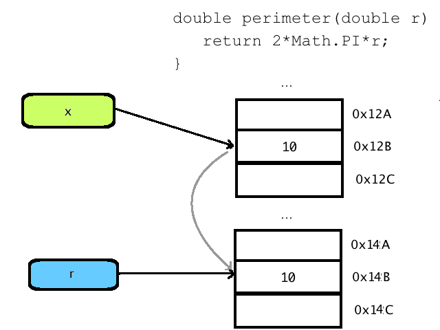
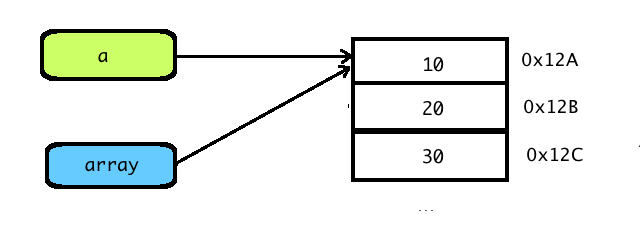

# 2.4 Μέθοδοι
© Γιάννης Κωστάρας

---

[<](../2.2-Loops/README.md) | [Δ](../../README.md) | [>](../2.5-RecursiveMethods/README.md)

---

[](2.4-Methods.ipynb)

### Μαθησιακοί στόχοι
Σε αυτήν την ενότητα θα μάθουμε:

* το αξίωμα "Μην Επαναλαμβάνεσαι"
* για τις μεθόδους (methods) στη Java
* για το πέρασμα ορισμάτων δια τιμής (by value) και δια αναφοράς (by reference)
* για την υπερφόρτωση μεθόδων (method overloading)

## Διαίρει και βασίλευε

Καθώς τα προγράμματά σας θα μεγαλώνουν σε μέγεθος, η συντήρησή τους θα γίνεται όλο και πιο δύσκολη. Όπως ένα βιβλίο χωρίζεται σε κεφάλαια και παραγράφους, έτσι και τα προγράμματά μας μπορούμε να τα «σπάσουμε» σε μικρότερα τμήματα για ευκολότερη κατανόηση και συντήρηση. 

Άλλος λόγος είναι η αποφυγή επαναλαμβανόμενου κώδικα. Αν επαναλαμβάνουμε τμήματα κώδικα πολλές φορές, τότε αν χρειαστεί ν' αλλάξουμε αυτό το τμήμα κώδικα, θα πρέπει να το κάνουμε σε όλα τα αντίγραφα. Αυτή είναι μια συνήθης πηγή λάθους, όπου ξεχνάμε να αλλάξουμε τον κώδικα σε κάποιο από τα αντίγραφα.

**Αξίωμα: «Μην Επαναλαμβάνεσαι» (DRY – Don’t Repeat Yourself)**

Π.χ. στο προηγούμενο μάθημα είδαμε πώς μπορούμε να εμφανίσουμε στην έξοδο τα περιεχόμενα ενός δισδιάστατου πίνακα:

```java
for (int i=0; i < c.length; i++) {
	for (int j=0; j < c[i].length; j++) {
		System.out.print(" | " + c[i][j]);
	}
	System.out.println(" |");
}
```
Αυτό είναι ένα χρήσιμο τμήμα κώδικα το οποίο μπορούμε να το χρησιμοποιήσουμε πολλές φορές, π.χ. πριν και μετά από μια πράξη πάνω σε δισδιάστατους πίνακες. Θα μπορούσαμε να δημιουργήσουμε μια _μέθοδο (method)_, όπως θα δούμε παρακάτω, με το πιο πάνω περιεχόμενο, καλώντας τη κάθε φορά περνώντας απλά τον πίνακα που θέλουμε να εμφανίσουμε στην έξοδο κάθε φορά.

Στη Java αυτό το πετυχαίνουμε τμηματοποιώντας τον κώδικα σε μεθόδους. Μια _μέθοδος (method)_, ή όπως αλλιώς μπορείτε να τη βρείτε και σε άλλες γλώσσες προγραμματισμού, _συνάρτηση (function)_ ή _διαδικασία (procedure)_ ή _υποπρόγραμμα (subprogram)_ ή _υπορουτίνα (subroutine)_, συντάσσεται παρόμοια με τις συναρτήσεις στα μαθηματικά. Π.χ. η συνάρτηση ```y=f(x)``` έχει ένα όνομα, το ```f```, μια λίστα από παραμέτρους μέσα σε παρενθέσεις ```(x)```, και επιστρέφει μια τιμή ```y```. Π.χ. η συνάρτηση ημίτονο ```y=sin(x)```. 

Μια μέθοδος στη Java συντάσσεται ως εξής:
```java
τύπος_επιστροφής όνομα_μεθόδου(τύπος_παραμέτρου1 παράμετρος1, τύπος_παραμέτρου2 παράμετρος2, ...);
```
Π.χ.
```java
jshell> double perimeter(double r) {  // y = perimeter(r)
           return 2*Math.PI*r;        // 2*π*r
        }
| created method perimeter(double)
```
Παραπάνω ορίσαμε μια μέθοδο ```perimeter()``` η οποία λαμβάνει μια παράμετρο τύπου ```double``` με όνομα ```r``` και επιστρέφει μια τιμή τύπου ```double```. Για να την καλέσουμε, αρκεί να δώσουμε μια τιμή στην παράμετρο ```r``` για να μας δώσει μια τιμή τύπου ```double```. Προσέξτε ότι η τιμή που επιστρέφεται από τη μέθοδο είναι αυτή μετά την εντολή ```return```. Το ```Math.PI``` είναι ο τρόπος που ορίζεται η σταθερά ```π``` στη Java. Θα μάθουμε περισσότερα για την κλάση ```Math``` σε επόμενο μάθημα.

Μπορούμε να καλέσουμε την μέθοδο ```perimeter()``` με το όνομά της και περνώντας κάποια τιμή για την παράμετρο ```r```:

```java
jshell> double x = 10
x ==> 10.0
jshell> double y = perimeter(x)
y ==> 62.83185307179586
jshell> /methods
|    perimeter (double)double
```
Στο παραπάνω παράδειγμα, η ```r``` πήρε την τιμή της μεταβλητής ```x``` δηλ. ```10.0``` και η μέθοδος ```perimeter()``` μας επέστρεψε την περίμετρο ενός κύκλου ακτίνας 10. Στο παραπάνω παράδειγμα, το ```r``` ονομάζεται _παράμετρος_ και η τιμή που της περνάμε, δηλ. το ```x```, ονομάζεται _όρισμα (argument)_. Θα μπορούσαμε να καλέσουμε την μέθοδο αυτή απευθείας ως 
```java
jshell> double y = perimeter(10)
y ==> 62.83185307179586
```
Αν μια μέθοδος δεν επιστρέφει κάποια τιμή, τότε ο τύπος επιστροφής είναι ```void``` και δεν απατείται ```return```.

Μεταξύ του μπλοκ της μεθόδου που ορίζεται από τα άγκιστρα ```{}``` μπορούμε να έχουμε οποιοδήποτε αριθμό από εντολές, μεταξύ των οποίων να καλούμε κι άλλες μεθόδους, αλλά καλό είναι να κρατάμε τον αριθμό των εντολών μικρό ώστε η μέθοδός μας να είναι εύκολη στην κατανόηση και τη συντήρηση. Αντί να έχετε μεγάλες μεθόδους που κάνουν πολλά πράγματα καλό είναι να έχετε πολλές μικρές μεθόδους, καθεμιά από τις οποίες να κάνει ένα μόνο πράγμα.

Αν δεν γνωρίζουμε τον ακριβή αριθμό των παραμέτρων, τότε η Java μας παρέχει τη δυνατότητα να χρησιμοποιήσουμε την σύνταξη ```...```. Η σύνταξη ```<Τύπος>...``` είναι ισοδύναμη με ```<Τύπος>[]``` και ονομάζεται _vararg_. Πρέπει να είναι η τελευταία παράμετρος μιας μεθόδου (ή η μοναδική).

```java
jshell> void myPrint(int... numbers) {  // varargs
           for (int i : numbers) {
		       System.out.print(i + " ");
           }
        }    
|  created method myPrint(int...)

jshell> myPrint(1, 2, 3)
1 2 3
```
Άλλο παράδειγμα που δείχνει ότι η σύνταξη ```<Τύπος>...``` είναι ισοδύναμη με την ```<Τύπος>[]```:
```java
jshell> void myPrint(String... lines) {  // varargs
           for (String e : lines) {
		       System.out.println(e);
           }
        }    
|  created method myPrint(String...)
jshell> String[] sentences = new String[] {
"Καλήν εσπέραν άρχοντες",
"πώς είναι ο ορισμός σας"
};
sentences ==> String[2] { "Καλήν εσπέραν άρχοντες", ... }
jshell> myPrint(sentences)
Καλήν εσπέραν άρχοντες
πώς είναι ο ορισμός σας
```

## Εμβέλεια μεταβλητών

Όπως είδαμε και σε προηγούμενο μάθημα, οι μεταβλητές είναι ορατές μόνο στο μπλοκ που ορίζονται μέσα σε ```{ }``` και σε εμφωλιασμένα μπλοκ.

```java
{                                     __
   int x;                               |
   {                           __       |
	int y;                       | y    | x
   }                           __       |
   ...  // η y δεν υπάρχει              |
}                                      __
```
```java
void printTree(int treeWidth) {
   int i;                                              __
   for (i = 1; i < treeWidth; i = i + 2) {               |
      int j;                                       __    |
      for (j = 0; j < (treeWidth - i) / 2; j++)      |   |
         System.out.print(' ');                      |   |
      for (j = 0; j < i; j++)                        j   i
         System.out.print('*');                      |   |
      System.out.println();                          |   |
   }                                                __   |
}                                                       __
```

## Πέρασμα ορισμάτων δια τιμής (by value) και δια αναφοράς (by reference)
Όταν καλέσαμε την μέθοδο ```perimeter(x)``` περνώντας της το όρισμα ```r``` στην παράμετρο ```x```, αυτό που συμβαίνει στο παρασκήνιο είναι ότι η παράμετρος ```r``` παίρνει την τιμή του ορίσματος ```x``` (δηλ. την τιμή ```10```) που χρησιμοποιείται στους υπολογισμούς της περιμέτρου. Αυτό καλείται _πέρασμα παραμέτρων με τιμή (by value)_ καθώς η τιμή του ορίσματος κλήσης ```x``` _αντιγράφεται_ στην παράμετρο ```r```. 



**Εικόνα 2.4.1** _Γραφική αναπαράσταση του περάσματος παραμέτρου δια τιμής (by value)_

Αν αλλάξουμε την τιμή της ```r``` έξω από το σώμα της μεθόδου, η τιμή της ```x``` δεν αλλάζει, καθώς η τιμή της αντιγράφηκε στην ```r```. Αυτό ισχύει κατά κανόνα όταν τα ορίσματα είναι πρωτογενείς τύποι (primitive types). 

```java
jshell> void changeParameter(int i) {
   ...>    i = 10;
   ...>    System.out.println(i);
   ...> }
|  created method changeParameter(int)

jshell> int a = 3
a ==> 3

jshell> changeParameter(a)
10

jshell> a
a ==> 3
```
Στο παραπάνω παράδειγμα δημιουργήσαμε μια μέθοδο ```changeParameter()``` η οποία δέχεται ένα όρισμα τύπου ```int``` και το αλλάζει στο σώμα της μεθόδου (αλλάζει την τιμή του σε ```10```). Στη συνέχεια καλούμε αυτή τη μέθοδο περνώντας της την μεταβλητή ```a``` την οποία έχουμε αρχικοποιήσει στην τιμή ```3```. Ενώ περιμένουμε η μέθοδος ν' αλλάξει την τιμή της μεταβλητής ```a``` σε ```10```, αυτό δε συμβαίνει, και η τιμή της ```a``` παραμένει ```3```. Όπως εξηγήσαμε πιο πάνω, επειδή ο ```int``` είναι πρωτογενής τύπος (raw type) δημιουργείται ένα _αντίγραφο_ της τιμής της ```a``` και το αντίγραφο αυτό είναι που τροποποιείται μέσα στο σώμα της μεθόδου, αφήνοντας την τιμή της αρχικής μεταβλητής ```a``` ανέπαφη.

Όταν τα ορίσματα των μεθόδων είναι όμως τύποι κλάσεων (όπως θα δούμε στα μαθήματα της επόμενης εβδομάδας) ή πίνακες (arrays) τότε _δεν_ αντιγράφεται η τιμή τους, αλλά αντιγράφεται η διεύθυνση μνήμης του αντικειμένου/πίνακα στην μεταβλητή του ορίσματος, γι' αυτό κι αυτή η περίπτωση ονομάζεται _πέρασμα παραμέτρων με αναφορά (by reference)_. Έτσι στο ακόλουθο παράδειγμα, το όρισμα ```array``` αναφέρεται στη θέση μνήμης που δείχνει ο πίνακας ```a```. Αυτό σημαίνει ότι ο κώδικας της μεθόδου ```printArray()``` τροποποιώντας το 1ο στοιχείο του ορίσματος ```array```, τροποποιεί τα δεδομένα του πίνακα ```a```, αφού η ```array``` δείχνει στην ίδια θέση μνήμης με την ```a```. Στην ουσία αυτό που συμβαίνει είναι πάλι πέρασμα δια τιμής (by value) αλλά του δείκτη που δείχνει στη θέση μνήμης που είναι αποθηκευμένο το αντικείμενο (κι όχι αντιγραφή των περιεχομένων του αντικειμένου σε νέα θέση μνήμης). Όπως φαίνεται στην εικόνα 2.4.2, δημιουργείται ένα αντίγραφο του δείκτη ```a```, το οποίο ονομάζεται ```array```, το οποίο δείχνει στην ίδια θέση μνήμης που δείχνει και ο ```a```, με αποτέλεσμα ότι αλλαγές κάνει ο ```array``` στα δεδομένα της συστοιχίας, να εμφανίζονται και στον ```a```.

Γι' αυτό το λόγο θέλει μεγάλη προσοχή όταν αλλάζουμε τις τιμές των ορισμάτων όταν αυτά είναι αντικείμενα ή συστοιχίες (πίνακες). Θα δούμε ακόμα ένα παράδειγμα στα μαθήματα της επόμενης εβδομάδας όταν θα μιλήσουμε για κλάσεις και αντικείμενα κλάσεων.

```java
jshell> void printArray(int[] array) {
   ...>     array[0]=100;
   ...>     for (int i=0; i<array.length; i++) {
   ...>         System.out.print(array[i] + ", ");
   ...>     }
   ...>     System.out.println();
   ...> }
|  created method printArray(int[])

jshell> int[] a = {1, 2, 3, 4, 5};
a ==> int[5] { 1, 2, 3, 4, 5 }

jshell> printArray(a)
100, 2, 3, 4, 5, 

jshell> a
a ==> int[5] { 100, 2, 3, 4, 5 }
```



**Εικόνα 2.4.2** _Γραφική αναπαράσταση του περάσματος παραμέτρου δια αναφοράςς (by reference)_

## Υπερφόρτωση μεθόδων (method overloading)
Μπορούμε να ορίσουμε μεθόδους που έχουν το ίδιο όνομα αλλά δέχονται διαφορετικές παραμέτρους (είτε διαφορετικό αριθμό παραμέτρων είτε ίδιο αριθμό αλλά με διαφορετικούς τύπους δεδομένων).

Π.χ.

```java 
int calculate(int x, int y) {
  return x*y;
}
double calculate(double x, double y) {
	return x*y; 
}
int calculate(int x, int y, int z) {
  return x*y*z;
}
```

Λέμε ότι η μέθοδος ```calculate()``` έχει υπερφορτωθεί. 

Στο jshell δεν μπορούμε να ορίσουμε δυο μεθόδους με το ίδιο όνομα και αριθμό και τύπο παραμέτρων που να επιστρέφουν όμως διαφορετικό τύπο δεδομένων.  

```java
jshell>   int calculate(double x, double y) {
   ...>       return (int)(x*y);
   ...>   }
|  created method calculate(double,double)

jshell>   double calculate(double x, double y) {
   ...>     return x*y; 
   ...>   }
|  replaced method calculate(double,double)

jshell> /methods
...
    double calculate(double,double)
```
Όπως φαίνεται στο παραπάνω παράδειγμα, η πρώτη μέθοδος αντικαταστάθηκε από την δεύτερη, άρα έχουμε μόνο μια μέθοδο, την δεύτερη.

Όταν όμως ορίσουμε τις μεθόδους αυτές μέσα σε μια κλάση, όπως θα δούμε σε επόμενα μαθήματα, τότε αυτό προκαλεί λάθος μεταγλώττισης. Η υπερφόρτωση αφορά μόνο τον _τύπο_ και τον _αριθμό των παραμέτρων_, όχι τον τύπο επιστροφής που πρέπει να είναι ο ίδιος. Θα δούμε στα επόμενα μαθήματα, όταν θα μιλήσουμε για τις κλάσεις, ότι μπορούμε και να επιστρέφουμε διαφορετικό τύπο δεδομένων αλλά μόνο όταν σχετίζονται οι τύποι δεδομένων κατά κάποιο τρόπο.

## Εφαρμογές
Ας δούμε την 2η άσκηση. Θα ορίσουμε μια μέθοδο countLetters() η οποία θα δέχεται ως παράμετρο μια συμβολοσειρά και θα εμφανίζει το αποτέλεσμα στην οθόνη, επομένως δεν θα επιστρέφει τίποτα (void). Θα χρεαστούμε δυο μεταβλητές για να αποθηκεύσουμε το πλήθος των κεφαλαίων και τα πεζών γραμμάτων:

```java
jshell> void countLetters(String s) {
    int uppercaseLetters = 0, lowercaseLetters = 0;
}
|  created method countLetters(String)
```
Αν θυμόμαστε από τα προηγούμενα μαθήματα, ένα ```String``` είναι μια συστοιχία χαρακτήρων (```char[]```), οπότε μπορούμε να προσπελάσουμε έναν έναν τους χαρακτήρες αυτούς και να ελέγξουμε αν είναι κεφαλαίος ή πεζός και να αυξήσουμε την αντίστοιχη μεταβλητή.

Αν ελέγξουμε τον πίνακα [ASCII](http://users.sch.gr/stfotoglou/it/ascii/) (πατήστε στο κουμπί ελέγχου **Εκτεταμένος κώδικας ASCII (Χαρακτήρες άλλων γλωσσών)**) θα παρατηρήσετε ότι οι ελληνικοί χαρακτήρες ```Α-Ω``` και ```α-ω``` (καθώς και οι λατινικοί ```A-Z```, ```a-z```) αποθηκεύονται σε συνεχόμενες θέσεις. Π.χ. τα ```Α-Ω``` αποθηκεύονται από τον δεκαδικό κωδικό ```128-151``` οπότε είναι πολύ εύκολο να ελέγξουμε αν ένας χαρακτήρας είναι πεζός ή κεφαλαίος.  

```java
jshell> void countLetters(String s) {
    int uppercaseLetters = 0, lowercaseLetters = 0;
    for (char c : s.toCharArray()) {
        if (c >= 'A' && c <= 'Ω') {
            uppercaseLetters++;
        } else if (c >= 'α' && c <= 'ω') {
            lowercaseLetters++;
        }
    }
    System.out.println("Κεφαλαία: " + uppercaseLetters + " πεζά: " + lowercaseLetters);
}
|  modified method countLetters(String)

jshell> String phrase = "Σε γνωρίζω από την κόψη Του σπαθιού την τρομερή";
phrase ==> "Σε γνωρίζω από την κόψη Του σπαθιού την τρομερή";

jshell> countLetters(phrase);
Κεφαλαία: 2 πεζά: 32
```

Η παραπάνω μέθοδος ελέγχει μόνο τους ελληνικούς κεφαλαίους και πεζούς χαρακτήρες. Αφήνεται σαν άσκηση να επεκτείνετε τη μέθοδο ώστε να συμπεριλάβετε στα αποτελέσματα και τα τονούμενα ελληνικά γράμματα καθώς και τους λατινικούς χαρακτήρες.

Για την επόμενη άσκηση, χρειαζόμαστε μια μέθοδο η οποία δέχεται ως παράμετρο έναν πίνακα (ή ένα vararg) και θα επιστρέφει έναν πίνακα χωρίς τις διπλότυπες τιμές του αρχικού.

```java
jshell> int[] uniqueElements(int... array) {
    int[] result = new int[array.length];   // αν δεν υπάρχουν διπλότυπα στον αρχικό πίνακα
    int i = 0;
    for (int e : array) {
        if (Arrays.binarySearch(result, e) < 0) {
            result[i++] = e;
        }
    }
    return result;
}
|  created method uniqueElements(int...)
```
Η ```Arrays.binarySearch()``` αναζητά το στοιχείο ```e``` στον πίνακα ```result``` κι αν δεν το βρει επιστρέφει κάποιον αρνητικό αριθμό.

```java
jshell> Arrays.toString(uniqueElements(1, 5, 6, 4, 3, 3, 1, 5));
$10 ==> "[1, 5, 6, 4, 3, 3, 5, 0]"
```

Παρατηρούμε ότι το πρόγραμμά μας δεν λειτουργεί σωστά. Μπορείτε να σκεφτείτε που οφείλεται το λάθος;

Διαβάζοντας στο ΑΡΙ της [Arrays.binarySearch()](https://docs.oracle.com/en/java/javase/17/docs/api/java.base/java/util/Arrays.html#binarySearch(int%5B%5D,int)) παρατηρούμε ότι δουλεύει σωστά μόνο για ταξινομημένους πίνακες.

Θα πρέπει επομένως να γράψουμε την δική μας μέθοδο αναζήτησης. Αυτό το έχουμε κάνει ήδη στο προηγούμενο μάθημα, όπου έχουμε γράψει κώδικα γραμμικής αναζήτησης σε πίνακα. Αρκεί να τον μεταφέρουμε σε μια μέθοδο:

```java
jshell> boolean contains(int[] array, int elem) {
    boolean found = false;
    for (int e : array) {
        if (e == elem) {
            found = true;
            break;
        }
    }
    return found;
}
|  created method contains(int[],int)
```
οπότε η αρχική μας μέθοδο μπορεί να γραφτεί:
```java
jshell> int[] uniqueElements(int... array) {
    int[] result = new int[array.length];   // αν δεν υπάρχουν διπλότυπα στον αρχικό πίνακα
    int i = 0;
    for (int e : array) {
        if (!contains(result, e)) {
            result[i++] = e;
        }
    }
    return result;
}
|  modified method uniqueElements(int...)

jshell> Arrays.toString(uniqueElements(1, 5, 6, 4, 3, 3, 1, 5));
$13 ==> "[1, 5, 6, 4, 3, 0, 0, 0]"
```
Για να μην έχουμε μηδενικά στο τέλος, μπορούμε να αντιγράψουμε τα περιεχόμενα του result σε έναν πίνακα που να 'χει ακριβώς το μέγεθος που θέλουμε με τη βοήθεια της System.arraycopy:
```java
jshell> int[] uniqueElements(int... array) {
    int[] result = new int[array.length];   // αν δεν υπάρχουν διπλότυπα στον αρχικό πίνακα
    int i = 0;
    for (int e : array) {
        if (!contains(result, e)) {
            result[i++] = e;
        }
    }
    int[] newResult = new int[i];  // η i περιέχει το πόσα στοιχεία βρήκαμε
    System.arraycopy(result, 0, newResult, 0, i);
    return newResult;
}
|  modified method uniqueElements(int...)

jshell> Arrays.toString(uniqueElements(1, 5, 6, 4, 3, 3, 1, 5));
$15 ==> "[1, 5, 6, 4, 3]"
```
Η άσκηση 5 μας ζητάει να βρούμε αν ένας θετικός ακέραιος αριθμός είναι πρώτος ή όχι. Μπορούμε να δούμε αν ο αριθμός διαρείται με κάποιον άλλον αριθμό εκτός από τον εαυτό του:
```java
jshell> boolean isPrime(int n) {
    for (int i = 2; i < n; ++i) {
        if (n % i == 0) {
            return false;
        }
    }
    return true;
}
|  created method isPrime(int)

jshell> Scanner in = new Scanner(System.in);
in ==> java.util.Scanner[delimiters=\p{javaWhitespace}+] ... \E][infinity string=\Q∞\E]

jshell> int number = in.nextInt();
3
number ==> 3

jshell> isPrime(number);
$19 ==> true
```

Πώς θα μπορούσαμε να την βελτιώσουμε ώστε να κάνει λιγότερες επαναλήψεις; Αν δεν βρούμε έναν διαιρέτη μέχρι το μισό του αριθμού (δηλ. ```n/2```, τότε σίγουρα οι μεγαλύτεροι αριθμοί του μισού του αριθμού δεν διαιρούν τον αριθμό αυτό. Π.χ. έστω ότι θέλουμε να δούμε αν ο 20 είναι πρώτος ή όχι. 20/10 = 2 και 20%10 = 0 (οπότε δεν είναι) αλλά σίγουρα οι επόμενες διαιρέσεις δεν έχουν νόημα γιατί δεν πρόκειται να βγάλουν μηδενικό υπόλοιπο (π.χ. 20/11 = 1 και 20/11 = 9). Με αυτόν τον τρόπο ήδη μειώσαμε τον αριθμό των επαναλήψεων στο μισό.
```java
jshell> boolean isPrime(int n) {
    for (int i = 2; 2 * i < n; ++i) {
        if (n % i == 0) {
            return false;
        }
    }
    return true;
}
|  modified method isPrime(int)

jshell> int number = in.nextInt();
number ==> 337

jshell> isPrime(number);
$20 ==> true
```
Μπορούμε όμως να μειώσουμε ακόμα τον αριθμό των επαναλήψεων. Κατ' αρχήν, μπορούμε να απορρίψουμε όλους τους ζυγούς αριθμούς και να ελέγξουμε έτσι μόνο τους περιττούς. Επίσης μπορούμε να μειώσουμε ακόμα τον αριθμό των επαναλήψεων σε i < √𝑛 αντί για ```i < n/2```.
```java
jshell> boolean isPrime(int n) {
    if (n == 2) return true;  // ο 2 είναι πρώτος
    if (n % 2 == 0)  return false;   // αν είναι ζυγός τότε δεν είναι πρώτος
    for (int i = 3; i * i < n; i += 2) {  // i < $\sqrt{n}$ 
        if (n % i == 0) {
            return false;
        }
    }
    return true;
}
|  modified method isPrime(int)

jshell> isPrime(in.nextInt());
337
$25 ==> true
```
Το κόσκινο του Ερατοσθένη (άσκηση 6) είναι ένα κλασσικό πρόβλημα προγραμματισμού. Δείτε πώς δουλεύει π.χ. εδώ. Προτού όμως προσπαθήσουμε να υλοποιήσουμε τον αλγόριθμο αυτό, ας δούμε πώς μπορούμε να βρούμε τους n πρώτους αριθμούς χρησιμοποιώντας την μέθοδο ```isPrime()``` που μόλις γράψαμε:
```java
int[] primeNumbers(int n) {
    int[] primes = new int[n];
    int k = 0;
    for (int i = 2; i <= n; i++) {
        if (isPrime(i)) {
            primes[k++] = i;
        }
    }
    int[] result = new int[k];
    System.arraycopy(primes, 0, result, 0, k);
    return result;
}
|  created method primeNumbers(int)
```

Ας δούμε λοιπόν τους πρώτους αριθμούς μέχρι τον αριθμό ```n```:
```java
jshell> int[] primeNumbers = primeNumbers(in.nextInt());
120
primeNumbers ==> int[33] { 2, 3, 5, 7, 9, 11, 13, 17, 19, 23, 25,  ...  101, 103, 107, 109, 113 }
```
Ας δούμε τώρα πώς μπορούμε να υλοποιήσουμε την ```primeNumbers()``` με τον αλγόριθμο του Ερατοσθένη. Έστω ότι θέλουμε να βρούμε ποιοί από τους παρακάτω αριθμούς είναι πρώτοι:
```
2, 3, 4, 5, 6, 7, 8, 9, 10, 11, 12, 13, 14, 15
```
Στη συνέχεια διαγράφουμε διαδοχικά τα πολλ/σια των 2, 3, 5, κ.ο.κ.

2, 3, ~4~, 5, ~6~, 7, ~8~, 9, ~10~, 11, ~12~, 13, ~14~, 15

2, 3, ~4~, 5, ~6~, 7, ~8~, ~~9~~, ~10~, 11, ~12~, 13, ~14~, ~~15~~

Η διαδικασία επαναλαμβάνεται μέχρις την √15 = 3.

```java
jshell> int[] sieveOfEratosthenis(int n) {
    boolean[] isPotentiallyPrime = new boolean[n+1];  // (0..n)
    Arrays.fill(isPotentiallyPrime, true);   // αρχικά όλοι είναι πρώτοι
    for (int p = 2; p*p <= n; p++) {         // p <= $\sqrt{n}$
        if (isPotentiallyPrime[p]) {         // ο p είναι πρώτος
            // Τα πολλ/σια του p δεν είναι πρώτοι
            for (int i = p * p; i <= n; i += p) {
                isPotentiallyPrime[i] = false;  
            }
        }
    }
    return booleanToIntArray(isPotentiallyPrime);
}
|  created method sieveOfEratosthenis(int), however, it cannot be invoked until method booleanToIntArray(boolean[]) is declared

jshell> int[] booleanToIntArray(boolean[] isPotentiallyPrime) {
    int[] primes = new int[isPotentiallyPrime.length];
    int k = 0;
    for (int i = 2; i < isPotentiallyPrime.length; i++) {
        if (isPotentiallyPrime[i]) {
            primes[k++] = i;
        }
    }
    int[] result = new int[k];
    System.arraycopy(primes, 0, result, 0, k);
    return result;
}
|  created method booleanToIntArray(boolean[])

jshell> sieveOfEratosthenis(in.nextInt());
120
$30 ==> int[30] { 2, 3, 5, 7, 11, 13, 17, 19, 23, 29, 31, 37, 41, 43, 47, 53, 59, 61, 67, 71, 73, 79, 83, 89, 97, 101, 103, 107, 109, 113 }
```

Δοκιμάστε να δείτε πώς δουλεύει βήμα βήμα στο [PythonTutor](https://pythontutor.com/visualize.html#mode=edit).

Δείτε και το [Φωτόδενδρο](http://photodentro.edu.gr/v/item/ds/8521/10783).

Ας δούμε την άσκηση 7 (αναγραμματισμός). Πώς θα μπορούσαμε να δούμε αν μια συμβολοσειρά είναι αναγραμματισμός μια άλλης; Βασικά θα πρέπει να ελέγξουμε αν περιέχουν ακριβώς τα ίδια σύμβολα.

Ένας τρόπος είναι να ταξινομήσουμε και τις δυο συμβολοσειρές και στη συνέχεια να ελέγξουμε ένα ένα τους χαρακτήρες τους για να δούμε αν είναι ίδιοι:
```java
jshell> boolean isAnagram(String s1, String s2) {
    if (s1.length() != s2.length()) {  // αν δεν έχουν ίδιο μήκος τότε σίγουρα δεν είναι
        return false;
    }
    char[] c1 = s1.toCharArray();
    char[] c2 = s2.toCharArray();
    Arrays.sort(c1);
    Arrays.sort(c2);
    return Arrays.equals(c1, c2);
}
|  created method isAnagram(String,String)

jshell> isAnagram("ΦΑΡΟΣ", "ΑΦΡΟΣ");
$32 ==> true

jshell> isAnagram("ΚΑΛΟΣ", "ΚΑΚΟΣ");
$33 ==> false
```
Οι υπόλοιπες ασκήσεις αφήνονται σε σας προς επίλυση.


## Ασκήσεις
1. Να γράψετε δυο μεθόδους που θα δέχονται ως παραμέτρους την ακτίνα σφαίρας και θα υπολογίζουν η μία την επιφάνεια και η άλλη τον όγκο της σφαίρας. ([Χρήσιμος υπερσύνδεσμος](https://www.calculat.org/gr/%CF%8C%CE%B3%CE%BA%CE%BF%CF%82-%CE%B5%CF%80%CE%B9%CF%86%CE%AC%CE%BD%CE%B5%CE%B9%CE%B1/%CF%83%CF%86%CE%B1%CE%AF%CF%81%CE%B1.html)).
2. Να γράψετε μια μέθοδο που μετράει τα κεφαλαία και πεζά γράμματα σε μια φράση που περνιέται σ’ αυτήν ως όρισμα. (Στην επίλυση του βίντεο δεν μετρώνται τα τονούμενα πεζά γράμματα. Τροποποιήστε τη λύση του βίντεο ώστε να προσμετρώνται τα πεζά και τα τονούμενα γράμματα). 
3. Να γράψετε μια μέθοδο που λαμβάνει ως παράμετρο έναν πίνακα από αριθμούς ή ένα vararg και επιστρέφει έναν πίνακα με τα μοναδικά στοιχεία του αρχικού. 
4. Να γράψετε μέθοδο ```initials(String text)``` που δέχεται ως είσοδο ένα κείμενο και επιστρέφει το κείμενο με το αρχικό μόνο σύμβολο κάθε λέξης του (π.χ. αν ```text = "Καλημέρα σας"```, επιστρέφει ```"Κ. Σ."```).
5. Να γράψετε μια μέθοδο που να επιστρέφει αν ένας ακέραιος είναι πρώτος ή όχι. Πρώτος ονομάζεται ένας αριθμός αν διαιρείται μόνο από το 1 και τον εαυτό του.
6. Να υλοποιήσετε στη Java το κόσκινο του Ερατοσθένη για να υπολογίσετε όλους τους πρώτους αριθμούς μέχρι έναν συγκεκριμένο ακέραιο ```n``` (```int[] sieveOfEratosthenis(int n)```) όπως περιγράφεται στη [Βικιπέδια](https://el.wikipedia.org/wiki/%CE%9A%CF%8C%CF%83%CE%BA%CE%B9%CE%BD%CE%BF_%CF%84%CE%BF%CF%85_%CE%95%CF%81%CE%B1%CF%84%CE%BF%CF%83%CE%B8%CE%AD%CE%BD%CE%B7).
7. Επαναλάβετε την άσκηση 2 (Αλγόριθμος κρυπτογράφησης του Καίσαρα) του 4ου μαθήματος γράφοντας δυο γενικές μεθόδους ```String encrypt(String plainText, int key)``` και ```String decrypt(String encryptedText, int key)``` που θα κωδικοποιούν και θα αποκωδικοποιούν ένα αλφαριθμητικό που περνιέται ως όρισμα σύμφωνα με τον αλγόριθμο κρυπτογράφησης του Καίσαρα.
8. Να γραφτεί μια μέθοδος ```boolean anagram(String s1, String s2)``` που θα δέχεται δυο συμβολοσειρές και επιστρέφει ```true``` αν η μία είναι αναγραμματισμός της άλλης. Π.χ. η λέξη ```ΦΑΡΟΣ``` είναι αναγραμματισμός της λέξης ```ΑΦΡΟΣ```.
9. Μια συμβολοσειρά ονομάζεται _παλινδρομική (palidrome)_ αν διαβάζεται το ίδιο και από τα δεξιά και από τ' αριστερά (π.χ. η λέξη ```radar```). Να γράψετε μια μέθοδο ```boolean palidrome(String s)``` που να διαβάζει μια συμβολοσειρά και να εξετάζει αν είναι παλιδρομική ή όχι.
10. Να γράψετε δυο μεθόδους που να υπολογίζουν το Ε.Κ.Π. και το Μ.Κ.Δ. δυο ακέραιων αριθμών.
11. Να γράψετε μια μέθοδο που να κατασκευάζει ένα μαγικό τετράγωνο 5x5, δηλ. ένα δισδιάστατο πίνακα με τους αριθμούς 1 έως  25, μία ϕορά ο καθένας, έτσι ώστε σε κάθε γραμμή, κάθε στήλη και κάθε μία από τις δύο διαγωνίους να έχουμε το ίδιο άθροισμα.
12. Μαγικοί αριθμοί. Ο μυστήριος αριθμός ```6174```. Γιατί; Για να το βρείτε υλοποιήστε τον παρακάτω αλγόριθμο:

Αλγόριθμος

1. Γράψτε μια μέθοδο που δέχεται ως όρισμα έναν 4-ψήφιο θετικό αριθμό του οποίου όλα τα ψηφία είναι διαφορετικά, π.χ. 3546 είναι έγκυρο όρισμα (τα 3333 ή 2335 όχι).
2. Ταξινομήστε τα ψηφία του σε αύξουσα και φθίνουσα σειρά, π.χ. 6543 και 3456.
3. Αφαιρέστε τους δυο αριθμούς
4. Επαναλάβετε τα βήματα 2 και 3:

Π.χ. δοθέντος του 3546:
```
6543-3456 = 3087
8730-0378 = 8352
8532-2358 = 6174
7641-1467 = 6174 ....
```

Όταν σε δυο διαδοχικά βήματα λάβουμε το ίδιο αποτέλεσμα (6174) ο αλγόριθμος τερματίζεται.
Σε κάθε 4-ψήφιο αριθμό (με διαφορετικά ψηφία) στον οποίο εφαρμόζεται ο παραπάνω αλγόριθμος επιστρέφει το μαγικό αριθμό 6174.
Οι μαθηματικοί κατάφεραν να ελέγξουν 8891 τέτοιους 4-ψήφιους αριθμούς και έφτασαν στο αποτέλεσμα 6174 μετά το πολύ 7 αφαιρέσεις!!! Εσείς;

---

[<](../2.3-Arrays/README.md) | [Δ](../../README.md) | [>](../2.5-RecursiveMethods/README.md)

---