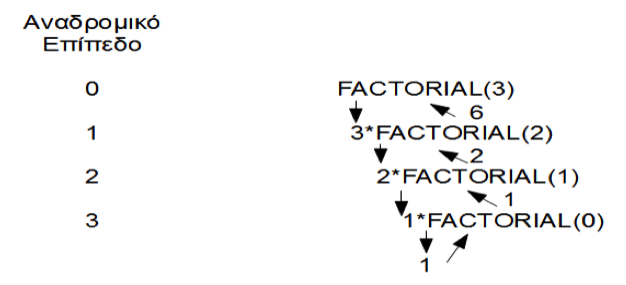

# 2.5 Αναδρομικές Μέθοδοι
© Γιάννης Κωστάρας

---

[<](../2.4-Methods/README.md) | [Δ](../../README.md) | [>](../2.6-IDEs/README.md)

---

[](2.5-RecursiveMethods.ipynb)

### Μαθησιακοί στόχοι
Σε αυτήν την ενότητα θα μάθουμε:

* για τις αναδρομικές μεθόδους (recursive methods) στη Java

## Αναδρομή
Μια μέθοδος ονομάζεται αναδρομική όταν καλεί τον εαυτό της.

Υπάρχουν δύο προϋποθέσεις για τη χρήση αναδρομικών συναρτήσεων για την επίλυση ενός συγκεκριμένου προβλήματος:

1. Πρέπει να υπάρχει μια _βασική συνθήκη_ ή _συνθήκη τερματισμού_ για το πρόβλημα, η οποία θα είναι το τελικό σημείο για την αναδρομή. Όταν η αναδρομική συνάρτηση φτάνει στη βασική συνθήκη, δεν κάνει περαιτέρω (βαθύτερες) αναδρομικές κλήσεις.
2. Κάθε επίπεδο αναδρομής θα πρέπει να επιχειρεί σε ένα μικρότερο πρόβλημα. Η αναδρομική συνάρτηση έτσι διαιρεί το πρόβλημα σε όλο και μικρότερα μέρη. Υποθέτοντας ότι το πρόβλημα είναι πεπερασμένο, αυτό θα εξασφαλίσει ότι η αναδρομή τερματίζεται.

Η παρακάτω αναδρομική μέθοδος καλεί τον εαυτό της για να υπολογίσει το παραγοντικό ενός ακεραίου θετικού αριθμού. Π.χ., 5 παραγοντικό ή  ```5! = 5 x 4 x 3 x 2 x 1 = 120```. 
Ο υπολογισμός του παραγοντικού μπορεί να γενικευθεί ως εξής: ```n! = n x (n − 1) x (n − 2) x ... x 2 x 1``` το οποίο μας οδηγεί στον ακόλουθο αναδρομικό ορισμό:

!,&space;n>1&space;&space;&space;&space;\end{array}\right.)

τον οποίο μπορούμε πολύ εύκολα να γράψουμε σε Java:


```Java
// υπολογισμός του n!
int factorial(int n) {
     if (n <= 1) {
        return 1;
     } else {
        return n * factorial(n-1);
     }
}
```
```java
jshell> factorial(3)
6
```
Η ```factorial()``` καλεί τη ```factorial()``` μέσα στο σώμα της. Μια αναδρομική μέθοδος θα πρέπει να έχει μια συνθήκη τερματισμού διαφορετικά δε θα τερματίσει ποτέ. Η ```factorial()``` διαθέτει τη συνθήκη τερματισμού ```if (n <= 1)``` που πρέπει να κληθεί τελικά. Επίσης, κάθε επίπεδο αναδρομής θα πρέπει να επιχειρεί σε ένα μικρότερο πρόβλημα. Παρατηρήστε πώς κάθε φορά μικραίνει το πρόβλημα καλώντας ένα μικρότερο αριθμό (```n-1```).



**Εικόνα 2.5.1** _Υπολογισμός παραγοντικού αναδρομικά_

Τι θα συμβεί αν δεν ικανοποιείται μία ή και οι δυο παραπάνω δυο συνθήκες; Σε αυτήν την περίπτωση το πρόγραμμα καταναλώνει όλη τη μνήμη στοίβας (stack memory) (θα μάθουμε τι είναι η μνήμη στοίβας σε επόμενο μάθημα) με αποτέλεσμα να εγείρεται μια εξαίρεση ```StackOverflowException``` (θα μάθουμε και για τις εξαιρέσεις σε επόμενο μάθημα) με αποτέλεσμα το πρόγραμμά σας να τερματίζεται λόγω εξαντλήσεως της μνήμης της ΕΜ.

Γενικά ισχύει ότι όλα τα αναδρομικά προγράμματα μπορούν να γραφτούν και επαναληπτικά (δηλ. με κάποιο βρόγχο) αν και τα ανάποδο δεν ισχύει πάντα. (Πώς θα μπορούσατε να υπολογίσετε το παραγοντικό χωρίς αναδρομή;)

## Εφαρμογές

Ας δούμε την 3η άσκηση. Η δημιουργία μιας αναδρομικής μεθόδους υπολογισμού των αριθμών Fibonacci δεν είναι δύσκολη. 

&space;=&space;\left\{&space;&space;&space;&space;\begin{array}{ll}&space;&space;&space;&space;&space;&space;&space;&space;1,&space;n=0,&space;n=1&space;\\&space;&space;&space;&space;&space;&space;&space;&space;2,&space;n=2&space;\\&space;&space;&space;&space;&space;&space;&space;&space;fib(n-1)&space;\cdot&space;fib(n-2),&space;n>2&space;&space;&space;&space;\end{array}\right.)

Η συνθήκη τερματισμού είναι ότι αν ```n=1``` ή ```n=2``` τότε ο αριθμός Fibonacci είναι ```1``` και ```2``` αντίστοιχα. Επιβεβαιώστε τα αποτελέσματα [εδώ](https://www.omnicalculator.com/math/fibonacci).


```Java
long fibonacci(int n) {
  long fib = -1;
  if (n < 0) {
    System.err.println("error! -- input must be a positive integer");
  } else if (n < 2) {
    fib = n;
  } else {
    fib = fibonacci(n-1) + fibonacci(n-2);
  }
  return fib;
}
```

```Java
jshell> fibonacci(10)
55
```
Ο παραπάνω αλγόριθμος είναι πολύ αργός και καθόλου έξυπνος. Π.χ. επανυπολογίζει κάθε φορά τους προηγούμενους αριθμούς Fibonacci ενώ θα μπορούσε π.χ. να τους αποθηκεύσει κάπου προσωρινά.

Όπως αναφέρεται και στην εκφώνηση της άσκησης, υπάρχει ένας πολύ γρήγορος αναδρομικός αλγόριθμος. Ας τον υλοποιήσουμε:


```Java
long fastFibonacci(int n) {
  long fib = 0;
  if (n < 0)
    System.err.println("error! -- input must be a positive integer");
  else if (n < 2)
    fib = n;
  else if (n % 2 == 0) { 
    // F(2N) = 2F(N-1)*F(N) + F(N)*F(N)
    long fn = fastFibonacci(n / 2);
    fib=2*fn*fastFibonacci(n/2-1)+fn*fn;
  } else {	
    // F(2N-1) = F(N)*F(N) + F(N-1)*F(N-1)
    long fn = fastFibonacci((n-1)/2);
    long fn_1 = fastFibonacci((n+1)/2);
    fib = fn*fn + fn_1*fn_1;
  }
  return fib;
}
```
```Java
jshell> fastFibonacci(46)
1836311903
```
Ας δούμε και την άσκηση 6:

```Java
String reverse(String s) {
  if (s.length() == 1) {
     return s;
  }
  return reverse(s.substring(1)) + s.charAt(0);
}
```
Παρατηρήστε ότι προσθέτουμε το πρώτο γράμμα της συμβολοσειράς κάθε φορά στο τέλος και επαναλαμβάνουμε αναδρομικά με την υπόλοιπη συμβολοσειρά (εκτός του πρώτου γράμματός της).
```Java
jshell> reverse("Καλημέρα");
αρέμηλαΚ

jshell> reverse("radar");
radar
```

Οι υπόλοιπες ασκήσεις αφήνονται για επίλυση από εσάς.

## Ασκήσεις
1. [Να γράψετε μια αναδρομική μέθοδο ```long sum(int n)``` που θα υπολογίζει το άθροιμα ```1+2+...+n```.](https://codecheck.io/files/2311251528auw9ts97mkzkbahf08fjxani8)
2. [Να γράψετε μια αναδρομική μέθοδο υπολογισμού της ν-στής δύναμης ενός αριθμού: 
   ```long power(int num, int exp) {...}```.](https://codecheck.io/files/23112515348g3m6tsbl87i2wvlxdfh32u0g)
3. [Να γράψετε μια αναδρομική μέθοδο που θα υπολογίζει τον αριθμό fibonacci](https://codecheck.io/files/23112420529cnhx13wesi4vumf5fedckk4c). Ο αριθμός fibonacci ορίζεται ως: 

&space;=&space;\left\{\begin{array}{ll}&space;&space;&space;&space;1,&space;n=0,&space;n=1&space;\\&space;&space;&space;&space;2,&space;n=2&space;\\&space;&space;&space;&space;fib(n-1)&space;\cdot&space;fib(n-2),&space;n>2\end{array}\right.)

   **Υπόδειξη:** _Υπάρχει και ένας πιο γρήγορος αναδρομικός αλγόριθμος υπολογισμού_:
   
  * ```f(2n)=2 · f(n-1) · f(n) + f(n) · f(n)```, αν ο ```n``` είναι ζυγός
  * ```f(2n-1)=f(n) · f(n) + f(n-1) · f(n-1)```, αν ο ```n``` είναι μονός
 
   _(Προσέξτε να διαιρέσετε με το 2 για να υπολογίσετε το f(n))_.

4) Να γραφτεί μια αναδρομική μέθοδος που θα υπολογίζει το Μέγιστο Κοινό Διαιρέτη (ΜΚΔ) δυο φυσικών αριθμών ```m``` και ```n``` σύμφωνα με τον αλγόριθμο του Ευκλείδη:

&space;=&space;\left\{&space;&space;&space;&space;\begin{array}{ll}&space;&space;&space;&space;&space;&space;&space;&space;n&space;&space;&space;&space;&space;&space;&space;&space;&space;&space;&space;&space;&space;&space;,&space;n<=m&space;\&space;\&&space;\&space;m&space;\cdot&space;mod\&space;n&space;=&space;0&space;\\&space;&space;&space;&space;&space;&space;&space;&space;MKD(m,&space;n)&space;&space;&space;&space;&space;&space;,&space;m&space;<&space;n&space;\\&space;&space;&space;&space;&space;&space;&space;&space;MKD(m,&space;m&space;\cdot&space;mod\&space;n),&space;m\geq&space;n&space;&space;&space;\end{array}&space;\right.)

5) [Να γράψετε μια αναδρομική μέθοδο δυαδικής αναζήτησης (binary search).](https://codecheck.io/files/231130221193s63om5k2nvjwjoxccvzdpgz)

6) [Να γράψετε μια αναδρομική μέθοδο που αντιστρέφει μια συμβολοσειρά ```String reverse(String s)```.](https://codecheck.io/files/23113021588gb8g8p0gpynkrbev2hfk5yvr)

7) [Να γράψετε μια αναδρομική μέθοδο που να ελέγχει αν μια συμβολοσειρά είναι παλινδρομική.](https://codecheck.io/files/23113021147rt1wq0qcdfocwak0dp9trczu)

---

[<](../2.4-Methods/README.md) | [Δ](../../README.md) | [>](../2.6-IDEs/README.md)

---

