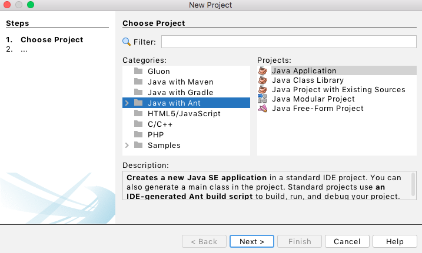
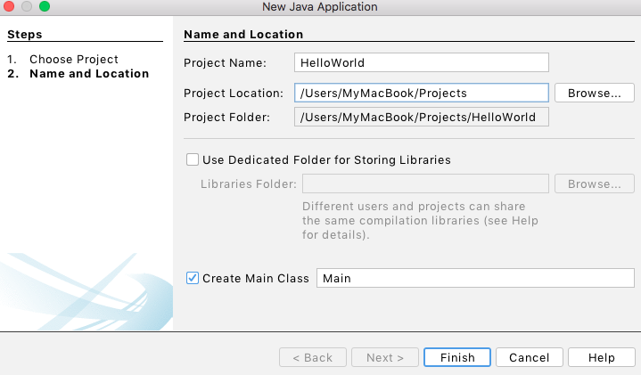
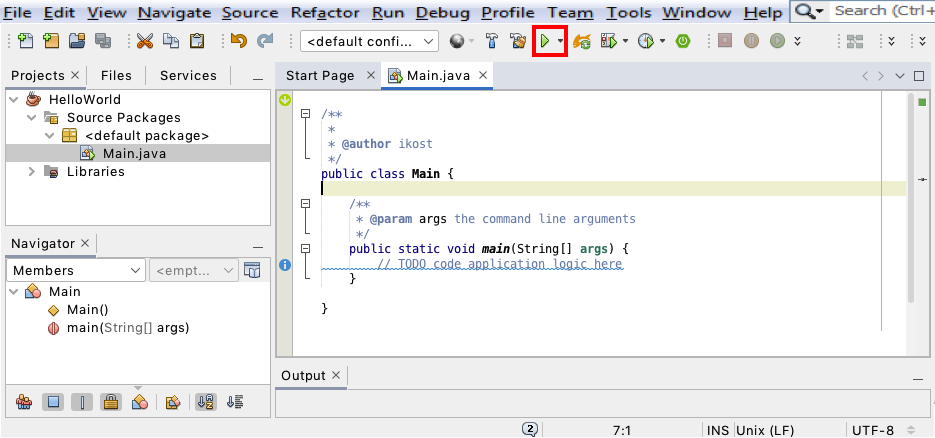
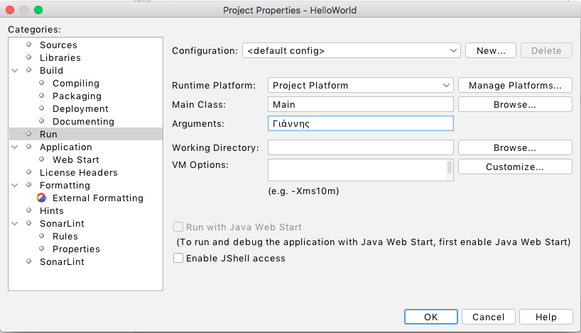
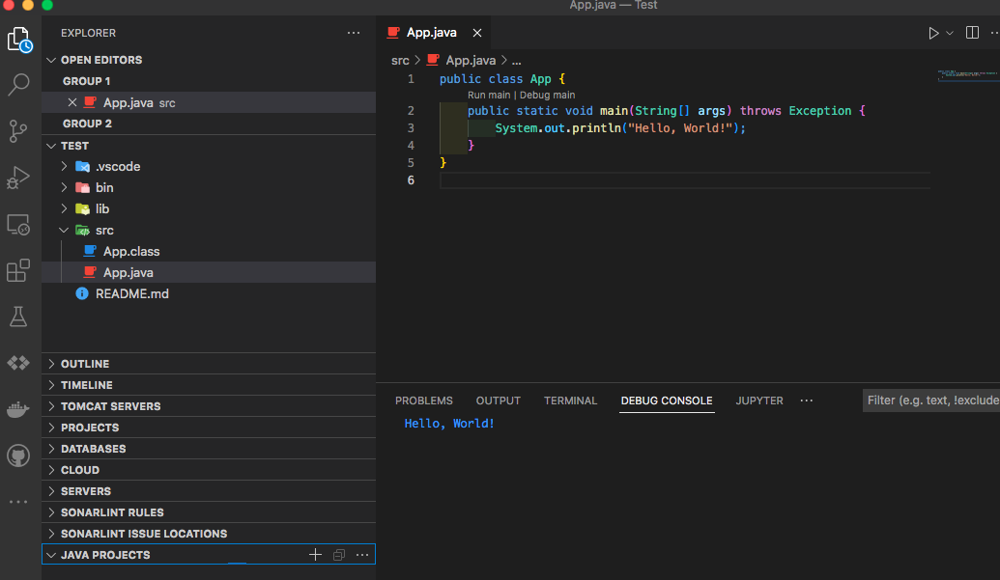
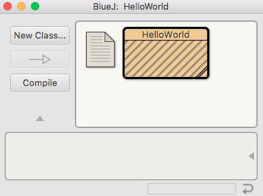

# 2.6 Δημιουργία του πρώτου μας προγράμματος Java σε ένα ΟΠΕ
© Γιάννης Κωστάρας

---

[🏠](https://jkost.github.io) | [⬆️](../../README.md) | [◀️](../2.5-RecursiveMethods/README.md) | [▶️](../2.7-Debugging/README.md)

---

[](2.6-IDEs.ipynb)

### Μαθησιακοί στόχοι
Σε αυτήν την ενότητα θα μάθουμε:

* πώς να γράψουμε το πρώτο μας εκτελέσιμο πρόγραμμα Java με έναν απλό κειμενογράφο καθώς και με ΟΠΕ
* πώς να μεταγλωττίσουμε και να εκτελέσουμε το πρόγραμμά μας
* πώς να διαβάζουμε τα ορίσματα γραμμής εντολών που περνά στο πρόγραμμά μας ο χρήστης

## Εισαγωγή

Μέχρι τώρα γνωρίσαμε τις εντολές της γλώσσας Java μέσα από το JShell. Αλλά τα πραγματικά προγράμματα Java δεν τα τρέχουμε μέσα από το JShell. Μπορούμε να χρησιμοποιήσουμε έναν απλό κειμενογράφο όπως το Notepad, Notepad++, Sublime, TextMate, Vi, Emacs κλπ. ή μπορούμε να χρησιμοποιήσουμε ένα _Ολοκληρωμένο Περιβάλλον Εργασίας_ (_ΟΠΕ_ ή _Integrated Development Environment, IDE_). 

## Το πρώτο μας εκτελέσιμο πρόγραμμα Java με έναν κειμενογράφο
Ανοίξτε τον αγαπημένο σας κειμενογράφο (προσοχή θέλουμε έναν κειμενογράφο που μπορεί να αποθηκεύει απλό κείμενο, π.χ. το Word δεν μας βοηθάει), και γράψτε το παρακάτω πρόγραμμα:

```java
public class HelloWorld {
   public static void main(String[] args) {
     System.out.println("Hello, World!");
   }
}
```
Αναγνωρίζετε ίσως την εντολή ```System.out.println("Hello, World!");```. Τα πάντα στην Java είναι κλάσεις (class). Θα μιλήσουμε για τις κλάσεις στα μαθήματα της επόμενης εβδομάδας. Ορίζουμε μια κλάση με την δεσμευμένη λέξη ```class``` και το όνομα της κλάσης ```HelloWorld```. Για την ονομασία των κλάσεων (αλλά και όλων των ονομάτων που ορίζουμε εμείς στο πρόγραμμα), ακολουθείται, εκ συμβάσεως, ο "τρόπος καμήλας" (Camel case), δηλ. όταν ξεκινά μια νέα λέξη αυτή ξεκινά με κεφαλαίο γράμμα. Έτσι, π.χ. το όνομα της κλάσης μας αποτελείται από δυο λέξης _Hello_ και _World_ και ακολουθώντας τον τρόπο καμήλας την ονομάζουμε _HelloWorld_. Σε άλλες γλώσσες προγραμματισμού που χρησιμοποιείται π.χ. ο χαρακτήρας κάτω παύλα (```_```) θα ονομαζόταν ```Hello_world```, αλλά αυτό δε συνιστάται στη Java.

Το ```public``` δηλώνει ότι αυτή η κλάση είναι δημόσια, δηλ. προσβάσιμη από οπουδήποτε στο πρόγραμμα αλλά και από την ΕΜ (JVM). Τα προγράμματα Java αποτελούνται από δεκάδες, εκατοντάδες ή και χιλιάδες κλάσεις. 

Όπως έχουμε ήδη δει, ένα μπλοκ κώδικα περικλείεται μέσα σε άγκιστρα ```{}```, οπότε τα άγκιστρα ορίζουν την αρχή και το τέλος της κλάσης. Μέσα σε μια κλάση ορίζουμε μεθόδους. Η κλάση μας περιέχει μια μόνο μέθοδο με όνομα ```main()```  που έχει ως παράμετρο μια συστοιχία τύπου ```String[]``` με όνομα ```args``` (φυσικά μπορείτε να ονομάσετε την παράμετρο όπως εσείς θέλετε αλλά συνηθίζεται να την ονομάζουμε ```args```) και η οποία δεν επιστρέφει κάποια τιμή (```void```). Η παράμετρος ```args``` περιέχει τα ορίσματα εισόδου της γραμμής εντολών που πληκτρολογεί ο χρήστης όταν καλεί το πρόγραμμα. Έχετε δει π.χ. εντολές του Linux ή του DOS όπως ```cp file1 dir1``` που αντιγράφει το αρχείο ```file1``` στο φάκελο ```dir1```. Τα ```file1``` και ```dir1``` είναι ορίσματα εισόδου της εντολής ```cp```. Αν η εντολή ```cp``` ήταν γραμμένη σε Java, τότε αυτές θα αποθηκεύονταν στην παράμετρο ```args``` και θα ήταν διαθέσιμα στη ```main()```. Θα δούμε ένα παράδειγμα παρακάτω.

Η ```main()``` έχει μια ιδιαίτερη σημασία στη Java. Όπως και στη C/C++ και άλλες γλώσσες προγραμματισμού, δηλώνει την αρχή του προγράμματός μας. Κάθε πρόγραμμα Java πρέπει να περιέχει μια μέθοδο ```main()``` μέσα σε μια κλάση η οποία εκτελείται πρώτη από την ΕΜ της Java. Είναι το σημείο εκκίνησης του προγράμματός σας.

Πριν την εμφάνιση του jshell στην έκδοση 9 της Java, όλα τα βιβλία Java ξεκινούσαν με το παραπάνω πρόγραμμα καθώς δεν υπήρχε η δυνατότητα να εκτελέσει κανείς προγράμματα Java παρά μόνο μέσα από μια κλάση με μια μέθοδο ```main()```.

Αποθηκεύστε το πρόγραμμα σε ένα αρχείο με όνομα ```HelloWorld.java```. Συνίσταται να αποθηκεύουμε το αρχείο με το ίδιο όνομα όπως και η κλάση μας. Στη συνέχεια ανοίξτε μια γραμμή εντολών DOS ή ένα κέλυφος shell και δώστε την εντολή:

```bash
$ java Helloworld.java
Hello, World!
``` 

Από την έκδοση 11 και μετά μπορούμε να εκτελέσουμε ένα πρόγραμμα Java που περιορίζεται _σε ένα μόνο αρχείο_ με την εντολή ```java``` όπως είδαμε παραπάνω. Προσοχή όμως, αυτό ισχύει για ένα μόνο αρχείο ```.java```. Αν το πρόγραμμά σας αποτελείται από πολλά αρχεία ```.java```, η εντολή αυτή δε θα δουλέψει. Μπορείτε όμως να ορίσετε πολλές κλάσεις σ' ένα αρχείο ```.java``` αρκεί η κλάση που περιέχει τη μέθοδο ```main()``` να ορίζεται πρώτη στο αρχείο. Διαβάστε περισσότερα [εδώ](https://www.infoq.com/articles/single-file-execution-java11/).

Πριν την έκδοση 11, έπρεπε πρώτα να μεταγλωττίσουμε τον πηγαίο κώδικα παράγοντας το αρχείο ```HelloWorld.class``` και στη συνέχεια να εκτελέσουμε το ```.class``` αρχείο:

```bash
$ javac Helloworld.java
$ ls
HelloWorld.class HelloWorld.java
$ java HelloWorld
Hello, World!
``` 
Τροποποιήστε τώρα το πρόγραμμα όπως παρακάτω:

```java
public class HelloWorld {
   public static void main(String[] args) {
       if (args.length == 1) {
           System.out.println("Hello " + args[0]);
       } else {
           System.out.println("Hello, World!");
       }
   }
}
```
και εκτελέστε το ως εξής:
```bash
$ java Helloworld.java Γιάννης
Hello Γιάννης
```

Μπορούμε επομένως να διαβάσουμε δεδομένα από το χρήστη με δυο τρόπους:

1. Περνώντας ορίσματα γραμμής εντολών κατά την εκτέλεση του προγράμματος
1. Με την ```Scanner``` όπως είδαμε στα προηγούμενα μαθήματα

_Άσκηση:_ Τροποποιήστε το παραπάνω πρόγραμμα ώστε να εμφανίζει στην έξοδο τις παραμέτρους γραμμής εντολής που εισήγαγε ο χρήστης σε διαφορετικές γραμμές. Π.χ.:

```bash
$ java HelloWorld Δευτέρα Τρίτη Τετάρτη
Δευτέρα
Τρίτη
Τετάρτη
```

## Το πρώτο μας εκτελέσιμο πρόγραμμα Java με ένα ΟΠΕ

Αν και μπορείτε κάλλιστα να αναπτύξετε προγράμματα, να τα μεταγλωττίσετε και να τα εκτελέσετε όπως περιγράψαμε προηγουμένως, δηλ. χρησιμοποιώντας τη γραμμή εντολών, ένα ΟΠΕ σας βοηθάει να αναπτύξετε προγράμματα ευκολότερα και γρηγορότερα.
  
Ας δούμε πώς μπορούμε να γράψουμε το παραπάνω πρόγραμμα στο NetBeans. Κατ' αρχήν θα πρέπει να δημιουργήσουμε ένα νέο έργο (project). Από το μενού **File -> New Project** επιλέξτε την κατηγορία **Java** και το Project **Java Application**, όπως φαίνεται στην παρακάτω εικόνα, και πατήστε **Next**.



**Εικόνα 2.6.1** _Δημιουργία νέου έργου Java (Βήμα 1)_

Δώστε το όνομα _HelloWorld_ για το έργο και επιλέξτε το φάκελο στον οποίο θα αποθηκευθεί (βλ. Εικόνα 2).



**Εικόνα 2.6.2** _Δημιουργία νέου έργου Java (Βήμα 2)_

Όπως βλέπετε στην εικόνα 3, έχει δημιουργηθεί μια νέα κλάση ```Main``` η οποία περιλαμβάνει τη στατική μέθοδο ```main()```.
 


**Εικόνα 2.6.3** _Δημιουργία κενού έργου Java_

_Συμβουλή για NetBeans_ Πληκτρολογήστε ```psvm``` και ```Tab``` για να εμφανίσει το NetBeans ```public static void main(String[] args) {}```.

Επικολλήστε τον παρακάτω κώδικα μέσα στη μέθοδο ```main()```:

```
System.out.println("Hello, World!");
```

_Συμβουλή για NetBeans_ H συντομογραφία ```sout``` και ```Tab``` εκτυπώνει την εντολή ```System.out.println```.

Για να μεταγλωττίσετε το αρχείο ```HelloWorld.java``` και να το εκτελέσετε, πατήστε απλά το κουμπί ```Run``` όπως φαίνεται στην παραπάνω εικόνα.

Φυσικά μπορείτε να γράψετε όσες εντολές θέλετε μέσα στα άγκιστρα της ```main()``` μεθόδου.

Τροποποιήστε το πρόγραμμα όπως παρακάτω:

```java
public class HelloWorld {
   public static void main(String[] args) {
       if (args.length == 1) {
           System.out.println("Hello " + args[0]);
       } else {
           System.out.println("Hello, World!");
       }
   }
}
```
Για να περάσετε ένα όρισμα γραμμής εντολών στο πρόγραμμα:

1. Επιλέξτε την πτυσσόμενη λίστα **default config** από τη γραμμή εργαλείων και επιλέξτε **Customize**
1. Στο παράθυρο που εμφανίζεται, εισάγετε το όνομά σας στο πλαίσιο κειμένου με ετικέτα "Arguments" (βλ. Εικόνα 2.6.4)
1. Πατήστε **ΟΚ** και εκτελέστε πάλι το πρόγραμμα.
1. Θα δείτε στο κάτω μέρος (παράθυρο _Output_) την έξοδο: ```Hello Γιάννης```.



**Εικόνα 2.6.4** _Πέρασμα ορισμάτων γραμμής εντολών στο NetBeans_

## Το πρώτο μας εκτελέσιμο πρόγραμμα Java με MS Visual Studio Code

1. Δημιουργήστε ένα νέο φάκελο όπου θα αποθηκεύσετε το έργο σας (project).
1. Στο Visual Studio Code (VS Code) βεβαιωθείτε ότι έχετε εγκαταστήσει το "Extension Pack for Java" πατώντας στο κουμπί **Extensions** από τη γραμμή εργαλείων στα αριστερά και πληκτρολογώντας ```java``` στο πλαίσιο κειμένου αναζήτησης.
1. Από το VS Code ανοίξτε τον φάκελο που δημιουργήσατε στο βήμα 1 από το μενού **File -> Open Folder...**
1. Επιλέξτε το μενού **View -> Command Palette** και πληκτρολογήστε ```java```.
1. Στη συνέχεια επιλέξτε από το ίδιο μενού **Java: Create Java Project...**
1. Από τις εμφανιζόμενες επιλογές, επιλέξτε **No build tools**.
1. Πατήστε **Select the project location** για να επιβεβαιώσετε ότι το έργο θα δημιουργηθεί στον φάκελο που έχετε ήδη ανοίξει.
1. Δώστε ένα όνομα για το έργο, π.χ. ```HelloWorld```
1. Δημιουργήθηκε ένα νέο έργο (βλ. Εικόνα 2.6.4) το οποίο περιέχει την κλάση ```App``` και τη μέθοδο ```main()``` κατά τα γνωστά.
1. Για να το εκτελέσετε πατήστε το κουμπί **Run** ή τον υπερσύνδεσμο _Run main_ πάνω από την μέθοδο ```main()```.



**Εικόνα 2.6.5** _Νέο έργο Java στο Visual Studio Code_

Τροποποιήστε το πρόγραμμα όπως παρακάτω:

```java
public class HelloWorld {
   public static void main(String[] args) {
       if (args.length == 1) {
           System.out.println("Hello " + args[0]);
       } else {
           System.out.println("Hello, World!");
       }
   }
}
```

Επ' ευκαιρία, ελέγξτε και το Denigma πατώντας στο κουμπί **Explain (Denigma)** στη γραμμή κατάστασης στο κάτω μέρος του VS Code (ή δεξί κλικ και **Explain (Denigma)**). Να το αποτέλεσμα για το παραπάνω πρόγραμμα:

```
Code Explanation by Denigma
The code is a class that prints "Hello, World!"
to the console.
The main method is called when the program starts up and it has two possible outcomes: if there's only one argument passed in, then it prints "Hello" followed by whatever was passed in; otherwise, it prints "Hello, World!
".
The code is used to print "Hello, World!"
on the console.
```

## Το πρώτο μας εκτελέσιμο πρόγραμμα Java με BlueJ

1. Εκκινήστε το BlueJ
1. Επιλέξτε το μενού **Project -> New Project**
1. Δώστε ένα όνομα για το έργο, ```HelloWorld``` και επιλέξτε την τοποθεσία (Location) που θα αποθηκευθεί και πατήστε **ΟΚ**.
1. Πατήστε στο κουμπί **New Class** και ονομάστε τη ```HelloWorld```
1. Θα πρέπει να βλέπετε την ίδια εικόνα με τη 2.6.6.
1. Κάντε διπλό κλικ πάνω στην κλάση ```HelloWorld``` για να ανοίξει ο κειμενογράφος.



**Εικόνα 2.6.6** _Νέο έργο Java στο BlueJ με την κλάση ```HelloWorld```_

Επιλέξτε στον κειμενογράφο όλο το πρόγραμμα που δημιούργησε το BlueJ και αντικαταστήστε το με το παρακάτω:

```java
public class HelloWorld {
   public static void main(String[] args) {
       if (args.length == 1) {
           System.out.println("Hello " + args[0]);
       } else {
           System.out.println("Hello, World!");
       }
   }
}
```
7. Πατήστε το κουμπί **Compile** για να το μεταγλωττίσετε.
8. Όταν τελειώσει η μεταγλώττιση, κάντε δεξί κλικ στην κλάση ```HelloWorld``` στο κυρίως παράθυρο και επιλέξτε **void main(String[] ...)** από το μενού που εμφανίζεται.
9. Στο παράθυρο που εμφανίζεται, εισάγετε μέσα στα άγκιστρα το όνομά σας μέσα σε εισαγωγικά, π.χ. ```{"Γιάννης"}```.

Θα ανοίξει ένα άλλο παράθυρο το οποίο θα εμφανίσει:

```
Hello Γιάννης
```

**Σημείωση** _Μπορείτε να αλλάξετε τη γλώσσα διεπαφής του BlueJ από το μενού **Preferences** και καρτέλα **Interface**_. 

## Περίληψη

Σε αυτό το μάθημα δημιουργήσαμε την πρώτη μας εκτελέσιμη κλάση Java:

1. σε έναν απλό κειμενογράφο
1. στο Apache NetBeans
1. στο Microsoft Visual Studio
1. στο BlueJ

και μάθαμε πώς να την εκτελούμε. Επίσης μάθαμε πώς να διαβάζουμε ορίσματα που περνάμε στη γραμμή εντολών κατά την εκτέλεση του προγράμματός μας.

Αφού πλέον μάθατε πώς να εκτελείτε προγράμματα Java με τον παραδοσιακό τρόπο, θα μπορούσατε να κάνετε μια επανάληψη των όσων μάθαμε δημιουργώντας εκτελέσιμα προγράμματα χρησιμοποιώντας ένα από τα παραπάνω ΟΠΕ.

## Πηγές
1. Barnes D.J. & Kolling M. (2012), _Objects First with Java™ A Practical Introduction Using BlueJ_, 5th Edition, Pearson.
1. Caure B., [How to Use Visual Studio Code with Java?](https://www.baeldung.com/java-visual-studio-code).  
1. [Εκπαιδευτικό εγχειρίδιο Java με το NetBeans](https://drive.google.com/file/d/0B3xd-fm6gEqac1RZZVlWTVpNWEk/view).
1. Κασάπογλου Μ., [Εισαγωγή στην Java με VS Code](https://kassapoglou.github.io/java/java-programming.html)
1. Kolling M. (μετάφραση Ζερβός Τ.) (), [Το εγχειρίδιο του BlueJ](https://bluej.org/tutorial/tutorial-greek.pdf), έκδοση 1.4, University of Southern Denmark.

---

[🏠](https://jkost.github.io) | [⬆️](../../README.md) | [◀️](../2.5-RecursiveMethods/README.md) | [▶️](../2.7-Debugging/README.md)

---