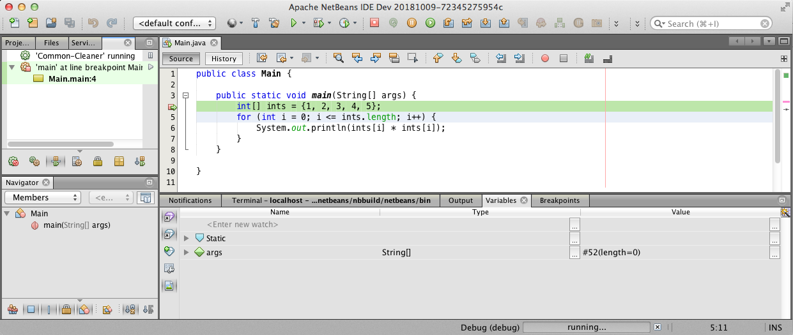
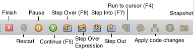
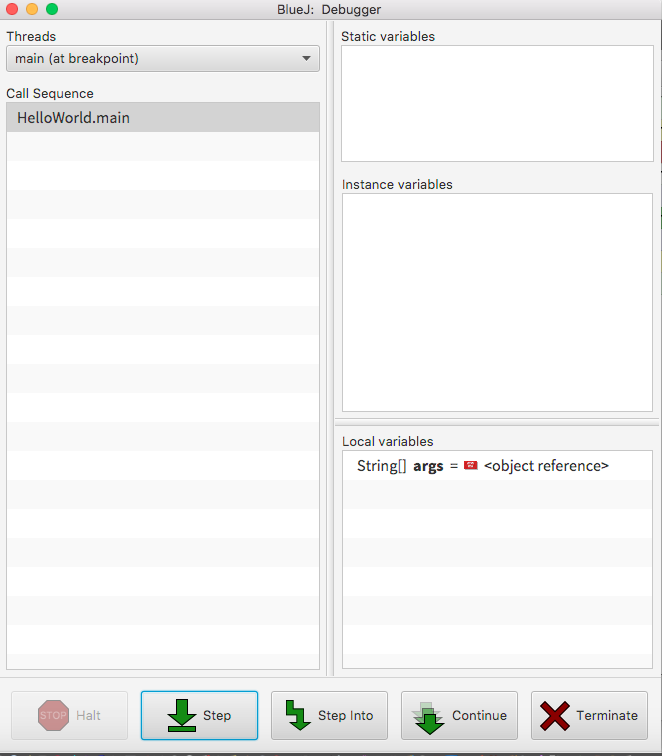

# 2.7 Αποσφαλμάτωση {#Java} 
© Γιάννης Κωστάρας

---

[<](../2.6-IDEs/README.md) | [Δ](../../README.md)

---

[](2.7-Debugging.ipynb)

### Μαθησιακοί στόχοι
Σε αυτήν την ενότητα θα μάθουμε:

* πώς να αποσφαλματώνουμε (debug) τα προγράμματά μας

## Εισαγωγή

Η λέξη “Bug” (ή _σφάλμα_ στην ελληνική του απόδοση) προέρχεται από τη ναύαρχο Grace Hopper το 1947 καθώς εργαζόταν σε έναν Η/Υ τύπου Mark II στο Harvard. Η δυσλειτουργία του προγράμματος οφειλόταν σ’ ένα ζωύφιο (bug) που είχε κολλήσει σ’ ένα κύκλωμα, οπότε η διαδικασία αποκόλλησής του ονομάστηκε _debugging_. (Wikipedia)

Υπάρχουν πολλών ειδών bugs που θα αντιμετωπίσετε στη Java:

* **Λάθη μεταγλώττισης (compile-time errors)**: λάθη που τα βρίσκει ο μεταγλωττιστής, π.χ. συντακτικά λάθη (λείπει ένα ; ή μια παρένθεση ()) ) ή λάθη τύπων δεδομένων π.χ. μη δήλωση τύπου μιας μεταβλητής, εκχώριση τιμής σε λάθος τύπο δεδομένων κλπ.  
* **Λάθη εκτέλεσης (run-time errors)**: λάθη που τα βρίσκετε κατά την εκτέλεση του προγράμματος, π.χ. διαίρεση με το μηδέν, άνοιγμα ενός αρχείου που δεν υπάρχει κλπ.
* **Λογικά λάθη (logic errors)**: λάθη που τα βρίσκει είτε ο προγραμματιστής είτε ο ελεγκτής (tester) του προγράμματος τα οποία είναι είτε λάθος αποτελέσματα είτε λαθεμένη συμπεριφορά του προγράμματος και είναι τα πιο δύσκολα να επιλυθούν. Λέγεται, ότι ένας προγραμματιστής ξοδεύει το 75% του χρόνου του στην επίλυση τέτοιων λαθών.

Για την αντιμετώπιση των λογικών λαθών (αλλά και των λαθών εκτέλεσης), μπορείτε να χρησιμοποιήσετε την τεχνική της αποσφαλμάτωσης ή εκσφαλμάτωσης (debugging). «Αποσφαλμάτωση» ή «εκσφαλμάτωση» (debugging) ονομάζεται η μεθοδική διαδικασία εύρεσης και εξάλειψης σφαλμάτων κώδικα ενός προγράμματος υπολογιστή ώστε να συμπεριφέρεται όπως προβλέπεται.

Διαδικασία:

1. Πίστεψε ότι το πρόβλημα μπορεί να λυθεί και επέμενε μέχρι τη λύση του
1. Επανάληψη/επιβεβαίωση του προβλήματος (αν το πρόβλημα είναι αναπαραγώσιμο)
1. Απομόνωση του σημείου που εμφανίζεται το σφάλμα (συνήθως από τα αρχεία καταγραφής – logs)
1. Αναγνώριση της αιτίας που το προκαλεί
1. Διόρθωση του σφάλματος
1. Επιβεβαίωση της διόρθωσης

Με τη βοήθεια ενός _αποσφαλματωτή (debugger)_, ωθούμε το πρόγραμμα ώστε να εισέλθει σε μια συγκεκριμένη κατάσταση ώστε να εμφανιστεί το πρόβλημα.

Το NetBeans περιλαμβάνει έναν visual debugger που διευκολύνει τη διαδικασία.

## Αποσφαλμάτωση με το NetBeans
Δημιουργήστε ένα νέο έργο (project) με όνομα ```Debug``` στο NetBeans όπως μάθαμε στο πρώτο μάθημα αυτής της εβδομάδας. 
Επικολλήστε τον παρακάτω κώδικα μέσα στη μέθοδο ```main()```:

```java
public static void main(String[] args) {
   int[] ints = {1, 2, 3, 4, 5};
   for (int i = 0; i <= ints.length; i++) {
       System.out.println(ints[i]*ints[i]);
   }
}
```

Εκτελώντας το πρόγραμμα βλέπουμε το παρακάτω αποτέλεσμα (μενού ```Window --> Output```):
```java
1
4
9
16
25
Exception in thread "main" java.lang.ArrayIndexOutOfBoundsException: 5
```
Αν και το πρόγραμμα υπολογίζει σωστά τα τετράγωνα των 5 αριθμών (1-5), στο τέλος εγείρει μια εξαίρεση εκτέλεσης που μας δηλώνει ότι κάπου έχουμε κάνει κάποιο λογικό λάθος.

Μπορούμε να ελέγξουμε γραμμή-γραμμή που μπορεί να έχουμε κάνει λάθος, αλλά μπορούμε να χρησιμοποιήσουμε τον οπτικό μεταγλωττιστή του NetBeans.

Κάντε κλικ πάνω στον αριθμό γραμμής της πρώτης γραμμής της μεθόδου ```main()``` για να εισάγετε ένα _σημείο παύσης ή σημείο αναστολής (breakpoint)_. Στη συνέχεια πατήστε το κουμπί **Debug** όπως φαίνεται στην παρακάτω εικόνα.



**Εικόνα 2.7.1** _Εκκίνηση του αποσφαλματωτή_

Η εκτέλεση του προγράμματος θα ξεκινήσει και θα σταματήσει στη γραμμή που έχετε ορίσει το σημείο παύσης. Από δω και πέρα μπορείτε να χρησιμοποιήσετε τα κουμπιά αποσφαλμάτωσης για να μετακινηθείτε γραμμή-γραμμή στον κώδικα, να εξετάσετε τις τιμές των μεταβλητών κλπ. 



**Εικόνα 2.7.2** _Παύση του αποσφαλματωτή σ' ένα σημείο παύσης_

Τα κουμπιά που φαίνονται μέσα στο κόκκινο πλαίσιο στην εικόνα 2 είναι τα εξής:

* Τερματισμός του αποσφαλματωτή (```Shift+F5```)
* Παύση εκτέλεσης
* Συνέχεια εκτέλεσης (```F5```)
* Εκτέλεση ενός βήματος χωρίς είσοδο μέσα στις μεθόδους, δηλ. οι μέθοδοι εκτελούνται σαν εντολές (```F8```)
* Εκτέλεση ενός βήματος χωρίς είσοδο μέσα στις εκφράσεις (```Shift+F8```)
* Εκτέλεση ενός βήματος μπαίνοντας μέσα στις μεθόδους (```F7```)
* Έξοδος από τη μέθοδο
* Εκτέλεση μέχρι εκεί που βρίσκεται ο δρομέας (```F4```)
* Εφαρμόζει τις αλλαγές στον κώδικα κατά τη διάρκεια της αποσφαλμάτωσης 
* Λαμβάνει ένα στιγμιότυπο  

## Αποσφαλμάτωση με το Visual Studio Code
Αντίστοιχα δουλεύει και η αποσφαλμάτωση στο VSCode. Ορίστε τα σημεία παύσης (breakpoints) όπως και στο NetBeans. Από το μενού **Run** μπορείτε να επιλέξετε **Start Debugging** για αποσφαλμάτωση (αντί για **Run Without Debugging** για εκτέλεση του κώδικα).

## Αποσφαλμάτωση με το BlueJ
Ορίστε και εδώ σημεία αναστολής (breakpoints) στο κενό στα αριστερά του κειμενογράφου. Όταν τρέξετε την ```main()``` η εκτέλεση θα σταματήσει στο πρώτο σημείο αναστολής και θα εμφανιστεί το παρακάτω παράθυρο με τις μεταβλητές και τις τιμές τους εκείνη τη στιγμή.



**Εικόνα 2.7.3** _Αποσφαλματωτής του BlueJ_

## Αποσφαλμάτωση χωρίς ΟΠΕ
Αν επιλέξατε να μην εγκαταστήσετε ένα ΟΠΕ στον Η/Υ σας, τότε μπορείτε να χρησιμοποιήσετε αυτόν τον [online αποσφαλματωτή](http://www.pythontutor.com/visualize.html#mode=edit) με τον οποίο μπορείτε επίσης να οπτικοποιήσετε την εκτέλεση του προγράμματός σας βήμα-βήμα.

Καλή επιτυχία και καλό κουράγιο κατά την αποσφαλμάτωση των προγραμμάτων σας.

## Άσκηση
1. <a href="sandbox/exercise1.html" target="_blank">Βρείτε τα λάθη στο παρακάτω πρόγραμμα, αναφέρετε τι κατηγορία λάθους είναι το καθένα, και διορθώστε τα ώστε να εκτελεστεί σωστά το πρόγραμμα.</a>

```java
import java.util.Random;

public class FortuneTeller {
    
    public static void Main(String[] args) {
        Random random = new Random();
        int fortune = random.nextInt(10);  // τυχαίος ακέραιος μεταξύ 0 και 9
        
        if (fortune = 0) {
            System.out.println("Your aims are high, and you are capable of much.");
            
        } else if (fortune == 1) {
            System.out.println("Don't behave with cold manners.")
            
        } else if (fortune == 2) {
            System.out.println("May you someday be carbon neutral");
            
        } else if (fortune == 3) {
            System.out.println("You are special in a way you will soon begin to understand.");
            
        } else if (fortune == 4) {
            System.out.println("A conclusion is simply the place where you got tired of thinking.");
            
        } else if (fortune ==) {
            System.out.println("No snowflake feels responsible in an avalanche.");
            
        } else if (fortune == 6) {
            System.out.println("He who laughs last is laughing at you.");
            
        } else if (fortune == 7) {
            System.out.println("If you look back, you'll soon be going that way.");
            
        } else if (fortune == 8) {
            System.out.println("Face facts with dignity.");
            
        } else if (fortune == 9   {
            System.out.println("The fortune you seek is in another cookie.");
            
        }
    }
}
```

## Πηγές
1. [Αποσφαλμάτωση](https://el.wikipedia.org/wiki/%CE%91%CF%80%CE%BF%CF%83%CF%86%CE%B1%CE%BB%CE%BC%CE%AC%CF%84%CF%89%CF%83%CE%B7), Wikipedia
1. Horstmann C., [Big Java 5 - Chapter 6 - Loops](https://www.cs.ryerson.ca/~aferworn/courses/CPS109/CLASSES/week06/ch06/index.html)
1. Kolling M. (μετάφραση Ζερβός Τ.) (), [Το εγχειρίδιο του BlueJ](https://bluej.org/tutorial/tutorial-greek.pdf), έκδοση 1.4, University of Southern Denmark.
1. Spinellis D. (2017), _Effective Debugging_, Addison-Wesley.
1. [Using the Visual Debugger in NetBeans IDE](https://netbeans.org/kb/docs/java/debug-visual.html)

---

[<](../2.6-IDEs/README.md) | [Δ](../../README.md)

---