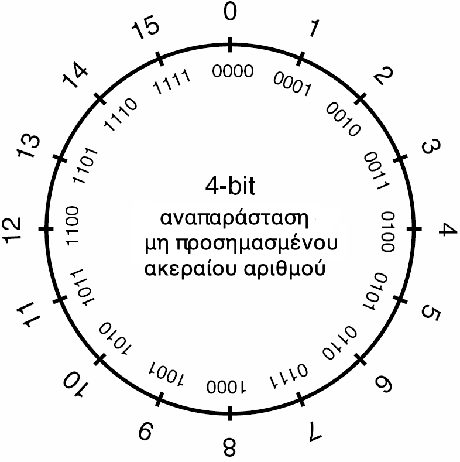

# 3.1 Εισαγωγή στον Αντικειμενοστραφή Προγραμματισμό
© Γιάννης Κωστάρας

---

[Δ](../../README.md) | [>](../3.2-IDEs/README.md)

---

[](3.1-OOP.ipynb)

### Μαθησιακοί στόχοι
Σε αυτήν την ενότητα θα μάθουμε:

* τι είναι ο αντικειμενοστραφής προγραμματισμός (Object Oriented Programming)
* για τις κλάσεις (classes) και τα αντικείμενα (objects) των κλάσεων
* για τα χαρακτηριστικά των αντικειμένων
* τις κατηγορίες κλάσεων: class, record, interface, enum
* τα δυο είδη μνημών: τη μνήμη στοίβας (stack) και τη μνήμη σωρού (heap)
* για το πέρασμα παραμέτρων με αναφορά (By Reference)
* για τους τύπους επικάλυψης (Wrapper types)

## Εισαγωγή
Τα προγράμματα που γράψαμε τις προηγούμενες εβδομάδες ονομάζονται διαδικαστικά. Χάρις στο JShell μάθαμε τη σύνταξη και τις βασικές εντολές και τύπους δεδομένων της Java. Επικεντρωθήκαμε στο συντακτικό της γλώσσας και πώς να λύνουμε αλγορίθμους χωρίς να μπερδευόμαστε με άλλες λεπτομέρειες της γλώσσας. 

Ο διαδικαστικός (procedural) προγραμματισμός είναι καλός για μικρά προγράμματα και προβλήματα αλλά όχι τόσο για μεγάλα προγράμματα. Γι' αυτό το σκοπό έχει αναπτυχθεί ο αντικειμενοστραφής προγραμματισμός (Object Oriented Programming). Αν και το JShell είναι ένα θαυμάσιο εργαλείο για την εκμάθηση της γλώσσας, για να αναπτύξετε προγράμματα θα πρέπει να εντρυφήσετε στον αντικειμενοστραφή προγραμματισμό. 

Καθώς ο κόσμος μας αποτελείται από αντικείμενα, αναπαριστώντας τα με κάποιον τρόπο στους Η/Υ έφερε μια νέα επανάσταση στην ανάπτυξη εφαρμογών. Οι εφαρμογές που βασίζονται στα αντικείμενα είναι πιο εύκολες στην κατανόηση και στη συντήρηση.

Η Java ήταν από την αρχή της δημιουργίας της μια αμιγώς αντικειμενοστραφής γλώσσα προγραμματισμού (από την έκδοση 8 και μετά έχει και στοιχεία συναρτησιακής, functional, γλώσσας αλλά αυτό δεν θα μας απασχολήσει σ' αυτά τα μαθήματα).

Είδαμε ήδη στις τελευταίες ενότητες της προηγούμενης εβδομάδας την πρώτη μας κλάση (class), ότι οι κλάσεις αποτελούνται από μεθόδους (methods) και ότι η πιο σημαντική μέθοδος ενός προγράμματος είναι η ```main()```. Στα μαθήματα αυτής και της επόμενης εβδομάδας θα επικεντρωθούμε στα αντικειμενοστραφή χαρακτηριστικά της γλώσσας.

## Κλάσεις και Αντικείμενα
Η Java διαθέτει δυο κατηγορίες τύπων δεδομένων:

* Αρχέγονους ή πρωτογενείς (raw data types) (π.χ. ```int, char, float```)
* Κλάσεις (π.χ. ```String, array```)

Μια _κλάση_ (class) είναι όπως ένα αρχιτεκτονικό σχέδιο, ένα πρότυπο (καλούπι), μια αφαιρετική εικόνα της πραγματικότητας που περιγράφει τις _ιδιότητες (γνωρίσματα)_ ενός αντικειμένου καθώς και τις _ενέργειες_ που μπορούν να εκτελεστούν σ’ αυτές τις ιδιότητες. Κάθε κλάση περιγράφει μία μοναδική οντότητα με ξεχωριστές ιδιότητες (γνωρίσματα). Οι κλάσεις οργανώνονται σε δενδρικές δομές μοναδικού γονικού κόμβου (_κληρονομικότητα_).

Π.χ. το _αυτοκίνητο_ αποτελεί μια κλάση, καθώς είναι μια αφαίρεση της πραγματικότητας. Κάθε αυτοκίνητο διαθέτει κάποια γνωρίσματα, π.χ. χρώμα, τελική ταχύτητα, κυβισμό, κ.ά. Επίσης, κάθε αυτοκίνητο μπορεί να κινείται, να επιταχύνει και να επιβραδύνει, να στρίβει κλπ. Αυτά αποτελούν τις _ενέργειες_ της κλάσης.

Από μία κλάση μπορούν να δημιουργηθούν πολλά _στιγμιότυπα (αντικείμενα)_. Π.χ. μπορούμε από τη κλάση _Αυτοκίνητο_ να έχουμε απτά αντικείμενα, π.χ. ένα Fiat 500, ένα Peugeot 208, ένα Audi A3. Όλα τα αντικείμενα μιας κλάσης έχουν τα ίδια γνωρίσματα, αλλά οι τιμές των γνωρισμάτων διαφέρουν.

Κάθε κλάση περιγράφει μία μοναδική οντότητα με ξεχωριστές ιδιότητες. Κάθε αντικείμενο μπορεί να: 

* παραλάβει μηνύματα από άλλα αντικείμενα
* επεξεργαστεί δεδομένα 
* στείλει μηνύματα σε άλλα αντικείμενα

Π.χ. αν θεωρήσουμε ένα αντικείμενο της κλάσης _Οδηγός_, αυτό μπορεί να επιταχύνει ή/και να επιβραδύνει το στιγμιότυπο αυτοκινήτου το οποίο οδηγεί.

Άλλο παράδειγμα είναι η μοντελοποίηση μιας εταιρίας. Μια εταιρία αποτελείται από υπαλλήλους. Οπότε χρειαζόμαστε μια κλάση ```Employee``` η οποία να διαθέτει π.χ. τα εξής γνωρίσματα:

* Όνομα
* Επώνυμο
* Κωδικός Υπαλλήλου
* ΑΦΜ
* Μισθός
* ημέρες αδείας
* τμήμα (στο οποίο δουλεύει)

κλπ.

και π.χ. τις εξής μεθόδους:

* εργάζεται (π.χ. μπορεί να είναι άρρωστος)
* πληρώθηκε
* ζητά άδεια

κλπ.

## Χαρακτηριστικά των αντικειμένων

Ο αντικειμενοστραφής προγραμματισμός εισήχθηκε για να βοηθήσει τους προγραμματιστές να δημιουργούν κλάσεις και αντικείμενα ως μια αφαίρεση της πραγματικότητας και έτσι να μπορούν να σχεδιάζουν πιο εύκολα και κατανοητά τα προγράμματά τους. 

Η αφαιρετικότητα (abstraction) είναι επιλεκτική άγνοια! Είναι επιλογή του τι είναι σημαντικό και τι όχι. Δίνει έμφαση και εξάρτηση στα σημαντικά ενώ αγνοεί τα _ΜΗ_ σημαντικά. Επιτυγχάνεται με τη χρήση _ενθυλάκωσης (encapsulation)_ όπως θα δούμε παρακάτω. Σε μια καλή αντικειμενοστραφή σχεδίαση, κάθε αντικείμενο έχει συγκεκριμένο ρόλο και ευθύνες.

Τα αντικείμενα στον αντικειμενοστραφή προγραμματισμό έχουν τρία βασικά χαρακτηριστικά:

* _Ταυτότητα (identity)_: Το “κλειδί” μέσω του οποίου μπορούμε να αποκτήσουμε πρόσβαση στο αντικείμενο (ένα όνομα ή μια διεύθυνση μνήμης)
* _Κατάσταση (state)_: Οι τιμές των ιδιοτήτων/γνωρισμάτων του αντικειμένου κάθε χρονική στιγμή
* _Συμπεριφορά (behaviour)_: Το σύνολο των ενεργειών (μεθόδων) που μπορεί να διεκπεραιώσει το αντικείμενο

Η Java διαθέτει τους εξής τύπους δεδομένων για την αναπαράσταση κλάσεων, τους οποίους και θα μελετήσουμε στη συνέχεια:

* ```Record``` (εγγραφή), από την έκδοση 14 και μετά
* ```Class``` (κλάση)
* ```Interface``` (διεπαφή)
* ```Enum``` (απαριθμημένος τύπος) από την έκδοση 5 και μετά

## Εγγραφές (records)
Η πιο απλή μορφή αναπαράστασης κλάσεων είναι η _εγγραφή (record)_. Τα records εμφανίστηκαν σχετικά πρόσφατα στη γλώσσα, στην έκδοση 14. 

Ας υποθέσουμε ότι θέλουμε να φτιάξουμε ένα πρόγραμμα ζωγραφικής στο οποίο ο χρήστης θα μπορεί να σχεδιάζει πάνω σε έναν καμβά, κάτι π.χ. σαν το πρόγραμμα ζωγραφικής των Windows. Θέλουμε να μοντελοποιήσουμε το σημείο. Ένα σημείο ορίζεται στο δισδιάστατο επίπεδο με δυο συντεταγμένες ```x``` και ```y```. Ας δούμε πώς μπορούμε να γράψουμε τον τύπο δεδομένων _Σημείο_ στην Java.

```java
jshell> record Point(int x, int y) { 
   ...> }
|  created record Point
```
Το παραπάνω είναι το "καλούπι" ενός σημείου. Από αυτό μπορούμε να δημιουργήσουμε όσα σημεία, δηλ. αντικείμενα της ```Point```, θέλουμε, ως εξής:

```java
jshell> Point p = new Point (0, 0);
   ...> int x = p.x();
p ==> Point[x=0, y=0]
x ==> 0
    
jshell> p
p ==> Point[x=0, y=0]
```
Για να δημιουργήσουμε ένα νέο σημείο χρησιμοποιούμε την γνώριμη από τις κλάσεις ```String``` και array δεσμευμένη λέξη ```new```. Μέσα στις παρενθέσεις περνάμε τις συντεταγμένες του σημείου. Αυτές αποθηκεύονται στις μεταβλητές ```x``` και ```y```. Οι μεταβλητές αυτές ονομάζονται _γνωρίσματα_ ή _ιδιότητες (attributes)_ της κλάσης. 

Για να προσπελάσουμε την τιμή ενός γνωρίσματος, χρησιμοποιούμε τη μέθοδο που ονομάζεται όπως το γνώρισμα και παρενθέσεις, π.χ. ```p.x()```. Αυτή επιστρέφει την τιμή του γνωρίσματος ```x```. Αντίστοιχα υπάρχει και η ```p.y()``` που επιστρέφει την τιμή του γνωρίσματος ```y```.

Αλλά πώς δημιουργείται το αντικείμενο; Όταν καλούμε την ```new```, αυτή καλεί μια ειδική μέθοδο της κλάσης η οποία ονομάζεται _μέθοδος κατασκευής_ ή _constructor_. Στην περίπτωση της ```Point``` αυτή λαμβάνει δυο ορίσματα ```int x, int y```. Θα μιλήσουμε για μεθόδους κατασκευής όταν μιλήσουμε για τις κλάσεις.

Πώς θα μπορούσαμε να ορίσουμε μια ευθεία γραμμή; Μια ευθεία γραμμή αποτελείται από δυο σημεία:

```java
jshell> record Line(Point p1, Point p2) {}
|  created record Line

jshell> Line line = new Line(p, new Point(10, 10));
line ==> Line[p1=Point[x=0, y=0], p2=Point[x=10, y=10]]

jshell> line.p2()
$8 ==> Point[x=10, y=10]

jshell> line
line ==> Line[p1=Point[x=0, y=0], p2=Point[x=10, y=10]]
```
Δημιουργήσαμε μια νέα γραμμή (ένα αντικείμενο τύπου ```Line```) δίνοντάς της δυο σημεία, ένα το ```p``` που δημιουργήσαμε προηγουμένως, και ένα νέο σημείο καλώντας την μέθοδο κατασκευής της ```Point``` και περνώντας ως παραμέτρους ```x=10, y=10```.

Παρόμοια μπορούμε να δημιουργήσουμε και τις εγγραφές ```Circle, Rectangle```:

```java
jshell> record Circle(Point center, int radius) {}
|  created record Circle

jshell> record Rectangle(Point upperLeft, Point lowerRight) {}
|  created record Rectangle
```
Ένας κύκλος ορίζεται από το κέντρο και την ακτίνα του. Ένα ορθογώνιο ορίζεται από δυο σημεία, το πάνω αριστερό και το κάτω δεξί. 

Μέσα στα άγκιστρα μπορούμε να ορίσουμε και δικές μας μεθόδους, π.χ. παρακάτω ορίζουμε μια μέθοδο που μας επιστρέφει την περιφέρεια του κύκλου:

```java
jshell> record Circle(Point center, int radius) {
   ...>     double circumference() {
   ...>         return 2*Math.PI*radius;
   ...>     }
   ...> }
|  replaced record Circle

jshell> Circle circle = new Circle(p, 5);
circle ==> Circle[center=Point[x=0, y=0], radius=5]

jshell> circle.circumference()
$14 ==> 31.41592653589793
    
jshell> /types
|    record Point
|    record Line
|    record Rectangle
|    record Circle
```
Σαν άσκηση τροποποιήστε την εγγραφή ```Rectangle``` προσθέτοντάς της μια μέθοδο που να υπολογίζει το εμβαδό του ορθογώνιου παραλληλογράμμου.

Έστω ότι θέλουμε να δημιουργήσουμε μια μέθοδο που να μπορεί να αλλάζει την τιμή της ακτίνας του κύκλου αφού ένα αντικείμενο κύκλου έχει δημιουργηθεί:

```java
record Circle(Point center, int radius) {
   double circumference() {
       return 2*Math.PI*radius;
   }
   void setRadius(int r) {
       radius = r;
   }
}
|  Error:
|  cannot assign a value to final variable radius
|         radius = r;
|         ^----^
|    update replaced variable circle which cannot be referenced until class Circle is declared
```
Προς έκπληξή μας δεν μας αφήνει (μας λέει ότι η ```radius``` είναι ```final```, δηλ. σταθερά). Η εγγραφή είναι μια _αμετάβλητη κλάση (immutable class)_, δηλ. δεν επιτρέπει ν' αλλάξουν οι τιμές των γνωρισμάτων της μετά τη δημιουργία των αντικειμένων της.

Επίσης παρατηρήστε ότι δεν μπορούμε να προσπελάσουμε απευθείας τις τιμές των γνωρισμάτων, έξω από την εγγραφή, όπως π.χ. από το περιβάλλον JShell:

```java
jshell> circle.radius
|  Error:
|  radius has private access in Circle
|  circle.radius
|  ^-----------^

jshell> circle.radius = 10;
|  Error:
|  radius has private access in Circle
|  circle.radius = 10;
|  ^-----------^
```
Η μέθοδος όμως ```circumference()``` μπορεί να προσπελάσει την ```radius```, όπως είδαμε πιο πάνω.

Τα γνωρίσματα μιας εγγραφής είναι προσπελάσιμα από τις μεθόδους της εγγραφής, όχι όμως και εξωτερικά από την εγγραφή. Π.χ. πιο πάνω προσπαθήσαμε να προσπελάσουμε το γνώρισμα ```radius``` της ```Circle``` από το περιβάλλον του JShell, και η ```Point``` δεν μας το επέτρεψε. Ούτε μας άφησε να τροποποιήσουμε την τιμή του γνωρίσματος, αφού όπως είπαμε οι εγγραφές είναι αμετάβλητες. 

Αυτό το γνώρισμα του αντικειμενοστραφούς προγραμματισμού λέγεται _ενθυλάκωση (encapsulation)_, όπως θα δούμε σε επόμενο μάθημα, και διαφέρει σε σχέση με τον διαδικαστικό προγραμματισμό, όπου μεταβλητές και μέθοδοι είναι ανεξάρτητες. Στον αντικειμενοστραφή προγραμματισμό, οι μεταβλητές ανήκουν σε μια κλάση και μόνο αντικείμενα αυτής της κλάσης έχουν πρόσβαση στις μεταβλητές. 

Μπορείτε να εξασκηθείτε μόνοι σας στα records εδώ <a href="sandbox/records.html" target="_blank"></a>.

## Κλάσεις (Class)
Η εγγραφή (record) εισήχθηκε στην Java από την έκδοση 14 και μετά. Από την αρχή της δημιουργίας της, η γλώσσα υποστηρίζει τις κλάσεις. Τα πάντα είναι κλάσεις στη Java. Ας δούμε πώς θα γράφαμε την εγγραφή ```Point``` στις εκδόσεις της Java πριν την 14:

```java
final class Point {
	private final int x, y;
	
	public Point() {
		x=0;
		y=0;
	}
	
	public Point(int x, int y) {
		this.x = x;
		this.y = y;
	}
	
	public int getX() {
		return x;
	}
	
	public int getY() {
		return y;
	}
    
    public String toString() {
        return "Point[" + "x=" + x + ", y=" + y + "]";
    }      
}
```
Όπως βλέπετε, η εγγραφή μας γλυτώνει από πολύ πληκτρολόγηση! Κατ' αρχήν βλέπουμε πώς ορίζονται τα γνωρίσματα μέσα σε μια κλάση. Τα γνωρίσματα ```x, y``` ορίζονται ως ```private final```. Όπως έχουμε μάθει, η δεσμευμένη λέξη ```final``` δηλώνει ότι πρόκειται για σταθερές, δηλ. ότι η τιμή τους δεν μπορεί ν' αλλάξει. Αλλά πώς είναι δυνατόν να ορίσουμε δυο σταθερές χωρίς να τους δώσουμε αρχική τιμή; Αυτό είναι κάτι που επιτρέπεται στις κλάσεις και θα δούμε στη συνέχεια γιατί. Τη δεσμευμένη λέξη ```private``` την βλέπουμε για πρώτη φορά και είναι η αντίθετη της ```public```. Όπως ίσως θυμάστε από προηγούμενο μάθημα, το ```public``` δηλώνει ότι το γνώρισμα είναι προσβάσιμο από οποιαδήποτε άλλη κλάση και από την ΕΜ (JVM). Το ```private``` δηλώνει ότι είναι προσβάσιμο μόνο από αντικείμενα της ίδιας κλάσης.

Οι μέθοδοι ```getX()``` και ```getY()``` είναι ίδιες με τις ```x()``` και ```y()``` της εγγραφής. Απλά παλαιότερα, η σύμβαση ήταν ότι μέθοδοι προσπέλασης των γνωρισμάτων θα πρέπει να ονομάζονται ως ```getXXX()``` όπου ```xxx``` το γνώρισμα που προσπελάζουν. Παρατηρούμε ότι αυτές οι μέθοδοι είναι ```public```.

Αλλά τι είναι οι ```Point()``` και ```Point(int x, int y)```; Καλά το μαντέψατε! Είναι οι μέθοδοι κατασκευής (constructors). Καλούνται όταν καλείται η ```new```. Παρατηρήστε πώς διαφέρουν από τις κανονικές μεθόδους επειδή έχουν το ίδιο όνομα με το όνομα της κλάσης και _δεν_ έχουν τύπο επιστροφής. Η πρώτη μέθοδος κατασκευής καλείται όταν δημιουργείτε ένα _στιγμιότυπο (instance)_ ή _αντικείμενο (object)_ της κλάσης ```Point``` χωρίς να περάσετε ορίσματα:

```java
jshell> Point p = new Point()
p ==> Point[x=0, y=0]
```
ενώ η δεύτερη όταν περάσετε:
```java
jshell> Point p = new Point(10, 10)
p ==> Point[x=10, y=10]
```
_**Σημείωση!** Μην μπερδευτείτε, οι μέθοδοι κατασκευής δεν έχουν καμία σχέση με τις αναδρομικές μεθόδους (recursive methods)._

Γι' αυτό επιτρέπεται οι σταθερές ```x, y``` να μην αρχικοποιούνται κατά τη δήλωσή τους, επειδή αρχικοποιούνται μέσα στις μεθόδους κατασκευής, χωρίς αυτό να σημαίνει ότι δεν μπορείτε να τις αρχικοποιήσετε κατά τη δήλωσή τους αντί για μέσα στην μέθοδο κατασκευής.

Αλλά τι είναι αυτό το ```this```; Το ```this``` αναφέρεται στο αντικείμενο που δημιουργείται από την κλάση. Επειδή δεν γνωρίζουμε πώς θα το ονομάσει ο προγραμματιστής, μέσα στην κλάση αναφερόμαστε σ' αυτό με τη δεσμευμένη λέξη ```this```. Π.χ. για το παράδειγμα της ```Point``` το ```this``` μπορεί να αναφέρεται στο ```p``` ή στο ```p1```, δηλ. σε οποιοδήποτε αντικείμενο της κλάσης. Οπότε ```this.x``` σημαίνει το γνώρισμα ```x``` του αντικειμένου. Αλλά γιατί δεν αναφερόμαστε στο γνώρισμα απλά και μόνο με το όνομά του;

Ας δούμε λίγο καλύτερα το σώμα του δεύτερου κατασκευαστή:

```java
	public Point(int x, int y) {
		this.x = x;
		this.y = y;
	}
```
Αν γράφαμε:
```java
	public Point(int x, int y) {
		x = x;
		y = y;
	}
```
τότε ο μεταγλωττιστής δεν μπορεί να καταλάβει αν αναφερόμαστε στο γνώρισμα ```x``` ή στην παράμετρο ```x```. Μάλιστα αυτό είναι ένα πολύ κοινό λάθος που γίνεται από τους προγραμματιστές κι ενώ νομίζουν ότι έχουν αλλάξει την τιμή του γνωρίσματος στην ουσία εκχωρούν στην παράμετρο ```x``` την τιμή της παραμέτρου ```x```.

Ας το δούμε στην πράξη.

```java
jshell> final class Point {
	private final int x, y;
	
	public Point() {
		x=0;
		y=0;
	}
	
	public Point(int x, int y) {
		x = x;
		y = y;
	}
	
	public int getX() {
		return x;
	}
	
	public int getY() {
		return y;
	}
    
    public String toString() {
        return "Point[" + "x=" + x + ", y=" + y + "]";
    }      
}
|  Error:
|  variable x might not have been initialized
|  	public Point(int x, int y) {
|      
```
Στο συγκεκριμένο παράδειγμα ο μεταγλωττιστής μας προειδοποιεί ότι τα γνωρίσματα ```x``` και ```y``` δεν έχουν αρχικοποιηθεί επειδή είναι ```final``` και θα 'πρεπε να αρχικοποιηθούν στον κατασκευαστή. Αλλά ας πάμε ένα βήμα πιο πέρα. Ας μην τις ορίσουμε ```final```. 

```java
jshell> final class Point {
	private int x, y;
	
	public Point() {
		x=0;
		y=0;
	}
	
	public Point(int x, int y) {
		x = x;
		y = y;
	}
	
	public int getX() {
		return x;
	}
	
	public int getY() {
		return y;
	}
    
    public String toString() {
        return "Point[" + "x=" + x + ", y=" + y + "]";
    }      
}
|  created class Point

jshell> Point p = new Point(10,20);
p ==> Point[x=0, y=0]
```
Όπως βλέπετε τα γνωρίσματα ```x, y``` δεν αρχικοποιήθηκαν από τις τιμές των ορισμάτων που περάσαμε στον κατασκευαστή. Πολύ προσοχή λοιπόν και καλό είναι να μην ονομάζουμε τις παραμέτρους όπως και τα γνωρίσματα.

Η μέθοδος ```toString()``` επιστρέφει μια φιλική προς τον χρήστη αναπαράσταση του αντικειμένου. Αν την είχαμε αφαιρέσει τότε:
```java
jshell> Point p = new Point()
p ==> Point@497470ed
```
Αυτό που συμβαίνει στο παρασκήνιο είναι ότι η ΕΜ της Java διαθέτει την ανάλογη μνήμη που χρειάζεται για τη δημιουργία του αντικειμένου, αναθέτει μια μοναδική ταυτότητα στο αντικείμενό μας (```Point@497470ed```) και εκτελεί τον κώδικα της μεθόδου κατασκευής (constructor). 

Τέλος, θα μιλήσουμε για την ```final``` στον ορισμό της κλάσης σε επόμενα μαθήματα.

Σαν άσκηση γράψτε την εγγραφή ```Circle``` που ορίσαμε πιο πάνω σαν κλάση.

Μπορούν να υπάρχουν πολλοί κατασκευαστές με το ίδιο όνομα (overloading) αλλά όχι με την ίδια υπογραφή, δηλ. θα πρέπει να περιέχουν διαφορετικό αριθμό ή/και τύπο παραμέτρων. Ένας κατασκευαστής χωρίς παραμέτρους ονομάζεται _εξ' ορισμού κατασκευαστής (default constructor)_. Σε περίπτωση που δεν δηλωθεί κατασκευαστής, δημιουργείται αυτόματα ο default (no-args) constructor.

_**Σημαντική σημείωση**: Αν δηλώσουμε έστω μια μέθοδο κατασκευής σε μια κλάση, τότε **δεν** δημιουργείται αυτόματα default constructor_.

Έτσι π.χ. αν ορίσουμε την κλάση Point χωρίς μεθόδους κατασκευαστή (απαιτείται τώρα ν' αρχικοποιήσουμε τα γνωρίσματά της):

```java
jshell> final class Point {
   ...>     private final int x = 0, y = 0;
   ...>     
   ...>     public int getX() {
   ...>         return x;
   ...>     }
   ...>     
   ...>     public int getY() {
   ...>         return y;
   ...>     }
   ...>     
   ...>     public String toString() {
   ...>         return "Point[" + "x=" + x + ", y=" + y + "]";
   ...>     }      
   ...> }
|  created class Point

jshell> Point p = new Point()
p ==> Point[x=0, y=0]

jshell> Point p = new Point(10, 10)
|  Error:
|  constructor Point in class Point cannot be applied to given types;
|    required: no arguments
|    found:    int,int
|    reason: actual and formal argument lists differ in length
|  Point p = new Point(10, 10);
|            ^---------------^
```
Βλέπουμε ότι η Java έχει εισάγει κρυφά έναν default constructor χωρίς παραμέτρους. Αυτό επειδή δεν έχουμε δηλώσει άλλους κατασκευαστές. Αν όμως δηλώσουμε τουλάχιστο μια μέθοδο κατασκευής: 

```java
jshell> final class Point {
   ...>     private final int x, y;
   ...>     
   ...>     public Point(int x, int y) {
   ...>         this.x = x;
   ...>         this.y = y;
   ...>     }
   ...>     
   ...>     public int getX() {
   ...>         return x;
   ...>     }
   ...>     
   ...>     public int getY() {
   ...>         return y;
   ...>     }
   ...>     
   ...>     public String toString() {
   ...>         return "Point[" + "x=" + x + ", y=" + y + "]";
   ...>     }      
   ...> }
|  replaced class Point

jshell> Point p = new Point(10, 10)
p ==> Point[x=10, y=10]

jshell> Point p = new Point()
|  Error:
|  constructor Point in class Point cannot be applied to given types;
|    required: int,int
|    found:    no arguments
|    reason: actual and formal argument lists differ in length
|  Point p = new Point();
|            ^---------^
```
τότε δεν δημιουργείται κρυφά ένας no argument default constructor.

Ένας έξυπνος τρόπος να μειώσουμε τις πιθανές αλλαγές, κι άρα και τις πιθανότητες λάθους στον κώδικά μας, είναι η χρήση της ```this()``` (μην την μπερδέψετε με το ```this``` που είδαμε πιο πάνω)  όπως φαίνεται στο παρακάτω παράδειγμα:

```java
final class Point {
    private final int x, y;

    public Point() {
        this(0, 0);
    }

    public Point(int x, int y) {
        this.x = x;
        this.y = y;
    }

    public int getX() {
        return x;
    }
    
    public int getY() {
    return y;
    }
    
    public String toString() {
        return "Point[" + "x=" + x + ", y=" + y + "]";
    }      
}
```
Η σύνταξη ```this(0,0)``` στο σώμα του κατασκευαστή χωρίς παραμέτρους σημαίνει ότι καλεί τον άλλον κατασκευαστή περνώντας του ως ορίσματα τα ```0, 0```. Με αυτόν τον τρόπο μπορούμε να μειώσουμε κατά πολύ κώδικα που επαναλαμβάνεται στους διάφορους κατασκευαστές μιας κλάσης. Η τεχνική που ακολουθούμε είναι να καλούμε με την ```this()``` τον constructor με τις περισσότερες παραμέτρους που θα είναι κι αυτός που θα περιέχει την υλοποίηση. Είναι σημαντικό να σημειώσουμε εδώ ότι η ```this()``` πρέπει να είναι η πρώτη γραμμή σε μια μέθοδο κατασκευής, αλλιώς ο μεταγλωττιστής θα παραπονεθεί. 

Στο σημείο αυτό θα πρέπει να προσθέσουμε ότι όπως μπορείτε να ορίσετε και τις δικές σας μεθόδους σε μια εγγραφή, μπορείτε να ορίσετε και compact constructors, όπως:

```java
public record Point(int x, int y) { 
	public Point {
		if (x < 0 || y < 0) 
			throw new IllegalArgumentException(
			      "x and y must be positive");
	}
}
```
(θα μιλήσουμε για εξαιρέσεις (Exceptions) σε επόμενο μάθημα) ή ακόμα και εναλλακτικές μεθόδους κατασκευής (alternative constructors), π.χ.
```java
public record Point(int x, int y) { 
	public static Point of(int x, int y) {
		return new Point(x, y);
	}
}
```

Μπορείτε να εξασκηθείτε μόνοι σας στην κλάση ```Point``` εδώ <a href="sandbox/point.html" target="_blank"></a>.

Ας δούμε ακόμα ένα παράδειγμα. Ας υποθέσουμε ότι θέλουμε να γράψουμε ένα παιχνίδι αγώνων αυτοκινήτων σε Java. Χρειαζόμαστε λοιπόν, μιαν αφαιρετική αναπαράσταση ενός αυτοκινήτου, δηλ. μια κλάση ```Car```. Τι γνωρίσματα θέλουμε να έχουμε για την κλάση αυτή (η κατάστασή του); Μας ενδιαφέρει να γνωρίζουμε το μοντέλο του (π.χ. _Tesla Model S_), την μέγιστη ταχύτητά του, τον κυβισμό του κλπ. καθώς επίσης και την ταχύτητά του κάθε στιγμή (καθώς θα τρέχει σε αγώνες).

Τι συμπεριφορά θα θέλαμε να έχει το αυτοκίνητο; Θα θέλαμε να μπορούμε να επιταχύνουμε όταν πατάμε το γκάζι και να επιβραδύνουμε όταν πατάμε το φρένο. Επίσης, να στρίβουμε.

Τα παραπάνω τα συνοψίζουμε στην ακόλουθη κλάση ```Car```:
  
```java
class Car { // κλάση
  // ιδιότητες/γνωρίσματα
  String model;
  int maxSpeed;
  int ccm;
  int speed = 0;
  // μέθοδος δημιουργίας αντικειμένων - κατασκευαστής
  Car(String m, int s, int c) {
    model = m; maxSpeed = s; ccm = c;
  }
  // ενέργειες/μέθοδοι
  void accelerate() {
     if (speed <= maxSpeed - 10)
        speed+=10;
  }
  void decelerate() {
     if (speed >= 10)
        speed-=10;
  }
  public String toString() {
     return "Car[" + "model=" + model + ", maxSpeed=" + maxSpeed + ", ccm=" + ccm + ", speed=" + speed + "]"; 
  }
}
```
Η κλάση ```Car``` περιέχει 4 γνωρίσματα (```model, maxSpeed, ccm, speed```), τρεις μεθόδους (```accelerate(), decelerate(), toString()```) και μια μέθοδο κατασκευής.
```java
// Αντικείμενα
jshell> Car audiA3 = new Car("Audi A3", 210, 1595);
audiA3 ==> Car[model=Audi A3, maxSpeed=210, ccm=1595, speed=0]

jshell> audiA3.speed
$1 ==> 0
    
jshell> audiA3.accelerate();

jshell> audiA3.speed
$2 ==> 10
```

Στο παραπάνω τμήμα κώδικα δημιουργήσαμε ένα νέο αντικείμενο ```audiA3``` χρησιμοποιώντας τη δεσμευμένη λέξη ```new``` και καλώντας τον κατασκευαστή της κλάσης. Στη συνέχεια ζητάμε να δούμε την τρέχουσα ταχύτητά του καλώντας το γνώρισμα χωριζόμενο από το όνομα του αντικειμένου με την ```.```. Γενικά, όπως είδαμε, δεν είναι καλή τακτική να καλούμε απευθείας τα γνωρίσματα ενός αντικειμένου. Στη συνέχεια, καλούμε τη μέθοδο ```accelerate()``` με το ίδιο τρόπο, η οποία έχει ως αποτέλεσμα ν' αυξήσει την ταχύτητα του αυτ/του κατά 10 χλμ/ώ. Καλώντας πάλι το γνώρισμα ```speed``` βλέπουμε ότι τώρα πλέον το αυτοκίνητό μας κινείται με ταχύτητα 10 χλμ/ώ.

Με τον ίδιο τρόπο μπορούμε να δημιουργήσουμε όσα στιγμιότυπα (αντικείμενα) της κλάσης ```Car``` θέλουμε παρέχοντας απλώς τις κατάλληλες τιμές (δηλ. μοντέλο, τελική ταχύτητα και κυβισμό) στη μέθοδο κατασκευαστή της κλάσης ```Car```.

Αλλά τι συμβαίνει όταν δημιουργούμε ένα αντικείμενο με την ```new``` (όταν δηλ. καλούμε τον constructor); Η JVM καλεί το Λ.Σ. να δεσμεύσει ένα χώρο μνήμης τόσο ώστε να χωρέσει το αντικείμενό μας. Όπως θα δούμε λίγο πιο κάτω, η μνήμη χωρίζεται σε δυο μεγάλες περιοχές, την στοίβα (stack) και τον σωρό (heap). Η ΕΜ της Java αποθηκεύει μεταβλητές πρωτογενών τύπων στη στοίβα γιατί γνωρίζει εξ' αρχής πόσο χώρο μνήμης απαιτούν (βλ. Εικόνα 3.1.1). Στην περίπτωση των αντικειμένων όμως, ο χώρος μνήμης που θα χρειαστούν δεν είναι πάντοντε γνωστός εκ των προτέρων. Στην περίπτωση αυτή, η ΕΜ δεσμεύει έναν χώρο στην στοίβα για ν' αποθηκεύσει την _διεύθυνση μνήμης_ στο σωρό όπου θα αποθηκευθούν τα δεδομένα του αντικείμενου (βλ. Εικόνα 3.1.2). Αυτό που κάνει η ```new``` επομένως είναι να δεσμεύει ένα χώρο στη μνήμη σωρού και να επιστρέφει στην μεταβλητή αντικειμένου τη διεύθυνση αυτού του χώρου. Γι' αυτό το λόγο, π.χ. η ```p``` ή η ```audiA3``` δεν περιέχει το αντικείμενο που δημιουργήθηκε, αλλά έναν δείκτη (pointer) ή μια αναφορά (reference) στη διεύθυνση μνήμης που δημιουργήθηκε το αντικείμενο. Και φυσικά μπορούμε να έχουμε περισσότερους του ενός δείκτες (δηλ. μεταβλητές) που να δείχνουν στην ίδια διεύθυνση μνήμης (στο ίδιο αντικείμενο στη μνήμη σωρού).

Πώς μπορούμε να δηλώσουμε ένα στιγμιότυπο μιας κλάσης αλλά να το αρχικοποιήσουμε αργότερα;
```java
jshell> Car teslaS = null;
teslaS ==> null
```
Η δεσμευμένη λέξη ```null``` δηλώνει το _τίποτα_. Στις γλώσσες προγραμματισμού σημαίνει ότι ο μεταγλωττιστής δεν δεσμεύει ακόμα μνήμη για το αντικείμενό μας. Ο δείκτης στη στοίβα για το αντικείμενό μας δεν δείχνει ακόμα σε κάποια δ/νση μνήμης σωρού.

Αν προσπαθήσουμε να καλέσουμε μια μέθοδο ενός αντικειμένου που δεν έχει αρχικοποιηθεί ακόμα τότε:
```java
jshell> teslaS.toString()
|  Exception java.lang.NullPointerException: Cannot invoke "REPL.$JShell$33$Car.toString()" because "REPL.$JShell$34.teslaS" is null
|        at (#4:1)
```
λαμβάνουμε την διάσημη εξαίρεση (exception) ```NullPointerException```, τον τρόμο και των φόβο των προγραμματιστών. Πολύ μεγάλη προσοχή λοιπόν, πάντα να αρχικοποιείτε τα αντικείμενά σας προτού τα χρησιμοποιήσετε.

Μπορείτε να εξασκηθείτε μόνοι σας στην κλάση ```Car``` εδώ <a href="sandbox/car.html" target="_blank"></a>.

## Διεπαφές (Interface)
Η _διεπαφή (interface)_ είναι ένα είδος κλάσης που περιέχει όμως μόνο σκελετούς μεθόδων (δηλ. χωρίς υλοποίηση) ή/και σταθερές. Π.χ.

```java
jshell> public interface CarInterface {
   ...>   int defaultAcceleration = 10;
   ...>   void accelerate(int by);  
   ...>   void decelerate(int by);
   ...>   void turn(int byDegrees);
   ...> }
|  created interface CarInterface
```
Δεν μπορούμε να δημιουργήσουμε απευθείας αντικείμενα μιας διεπαφής (εκτός κι αν παρέχουμε υλοποιήσεις όλων των μεθόδων της). Θα μιλήσουμε αναλυτικά για διεπαφές σε επόμενο μάθημα.

## Απαριθμημένοι Τύποι (Enum)
Είδαμε για πρώτη φορά τους απαριθμημένους τύπους όταν μιλήσαμε για τις εντολές ελέγχου.

```java
enum Choice {
  RED_PILL, BLUE_PILL
}
```
Ο ```enum``` στην Java είναι ένα είδος κλάσης. Θα μιλήσουμε αναλυτικά για απαριθμημένους τύπους σε επόμενο μάθημα.

## Αποθήκευση μεταβλητών στην μνήμη. Στοίβα (Stack) και Σωρός (Heap)
Οι περισσότερες γλώσσες προγραμματισμού χρησιμοποιούν δυο είδη μνήμης για να αποθηκεύσουν τα δεδομένα των προγραμμάτων τους. Τα δυο αυτά είδη μνήμης είναι:

### Στοίβα (Stack) 
Η στοίβα δουλεύει το ίδιο με μια στοίβα από πιάτα. Το πρώτο πιάτο που θα τοποθετήσουμε στη στοίβα θα είναι και το τελευταίο που θα πάρουμε πίσω καθώς πρώτα θα πρέπει να πάρουμε πρώτα όλα τα πιάτα που έχουμε τοποθετήσει πάνω του. Ονομάζεται και LIFO (Last In First Out). Είναι περιορισμένη σε μέγεθος. Σ' αυτήν αποθηκεύονται μεταβλητές πρωτογενών τύπων δεδομένων. 

Ας δούμε ένα παράδειγμα. Η παρακάνω εικόνα μας παρουσιάζει πώς η Java εκτελεί την πρόσθεση δυο ακεραίων αριθμών στη στοίβα.

Πρώτα αποθηκεύεται στη στοίβα η τιμή της μεταβλητής ```a``` και στη συνέχεια η τιμή της μεταβλητής ```b```. Στην συνέχεια το πρόγραμμα ζητάει την πρόσθεση αυτών των δυο αριθμών. Μπορείτε να θεωρήσετε ότι ο τελεστής ```+``` είναι η συντομογραφία της μεθόδου ```int add(int a, int b);```.
Ακολούθως, ανακτούνται από τη στοίβα με την αντίστροφη σειρά από την οποία εισήχθηκαν στη στοίβα, δηλ. πρώτα η μέθοδος ```+```, στη συνέχεια η τιμή της μεταβλητής ```b``` και τέλος η τιμή της μεταβλητής ```a```, εκτελείται η πράξη και το αποτέλεσμα αποθηκεύεται πάλι στη στοίβα.


**Εικόνα 3.1.1** _Στοίβα (Stack)_

### Σωρός (Heap)
Ο σωρός δεν έχει κάποιον περιορισμό, θεωρητικά μπορεί να είναι όσο και η μνήμη RAM του Η/Υ σας. Η πρόσβαση σ' αυτόν είναι όμως πιο αργή σε σχέση με την στοίβα. Στην μνήμη σωρού αποθηκεύονται τα αντικείμενα. Όταν δημιουργούμε ένα αντικείμενο με τον τελεστή ```new``` αυτό που συμβαίνει είναι να αποθηκευθεί στη στοίβα ένας δείκτης ο οποίος δείχνει σε μια θέση μνήμης στη μνήμη σωρού, όπως φαίνεται στην παρακάτω εικόνα. Το ίδιο ισχύει για τα αντικείμενα συστοιχιών (arrays) και τύπου ```String```.
 


**Εικόνα 3.1.2** _Σωρός (Heap)_
 
## Πέρασμα παραμέτρων με αναφορά (By Reference)
Στο μάθημα που μιλήσαμε για τις μεθόδους μάθαμε ότι αν περάσουμε έναν πρωτογενή τύπο σαν όρισμα σε μια μέθοδο, τότε δημιουργείται ένα αντίγραφο αυτού στο σώμα της μεθόδου (pass by value). Αντιθέτως, αν περάσουμε ένα αντικείμενο σαν όρισμα σε μια μέθοδο, τότε περνάμε ένα αντίγραφο της αναφοράς μνήμης αυτού του αντικειμένου (by reference), κι ό,τι αλλαγές επικαλείται η μέθοδος σ' αυτό το αντικείμενο, εφαρμόζονται στο ίδιο το αντικείμενο (δεν δημιουργείται κάποιο αντίγραφο του αντικειμένου, μόνο του δείκτη που δείχνει σε αυτό):

```java
jshell> void setSpeed(Car car) {
   ...>    car.speed = 50;
   ...> }
|  created method setSpeed(Car)

jshell> setSpeed(audiA3)

jshell> audiA3.speed
$1 ==> 50
```
Εδώ βλέπουμε ότι περνώντας το αντικείμενο ```audiA3``` που δημιουργήσαμε πιο πάνω στη μέθοδο ```setSpeed```, όντως αλλάζει την ταχύτητα του αντικειμένου.


**Εικόνα 3.1.3** _Κλήση by sharing στη Java, µέθοδος setSpeed()_
 
Στη Java δε γίνεται μια μέθοδος να δημιουργήσει ένα αντικείμενο και να το επιστρέψει ως μια τιμή μιας παραμέτρου της.

```java
jshell> void createCar(Car car) {
   ...>    car = new Car("BMW X1", 200, 1996);
   ...> }
|  created method createCar(Car)

jshell> createCar(audiA3)

jshell> audiA3.model
$2 ==> "Audi A3"
```
Τι συνέβει; Όταν καλέσαμε τη μέθοδο ```createCar(audiA3)``` της περάσαμε ένα αντίγραφο της διεύθυνσης μνήμης του αντικειμένου ```audiA3```. Η μέθοδος όμως δημιούργησε ένα νέο αντικείμενο (σε μια νέα διεύθυνση μνήμης) και έχασε τη διεύθυνση μνήμης του αντικειμένου ```audiA3```. Το νέο αντικείμενο ```car``` που δημιούργησε χρησιμοποιείται μόνο μέσα στη μέθοδο ```createCar``` και δεν έχει αναφορά σ' αυτό καμιά άλλη μέθοδος ούτε το κυρίως πρόγραμμα. Το αντικείμενο καταστρέφεται με το τέλος του σώματος της μεθόδου (δηλ. στο '}').

**Σημείωση!** _Ο όρος "call by reference" που χρησιμοποιείται στη Java δεν είναι 100% σωστός, όπως περιγράφεται σ' αυτό το [άρθρο](https://en.wikipedia.org/wiki/Evaluation_strategy). Πιο σωστός είναι ο όρος "call by sharing" για το λόγο που είδαμε στο προηγούμενο παράδειγμα, δηλ. δε μπορούμε να αλλάξουμε την αναφορά μνήμης που περνιέται ως παράμετρος. Στην ουσία δημιουργείται ένα αντίγραφο της διεύθυνσης μνήμης που δείχνει η παράμετρος με το οποίο αντίγραφο μπορεί η μέθοδος ν' αλλάξει τα γνωρίσματα του αντικειμένου που δείχνει αυτή η διεύθυνση μνήμης (αν το αντικείμενο είναι μεταβλητό -- mutable). Ή πιο απλά, όλες οι κλήσεις μεθόδων στη Java είναι στην ουσία "by value" καθώς δημιουργείται ένα αντίγραφο του ορίσματος που περνάμε (είτε αυτό είναι πρωτογενής τύπος είτε δείκτης σε αντικείμενο)._ 


**Εικόνα 3.1.4** _Κλήση by sharing στη Java, μέθοδος createCar()_
 
Αν θέλουμε όντως η μέθοδος να δημιουργήσει ένα νέο αντικείμενο, θα πρέπει η μέθοδος να επιστρέψει το νέο αντικείμενο όπως στην παρακάτω _μέθοδο κατασκευής (factory method)_:

```java
jshell> Car createCar(String model, int maxSpeed, int ccm) {
   ...>    return new Car(model, maxSpeed, ccm);
   ...> }
|  created method createCar(String,int,int)
```

## Τύποι Επικάλυψης (Wrapper types)
Στα μαθήματα της πρώτης εβδομάδας μάθαμε για τους πρωτογενείς τύπους δεδομένων (raw data types) και την κλάση ```String```. Η Java διαθέτει αντίστοιχες κλάσεις επικάλυψης για τους πρωτογενείς τύπους δεδομένων:

| _Πρωτογενής τύπος_ | _Τύπος αναφοράς_ |
| ```byte``` | ```Byte``` |
| ```short``` | ```Short``` |
| ```int``` | ```Integer``` |
| ```long``` | ```Long``` |
| ```float``` | ```Float``` |
| ```double``` | ```Double``` |
| ```boolean``` | ```Boolean``` | 
| ```char``` | ```Character``` |

Η μετατροπή ενός πρωτογενούς τύπου στην αντίστοιχη κλάση του ονομάζεται _εγκλεισμός (boxing)_ ενώ η αντίστροφη μετατροπή _απεγκλεισμός (unboxing)_. Η γλώσσα κάνει αυτές τις μετατροπές αυτόματα τις περισσότερες φορές. Π.χ. η έκφραση:

```java
jshell> Integer val = 10; // autoboxing int --> Integer 
val ==> 10

jshell> int ival = val; // auto-unboxing Integer --> int
ival ==> 10
```
χωρίς autoboxing θα 'πρεπε να γραφτεί (όπως και συνέβαινε σε παλαιότερες εκδόσεις της γλώσσας):

```java
jshell> Integer val = new Integer(10); // Boxing: int --> Integer 
val ==> 10

jshell> int ival = val.intValue(); // Unboxing: Integer --> int
ival ==> 10
```
**Προσοχή!** Στην ενότητα 1.6 μάθαμε για τη μετατροπή μεταξύ πρωτογενών τύπων δεδομένων (casting), η οποία συνοψίζεται στο παρακάτω διάγραμμα.



**Εικόνα 1.6.2** _Διάγραμμα μετατροπής τύπων δεδομένων_

Το παραπάνω _δεν_ ισχύει για τους τύπους επικάλυψης (wrapper classes). Π.χ. ενώ μπορούμε να αναθέσουμε απευθείας μια τιμή ```int``` σε μια μεταβλητή τύπου ```long``` χωρίς να παραπονεθεί ο μεταγλωττιστής, δεν μπορούμε να αναθέσουμε απευθείας μια τιμή ```Integer``` σε μια μεταβλητή τύπου ```Long``` (not assignable compatible):

```java
jshell> int i = 10;
i ==> 10

jshell> long l = i;
l ==> 10

jshell> Integer ii = 10;
ii ==> 10

jshell> Long ll = ii;
|  Error:
|  incompatible types: java.lang.Integer cannot be converted to java.lang.Long
|  Long ll = ii;
```

## Ονοματολογία
Κάθε γλώσσα προγραμματισμού ορίζει κάποιες συμβάσεις ονοματολογίας για τα διάφορα στοιχεία της γλώσσας οι οποίες όταν ακολουθούνται καθιστούν τα προγράμματα πιο ευανάγνωστα (βλ. πηγές [8,13]). Αυτές περιγράφονται συνοπτικά παρακάτω:

Ως γενικός κανόνας, για την ονομασία των ονομάτων που ορίζουμε εμείς στο πρόγραμμα, ακολουθείται, εκ συμβάσεως, ο _"τρόπος καμήλας" (Camel case)_, δηλ. όταν ξεκινά μια νέα λέξη αυτή ξεκινά με κεφαλαίο γράμμα. Από κει και πέρα:

* οι μεταβλητές, τα πεδία και οι μέθοδοι ξεκινούν με πεζό γράμμα
* οι κλάσεις ξεκινούν με κεφαλαίο γράμμα
* οι σταθερές γράφονται με κεφαλαία γράμματα και αντί για camel case χρησιμοποιούμε κάτω παύλα (underscore δηλ. \_).

## Περίληψη

Σε αυτήν την ενότητα εξερευνήσαμε  τα βασικά στοιχεία των _κλάσεων (classes)_ και των _αντικειμένων (objects)_. Μάθαμε ότι τα αντικείμενα καθορίζονται από κλάσεις. Οι κλάσεις αντιπροσωπεύουν τη γενική έννοια των πραγμάτων, ενώ τα αντικείμενα αντιπροσωπεύουν συγκεκριμένες περιπτώσεις μιας κλάσης. Μπορούμε να έχουμε πολλά αντικείμενα μιας κλάσης.

Τα αντικείμενα έχουν _μεθόδους (methods)_ που χρησιμοποιούμε για να επικοινωνήσουμε μαζί τους. Μπορούμε να χρησιμοποιήσουμε μια μέθοδο για να κάνουμε μια αλλαγή στο αντικείμενο ή για λήψη πληροφοριών από το αντικείμενο. Οι μέθοδοι μπορεί να έχουν παραμέτρους και
οι παράμετροι έχουν τύπους. Οι μέθοδοι έχουν τύπους επιστροφής, οι οποίοι καθορίζουν τον τύπο δεδομένων που επιστρέφουν. Εάν ο τύπος επιστροφής είναι ```void```, δεν επιστρέφουν τίποτα.

Τα αντικείμενα αποθηκεύουν δεδομένα σε _πεδία (fields)_ (τα οποία έχουν και τύπους). Όλες οι τιμές δεδομένων ενός αντικειμένου μαζί αναφέρεται ως η _κατάσταση (state)_ του αντικειμένου.

Τα αντικείμενα δημιουργούνται από ορισμούς κλάσεων που έχουν γραφτεί σε μια συγκεκριμένη γλώσσα προγραμματισμού. Μεγάλο μέρος του προγραμματισμού στη Java αφορά την εκμάθηση της σύνταξης ορισμών κλάσεων. Ένα μεγάλο πρόγραμμα Java θα έχει πολλές κλάσεις, η καθεμία με πολλές μεθόδους που καλούν η μία την άλλη με πολλούς διαφορετικούς τρόπους.

Για να μάθουμε να αναπτύσσουμε προγράμματα Java, πρέπει να μάθουμε πώς να γράφουμε ορισμούς κλάσεων, συμπεριλαμβανομένων των πεδίων και μεθόδων, και πώς να συνδυάσουμε αυτές τις κλάσεις. Οι υπόλοιπες ενότητες αυτού του μαθήματος πραγματεύονται αυτά τα ζητήματα.

### Ασκήσεις
1) Να δημιουργήσετε μια κλάση ```Student``` για μαθητές λυκείου με τα εξής γνωρίσματα:

* αριθμός μητρώου (θετικός ακέραιος)
* όνομα (αλφαριθμητικό και δεν μπορεί να 'ναι κενό)
* επώνυμο (αλφαριθμητικό και δεν μπορεί να 'ναι κενό)
* ηλικία (ακέραιος μεταξύ 15-18 και πρέπει να 'χει τιμή)
* τάξη (αλφαριθμητικό μπορεί να είναι κενό, π.χ. στην αρχή της χρονιάς)

  και τις αντίστοιχες μεθόδους πρόσβασης. Ο Α.Μ. θα είναι αμετάβλητος, δηλ. θα δίνεται μόνο κατά την κατασκευή του αντικειμένου της κλάσης και δε θα μπορεί να μεταβάλλεται μετά την εκχώρισή του. Θα πρέπει να μπορείτε να δημιουργήσετε αντικείμενα της κλάσης ```Student``` ως εξής:

```java
jshell> Student ioannis = new Student("Γιάννης", "Αντεκοτούμπο", 16);
Student{am=1, firstName=Γιάννης, lastName=Αντεκοτούμπο, age=16, classRoom=null}

jshell> System.out.println("AM: " + ioannis.getAm());   // 1
AM: 1

jshell> ioannis.setClassRoom("Β1");

jshell> System.out.println(ioannis.getClassRoom());     // Β1
B1
```
   κλπ. Οι μέθοδοι θα πρέπει να ελέγχουν για την εγκυρότητα των ορισμάτων τους.

2) Να δημιουργήσετε μια κλάση ```SchoolClass``` η οποία θα μπορεί να δέχεται μέχρι 30 μαθητές τύπου ```Student```. Η τάξη θα διαθέτει επίσης ένα αναγνωριστικό το οποίο θα είναι ίδιο με το γνώρισμα _τάξη_ που ορίσατε για τον μαθητή στην προηγούμενη άσκηση. Ο χρήστης της κλάσης θα μπορεί να προσθέτει και να αφαιρεί μαθητές σ' αυτή. Όταν ένας μαθητής προστίθεται στην τάξη, τότε θα πρέπει να εκχωρείτε αντίστοιχα και το γνώρισμα τάξη του αντικειμένου ```Student``` να είναι η σωστή τάξη.

```java
jshell> ClassRoom b1 = new ClassRoom("B1", 30);
b1 ==> ClassRoom{name=Β1, size=30, numOfStudents=0}

jshell> b1.addStudent(ioannis);

jshell> ioannis.getClassRoom(); 
$1 ==> "B1"
    
jshell> b1
b1 ==> ClassRoom{name=Β1, size=30, numOfStudents=1}

jshell> b1.removeStudent(ioannis);

jshell> ioannis.getClassRoom();
$2 ==> null
    
jshell> b1
b1 ==> ClassRoom{name=Β1, size=30, numOfStudents=0}
```
Εξασκηθείτε εδώ <a href="sandbox/classroom.html" target="_blank"></a>

## Περαιτέρω μελέτη
Υπάρχουν δυο πολύ ενδιαφέροντες ιστοτόποι εκμάθησης της γλώσσας Java (στα Αγγλικά) τους οποίους συνιστούμε ανεπιφύλακτα για να μελετάτε τα μαθήματά τους παράλληλα με αυτό το μάθημα. Αν επιθυμείτε να παρακολουθήσετε παράλληλα και αυτά τα μαθήματα, καλό είναι να εγγραφείτε (register). 
1. [CodeGym](https://codegym.cc/quests/tutorial)
1. [CodecAdemy](https://www.codecademy.com/learn/learn-java)

Αφού εγγραφείτε, στο CodecAdemy απλά πατήστε το **Start** για να ξεκινήσετε το πρώτο σας μάθημα.

Στο CodeGym, ακολουθήστε τον υπερσύνδεσμο **Courses** από το μενού στα αριστερά και στη συνέχεια **JAVA DEVELOPER** και μετά **READING (A STORY LINE)**. Θα πρέπει να καταλήξετε στη σελίδα όπου εμφανίζεται το **Java For Beginners**.

## Πηγές
1. ["The Java Tutorial"](https://docs.oracle.com/javase/tutorial/)
1. Bouras A. S. (), _Java and Algorithmic Thinking for the Complete Beginner_, 3rd Ed. 
1. Darwin I. F. (2014), _Java Cookbook_, 3rd Ed., O’ Reilly.
1. Deitel P., Deitel H. (2018), _Java How to Program_, 11th Ed., Safari.
1. Downey A. B., Mayfield C. (2016), _Think Java_, O' Reilly. 
1. Eckel B. (2006), _Thinking in Java_, 4th Ed., Prentice-Hall.
1. Evans B. (2020), [Records Come to Java](https://blogs.oracle.com/javamagazine/records-come-to-java), Java Magazine.
1. Evans B. J., Flanagan D. (2019), _Java in a Nutshell_, 7th Ed., O’ Reilly.
1. [Google Java Style Guide](https://google.github.io/styleguide/javaguide.html)
1. Horstmann C. S. (2016), _Core Java, Volume 1 Fundamentals_, 10th Ed., Prentice-Hall.
1. Horstmann C. S. (2018), _Core Java SE 9 for the impatient_, 2nd Ed., Addison-Wesley. 
1. Horstmann C., [Big Java 5 - Chapter 2 - Using Objects](https://www.cs.ryerson.ca/~aferworn/courses/CPS109/CLASSES/week02/ch02/index.html)
1. [Java Notes for Professionals](https://books.goalkicker.com/JavaBook/JavaNotesForProfessionals.pdf)
1. [Java Style Guide](https://github.com/twitter/commons/blob/master/src/java/com/twitter/common/styleguide.md)
1. Juneau J. (2017), _Java 9 Recipes_, 3rd Ed., APress.
1. Liguori R. & Liguori P. (2014), _Java 8 Pocket Guide_, O'Reilly.
1. Μαργαρίτης Κ. (2004), [Εισαγωγή στη Java](https://www.ebooks4greeks.gr/wp-content/uploads/2013/03/Java-free-book.pdf)
1. Sierra K. & Bates B. (2022), _Head First Java_, 3rd Ed. Covers Java 8-17, O’Reilly.
1. Τζίτζικας Γ. (2016), [Μια Γεύση από Java](https://leanpub.com/JavaTaste), LeanPub.

---

[Δ](../../README.md) | [>](../3.2-IDEs/README.md)

---