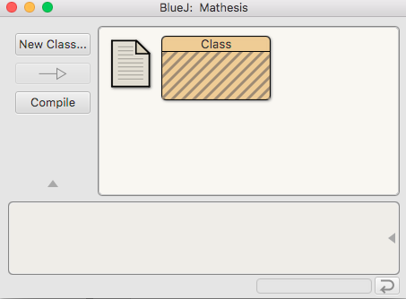

# 3.2 Δημιουργία κλάσεων στο ΟΠΕ {#Java} 
© Γιάννης Κωστάρας

---

[🏠](https://jkost.github.io) | [⬆️](../../README.md) | [◀️](../3.1-OOP/README.md) | [▶️](../3.3-UML/README.md)

---

[](3.2-IDEs.ipynb)

### Μαθησιακοί στόχοι
Σε αυτήν την ενότητα θα μάθουμε πώς μπορούμε να δημιουργήσουμε τις κλάσεις που μάθαμε στο προηγούμενο μάθημα:

* σε έναν απλό κειμενογράφο
* στο BlueJ
* στο NetBeans
* στο Visual Studio Code

## Κειμενογράφος

Φυσικά μπορείτε να μη χρησιμοποιήσετε κάποιο ΟΠΕ για να μεταγλωττίσετε τις κλάσεις σας. Αλλά ας δούμε πρώτα πώς μπορούμε να δημιουργήσουμε τα προγράμματά μας χωρίς αυτό.

Δημιουργήστε ένα νέο αρχείο στον αγαπημένο επεξεργαστή κειμένου, επικολλήστε τον κώδικα της κλάσης ```Car``` από το προηγούμενο μάθημα, και αποθηκεύστε το ως ```Car.java```. Θα πρέπει όμως να μπορούμε να δημιουργήσουμε και αντικείμενα της κλάσης αυτής και να δούμε τα αποτελέσματα στην οθόνη μας. Γι' αυτό το σκοπό χρειαζόμαστε μια μέθοδο ```main()``` όπως μάθαμε στα μαθήματα της προηγούμενης εβδομάδας. Μπορούμε είτε να προσθέσουμε την ```main()``` στην ```Car``` είτε να δημιουργήσουμε μια νέα κλάση, π.χ. ```CarDemo.java``` που να έχει μόνο τη μέθοδο ```main()```. Θα κάνουμε το πρώτο.
```java
class Car { // κλάση
  // ιδιότητες/γνωρίσματα
  String model;
  int maxSpeed;
  int ccm;
  int speed = 0;
  // μέθοδος δημιουργίας αντικειμένων - κατασκευαστής
  Car(String m, int s, int c) {
    model = m; maxSpeed = s; ccm = c;
  }
  // ενέργειες/μέθοδοι
  void accelerate() {
     if (speed <= maxSpeed - 10)
        speed+=10;
  }
  void decelerate() {
     if (speed >= 10)
        speed-=10;
  }
  public String toString() {
     return "Car[" + "model=" + model + ", maxSpeed=" + maxSpeed + ", ccm=" + ccm + ", speed=" + speed + "]"; 
  }
    
  public static void main(String... args) {
      Car audiA3 = new Car("Audi A3", 210, 1595);
      System.out.println(audiA3.speed);
      audiA3.accelerate();
      System.out.println(audiA3.speed);
  }
}
```
Μεταγλωττίστε το και εκτελέστε το όπως μάθατε στο μάθημα της προηγούμενης εβδομάδας.

```bash
$ java Car.java
0
10
```
Δημιουργήστε νέα αρχεία ```Point.java, Line.java, Circle.java, Rectangle.java``` και αντιγράψτε τον κώδικα του προηγούμενου μαθήματος. Έχει σημασία η σειρά με την οποία θα μεταγλωττίσετε τον κώδικα. Οι κλάσεις ```Line, Circle``` και ```Rectangle``` εξαρτώνται από την ```Point```. Επομένως η ```Point``` πρέπει να μεταγλωττιστεί πρώτη. Καθώς δεν υπάρχει ```main()``` μέθοδος δεν υπάρχει νόημα να καλέσουμε την εντολή ```java``` για να τρέξουμε το πρόγραμμα.

```bash
$ javac Point.java
$ javac Line.java
$ javac Circle.java
$ javac Rectangle.java
$ ls
Circle.class Circle.java Line.java Line.class Point.class Point.java Rectangle.class Rectangle.java
```
Συνηθίζεται αντί να έχουμε πολλά αρχεία ```.class```, να τα συλλέγουμε όλα μαζί σε ένα συμπιεσμένο αρχείο ```.jar``` (ή Java Archive). Π.χ. μπορούμε να φτιάξουμε μια βιβλιοθήκη των εγγραφών που δημιουργήσαμε πιο πάνω ως εξής.

Μεταβείτε στο φάκελο που έχετε μεταγλωττίσει τον κώδικα, δηλ. στο φάκελο που περιέχει τα αρχεία ```.class``` και δώστε την εντολή:

```bash
$ jar cvf shapes.jar *.class  // ή jar -c -f shapes.jar *.class

$ jar --help
Usage: jar [OPTION...] [ [--release VERSION] [-C dir] files] ...
jar creates an archive for classes and resources, and can manipulate or
restore individual classes or resources from an archive.
  ...
  -c, --create               Create the archive
  -i, --generate-index=FILE  Generate index information for the specified jar
                             archives
  -t, --list                 List the table of contents for the archive
  -u, --update               Update an existing jar archive
  -x, --extract              Extract named (or all) files from the archive
  -d, --describe-module      Print the module descriptor, or automatic module name
      --validate             Validate the contents of the jar archive. This option
                             will validate that the API exported by a multi-release
                             jar archive is consistent across all different release
                             versions.
  ...
  
$ jar tf shapes.jar   // ή jar -t -f shapes.jar
META-INF/
META-INF/MANIFEST.MF
Circle.class
Line.class
Point.class
Rectangle.class
```
Το αρχείο ```.jar``` είναι ένα ```.zip``` αρχείο μετονομασμένο σε ```.jar``` το οποίο περιέχει και ένα αρχείο ```MANIFEST.MF```:

```bash
$ unzip -p shapes.jar META-INF/MANIFEST.MF
Manifest-Version: 1.0
Created-By: 17 (Oracle Corporation)
```
Αν υπάρχει και μια 'εκτελέσιμη' κλάση στο έργο σας (δηλ. μια κλάση που περιέχει μια μέθοδο ```main()```) τότε μπορούμε να την δηλώσουμε στο ```MANIFEST.MF``` ως εξής:

```bash
$ jar cvfe cardemo.jar Car Car.class   // ή jar -c -f cardemo.jar -e Car Car.class

$ unzip -p cardemo.jar META-INF/MANIFEST.MF
Manifest-Version: 1.0
Created-By: 17 (Oracle Corporation)
Main-Class: Car

$ java -jar cardemo.jar
0
10
```
Παρατηρούμε ότι δημιουργήσαμε έτσι ένα εκτελέσιμο ```.jar``` αρχείο το οποίο μπορούμε να το εκτελέσουμε με την τελευταία εντολή!

## BlueJ

1. Δημιουργήστε ένα νέο έργο από το μενού **Project -> New Project**
1. Κλικ στο κουμπί **New Class...**. Παρατηρούμε ότι το BlueJ υποστηρίζει τους τύπους 'Class'(Κλάση), 'Abstract Class' (Αφηρημένη Κλάση) που θα μάθουμε σε επόμενο μάθημα, 'Interface' (Διεπαφή), 'Unit Test' (Έλεγχος Τμήματος Κώδικα, θα μάθουμε σε επόμενο μάθημα πώς να τεστάρουμε τις κλάσεις μας) και 'Enum' (Απαριθμημένος Τύπος). Δεν υποστηρίζει ακόμα εγγραφές (Records).


**Εικόνα 3.2.1** _Παράθυρο δημιουργίας νέας κλάσης στο BlueJ_

3. Δώστε το όνομα ```Car``` και πατήστε **OK**. Δημιουργήθηκε ένα παραλληλόγραμμο με το όνομα _Car_. Αυτό είναι το σύμβολο της κλάσης στην UML. Θα μάθουμε για τη UML και πώς αναπαριστά κλάσεις, διεπαφές κλπ. στο επόμενο μάθημα.



**Εικόνα 3.2.2** _Κλάση Car στο BlueJ_

4. Πατήστε διπλό κλικ πάνω στην _Car_ για να ανοίξει ο κειμενογράφος ή διορθωτής του BlueJ.
5. Επιλέξτε όλον τον κώδικα που έχει δημιουργήσει το BlueJ. Σβήστε τον και επικολλήστε τον κώδικα της κλάσης ```Car``` που γράψαμε στο προηγούμενο μάθημα.
6. Μεταγλωττίστε την κλάση ```Car``` πατώντας στο κουμπί **Compile**.
7. Για να δημιουργήσουμε ένα νέο αντικείμενο της κλάσης ```Car```, κάντε δεξί κλικ πάνω στο εικονίδιο της ```Car``` και επιλέξτε τον constructor της κλάσης.
8. Δώστε τις παρακάτω τιμές στο διαλογικό παράθυρο που εμφανίζεται:


**Εικόνα 3.2.3** _Δημιουργία νέου αντικειμένου κλάσης ```Car``` στο BlueJ_

9. Δημιουργήθηκε ένα νέο αντικείμενο κλάσης ```Car``` όπως φαίνεται στην παρακάτω εικόνα. Φυσικά μπορείτε να δημιουργήσετε όσα αντικείμενα θέλετε.


**Εικόνα 3.2.4** _Δημιουργήθηκε το νέο αντικειμένο κλάσης ```Car``` στο BlueJ_

10. Πατήστε δεξί κλικ στο νέο αντικείμενο και καλέστε τις διαθέσιμες μεθόδους του:


**Εικόνα 3.2.5** _Κλήση της ```toString()``` αφού κλήθηκε πρώτα η ```accelerate()```_

Παρατηρήστε ότι το BlueJ δεν σας επιτρέπει να προσπελάσετε τις ιδιότητες της κλάσης ```Car``` παρόλο που αυτές δεν είναι ```private```.

Το BlueJ σας δίνει επίσης τη δυνατότητα να δημιουργήσετε αντικείμενα από κλάσεις που δεν είναι μέρος του έργου σας αλλά μέρος της βιβλιοθήκης της Java.

Από το μενού **Tools –> Use Library Class...** θα εμφανιστεί ένα διαλογικό παράθυρο παροτρύνοντας σας να εισάγετε ένα πλήρως κατάλληλο όνομα κλάσης, όπως π.χ. ```java.lang.String```. Μόλις εισαχθεί ένα όνομα κλάσης, πατώντας **Enter** θα παρουσιάσει όλους τους κατασκευαστές και τις στατικές μεθόδους εκείνης της κλάσης σε έναν κατάλογο στο διαλογικό παράθυρο. Οποιοιδήποτε από αυτούς τους κατασκευαστές ή στατικές μεθόδους μπορούν να κληθούν επιλέγοντας τους από αυτόν τον κατάλογο. Η επίκληση (invocation) προχωρά όπως και με κάθε άλλο κατασκευαστή ή κλήση μεθόδου.

Σαν άσκηση δημιουργήστε ένα αντικείμενο της ```java.util.Random```. Η ```Random``` είναι μια γεννήτρια τυχαίων αριθμών. Αφού δημιουργήσετε ένα αντικείμενο της κλάσης, στη συνέχεια κάντε δεξί κλικ πάνω του και καλέστε τη μέθοδο ```nextInt()```. Θα εμφανιστεί ένα διαλογικό παράθυρο με τον τυχαίο ακέραιο αριθμό που "γέννησε" η μέθοδος.

Με το BlueJ μπορούμε πολύ εύκολα να δημιουργήσουμε ένα εκτελέσιμο ```.jar``` αρχείο ως εξής:

1. Επιλέξτε το μενού **Project -> Create Jar File...** 
1. Από το αναδυόμενο παράθυρο επιλέξτε ως _Main class_ την κλάση που περιέχει την ```main()``` μέθοδο
1. Αποεπιλέξτε τα τσεκαρισμένα πεδία _Include source_ και _Include Blue project files_ και πατήστε **Continue**. Θα εμφανιστεί ένα διαλογικό παράθυρο που θα σας ζητήσει το όνομα του ```.jar``` αρχείου που πρόκειται να δημιουργηθεί καθώς και τον φάκελο στον οποίο θέλετε να δημιουργηθεί και πατήστε **Save**.

## NetBeans

1. Δημιουργήστε ένα νέο έργο ```CarDemo``` και ορίστε την κύρια κλάση ως ```Car``` στο 2ο βήμα του οδηγού (βλ. Εικόνα 2.6.2).
1. Επικολλήστε τον κώδικα της υποενότητας "Κειμενογράφος" στην αρχή αυτού του μαθήματος.
1. Εκτελέστε το πρόγραμμα πατώντας στο κουμπί **Run Project**

Το NetBeans υποστηρίζει και εγγραφές. 
1. Δημιουργήστε ένα νέο έργο ```RecordDemo``` όπως μάθαμε στο μάθημα 2.6 της προηγούμενης εβδομάδας, χωρίς να επιλέξετε **Create Main Class** στο 2ο βήμα του οδηγού (βλ. Εικόνα 2.6.2).
1. Κάντε δεξί κλικ στο έργο ```RecordDemo``` από το παράθυρο _Projects_ και επιλέξτε **New -> Other** από το αναδυόμενο μενού.
1. Επιλέξτε _Java Record_ όπως φαίνεται στην παρακάτω εικόνα και **Next**.
1. Δώστε το όνομα ```Point``` σαν όνομα της κλάσης και **Finish**.
1. Τροποποιήστε τον κώδικα που δημιούργησε το NetBeans με τον παρακάτω:


**Εικόνα 3.2.6** _Δημιουργία νέας κλάσης, εγγραφής κλπ. στο NetBeans_

```java
record Point(int x, int y) { }
```
Επαναλάβετε τη διαδικασία για να δημιουργήσετε και τις υπόλοιπες εγγραφές του προηγούμενου μαθήματος.

Για να δημιουργήσουμε ένα εκτελέσιμο ```.jar``` στο NetBeans:

1. Κάντε δεξί κλικ στο έργο και επιλέξτε **Properties** από το αναδυόμενο μενού.
1. Επιλέξτε την κατηγορία _Run_ και ορίστε την κλάση που περιέχει την μέθοδο ```main()``` στο πεδίο _Main Class_ (πατήστε το κουμπί **Browse**  για να την εντοπίσετε).
1. Πατήστε **ΟΚ** για να κλείσετε το παράθυρο **Properties**.
1. Πάλι δεξί κλικ στο έργο και επιλέξτε **Clean and Build**. 

Στο φάκελο του έργου δημιουργήθηκε ένας υποφάκελος ```dist``` μέσα στον οποίο έχει δημιουργηθεί το εκτελέσιμο αρχείο ```.jar```. Μπορείτε να το δείτε και από την καρτέλα ```Files``` του NetBeans.

## Visual Studio Code
1. Δημιουργήστε ένα νέο φάκελο στο Λ.Σ. σας με όνομα ```CarDemo```.
1. Επιλέξτε το μενού **File -> Add Folder to Workspace...** και προσθέστε το φάκελο ```CarDemo``` στον ήδη ανοικτό χώρο εργασίας (workspace).
1. Δημιουργήστε ένα νέο έργο Java όπως μάθαμε στην ενότητα 2.6. Το VS Code δημιούργησε και ένα αρχείο ```App.java``` το οποίο περιέχει μια ```main()``` μέθοδο.
1. Επιλέξτε όλα τα περιεχόμενα του αρχείου, διαγράψτε τα και επικολλήστε τον κώδικα της κλάσης ```Car``` στην αρχή αυτού του μαθήματος και αποθηκεύστε τις αλλαγές.
1. Μετονομάστε το αρχείο ```App.java``` σε ```Car.java``` πατώντας δεξί κλικ πάνω του στο χώρο εργασίας (βρίσκεται μέσα στο φάκελο ```src```) και επιλέγοντας ```Rename``` από το αναδυόμενο μενού.
1. Κάντε πάλι δεξί κλικ πάνω του και αυτή τη φορά επιλέξτε ```Run Java``` από το αναδυόμενο μενού. Θα πρέπει να δείτε την ταχύτητα του αυτοκινήτου, δηλ. ```0``` και ```10```.
1. Επιλέξτε το φάκελο ```src``` και στη συνέχεια κλικ στο μενού **File -> New File...**.
1. Γράψτε ```java``` και επιλέξτε **New java class**.
1. Επικολλήστε τον παρακάτω κώδικα σβήνοντας ότι έχει δημιουργήσει το VS Code.
1. Αποθηκεύστε το αρχείο ως ```Point.java```
1. Επιλέξτε το μενού **View -> Command palette...** και πληκτρολογήστε ```Java Compile``` για να μεταγλωττίσετε τις κλάσεις.

```java
record Point(int x, int y) { }
```
Η διαδικασία δημιουργίας εκτελέσιμου αρχείου ```.jar``` περιγράφεται [εδώ](https://dev.to/rohitk570/create-an-executable-jar-file-on-vs-code-n-command-line-154b).

1. Μεταγλωττίστε τον πηγαίο κώδικα.
1. Στην επιλογή _JAVA PROJECTS_ κάτω αριστερά πατήστε στο κουμπί **Export Jar...** (σύμβολο ```|->```). 
1. Στο πλαίσιο που θα εμφανιστεί δώστε το όνομα της κλάσης που περιέχει την μέθοδο ```main()``` και θα δημιουργηθεί το εκτελέσιμο αρχείο JAR στο φάκελο του έργου σας.
---

[🏠](https://jkost.github.io) | [⬆️](../../README.md) | [◀️](../3.1-OOP/README.md) | [▶️](../3.3-UML/README.md)

---