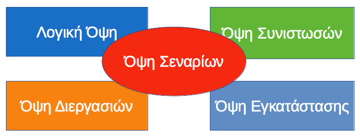
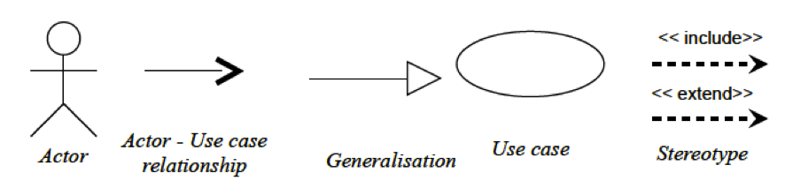
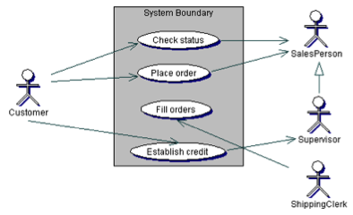
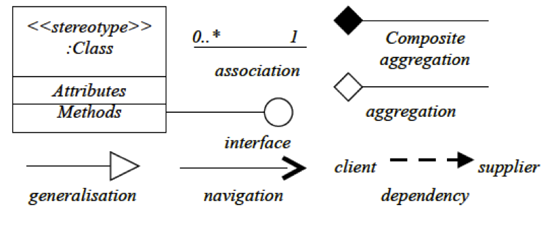
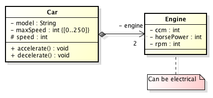
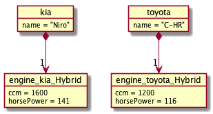
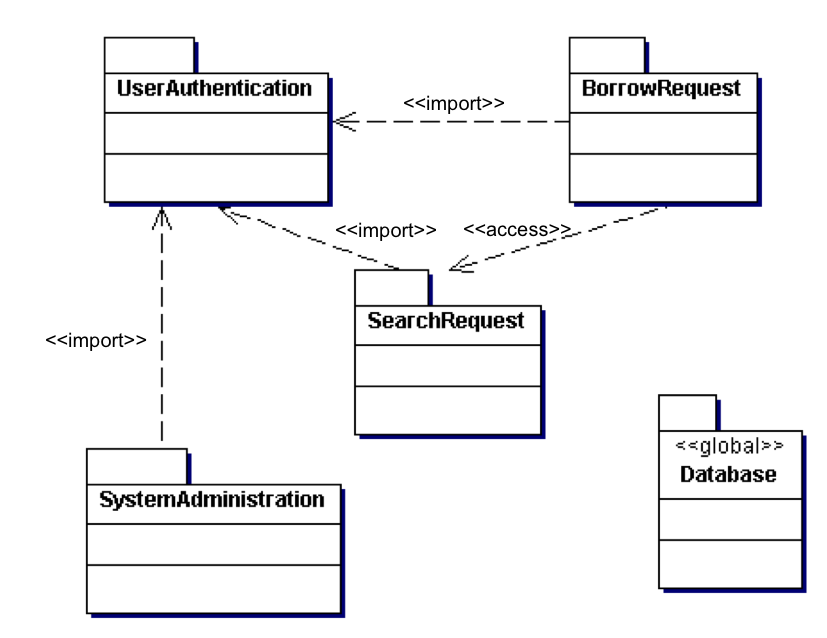

# 3.3 Εισαγωγή στη UML {#Java} 
© Γιάννης Κωστάρας

---

[<](../3.2-IDEs/README.md) | [Δ](../../README.md) | [>](../3.4-OOProperties/README.md)

---

[](3.3-UML.ipynb)

### Μαθησιακοί στόχοι
Σε αυτήν την ενότητα θα μάθουμε:

* τι είναι η ενοποιημένη γλώσσα μοντελοποίησης UML
* ποια είναι η τελευταία έκδοση
* τους τύπους διαγραμμάτων από τα οποία αποτελείται και πώς κατηγοριοπιούνται
* ποια διαγράμματα θα χρειαστούμε σε αυτά τα μαθήματα

_Αυτό το μάθημα είναι προαιρετικό_.

## Εισαγωγή
Η _UML_ ή _Unified Modelling Language (Ενοποιημένη Γλώσσα Μοντελοποίησης)_ είναι μια οπτικοποιημένη (visual) γλώσσα μοντελοποίησης η οποία σκοπό έχει τη δημιουργία, τον προσδιορισμό, την οπτικοποίηση και την τεκμηρίωση όλων των τεχνουργημάτων ενός συστήματος λογισμικού. Αναπτύχθηκε από τους Grady Booch, James Rumbaugh και Ivar Jacobson οι οποίοι ενοποίησαν τα μοντέλα τους (_Booch method_, _Object Modeling Technique (OMT)_ και _Object Oriented Software Engineering (OOSE)_ αντίστοιχα) για την παραγωγή μιας ενοποιημένης γλώσσας μοντελοποίησης. Αποτελείται από στοιχεία μοντελοποίησης, δηλ. αφαιρέσεις του συστήματος προς μοντελοποίηση. Είναι σημαντικό να σημειώσουμε ότι η UML _δεν_ αποτελεί μια μεθοδολογία/διαδικασία ανάπτυξης λογισμικού, μπορεί όμως να χρησιμοποιηθεί από τέτοιες διαδικασίες όπως π.χ. η [Rational Unified Process (RUP)](https://en.wikipedia.org/wiki/Rational_Unified_Process), [Iconix](http://www.iconixsw.com/), [Agile](https://dzone.com/articles/we-do-not-use-uml-we-are-agile) κ.ά.

Εκδόσεις: 1.0, 1.1, 1.2, 1.3, 1.4, 1.5, 2.0

Η έκδοση 2.0 προωθεί την _Προσανατολισμένη στα Μοντέλα Αρχιτεκτονική (Model Driven Architecture - MDA)_, δηλ. την παραγωγή 'εκτελέσιμων' μοντέλων που θα μπορούν να χρησιμοποιηθούν κατάλληλα από διάφορα εργαλεία.

Η UML 2.0 αποτελείται από 13 τύπους διαγραμμάτων τα οποία κατηγοριοποιούνται σε δυο μεγάλες κατηγορίες: 

* _διαγράμματα δομής (structural diagrams)_ και 
* _διαγράμματα συμπεριφοράς (behavioural diagrams)_

Σε αυτό το προαιρετικό μάθημα θα αναφερθούμε μόνο στα διαγράμματα με τα οποία θα ασχοληθούμε σε αυτό το εισαγωγικό μάθημα της Java και τα οποία δηλώνονται παρακάτω με το √.

### Διαγράμματα δομής (structural diagrams) ή Στατικά διαγράμματα
* Διαγράμματα κλάσεων (class diagrams) √
* Διαγράμματα αντικειμένων (Object diagrams) √
* Διαγράμματα συνιστωσών/εξαρτημάτων (component diagrams)
* Διαγράμματα σύνθετης δομής (Composite Structure diagrams)
* Διαγράμματα βιβλιοθηκών (Package diagrams) √
* Διαγράμματα εγκατάστασης (Deployment diagrams)

### Διαγράμματα συμπεριφοράς (behavioural diagrams) ή Δυναμικά διαγράμματα
* Διαγράμματα σεναρίων (Use Case diagrams) √
* Διαγράμματα δραστηριότητας (Activity diagrams)
* Διαγράμματα επικοινωνίας (Communication diagrams)
* Διαγράμματα αλληλεπίδρασης (Interaction Overview diagrams)
* Διαγράμματα ακολουθίας/αλληλουχίας (Sequence diagrams)
* Διαγράμματα μετάβασης κατάστασης (State Machine diagrams)
* Διαγράμματα χρονισμού (Timing diagrams)

Άλλη κατηγοριοποίηση είναι οι _4+1 όψεις (views)_ όπως φαίνεται στο ακόλουθο σχήμα:



**Εικόνα 3.3.1** _4+1 όψεις της UML_

### Λογική Όψη (Logical View) ή Όψη Σχεδίασης (Design View)
Αναπαριστά το πώς θα "χτιστεί" το σύστημα/πρόγραμμα δηλ. τις κλάσεις, διεπαφές και πρότυπα (patterns) που θα χρησιμοποιηθούν. Αποτελείται από:

* Διαγράμματα κλάσεων (class diagrams) √
* Διαγράμματα αντικειμένων (Object diagrams) √
* Διαγράμματα σύνθετης δομής (Composite Structure diagrams)
* Διαγράμματα δραστηριότητας (Activity diagrams)
* Διαγράμματα ακολουθίας/αλληλουχίας (Sequence diagrams)

### Όψη Συνιστωσών (Component View) ή Όψη Υλοποίησης (Implementation View)
Δίνει έμφαση στα αρθρώματα, βιβλιοθήκες, αρχεία, πόρους και εξαρτήσεις του συστήματος. Αποτελείται από:

* Διαγράμματα συνιστωσών/εξαρτημάτων (component diagrams)
* Διαγράμματα σύνθετης δομής (Composite Structure diagrams)
* Διαγράμματα αλληλεπίδρασης (Interaction Overview diagrams)
* Διαγράμματα μετάβασης κατάστασης (State Machine diagrams)

### Όψη Εγκατάστασης (Deployment View)
Περιγράφει πώς εγκαθίσταται, διαμορφώνεται και εκτελείται ένα σύστημα. Περιγράφει το απαιτούμενο υλικό (hardware) για να εκτελεστεί και να επικοινωνήσει το σύστημα (π.χ. πλεονασμό - redundancy, τοπολογία δικτύου κλπ.). Αποτελείται από:

* Διαγράμματα εγκατάστασης (Deployment diagrams)
* Διαγράμματα συνιστωσών/εξαρτημάτων (component diagrams)
* Διαγράμματα αλληλεπίδρασης (Interaction Overview diagrams)

### Όψη Διαδικασιών (Process View)
Περιγράφει πώς το σύστημα συμπεριφέρεται σε ένα πολυεπεξεργαστικό περιβάλλον, την απόδοση και επεκτασιμότητά του. Αποτελείται από:

* Διαγράμματα αλληλεπίδρασης (Interaction Overview diagrams)
* Διαγράμματα δραστηριότητας (Activity diagrams)
* Διαγράμματα μετάβασης κατάστασης (State Machine diagrams)
* Διαγράμματα ακολουθίας/αλληλουχίας (Sequence diagrams)

### Όψη σεναρίων (Use Case view)
Περιγράφει τη λειτουργικότητα του συστήματος με βάση τις απαιτήσεις των χρηστών. Αποτελείται από:

* Διαγράμματα σεναρίων (Use Case diagrams) √
* Διαγράμματα δραστηριότητας (Activity diagrams)
* Διαγράμματα αλληλεπίδρασης (Interaction Overview diagrams)

Παρακάτω περιγράφουμε μόνο τα διαγράμματα που θα χρειαστούμε σε αυτό το μάθημα.

## 1. Όψη σεναρίων (Use Case view)
Η όψη σεναρίων αποτελείται από τα (1) _διαγράμματα σεναρίων (Use Case diagrams)_ τα οποία ανήκουν στα διαγράμματα συμπεριφοράς (behavioural). Χρησιμοποιούνται στο επίπεδο της ανάλυσης για να μετατρέψουν τις απαιτήσεις του συστήματος σε σενάρια χρήσης. Παρέχουν μια όψη του συστήματος ανεξάρτητη της υλοποίησης που δείχνει _τι_ υποτίθεται ότι πρέπει να κάνει το σύστημα στοχεύοντας στο να κατανοήσει τις ανάγκες του χρήστη και όχι τις λεπτομέρειες της υλοποίησης.



**Εικόνα 3.3.2** _Συμβολολογία διαγράμματος σεναρίου_

Ένας _ρόλος (actor)_ είναι κάτι εκτός του συστήματος που έχουμε να αναπτύξουμε, π.χ. ένας χρήστης ή ακόμα κι ένα απομακρυσμένο σύστημα με το οποίο πρέπει να επικοινωνήσει το πρόγραμμά μας.

Ένα _σενάριο (use case)_ περιγράφει μια συμπεριφορά του συστήματος, δηλ. μια ακολουθία από βήματα που πρέπει να διεκπεραιώσει ένας ρόλος για να πετύχει κάτι με το σύστημα.

Όπως φαίνεται στην Εικόνα 3.3.2, μπορούμε να ορίσουμε διάφορες σχέσεις σε ένα διάγραμμα σεναρίων:

* _Συσχέτιση (Relationship)_ μεταξύ σεναρίων και ρόλων δηλώνει ότι υπάρχει μια αλληλεπίδραση
* _Κληρονομικότητα (Generalization)_ μεταξύ ρόλων ή μεταξύ σεναρίων, σημαίνει ειδίκευση, δηλ. ότι εξειδικεύουμε τις λειτουργίες του γενικευμένου ρόλου ή σεναρίου μ' έναν πιο ειδικευμένο ρόλο ή σενάριο. Π.χ. στο παράδειγμα της εικόνας 3.3.3 βλέπουμε ότι ο ρόλος ```Supervisor``` μπορεί κάνει όλες τις λειτουργίες του ρόλου ```SalesPerson``` αλλά έχει και πιο ειδικευμένες αρμοδιότητες
* _Περιλαμβάνει (Includes)_ χρησιμοποιείται όταν ένα σενάριο περιλαμβάνει ένα άλλο σενάριο (π.χ. ένα σενάριο περιλαμβάνει το σενάριο ```Login```)
* _Επέκταση (Extends)_ χρησιμοποιείται όταν ένα σενάριο μπορεί να επεκταθεί με κάποιο άλλο σενάριο σε κάποια σημεία (extension points)

Στο παράδειγμα της εικόνας 3.3.3 βλέπουμε τι μπορεί ο ρόλος (actor) πελάτης (customer) (αλλά κι οι άλλοι ρόλοι: SalesPerson, Supervisor, ShippingClerk) να κάνει(-ουν) με το σύστημα. Π.χ. μπορεί να υποβάλλει μια παραγγελία (Σενάριο: Place order). 



**Εικόνα 3.3.3** _Παράδειγμα διαγράμματος σεναρίου_

Σε κάθε σενάριο επισυνάπτεται συνήθως μια λεπτομερής περιγραφή του ποια βήματα θα πρέπει ν' ακολουθήσει ο ρόλος για να διεκπεραιώσει μ' επιτυχία το σενάριο, λαμβάνοντας φυσικά υπόψιν και τις εξαιρέσεις (τι θα συμβεί αν κάτι πάει στραβά). Τα βήματα του σεναρίου μπορούν να περιγραφούν με διαγράμματα δραστηριότητας (activity diagrams). 

## 2. Λογική Όψη (Logical View) ή Όψη Σχεδίασης (Design View)
Αποτελείται από τα παρακάτω στατικά διαγράμματα:

 2. _Διαγράμματα κλάσεων (Class diagrams) √_
 3. _Διαγράμματα αντικειμένων (Object diagrams) √_
 4. _Διαγράμματα βιβλιοθηκών (Package diagrams) √_

### Διαγράμματα κλάσεων (Class diagrams)

Τα διαγράμματα κλάσεων αναπαριστούν τις κλάσεις/διεπαφές ενός συστήματος και τις σχέσεις μεταξύ τους. Σ' αυτά τα διαγράμματα θα επικεντρωθούμε αυτή και την επόμενη εβδομάδα.

Μια κλάση αναπαριστά μια ομάδα ίδιων πραγμάτων που έχουν κοινή κατάσταση (state) και συμπεριφορά (behavior). Μια κλάση αναπαρίσταται στη UML ως ένα ορθογώνιο παραλληλογράμμο (βλ. Εικόνα 3.3.4) που αποτελείται από τρία μέρη: το _όνομα_ της κλάσης, τα _γνωρίσματά_ της και τις _μεθόδους_ της. 



**Εικόνα 3.3.4** _Συμβολολογία διαγράμματος κλάσεων_


**Εικόνα 3.3.5** _Σχέσεις μεταξύ κλάσεων_

Μια _abstract_ κλάση δηλώνεται με _πλάγια_ γράμματα. Ένα στατικό πεδίο ή μια στατική μέθοδος φαίνεται υπογραμμισμένο(-η). Μπορούμε να κατηγοριοποιήσουμε τις κλάσεις χρησιμοποιώντας _στερεότυπα (stereotypes)_, π.χ. ```<<interface>>```.

Π.χ. η κλάση ```Car``` που είδαμε στο προηγούμενο μάθημα αναπαρίσταται ως εξής:



**Εικόνα 3.3.6** _Παράδειγμα διαγράμματος κλάσης στη UML_

Τα γνωρίσματα μιας κλάσης μπορεί να είναι κάποιου από τους τύπους δεδομένων της Java (π.χ. ```int, String``` κλπ.) ή τύπος δεδομένων μιας άλλης κλάσης και στην περίπτωση αυτή λέμε ότι οι δυο αυτές κλάσεις σχετίζονται μεταξύ τους. 

Στην Εικόνα 3.3.5 βλέπουμε επίσης τις διάφορες σχέσεις μεταξύ των κλάσεων:

* συσχέτιση (association)
* κληρονομικότητα (generalisation)
* εξάρτηση (dependency)
* συσσωμάτωση (aggregation)
* σύνθετη συσσωμάτωση (composite aggregation ή composition)

Η σχέση της εξάρτησης (dependency) είναι η πιο αφαιρετική από τις υπόλοιπες και σημαίνει ότι στο σώμα μιας μεθόδου της κλάσης χρησιμοποιείται μια άλλη κλάση. Πρόκειται δηλ. για μια προσωρινή σχέση που συνήθως δηλώνεται ως "χρησιμοποιεί (_uses a_)". 

Για τις υπόλοιπες σχέσεις θα μιλήσουμε στα επόμενα μαθήματα αυτής της εβδομάδας. Η Εικόνα 3.3.6 δείχνει ένα παράδειγμα σύνθετης συσσωμάτωσης (composition) μεταξύ των δυο κλάσεων. 

Επίσης μπορούμε να προσθέσουμε την _πολλαπλότητα (multiplicity)_ σε μια σχέση που δείχνει πόσα αντικείμενα μιας κλάσης σχετίζονται με μια άλλη. 

Συμβολίζεται όπως παρακάτω σε καθεμιά από τις άκρες μιας σχέσης:

* πολλά (0 ή περισσότερα): *
* ένα ή περισσότερα: 1..*
* μηδέν ή ένα: 0..1
* ακριβώς ένα: 1


**Εικόνα 3.3.7** _Πολλαπλότητα (multiplicity)_

Π.χ. το διάγραμμα κλάσεων της εικόνας 3.3.7 διαβάζεται ως εξής: μια ουρά μπορεί να έχει 0 ή περισσότερα μηνύματα, ενώ ένα μήνυμα μπορεί να βρίσκεται μόνο σε μια ουρά (όχι σε περισσότερες).

Στην Εικόνα 3.3.6 βλέπουμε ότι ένα αυτοκίνητο μπορεί να έχει μια μόνο μηχανή (αν και υπάρχουν αυτοκίνητα με 2 μηχανές, η μια από τις οποίες μπορεί να είναι ηλεκτρική). Αν η πολλαπλότητα σε μια σχέση είναι >1 τότε συνήθως αυτό σημαίνει ότι υλοποιείται μέσω μιας συλλογής ή πίνακα (π.χ. ```Engine[] engines = new Engine[2]```).

Επίσης, στην εικόνα 3.3.6 βλέπουμε ότι η σχέση είναι κατευθυνόμενη (navigation) από την κλάση ```Car``` στην κλάση ```Engine``` (βελάκι). Αν δεν υπάρχει βέλος τότε είναι μη κατευθυνόμενη (bidirectional).

Πέρα απ' τον τύπο δεδομένων, ένα γνώρισμα ή μια μέθοδος διαθέτει και _ορατότητα (visibility)_. Θα εξηγήσουμε τι σημαίνουν τα (```+, -```) και (```#```) στο επόμενο μάθημα. Τέλος, μπορούμε να προσθέσουμε και περιορισμούς (constraints) με ```{}```, π.χ. ```-maxSpeed : int {[0..250]}```. Η UML 2.0 διαθέτει μια ειδική γλώσσα, την _Object Contraint Language (OCL)_ για τη συγγραφή περιορισμών η οποία διαθέτει μια γραμματική η οποία μπορεί να επικυρωθεί από εργαλεία μοντελοποίησης. 

Τέλος, στην Εικόνα 3.3.6 βλέπουμε και το σύμβολο του σχολίου/σημειώματος (note) που μπορεί να χρησιμοποιηθεί σ' όλα τα διαγράμματα.

### Διαγράμματα αντικειμένων (Object diagrams)

Τα διαγράμματα αντικειμένων έχουν την ίδια συμβολολογία με τα διαγράμματα κλάσεων και δείχνουν τις σχέσεις των αντικειμένων των κλάσεων σε μια συγκεκριμένη χρονική στιγμή. Χρησιμοποιούνται για να εμφανίσετε στιγμιότυπα των σχέσεων μεταξύ των αντικειμένων κατά την εκτέλεση του προγράμματος.



**Εικόνα 3.3.8** _Παράδειγμα διαγράμματος αντικειμένων_

### Διαγράμματα βιβλιοθηκών (Package diagrams)
Χρησιμοποιούνται για να ομαδοποιούμε κλάσεις σε πακέτα ή βιβλιοθήκες. Αντιστοιχούν στις βιβλιοθήκες (packages) της γλώσσας.



**Εικόνα 3.3.9** _Παράδειγμα διαγράμματος βιβλιοθηκών_

Μια _βιβλιοθήκη (package)_ είναι ένας υποδοχέας (container) στοιχείων μοντελοποίησης, ένας μηχανισμός γενικού σκοπού οργάνωσης στοιχείων σε ομάδες. Τα διαγράμματα βιβλιοθηκών μπορούν να χρησιμοποιηθούν σε κάθε βήμα της UML. Μια βιβλιοθήκη μπορεί να είναι υποδοχέας σεναρίων, κλάσεων, συνιστωσών κλπ.

## 3. Όψη Συνιστωσών/Εξαρτημάτων (Component View)
Αποτελείται από τα παρακάτω διαγράμματα δομής:

 5. _Διαγράμματα συνιστωσών/εξαρτημάτων (Component diagrams)_
 6. _Διαγράμματα σύνθετης δομής (Composite Structure diagrams)_ 

## 4. Όψη Εγκατάστασης (Deployment View)
Αποτελείται από το παρακάτω στατικό διάγραμμα:

 7. _Διαγράμματα εγκατάστασης (Deployment diagrams)_

Τα διαγράμματα εγκατάστασης δείχνουν πώς εγκαθίσταται στο υλικό (σε διακομιστές, ΒΔ, συσκευές δικτύωσης κλπ.) και πώς εκτελείται πραγματικά το σύστημα/πρόγραμμα, δηλ. τους υπολογιστές, τις δικτυακές συσκευές κλπ. που απαιτούνται.

## 5. Όψη Διαδικασιών (Process View)
Η όψη διαδικασιών αποτελείται από τα παρακάτω δυναμικά διαγράμματα:

 8. _Διαγράμματα ακολουθίας/αλληλουχίας (Sequence diagrams)_
 9. _Διαγράμματα επικοινωνίας (Communication diagrams)_
 10. _Διαγράμματα μετάβασης κατάστασης (State Machine diagrams)_
 11. _Διαγράμματα δραστηριότητας (Activity diagrams)_
 12. _Διαγράμματα αλληλεπίδρασης (Interaction Overview diagrams)_
 13. _Διαγράμματα χρονισμού (Timing diagrams)_

## Εργαλεία
Εμείς θα επικεντρωθούμε στο BlueJ για να μάθουμε τη UML. Παρόλ' αυτά παρακάτω παρουσιάζουμε μια λίστα από τι κυκλοφορεί στην αγορά.

Δωρεάν:

* [ArgoUML](http://argouml.tigris.org/)
* [Astah](http://astah.net/)
* [BlueJ](https://bluej.org)
* [Capella](https://www.polarsys.org/capella/)
* [Dia](http://dia-installer.de/)
* [Umbrello](https://umbrello.kde.org/)
* [UMLet](http://umlet.com/)

Online:

* [Draw.io](https://www.draw.io/)
* [Diagram Editor](https://www.diagrameditor.com/)
* [PlantText](https://www.planttext.com/)
* [Creately](https://creately.com/Draw-UML-and-Class-Diagrams-Online)
* [yEd](https://www.yworks.com/products/yed)
* [YUML](https://yuml.me)
* [YWorks](https://www.yworks.com/products/graphity)

Εμπορικά:

* [Altova UModel](https://www.altova.com/umodel/uml-diagrams)
* [Enterprise Architect](https://www.sparxsystems.com/)
* [MagicDraw](https://www.nomagic.com/products/magicdraw)
* [Microsoft Visio](https://www.microsoft.com/en-us/store/collections/visio?cat0=devices)
* [SmartDraw](https://www.smartdraw.com/uml-diagram/uml-diagram-tool.htm)
* [StarUML](http://staruml.io/)
* [VisualParadigm](https://www.visual-paradigm.com/solution/freeumltool/)

## NetBeans UML plugins
Μπορείτε να οπτικοποιήσετε τις κλάσεις σας απευθείας από το NetBeans. Υπάρχουν μερικά plugins για το NetBeans γι' αυτό το σκοπό. 

* [easyUML](http://plugins.netbeans.org/plugin/55435/easyuml)
* [plantUML](http://plugins.netbeans.org/plugin/49069/plantuml)
* [Visual Paradigm](https://www.visual-paradigm.com/tutorials/modelinginnetbeans.jsp)

Εδώ θα περιγράψουμε το πρόσθετο _PlantUML_.

### PlantUML
Το [PlantUML](http://plantuml.com/) είναι μια μετα-γλώσσα με την οποία μπορεί κάποιος να παράγει διαγράμματα UML. Υποστηρίζονται τα ακόλουθα διαγράμματα:

* Διάγραμμα Ακολουθίας (Sequence diagram)
* Διάγραμμα Σεναρίων ή Περιπτώσεων Χρήσης (Usecase diagram)
* Διάγραμμα Κλάσεων (Class diagram)
* Διάγραμμα Δραστηριοτήτων (Activity diagram)
* Διάγραμμα Συστημάτων (Component diagram)
* Διάγραμμα Κατάστασης (State diagram)
* Διάγραμμα Αντικειμένων (Object diagram)
* Διάγραμμα Εγκατάστασης (Deployment diagram) 
* Διάγραμμα Χρονισμού (Timing diagram) 


Μπορείτε να κατεβάσετε το PlantUML plugin για το NetBeans από [εδώ](https://plugins.netbeans.apache.org/catalogue/?id=58). Για να το εγκαταστήσετε, επιλέξτε στο NetBeans το μενού **Tools -> Plugins**, καρτέλα **Downloaded**, κλικ στο κουμπί **Add Plugins**, πλοηγηθείτε στο **PlantUML-NB-x.x.nbm** και **Open** και στη συνέχεια **Install**. Ακολουθήστε τις οδηγίες του οδηγού για να το εγκαταστήσετε. Η PlantUML χρειάζεται τη βιβλιοθήκη [graphviz](https://graphviz.gitlab.io/download/) την οποία πρέπει να εγκαταστήσετε ξεχωριστά. Ελέγξτε την εγκατάσταση από το μενού **Tools -> Options** (ή **NetBeans -> Preferences** αν είστε στο Mac) και κάνοντας κλικ στο **Miscellaneous -> PlantUML**. Πιθανόν να χρειαστεί να ορίσετε χειροκίνητα (manual) τη θέση του graphviz.

Για να δημιουργήσετε ένα διάγραμμα κλάσεων, επιλέξτε οποιαδήποτε κλάση του έργου σας (project) και επιλέξτε το μενού **File -> New File -> PlantUML -> PlantUML from existing Java sources**. Ακολουθήστε τον οδηγό. Θα δημιουργηθεί ένα αρχείο ```.puml``` που θα περιλαμβάνει μια σειρά από εντολές που δείχνουν τις συσχετίσεις μεταξύ των κλάσεων του έργου σας, π.χ.:

```
@startuml
class A
class B
B --|> A
@enduml
```

[Σύνταξη για τα διαγράμματα κλάσεων της PlantUML](http://plantuml.com/class-diagram). Μπορείτε να οπτικοποιήσετε το διάγραμμα κλάσεων επιλέγοντας το μενού **Window --> PlantUML**.

## Περίληψη
Σ' αυτό το μάθημα αναφερθήκαμε στα 13 διαγράμματα της UML 2.0 αλλά περιγράψαμε μόνο τους 4 τύπους διαγραμμάτων που θα χρειαστούμε:

* Διαγράμματα σεναρίων (Use Case diagrams)
* Διαγράμματα κλάσεων (class diagrams)
* Διαγράμματα αντικειμένων (Object diagrams)
* Διαγράμματα βιβλιοθηκών (Package diagrams)

Η Unified Modeling Language είναι μια οπτική γλώσσα μοντελοποίησης που επιτρέπει να απεικονίσουμε όλες τις φάσεις ανάπτυξης ενός προγράμματος, από τις απαιτήσεις μέχρι την εγκατάσταση στους Η/Υ του πελάτη.

Είναι σημαντικό να κατανοήσετε ότι δεν απαιτείται να χρησιμοποιήσετε _όλα_ τα διαγράμματα για να περιγράψετε το σύστημά σας. Το ποια διαγράμματα θα χρησιμοποιήσετε εξαρτάται από το ποιούς θα χρησιμοποιηθούν και τι σκοπό εξυπηρετούν. Πάντα να έχετε υπόψιν σας ότι τα UML διαγράμματα βοηθούν στην τεκμηρίωση του κώδικά σας και βοηθούν εσάς και άλλους να κατανοήσουν καλύτερα τι προσπαθήτε να επιτύχετε με το σύστημά σας ώστε να είναι σε θέση να το βελτιώσουν μελλοντικά. 

## Πηγές
1. Ambler S.W. (2003), _The Elements of UML 2.0 Style_, Cambridge University Press.
1. Booch G., Rumbaugh  J., Jacobson I. (2005), _The Unified Modeling Language User Guide_, 2nd Ed, Addison Wesley
1. Cockburn A. (1999), _Surviving Object-Oriented Projects_, Addison-Wesley.
1. Eriksson H.-E., Penker M. (1998), _UML Toolkit_, John Wiley & Sons, Inc.
1. Fowler M. (2004), _UML Distilled_, 3rd Edition, Addison-Wesley.
1. Gamma E., Helm R., Johnson R., Vlissides J. (1995), _Design Patterns: Elements of Reusable Object-Oriented Software_, Addison-Wesley.
1. Graham I., Wills A., _UML Tutorial_, MMI – Trireme International
1. Halbert P., O’ Brien (1997), _Using Types and Inheritance in Object Oriented Programming_, IEEE Software, September.
1. Jacobson I., Magnus C., Patrik J., Gunnar O. (1992), _Object-Oriented Software Engineering: A Use Case Driven Approach_, Addison-Wesley.
1. Kruchten P. (2000), _The Rational Unified Process An Introduction_, 2nd Edition, Addison-Wesley.
1. Kostaras I. (2009), [UML Description and a methodology of use](http://umlmethod.freeservers.com/).
1. Martin R.C. (2002), _UML for Java Programmers_, Prentice-Hall
1. Pilone D. & Pitman N. (2005), _UML 2.0 in a Nutshell_, O’Reilly
1. Pilone D. (2006), _UML 2.0 Pocket Reference_, O’Reilly
1. Pressman R. S. (1997), _Software Engineering - A practitioner's approach_, 4th edition, European adaptation, McGraw Hill.
1. Quatrani T. (1998), _Visual Modeling with Rational Rose and UML_, Addison-Wesley.
1. Rosenberg, D. (1999), _Use Case Driven Object Modeling with UML – A practical approach_, Addison-Wesley.
1. Rumbaugh J., Blaha M., Premerlani W., Eddy F., Lorensen W. (1991), _Object-Oriented Modelling and Design_, Prentice-Hall Int.
1. Schneider G., Winters J.P. (2001), _Applying Use Cases – A practical guide_, 2nd Ed., Addison-Wesley.
1. [SDM] Software Development Magazine (1998), _Inside the UML_, Rational Software Corporation.
1. [UML Class Diagrams](http://javaboutique.internet.com/articles/AJ/UML/).

---

[<](../3.2-IDEs/README.md) | [Δ](../../README.md) | [>](../3.4-OOProperties/README.md)

---
