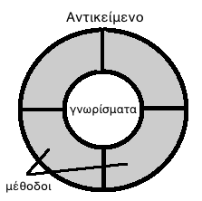
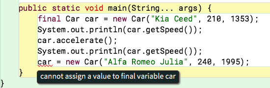
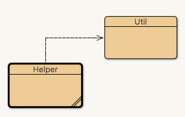
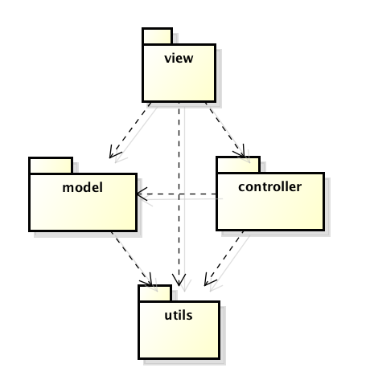
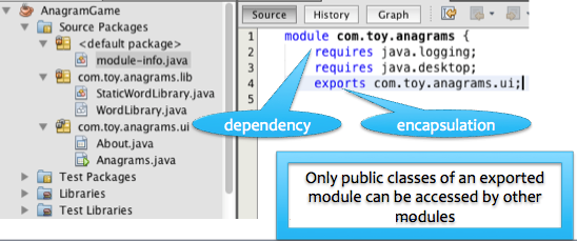
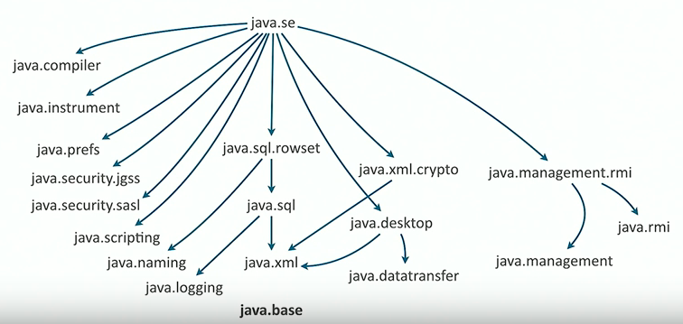
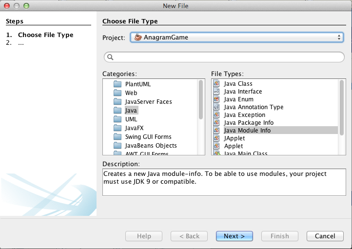
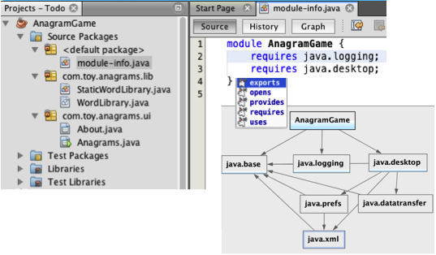
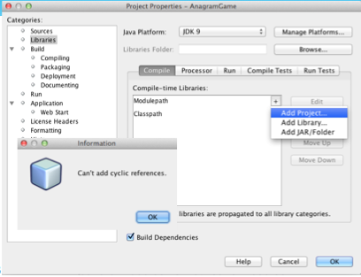
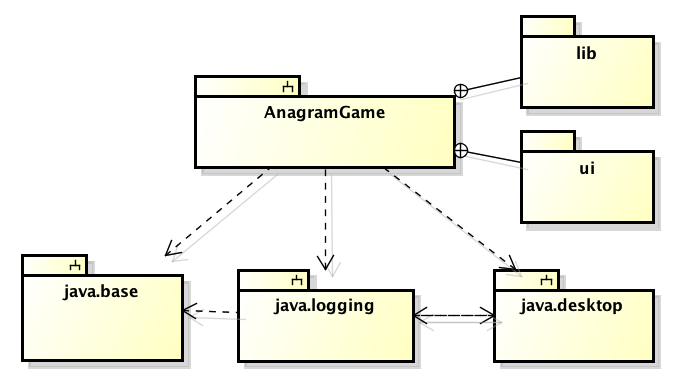

# 3.5 Ενθυλάκωση, Πακέτα και Αρθρώματα
© Γιάννης Κωστάρας

---

[<](../3.4-OOProperties/README.md) | [Δ](../../README.md) | [>](../3.6-Exercise1/README.md)

---

[](3.5-Encapsulation.ipynb)

### Μαθησιακοί στόχοι
Σε αυτήν την ενότητα θα μάθουμε:

* τι είναι ενθυλάκωση (encapsulation) στον αντικειμενοστραφή προγραμματισμό
* πώς υλοποιείται η ενθυλάκωση στη Java
* για τους τροποποιητές πρόσβασης (access restrictors)
* για τα πακέτα/βιβλιοθήκες (packages)
* για τα αρθρώματα (modules)
* για τις αμετάβλητες (immutable) κλάσεις

Δεν θα μιλήσουμε για Εμφωλευμένες (nested) ή εσωτερικές κλάσεις (Inner Classes) που είναι άλλος ένας τρόπος ενθυλάκωσης.

## Ενθυλάκωση (Encapsulation)

Ένα από τα πολλά προβλήματα που υπάρχουν με το διαδικαστικό μοντέλο προγραμματισμού είναι ότι υπάρχει πρόσβαση χωρίς κάποιον έλεγχο στις καθολικές μεταβλητές (global variables), δηλ. οποιοδήποτε τμήμα του προγράμματος μπορεί να τις αλλάξει. Αυτό καθιστά πολύ δύσκολη την αποσφαλμάτωση, όταν εμφανίζονται bugs που οφείλονται στη μεταβολή των καθολικών μεταβλητών.

Το αντικειμενοστραφές μοντέλο έφερε περιορισμούς στην πρόσβαση των δεδομένων. Έτσι, πλέον, οι μεταβλητές ορίζονται και χρησιμοποιούνται μόνο από το τμήμα κώδικα που τις χρειάζεται. Επίσης τα δεδομένα ορίζονται πλέον μαζί με τις μεθόδους που τις αλλάζουν, δηλ. μέσα στις κλάσεις, όπως είδαμε στο προηγούμενο μάθημα. 

Με την ενθυλάκωση:

* επιτρέπεται ο έλεγχος πρόσβασης στα δεδομένα ενός αντικειμένου μόνο μέσω των μεθόδων του
* η χρήση του αντικειμένου δεν αλλάζει αν αλλάξουν τα δεδομένα

Πώς επιτυγχάνεται η ενθυλάκωση; Η Java παρέχει κάποιες δεσμευμένες λέξεις για το σκοπό αυτό:

* ```public``` σημαίνει ότι το γνώρισμα ή η μέθοδος ή η κλάση μπορούν να προσπελαστούν από άλλες κλάσεις (η πρόσβαση είναι ανοικτή σε όλους)
* ```private``` σημαίνει ότι το γνώρισμα ή η μέθοδος ή η κλάση μπορούν να προσπελαστούν μόνο από την ίδια κλάση

Φανταστείτε την ενθυλάκωση ως εξής. ```Public``` σημαίνει ότι όταν σας ζητούν χρήματα ή την ταυτότητά σας δίνετε το πορτοφόλι σας στον καλούντα χωρίς να έχετε έλεγχο στο τι κάνει μ' αυτό. ```Private``` σημαίνει ότι όταν σας ζητούν χρήματα ή την ταυτότητά σας, εσείς κρατάτε το πορτοφόλι σας και βγάζετε από μέσα ότι σας ζητά ο καλών, εσείς δηλ. έχετε τον έλεγχο.

Υπάρχουν δυο ακόμα τρόποι πρόσβασης που θα δούμε στη συνέχεια:

* ```package``` σημαίνει ότι το γνώρισμα ή η μέθοδος ή η κλάση μπορούν να προσπελαστούν από άλλες κλάσεις που ανήκουν στο ίδιο πακέτο (package) με την εν λόγω κλάση
* ```protected``` σημαίνει ότι το γνώρισμα ή η μέθοδος ή η κλάση μπορούν να προσπελαστούν από τις υποκλάσεις της εν λόγω κλάσης

Συνήθως τα δεδομένα χαρακτηρίζονται σχεδόν πάντα ως ```private``` (ή ```protected```) και οι μέθοδοι που επιτρέπουν πρόσβαση σ' αυτά τα δεδομένα ως ```public```.

Τα παραπάνω συνοψίζονται στον παρακάτω πίνακα:

| Τροποποιητής πρόσβασης | Ίδια κλάση | Ίδιο πακέτο | Υποκλάση | Άλλα πακέτα |
| ```public``` | X | X | X | X |
| ```protected``` | X | X | X | |
| ```package``` ή τίποτα | X | X | | |
| ```private``` | X | | | |

Ας δούμε πώς θα έπρεπε να είχαμε γράψει τη κλάση ```Car``` της προηγούμενης διάλεξης, κάνοντας σωστή χρήση της ενθυλάκωσης.
  
```java
public class Car { // κλάση
  // ιδιότητες/γνωρίσματα
  private String model;
  private int maxSpeed;
  private int ccm;
  private int speed = 0;
  // μέθοδος δημιουργίας αντικειμένων - κατασκευαστής
  public Car(String m, int s, int c) {
    model = m; maxSpeed = s; ccm = c;
  }
  // ενέργειες/μέθοδοι
  public void accelerate() {
     if (speed <= maxSpeed - 10)
        speed+=10;
  }
  public void decelerate() {
     if (speed >= 10)
        speed-=10;
  }  
  public String getModel() {
  	return model;
  }
  public int getMaxSpeed() {
  	return maxSpeed;
  }
  public int getCcm() {
  	return ccm;
  }
  public int getSpeed() {
  	return speed;
  }
  public String toString() {
    return "Car {model=" + model + ", maxSpeed=" + maxSpeed + ", ccm=" + ccm + ", speed=" + speed  + "}";   
  }    
}
```

Πλέον έχουμε ενθυλακώσει τα γνωρίσματα της κλάσης ορίζοντάς τα ως ```private```, που σημαίνει ότι είναι προσβάσιμες μόνο από αντικείμενα της κλάσης ```Car```, και την κλάση και τις μεθόδους της ως ```public``` πράγμα που σημαίνει ότι είναι προσβάσιμες από οποιαδήποτε άλλη κλάση του προγράμματος.

```bash
// Αντικείμενα
jshell> Car audiA3 = new Car("Audi A3", 210, 1595);
audiA3 ==> Car@6d00a15d
jshell> audiA3.speed
|  Error:
|  speed has private access in Car
|  audiA3.speed
|  ^----------^
jshell> audiA3.getSpeed()
$1 ==> 0
jshell> audiA3.accelerate();
jshell> audiA3.getSpeed()
$2 ==> 10
```

Πλέον δεν μπορούμε να καλέσουμε το γνώρισμα ```speed``` της κλάσης ```Car``` καθώς η πρόσβαση σ' αυτό έχει οριστεί ως ```private```. Θα πρέπει να χρησιμοποιήσουμε την αντίστοιχη μέθοδο ```get``` για να προσπελάσουμε το γνώρισμα. Το γνώρισμα έχει πλέον ενθυλακωθεί στην κλάση και δεν είναι προσβάσιμο πέραν των αντικειμένων της κλάσης.

Είναι καλή τακτική να περιορίζετε όσο γίνεται την πρόσβαση στα γνωρίσματα, τις μεθόδους και τις κλάσεις. Π.χ. αν γνωρίζετε ότι μια μέθοδος θα καλείται μόνο μέσα από την κλάση, τότε καλό είναι να την ορίσετε ως ```private```. Μια κλάση που θα καλείται μόνο από κλάσεις από το ίδιο πακέτο στο οποίο ανήκει, καλό είναι να ορίζεται με τον εξ' ορισμού τροποποιητή (δηλ. ```package```).

**Προσοχή!** _Δεν υπάρχει τροποποιητής ```package``` στην Java. Απλά δεν γράφετε κανέναν τροποποιητή πριν από την κλάση ή γνώρισμα ή μέθοδο._

Ο παρακάτω πίνακας δείχνει την αντιστοιχία μεταξύ των τροποποιητών πρόσβασης και του αντίστοιχου συμβόλου της UML:

| Τροποποιητής πρόσβασης | Συμβολισμός UML |
| ```public``` | ```+``` | 
| ```protected``` | ```#```|
| ```package``` ή τίποτα | ```~``` |
| ```private``` | ```-``` |

Αν ένα γνώρισμα υπολογίζεται (derived) από άλλα, τότε χρησιμοποιείται το σύμβολο ```/```. Π.χ. στην έκφραση ```int totalPrice = numOfItems * itemPrice;``` η ```totalPrice``` μπορεί να υπολογιστεί από τα πεδία ```numOfItems``` και ```itemPrice``` οπότε δεν είναι απαραίτητο να την δηλώσουμε ως πεδίο της κλάσης.

### Αμετάβλητες (Immutable) κλάσεις 
Κλάσεις που μπορούν ν' αλλάξουν τις τιμές των γνωρισμάτων τους μετά τη δημιουργία τους λέγονται μεταβαλλόμενες (mutable) κλάσεις. Αυτές συνήθως διαθέτουν μεθόδους ```setXXX()``` (δηλ. μεθόδους μεταβολής των τιμών των γνωρισμάτων, ή mutators) που επιτρέπουν ν' αλλάξουν την τιμή ενός γνωρίσματος. Μεταβάλλοντας την κατάσταση ενός αντικειμένου κατά τη διάρκεια εκτέλεσης ενός προγράμματος μερικές φορές είναι επικίνδυνο, ιδιαίτερα αν οι τιμές των γνωρισμάτων αλλάζουν από διαφορετικές διαδικασίες (processes) ή νήματα (threads) με μη ελεγχόμενα αποτελέσματα.

Οι αμετάβλητες (immutable) κλάσεις είναι ευκολότερες να σχεδιαστούν και να υλοποιηθούν απ' ότι οι mutable classes, πιο ασφαλής και είναι λιγότερο ευάλωτες σε λάθη.

Οι καλές τεχνικές προγραμματισμού προωθούν τη χρήση αμετάβλητων (immutable) κλάσεων. Οι τιμές των γνωρισμάτων (δηλ. η κατάσταση) ενός στιγμιοτύπου μιας immutable class δεν μπορούν (μπορεί) να αλλάξουν (αλλάξει) μετά τη δημιουργία του.

Η κλάση ```Point``` αλλά και η εγγραφή ```Point``` που είδαμε σε προηγούμενο μάθημα είναι παραδείγματα αμετάβλητων κλάσεων. Αυτό το καταλαβαίνουμε επειδή δε διαθέτουν setters, ενώ τα γνωρίσματά τους δηλώνονται ως σταθερές που σημαίνει ότι όταν λάβουν την αρχική τιμή τους, αυτή δεν μπορεί ν' αλλάξει αργότερα. Αν θέλουμε ν' αλλάξουμε τις συντεταγμένες ενός σημείου, θα πρέπει να δημιουργήσουμε ένα νέο στιγμιότυπο (instance) της κλάσης ```Point```. Επίσης η κλάση δηλώνεται ως ```final``` που σημαίνει ότι δεν μπορεί να κληρονομηθεί (θα μάθουμε τι σημαίνει αυτό στο επόμενο μάθημα) ώστε μια υποκλάση ν' αλλάξει αυτή τη συμπεριφορά.

Ακολουθήστε τους παρακάτω πέντε κανόντες για να δημιουργήσετε αμετάβλητες κλάσεις (ή απλά χρησιμοποιήστε εγγραφές (records)):

1. μην παρέχετε mutators (δηλ. μεθόδους που αλλάζουν τις τιμές των γνωρισμάτων της κλάσης)
1. μην επιτρέψετε στην κλάση να κληρονομηθεί (ορίστε τη ως ```final```)
1. όλα τα γνωρίσματα της κλάσης πρέπει να είναι σταθερές
1. όλα τα γνωρίσματα της κλάσης πρέπει να είναι ```private```
1. αν η κλάση σας διαθέτει μεταβλητά γνωρίσματα τότε αν δεν τα εκθέτετε σε άλλες κλάσεις η κλάση σας μπορεί να χαρακτηριστεί ως immutable

Η Java διαθέτει πολλά παραδείγματα αμετάβλητων κλάσεων όπως ```String```, ```Double```, ```Integer```, ```Color```, ```BigInteger``` και ```BigDecimal``` (αν και οι δυο τελευταίες δεν πληρούν όλα τα κριτήρια όπως θα δούμε σε επόμενο μάθημα) κλπ.

Είναι επίσης πολύ σημαντικό να καταλάβουμε τι σημαίνει η δήλωση ```final Car car = new Car(...);```. Η δήλωση αυτή δηλώνει ότι η μεταβλητή ```car``` είναι ένας _δείκτης_ σε μια διεύθυνση της κύριας μνήμης η οποία αποθηκεύει ένα αντικείμενο τύπου ```Car```. Η δήλωση ```final``` σημαίνει ότι ο _δείκτης_ δεν μπορεί ν' αλλάξει, δηλ. να λάβει μια νέα τιμή. Δε σημαίνει όμως ότι και το αντικείμενο στο οποίο δείχνει δεν μπορεί ν' αλλάξει, εκτός κι αν το αντικείμενο αυτό είναι αμετάβλητο (immutable). Αντικείμενα της κλάσης ```Car``` όμως μπορούν να μεταβάλλουν τις τιμές των γνωρισμάτων τους μετά τη δημιουργία τους (είναι δηλ. mutable), με αποτέλεσμα κώδικας που χρησιμοποιεί την μεταβλητή ```car``` μπορεί να τροποποιήσει τα γνωρίσματα του αντικειμένου στο οποίο δείχνει η ```car``` παρόλο που δηλώνουμε ότι είναι ```final``` (γιατί το ```final``` αναφέρεται μόνο στον δείκτη της μνήμης κι όχι στο αντικείμενο αυτό καθαυτό που δείχνει ο δείκτης αυτός).

Ας δοκιμάσουμε τον παρακάτω κώδικα σε κάποιο ΟΠΕ ή σε έναν κειμενογράφο (στο JShell η ```final``` δεν έχει κανένα αποτέλεσμα όπως είδαμε στα μαθήματα της πρώτης εβδομάδας):



**Εικόνα 4.1.1** _Παράδειγμα λάθους αλλαγής αναφοράς final αντικειμένου στο BlueJ_

Βλέπουμε ότι ενώ μπορούμε να αλλάξουμε τα περιεχόμενα του αντικειμένου, δεν μπορούμε να αλλάξουμε τη διεύθυνση στην οποία δείχνει η μεταβλητή ```car```. Και αυτή είναι η έννοια της δήλωσης ```final Car car = new Car(...);```. Μεγάλη προσοχή λοιπόν γιατί δεν σημαίνει ότι το αντικείμενο στο οποίο δείχνει δεν μπορεί ν' αλλάξει (αν αυτό είναι μεταβλητό).

```java
jshell> final Car car = new Car("Kia Ceed", 210, 1353);
audiA3 ==> Car {model=Kia Ceed, maxSpeed=210, ccm=1353, speed=0}

jshell> car.accelerate();

jshell> car
audiA3 ==> Car {model=Kia Ceed, maxSpeed=210, ccm=1353, speed=10}

jshell> Car otherCar = car;
audiA3_other ==> Car {model=Kia Ceed, maxSpeed=210, ccm=1353, speed=10}

jshell> otherCar
audiA3_other ==> Car {model=Kia Ceed, maxSpeed=210, ccm=1353, speed=10}

jshell> otherCar.decelerate();

jshell> otherCar
audiA3_other ==> Car {model=Kia Ceed, maxSpeed=210, ccm=1353, speed=0}
```
Τρέξτε τον παραπάνω κώδικα στην μέθοδο ```main()``` της ```Car``` σε ένα ΟΠΕ όπως π.χ. το BlueJ, επειδή η ```final``` δεν έχει καμία ισχύ στο JShell.
```java
final Car car = new Car("Kia Ceed", 210, 1353);
System.out.println(car);
car.accelerate();
System.out.println(car);
Car otherCar = car;
System.out.println(otherCar);
otherCar.decelerate();
System.out.println(otherCar);
```
Έξοδος:
```
Car {model=Kia Ceed, maxSpeed=210, ccm1353, speed=0}
Car {model=Kia Ceed, maxSpeed=210, ccm1353, speed=10}
Car {model=Kia Ceed, maxSpeed=210, ccm1353, speed=10}
Car {model=Kia Ceed, maxSpeed=210, ccm1353, speed=0}
```
Βλέπουμε ότι παρόλο που η ```car``` είναι ```final``` τα περιεχόμενά της μπορούν να αλλάξουν και από το ίδιο και από άλλο instance (το ```otherCar```).

## Πακέτα ή Βιβλιοθήκες (packages)
Μπορούμε να ομαδοποιήσουμε τις κλάσεις σε βιβλιοθήκες ή πακέτα (packages). Αρκεί να χρησιμοποιήσουμε την λέξη-κλειδί ```package``` μαζί με το όνομα της βιβλιοθήκης, στην αρχή κάθε αρχείου, το οποίο θέλουμε να εντάξουμε στην βιβλιοθήκη.

Π.χ. ```utils\Util.java```
```java
package utils;
public class Util {
   static double circumference(double radius) { return 2*Math.PI*radius; }
   private static void helper(String s) { System.out.println("* " + s); }
   public static double area(double radius) { return Math.PI*radius*radius; }
}
```
Συνίσταται είναι να αποθηκεύσουμε τα αρχεία κλάσεων της βιβλιοθήκης σε έναν αντίστοιχο φάκελο του λειτουργικού συστήματος. Έτσι, η παραπάνω κλάση ```Util``` θα πρέπει να αποθηκευθεί σε ένα φάκελο ```utils```. Αν δεν ορίσουμε ```package``` τότε η κλάση μας ανήκει στο εξ' ορισμού (default) package. Η κλάση ```Util``` περιλαμβάνει 4 μεθόδους, οι δυο από τις οποίες είναι δημόσιες (```public```), μια package (την ```print```) και μια ```private``` (την ```internal()```).

Τα ονόματα των βιβλιοθηκών ακολουθούν συνήθως την ονοματολογία των πεδίων διαδικτύου (internet domains) τα οποία θεωρούνται μοναδικά, π.χ.
```java
gr.mycompany.app   // αποθηκεύεται στη διαδρομή φακέλων gr/mycompany/app
gr.mycompany.app.model
gr.mycompany.app.view
gr.mycompany.app.controller
gr.mycompany.app.utils
```
Ο εξ' ορισμού τροποποιητής πρόσβασης επιτρέπει σε κλάσεις της βιβλιοθήκης να έχουν πρόσβαση σε άλλες κλάσεις της ίδιας βιβλιοθήκης. Π.χ.

```java
package utils;
class Helper {
      for (String s : args) {
          Util.print(s);
      }
}
```
Η κλάση ```Helper``` μπορεί να έχει πρόσβαση στις μεθόδους ```circumference()``` και ```area()``` της κλάσης ```Util```, οι οποίες είναι ```public```, και στην ```print()```, η οποία είναι έχει πρόσβαση ```package```, αλλά όχι και στη ```internal()``` η οποία είναι ```private```. Αντίστοιχα η ```Util``` μπορεί να προσπελάσει την κλάση ```Helper``` και τη μέθοδό της ```prettyPrint()```.

Ας το δούμε στο BlueJ. Σε ένα νέο έργο δημιουργήστε ένα νέο πακέτο (δεξί κλικ και **New Package...**) και ονομάστε το ```utils```. Δημιουργείται ένα μωβ παραλληλόγραμμο. Κάντε διπλό κλικ πάνω του για να το ανοίξετε. Μέσα του δημιουργήστε δυο κλάσεις, όπως μάθαμε σε προηγούμενο μάθημα, ```Util``` και ```Helper``` και αντιγράψτε τον κώδικα που φαίνεται πιο πάνω. Μεταγλωττίστε τες. Δεν θα πρέπει να δείτε λάθη μεταγλώττισης.



**Εικόνα 4.1.2** _Διάγραμμα κλάσεων που δημιούργησε το BlueJ_

Το BlueJ δημιούργησε μια σχέση εξάρτησης (dependency) μεταξύ των δυο κλάσεων (βλ. Εικόνα 4.1.2) (αναφερθείτε στο μάθημα 3.3 της UML για να ξαναθυμηθείτε τις διάφορες σχέσεις μεταξύ κλάσεων). Η σχέση αυτή σημαίνει ότι αντικείμενα της κλάσης ή η ίδια η κλάση ```Helper``` στην προκειμένη περίπτωση εξαρτάται ή χρησιμοποιεί αντικείμενα της κλάσης ή την κλάση ```Util```.

Αν η κλάση που θέλουμε να χρησιμοποιήσουμε ανήκει σε κάποια άλλη βιβλιοθήκη, τότε μπορούμε να την εισάγουμε με την εντολή ```import```:
```java
import utils.Util;
class DrawingTestApp {

    public void drawingTest() {
        Util.circumference(12.0);   // OK: έχει πρόσβαση public
        Util.area(12.0);            // OK: έχει πρόσβαση public
        Util.print("Test was OK."); // Error: έχει πρόσβαση package
    }
}
```
διαφορετικά αν δεν χρησιμοποιήσουμε την ```import``` θα πρέπει να γράψουμε:
```java
utils.Util.area(12.0);
```
Αν μια βιβλιοθήκη περιέχει πολλές κλάσεις, τότε μπορείτε να εισάγετε όσες από αυτές χρειάζεστε με τον μεταχαρακτήρα ```*```, π.χ. ```import utils.*;```.

Ας το δούμε στο BlueJ. Πατήστε στο **<go up>** μωβ παραλληλόγραμμο για να βγείτε από το πακέτο ```utils```. Δημιουργήστε μια νέα κλάση ```DrawingTestApp```, κάντε διπλό κλικ πάνω της για να μεταβείτε στον διορθωτή και επικολλήστε τον παραπάνω κώδικα πάνω από τον κώδικα που δημιούργησε το BlueJ. Κατά τη μεταγλώττιση θα εμφανιστεί θα εμφανιστεί το λάθος στην τελευταία γραμμή της μεθόδου ```drawingTest()```: 
    
```
print(java.lang.String) is not public in utils.Util; cannot be accessed from outside the package.
```

Ο βασικός λόγος της εισαγωγής βιβλιοθηκών στην Java, μέσα στον πηγαίο κώδικα, οφείλεται στην ανάγκη διαχείρισης της ονοματολογίας (name spaces) για την αποφυγή συγκρούσεων (name clashes). Π.χ. τι θα συνέβαινε αν ορίζαμε δυο κλάσεις ```Util``` ή υπήρχε μια κλάση ```Util``` μέσα σε μια εξωτερική βιβλιοθήκη (```jar```) που χρησιμοποιούμε στο πρόγραμμά μας;

Με τη χρήση στατικής εισαγωγής (static import) μπορούμε να κάνουμε χρήση των στατικών πεδίων μιας κλάσης, χωρίς να χρησιμοποιούμε το όνομα της κλάσης στην οποία ανήκουν. Μπορούμε να εισάγουμε τα στατικά μέλη μιας κλάσης χρησιμοποιώντας την ```import static```. Π.χ. 
```java
double radius = Math.sin(Math.PI * theta);
```
μπορεί να γραφτεί:
```java
import static java.lang.Math.*;
double radius = sin(PI * theta);
```

Ο διερμηνέας εντοπίζει τις κλάσεις μιας βιβλιοθήκης ως εξής:

* Πρώτα εντοπίζει και διαβάζει την μεταβλητή περιβάλλοντος ```CLASSPATH```, η οποία περιέχει μια σειρά από καταλόγους από τους οποίους μπορεί να ξεκινήσει την αναζήτηση των κλάσεων. 
* Στη συνέχεια «επιλύει» το όνομα μιας βιβλιοθήκης σε όνομα καταλόγου του συστήματος αρχείων. Π.χ. το ```package foo.bar``` επιλύεται σε ```foo/bar```
* Το όνομα του καταλόγου αυτού επικολλάται στα περιεχόμενα του ```CLASSPATH```, δημιουργώντας έτσι την ακριβή διεύθυνση στο σύστημα αρχείων απʼ όπου μπορούν να αναζητηθούν οι κλάσεις της βιβλιοθήκης.
* Σημειώστε ότι στο ```CLASSPATH``` πρέπει να έχετε τοποθετήσει και τον τρέχοντα κατάλογο ```.```.

Από την γραμμή εντολών θα πρέπει να ορίσουμε το ```CLASSPATH``` στη γραμμή εκτέλεσης (η παράμετρος ```-cp``` είναι ισοδύναμη με την ```-classpath``` και την ```--class-path```):
```bash
java -cp .:util MyClass.class
```

Για εξοικονόμηση χώρου, οι βιβλιοθήκες προγραμμάτων Java αποθηκεύονται σε αρχεία τύπου ```.jar``` (Java Archive). Αν θέλουμε να χρησιμοποιήσουμε μια εξωτερική βιβλιοθήκη θα πρέπει να την προσθέσουμε στο ```CLASSPATH```, π.χ. στην παρακάτω γραμμή εκτέλεσης προσθέσαμε την εξωτερική βιβλιοθήκη ```log4j.jar``` που είναι βιβλιοθήκη αρχείων καταγραφής όπως θα δούμε σε επόμενα μαθήματα:

```bash
java -cp .:log4j.jar MyClass.class
```

Η UML διαθέτει τα διαγράμματα πακέτων (package diagrams). Στην παρακάτω Εικόνα βλέπουμε ένα διάγραμμα βιβλιοθηκών με 4 βιβλιοθήκες καθώς και τις συσχετίσεις (dependencies) μεταξύ τους.



**Εικόνα 4.1.3** _Παράδειγμα διαγράμματος βιβλιοθηκών στη UML_

## Αρθρώματα (modules)
Προηγουμένως είδαμε πώς μπορούμε να περιορίσουμε την πρόσβαση σε άλλες κλάσεις χρησιμοποιώντας τα πακέτα σε συνδυασμό με τους τροποποιητές πρόσβασης. 

Ας υποθέσουμε ότι έχουμε τις εξής κλάσεις:
```java
package app.foo;
public class Foo {

}

package app.foo;
public class Bar {

}

package app.bla;
class Bla {

}
```
Θα θέλαμε η κλάση ```Foo``` να έχει πρόσβαση στην κλάση ```Bla``` αλλά όχι η κλάση ```Bar```. Ο μόνος τρόπος είναι ν' αλλάξουμε την κλάση ```Bla``` από πρόσβαση ```package``` σε ```public```. Έτσι θα μπορεί η κλάση ```Foo``` να έχει πρόσβαση στην ```Bla``` αλλά τότε όμως και η ```Bar``` θα έχει πρόσβαση στην ```Bla```. Πώς μπορούμε να το αποτρέψουμε αυτό; Δεν μπορούμε.
 
Από την έκδοση 9 και μετά, η γλώσσα εισήγαγε άλλο ένα επίπεδο ενθυλάκωσης, τα αρθρώματα (modules). Με τ'αρθρώματα η γλώσσα επιτρέπει τη δημιουργία προγραμμάτων με αρθρωτή αρχιτεκτονική (modular architecture), δηλ. συστημάτων με τα εξής χαρακτηριστικά:

* _Ενισχυμένη ενθυλάκωση (strong encapsulation)_: Ένα άρθρωμα πρέπει να μπορεί να αποκρύψει μέρος του κώδικα από άλλα αρθρώματα. Κατά συνέπεια, ενθυλακωμένος κώδικας μπορεί να αλλάξει ελεύθερα χωρίς να επηρρεάζει άλλα αρθρώματα.
* _Προκαθορισμένες διεπαφές (well defined interfaces)_: τα αρθρώματα θα πρέπει να ορίζουν καθορισμένες διεπαφές στα άλλα αρθρώματα.
* _Ρητές εξαρτήσεις (explicit dependencies)_: κατά τον ορισμό των αρθρωμάτων θα πρέπει να ορίζονται και οι εξαρτήσεις τους.

Ένα άρθρωμα έχει ένα όνομα (π.χ. ```java.base```), ομαδοποιεί σχετικό κώδικα και πόρους και περιγράφεται με έναν _περιγραφέα αρθρώματος (module descriptor)_. Ο περιγραφέας αρθρώματος είναι ένα αρχείο ```module-info.java``` (στο αρχικό πακέτο τους αρθρώματος).



**Εικόνα 4.1.4** _Περιγραφέας αρθρώματος (module descriptor)_

Στην παραπάνω εικόνα, δημιουργώντας το αρχείο ```module-info.java``` στον αρχικό κατάλογο του προγράμματος ```AnagramGame```, το μετατρέπουμε σε άρθρωμα. Το όνομά του είναι ```com.toy.anagrams```. Το άρθρωμα εκθέτει ένα από τα πακέτα του, το ```com.toy.anagrams.ui```. Άλλα αρθρώματα μπορούν να προσπελάσουν μόνο αυτό το πακέτο του αρθρώματος. Επίσης, για να μπορεί να μεταγλωττιστεί και να εκτελεστεί το πρόγραμμα εξαρτάται από δυο ακόμα αρθρώματα τα ```java.logging``` και ```java.desktop```.

Με την ευκαιρία της υποστήριξης αρθρωμάτων, ολόκληρο το JDK από την έκδοση 9 και μετά έχει τμηματοποιηθεί σε 19 αρθρώματα. 



**Εικόνα 4.1.5** _Το JDK 9 τμηματοποιημένο σε αρθρώματα_

Το άρθρωμα ```java.base``` είναι το βασικό άρθρωμα που εισάγεται εξ' ορισμού σε όλα τα προγράμματα Java. Εκθέτει διάφορες βασικές βιβλιοθήκες όπως ```java.lang``` και ```java.util```. Από εκεί και πέρα μπορείτε να προσθέσετε μόνο τα αρθρώματα που χρειάζεστε για την εφαρμογή σας. Π.χ. αν χτίζετε μια εφαρμογή desktop, προσθέστε μια εξάρτηση στο άρθρωμα ```java.desktop``` κλπ.

Πέρα από τα αρθρώματα ```java``` υπάρχουν και αρθρώματα ```jdk```. Συνολικά το JDK έχει τμηματοποιηθεί σε 60 αρθρώματα στην έκδοση 17:
```java
java.base
java.compiler
java.datatransfer
java.desktop
java.instrument
java.logging
java.management
java.management.rmi
java.naming
java.net.http
java.prefs
java.rmi
java.scripting
java.se
java.security.jgss
java.security.sasl
java.smartcardio
java.sql
java.sql.rowset
java.transaction.xa
java.xml
java.xml.crypto
jdk.accessibility
jdk.attach
jdk.charsets
jdk.compiler
jdk.crypto.cryptoki
jdk.crypto.ec
jdk.dynalink
jdk.editpad
jdk.hotspot.agent
jdk.httpserver
jdk.incubator.foreign
jdk.incubator.vector
jdk.jartool
jdk.javadoc
jdk.jcmd
jdk.jconsole
jdk.jdeps
jdk.jdi
jdk.jdwp.agent
jdk.jfr
jdk.jlink
jdk.jpackage
jdk.jshell
jdk.jsobject
jdk.jstatd
jdk.localedata
jdk.management
jdk.management.agent
jdk.management.jfr
jdk.naming.dns
jdk.naming.rmi
jdk.net
jdk.nio.mapmode
jdk.sctp
jdk.security.auth
jdk.security.jgss
jdk.xml.dom
jdk.zipfs
```

Στις εφαρμογές σας θα χρησιμοποιήσετε κάποια από τα 19 αρθρώματα που ξεκινούν με ```java```. Τα υπόλοιπα αποτελούν το ίδιο το JDK. Π.χ. το ```jshell``` που μάθαμε στα μαθήματα της πρώτης εβδομάδας, βρίσκεται στο άρθρωμα ```jdk.jshell```.

To Apache NetBeans υποστηρίζει modules. Ας δούμε πώς μπορούμε να μετατρέψουμε σε άρθρωμα ένα από τα παραδείγματα που έρχονται με το NetBeans, το _AnagramGame_. 

1. Από το μενού **File -> New Project...** επιλέξτε την κατηγορία **Samples -> Java with Ant** και το έργο **Anagram Game**.
1. Πολύ πιθανό το έργο να έχει λάθη μεταγλώττισης. Αυτό οφείλεται στο ότι δεν βρίσκει τις βιβλιοθήκες _JUnit_ και _Hamcrest_. Στην περίπτωση αυτή κάντε δεξί κλικ και επιλέξτε **Resolve Project Problems...** από το αναδυόμενο μενού. Θα εμφανιστεί το διαλογικό παράθυρο _Ant Library Manager_ στο οποίο θα πρέπει να επιλέξετε τη βιβλιοθήκη _JUnit 4.x.x_ (π.χ. _JUnit 4.13.2_) και να προσθέσετε την βιβλιοθήκη _Hamcrest_ ως εξής: 
   1. Κατεβάστε τη βιβλιοθήκη από [εδώ](https://mvnrepository.com/artifact/org.hamcrest/hamcrest-junit/2.0.0.0) και αποθηκεύστε τη κάπου στον Η/Υ σας
   1. Έχοντας επιλέξει την βιβλιοθήκη _JUnit 4.x.x_ από το παράθυρο _Ant Library Manager_, πατήστε στο κουμπί **Add JAR/Folder...** και επιλέξτε το αρχείο ```hamcrest-junit-2.0.0.jar``` που κατεβάσατε στο προηγούμενο βήμα. 
   1. Πατήστε **Add JAR/Folder** και **ΟΚ**.

Μπορείτε να εκτελέσετε το πρόγραμμα να δείτε πώς δουλεύει αν και αυτό δεν είναι απαραίτητο. Το πρόγραμμα σας παρέχει μερικές λέξεις αναγραμματισμένες και σας καλεί να μαντέψετε τη λέξη.

Επιλέξτε το _Source Packages_ στην καρτέλα _Projects_ και από το μενού **File -> New File...** επιλέξτε κατηγορία **Java** και τύπο αρχείου **Java Module Info** και **Finish**.



**Εικόνα 4.1.6** _Δημιουργία αρθρώματος με το NetBeans_



**Εικόνα 4.1.7** _Γραφική αναπαράσταση εξαρτήσεων από το NetBeans_

Για να μεταγλωττίσουμε το πρόγραμμα θα πρέπει να ενημερώσουμε το ```module-info.java``` ως εξής:
```java
module AnagramGame {
	requires java.logging;
	requires java.desktop;
	exports com.toy.anagrams.lib;
}
```

Στο παραπάνω παράδειγμα βλέπουμε ότι το άρθρωμά μας ```AnagramGame``` διαθέτει εξαρτήσεις σε δυο αρθρώματα της Java και εξάγει ένα πακέτο της προς διάθεση σε άλλα αρθρώματα. Εξάγοντας ένα πακέτο σημαίνει απλά ότι άλλα πακέτα έχουν πρόσβαση στα ```public``` (ή ```package```) τμήματα (κλάσεις, μεθόδους, υπο-πακέτα κλπ.) του πακέτου. Δηλαδή, οι κανόνες πρόσβασης σε επίπεδο κλάσης, πακέτου κλπ. συνεχίζουν να ισχύουν.

Γενικά ισχύουν οι ακόλουθες λέξεις-κλειδιά σ' ένα άρθρωμα:

* _exports_: Εξάγει (εκθέτει) ένα πακέτο
* _opens_: επιτρέπει τη χρήση reflection στις κλάσεις του πακέτου
* _provides_: Παρέχει έναν service provider
* _requires_: Ορίζει μια εξάρτηση σ' ένα άλλο πακέτο
* _uses_: Χρησιμοποιεί μια υπηρεσία



**Εικόνα 4.1.8** _Απαγορεύονται οι κυκλικές εξαρτήσεις μεταξύ αρθρωμάτων_

Στη UML τα αρθρώματα μπορούν να αναπαρασταθούν ως υποσυστήματα (subsystems). Στο παράδειγμα της παρακάτω εικόνας βλέπουμε πώς διάφορα υποσυστήματα (αρθρώματα) εξαρτώνται το ένα από το άλλο αλλά και πώς εμφωλιάζουν (nest) άλλα πακέτα ή υποσυστήματα.



**Εικόνα 4.1.9** _Παράδειγμα διαγράμματος αρθρωμάτων στη UML_

## Δημιουργία αυτόνομων προγραμμάτων Java
Μέχρι την έκδοση 8 της γλώσσας, κάποιος χρειαζόταν να έχει εγκατεστημένο στο σύστημά του το Java Runtime Environment (JRE) ώστε να μπορεί να εκτελεί προγράμματα Java. Το JRE είναι ένα υποσύνολο του Java Development Kit (JDK) που είναι αναγκαίο για την ανάπτυξη προγραμμάτων Java. 

Από την έκδοση 9 και μετά, με την εισαγωγή των αρθρωμάτων, ο προγραμματιστής μπορεί να δημιουργήσει το δικό του JRE μαζί με την εφαρμογή του, το οποίο περιέχει μόνο τα αρθρώματα που απαιτούνται για να εκτελεστεί η εφαρμογή. 

Ας δούμε πώς μπορούμε να δημιουργήσουμε μια αυτόνομη εφαρμογή ```AnagramGame```. Κάντε δεξί κλικ στο Project και επιλέξτε **Properties**, **Build -> Packaging** και επιλέξτε _Create JLINK distribution_ όπως φαίνεται στην ακόλουθη εικόνα. 



**Εικόνα 4.1.10** _'Πακετάρισμα' μιας εφαρμογής Java με τη βοήθεια του jlink_

Όταν χτίσετε (build) το έργο σας, στο φάκελο ```dist``` δημιουργείται μαζί με το ```anagrams.jar``` μια ιεραρχία ```dist/jlink/AnagramGame```:

```
bin/
conf/
include/
legal/
lib/
man/
release
```

η οποία περιλαμβάνει και το δικό σας (custom) JRE που απαιτείται για να εκτελέσετε το πρόγραμμά σας. Εκτελέστε το δίνοντας (ανάλογα με την πλατφόρμα σας):

```
dist/jlink/AnagramGame/bin/AnagramGame
```

Μπορείτε πλέον να συμπιέσετε το φάκελο ```dist``` και να μετονομάσετε το συμπιεσμένο αρχείο ως π.χ. ```AnagramGame.zip``` και να το διανέμετε. 

Μπορείτε επίσης να δημιουργήσετε προγράμματα εγκατάστασης για τις διάφορες πλατφόρμες. Εμφανίστε πάλι το παράθυρο **Properties** και επιλέξτε **Build -> Deployments** και επιλέξτε _Enable Native Packaging Actions in Project Menu_ και **OK**. Πλέον, όταν κάνετε δεξί κλικ στο έργο _AnagramGame_ εμφανίζεται ένα νέο μενού **Package as** που σας επιτρέπει να δημιουργήσετε π.χ. installers για τις διάφορες πλατφόρμες.

## Πηγές
1. [Apache NetBeans](https://netbeans.apache.org/help/index.html)
1. Baeldung, ["Guide to jlink"](https://www.baeldung.com/jlink)
1. Sharan K. (2017), _Java 9 Revealed, For Early Adoption and Migration_, APress.

---

[<](../3.4-OOProperties/README.md) | [Δ](../../README.md) | [>](../3.6-Exercise1/README.md)

---