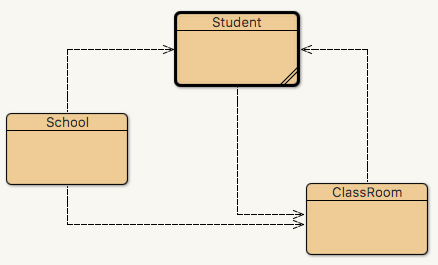

# 3.7 Άσκηση 2 Αντικειμενοστραφούς Προγραμματισμού {#Java} 
© Γιάννης Κωστάρας

---

[🏠](https://jkost.github.io) | [⬆️](../../README.md) | [◀️](../3.6-Exercise1/README.md)

---

[](3.7-Exercise2.ipynb)

Θα επιλύσουμε την άσκηση 2 του μαθήματος 3.2.

----
1) Να δημιουργήσετε μια κλάση ```ClassRoom``` η οποία θα μπορεί να δέχεται μέχρι 30 μαθητές τύπου ```Student```. Η τάξη θα διαθέτει επίσης ένα αναγνωριστικό το οποίο θα είναι ίδιο με το γνώρισμα _τάξη_ που ορίσατε για τον μαθητή στην προηγούμενη άσκηση. Ο χρήστης της κλάσης θα μπορεί να προσθέτει και να αφαιρεί μαθητές σ' αυτή. Τροποποιήστε το αντίστοιχο γνώρισμα τάξη του αντικειμένου ```Student``` να είναι τύπου ```ClassRoom```.

```java
jshell> ClassRoom b1 = new ClassRoom("B1", 30);
b1 ==> ClassRoom{name=Β1, size=30, numOfStudents=0}

jshell> b1.addStudent(ioannis);

jshell> ioannis.getClassRoom(); 
$1 ==> "B1"
    
jshell> b1
b1 ==> ClassRoom{name=Β1, size=30, numOfStudents=1}

jshell> b1.removeStudent(ioannis);

jshell> ioannis.getClassRoom();
$2 ==> null
    
jshell> b1
b1 ==> ClassRoom{name=Β1, size=30, numOfStudents=0}
```
----


Η κλάση ```Student``` από το προηγούμενο μάθημα:


```Java
//package school;
public class Student {

    private static final int MAX_SIZE = 20;
    private static final String NONE = "<Κενό>";
    private static final String NO_CLASSROOM = "--";
    private static final int CLASSROOM_NAME_LENGTH = 2;

    private static int amCounter = 0;
    
    private final int am;
    private String firstName = NONE;
    private String lastName = NONE;
    private int age = -1;  // 15-18
    private String classRoom = NO_CLASSROOM;

    public Student(String firstName, String lastName, int age) {
        am = ++amCounter;
        if (isNameValid(firstName)) {
            this.firstName = firstName.trim();
        }
        if (isNameValid(lastName)) {
            this.lastName = lastName.trim();
        }
        if (isAgeValid(age)) {
            this.age = age;
        }
    }

    public int getAm() {
        return am;
    }
    
    public String getFirstName() {
        return firstName;
    }

    public void setFirstName(String firstName) {
        this.firstName = isNameValid(firstName) ? firstName.trim() : NONE;
    }

    public String getLastName() {
        return lastName;
    }

    public void setLastName(String lastName) {
        this.lastName = isNameValid(lastName) ? lastName.trim() : NONE;
    }

    public int getAge() {
        return age;
    }

    public void setAge(int age) {
        this.age = isAgeValid(age) ? age : -1;
    }

    public String getClassRoom() {
        return classRoom;
    }

    public void setClassRoom(String classRoom) {
        this.classRoom = isClassRoomValid(classRoom) ? classRoom : NO_CLASSROOM;
    }

    @Override
    public String toString() {
        return "Student{" + "am=" + am + ", firstName=" + firstName + ", lastName=" + lastName + ", age=" + age + ", classRoom=" + classRoom + '}';
    }
    
    private boolean isAgeValid(int inAge) {
        return inAge >= 15 && inAge <= 18;
    }
    
    private boolean isNameValid(String name) {
        return !name.isBlank() && name.length() <= MAX_SIZE;
    }
    
    private boolean isClassRoomValid(String classRoom) {
        return !classRoom.isBlank() && classRoom.length() == CLASSROOM_NAME_LENGTH 
                && (classRoom.startsWith("Α") 
                || classRoom.startsWith("Β")
                || classRoom.startsWith("Γ"))
                && classRoom.charAt(1) >= '1'
                && classRoom.charAt(1) <= '9';
    }

}
```

## Υλοποίηση με το NetBeans
1. Ανοίξτε το έργο _School_ που δημιουργήσαμε στην προηγούμενη άσκηση από το μενού **File -> Open Project**  ή **File -> Open Recent Project** αν δεν το έχετε ήδη ανοικτό.
1. Κάντε δεξί κλικ πάνω στο πακέτο ```school``` στην καρτέλα **Projects** και επιλέξτε **New -> Java Class...**. Δώστε το όνομα της κλάσης να είναι ```ClassRoom``` και πατήστε **Finish**.

Η κλάση ```ClassRoom``` θα έχει τα εξής γνωρίσματα:

* όνομα/κωδικό τάξης (της μορφής π.χ. "Α2")
* μέγεθος τάξης (εξ' ορισμού τιμή 30 μαθητές)
* μαθητές που περιέχει η τάξη

Τα παραπάνω μεταφράζονται στα εξής (συνήθως τα γνωρίσματα μιας τάξης δεν αλλάζουν):

```java
private final String name;
private final int size;
private final Student[] students;
```
Δημιουργήστε τις μεθόδους κατασκευής όπως μάθαμε πιο πάνω. Αν δεν δώσουμε μέγεθος τάξης, θα λαμβάνει το εξ' ορισμού μέγεθος, 30 μαθητές. Το αποτέλεσμα θα πρέπει να είναι το παρακάτω:


```Java
//package school;
public class ClassRoom {
    private static final int DEFAULT_SIZE = 30;

    private final String name;
    private final int size;
    private Student[] students;

    public ClassRoom(String name, int size) {
        this.name = name;
        this.size = size;
        this.students = new Student[size];
    }

    public ClassRoom(String name) {
        this(name, DEFAULT_SIZE);
    }
}
```

Επόμενο βήμα η δημιουργία getters. Δημιουργήστε getters για τα πεδία ```name, size``` αλλά όχι για τη συστοιχία. Δημιουργήστε και την ```toString()``` για αυτά τα δυο πεδία.

Ας δούμε τι μεθόδους χρειάζεται να δημιουργήσουμε με βάση τα παραδείγματα που μας δίνει η άσκηση:

* μια μέθοδο ```addStudent()``` η οποία θα προσθέτει ένα μαθητή στην τάξη
* μια μέθοδο ```removeStudent()``` η οποία θα αφαιρεί ένα μαθητή από την τάξη
* μια μέθοδο ```removeAllStudents()``` η οποία θα αδειάζει την τάξη στο τέλος της χρονιάς

Ας ξεκινήσουμε από τις εύκολες μεθόδους:
```java
private int index = 0;
public void addStudent(Student student) {
    if (student != null && index < size) {
        students[index++] = student;
    }
}
```
Η μέθοδος ```addStudent()``` προσθέτει έναν μαθητή στη συστοιχία ```students``` αυξάνοντας κατάλληλα και την μεταβλητή ```index```.

Αντίστοιχα, η ```removeAllStudents()```, θέτει όλα τα στοιχεία της συστοιχίας ίσα με ```null``` και αρχικοποιεί την ```index```.
```java
public void removeAllStudents() {
    Arrays.fill(students, null);
    index = 0;
}
```

Η ```removeStudent()``` είναι πιο δύσκολη. θα πρέπει να αναζητήσουμε τον μαθητή που περνιέται ως παράμετρος στη συστοιχία μας, και στη συνέχεια να εφαρμόσουμε ότι μάθαμε στο μάθημα 2.3 για διαγραφή ενός στοιχείου ενός πίνακα. Καθώς τα στοιχεία μας δεν είναι ταξινομημένα, θα πρέπει να χρησιμοποιήσουμε μια μέθοδο αναζήτησης που υλοποιήσαμε στο μάθημα 2.4, π.χ. τη γραμμική αναζήτηση. Ας την ξαναγράψουμε ώστε να δουλεύει με μαθητές. Αυτό που θέλουμε είναι να βρούμε σε ποια θέση βρίσκεται ο μαθητής στον πίνακα. Αν τον βρούμε επιστρέφουμε την θέση του στον πίνακα, αλλιώς επιστρέφουμε -1:

```java
private int contains(Student[] students, int am) {
    for (int i = 0; i < students.length; i++) {
        Student student = students[i];
        if (student.getAm() == am) {
            return i;
        }
    }
    return -1;
}
```
Αφού βρούμε το μαθητή, θα πρέπει να τον διαγράψουμε από τον πίνακα, όπως μάθαμε στο μάθημα 2.3:
```java
private boolean remove(int indx) {
    if (indx < 0 || indx >= this.students.length) return false;
    Student[] newStudents = new Student[this.students.length - 1];
    // αντιγραφή από το 0 μέχρι το students[index-1]
    System.arraycopy(this.students, 0, newStudents, 0, indx);
    // αντιγραφή από students[index+1] μέχρι students[students.length-1]
    System.arraycopy(this.students, indx + 1, newStudents, indx, this.students.length - indx - 1);
    this.students = newStudents;
    index--;
    return true;
}
```
Δημιουργούμε έναν νέο πίνακα ```newStudents``` ο οποίος θα 'χει μέγεθος ένα στοιχείο λιγότερο από τον ```students```. Στη συνέχεια αντιγράφουμε στον ```newStudents``` όλα τα στοιχεία από τον ```students``` εκτός αυτού που θέλουμε να διαγράψουμε (και που δείχνει ο ```indx```). Στη συνέχεια, κάνουμε τον δείκτη ```students``` να δείχνει στον νέο αυτό πίνακα, και μειώνουμε την μεταβλητή ```index``` κατά ένα.

Μπορούμε τώρα να υλοποιήσουμε τη μέθοδο ```removeStudent()```:
```java
public void removeStudent(int am) {
    remove(contains(students, am));
}
```
Δεν ξεχνάμε να ενημερώσουμε και το πεδίο ```classRoom``` της κλάσης ```Student```.

Μπορούμε να δημιουργήσουμε και μια υπερφορτωμένη μέθοδο:
```java
public void removeStudent(Student student) {
    if (student != null) {
        removeStudent(student.getAm());
    }
}
```

Δεν πρέπει να ξεχάσουμε να ελέγξουμε αν τα ορίσματα που περνάμε περιέχουν έγκυρες τιμές (validation). Για το πεδίο ```students``` ο έλεγχος γίνεται ήδη στις διάφορες μεθόδους που προσθαφαιρούν μαθητές σ' αυτό. Παρατηρήστε ότι δεν εκθέτουμε στον εξωτερικό κόσμο πώς υλοποιούμε την αποθήκευση των μαθητών. Οι άλλες κλάσεις το μόνο που γνωρίζουν είναι τις δημόσιες μεθόδους ```addStudent(), removeStudent(), removeAllStudents()``` όπου δεν φαίνεται πουθενά ότι χρησιμοποιούμε μια συστοιχία.

Ο έλεγχος για τη ```size``` είναι παρόμοιος με τον έλεγχο για την ```age``` της ```Student```:
```java
private boolean isSizeValid(int inSize) {
    return inSize >= 20 && inSize <= DEFAULT_SIZE; // θεωρούμε ότι οι μεγαλύτερες τάξεις του σχολείου χωράνε μέχρι 30 παιδιά
}   
```
και χρησιμοποιείται στον constructor:
```java
this.size = isSizeValid(size) ? size : DEFAULT_SIZE;
```
Για το όνομα της κλάσης, θα πρέπει να χρησιμοποιήσουμε την ίδια μέθοδο ```isClassRoomValid()``` που γράψαμε στην ```Student``` (εδώ την μετονομάσαμε):

```java
private static final String NO_CLASSROOM = "--";
private static final int CLASSROOM_NAME_LENGTH = 2;

private boolean isClassRoomNameValid(String classRoom) {
    return classRoom != null && !classRoom.isBlank() 
            && classRoom.length() == CLASSROOM_NAME_LENGTH 
            && (classRoom.startsWith("Α") 
            || classRoom.startsWith("Β")
            || classRoom.startsWith("Γ"))
            && classRoom.charAt(1) >= '1'
            && classRoom.charAt(1) <= '9';
}    
```
και τη χρησιμοποιούμε επίσης στη μέθοδο κατασκευής:
```java
this.name = isClassRoomNameValid(name) ? name : NO_CLASSROOM;
```

Η κλάση ```ClassRoom```:


```Java
//package school;
import java.util.Arrays;

public class ClassRoom {

    private static final int DEFAULT_SIZE = 30;
    private static final String NO_CLASSROOM = "--";
    private static final int CLASSROOM_NAME_LENGTH = 2;    

    private final String name;
    private final int size;
    private Student[] students;
    private int index = 0;

    public ClassRoom(String name, int size) {
        this.name = isClassRoomNameValid(name) ? name : NO_CLASSROOM;
        this.size = isSizeValid(size) ? size : DEFAULT_SIZE;
        this.students = new Student[size];
    }

    public ClassRoom(String name) {
        this(name, DEFAULT_SIZE);
    }

    public String getName() {
        return name;
    }

    public int getSize() {
        return size;
    }

    public void addStudent(Student student) {
        if (student != null && index < size) {
            students[index++] = student;
        }
    }

    public void removeStudent(int am) {
        remove(contains(students, am));
    }

    public void removeStudent(Student student) {
        if (student != null) {
            removeStudent(student.getAm());
        }
    }

    public void removeAllStudents() {
        Arrays.fill(students, null);
        index = 0;
    }

    private int contains(Student[] students, int am) {
        for (int i = 0; i < students.length; i++) {
            Student student = students[i];
            if (student.getAm() == am) {
                return i;
            }
        }
        return -1;
    }

    private boolean remove(int indx) {
        if (indx < 0 || indx >= this.students.length) return false;
        Student[] newStudents = new Student[this.students.length - 1];
        // αντιγραφή από το 0 μέχρι το students[index-1]
        System.arraycopy(this.students, 0, newStudents, 0, indx);
        // αντιγραφή από students[index+1] μέχρι students[students.length-1]
        System.arraycopy(this.students, indx + 1, newStudents, indx, this.students.length - indx - 1);
        this.students = newStudents;
        index--;
        return true;
    }

    @Override
    public String toString() {
        return "ClassRoom{" + "name=" + name + ", size=" + size + ", numOfStudents=" + index + '}';
    }
    
    private boolean isSizeValid(int inSize) {
        return inSize >= 10 && inSize <= DEFAULT_SIZE;
    }    
    
    private boolean isClassRoomNameValid(String classRoom) {
        return classRoom != null && !classRoom.isBlank() 
                && classRoom.length() == CLASSROOM_NAME_LENGTH 
                && (classRoom.startsWith("Α") 
                || classRoom.startsWith("Β")
                || classRoom.startsWith("Γ"))
                && classRoom.charAt(1) >= '1'
                && classRoom.charAt(1) <= '9';
    }    
    
}
```

Σε αυτό το σημείο μπορούμε να τροποποιήσουμε την κλάση ```Student``` ώστε να χρησιμοποιεί την κλάση ```ClassRoom```:


```Java
//package school;
public class Student {

    private static final int MAX_SIZE = 20;
    private static final String NONE = "<Κενό>";

    private static int amCounter = 0;
    
    private final int am;
    private String firstName = NONE;
    private String lastName = NONE;
    private int age = -1;  // 15-18
    private ClassRoom classRoom;

    public Student(String firstName, String lastName, int age) {
        am = ++amCounter;
        if (isNameValid(firstName)) {
            this.firstName = firstName.trim();
        }
        if (isNameValid(lastName)) {
            this.lastName = lastName.trim();
        }
        if (isAgeValid(age)) {
            this.age = age;
        }
    }

    public int getAm() {
        return am;
    }
    
    public String getFirstName() {
        return firstName;
    }

    public void setFirstName(String firstName) {
        this.firstName = isNameValid(firstName) ? firstName.trim() : NONE;
    }

    public String getLastName() {
        return lastName;
    }

    public void setLastName(String lastName) {
        this.lastName = isNameValid(lastName) ? lastName.trim() : NONE;
    }

    public int getAge() {
        return age;
    }

    public void setAge(int age) {
        this.age = isAgeValid(age) ? age : -1;
    }

    public ClassRoom getClassRoom() {
        return classRoom;
    }

    void setClassRoom(ClassRoom classRoom) {
        this.classRoom = classRoom;
    }

    @Override
    public String toString() {
        return "Student{" + "am=" + am + ", firstName=" + firstName + ", lastName=" + lastName + ", age=" + age + ", classRoom=" + classRoom + '}';
    }
    
    private boolean isAgeValid(int inAge) {
        return inAge >= 15 && inAge <= 18;
    }
    
    private boolean isNameValid(String name) {
        return name != null && !name.isBlank() && name.length() <= MAX_SIZE;
    }

}
```

Ας δούμε τις αλλαγές. Ορίσαμε πλέον το πεδίο ```classRoom``` να είναι τύπου ```ClassRoom``` αντί για ```String```. Αυτό δημιούργησε μια σειρά από λάθη στο NetBeans τα οποία καλούμαστε να διορθώσουμε. Κατ' αρχήν τροποποιήσαμε κατάλληλα τις ```setClassRoom()``` και ```getClassRoom()```. Η ```isClassRoomValid()``` πλέον δεν χρειάζεται, μεταφέρθηκε στην ```ClassRoom```. Όταν περνάμε ένα όρισμα τύπου ```ClassRoom``` στην ```Student``` θεωρούμε ότι αυτό είναι έγκυρο, και ο μόνος έλεγχος που κάνουμε είναι ότι δεν είναι ```null```.

Το πρόγραμμά μας περιέχει ένα bug. Δεν ενημερώνουμε το πεδίο ```classRoom``` της ```Student``` όταν π.χ. ο μαθητής καταχωρείται σε μια τάξη ή όταν διαγράφεται από αυτήν.

Αυτό γίνεται στις μεθόδους ```addStudent(), removeStudent(), removeAllStudents()``` όπου δεν ξεχνάμε να ενημερώσουμε το πεδίο ```classRoom``` της ```Student```.


```Java
//package school;
import java.util.Arrays;

public class ClassRoom {

    private static final int DEFAULT_SIZE = 30;
    private static final String NO_CLASSROOM = "--";
    private static final int CLASSROOM_NAME_LENGTH = 2;    

    private final String name;
    private final int size;
    private Student[] students;
    private int index = 0;

    public ClassRoom(String name, int size) {
        this.name = isClassRoomNameValid(name) ? name : NO_CLASSROOM;
        this.size = isSizeValid(size) ? size : DEFAULT_SIZE;
        this.students = new Student[size];
    }

    public ClassRoom(String name) {
        this(name, DEFAULT_SIZE);
    }

    public String getName() {
        return name;
    }

    public int getSize() {
        return size;
    }

    public void addStudent(Student student) {
        if (student != null && index < size) {
            students[index++] = student;
            student.setClassRoom(this);
        }
    }

    public void removeStudent(int am) {
        int indx = contains(students, am);
        if (indx != -1) {
            Student student = students[indx];
            if (remove(indx)) {
                student.setClassRoom(null);
            }
        }
    }

    public void removeStudent(Student student) {
        if (student != null) {
            removeStudent(student.getAm());
        }
    }

    public void removeAllStudents() {
        for (Student student : students) {
            student.setClassRoom(null);
        }
        Arrays.fill(students, null);
        index = 0;
    }

    private int contains(Student[] students, int am) {
        for (int i = 0; i < students.length; i++) {
            Student student = students[i];
            if (student.getAm() == am) {
                return i;
            }
        }
        return -1;
    }

    private boolean remove(int indx) {
        if (indx < 0 || indx >= this.students.length) return false;
        Student[] newStudents = new Student[this.students.length - 1];
        // αντιγραφή από το 0 μέχρι το students[index-1]
        System.arraycopy(this.students, 0, newStudents, 0, indx);
        // αντιγραφή από students[index+1] μέχρι students[students.length-1]
        System.arraycopy(this.students, indx + 1, newStudents, indx, this.students.length - indx - 1);
        this.students = newStudents;
        index--;
        return true;
    }

    @Override
    public String toString() {
        return "ClassRoom{" + "name=" + name + ", size=" + size + ", numOfStudents=" + index + '}';
    }
    
    private boolean isSizeValid(int inSize) {
        return inSize >= 10 && inSize <= DEFAULT_SIZE;
    }    
    
    private boolean isClassRoomNameValid(String classRoom) {
        return classRoom != null && !classRoom.isBlank() 
                && classRoom.length() == CLASSROOM_NAME_LENGTH 
                && (classRoom.startsWith("Α") 
                || classRoom.startsWith("Β")
                || classRoom.startsWith("Γ"))
                && classRoom.charAt(1) >= '1'
                && classRoom.charAt(1) <= '9';
    }    
    
}
```

Ας δοκιμάσουμε τον κώδικά μας στην κλάση ```School```:


```Java
//package school;

public class School {
    private static final ClassRoom[] classRooms = { 
        new ClassRoom("Α1"), 
        new ClassRoom("Α2", 28), 
        new ClassRoom("Α3", 25), 
        new ClassRoom("Β1"), 
        new ClassRoom("Β2", 28), 
        new ClassRoom("Β3", 25), 
        new ClassRoom("Γ1"), 
        new ClassRoom("Γ2", 26), 
        new ClassRoom("Γ3", 22), 
    
    };

    public static void main(String[] args) {
        System.out.println("=== Create student ioannis ====");
        Student ioannis = new Student("Γιάννης", "Αντεκοτούμπο", 16);
        System.out.println("AM: " + ioannis.getAm());
        System.out.println("ClassRoom: " + ioannis.getClassRoom());
        
        System.out.println("\n=== Add student ioannis to classroom 'B1' ====");
        classRooms[3].addStudent(ioannis);
        System.out.println(ioannis.getClassRoom());
        System.out.println(ioannis);
        
        System.out.println("\n=== Create student aliki and add to classroom 'B1' ====");
        Student aliki = new Student("Αλίκη", "Βουγιουκλάκη", 17);
        classRooms[3].addStudent(aliki);
        System.out.println(aliki);
        System.out.println(classRooms[3]);

        System.out.println("\n=== Remove student ioannis from classroom 'B1' ====");
        classRooms[3].removeStudent(ioannis.getAm());
        System.out.println(ioannis);
        System.out.println(classRooms[3]);
    }
    
}
```

```Java
jshell> School.main(null);

    === Create student ioannis ====
    AM: 1
    ClassRoom: null
    
    === Add student ioannis to classroom 'B1' ====
    ClassRoom{name=Β1, size=30, numOfStudents=1}
    Student{am=1, firstName=Γιάννης, lastName=Αντεκοτούμπο, age=16, classRoom=ClassRoom{name=Β1, size=30, numOfStudents=1}}
    
    === Create student aliki and add to classroom 'B1' ====
    Student{am=2, firstName=Αλίκη, lastName=Βουγιουκλάκη, age=17, classRoom=ClassRoom{name=Β1, size=30, numOfStudents=2}}
    ClassRoom{name=Β1, size=30, numOfStudents=2}
    
    === Remove student ioannis from classroom 'B1' ====
    Student{am=1, firstName=Γιάννης, lastName=Αντεκοτούμπο, age=16, classRoom=null}
    ClassRoom{name=Β1, size=30, numOfStudents=1}
```

Μπορείτε να εξασκηθείτε πάνω στις αυτού του μαθήματος εδώ <a href="sandbox/school.html" target="_blank"></a>

Συγχαρητήρια αν φθάσατε μέχρι εδώ!

## Υλοποίηση με το BlueJ

1. Ανοίξτε το έργο ```School``` στο BlueJ από το μενού **Project -> Open Project** ή **Project -> Open Recent**.
1. Δημιουργήστε τις υπόλοιπες κλάσεις ```ClassRoom``` και ```School``` στο πακέτο ```school``` όπως περιγράψαμε για το NetBeans. Ενημερώστε και τον κώδικα της ```Student```.
1. Μεταγλωττίστε τες.
1. Δεξί κλικ στην κλάση ```School``` και εκτέλεση της ```main()```. Θα πρέπει να δείτε το ίδιο αποτέλεσμα όπως και στην περίπτωση εκτέλεσης στο NetBeans.



**Εικόνα 3.7.1** _Διάγραμμα κλάσεων εφαρμογής σχολείου στο BlueJ_

Παρατηρήστε τις εξαρτήσεις μεταξύ των κλάσεων. Πώς προκύπτουν;

* Η κλάση ```Student``` έχει το πεδίο ```ClassRoom classRoom```. Αυτή είναι η σχέση εξάρτησης (dependency) ```Student ---> ClassRoom```. Πιο σωστά, το BlueJ θα έπρεπε να την έδειχνε ως σχέση συσχέτισης (association) με συνεχόμενη γραμμή.
* Η κλάση ```ClassRoom``` έχει το πεδίο ```Student[] students```. Αυτή είναι η σχέση εξάρτησης (dependency) ```ClassRoom ---> Student```. Πιο σωστά, το BlueJ θα έπρεπε να την έδειχνε ως σχέση συσσωμάτωσης (aggregation) που σημαίνει ότι μια τάξη περιέχει 1 ή περισσότερους μαθητές.
* Η κλάση ```School``` έχει το πεδίο ```ClassRoom[] classRooms```. Αυτή είναι η σχέση εξάρτησης (dependency) ```School ---> ClassRoom```. Πιο σωστά, το BlueJ θα έπρεπε να την έδειχνε ως σχέση συσσωμάτωσης (aggregation) που σημαίνει ότι ένα σχολείο περιέχει 1 ή περισσότερες τάξεις. Επίσης, η κλάση ```School``` χρησιμοποιεί στη μέθοδο ```main()``` και αντικείμενα της κλάσης ```Student```. Αυτή είναι η σχέση εξάρτησης (dependency) ```School ---> Student```. 

Παρατηρούμε ότι οι κλάσεις είναι πολύ εξαρτημένες η μια από την άλλη. Αυτό ονομάζεται _υψηλή σύζευξη (high coupling)_ και είναι κάτι που θα πρέπει να αποφεύγεται. Επίσης, η ```Student``` εξαρτάται από την ```ClassRoom``` και η ```ClassRoom``` από την ```Student```. Αυτό ονομάζεται _κυκλική εξάρτηση (cyclic dependency)_ και δεν είναι ιδανικό.

---

[🏠](https://jkost.github.io) | [⬆️](../../README.md) | [◀️](../3.6-Exercise1/README.md)

---
