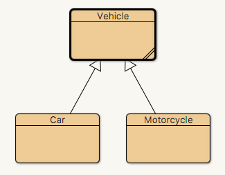
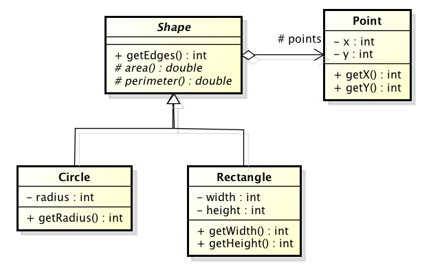
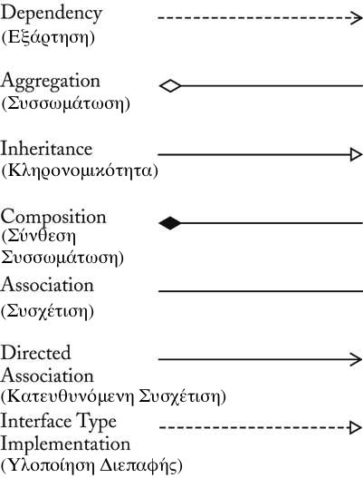
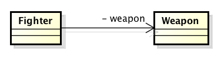
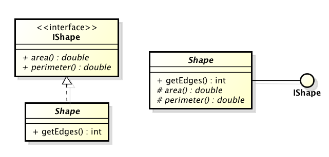
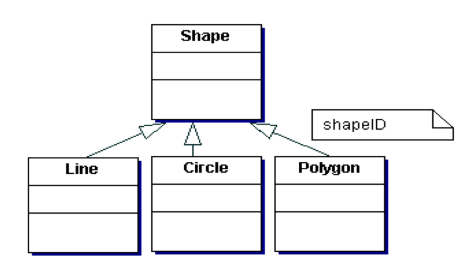

# 4.1 Κληρονομικότητα {#Java} 
© Γιάννης Κωστάρας

---

[Δ](../../README.md) | [>](../4.2-Polymorphism/README.md)

---

[](4.1-Inheritance.ipynb)

### Μαθησιακοί στόχοι
Σε αυτήν την ενότητα θα μάθουμε:

* τι είναι η κληρονομικότητα (inheritance) στον αντικειμενοστραφή προγραμματισμό
* για τις αφαιρετικές κλάσεις (abstract classes)
* για τις σφραγισμένες κλάσεις (sealed classes)
* για την κλάση ```Object```
* για τις διεπαφές (interfaces)
* για τις επισημειώσεις (annotations)

## Κληρονομικότητα

Άλλο ένα "όπλο" που έχουν οι προγραμματιστές αντικειμενοστραφών προγραμμάτων στο "οπλοστάσιό" τους για τη δημιουργία πιο κατανοητού και ευκολότερα συντηρήσιμου κώδικα είναι η κληρονομικότητα (inheritance). Επιτρέπει την επαναχρησιμοποίηση κώδικα (αρχή "Μην επαναλαμβάνεσαι" - "Don't Repeat Yourself" ή DRY principle).

Ας δούμε ένα παράδειγμα. Το παιχνίδι αγώνων αυτοκινήτου πήγε καλά οπότε ήρθε νέα απαίτηση να το επεκτείνουμε να υποστηρίζει και μοτοσυκλέτες.

Θα δημιουργήσουμε μια νέα κλάση ```Motorcycle``` βασισμένη στην τελευταία έκδοση της κλάσης ```Car``` από τα μαθήματα της προηγούμενης εβδομάδας, την οποία ξαναδείχνουμε παρακάτω:
```java
public class Car { // κλάση
  // ιδιότητες/γνωρίσματα
  private String model;
  private int maxSpeed;
  private int ccm;
  private int speed = 0;
  // μέθοδος δημιουργίας αντικειμένων - κατασκευαστής
  public Car(String m, int s, int c) {
    model = m; maxSpeed = s; ccm = c;
  }
  // ενέργειες/μέθοδοι
  public void accelerate() {
     if (speed <= maxSpeed - 10)
        speed+=10;
  }
  public void decelerate() {
     if (speed >= 10)
        speed-=10;
  }  
  public String getModel() {
  	return model;
  }
  public void setModel(String m) {
    this.model = m;
  }
  public int getMaxSpeed() {
  	return maxSpeed;
  }
  public void setMaxSpeed(int ms) {
    this.maxSpeed = ms;
  }        
  public int getCcm() {
  	return ccm;
  }
  public void setCcm(int ccm) {
    this.ccm = ccm;
  }      
  public int getSpeed() {
  	return speed;
  }
  public String toString() {
    return "Car {model=" + model + ", maxSpeed=" + maxSpeed + ", ccm=" + ccm + ", speed=" + speed  + "}";   
  }
}
```
```java
public class Motorcycle { // κλάση
  // ιδιότητες/γνωρίσματα
  private String model;
  private int maxSpeed;
  private int ccm;
  private int speed = 0;
  // μέθοδος δημιουργίας αντικειμένων - κατασκευαστής
  public Motorcycle(String m, int s, int c) {
    model = m; maxSpeed = s; ccm = c;
  }
  // ενέργειες/μέθοδοι
  public void accelerate() {
     if (speed <= maxSpeed - 20)
        speed+=20;
  }
  public void decelerate() {
     if (speed >= 20)
        speed-=20;
  }  
  public String getModel() {
  	return model;
  }
  public void setModel(String m) {
    this.model = m;
  }
  public int getMaxSpeed() {
  	return maxSpeed;
  }
  public void setMaxSpeed(int ms) {
    this.maxSpeed = ms;
  }        
  public int getCcm() {
  	return ccm;
  }
  public void setCcm(int ccm) {
    this.ccm = ccm;
  }      
  public int getSpeed() {
  	return speed;
  }
  public String toString() {
    return "Motorcycle {model=" + model + ", maxSpeed=" + maxSpeed + ", ccm=" + ccm + ", speed=" + speed  + "}";   
  }
}

jshell> Motorcycle honda = new Motorcycle("Honda CBR 650", 250, 649);
honda ==> Motorcycle {model=Honda CBR 650, maxSpeed=250, ccm=649, speed=0}
```
Τι παρατηρείτε; Οι δυο κλάσεις περιέχουν πλέον πολύ διπλότυπο (επαναλαμβανόμενο) κώδικα. Αν θελήσουμε να κάνουμε μια αλλαγή ή διόρθωση στην κλάση ```Car``` θα πρέπει να επαναλάβουμε την αλλαγή/διόρθωση και στην κλάση ```Motorcycle```. Κι αν αργότερα μας ζητηθεί να επεκτείνουμε το πρόγραμμα ώστε να περιλαμβάνει και ταχύπλοα και αεροπλάνα, τότε θα πρέπει να κάνουμε την ίδια αλλαγή 4 φορές! Κάτι δεν πάει καλά λοιπόν. Η αντιγραφή/επικόλληση κώδικα δεν είναι καλή ιδέα και είναι ενάντια στο DRY principle. 

Μια λύση στο πρόβλημα του επαναλαμβανόμενου κώδικα, αν και όχι πάντα η καλύτερη, είναι η κληρονομικότητα. Δημιουργούμε μια νέα κλάση ```Vehicle``` που περιέχει τα κοινά στοιχεία των ```Car, Motorcycle``` και κάνουμε τις ```Car, Motorcycle``` να κληρονομούν απ' αυτήν. Η ```Vehicle``` ονομάζεται υπερκλάση (superclass) ή γονική κλάση και οι ```Car, Motorcycle``` υποκλάσεις (subclass) ή κλάσεις παιδιά.

Δοκιμάστε να κάνετε αυτά που περιγράφουμε παρακάτω στο BlueJ ή/και στο NetBeans.

```java
public class Vehicle { // κλάση
  // ιδιότητες/γνωρίσματα
  protected String model;
  protected int maxSpeed;
  protected int ccm;
  protected int speed = 0;
  // μέθοδος δημιουργίας αντικειμένων - κατασκευαστής
  public Vehicle(String m, int s, int c) {
    model = m; maxSpeed = s; ccm = c;
  }
  // ενέργειες/μέθοδοι
  public String getModel() {
  	return model;
  }
  public void setModel(String m) {
    this.model = m;
  }
  public int getMaxSpeed() {
  	return maxSpeed;
  }
  public void setMaxSpeed(int ms) {
    this.maxSpeed = ms;
  }        
  public int getCcm() {
  	return ccm;
  }
  public void setCcm(int ccm) {
    this.ccm = ccm;
  }      
  public int getSpeed() {
  	return speed;
  }
  public String toString() {
    return "Vehicle {model=" + model + ", maxSpeed=" + maxSpeed + ", ccm=" + ccm + ", speed=" + speed  + "}";   
  }
}
```
1. Δημουργήσαμε μια νέα κλάση ```Vehicle``` και αντιγράψαμε σ' αυτήν τα περιεχόμενα μιας από τις κλάσεις ```Car``` ή ```Motorcycle```.
1. Μετονομάσαμε την κλάση σε ```Vehicle``` καθώς και τον constructor και το κείμενο στην ```toString()```. 
1. Αλλάξαμε την πρόσβαση στα γνωρίσματα από ```private``` σε ```protected``` ώστε να μπορούν να κληρονομηθούν από τις υποκλάσεις.
1. Διαγράψαμε τις δυο μεθόδους ```accelerate(), decelerate()``` επειδή έχουν διαφορετική υλοποίηση στις υποκλάσεις.

Δηλώνουμε ότι οι κλάσεις ```Car, Motorcycle``` κληρονομούν από την ```Vehicle``` με τη δεσμευμένη λέξη ```extends``` στον ορισμό της υποκλάσης. Στο BlueJ μπορείτε να πατήσετε στο κουμπί με το βέλος της κληρονομικότητας (inheritance) και να επιλέξετε πρώτα την υποκλάση (π.χ. ```Car```) και στη συνέχεια την υπερκλάση (```Vehicle```).

Θα πρέπει να δείτε το παρακάτω (με διαγραμμισμένες τις κλάσεις ```Car, Motorcycle``` επειδή υπάρχουν λάθη μεταγλώττισης).



**Εικόνα 4.1.1** _Κληρονομικότητα κλάσεων στο BlueJ_

Θα πρέπει να κάνουμε κάποιες αλλαγές στις δυο κλάσεις για να διαγράψουμε τον κοινό κώδικα που έχουμε ορίσει στην ```Vehicle```. 

1. Διαγράψτε όλα τα πεδία από την κλάση ```Car```. Αυτά έχουν ήδη οριστεί στην ```Vehicle``` ως ```protected``` οπότε κληρονομούνται από τις υποκλάσεις.
1. Υπάρχει λάθος μεταγλώττισης στον constructor. Για να δημιουργηθεί ένα αντικείμενο της υποκλάσης θα πρέπει πρώτα να κληθεί ο constructor της υπερκλάσης. Αυτό το πετυχαίνουμε αντικαθιστώντας το σώμα της μεθόδου κατασκευής της ```Car``` με:
   ```java
   super(m, s, c);
   ```
1. Διαγράψτε όλες τις άλλες μεθόδους εκτός από τις ```accelerate(), decelerate()``` και ```toString()```.
1. Επαναλάβετε τα παραπάνω βήματα για την ```Motorcycle```.

Το αποτέλεσμα φαίνεται παρακάτω:
```java
public class Car extends Vehicle { // κλάση
     // μέθοδος δημιουργίας αντικειμένων - κατασκευαστής
    public Car(String m, int s, int c) {
        super(m, s, c);
    }
    // ενέργειες/μέθοδοι
    public void accelerate() {
        if (speed <= maxSpeed - 10)
            speed+=10;
    }

    public void decelerate() {
        if (speed >= 10)
            speed-=10;
    }  

    public String toString() {
        return "Car {model=" + model + ", maxSpeed=" + maxSpeed + ", ccm" + ccm + ", speed=" + speed  + "}";   
    }
}
```
```java
public class Motorcycle extends Vehicle { // κλάση
  // ιδιότητες/γνωρίσματα
  // μέθοδος δημιουργίας αντικειμένων - κατασκευαστής
  public Motorcycle(String m, int s, int c) {
    super(m, s, c);
  }
  // ενέργειες/μέθοδοι
  public void accelerate() {
     if (speed <= maxSpeed - 20)
        speed+=20;
  }
  public void decelerate() {
     if (speed >= 20)
        speed-=20;
  }  
  public String toString() {
    return "Motorcycle {model=" + model + ", maxSpeed=" + maxSpeed + ", ccm=" + ccm + ", speed=" + speed  + "}";   
  }
}
```
Τα κοινά στοιχεία δυο ή περισσοτέρων παρόμοιων κλάσεων μπορούν να οριστούν σε μια κοινή _υπερκλάση (superclass)_. Μία _υποκλάση (subclass)_ μπορεί να κληρονομήσει όλα τα "επιτρεπτά" γνωρίσματα και μεθόδους από τους "προγόνους" της (δηλ. όσα είναι δηλωμένα ως ```protected``` και ```public```) εκτός από τις μεθόδους κατασκευής. Αν οι κλάσεις βρίσκονται στο ίδιο package, τότε και μέλη με προσβασιμότητα πακέτου είναι διαθέσιμα στην κλάση παιδί. Η σχέση μεταξύ μιας υπερκλάσης και μιας υποκλάσης είναι σχέση τύπου "ΕΊΝΑΙ (IS-A)".

Μια υποκλάση μπορεί να ορίσει νέα γνωρίσματα και μεθόδους, μπορεί να υπερφορτώσει υφιστάμενες μεθόδους (overloading) ή ακόμα και να υπερσκελίσει (επανακαθορίσει, υπερκαλύψει) υφιστάμενες μεθόδους (overriding). Όλες οι κλάσεις στη Java κληρονομούν από την κλάση ```Object```.

Η ```super()``` χρησιμοποιείται:

* για να καλέσει τον constructor της υπερκλάσης καθώς αυτοί δεν κληρονομούνται. Στην περίπτωση αυτή πρέπει να είναι η πρώτη εντολή στον κώδικα της μεθόδου κατασκευής της υποκλάσης.
* για να καλέσει μία μέθοδο της υπερκλάσης

Η κλήση της μεθόδου κατασκευής μιας υποκλάσης καλεί τις μεθόδους κατασκευής όλων των υπερκλάσεων αυτής.

```java
class Person {
   public Person() {
      System.out.println("(1) Person's no-arg constructor");
   }
}

class Student extends Person {
	public Student() {
		System.out.println("(2) Student's no-arg constructor");
	}
}

jshell> new Student()
(1) Person's no-arg constructor
(2) Student's no-arg constructor
```
Στο πιο πάνω παράδειγμα βλέπουμε ότι παρόλο που ο constructor της κλάσης ```Student``` δεν καλεί την ```super```, η εξ'ορισμού μέθοδος κατασκευής (default constructor) της υπερκλάσης καλείται ούτως ή άλλως. 

Όπως έχουμε ήδη πει, αν δεν ορίσουμε κάποιον constructor σε μια κλάση, τότε δημιουργείται αυτόματα ο no argument constructor, διαφορετικά αν ορίσουμε έναν constructor, δε δημιουργείται no argument constructor. Αυτό έχει ως συνέπεια κώδικας όπως ο παρακάτω να μην μεταγλωττίζεται καθώς ο εξ'ορισμού no argument constructor της ```Carnivor``` δεν βρίσκει να καλέσει no argument constructor στην υπερκλάση. Από τη στιγμή που ορίσαμε constructor στην ```Animal```, δεν δημιουργείται η εξ'ορισμού μέθοδος κατασκευής χωρίς παραμέτρους. Καθώς όμως δεν ορίσαμε constructor στην ```Carnivor```, δημιουργείται σ' αυτήν no argument constructor, ο οποίος θα προσπαθήσει να καλέσει τον no argument constructor της ```Animal```, δεν τον βρίσκει οπότε έχουμε το παρακάτω λάθος μεταγλώττισης.

```java
jshell> class Animal {
   public Animal(String name) {
      //...
   }
}

jshell> public class Carnivor extends Animal {}
|  Error:
|  constructor Animal in class Animal cannot be applied to given types;
|    required: java.lang.String
|    found:    no arguments
|    reason: actual and formal argument lists differ in length
|  public class Carnivor extends Animal {}
|         ^
|  created class Carnivor, however, it cannot be referenced until this error is corrected: 
|      constructor Animal in class Animal cannot be applied to given types;
|        required: java.lang.String
|        found:    no arguments
|        reason: actual and formal argument lists differ in length
|      public class Carnivor extends Animal {}
|             ^

```
### Επισημειώσεις (Annotations)
Το ```@Override``` είναι μια _επισημείωση (annotation)_ η οποία χρησιμοποιείται από τον μεταγλωττιστή για να επιβεβαιώσει ότι υπερκαλύπτουμε (override) τη σωστή μέθοδο, διαφορετικά ο μεταγλωττιστής εμφανίζει λάθος μεταγλώττισης (```method does not override or implement a method```). Η γλώσσα διαθέτει κι άλλες τέτοιες επισημειώσεις όπως:

* ```@deprecated```: δηλώνει ότι η μέθοδος/κλάση/γνώρισμα κλπ. δεν εγκρίνεται προς χρήση πλέον (είτε γιατί υπάρχει μια καλύτερη υλοποίηση, είτε γιατί η υλοποίησή της ήταν λάθος, είτε γιατί μπορεί να διαγραφεί ή να είναι ασύμβατη σε μελλοντικές εκδόσεις). Ο μεταγλωττιστής παράγει προειδοποιήσεις (warnings) όταν χρησιμοποιείται. Π.χ. ```@deprecated(since="9", forRemoval=true)``` δηλώνει ότι το στοιχείο αυτό (μέθοδος/κλάση/γνώρισμα κλπ.) έχει γίνει παρωχημένο από την έκδοση 9 της Java και ότι πρόκειται να διαγραφεί στο μέλλον
* ```@SuppressWarnings```: προτρέπει τον μεταγλωττιστή να μην εμφανίζει προειδοποιήσεις (warnings) κατά τη μεταγλώττιση, π.χ. ```@SuppressWarnings("unchecked")``` 

### Αρχή της Υποκατάστασης (Substitution Principle)
Η _Αρχή της Υποκατάστασης (Substitution Principle)_ μας λέει ότι όταν περιμένουμε ένα αντικείμενο μιας κλάσης, μπορούμε να παρέχουμε και μια οποιανδήποτε υπο-κλάσης αυτής της κλάσης:

**Αρχή της Υποκατάστασης (Substitution Principle)**: _σε μια μεταβλητή μιας δοθείσας κλάσης μπορεί να αποθηκευθεί μια τιμή μιας οποιασδήποτε υπο-κλάσης αυτής της κλάσης, και μια μέθοδος με μια παράμετρο μιας δοθείσας κλάσης μπορεί να κληθεί με όρισμα μια οποιαδήποτε υποκλάση αυτής της κλάσης._

Με βάση την αρχή αυτή μπορούμε να γράψουμε:

```java
jshell> Vehicle v = new Car("Subaru Impreza", 180, 1600);
v ==> Car {model=Subaru Impreza, maxSpeed=180, ccm1600, speed=0}
```
Δεν μπορούμε όμως να γράψουμε το ανάποδο.
```java
jshell> Car c = new Vehicle("Subaru Impreza", 180, 1600);
|  Error:
|  incompatible types: Vehicle cannot be converted to Car
|  Car c = new Vehicle("Subaru Impreza", 180, 1600);
|          ^--------------------------------------^
```
Αν δε θέλουμε να επιτρέψουμε να μπορούν να δημιουργηθούν υποκλάσεις μιας κλάσης (δηλ. δε θέλουμε να μπορεί να κληρονομηθεί) τότε τη δηλώνουμε ως ```final``` (π.χ. ```public final class Car```). 

Επίσης, αν δε θέλουμε να μπορούν να υπερκαλυφθούν (overriden) οι μέθοδοι μιας κλάσης, τότε τις δηλώνουμε ```final```, π.χ.:

```java
public final int getEdges() { // δεν μπορεί να υπερκαλυφθεί από τις υποκλάσεις
   return this.points.length;
}
```
Εξασκηθείτε στις παραπάνω κλάσεις εδώ <a href="sandbox/vehicle.html" target="_blank"></a>.

### Σειρά εκτέλεσης υπερσκελισμένης μεθόδου στον constructor
Ένα συχνό λάθος είναι όταν καλούμε μια υπερκαλυμμένη (overridable) μέθοδο στο σώμα της μεθόδου κατασκευής (constructor). Ας δούμε ένα παράδειγμα:

```java
class Point {
  protected final int x, y;

  public Point(int x, int y) {  // 3
	  this.x = x;  
	  this.y = y;
	  print();  // 4
  }

  public int getX() {
	  return this.x;
  }

  public int getY() {
	  return this.y;
  } 

  public void print() {
  	System.out.println("{x=" + this.x + ", y=" + this.y + "}");
  }
}

class ColouredPoint extends Point {
	private Color color = null;
	
	public ColouredPoint(int x, int y, Color color) {  // 1
		super(x, y);  // 2
		this.color = color;
	}
	
	public Color getColor() {
		return color;
	}

  	public void print() {  // 5
  		System.out.println("{x=" + this.x + ", y=" + this.y + ", color=" + this.color + "}");
  	}
}
```

Αν εκτελέσουμε τον παραπάνω κώδικα:

```java
jshell> Point p = new Point(1,1)
{x=1, y=1}
p ==> Point@28c97a5

jshell> Point cp = new ColouredPoint(1,2,Color.BLACK)
{x=1, y=2, color=null}
cp ==> ColouredPoint@61e4705b
```
1. Καλείται η μέθοδος κατασκευής της ColouredPoint
2. Με τη σειρά της καλεί την μέθοδο κατασκευής της υπερκλάσης
3. Καλείται ο constructor της ```Point``` 
4. Ο δε constructor της ```Point``` καλεί την μέθοδο ```print()``` της υποκλάσης 
5. Καλείται η ```print()``` της υποκλάσης η οποία με τη σειρά της τυπώνει την τιμή της ```color``` η οποία δεν έχει προλάβει ν' αρχικοποιηθεί ακόμα. (Το γιατί συμβαίνει αυτό θα το εξηγήσουμε στο επόμενο μάθημα).

Το πρόβλημα διορθώνεται είτε αν αποφύγουμε να καλέσουμε την υπερκαλυμμένη μέθοδο ```print()``` στον constructor της ```Point``` είτε αν δηλώσουμε την ```print()``` ως ```final``` ώστε να μην μπορεί να υπερκαλυφθεί.

## Αφαιρετικές/Ιδεατές Κλάσεις (Abstract class)
Η κλάση ```Vehicle``` είναι αφαιρετική κλάση, με την έννοια ότι δεν έχει νόημα να δημιουργήσουμε αντικείμενα απ' αυτήν, ενώ έχει νόημα να δημιουργήσουμε αντικείμενα των υποκλάσεών της ```Car``` και ```Motorcycle```. Μπορούμε λοιπόν να δηλώσουμε την κλάση ```Vehicle``` ως ```abstract``` και έτσι να εμποδίσουμε την απευθείας δημιουργία αντικειμένων τύπου ```Vehicle```. 

Μια αφαιρετική κλάση μπορεί να περιλαμβάνει αφαιρετικές μεθόδους, δηλ. μεθόδους που δεν έχουν σώμα υλοποίησης παρά μόνο ορισμό. Την υλοποίηση των αφαιρετικών μεθόδων την αναλαμβάνουν οι υποκλάσεις, οι οποίες υποχρεούνται να παρέχουν μια υλοποίηση για τις αφαιρετικές μεθόδους που κληρονομούν, διαφορετικά πρέπει να δηλωθούν κι αυτές ως ```abstract```.

Συνοπτικά λοιπόν, μια κλάση η οποία περιλαμβάνει έστω και μια «αφαιρετική» μέθοδο, καθίσταται επίσης αφαιρετική και πρέπει να δηλωθεί ως αφαιρετική (abstract). Δε μπορούμε να δημιουργήσουμε αντικείμενα μιας αφαιρετικής κλάσης εκτός κι αν παρέχουμε μια υλοποίηση όλων των αφαιρετικών μεθόδων της. Μια κλάση που κληρονομεί από μια αφαιρετική κλάση θα πρέπει να υλοποιήσει όλες τις αφαιρετικές μεθόδους της υπερκλάσης, διαφορετικά ο μεταγλωτιστής επιβάλλει να οριστεί και η υποκλάση ως αφαιρετική.

Παρακάτω δηλώνουμε την κλάση ```Vehicle``` ως ```abstract``` καθώς και δυο ```abstract``` μεθόδους, τις ```accelerate(), decelerate()```:

```java
public abstract class Vehicle { // κλάση
  // ιδιότητες/γνωρίσματα
  protected String model;
  protected int maxSpeed;
  protected int ccm;
  protected int speed = 0;
  // μέθοδος δημιουργίας αντικειμένων - κατασκευαστής
  public Vehicle(String m, int s, int c) {
    model = m; maxSpeed = s; ccm = c;
  }
  // ενέργειες/μέθοδοι
  public String getModel() {
  	return model;
  }
  public void setModel(String m) {
    this.model = m;
  }
  public int getMaxSpeed() {
  	return maxSpeed;
  }
  public void setMaxSpeed(int ms) {
    this.maxSpeed = ms;
  }        
  public int getCcm() {
  	return ccm;
  }
  public void setCcm(int ccm) {
    this.ccm = ccm;
  }      
  public int getSpeed() {
  	return speed;
  }
  public abstract void accelerate();
  public abstract void decelerate();  
    
  public String toString() {
    return "Vehicle {model=" + model + ", maxSpeed=" + maxSpeed + ", ccm=" + ccm + ", speed=" + speed  + "}";   
  }
}
```
```java
jshell> Vehicle v = new Vehicle("Abstract Vehicle", 100, 1000); 
|  Error:
|  Vehicle is abstract; cannot be instantiated
|  Vehicle v = new Vehicle("Abstract Vehicle", 100, 1000);
|              ^----------------------------------------^
```
Παρατηρούμε ότι δεν μπορούμε ν' αρχικοποιήσουμε μια abstract κλάση.

```Abstract``` κλάσεις και μέθοδοι αναπαρίστανται με πλάγια γραφή στη UML. Στο παρακάτω UML διάγραμμα κλάσεων, η ```Shape``` και οι μέθοδοι ```area()``` και ```perimeter()``` έχουν δηλωθεί ως abstract.



**Εικόνα 4.1.2** _Παράδειγμα ιεραρχίας κλάσεων στη UML_

```java
record Point(int x, int y) {}

public abstract class Shape {   
  protected final Point[] points;
 
  Shape(int edges) {
     this.points = new Point[edges];
  }  

  Shape(Point... points) {
     this.points = points;
  }

  public int getEdges() {
     return this.points.length;
  }
 
  protected abstract double area();

  protected abstract double perimeter();
}

public class Circle extends Shape {  
  private final int radius;

  Circle() {
    super(1);
    this.radius = 1;
  }  

  Circle(Point center, int radius) {
    super(center);
    this.radius = radius;
  }    
  
  public int getRadius() {
    return radius;
  }
    
  public Point getCenter() {
    return points[0];   
  }

  @Override
  public double area() {
      return Math.PI * (radius * radius);
  } 

  @Override
  public double perimeter() {
    return Math.PI * 2*radius;
  } 
}

public class Rectangle extends Shape {  
  private int width, height; 

  Rectangle(int width, int height) {
    super(1);
    this.width = width;
    this.height = height;
  }  

  Rectangle(Point upperLeft, int width, int height) {
    super(upperLeft);
    this.width = width;
    this.height = height;
  }
  
  public int getWidth() {
    return width;
  }
  
  public int getHeight() {
    return height;
  }

  @Override
  public double area() {
      return width * height;
  } 
  
  @Override
  public double perimeter() {
    return 2*width + 2*height;
  }  
}

public class Triangle extends Shape {

    Triangle(Point... points) {
        super(points);
    }

    public Point[] getPoints() {
        return points;
    }
    
    // see https://tinyurl.com/msfdtjme
    private double length(Point p1, Point p2) {
        return Math.sqrt((p2.x() - p1.x()) * (p2.x() - p1.x()) + (p2.y() - p1.y()) * (p2.y() - p1.y()));
    }
    
    // see https://www.ypologismos.gr/emvadon-trigonou-xerontas-3-pleyres-typos-hrona/
    @Override
    public double area() {
        double s = perimeter()/2;
        double a = length(points[0], points[1]);
        double b = length(points[1], points[2]);
        double c = length(points[2], points[0]);
        return Math.sqrt(s*(s-a)*(s-b)*(s-c));
    }

    // https://www.ypologismos.gr/emvadon-trigonou-xerontas-3-pleyres-typos-hrona/
    @Override
    public double perimeter() {
        return length(points[0], points[1]) + length(points[1], points[2]) + length(points[2], points[0]);
    }
}
```

Η σχέση μεταξύ των κλάσεων ```Shape```, ```Circle, Rectangle``` και ```Triangle``` ονομάζεται _γενίκευση (generalization)_ η οποία είναι μια σχέση τύπου _είναι (is a)_.

Εξασκηθείτε στις παραπάνω κλάσεις εδώ <a href="sandbox/shape.html" target="_blank"></a>.

### Σχέσεις μεταξύ κλάσεων

Στο παραπάνω διάγραμμα βλέπουμε μια ακόμα σχέση μεταξύ κλάσεων, την _συσσωμάτωση (aggregation)_ η οποία είναι μια σχέση τύπου _ανήκει (owns)_. Η σχέση αυτή δηλώνει ότι η κλάση ```Shape``` περιλαμβάνει μια συλλογή από σημεία (```Points```) τα οποία τα αποθηκεύει στην ```protected``` μεταβλητή ```points```.

Όπως μπορείτε να δείτε στην Εικόνα 3.3.5 του μαθήματος 3.3 της προηγούμενης εβδομάδας (το οποίο επαναλαμβάνεται παρακάτω)



**Εικόνα 3.3.5.** _Σχέσεις μεταξύ κλάσεων στα διαγράμματα κλάσεων UML_

η UML υποστηρίζει διάφορους τύπους σχέσεων μεταξύ κλάσεων. Είδαμε τη _συσσωμάτωση (aggregation)_ αλλά υπάρχει και η _σύνθετη συσσωμάτωση (composite aggregation ή composition)_ (σχέση τύπου _περιέχει (is part of)_). Η διαφορά τους είναι ότι στη δεύτερη περίπτωση, αν καταστραφεί το αντικείμενο που περιέχει τη συλλογή των συσσωματωμένων αντικειμένων, τότε καταστρέφονται και τα συσσωματωμένα αντικείμενα, ενώ στην περίπτωση της απλής συσσωμάτωσης, τα συσσωματωμένα αντικείμενα παραμένουν και μετά την καταστροφή του αντικειμένου που τα περιέχει και μπορούν να επαναχρησιμοποιηθούν από άλλα αντικείμενα. Π.χ. αν καταστραφεί ένα αντικείμενο τύπου ```Rectangle``` το οποίο περιέχει ένα αντικείμενο τύπου ```Point``` για την πάνω αριστερά κορυφή του, τότε ανάλογα με το αν η εφαρμογή μας υποστηρίζει το ```Point``` ως σχήμα ή όχι, η σχέση θα μπορεί να είναι _aggregation_ (αν υποστηρίζει) ή _composite aggregation_ (αν δεν υποστηρίζει οπότε το σημείο θα πρέπει να καταστραφεί μαζί με το αντικείμενο). 

**Σημείωση** _Η σύνθετη συσσωμάτωση υλοποιείται ως εμφωλιασμένη κλάση (ώστε αντικείμενά της να καταστρέφονται όταν καταστρέφονται και τα αντικείμενα που τις περιέχουν) ενώ η συσσωμάτωση ως στατική εμφωλιασμένη κλάση ώστε να μπορεί να υπάρχει και όταν αντικείμενα της κλάσης που την περιέχουν παύσουν να υπάρχουν. Δεν θα μιλήσουμε για εμφωλιασμένες κλάσεις σε αυτό το μάθημα_.
Η σχέση _συσχέτιση (association)_ χρησιμοποιείται όταν μια κλάση σχετίζεται με μια άλλη, δηλ. την έχει ως γνώρισμά της (σχέση _has a_).

Η σχέση _συσχέτιση (association)_ χρησιμοποιείται όταν μια κλάση σχετίζεται με μια άλλη, δηλ. την έχει ως γνώρισμά της (σχέση _has a_).

Π.χ. η κλάση ```Fighter``` έχει ένα γνώρισμα τύπου ```Weapon``` το οποίο δηλώνεται με τη σχέση _συσχέτιση (association)_ στη UML (βλ. Εικόνα 4.1.3).

```java
class Weapon {
}

class Fighter {
	private Weapon weapon;
}
```


**Εικόνα 4.1.3** _Παράδειγμα association στη UML_

Τέλος, αν μέσα σε μια μέθοδο μιας κλάσης χρησιμοποιούμε ένα αντικείμενο μιας άλλης κλάσης αλλά χωρίς να την ορίζουμε ως γνώρισμα της κλάσης, τότε χρησιμοποιούμε τη σχέση _εξάρτηση (dependency)_.

Παρατηρήστε ότι το BlueJ αναγνωρίζει μόνο τις σχέσεις κληρονομικότητα (inheritance) και εξάρτηση (dependency), μάλιστα τις σχέσεις συσχέτιση (association), συσσωμάτωση (aggregation) και σύνθετη συσσωμάτωση (composite aggregation ή composition) τις εμφανίζει ως εξαρτήσεις.

## Σφραγισμένες κλάσεις
Στην έκδοση 15 εμφανίστηκαν δυο νέες δεσμευμένες λέξεις, η ```sealed``` και η ```permits```. Ας δούμε τη χρήση τους μ' ένα παράδειγμα (στο JShell δεν δουλεύει πολύ καλά ακόμα κι αν ενεργοποιήσετε τα προαιρετικά χαρακτηριστικά δίνοντας την παράμετρο):
```bash
$ ./jshell --enable-preview
```
γι' αυτό προτιμήστε το NetBeans.

```java
public abstract sealed class Shape
    permits Circle, Rectangle {...}

public final class Circle extends Shape {...} 
public final class Rectangle extends Shape {...} 
public final class Triangle extends Shape {...}   // compilation error
```
```java
record Point(int x, int y) {}

public abstract sealed class Shape permits Circle, Rectangle {   
  protected final Point[] points;
 
  Shape(int edges) {
     this.points = new Point[edges];
  }  

  Shape(Point... points) {
     this.points = points;
  }

  public int getEdges() {
     return this.points.length;
  }
 
  protected abstract double area();

  protected abstract double perimeter();
}

public final class Circle extends Shape {  
  private final int radius;

  Circle() {
    super(1);
    this.radius = 1;
  }  

  Circle(Point center, int radius) {
    super(center);
    this.radius = radius;
  }    
  
  public int getRadius() {
    return radius;
  }
    
  public Point getCenter() {
    return points[0];   
  }

  @Override
  public double area() {
      return Math.PI * (radius * radius);
  } 

  @Override
  public double perimeter() {
    return Math.PI * 2*radius;
  } 
}

public final class Rectangle extends Shape {  
  private final int width, height; 

  Rectangle(int width, int height) {
    super(1);
    this.width = width;
    this.height = height;
  }  

  Rectangle(Point upperLeft, int width, int height) {
    super(upperLeft);
    this.width = width;
    this.height = height;
  }
  
  public int getWidth() {
    return width;
  }
  
  public int getHeight() {
    return height;
  }

  @Override
  public double area() {
      return width * height;
  } 
  
  @Override
  public double perimeter() {
    return 2*width + 2*height;
  }  
}

public class Triangle extends Shape {  

  Triangle(Point... points) {
    super(points);
  }
  
  public Point[] getPoints() {
    return points;
  }

  @Override
  public double area() {
      return width * height;
  } 
  
  @Override
  public double perimeter() {
    return 2*width + 2*height;
  }  
}
```

Η ```sealed``` περιορίζει ποιες άλλες κλάσεις μπορούν να κληρονομήσουν την κλάση ```Shape```. Βλέπουμε ότι επιτρέπει μόνο τις ```Circle, Rectangle``` με αποτέλεσμα η κλάση ```Triangle``` να εμφανίζει λάθος μεταγλώττισης. 

```
error: class is not allowed to extend sealed class: Shape (as it is not listed in its permits clause)
```

Από δω και πέρα, έχουμε διάφορες επιλογές για τις (επιτρεπόμενες) υποκλάσεις (```Circle, Rectangle```). Μπορούμε να τις ορίσουμε ως ```final``` (δεν επιτρέπεται να κληρονομηθούν), ή ως ```sealed``` (οπότε πρέπει να ορίσουμε με την ```permits``` ποιες άλλες κλάσεις επιτρέπεται να τις κληρονομήσουν), ή ακόμα μπορούμε να τις ορίσουμε ως ```non-sealed```.

Στα μαθήματα της 1ης εβδομάδας μάθαμε για τη νέα σύνταξη της ```switch```. Οι ```sealed``` κλάσεις επιτρέπουν την απλοποίησή της, καθώς, όπως βλέπουμε στο παρακάτω παράδειγμα δεν απαιτείται ```default```:

```java
double area = switch (shape) {
  case Circle c -> Math.pow(c.radius(), 2)*Math.PI
  case Rectangle r -> r.a() * r.b()
};
```

Εξασκηθείτε στις παραπάνω κλάσεις εδώ <a href="sandbox/sealed.html" target="_blank"></a>.

## Κλάση ```Object```
Όλες οι κλάσεις στη Java κληρονομούν (νοητά) από την κλάση ```Object``` (δηλ. κάθε κλάση μπορεί να γραφτεί και ως ```class MyClass extends Object```). Η κλάση ```Object``` είναι η ριζική κλάση της ιεραρχίας, δηλ. η μόνη που δεν έχει γονέα. Οι πρωτογενείς τύποι ```int, char``` κλπ. δεν κληρονομούν από την ```Object``` αφού δεν είναι αντικείμενα, οι επικαλυπτόμενοι τύποι ```Integer, Character``` κλπ. όμως την κληρονομούν.

Η κλάση ```Object``` δηλώνει έναν αριθμό από χρήσιμες μεθόδους:

```java
public class Object {
	boolean	equals(Object obj); // Indicates whether some other object is "equal to" this one.
	int	hashCode();	// Returns a hash code value for the object.
	String toString(); 	// Returns a string representation of the object.
}
```
Είναι πολύ σημαντικό να υπερκαλύπτουμε (override) αυτές τις μεθόδους όταν ορίζουμε τις κλάσεις μας. 

Η ```equals()``` ελέγχει για ισότητα μεταξύ δυο αντικειμένων και είναι πολύ σημαντική όταν θέλουμε να συγκρίνουμε αντικείμενα. Επιστρέφει ```true``` αν ένα αντικείμενο της κλάσης είναι ίσο μ' ένα άλλο αντικείμενο της κλάσης ή μιας υποκλάσης της κλάσης. 

Η ```hashCode()``` επιστρέφει ένα μοναδικό αριθμό με βάση τις τιμές των γνωρισμάτων του αντικειμένου της κλάσης και χρησιμοποιείται όταν το αντικείμενο εισαχθεί σε μια συλλογή (για τις συλλογές θα μιλήσουμε σε επόμενο μάθημα). 

Τέλος η ```toString()``` επιστρέφει μια αναπαράσταση του αντικειμένου σε φιλική μορφή για τον προγραμματιστή. Μας βοηθάει ώστε να αναγνωρίζουμε εύκολα τι τιμές έχει το αντικείμενό μας. Η κλάση ```Object``` παρέχει μια όχι και τόσο χρήσιμη υλοποίηση της μεθόδου αυτής παρέχοντας το όνομα της κλάσης, το χαρακτήρα ```@``` ακολουθούμενο από τον κωδικό κατακερματισμού (hash) της κλάσης.

Σε γενικές γραμμές, μια καλή υλοποίηση της μεθόδου ```equals()``` πρέπει ν' ακολουθεί τους εξής κανόνες:

1. Έλεγχος αν ένα αντικείμενο είναι ίδιο με τον εαυτό του χρησιμοποιώντας τον τελεστή ```==```
1. Έλεγχος αν το αντικείμενο που περνάμε είναι του ίδιου τύπου, με χρήση της ```instanceof``` (η οποία καλύπτει και την περίπτωση το αντικείμενο που περνάμε να είναι ```null```)
1. Μετατροπή (cast) του αντικειμένου που περνάμε στον σωστό τύπο
1. Έλεγχος για ισότητα όλων των γνωρισμάτων των δυο αντικειμένων
1. Πάντα υπερσκελίστε την ```hashCode()``` όταν υπερσκελίζετε την ```equals()```. Δυο ίσα αντικείμενα (με βάση την ```equals()```) πρέπει να επιστρέφουν την ίδια τιμή ```hashCode()```

Π.χ.

```java
public class Car { // κλάση
  // ιδιότητες/γνωρίσματα
  private String model;
  private int maxSpeed;
  private int ccm;
  private int speed = 0;
//...
    @Override
    public boolean equals(Object o) {
      if (o == this)
        return true;
      if (!(o instanceof Car car))
        return false;
      return car.model.equals(this.model) && car.maxSpeed == this.maxSpeed && car.ccm == this.ccm;
    }
  
    @Override 
    public int hashCode() {
      int result = model.hashCode();
      result = 31 * result + Integer.hashCode(maxSpeed);
      result = 31 * result + Integer.hashCode(ccm);
      return result;
    // return Objects.hash(model, maxSpeed, ccm);
    }

    @Override
    public String toString() {
        return "Car {model=" + model + ", maxSpeed=" + maxSpeed + ", ccm" + ccm + ", speed=" + speed  + "}";   
    }
}
```
Ο τελεστής ```instanceof``` ελέγχει από ποια κλάση δημιουργήθηκε αρχικά το αντικείμενο. Η παραπάνω σύνταξη είναι αυτή που εισήχθηκε στην έκδοση 14. Πριν από την έκδοση 14 κάποιος έπρεπε να γράψει:
```java
@Override
public boolean equals(Object o) {
  if (o == this)
    return true;
  if (!(o instanceof Car))
    return false;
  Car car = (Car)o;
  return car.model.equals(this.model) && car.maxSpeed == this.maxSpeed && car.ccm == this.ccm;
}
```

ΟΠΕ όπως το NetBeans παρέχουν δυνατότητες ώστε να παράγετε εύκολα και γρήγορα αυτές τις μεθόδους. Απλά κάντε δεξί κλικ μέσα σε μια κλάση και επιλέξτε **Insert code --> Generate --> equals() and hashCode()** και αντίστοιχα **Insert code --> Generate --> toString()**. Θα εμφανιστεί ένα διαλογικό παράθυρο που θα σας ρωτήσει ποια γνωρίσματα θέλετε να χρησιμοποιήσετε. Επιλέξτε τα ίδια γνωρίσματα για τις ```equals()``` και ```hashCode()```. Όταν πατήσετε **ΟΚ** το NetBeans θα δημιουργήσει τις μεθόδους αυτές για εσάς. Επίσης, το σχόλιο μεταγλώττισης ```@AutoValue``` της [Google](https://github.com/google/auto/blob/master/value/userguide/index.md) κάνει την ίδια δουλειά. Για μια πιο λεπτομερή περιγραφή αυτών των μεθόδων και πώς θα πρέπει να τις υλοποιείτε, βλ. πηγή [1].

Ο τελεστής ```==``` συγκρίνει αν δυο αντικείμενα έχουν την ίδια ταυτότητα (object ID) κι όχι αν έχουν την ίδια τιμή. Αν θέλουμε να συγκρίνουμε αν οι τιμές δυο αντικειμένων είναι ίσες τότε θα πρέπει να χρησιμοποιήσουμε την μέθοδο ```equals()```.

**Σημαντική σημείωση** _Ενώ για τη σύγκριση πρωτογενών τύπων (raw types) χρησιμοποιούμε τον τελεστή ```==```, κάτι τέτοιο δε συνιστάται για τη σύγκριση αντικειμένων. Ο τελεστής ```==``` δηλώνει σύγκριση ταυτότητας των αντικειμένων αντί για ισότητα των τιμών τους. Συγκρίνει δηλ. αν η ταυτότητα του αντικειμένου ```objA``` είναι ίση με την ταυτότητα του αντικειμένου ```objB``` δηλ. για το αν πρόκειται για το ίδιο αντικείμενο στη μνήμη σωρού ή όχι. Για να συγκρίνουμε αν οι τιμές των δυο αντικειμένων είναι ίσες, θα πρέπει να χρησιμοποιήσουμε τη μέθοδο ```equals()```, δηλ. ```objA.equals(objB)```. Έτσι, π.χ._

```java
jshell> int num1 = 5
num1 ==> 5

jshell> int num2 = 5
num2 ==> 5

jshell> num1 == num2
$1 ==> true

jshell> Integer num1 = 5
num1 ==> 5

jshell> Integer num2 = 5
num2 ==> 5

jshell> num1 == num2
$2 ==> true

jshell> num1.equals(num2)
$3 ==> true

jshell> num1 = 150
num1 ==> 150

jshell> num2 = 150
num2 ==> 150

jshell> num1 == num2
$4 ==> false

jshell> num1.equals(num2)
$5 ==> true
``` 

_Η κλάση ```Integer``` θέλει μεγάλη προσοχή καθώς χρησιμοποιεί μια λανθάνουσα μνήμη (cache) για να αποθηκεύει τις τιμές -128 έως 127 όπως βλέπουμε στο παραπάνω δείγμα κώδικα. Επίσης το παραπάνω παράδειγμα μας δείχνει γιατί πρέπει ΠΑΝΤΑ να συγκρίνουμε αντικείμενα με τη μέθοδο ```equals()```._

Η τεχνική αυτή λέγεται _απομνημόνευση (memoization)_ και ισχύουν αυτά που φαίνονται στον ακόλουθο πίνακα:

**Πίνακας 4.1.1** _Τιμές απομνημόνευσης (memoization) κατά το (Un)Boxing_

| _Αρχέγονος τύπος_ | _Συσκευασμένος (boxed) τύπος_ | _Τιμές απομνημόνευσης_
| ```boolean``` | ```Boolean``` | όλες
| ```byte``` | ```Byte``` | όλες
| ```char``` | ```Character``` | μόνο ```\u0000 - \u007f``` ή ```[0, 127]```
| ```short``` | ```Short``` | μόνο ```[-128, 127]```
| ```int``` | ```Integer``` | μόνο ```[-128, 127]```
| ```long``` | ```Long``` | μόνο ```[-128, 127]```

Η κλάση ```Byte``` αποθηκεύει στη λανθάνουσα μνήμη όλες τις τιμές του πρωτογενούς τύπου ```byte``` (οπότε μπορούμε να συγκρίνουμε δυο τύπους ```Byte``` και με τον τελεστή ```==```). Οι τελεστές σύγκρισης (<, >, <=, >=) παρόλ' αυτά, δουλεύουν σωστά και με τους συσκευασμένους (boxed) τύπους δεδομένων.

## Διεπαφές (Interfaces)
Η Java (αντίθετα με άλλες γλώσσες προγραμματισμού όπως η C++) δεν υποστηρίζει πολλαπλή κληρονομικότητα κλάσεων. Αντιθέτως, υποστηρίζει πολλαπλή κληρονομικότητα διεπαφών.

Μία διεπαφή (interface) είναι μία δομή (παρόμοια με την κλάση) η οποία μπορεί να περιλαμβάνει:

* Δηλώσεις μεθόδων (δηλ. αφαιρετικές - abstract) χωρίς τις υλοποιήσεις τους
* Εξ'ορισμού (default) μεθόδους με τις υλοποιήσεις τους (από την έκδοση 8)
* Σταθερές (constant)

Με άλλα λόγια, αποτελεί ένα "συμβόλαιο" που θα πρέπει να υλοποιήσει μια κλάση. 

```java
public interface IShape {
	double PI = 3.1415;
	double area();
	double perimeter();
} 
```
Οι μέθοδοι και οι σταθερές μιας διεπαφής είναι εξ' ορισμού ```public```. Από την έκδοση 9 υποστηρίζονται και ```private``` μέθοδοι.

Μια κλάση μπορεί να υλοποιεί (```implements```) μια ή περισσότερες διεπαφές. Επίσης, μια διεπαφή μπορεί να κληρονομήσει άλλες διεπαφές (```extends```) αλλά όχι άλλες κλάσεις.

Μία κλάση πρέπει να υλοποιεί _όλες_ τις μεθόδους μίας διεπαφής εκτός και αν είναι δηλωμένη ως ```abstract```. Π.χ.

```java
public abstract Shape implements IShape {
    protected final Point[] points;

    Shape(int edges) {
        this.points = new Point[edges];
    }

    Shape(Point... points) {
        this.points = points;
    }

    public int getEdges() {
        return this.points.length;
    }
}
```

Η παραπάνω κλάση δηλώνεται ως αφαιρετική (abstract) καθώς δεν υλοποιεί τις μεθόδους της διεπαφής ```IShape```.

Στη UML ένα interface αναπαρίσταται με δυο τρόπους όπως φαίνεται στην ακόλουθη Εικόνα 4.1.4 (βλ. και Εικόνα 3.3.4). Λέμε ότι η κλάση ```Shape``` _υλοποιεί (realizes)_ τη διεπαφή ```IShape```.



**Εικόνα 4.1.4** _Αναπαράσταση διεπαφής (interface) στη UML_

Χαρακτηριστικές διεπαφές της γλώσσας Java:

* ```Serializable```: ονομάζεται και marker interface καθώς δεν περιέχει καμία μέθοδο προς υλοποίηση.
* ```Comparable```: καθορίζει μία φυσική σειρά για τα αντικείμενα όπως ισχύει π.χ. για τους αριθμούς.
```java
interface Comparable {
	int compareTo(T o);
}
``` 
Π.χ.

```java
public final class Circle extends Shape implements Comparable {
//...
    @Override
    public int compareTo(Object o) {
        if (!(o instanceof Circle c)) {
            throw new ClassCastException("must be an instance of Circle");
        }
        if (getRadius() > c.getRadius()) {
            return 1;
        } else if (getRadius() < c.getRadius()) {
            return -1;
        } else {
            return 0;
        }
    }
}
```
Επιστρέφει ```0``` αν τα δυο αντικείμενα είναι ίσα (έχουν ίσες ακτίνες), ```1``` αν το αντικείμενο ```this``` είναι μεγαλύτερο απ' αυτό που περνάμε για σύγκριση, ή ```-1``` στην αντίθετη περίπτωση.

* ```Cloneable```: επιτρέπει τη δημιουργία κλώνων της κλάσης
* ```Runnable```: υλοποιείται από κάθε κλάση που προορίζεται να εκτελείται ως νήμα (thread)
```java
interface Runnable {
	public void run();
}
```
Π.χ.
```java
public class Job implements Runnable {
    @Override
	public void run() {
		System.out.println("Runs in a new thread.");
	}
}
```

Εξασκηθείτε στις παραπάνω κλάσεις εδώ <a href="sandbox/shape_interface.html" target="_blank"></a>.

### Προσθήκες στις διεπαφές
Η έκδοση 8 πρόσθεσε τις έννοιες των _στατικών (static)_ και _εξ' ορισμού (default)_ μεθόδων στις διεπαφές.

Με την εισαγωγή των ροών (streams) στην έκδοση 8, υπήρξε το πρόβλημα επεκτασιμότητας των διεπαφών. Όπως μάθαμε, μια κλάση που υλοποιεί μια διεπαφή θα πρέπει να υλοποιήσει _όλες_ τις μεθόδους της διεπαφής. Αυτό δημιουργεί ζητήματα με κώδικα που χρησιμοποιεί παλαιότερες εκδόσεις της γλώσσας. Οι εξ' ορισμού (default) μέθοδοι επιτρέπουν τη μελλοντική επέκταση της γλώσσας.

Ας δούμε τι εννοούμε με ένα παράδειγμα. Η διεπαφή ```Collection``` που θα δούμε σε επόμενο μάθημα, υπάρχει ήδη από την έκδοση 1.2 της γλώσσας. Στην έκδοση 8 έπρεπε να την αλλάξουν προσθέτοντας νέες μεθόδους (π.χ. ```stream()```). Κάτι τέτοιο όμως θα "έσπαγε" κώδικα που είχε γραφτεί πριν την έκδοση 8, καθώς ο παλιός κώδικας θα έπρεπε, όταν η εφαρμογή αναβαθμιζόταν ώστε να τρέχει με την έκδοση 8 της Java, να υλοποιήσει τις νέες μεθόδους, αλλοιώς δε θα μπορούσε να μεταγλωττιστεί. Με τη χρήση των εξ' ορισμού μεθόδων κάτι τέτοιο δεν είναι πλέον απαραίτητο. Οι εξ' ορισμού μέθοδοι παρέχουν μια εξ'ορισμού υλοποίηση κι έτσι δεν είναι απαραίτητο για τις κλάσεις που υλοποιούν (```implements```) αυτές τις διεπαφές να υλοποιήσουν τις εξ' ορισμού μεθόδους καθώς υπάρχει ήδη μια εξ' ορισμού υλοποίηση που μπορούν να χρησιμοποιήσουν. Με αυτόν τον τρόπο μπορούμε πλέον να επεκτείνουμε τις διεπαφές χωρίς να "σπάμε" την προς τα πίσω συμβατότητα.

Οι εξ' ορισμού μέθοδοι είναι μέθοδοι με μια εξ'ορισμού υλοποίηση ώστε να λύνουν το πρόβλημα της προς τα πίσω συμβατότητας (backwards compatibility) αλλά που μπορούν να επεκταθούν από τις κλάσεις που τις υλοποιούν ώστε να αλλάξουν την εξ'ορισμού υλοποίηση αν το επιθυμούν.

Μια εξ' ορισμού (default) μέθοδος σε μια διεπαφή ορίζεται με τη λέξη-κλειδί ```default```:

```java
public interface AInterface {
    default String message() {
        return "Hallo A";
    }
}

public class A implements AInterface {
}

jshell> AInterface a = new A();
a ==> A@3c0ecd4b

jshell> a.message();
$1 ==> "Hallo A"
```

Μια υπο-διεπαφή μπορεί να υπερκαλύψει (override) αυτή τη μέθοδο.

```java
public interface BInterface extends AInterface {
    default String message() {
        return "Hallo B";
    }
}

public class B implements BInterface {
}

jshell> AInterface b = new B();
b ==> B@64bf3bbf

jshell> b.message();
$2 ==> "Hallo B"
```

Στο ακόλουθο παράδειγμα βλέπουμε ότι η εξ'ορισμού μέθοδος μπορεί να υπερκαλυφθεί κι από μια κλάση (όχι μόνο από διεπαφή):

```java
public class C extends B {
    public String message() {
        return "Hallo C";
    }
}

jshell> AInterface c = new C();
c ==> C@6e1ec318

jshell> c.message()
$3 ==> "Hallo C"
```

Έστω η ακόλουθη δήλωση:
```java
public class D extends C implements AInterface {
}

jshell> AInterface d = new D();
d ==> D@31dc339b

jshell> d.message()
```
Τι πιστεύετε ότι θα τυπώσει η πιο πάνω εντολή;

```"Hallo C"```. Με άλλα λόγια, η κλάση νικά.

Επιβεβαιώστε τα παραπάνω εδώ <a href="sandbox/interfaces.html" target="_blank"></a>.

Επειδή η πολλαπλή κληρονομικότητα ισχύει για τις διεπαφές, ενδέχεται μια διεπαφή να κληρονομήσει από δυο διεπαφές που παρέχουν την ίδια εξ'ορισμού μέθοδο.

```java
public interface X {
    default String message() {
        return "Hallo X";
    }
}

public interface Y {
    default String message() {
        return "Hallo Y";
    }
}

public class XY implements X, Y {
}
```
Σ' αυτήν την περίπτωση ο μεταγλωττιστής εμφανίζει λάθος μεταγλώττισης καθώς είναι αμφίβολο ποια εξ'ορισμού μέθοδο να κληρονομήσει. Μπορούμε φυσικά να υπερκαλύψουμε το λάθος υλοποιώντας τη δική μας εξ'ορισμού μέθοδο, π.χ.:

```java
public class XY implements X, Y {
    public String message() {
        return X.super.message();
    }
}
```

Ισχύουν οι ακόλουθοι 2 κανόνες (σε περίπτωση που έχετε αμφιβολίες):

* Η κλάση υπερισχύει οποιασδήποτε διεπαφής
* Ο υπο-τύπος υπερισχύει του υπερ-τύπου (τύπος: κλάση ή διεπαφή)

Όσων αφορά τις στατικές μεθόδους στις διεπαφές:

```java
jshell> interface Z { static void print() { System.out.println("Hello Z"); }}
|  created interface Z

jshell> class ZZ implements Z {}
|  created class ZZ

jshell> Z.print()
Hello Z
```

Παραδείγματα στατικών μεθόδων σε διεπαφές του Java API: ```Comparator.reverseOrder(), Collections.reverseOrder(), Collections.sort()``` κ.ά.

Η Java 9 πρόσθεσε τη δυνατότητα ορισμού _ιδιωτικών μεθόδων (private methods)_ στις διεπαφές. Πριν από την έκδοση 9, όλες οι μέθοδοι στις διεπαφές έπρεπε να είναι ```public```. Με την εισαγωγή ιδιωτικών μεθόδων στις διεπαφές, μπορείτε να αναδιοργανώσετε (refactor) τον κώδικα default μεθόδων ώστε να εισάγετε ```private``` utility methods. Οι διεπαφές πλέον γίνονται όλο και περισσότερο όμοιες με τις abstract κλάσεις.

Τα δικαιώματα πρόσβασης στις μεθόδους των διεπαφών είναι πλέον όπως περιγράφονται στον ακόλουθο πίνακα:

**Πίνακας 4.1.2** _Τροποποιητές πρόσβασης στις δηλώσεις μεθόδων στις διεπαφές_

| _Τροποποιητής Πρόσβασης_ | _Υποστηρίζεται_ | _Σχόλια_
| ```public abstract``` | Ναι | ≥ JDK 1
| ```public static``` | Ναι | ≥ JDK 8
| ```public default``` | Ναι | ≥ JDK 8
| ```private static``` | Ναι | ≥ JDK 9, δεν μπορεί να επεκταθεί (override)
| ```private``` | Ναι | ≥ JDK 9, δεν μπορεί να επεκταθεί (override)
| ```private abstract``` | Όχι | από τη μία πρέπει να επεκταθεί (```abstract```) από την άλλη δεν μπορεί (```private```) 
| ```private default``` | Όχι | από τη μία θα πρέπει να μπορεί να επεκταθεί (```abstract```) από την άλλη δεν μπορεί (```private```)

Εξασκηθείτε στα παραπάνω εδώ <a href="sandbox/interfaces2.html" target="_blank"></a>.

## Περίληψη
Ας δούμε περιληπτικά τι μάθαμε σε αυτό και τα προηγούμενα μαθήματα.

* Η Java υποστηρίζει απλή κληρονομικότητα κλάσεων (με την ```extends```) και πολλαπλή κληρονομικότητα διεπαφών (με την ```implements```).
* Μια υποκλάση κληρονομεί όλα τα ```public, protected``` μη στατικά γνωρίσματα και μη στατικές μεθόδους μιας υπερκλάσης. Οι constructors της υπερκλάσης δεν κληρονομούνται.
* Η κλάση ```Object``` είναι η ριζική (root) κλάση από την οποία κληρονομούν (νοητά) όλες οι άλλες κλάσεις. Καλό είναι να υπερσκελίζουμε τις μεθόδους ```equals(), hashCode()``` και ```toString()``` της κλάσης ```Object```.

Για τις μεθόδους κατασκευής μάθαμε ότι:
* Μια κλάση μπορεί να περιέχει πολλούς υπερφορτωμένους (overloaded) constructors με διαφορετικές παραμέτρους
* Ο μεταγλωττιστής εισάγει έναν εξ'ορισμού constructor χωρίς παραμέτρους αν δεν δηλώσουμε άλλες μεθόδους κατασκευής για την κλάση
* Αν μια μέθοδος κατασκευής καλέσει την ```this()``` πρέπει να είναι η πρώτη εντολή της μεθόδου κατασκευής
* Η Java δεν επιτρέπει να δημιουργήσουμε κύκλους όπου ένας constructor καλεί έναν άλλο ο οποίος με τη σειρά του καλεί τον αρχικό.
* Η πρώτη γραμμή κάθε constructor είναι μια κλήση είτε στον γονικό constructor με τη ```super()``` είτε σε έναν υπερφορτωμένο constructor με την ```this()```.
* Αν η μέθοδος κατασκευής δεν περιέχει μια εντολή ```this()``` ή ```super()``` τότε ο μεταγλωττιστής εισάγει αυτόματα μια εντολή ```super()``` χωρίς ορίσματα ως την πρώτη γραμμή της μεθόδου κατασκευής.
* Αν ένανς constructor καλεί μια εντολή ```super()``` τότε αυτή πρέπει να είναι η πρώτη γραμμή του constructor.
* Αν μια κλάση κληρονομεί μια άλλη κλάση που έχει δηλώσει constructor με παραμέτρους, η υποκλάση πρέπει κι αυτή να δηλώσει μέθοδο κατασκευής που να καλεί τον constructor της υπερκλάσης με την ```super()```.

Ακόμα μάθαμε ότι:
* Ενώ λόγω της αρχής της υποκατάστασης (substitution principle), αν ```class B extends A``` μπορούμε να γράψουμε ```A a = new B();``` δεν μπορούμε να γράψουμε ```B b = new A();```.
* Υπάρχουν αφαιρετικές κλάσεις (abstract classes) που έχουν γνωρίσματα, abstract μεθόδους αλλά και κανονικές μεθόδους. Οι διεπαφές (interfaces) διαθέτουν μεθόδους που μπορούν να είναι abstract, default, static ή private. Δεν μπορούμε να δημιουργήσουμε αντικείμενα απευθείας ούτε από τις αφαιρετικές κλάσεις ούτε από τις διεπαφές.
* Οι σφραγισμένες κλάσεις (sealed classes) δηλώνουν τις κλάσεις που μπορούν να κληρονομήσουν από αυτές.

## Ασκήσεις
1) Μετατρέψτε το ακόλουθο UML διάγραμμα σε <a href="sandbox/ex1.html" target="_blank">κώδικα Java</a>



2) Σε συνέχεια της άσκησης 1. της προηγούμενης εβδομάδας, δημιουργήστε <a href="sandbox/ex2.html" target="_blank">μια κλάση ```Person```</a> με τα εξής γνωρίσματα:

* όνομα (αλφαριθμητικό και δεν μπορεί να 'ναι κενό)
* επώνυμο (αλφαριθμητικό και δεν μπορεί να 'ναι κενό)

και μετατρέψτε την κλάση ```Student``` ώστε να κληρονομεί από αυτήν. Δημιουργήστε μια κλάση ```Teacher``` που να κληρονομεί από την ```Person``` και να έχει τα επιπλέον γνωρίσματα:

* αριθμός δελτίου ταυτότητας (της μορφής ```ΑΒ123456```)
* μαθήματα που διδάσκει (το πολύ μέχρι 3)

## Πηγές
1. Bloch J. (2018), _Effective Java_, 3rd Ed., Addison-Wesley. 
1. Evans B. (2019), [Inside the Language: Sealed Types](https://blogs.oracle.com/javamagazine/inside-the-language-sealed-types), Java Magazine.

---

[Δ](../../README.md) | [>](../4.2-Polymorphism/README.md)

---