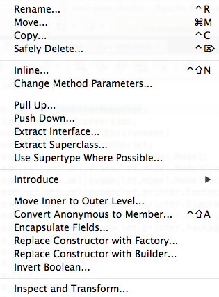

# 4.5 Καλές τεχνικές προγραμματισμού {#Java} 
© Γιάννης Κωστάρας

---

[🏠](https://jkost.github.io) | [⬆️](../../README.md) | [◀️](../4.4-JavaDoc/README.md) | [▶️](../4.6-Exercise/README.md)

---
[](4.5-BestPractices.ipynb)

Η συγγραφή κώδικα είναι τόσο επιστήμη όσο και τέχνη. Ένας καλός προγραμματιστής πρέπει να έχει υπόψιν του πολλές, πολλές φορές αντιδιαμετρικές, συνισταμένες ώστε να μπορέσει να γράψει ποιοτικό κώδικα.

Με τον όρο _ποιοτικό κώδικα_ εννοούμε κώδικα που είναι:

* _Σωστός (correct)_, χωρίς λάθη (bug free) ικανοποιώντας τις απαιτήσεις
* _Εύρωστος (robust)_, δηλ. ανεκτικός σε μη αναμενόμενες συνθήκες (αμυντικός προγραμματισμός)
* _Αποδοτικός (efficient, performant)_, αποδοτική χρήση των πόρων
* _Κλιμακωτός (scalable)_, δηλ. να δουλεύει πιο αποδοτικά όταν προσθέτουμε περισσότερους πόρους
* _Συντηρήσιμος (maintainable), επεκτάσημος (extendable)_, δηλ. να μη 'χαλάμε' υπάρχουσες λειτουργίες όταν προσθέτουμε νέες
* _(Επανα)Χρησιμοποιήσιμος (re-usable)_, δηλ. εύκολος στην κατανόηση και την χρήση
* _Να μπορεί να ελέγχεται (testable)_
* _Ασφαλής (secure & safe)_, να μην εισάγει κενά ασφαλείας εκμεταλλεύσιμα από χάκερς

Η δουλειά μας ως προγραμματιστές είναι να βρούμε τη χρυσή τομή σ' όλα τα παραπάνω. 

Παρακάτω παρουσιάζουμε μερικές χρήσιμες συμβουλές που θα σας βοηθήσουν να γράφετε συντηρήσιμο και αποτελεσματικό κώδικα. 

* Καλό είναι να σχολιάζετε τις κλάσεις και τις μεθόδους σας (χρησιμοποιώντας JavaDoc). Έτσι βοηθάτε και τους άλλους αλλά και τον εαυτό σας όταν ξαναεπισκέπτεστε τον κώδικα αργότερα χωρίς να χρειάζεται να διαβάζετε τον κώδικα για να καταλάβετε τι κάνει. (Βλ. π.χ. [εδώ](https://stackoverflow.com/questions/184618/what-is-the-best-comment-in-source-code-you-have-ever-encountered)). Βάλτε στα σχόλια ότι είναι χρήσιμο για τον προγραμματιστή, π.χ. μονάδα μέτρησης μιας παραμέτρου, URL όπου βρήκατε τον αλγόριθμο, ταυτότητα απαίτησης (requirement ID) που υλοποιεί κλπ. 
* Αποφεύγετε να γράφετε "κρυπτοκώδικα", δηλ. δυσανάγνωστο κώδικα με "μαγικούς αριθμούς" χωρίς να εξηγείτε τι κάνουν. Ο κώδικας θα πρέπει να είναι ευκολοδιάβαστος έτσι ώστε, όπως λέμε, να μη χρειάζεται σχολιασμό, αν κι αυτό δεν είναι τις πιο πολλές φορές δυνατό. 
* Μια μέθοδος θα πρέπει να κάνει μόνο ένα πράγμα, π.χ. ```calculateSum()```. Μέθοδοι που κάνουν περισσότερα από ένα πράγματα π.χ. ```calculateSumAndAverage()``` καλό είναι να σπάνε σε μικρότερες μεθόδους που να κάνουν ένα μόνο πράγμα. Οι περισσότερες μέθοδοί σας δε πρέπει να ξεπερνούν τις 10-15 γραμμές κώδικα. Αυτό δεν βοηθάει μόνο στην ευαναγνωσιμότητα του κώδικα αλλά και τον compiler να παράγει πιο αποδοτικό κώδικα.
* Γράψτε unit tests (ελέγχους μονάδας, θα μάθουμε τι είναι σε επόμενη εβδομάδα) για όσες περισσότερες μεθόδους μπορείτε. Αν και φαίνεται βαρετό, όταν θα χρειαστεί να αλλάξετε κάποιο τμήμα του κώδικά σας, ξανατρέχοντας τους ελέγχους μονάδας θα είστε σίγουροι ότι δε 'χαλάσατε' κάτι στο πρόγραμμά σας.
* Προσπαθήστε ο κώδικάς σας και κυρίως οι μεθόδοί σας να είναι όσο πιο αυτόνομες γίνεται. Π.χ. να μην εξαρτιώνται από γνωρίσματα. Ότι χρειάζεται μια μέθοδος καλό είναι να της το περνάτε ως όρισμα και να επιστρέφει την τιμή που χρειάζεται το πρόγραμμα αντί ν' αλλάζει την τιμή ενός γνωρίσματος της κλάσης. Με αυτόν τον τρόπο μπορείτε αργότερα να μεταφέρετε τη μέθοδο σε άλλη κλάση χωρίς να χρειάζεται να κάνετε αλλαγές σ'αυτή καθώς δεν έχει εξαρτήσεις από την κλάση που την περιέχει.
* Χρησιμοποιείτε ```enum```s για να περιορίσετε τα πεδία τιμών των μεταβλητών όπου αυτό είναι δυνατό.
* Χρησιμοποιείτε ```record```s όπου μπορείτε. Είναι αμετάβλητες κλάσεις και γράφετε πολύ λιγότερο κώδικα.

Ακολουθεί μια λίστα με συνήθη προγραμματιστικά λάθη:

* Να κάνουμε διαίρεση μεταξύ ακεραίων, πιστεύοντας ότι θα πάρουμε σαν αποτέλεσμα έναν αριθμό κινητής υποδιαστολής, ενώ στην πραγματικότητα παίρνουμε το ακέραιο πηλίκο της διαίρεσης.
* Να νομίσουμε ότι σε μία ακέραια μεταβλητή μπορούμε να ϕυλάξουμε τιμή οσοδήποτε μεγάλη
* Να νομίσουμε ότι σε μία μεταβλητή κινητής υποδιαστολής μπορούμε να έχουμε όση ακρίβεια θέλουμε.
* Να κάνουμε λάθος στην οριακή συνθήκη τερματισμού μίας δομής επανάληψης.
* Να χρησιμοποιήσουμε για τελεστή σύγκρισης μέσα σε συνθήκη το ```=```, αντί για το ```==```.
* Να βάλουμε μετά από μία ```for``` ή μία ```while``` ένα ```;``` πριν την εντολή ή το μπλοκ εντολών που αποτελούν το σώμα τους.
* Να ξεχάσουμε ότι τα στοιχεία ενός πίνακα με διάσταση _n_ αριθμούνται από το 0 έως το _n_-1, και όχι από το 1 έως το _n_.
* Να χειριστούμε απρόσεκτα μεταβλητές με το ίδιο όνομα, παρεξηγώντας τις εμβέλειες καθεμιάς, και να χρησιμοποιούμε κάποια απ΄ αυτές, ενώ πραγματικά χρησιμοποιούμε κάποια άλλη.
* Να θεωρήσουμε ότι τοπικές μεταβλητές είναι αρχικοποιημένες (για παράδειγμα, σε 0), παρότι εμείς δεν έχουμε κάνει ρητά κάτι τέτοιο.
* Να γράψουμε απρόσεκτα εμϕωλευμένες εντολές ```if```, παραλείποντας άγκιστρα ```{``` και ```}``` ενώ χρειάζονται, με αποτέλεσμα η εντολή να είναι μεν συντακτικά σωστή, οπότε ο μεταγλωττιστής δεν διαμαρτύρεται, αλλά να σημαίνει κάτι άλλο από αυτό που είχαμε πρόθεση να γράψουμε.
* Να ξεχάσουμε κρίσιμα ```break``` στις περιπτώσεις μίας εντολής ```switch```.
* Να συγκρίνουμε αντικείμενα με τον τελεστή ```==```, αντί με τη συνάρτηση ```equals()```.
* Να μην βάλουμε συνθήκη τερματισμού μίας αναδρομής.

## Αναδιοργάνωση Κώδικα (Refactoring)
Πολλές φορές συμβαίνει να θέλετε να προσθέσετε ένα νέο χαρακτηριστικό σε ένα πρόγραμμα, αλλά η δομή του προγράμματος είναι τέτοια που δεν είναι εύκολο ή εφικτό να προστεθεί αυτό το νέο χαρακτηριστικό. Σ' αυτήν την περίπτωση, θα πρέπει πρώτα να αναδιοργανώσετε τον κώδικα ώστε να είναι ευκολότερο να εισάγετε νέα χαρακτηριστικά.

**Ορισμός**: Με τον όρο _Αναδιοργάνωση Κώδικα (Refactoring)_ εννούμε μια αλλαγή στην δομή ενός προγράμματος ώστε να κάνουμε τον κώδικα πιο κατανοητό και ευκολότερο στην αλλαγή χωρίς όμως να αλλάξουμε τη συμπεριφορά του. Συνήθως, η αναδιοργάνωση κώδικα βελτιώνει την ποιότητα του κώδικα, τον καθιστά πιο κατανοητό ή/και ευκολότερο ν' αλλάξει/επεκταθεί.

Παραδείγματα: _Μετονομασία (Rename), Εξαγωγή κώδικα σε νέα μέθοδο (Extract Method), Εξαγωγή διεπαφής (Extract Interface), Μετακίνηση Μεθόδου σε Άλλη Κλάση (Move Method)_.

Όλα τα μοντέρνα ΟΠΕ (Integrated Development Environments - IDEs) προσφέρουν δυνατότητες refactoring. Π.χ. το NetBeans διαθέτει το μενού **Refactor**.



**Εικόνα 4.6.1** _Μενού Refactor του NetBeans_ 

Η **Rename** είναι η πιο συνήθης εντολή αναδιοργάνωσης καθώς σας επιτρέπει ν' αλλάξετε το όνομα μια μεταβλητής, μεθόδου, κλάσης κλπ. με ασφάλεια χωρίς να "σπάτε" τον κώδικα.

Δείτε [εδώ](https://netbeans.org/kb/docs/java/editor-inspect-transform.html) για το μενού **Inspect and Transform**.

## Πηγές
1. Fowler M. (2019), _Refactoring, Improving the Design of Existing Code_, 2nd Ed., Addison-Wesley.
1. Visser J. (2016), _Building Maintainable Software, Java Edition_, O’Reilly.

---

[🏠](https://jkost.github.io) | [⬆️](../../README.md) | [◀️](../4.4-JavaDoc/README.md) | [▶️](../4.6-Exercise/README.md)

---