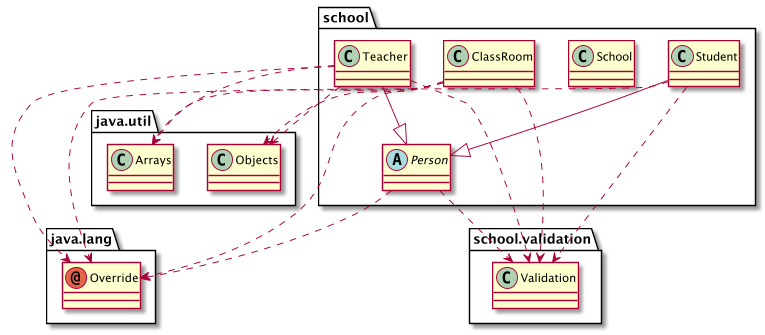

# 4.6 Άσκηση Αντικειμενοστραφούς Προγραμματισμού {#Java}  
© Γιάννης Κωστάρας

---

[<](../4.5-BestPractices/README.md) | [Δ](../../README.md)

---

[](4.6-Exercise.ipynb)

Θα επιλύσουμε την άσκηση 2 του μαθήματος 4.1.

----
2) Σε συνέχεια της άσκησης 1. της προηγούμενης εβδομάδας, δημιουργήστε μια κλάση ```Person``` με τα εξής γνωρίσματα:

* όνομα (αλφαριθμητικό και δεν μπορεί να 'ναι κενό)
* επώνυμο (αλφαριθμητικό και δεν μπορεί να 'ναι κενό)

και μετατρέψτε την κλάση ```Student``` ώστε να κληρονομεί από αυτήν. Δημιουργήστε μια κλάση ```Teacher``` που να κληρονομεί από την ```Person``` και να έχει τα επιπλέον γνωρίσματα:

* αριθμός δελτίου ταυτότητας (της μορφής ```ΑΒ123456```)
* μαθήματα που διδάσκει (μέχρι 3)

----

## Υλοποίηση με το NetBeans
1. Ανοίξτε το έργο _School_ που δημιουργήσαμε στην προηγούμενη άσκηση από το μενού **File -> Open Project**  ή **File -> Open Recent Project** αν δεν το έχετε ήδη ανοικτό.

Κατ' αρχήν θα προσθέσουμε τις μεθόδους ```equals()``` και ```hashCode()``` στις κλάσεις ```Student``` και ```ClassRoom``` (θυμάστε πώς στο NetBeans); Για την ```Student``` αρκεί ο ```am``` (δυο μαθητές με τον ίδιο Α.Μ. θεωρούμε ότι είναι ο ίδιος μαθητής). Για την ```ClassRoom``` αρκεί το όνομα της κλάσης (αν δυο τάξεις έχουν το ίδιο όνομα θεωρούμε ότι πρόκειται για την ίδια τάξη). Έτσι η υλοποίηση των ```equals()``` και ```hashCode()``` είναι πιο εύκολη.

```Java
//package school;
package school;

public class Student {

    private static final int MAX_SIZE = 20;
    private static final String NONE = "<Κενό>";

    private static int amCounter = 0;
    
    private final int am;
    private String firstName = NONE;
    private String lastName = NONE;
    private int age = -1;  // 15-18
    private ClassRoom classRoom;

    public Student(String firstName, String lastName, int age) {
        am = ++amCounter;
        if (isNameValid(firstName)) {
            this.firstName = firstName.trim();
        }
        if (isNameValid(lastName)) {
            this.lastName = lastName.trim();
        }
        if (isAgeValid(age)) {
            this.age = age;
        }
    }

    public int getAm() {
        return am;
    }
    
    public String getFirstName() {
        return firstName;
    }

    public void setFirstName(String firstName) {
        this.firstName = isNameValid(firstName) ? firstName.trim() : NONE;
    }

    public String getLastName() {
        return lastName;
    }

    public void setLastName(String lastName) {
        this.lastName = isNameValid(lastName) ? lastName.trim() : NONE;
    }

    public int getAge() {
        return age;
    }

    public void setAge(int age) {
        this.age = isAgeValid(age) ? age : -1;
    }

    public ClassRoom getClassRoom() {
        return classRoom;
    }

    void setClassRoom(ClassRoom classRoom) {
        this.classRoom = classRoom;
    }

    @Override
    public int hashCode() {
        int hash = 7;
        hash = 41 * hash + this.am;
        return hash;
    }

    @Override
    public boolean equals(Object obj) {
        if (this == obj) {
            return true;
        }
        if (obj == null) {
            return false;
        }
        if (getClass() != obj.getClass()) {
            return false;
        }
        final Student other = (Student) obj;
        return this.am == other.am;
    }
    
    @Override
    public String toString() {
        return "Student{" + "am=" + am + ", firstName=" + firstName 
               + ", lastName=" + lastName + ", age=" + age + ", classRoom=" + classRoom + '}';
    }
    
    private boolean isAgeValid(int inAge) {
        return inAge >= 15 && inAge <= 18;
    }
    
    private boolean isNameValid(String name) {
        return name != null && !name.isBlank() && name.length() <= MAX_SIZE;
    }

}
```
```java
//package school;
import java.util.Arrays;
import java.util.Objects;

public class ClassRoom {

    private static final int DEFAULT_SIZE = 30;
    private static final String NO_CLASSROOM = "--";
    private static final int CLASSROOM_NAME_LENGTH = 2;    

    private final String name;
    private final int size;
    private Student[] students;
    private int index = 0;

    public ClassRoom(String name, int size) {
        this.name = isClassRoomNameValid(name) ? name : NO_CLASSROOM;
        this.size = isSizeValid(size) ? size : DEFAULT_SIZE;
        this.students = new Student[size];
    }

    public ClassRoom(String name) {
        this(name, DEFAULT_SIZE);
    }

    public String getName() {
        return name;
    }

    public int getSize() {
        return size;
    }

    public void addStudent(Student student) {
        if (student != null && index < size) {
            students[index++] = student;
            student.setClassRoom(this);
        }
    }

    public void removeStudent(int am) {
        int indx = contains(students, am);
        if (indx != -1) {
            Student student = students[indx];
            if (remove(indx)) {
                student.setClassRoom(null);
            }
        }
    }

    public void removeStudent(Student student) {
        if (student != null) {
            removeStudent(student.getAm());
            student.setClassRoom(null);
        }
    }

    public void removeAllStudents() {
        for (Student student : students) {
            student.setClassRoom(null);
        }
        Arrays.fill(students, null);
        index = 0;
    }

    private int contains(Student[] students, int am) {
        for (int i = 0; i < students.length; i++) {
            Student student = students[i];
            if (student.getAm() == am) {
                return i;
            }
        }
        return -1;
    }

    private boolean remove(int indx) {
        if (indx < 0 || indx >= this.students.length) return false;
        Student[] newStudents = new Student[this.students.length - 1];
        // αντιγραφή από το 0 μέχρι το students[index-1]
        System.arraycopy(this.students, 0, newStudents, 0, indx);
        // αντιγραφή από students[index+1] μέχρι students[students.length-1]
        System.arraycopy(this.students, indx + 1, newStudents, indx, this.students.length - indx - 1);
        this.students = newStudents;
        index--;
        return true;
    }

    @Override
    public int hashCode() {
        int hash = 7;
        hash = 29 * hash + Objects.hashCode(this.name);
        return hash;
    }

    @Override
    public boolean equals(Object obj) {
        if (this == obj) {
            return true;
        }
        if (obj == null) {
            return false;
        }
        if (getClass() != obj.getClass()) {
            return false;
        }
        final ClassRoom other = (ClassRoom) obj;
        return Objects.equals(this.name, other.name);
    }

    @Override
    public String toString() {
        return "ClassRoom{" + "name=" + name + ", size=" + size + ", numOfStudents=" + index + '}';
    }
    
    private boolean isSizeValid(int inSize) {
        return inSize >= 10 && inSize <= DEFAULT_SIZE;
    }    
    
    private boolean isClassRoomNameValid(String classRoom) {
        return classRoom != null && !classRoom.isBlank() 
                && classRoom.length() == CLASSROOM_NAME_LENGTH 
                && (classRoom.startsWith("Α") 
                || classRoom.startsWith("Β")
                || classRoom.startsWith("Γ"))
                && classRoom.charAt(1) >= '1'
                && classRoom.charAt(1) <= '9';
    }   
}
```
Η κλάση ```Teacher``` θα έχει τα εξής γνωρίσματα:

* αριθμός δελτίου ταυτότητας (της μορφής ```ΑΒ123456```)
* όνομα (αλφαριθμητικό και δεν μπορεί να 'ναι κενό)
* επώνυμο (αλφαριθμητικό και δεν μπορεί να 'ναι κενό)
* μαθήματα που διδάσκει (μέχρι 3)

Τα παραπάνω μεταφράζονται στα εξής:

```java
private String id;  // ΑΔΤ
private String firstName = NONE;
private String lastName = NONE;
private String[] lessons;
```
Κάντε δεξί κλικ πάνω στο πακέτο ```school``` στην καρτέλα **Projects** και επιλέξτε **New -> Java Class...**. Δώστε το όνομα της κλάσης να είναι ```Teacher``` και πατήστε **Finish**.

Δημιουργείστε μια μέθοδο κατασκευής, getters και setters για τα 3 πρώτα πεδία, ```equals()``` και ```hashCode()``` (για το πεδίο ```id``` μόνο) και ```toString()``` όπως μάθαμε προηγούμενα. Το αποτέλεσμα θα πρέπει να είναι το παρακάτω:

```java
//package school;
public class Teacher {

    private static final int MAX_SIZE = 20;
    private static final int MAX_LESSONS = 3;
    private static final String NONE = "<Κενό>";
    private static final int ID_LENGTH = 8;

    private String id;  // ΑΔΤ
    private String firstName = NONE;
    private String lastName = NONE;
    private String[] lessons;
    private int index = 0;

    public Teacher(String id, String firstName, String lastName, String... lessons) {
        this.id = id;
        this.firstName = firstName.trim();
        this.lastName = lastName.trim();
        this.lessons = lessons;
    }

    public String getFirstName() {
        return firstName;
    }

    public void setFirstName(String firstName) {
        this.firstName = firstName;
    }

    public String getLastName() {
        return lastName;
    }

    public void setLastName(String lastName) {
        this.lastName = lastName;
    }

    @Override
    public int hashCode() {
        int hash = 3;
        hash = 59 * hash + Objects.hashCode(this.id);
        return hash;
    }

    @Override
    public boolean equals(Object obj) {
        if (this == obj) {
            return true;
        }
        if (obj == null) {
            return false;
        }
        if (getClass() != obj.getClass()) {
            return false;
        }
        final Teacher other = (Teacher) obj;
        return Objects.equals(this.id, other.id);
    }

    @Override
    public String toString() {
        return "Teacher{" + "id=" + id + ", firstName=" + firstName 
               + ", lastName=" + lastName + ", lessons=" + Arrays.toString(lessons) + '}';
    }
}
```
Επόμενο βήμα η δημιουργία μεθόδων για προσθαφαίρεση μαθημάτων:

* μια μέθοδο ```addLesson()``` η οποία θα προσθέτει ένα μάθημα από αυτά που διδάσκει ο καθηγητής
* μια μέθοδο ```removeLesson()``` η οποία θα αφαιρεί ένα μάθημα από αυτά που διδάσκει ο καθηγητής

```java
private int index = 0;
public void addLesson(String lesson) {
    if (lesson != null && index < MAX_LESSONS) {
        lessons[index++] = lesson;
    }
}
```
Αντίστοιχα, η ```removeLesson(String lesson)```, αφαιρεί ένα μάθημα, παρόμοια όπως κάναμε και με την ```removeStudent()``` της ```ClassRoom```:
```java
public void removeLesson(String lesson) {
    if (lesson != null) {
        remove(contains(lessons, lesson));
    }
}

private int contains(String[] lessons, String les) {
    for (int i = 0; i < lessons.length; i++) {
        String lesson = lessons[i];
        if (lesson.equalsIgnoreCase(les)) {
            return i;
        }
    }
    return -1;
}

private boolean remove(int indx) {
    if (indx < 0 || indx >= this.lessons.length) {
        return false;
    }
    String[] newLessons = new String[this.lessons.length - 1];
    // αντιγραφή από το 0 μέχρι το lessons[index-1]
    System.arraycopy(this.lessons, 0, newLessons, 0, indx);
    // αντιγραφή από lessons[index+1] μέχρι lessons[lessons.length-1]
    System.arraycopy(this.lessons, indx + 1, newLessons, indx, this.lessons.length - indx - 1);
    this.lessons = newLessons;
    index--;
    return true;
}
```
Πολύς διπλότυπος κώδικας με την ```ClassRoom``` θα πείτε και δε θα 'χετε άδικο.

Δεν πρέπει να ξεχάσουμε να ελέγξουμε αν τα ορίσματα που περνάμε περιέχουν έγκυρες τιμές (validation). Για το πεδίο ```lessons``` ο έλεγχος γίνεται ήδη στις διάφορες μεθόδους που προσθαφαιρούν μαθήματα σ' αυτό, αλλά θα χρειαστεί να κάνουμε κάτι περισσότερο στον constructor.

Έχουμε ήδη δει την ```isNameValid()```:
```java
private static final int MAX_SIZE = 20;
private boolean isNameValid(String name) {
   return name != null && !name.isBlank() && name.length() <= MAX_SIZE;
}
```
και τη χρησιμοποιούμε στη μέθοδο κατασκευής:
```java
if (isNameValid(firstName)) {
   this.firstName = firstName.trim();
}
if (isNameValid(lastName)) {
   this.lastName = lastName.trim();
}
```
και στους setters:
```java
private static final String NONE = "<Κενό>";
private String firstName = NONE;
private String lastName = NONE;

public void setFirstName(String firstName) {
   this.firstName = isNameValid(firstName) ? firstName.trim() : NONE;
}

public void setLastName(String lastName) {
   this.lastName = isNameValid(lastName) ? lastName.trim() : NONE;
}
```
Ο δε έλεγχος για έγκυρο ΑΔΤ είναι πιο πολύπλοκος. Μια υλοποίηση φαίνεται παρακάτω:
```java
private static final int ID_LENGTH = 8;
// ΑΔΤ: ΓΓ123456
private boolean isIdValid(String id) {
    return id != null && !id.isBlank() && id.length() == ID_LENGTH
            && isCapitalLetter(id.charAt(0))
            && isCapitalLetter(id.charAt(1))
            && isNumber(id.charAt(2))
            && isNumber(id.charAt(3))
            && isNumber(id.charAt(4))
            && isNumber(id.charAt(5))
            && isNumber(id.charAt(6))
            && isNumber(id.charAt(7));
}

private boolean isCapitalLetter(char c) {
    return c >= 'A' && c <= 'Ω';
}

private boolean isNumber(char c) {
    return c >= '0' && c <= '9';
}  
```
και τη χρησιμοποιούμε επίσης στη μέθοδο κατασκευής:
```java
if (isIdValid(id)) {
    this.id = id;
}
```
και στη setter:
```java
public void setId(String id) {
    this.id = isIdValid(id) ? id : NONE;
}
```
Τέλος θα πρέπει να κάνουμε κάποιον έλεγχο για την vararg ```lessons``` που λαμβάνουμε στον constructor. 

Η κλάση ```Teacher```:

```Java
//package school;

import java.util.Objects;

public class Teacher {

    private static final int MAX_SIZE = 20;
    private static final int MAX_LESSONS = 3;
    private static final String NONE = "<Κενό>";
    private static final int ID_LENGTH = 8;

    private String id = NONE;  // ΑΔΤ
    private String firstName = NONE;
    private String lastName = NONE;
    private String[] lessons;
    private int index = 0;

    public Teacher(String id, String firstName, String lastName, String... lessons) {
        if (isIdValid(id)) {
            this.id = id;
        }
        if (isNameValid(firstName)) {
            this.firstName = firstName.trim();
        }
        if (isNameValid(lastName)) {
            this.lastName = lastName.trim();
        }
        if (lessons != null && lessons.length > 0) { // αντιγράφουμε μόνο τα 3 πρώτα μαθήματα
            int length = lessons.length > MAX_LESSONS ? MAX_LESSONS : lessons.length;
            this.lessons = Arrays.copyOfRange(lessons, 0, length);
        } else {
            this.lessons = new String[MAX_LESSONS];
        }
    }

    public String getId() {
        return id;
    }

    public void setId(String id) {
        this.id = isIdValid(id) ? id : NONE;
    }

    public String getFirstName() {
        return firstName;
    }

    public void setFirstName(String firstName) {
        this.firstName = isNameValid(firstName) ? firstName.trim() : NONE;
    }

    public String getLastName() {
        return lastName;
    }

    public void setLastName(String lastName) {
        this.lastName = isNameValid(lastName) ? lastName.trim() : NONE;
    }

    public void addLesson(String lesson) {
        if (lesson != null && index < MAX_LESSONS) {
            lessons[index++] = lesson;
        }
    }

    public void removeLesson(String lesson) {
        if (lesson != null) {
            remove(contains(lessons, lesson));
        }
    }

    @Override
    public int hashCode() {
        int hash = 3;
        hash = 59 * hash + Objects.hashCode(this.id);
        return hash;
    }

    @Override
    public boolean equals(Object obj) {
        if (this == obj) {
            return true;
        }
        if (obj == null) {
            return false;
        }
        if (getClass() != obj.getClass()) {
            return false;
        }
        final Teacher other = (Teacher) obj;
        return Objects.equals(this.id, other.id);
    }

    @Override
    public String toString() {
        return "Teacher{" + "id=" + id + ", firstName=" + firstName 
               + ", lastName=" + lastName + ", lessons=" + Arrays.toString(lessons) + '}';
    }

    private int contains(String[] lessons, String les) {
        for (int i = 0; i < lessons.length; i++) {
            String lesson = lessons[i];
            if (lesson.equalsIgnoreCase(les)) {
                return i;
            }
        }
        return -1;
    }

    private boolean remove(int indx) {
        if (indx < 0 || indx >= this.lessons.length) {
            return false;
        }
        String[] newLessons = new String[this.lessons.length - 1];
        // αντιγραφή από το 0 μέχρι το lessons[index-1]
        System.arraycopy(this.lessons, 0, newLessons, 0, indx);
        // αντιγραφή από lessons[index+1] μέχρι lessons[lessons.length-1]
        System.arraycopy(this.lessons, indx + 1, newLessons, indx, this.lessons.length - indx - 1);
        this.lessons = newLessons;
        index--;
        return true;
    }

    // ΑΔΤ: ΓΓ123456
    private boolean isIdValid(String id) {
        return id != null && !id.isBlank() && id.length() == ID_LENGTH
                && isCapitalLetter(id.charAt(0))
                && isCapitalLetter(id.charAt(1))
                && isNumber(id.charAt(2))
                && isNumber(id.charAt(3))
                && isNumber(id.charAt(4))
                && isNumber(id.charAt(5))
                && isNumber(id.charAt(6))
                && isNumber(id.charAt(7));
    }

    private boolean isCapitalLetter(char c) {
        return c >= 'A' && c <= 'Ω';
    }

    private boolean isNumber(char c) {
        return c >= '0' && c <= '9';
    }

    private boolean isNameValid(String name) {
        return name != null && !name.isBlank() && name.length() <= MAX_SIZE;
    }
}
```

Ας δοκιμάσουμε τον κώδικά μας στην κλάση ```School```:

```Java
//package school;

public class School {
    private static final ClassRoom[] classRooms = { 
        new ClassRoom("Α1"), 
        new ClassRoom("Α2", 28), 
        new ClassRoom("Α3", 25), 
        new ClassRoom("Β1"), 
        new ClassRoom("Β2", 28), 
        new ClassRoom("Β3", 25), 
        new ClassRoom("Γ1"), 
        new ClassRoom("Γ2", 26), 
        new ClassRoom("Γ3", 22), 
    
    };

    public static void main(String[] args) {
        System.out.println("=== Create student ioannis ====");
        Student ioannis = new Student("Γιάννης", "Αντεκοτούμπο", 16);
        System.out.println("AM: " + ioannis.getAm());
        System.out.println("ClassRoom: " + ioannis.getClassRoom());
        
        System.out.println("\n=== Add student ioannis to classroom 'B1' ====");
        classRooms[3].addStudent(ioannis);
        System.out.println(ioannis.getClassRoom());
        System.out.println(ioannis);
        
        System.out.println("\n=== Create student aliki and add to classroom 'B1' ====");
        Student aliki = new Student("Αλίκη", "Βουγιουκλάκη", 17);
        classRooms[3].addStudent(aliki);
        System.out.println(aliki);
        System.out.println(classRooms[3]);

        System.out.println("\n=== Remove student ioannis from classroom 'B1' ====");
        classRooms[3].removeStudent(ioannis.getAm());
        System.out.println(ioannis);
        System.out.println(classRooms[3]);
        
        System.out.println("\n=== Create a teacher ====");
        Teacher socrates = new Teacher("AB123456", "Σωκράτης", "Σωκράτης");
        socrates.addLesson("Φιλοσοφία");
        socrates.addLesson("Αρχαία Ελληνικά");
        System.out.println(socrates);
    }
    
}
```

```Java
jshell> School.main(null);

    === Create student ioannis ====
    AM: 1
    ClassRoom: null
    
    === Add student ioannis to classroom 'B1' ====
    ClassRoom{name=Β1, size=30, numOfStudents=1}
    Student{am=1, firstName=Γιάννης, lastName=Αντεκοτούμπο, age=16, classRoom=ClassRoom{name=Β1, size=30, numOfStudents=1}}
    
    === Create student aliki and add to classroom 'B1' ====
    Student{am=2, firstName=Αλίκη, lastName=Βουγιουκλάκη, age=17, classRoom=ClassRoom{name=Β1, size=30, numOfStudents=2}}
    ClassRoom{name=Β1, size=30, numOfStudents=2}
    
    === Remove student ioannis from classroom 'B1' ====
    Student{am=1, firstName=Γιάννης, lastName=Αντεκοτούμπο, age=16, classRoom=null}
    ClassRoom{name=Β1, size=30, numOfStudents=1}

    === Create a teacher ====
    Teacher{id=AB123456, firstName=Σωκράτης, lastName=Σωκράτης, lessons=[Φιλοσοφία, Αρχαία Ελληνικά, null]}
```
Σε αυτό το σημείο μπορούμε να δημιουργήσουμε μια γονική κλάση ```Person``` με τα κοινά στοιχεία των ```Student``` και ```Teacher```:

```java
//package school;

public abstract class Person {

    static final int MAX_SIZE = 20;
    static final String NONE = "<Κενό>";

    protected String firstName = NONE;
    protected String lastName = NONE;

    Person(String firstName, String lastName) {
        if (isNameValid(firstName)) {
            this.firstName = firstName.trim();
        }
        if (isNameValid(lastName)) {
            this.lastName = lastName.trim();
        }
    }

    public String getFirstName() {
        return firstName;
    }

    public void setFirstName(String firstName) {
        this.firstName = isNameValid(firstName) ? firstName.trim() : NONE;
    }

    public String getLastName() {
        return lastName;
    }

    public void setLastName(String lastName) {
        this.lastName = isNameValid(lastName) ? lastName.trim() : NONE;
    }

    @Override
    public String toString() {
        return ", firstName=" + firstName + ", lastName=" + lastName;
    }

    private boolean isNameValid(String name) {
        return name != null && !name.isBlank() && name.length() <= MAX_SIZE;
    }
}
```

Το επόμενο βήμα είναι να κάνουμε τις ```Student``` και ```Teacher``` να κληρονομούν από την ```Person```:
```java
//package school;

import java.util.Arrays;
import java.util.Objects;

public class Teacher extends Person {

    private static final int MAX_LESSONS = 3;
    private static final int ID_LENGTH = 8;

    private String id = NONE;  // ΑΔΤ
    private String[] lessons;
    private int index = 0;

    public Teacher(String id, String firstName, String lastName, String... lessons) {
        super(firstName, lastName);
        if (isIdValid(id)) {
            this.id = id;
        }
        if (lessons != null && lessons.length > 0) { // αντιγράφουμε μόνο τα 3 πρώτα μαθήματα
            int length = lessons.length > MAX_LESSONS ? MAX_LESSONS : lessons.length;
            this.lessons = Arrays.copyOfRange(lessons, 0, length);
        } else {
            this.lessons = new String[MAX_LESSONS];
        }
    }

    public String getId() {
        return id;
    }

    public void setId(String id) {
        this.id = isIdValid(id) ? id : NONE;
    }

    public void addLesson(String lesson) {
        if (lesson != null && index < MAX_LESSONS) {
            lessons[index++] = lesson;
        }
    }

    public void removeLesson(String lesson) {
        if (lesson != null) {
            remove(contains(lessons, lesson));
        }
    }

    @Override
    public int hashCode() {
        int hash = 3;
        hash = 59 * hash + Objects.hashCode(this.id);
        return hash;
    }

    @Override
    public boolean equals(Object obj) {
        if (this == obj) {
            return true;
        }
        if (obj == null) {
            return false;
        }
        if (getClass() != obj.getClass()) {
            return false;
        }
        final Teacher other = (Teacher) obj;
        return Objects.equals(this.id, other.id);
    }

    @Override
    public String toString() {
        return "Teacher{" + "id=" + id + super.toString() + ", lessons=" + Arrays.toString(lessons) + '}';
    }

    private int contains(String[] lessons, String les) {
        for (int i = 0; i < lessons.length; i++) {
            String lesson = lessons[i];
            if (lesson.equalsIgnoreCase(les)) {
                return i;
            }
        }
        return -1;
    }

    private boolean remove(int indx) {
        if (indx < 0 || indx >= this.lessons.length) {
            return false;
        }
        String[] newLessons = new String[this.lessons.length - 1];
        // αντιγραφή από το 0 μέχρι το students[index-1]
        System.arraycopy(this.lessons, 0, newLessons, 0, indx);
        // αντιγραφή από students[index+1] μέχρι students[students.length-1]
        System.arraycopy(this.lessons, indx + 1, newLessons, indx, this.lessons.length - indx - 1);
        this.lessons = newLessons;
        index--;
        return true;
    }

    // ΑΔΤ: ΓΓ123456
    private boolean isIdValid(String id) {
        return id != null && !id.isBlank() && id.length() == ID_LENGTH
                && isCapitalLetter(id.charAt(0))
                && isCapitalLetter(id.charAt(1))
                && isNumber(id.charAt(2))
                && isNumber(id.charAt(3))
                && isNumber(id.charAt(4))
                && isNumber(id.charAt(5))
                && isNumber(id.charAt(6))
                && isNumber(id.charAt(7));
    }

    private boolean isCapitalLetter(char c) {
        return c >= 'A' && c <= 'Ω';
    }

    private boolean isNumber(char c) {
        return c >= '0' && c <= '9';
    }
}
```

```java
//package school;

public class Student extends Person {

    private static int amCounter = 0;
    
    private final int am;
    private int age = -1;  // 15-18
    private ClassRoom classRoom;

    public Student(String firstName, String lastName, int age) {
        super(firstName, lastName);
        am = ++amCounter;
        if (isAgeValid(age)) {
            this.age = age;
        }
    }

    public int getAm() {
        return am;
    }
    
    public int getAge() {
        return age;
    }

    public void setAge(int age) {
        this.age = isAgeValid(age) ? age : -1;
    }

    public ClassRoom getClassRoom() {
        return classRoom;
    }

    void setClassRoom(ClassRoom classRoom) {
        this.classRoom = classRoom;
    }

    @Override
    public int hashCode() {
        int hash = 7;
        hash = 41 * hash + this.am;
        return hash;
    }

    @Override
    public boolean equals(Object obj) {
        if (this == obj) {
            return true;
        }
        if (obj == null) {
            return false;
        }
        if (getClass() != obj.getClass()) {
            return false;
        }
        final Student other = (Student) obj;
        return this.am == other.am;
    }
    
    @Override
    public String toString() {
        return "Student{" + "am=" + am + super.toString() + ", age=" + age + ", classRoom=" + classRoom + '}';
    }
    
    private boolean isAgeValid(int inAge) {
        return inAge >= 15 && inAge <= 18;
    }
}
```
Το NetBeans μας βοηθάει δείχνοντάς μας ποια γνωρίσματα και μεθόδους ορίζονται ήδη στην υπερκλάση. Επίσης, πολύ σημαντικό είναι να μην ξεχάσουμε να καλέσουμε τον super constructor στην μέθοδο κατασκευής καθεμιάς από τις κλάσεις παιδιά. Κοιτάξτε επίσης και ένα μικρό τρικ που κάναμε στην ```toString()```.

Ξανατρέξτε την ```School.main()```. Θα πρέπει να δείτε πάλι το ίδιο αποτέλεσμα.

Συγχαρητήρια αν φθάσατε μέχρι εδώ!

Θα μπορούσαμε να κάνουμε κάτι για να ελαχιστοποιήσουμε τον διπλότυπο κώδικα. Θα δημιουργήσουμε μια νέα Utility κλάση που θα την ονομάσουμε ```Validation``` και η οποία θα περιέχει όλες τις μεθόδους που δουλειά τους είναι ο έλεγχος των γνωρισμάτων. 

Δημιουργήστε ένα νέο πακέτο ```validation``` μέσα στο ```school``` και δημιουργήστε μια νέα κλάση ```Validation``` σ' αυτό. Η κλάση αυτή θα είναι μια χρηστική κλάση (utility class), θα περιέχει δηλ. χρήσιμες στατικές μεθόδους που χρησιμοποιούνται από το πρόγραμμα. Δεν θα μπορεί να κληρονομηθεί ούτε να δημιουργήσουμε αντικείμενα αυτής.

```java
//package school.validation;

public final class Validation {
    private Validation() {
    }
}
```
Θα ξεκινήσουμε να μεταφέρουμε μεθόδους validation από τις διάφορες κλάσεις μας σ' αυτήν την κλάση. Ξεκινάμε από την ```isNameValid()``` της ```Person```.

```java
//package school.validation;

public final class Validation {
    private static final int MAX_SIZE = 20;

    private Validation() {
    }

    public static boolean isNameValid(String name) {
        return name != null && !name.isBlank() && name.length() <= MAX_SIZE;
    }
}
```
Παρατηρήστε ότι μετατρέπουμε τις μεθόδους σε ```public static```, αφού δεν αλλάζουν την κατάσταση (state) της κλάσης, καθώς δεν υπάρχει κάποιο state αφού η ```Validation``` δεν έχει γνωρίσματα.

```java
//package school;

//import school.validation.Validation;

public abstract class Person {

    static final String NONE = "<Κενό>";

    protected String firstName = NONE;
    protected String lastName = NONE;

    Person(String firstName, String lastName) {
        if (Validation.isNameValid(firstName)) {
            this.firstName = firstName.trim();
        }
        if (Validation.isNameValid(lastName)) {
            this.lastName = lastName.trim();
        }
    }

    public String getFirstName() {
        return firstName;
    }

    public void setFirstName(String firstName) {
        this.firstName = Validation.isNameValid(firstName) ? firstName.trim() : NONE;
    }

    public String getLastName() {
        return lastName;
    }

    public void setLastName(String lastName) {
        this.lastName = Validation.isNameValid(lastName) ? lastName.trim() : NONE;
    }

    @Override
    public String toString() {
        return ", firstName=" + firstName + ", lastName=" + lastName;
    }
}
```
Σειρά έχουν οι μέθοδοι εγκυρότητας της ```ClassRoom```.

```java
//package school.validation;

public final class Validation {

    private static final int MAX_SIZE = 20;
    private static final int CLASSROOM_NAME_LENGTH = 2;
    public static final int DEFAULT_SIZE = 30;

    private Validation() {
    }

    public static boolean isNameValid(String name) {
        return name != null && !name.isBlank() && name.length() <= MAX_SIZE;
    }

    public static boolean isSizeValid(int inSize) {
        return inSize >= 10 && inSize <= DEFAULT_SIZE;
    }

    public static boolean isClassRoomNameValid(String classRoom) {
        return classRoom != null && !classRoom.isBlank()
                && classRoom.length() == CLASSROOM_NAME_LENGTH
                && (classRoom.startsWith("Α")
                || classRoom.startsWith("Β")
                || classRoom.startsWith("Γ"))
                && classRoom.charAt(1) >= '1'
                && classRoom.charAt(1) <= '9';
    }
}
```
```java
//package school;
import java.util.Arrays;
import java.util.Objects;
//import school.validation.Validation;

public class ClassRoom {
    private static final String NO_CLASSROOM = "--";
   
    private final String name;
    private final int size;
    private Student[] students;
    private int index = 0;

    public ClassRoom(String name, int size) {
        this.name = Validation.isClassRoomNameValid(name) ? name : NO_CLASSROOM;
        this.size = Validation.isSizeValid(size) ? size : Validation.DEFAULT_SIZE;
        this.students = new Student[size];
    }

    public ClassRoom(String name) {
        this(name, Validation.DEFAULT_SIZE);
    }

    public String getName() {
        return name;
    }

    public int getSize() {
        return size;
    }

    public void addStudent(Student student) {
        if (student != null && index < size) {
            students[index++] = student;
            student.setClassRoom(this);
        }
    }

    public void removeStudent(int am) {
        int indx = contains(students, am);
        if (indx != -1) {
            Student student = students[indx];
            if (remove(indx)) {
                student.setClassRoom(null);
            }
        }
    }

    public void removeStudent(Student student) {
        if (student != null) {
            removeStudent(student.getAm());
            student.setClassRoom(null);
        }
    }

    public void removeAllStudents() {
        for (Student student : students) {
            student.setClassRoom(null);
        }
        Arrays.fill(students, null);
        index = 0;
    }

    private int contains(Student[] students, int am) {
        for (int i = 0; i < students.length; i++) {
            Student student = students[i];
            if (student.getAm() == am) {
                return i;
            }
        }
        return -1;
    }

    private boolean remove(int indx) {
        if (indx < 0 || indx >= this.students.length) return false;
        Student[] newStudents = new Student[this.students.length - 1];
        // αντιγραφή από το 0 μέχρι το students[index-1]
        System.arraycopy(this.students, 0, newStudents, 0, indx);
        // αντιγραφή από students[index+1] μέχρι students[students.length-1]
        System.arraycopy(this.students, indx + 1, newStudents, indx, this.students.length - indx - 1);
        this.students = newStudents;
        index--;
        return true;
    }

    @Override
    public int hashCode() {
        int hash = 7;
        hash = 29 * hash + Objects.hashCode(this.name);
        return hash;
    }

    @Override
    public boolean equals(Object obj) {
        if (this == obj) {
            return true;
        }
        if (obj == null) {
            return false;
        }
        if (getClass() != obj.getClass()) {
            return false;
        }
        final ClassRoom other = (ClassRoom) obj;
        return Objects.equals(this.name, other.name);
    }

    @Override
    public String toString() {
        return "ClassRoom{" + "name=" + name + ", size=" + size + ", numOfStudents=" + index + '}';
    }   
}
```
Επαναλαμβάνοντας τη διαδικασία για τις άλλες δυο κλάσεις έχουμε τα εξής:

```java
//package school.validation;

public final class Validation {

    private static final int MAX_SIZE = 20;
    private static final int CLASSROOM_NAME_LENGTH = 2;
    private static final int ID_LENGTH = 8;
    public static final int DEFAULT_SIZE = 30;

    private Validation() {
    }

    public static boolean isNameValid(String name) {
        return name != null && !name.isBlank() && name.length() <= MAX_SIZE;
    }
    
        
    public static boolean isAgeValid(int inAge) {
        return inAge >= 15 && inAge <= 18;
    }

    public static boolean isSizeValid(int inSize) {
        return inSize >= 10 && inSize <= DEFAULT_SIZE;
    }

    public static boolean isClassRoomNameValid(String classRoom) {
        return classRoom != null && !classRoom.isBlank()
                && classRoom.length() == CLASSROOM_NAME_LENGTH
                && (classRoom.startsWith("Α")
                || classRoom.startsWith("Β")
                || classRoom.startsWith("Γ"))
                && classRoom.charAt(1) >= '1'
                && classRoom.charAt(1) <= '9';
    }
    
    // ΑΔΤ: ΓΓ123456
    public static boolean isIdValid(String id) {
        return id != null && !id.isBlank() && id.length() == ID_LENGTH
                && isCapitalLetter(id.charAt(0))
                && isCapitalLetter(id.charAt(1))
                && isNumber(id.charAt(2))
                && isNumber(id.charAt(3))
                && isNumber(id.charAt(4))
                && isNumber(id.charAt(5))
                && isNumber(id.charAt(6))
                && isNumber(id.charAt(7));
    }

    public static boolean isCapitalLetter(char c) {
        return c >= 'A' && c <= 'Ω';
    }

    public static boolean isNumber(char c) {
        return c >= '0' && c <= '9';
    }
}
```
```java
//package school;

//import school.validation.Validation;

public class Student extends Person {

    private static int amCounter = 0;
    
    private final int am;
    private int age = -1;  // 15-18
    private ClassRoom classRoom;

    public Student(String firstName, String lastName, int age) {
        super(firstName, lastName);
        am = ++amCounter;
        if (Validation.isAgeValid(age)) {
            this.age = age;
        }
    }

    public int getAm() {
        return am;
    }
    
    public int getAge() {
        return age;
    }

    public void setAge(int age) {
        this.age = Validation.isAgeValid(age) ? age : -1;
    }

    public ClassRoom getClassRoom() {
        return classRoom;
    }

    void setClassRoom(ClassRoom classRoom) {
        this.classRoom = classRoom;
    }

    @Override
    public int hashCode() {
        int hash = 7;
        hash = 41 * hash + this.am;
        return hash;
    }

    @Override
    public boolean equals(Object obj) {
        if (this == obj) {
            return true;
        }
        if (obj == null) {
            return false;
        }
        if (getClass() != obj.getClass()) {
            return false;
        }
        final Student other = (Student) obj;
        return this.am == other.am;
    }
    
    @Override
    public String toString() {
        return "Student{" + "am=" + am + super.toString() + ", age=" + age + ", classRoom=" + classRoom + '}';
    }
}
```
```java
//package school;

import java.util.Arrays;
import java.util.Objects;
//import school.validation.Validation;

public class Teacher extends Person {

    private static final int MAX_LESSONS = 3;

    private String id = NONE;  // ΑΔΤ
    private String[] lessons;
    private int index = 0;

    public Teacher(String id, String firstName, String lastName, String... lessons) {
        super(firstName, lastName);
        if (Validation.isIdValid(id)) {
            this.id = id;
        }
        if (lessons != null && lessons.length > 0) { // αντιγράφουμε μόνο τα 3 πρώτα μαθήματα
            int length = lessons.length > MAX_LESSONS ? MAX_LESSONS : lessons.length;
            this.lessons = Arrays.copyOfRange(lessons, 0, length);
        } else {
            this.lessons = new String[MAX_LESSONS];
        }
    }

    public String getId() {
        return id;
    }

    public void setId(String id) {
        this.id = Validation.isIdValid(id) ? id : NONE;
    }

    public void addLesson(String lesson) {
        if (lesson != null && index < MAX_LESSONS) {
            lessons[index++] = lesson;
        }
    }

    public void removeLesson(String lesson) {
        if (lesson != null) {
            remove(contains(lessons, lesson));
        }
    }

    @Override
    public int hashCode() {
        int hash = 3;
        hash = 59 * hash + Objects.hashCode(this.id);
        return hash;
    }

    @Override
    public boolean equals(Object obj) {
        if (this == obj) {
            return true;
        }
        if (obj == null) {
            return false;
        }
        if (getClass() != obj.getClass()) {
            return false;
        }
        final Teacher other = (Teacher) obj;
        return Objects.equals(this.id, other.id);
    }

    @Override
    public String toString() {
        return "Teacher{" + "id=" + id + super.toString() + ", lessons=" + Arrays.toString(lessons) + '}';
    }

    private int contains(String[] lessons, String les) {
        for (int i = 0; i < lessons.length; i++) {
            String lesson = lessons[i];
            if (lesson.equalsIgnoreCase(les)) {
                return i;
            }
        }
        return -1;
    }

    private boolean remove(int indx) {
        if (indx < 0 || indx >= this.lessons.length) {
            return false;
        }
        String[] newLessons = new String[this.lessons.length - 1];
        // αντιγραφή από το 0 μέχρι το students[index-1]
        System.arraycopy(this.lessons, 0, newLessons, 0, indx);
        // αντιγραφή από students[index+1] μέχρι students[students.length-1]
        System.arraycopy(this.lessons, indx + 1, newLessons, indx, this.lessons.length - indx - 1);
        this.lessons = newLessons;
        index--;
        return true;
    }
}
```
Ξανατρέξτε την ```School.main()``` για να επιβεβαιώσετε ότι όλα τρέχουν ακόμα σωστά.

Τι μπορούμε να κάνουμε για τον διπλότυπο κώδικα στις ```ClassRoom``` και ```Teacher```; Οι ```contains()``` και ```remove()``` κάνουν ακριβώς την ίδια δουλειά και στις δυο κλάσεις. Δυστυχώς σ' αυτή τη φάση δεν μπορούμε να κάνουμε πολλά. Θα μπορέσουμε να κάνουμε περισσότερα όταν μιλήσουμε αργότερα για γενικευμένους τύπους (generics) και συλλογές (collections).

### Τεκμηρίωση JavaDoc
Η προσθήκη σχολίων στον κώδικά σας θα πρέπει να είναι πάντα μέλημά σας τόσο για σας όσο και για άλλους που θα τον διαβάσουν. Η προσθήκη σχολίων JavaDoc είναι πολύ εύκολη με το NetBeans. Απλά πληκτρολογήστε ```/**``` και ```ENTER``` πάνω από μια μέθοδο και το NetBeans θα προσθέσει αυτόματα τα υπόλοιπα και εσείς απλά πρέπει να προσθέσετε τις επεξηγήσεις, δηλ. το τι κάνει η μέθοδος, καθεμιά από τις παραμέτρους (```@param```) και τι επιστρέφει η μέθοδος (```@return```). Επίσης, όπως είπαμε καλό είναι να διατυπώσετε τις προ- και μετά-συνθήκες (pre-/pro-conditions) και τα αξιώματα (invariants) της μεθόδου σας. Φυσικά σχόλια JavaDoc θα πρέπει να προσθέσετε και στα γνωρίσματα αλλά και στην ίδια την κλάση. Αφήνεται ως άσκηση να σχολιάσετε τις κλάσεις του έργου.

Εμφανίζοντας το παράθυρο _JavaDoc_ από το μενού **Window -> IDE Tools -> JavaDoc Documentation** μπορείτε να βλέπετε τα σχόλια JavaDoc σε αυτό το παράθυρο κάθε φορά που επιλέξετε μια μέθοδο, γνώρισμα, κλάση κλπ. 

Για να παράγετε την τεκμηρίωση JavaDoc, κάντε δεξί κλικ πάνω στο έργο και επιλέξτε **Generate JavaDoc** από το αναδυόμενο μενού, το οποίο θα παραχθεί στο φάκελο ```dist/javadoc/``` και θα ανοίξει στον αγαπημένο σας πλοηγό.

## Υλοποίηση με το BlueJ

1. Ανοίξτε το έργο ```School``` στο BlueJ από το μενού **Project -> Open Project** ή **Project -> Open Recent**.
1. Δημιουργήστε τις νέες κλάσεις ```Person``` και ```Teacher``` στο πακέτο ```school``` όπως περιγράψαμε για το NetBeans. 
1. Ενημερώστε τον κώδικα της ```Student```.
1. Ενημερώστε και τον κώδικα της ```School```.
1. Μην ξεχάσετε την ```school.validation.Validation```.
1. Μεταγλωττίστε τες.
1. Δεξί κλικ στην κλάση ```School``` και εκτέλεση της ```main()```. Θα πρέπει να δείτε το ίδιο αποτέλεσμα όπως και στην περίπτωση εκτέλεσης στο NetBeans.

Το διάγραμμα κλάσεων της εφαρμογής είναι πλέον όπως το παρακάτω.


**Εικόνα 4.6.1** _Διάγραμμα κλάσεων εφαρμογής σχολείου στο BlueJ_

Ας δούμε πώς μπορούμε να εμφανίσουμε το διάγραμμα κλάσεων και στο NetBeans.

1. Στο NetBeans κάντε δεξί κλικ στο _Source Packages_ στο έργο _School_ στην καρτέλα _Projects_ και επιλέξτε **New -> Other** από το αναδυόμενο μενού.
1. Επιλέξτε την κατηγορία **PlantUML** και τον τύπο αρχείου **PlantUML from existing java sources** και πατήστε **Next**.
1. Στο 2ο βήμα του οδηγού δώστε ένα όνομα για το αρχείο ```.puml```, π.χ. ```school``` και επιλέξτε ```school``` ως φάκελο που περιέχει τον πηγαίο κώδικα και πατήστε **Finish**.


**Εικόνα 4.6.2** _Οδηγός δημιουργίας διαγράμματος PlantUML στο NetBeans_



**Εικόνα 4.6.3** _Διάγραμμα κλάσεων εφαρμογής σχολείου στο NetBeans με το πρόσθετο PlantUML_

Και αν πειράξουμε λίγο το ```school.puml``` αρχείο ώστε να διαγράψουμε τις εξαρτήσεις στις κλάσεις της java ```Arrays, Objects, Override``` τότε εμφανίζεται ένα πιο καθαρό διάγραμμα.


**Εικόνα 4.6.4** _Διάγραμμα κλάσεων εφαρμογής σχολείου στο NetBeans με το πρόσθετο PlantUML_


### Τεκμηρίωση JavaDoc
Η τεκμηρίωση στο BlueJ γίνεται όπως και στο NetBeans, αν και το BlueJ σας βοηθάει λιγότερο καθώς δεν προσθέτει αυτόματα τις διάφορες ετικέτες ```@param, @return``` κλπ. Παρόλ' αυτά, σε κάθε κλάση που έχετε ανοίξει στον διορθωτή (κειμενογράφο) μπορείτε να επιλέξετε _Documentation_ αντί για _Source Code_ από την πτυσσόμενη λίστα στα δεξιά της μπάρας εργαλείων για να δείτε την τεκμηρίωση JavaDoc της κλάσης. Για να δημιουργήσετε την τεκμηρίωση για το έργο σας επιλέξτε το μενού **Tools -> Project Documentation**. Η τεκμηρίωση θα παραχθεί στον υποφάκελο ```doc``` του έργου σας.

Αφήνεται ως άσκηση να σχολιάσετε τις κλάσεις του έργου.

---

[<](../4.5-BestPractices/README.md) | [Δ](../../README.md)

---
