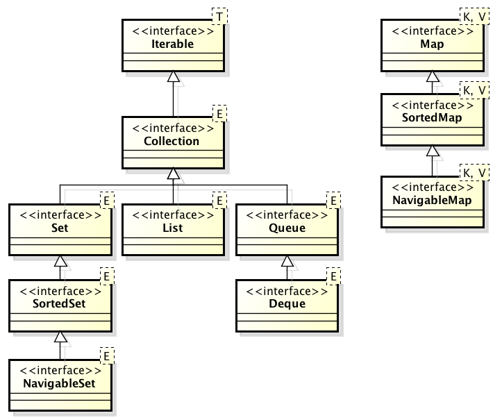

# 5.1 Δομές Δεδομένων {#Java} 
© Γιάννης Κωστάρας

---

[Δ](../../README.md) | [>](../5.2-Lists/README.md)

---
[](5.1-DataStructures.ipynb)


_Δεδομένα (data)_ είναι η αφαιρετική αναπαράσταση της πραγματικότητας και συνεπώς μια απλοποιημένη όψη της. _Πληροφορία (information)_ είναι η συλλογή δεδομένων και ο συσχετισμός τους. _Πληροφορική_ είναι η επιστήμη που μελετά τα δεδομένα κάτω απ’ τις ακόλουθες σκοπιές:

* Υλικού
* Γλωσσών προγραμματισμού
* Δομών Δεδομένων
* Ανάλυσης Δεδομένων

Με τον όρο _Δομή Δεδομένων (data structure)_ εννοούμε ένα σύνολο δεδομένων μαζί μ’ ένα σύνολο επιτρεπτών λειτουργιών στα δεδομένα αυτά. Υπάρχουν τριών ειδών τύποι δεδομένων:

* _υλικού_, π.χ. προσημασμένος ακέραιος σταθερής υποδιαστολής
* _ιδεατοί_, δηλ. τύπους δεδομένων που προσφέρει η γλώσσα προγραμματισμού όπως ```int, boolean``` κλπ.
* _αφηρημένοι_, δηλ. τύποι δεδομένων που δημιουργεί ο προγραμματιστής για ν’ απεικονίσει καλύτερα τα δεδομένα του προβλήματός του.

Μια δομή δεδομένων αποτελείται από τα εξής τρία στοιχεία:

* μια δομή αποθήκευσης
* ένα σύνολο συναρτήσεων που εκτελούν μια λειτουργία στο περιεχόμενο της δομής
* ένα σύνολο από αλγορίθμους, έναν αλγόριθμο ανά συνάρτηση, που περιγράφουν τις λειτουργίες στο περιεχόμενο της δομής.

_Αλγόριθμος_ είναι ένα πεπερασμένο σύνολο εντολών αυστηρά καθορισμένων και εκτελέσιμων σε πεπερασμένο χρόνο για να επιτευχθεί ένα επιθυμητό αποτέλεσμα. 

**Αλγόριθμοι + Δομές Δεδομένων = Προγράμματα** 

Οι βασικές λειτουργίες (ή πράξεις) επί των δομών είναι οι ακόλουθες:

* Προσπέλαση 
* Εισαγωγή
* Διαγραφή
* Αναζήτηση
* Ταξινόμηση
* Αντιγραφή
* Συγχώνευση
* Διαχωρισμός

Δεν χρησιμοποιούνται πάντα όλες οι παραπάνω πράξεις σε όλες τις δομές. Στη συνέχεια αυτής της εβδομάδας θα μελετήσουμε τις διάφορες δομές δεδομένων της γλώσσας προγραμματισμού Java με βάση τις παραπάνω πράξεις. Έχουμε ήδη δει τη δομή δεδομένων _πίνακας (array)_ την 1η εβδομάδα.

Μια δομή δεδομένων αποτελείται από _κόμβους (nodes)_. Ένας _κόμβος_ με τη σειρά του αποτελείται από _πεδία (fields)_ τα οποία διακρίνονται σε _δεδομένα (data)_ και _δείκτες (links)_. Ένας _δείκτης_ δείχνει στη διεύθυνση ενός κόμβου και η διεύθυνση αυτή μπορεί να είναι είτε απόλυτη, είτε σχετική, είτε μια διεύθυνση βάσης. 

Ανάλογα, επομένως, με το πόσους δείκτες διαθέτει μια δομή δεδομένων, μπορούμε να τις ταξινομήσουμε στις ακόλουθες κατηγορίες:

* κανένας δείκτης, δηλ. μόνο δεδομένα ίδιου τύπου (πίνακες)
* ένας δείκτης (γραμμικές λίστες)
* δύο δείκτες (δυαδικά δέντρα)
* περισσότεροι από δύο δείκτες (δέντρα, γράφοι)

Επίσης, θα μιλήσουμε και για τις δυνατότητες αναζήτησης και ταξινόμησης που προσφέρει η γλώσσα.

Η δομή δεδομένων _Πίνακας (array)_ έχει τους εξής περιορισμούς:

* έχει προκαθορισμένο μέγεθος που δεν μπορεί ν' αλλάξει αργότερα και άρα δεν συνίσταται αν δεν γνωρίζουμε εκ των προτέρων τον αριθμό των στοιχείων που θέλουμε ν' αποθηκεύσουμε σ' αυτόν
* μπορεί ν' αποθηκεύσει μόνο στοιχεία ίδιου τύπου

Για να ξεπεραστούν οι ανωτέρω περιορισμοί, η Java δημιούργησε νέες δομές δεδομένων όπως θα δούμε στη συνέχεια. Οι δομές αυτές έχουν τα εξής χαρακτηριστικά:

* Το μέγεθός τους μεταβάλλεται δυναμικά
* Μπορούμε να εισάγουμε οποιοδήποτε τύπο αντικειμένου σε μία τέτοια δομή
* ΔΕΝ υποστηρίζουν εισαγωγή αρχέγονων τύπων (π.χ. ```int```), τα στοιχεία τους μπορούν να είναι μόνο δείκτες σε αντικείμενα. Στην περίπτωση που θέλουμε ν' αποθηκεύσουμε αρχέγονους τύπους σε μια συλλογή χρησιμοποιούμε τις κλάσεις περιτυλίγματα (boxing), π.χ. ```Integer```.

## Δομές Δεδομένων στη Java

Προτού προχωρήσουμε, θα δώσουμε μια σύντομη περιγραφή των δομών δεδομένων που προσφέρει η γλώσσα Java. 



**Εικόνα 5.1.1** _Οι βασικές διεπαφές συλλογών της Java_

Όπως βλέπετε στην παραπάνω εικόνα, αυτές χωρίζονται σε δυο μεγάλες κατηγορίες:

* _Συλλογές (```Collection```s)_ ή _Ακολουθίες (Sequences)_ 
* _Πίνακες κατακερματισμού (```Map```s) ή Συσχετιζόμενοι πίνακες (associative maps)_

Οι συλλογές αποθηκεύουν τα δεδομένα με ακολουθιακό τρόπο και κατηγοριοποιούνται σε:

* _Σύνολα (```Set```s)_ που δεν περιέχουν διπλότυπα, δηλ. την ίδια τιμή πάνω από μια φορά, ενώ δεν έχει σημασία η σειρά των δεδομένων. Η υποδιεπαφή ```SortedSet``` ταξινομεί τα δεδομένα της. Η ```NavigableSet``` διαθέτει μεθόδους που επιτρέπουν να βρείτε το στοιχείο που είναι πιο κοντά σ' ένα στοιχείο που αναζητάτε σ' αυτήν.
* _Λίστες (```List```s)_ όπου η σειρά των δεδομένων έχει σημασία και μπορούν να περιέχουν διπλότυπα
* _Ουρές (```Queue```s)_ που δέχονται δεδομένα από την ουρά τους (tail) και εξάγουν δεδομένα προς επεξεργασία από την κεφαλή τους (head). Η υποδιεπαφή ```Deque``` είναι μια διπλή ουρά, δηλ. επιτρέπει την εισαγωγή/εξαγωγή δεδομένων κι από τα δυο άκρα της.
  
Οι πίνακες κατακερματισμού αποτελούν συσχετίσεις _κλειδιού-τιμής (key-value)_, δηλ. μπορείτε να ανακτάτε την τιμή αν γνωρίζετε το κλειδί. Η υποδιεπαφή ```SortedMap``` εγγυάται ότι θα επιστρέψει τις τιμές με αύξουσα τιμή του κλειδιού, ενώ η ```NavigableMap``` (όπως και η ```NavigableSet```) βρίσκει το κλειδί που είναι πιο κοντά σ' ένα στοιχείο που αναζητάτε σ' αυτήν.

---

[Δ](../../README.md) | [>](../5.2-Lists/README.md)

---