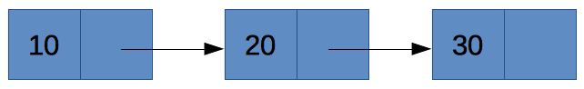

# 5.2 Λίστες {#Java} 
© Γιάννης Κωστάρας

---

[🏠](https://jkost.github.io) | [⬆️](../../README.md) | [◀️](../5.1-DataStructures/README.md) | [▶️](../5.3-Generics/README.md)
 
---

[](5.2-Lists.ipynb)

_Γραμμική λίστα Χ_ είναι ένα πεπερασμένο σύνολο ```n>0``` κόμβων, ```X[0], X[1], ..., X[n-1]``` με την ιδιότητα το στοιχείο ```Χ[0]``` είναι ο πρώτος κόμβος και κάθε κόμβος ```Χ[k]``` προηγείται του ```Χ[k+1]``` και έπεται του κόμβου ```Χ[k-1]```, όπου ```1<k<n-1```. 

Ο πρώτος κόμβος λέγεται _κεφαλή (head)_ ενώ ο τελευταίος _ουρά (tail)_. Η πιο συνηθισμένη μορφή γραμμικής λίστας είναι η _διατεταγμένη γραμμική λίστα_. Οι πίνακες, που εξετάστηκαν στην 2η εβδομάδα, είναι μια μορφή γραμμικής λίστας. Ενδιαφέρον παρουσιάζουν οι λίστες όπου οι εισαγωγές/διαγραφές/προσπελάσεις στους κόμβους γίνονται πάντα είτε στον πρώτο είτε στον τελευταίο κόμβο:

* _στοίβες (stacks)_, όπου η εισαγωγή/εξαγωγή των κόμβων γίνεται από μια μόνο άκρη (LIFO - Last In First Out), όπως ακριβώς και μια στοίβα από πιάτα
* _πολλαπλές στοίβες (multiple stacks)_
* _ουρές (queues)_, όπου η εισαγωγή/εξαγωγή κόμβων γίνεται από διαφορετικά άκρα (FIFO - First In First Out), όπως ακριβώς και σε μια ουρά τραπέζης 
* _διπλές ουρές (double ended queues ή dequeues)_
* _διπλές ουρές μόνο με εισαγωγές (output restricted dequeues)_
* _διπλές ουρές μόνο με εξαγωγές (input restricted dequeues)_

Οι γραμμικές λίστες κατατάσσονται σε δυο κατηγορίες:

* _σειριακές (sequential)_, όπου οι κόμβοι καταλαμβάνουν συνεχόμενες θέσεις μνήμης
* _συνδεδεμένες (linked)_, όπου οι κόμβοι καταλαμβάνουν απομακρυσμένες θέσεις μνήμης συνδεδεμένες μεταξύ τους με δείκτες.

Όλα τα είδη γραμμικών λιστών μπορούν να υλοποιηθούν και με τους δυο παραπάνω τρόπους, δηλ. και ως σειριακές και ως συνδεδεμένες. 

Επίσης, οι γραμμικές λίστες κατατάσσονται και ως:

* _στατικές_, δηλ. έχει προκαθοριστεί η ακριβής χωρητικότητα της κύριας μνήμης που απαιτείται για την αποθήκευση των κόμβων τους
* _δυναμικές_, δηλ. καταλαμβάνουν μεταβλητό χώρο στη μνήμη καθώς επιτρέπεται η επέκταση/συρρίκνωση τους κατά τη διάρκεια του προγράμματος.

Οι πίνακες που είδαμε την 1η εβδομάδα είναι _σειριακές_ δομές δεδομένων (οι κόμβοι τους καταλαμβάνουν συνεχόμενες θέσεις μνήμης) και _στατικές_, αφού πρέπει να προκαθορίσουμε την ακριβή χωρητικότητα μνήμης που απαιτείται για την αποθήκευση των κόμβων τους.

## Λίστες Πινάκων (```ArrayList```)
Το γεγονός ότι ο πίνακας είναι μια στατική δομή δεδομένων δημιουργεί πολλούς περιορισμούς στην ανάπτυξη προγραμμάτων όταν χρειαζόμαστε μια δυναμική δομή, δηλ. μια δομή που το μέγεθός της μπορεί ν' αλλάζει δυναμικά. Η κλάση ```ArrayList``` διορθώνει αυτόν τον περιορισμό. Κληρονομεί από τη διεπαφή ```List```.


**Εικόνα 5.2.1** _Λίστες στη Java_

```java
jshell> List array = new ArrayList();
array ==> []

jshell> array.add(10);
|  Warning:
|  unchecked call to add(E) as a member of the raw type java.util.List
|  array.add(10)
|  ^-----------^
$1 ==> true

jshell> array.add(20);
$2 ==> true

jshell> array.add(30);
$3 ==> true

jshell> array
array ==> [10, 20, 30]

jshell> array.size()
$4 ==> 3
```

Στο πιο πάνω παράδειγμα, δημιουργήσαμε μια νέα ```ArrayList``` και προσθέσαμε 3 αριθμούς σ' αυτή. Θα δούμε πως θα εξαφανίσουμε την προειδοποίηση (warning) που εμφανίζεται στο επόμενο μάθημα. Τέλος καλέσαμε τη μέθοδο ```size()``` για να δούμε το μέγεθός της. Όπως ίσως παρατηρήσατε, δεν απαιτείται να δώσουμε κάποιο μέγεθος στην ```ArrayList```. Αυτή μεγαλώνει αυτόματα καθώς προσθέτουμε στοιχεία σ' αυτή.

Θα μπορούσαμε ν' αρχικοποιήσουμε την παραπάνω λίστα και ως εξής:

```java
jshell> List array1 = List.of(10, 20, 30);
array1 = [10, 20, 30]

jshell> List array2 = Arrays.asList(10, 20, 30);
array2 = [10, 20, 30]
```

Προσοχή όμως. Και στις δυο αυτές περιπτώσεις επιστρέφεται μια λίστα στην οποία _δεν_ μπορούμε να προσθαφαιρέσουμε στοιχεία μετά τη δημιουργία της. Επιπλέον, δεν επιτρέπονται ```null``` στοιχεία.

```java
jshell> array1.add(40)
|  Warning:
|  unchecked call to add(E) as a member of the raw type java.util.List
|  array1.add(40)
|  ^------------^
|  Exception java.lang.UnsupportedOperationException
|        at ImmutableCollections.uoe (ImmutableCollections.java:142)
|        at ImmutableCollections$AbstractImmutableCollection.add (ImmutableCollections.java:147)
|        at (#3:1)

jshell> array2.add(40)
|  Warning:
|  unchecked call to add(E) as a member of the raw type java.util.List
|  array2.add(40)
|  ^-----------^
|  java.lang.UnsupportedOperationException thrown
|        at AbstractList.add (AbstractList.java:153)
|        at AbstractList.add (AbstractList.java:111)
|        at (#43:1)
```
Όμως, ενώ η λίστα που δημιουργήθηκε με τη `List.of()` είναι πραγματικά αμετάβλητη, εκείνη που δημιουργήθηκε με την `Arrays.asList()` δεν είναι, αν και δεν μπορούμε να προσθαφαιρέσουμε άλλα στοιχεία μετά τη δημιουργία της.
```java
jshell> array1.set(1, 40);
|  Warning:
|  unchecked call to set(int,E) as a member of the raw type java.util.List
|  array1.set(1, 40);
|  ^---------------^
|  Exception java.lang.UnsupportedOperationException
|        at ImmutableCollections.uoe (ImmutableCollections.java:142)
|        at ImmutableCollections$AbstractImmutableList.set (ImmutableCollections.java:260)
|        at (#5:1)

jshell> array1
array1 ==> [10, 20, 30]

jshell> array2.set(1, 40);
|  Warning:
|  unchecked call to set(int,E) as a member of the raw type java.util.List
|  array2.set(1, 40);
|  ^---------------^
$6 ==> 20

jshell> array2
array2 ==> [10, 40, 30]
```

Για να μπορέσουμε να δημιουργήσουμε μια μεταβαλλόμενη λίστα σ' αυτή την περίπτωση, πρέπει να χρησιμοποιήσουμε την μέθοδο κατασκευής της ```ArrayList``` που δέχεται μια άλλη συλλογή:

```java
jshell> List array = new ArrayList(Arrays.asList(10, 20, 30));
|  Warning:
|  unchecked call to ArrayList(java.util.Collection<? extends E>) as a member of the raw type java.util.ArrayList
|  List array = new ArrayList(Arrays.asList(10, 20, 30));
|               ^--------------------------------------^
array ==> [10, 20, 30]

jshell> array.add(40)
|  Warning:
|  unchecked call to add(E) as a member of the raw type java.util.List
|  array.add(40)
|  ^-----------^
$5 ==> true

jshell> array
array ==> [10, 20, 30, 40]
```

Η ```ArrayList``` κληρονομεί από τη διεπαφή ```List``` η οποία με τη σειρά της κληρονομεί από την ```Collection```.


**Εικόνα 5.2.2** _Διεπαφή ```Collection```_


**Εικόνα 5.2.3** _Διεπαφή ```List```_

Μπορείτε να μετατρέψετε τις συλλογές στον αντίστοιχο πίνακα με τις παρακάτω εντολές:

```java
jshell> Object[] a = array.toArray()
a ==> Object[3] { 10, 20, 30 }

jshell> Object[] a = array.toArray(new Integer[3]);
|  Warning:
|  unchecked call to <T>toArray(T[]) as a member of the raw type java.util.List
|  Object[] a = array.toArray(new Integer[3]);
|               ^---------------------------^
a ==> Integer[3] { 10, 20, 30 }

jshell> Object[] a = array.toArray(new Integer[0]);
|  Warning:
|  unchecked call to <T>toArray(T[]) as a member of the raw type java.util.List
|  Object[] a = array.toArray(new Integer[0]);
|               ^---------------------------^
a ==> Integer[3] { 10, 20, 30 }

jshell> Integer[] a = (Integer[])array.toArray(new Integer[3]);
|  Warning:
|  unchecked call to <T>toArray(T[]) as a member of the raw type java.util.List
|  Integer[] a = (Integer[])array.toArray(new Integer[3]);
|                           ^---------------------------^
a ==> Integer[3] { 10, 20, 30 }

jshell> int[] a = array.toArray(new int[0]);
|  Error:
|  no suitable method found for toArray(int[])
|      method java.util.Collection.toArray(java.util.function.IntFunction) is not applicable
|        (argument mismatch; int[] cannot be converted to java.util.function.IntFunction)
|      method java.util.List.toArray(java.lang.Object[]) is not applicable
|        (argument mismatch; int[] cannot be converted to java.lang.Object[])
|  int[] a = array.toArray(new int[0]);
|            ^-----------^
```

_Προσοχή! Δεν υπάρχει άμεσος τρόπος μετατροπής σε έναν πίνακα πρωτογενούς τύπου, π.χ. ```int[]```, με την ```toArray()```. Πώς θα μπορούσατε να κάνετε αλλοιώς την μετατροπή;_

Στη συνέχεια θα δούμε τις διάφορες μεθόδους της κλάσης.

### Προσπέλαση στοιχείων
Παρακάτω βλέπουμε 4 τρόπους προσπέλασης των στοιχείων μιας λίστας. Για να προσπελάσουμε κάποιο στοιχείο της λίστας αν γνωρίζουμε το δείκτη του:

```java
jshell> array.get(0);
$6 ==> 10
```

Ο κλασικός τρόπος προσπέλασης των στοιχείων της λίστας:
```java
jshell> int sum = 0;
sum ==> 0

jshell> for (int i=0; i < array.size(); i++)
	...>    sum += (int)array.get(i);

jshell> sum
sum ==> 60
```
Παρατηρήστε ότι τα στοιχεία της λίστας αποθηκεύονται ως τύπου ```Object``` οπότε θα πρέπει να κάνουμε cast στον σωστό τύπο δεδομένων όταν τα προσπελάζουμε. 

Ο παραπάνω τρόπος προσπέλασης των στοιχείων της λίστας έχει το μειονέκτημα ότι εκθέτει τον εσωτερικό τρόπο αποθήκευσης των δεδομένων (δηλ. ότι η δομή ```ArrayList``` χρησιμοποιεί δείκτες εσωτερικά). Ο ακόλουθος τρόπος, με τη χρήση επαναλήπτη (iterator), 'κρύβει' τις λεπτομέρειες υλοποίησης της συλλογής και δείχνει έναν πιο καθολικό τρόπο προσπέλασης των δεδομένων. Παρατηρήστε ότι και πάλι πρέπει να κάνουμε cast στο σωστό τύπο δεδομένων.

```java
jshell> int sum = 0
sum ==> 0

jshell> Iterator iter = array.iterator();
iter ==> java.util.Arrays$ArrayItr@13805618

jshell> while (iter.hasNext()) 
	...>    sum += (int)iter.next();
```

Η διεπαφή ```Collection``` επεκτείνει τη διεπαφή ```Iterable```:
```java
interface Iterable {
	Iterator iterator();
}

interface Iterator {
	boolean hasNext();
	Object next();
	void remove();
}
```

Παρωχημένες (legacy) λίστες όπως η ```Vector``` χρησιμοποιούσαν ένα ```Enumeration``` για να προσπελάσουν τα στοιχεία τους. 

```java
interface Enumeration {
	boolean hasMoreElements();
	Object nextElement();
}
```

Αποφύγετε τη χρήση του και χρησιμοποιήστε στη θέση του τον ```Iterator```.

Τόσο ο ```Enumeration``` όσο και ο ```Iterator``` μπορούν να προσπελάσουν μια λίστα μόνο προς τη μια κατεύθυνση. Ο ```ListIterator``` προσφέρει περισσότερη ευελιξία:

```java
interface ListIterator {
	boolean hasNext();
	Object next();
	int nextIndex();
	
	boolean hasPrevious();
	Object previous();
	int previousIndex();	
	
	void remove();
	void set(Object newObj);
	void add(Object newObj);
}
```

Τέλος, με τον αναβαθμισμένο βρόγχο ```for``` που εισήχθηκε στην έκδοση 5:

```java
jshell> sum = 0
sum ==> 0

jshell> for (final Object n : array) 
	...>    sum += (int)n;
```

Στο επόμενο μάθημα θα δούμε πώς μπορούμε να ξεφορτωθούμε το casting. Καλό είναι να δηλώνετε τη μεταβλητή του βρόγχου ως ```final``` ώστε ν' αποφεύγετε κατά λάθος ή επίτηδες καταχώρηση τιμής στη μεταβλητή του βρόγχου (βλ. [DCL02-J. Declare all enhanced for statement loop variables final](https://wiki.sei.cmu.edu/confluence/display/java/DCL02-J.+Do+not+modify+the+collection's+elements+during+an+enhanced+for+statement)).

Μεγάλη προσοχή χρειάζεται όταν προσπελάζουμε τα στοιχεία μιας λίστας, και γενικότερα μιας συλλογής. Αν καθώς προσπελάζουμε τα στοιχεία, η λίστα (συλλογή) αλλάξει (π.χ. προστεθούν ή διαγραφούν στοιχεία σ' αυτή), προκαλείται ```ConcurrentModificationException```:

```java
jshell> Collection list = new ArrayList<>();
list ==> []

jshell> for (int i = 0; i<3; i++) list.add(i);

jshell> list
list ==> [0, 1, 2]

jshell> Iterator i = list.iterator();
i ==> java.util.ArrayList$Itr@553f17c

jshell> i.next();
$5 ==> 0

jshell> i.next();
$6 ==> 1

jshell> list.add(3);
$7 ==> true

jshell> i.next();
|  Exception java.util.ConcurrentModificationException
|        at ArrayList$Itr.checkForComodification (ArrayList.java:1042)
|        at ArrayList$Itr.next (ArrayList.java:996)
|        at (#8:1)
```

### Εισαγωγή στοιχείων
Όπως είδαμε, η εισαγωγή δεδομένων στο τέλος της λίστας γίνεται με την μέθοδο ```add()```. Η μέθοδος επιστρέφει ```true``` αν η εισαγωγή του στοιχείου ήταν επιτυχής, αλλοιώς επιστρέφει ```false```. Υπάρχει και η ακόλουθη έκδοση της μεθόδου που μας επιτρέπει να εισάγουμε ένα στοιχείο σε μια συγκεκριμένη θέση της λίστας.

```java
jshell> array.add(1, 15)
|  Warning:
|  unchecked call to add(int,E) as a member of the raw type java.util.List
|  array.add(1, 15)
|  ^--------------^

jshell> array
array ==> [10, 15, 20, 30]
```
Η παραπάνω μέθοδος εισάγει ένα νέο στοιχείο (```15```) στη 2η θέση (```1```) της λίστας ```array```. Αυτό σημαίνει ότι τα υπόλοιπα στοιχεία της λίστας (δεξιά του δεύτερου στοιχείου) μετακινούνται δεξιότερα κατά μια θέση για ν' αφήσουν χώρο για το νέο στοιχείο.

Με τις μεθόδους ```addAll(Collection c)``` και ```addAll(int i, Collection c)``` μπορούμε να προσθέσουμε με τη μια μια συλλογή από στοιχεία στη λίστα μας.

Υπάρχει και η μέθοδος ```set(int i, E e)``` που αντικαθιστά το στοιχείο στη θέση ```i``` με το νέο στοιχείο ```e``` και επιστρέφει το προηγούμενο στοιχείο στη θέση ```i```.

```java
jshell> array.set(3, 25)
|  Warning:
|  unchecked call to set(int,E) as a member of the raw type java.util.List
|  array.set(3, 25)
|  ^--------------^
$7 ==> 30

jshell> array
array ==> [10, 15, 20, 25]
```

### Διαγραφή στοιχείων
Η μέθοδος ```remove(int i)``` διαγράφει το στοιχείο της λίστας στη θέση ```i``` και επιστρέφει το στοιχείο που διέγραψε από τη λίστα. Υπάρχει όμως και η μέθοδος ```remove(Object o)``` η οποία διαγράφει το πρώτο στοιχείο που θα βρει που είναι ίσο με το ```ο``` και επιστρέφει ```true``` αν τα κατάφερε.

Εδώ χρειάζεται μεγάλη προσοχή όταν διαθέτουμε λίστες τα στοιχεία των οποίων είναι ```Integer```. Καλώντας π.χ. ```remove(25)```, ποια από τις δυο παραπάνω εκδόσεις καλείται, η ```remove(int i)``` ή η ```remove(Object o)```;

```java
jshell> array.remove(15)
|  java.lang.IndexOutOfBoundsException thrown: Index 15 out-of-bounds for length 3
|        at Preconditions.outOfBounds (Preconditions.java:64)
|        at Preconditions.outOfBoundsCheckIndex (Preconditions.java:70)
|        at Preconditions.checkIndex (Preconditions.java:248)
|        at Objects.checkIndex (Objects.java:372)
|        at ArrayList.remove (ArrayList.java:517)
|        at (#57:1)
```

Όπως καταλαβαίνετε από το λάθος της παραπάνω κλήσης, καλείται η ```remove(int i)```. Καθώς δεν υπάρχει 16ο στοιχείο, εμφανίζεται το λάθος ```IndexOutOfBoundsException```. Γιατί η Java προτιμάει την ```remove(int i)``` από την ```remove(E e)```; Η ```remove(int i)``` αποτελεί μέρος της ```List``` ενώ η ```remove(E e)``` της υπερκλάσης ```Collection```, επομένως η ```ArrayList``` πρώτα ψάχνει στην πιο κοντινή της κλάσης/διεπαφή από την οποία κληρονομεί.

Πώς θα μπορούσαμε σ' αυτή την περίπτωση να καλέσουμε τη σωστή μέθοδο;

```java
jshell> array.remove((Integer)15)
$8 ==> true 
```

Επίσης, πολύ μεγάλη προσοχή χρειάζεται αν διαγράφετε στοιχεία από μια λίστα ενώ προσπελάζετε τα στοιχεία της:

```java
jshell> array
array ==> [5, 10, 20, 30]

jshell> for (int i=0; i < array.size(); i++) 
   ...> if ((int)array.get(i) == 5)
   ...> array.remove(i)
   
jshell> array
array ==> [10, 20, 30]

jshell> for (Iterator i = array.iterator(); i.hasNext(); ) {
   ...> int n = (int)i.next(); 
   ...> if (n == 10) i.remove();
   ...> }

jshell> array
array ==> [20, 30]

jshell> for (Object n : array) {
   ...>     if ((int)n == 30) array.remove((Integer)n) ;
   ...> }
|  Exception java.util.ConcurrentModificationException
|        at ArrayList$Itr.checkForComodification (ArrayList.java:1013)
|        at ArrayList$Itr.next (ArrayList.java:967)
|        at (#6:1)

jshell> array
array ==> [20]
```

Τέλος, η διεπαφή ```Collection``` παρέχει και τις ακόλουθες δυο μεθόδους οι οποίες μπορούν να διαγράψουν με τη μία από τη λίστα μας όλα τα στοιχεία της παρεχόμενης συλλογής ```c``` (```removeAll(Collection c)```) και επιστρέφει ```true``` αν τα κατάφερε (αν δεν κατάφερε να διαγράψει έστω και ένα από τα στοιχεία της ```c``` από τη λίστα μας, τότε επιστρέφει ```false```).

Η ```retainAll(Collection c)``` κρατάει από τη λίστα μας μόνο τα στοιχεία που περιέχονται στη ```c``` και διαγράφει όλα τα υπόλοιπα. 

### Αναζήτηση στοιχείων
Όπως οι πίνακες διαθέτουν τη βοηθητική κλάση ```java.util.Arrays```, έτσι και οι συλλογές διαθέτουν τη δική τους βοηθητική κλάση ```Collections```.
```java
jshell> array 
array ==> [10, 20, 30]

jshell> array.contains(10)
$9 ==> true

jshell> Collections.binarySearch(array, 30); 
$10 ==> 2
```
Η ```binarySearch()``` επιστρέφει τον δείκτη αν βρέθηκε, ή έναν αρνητικό αριθμό (```-(insertion point) - 1```) αν δε βρέθηκε. Η ```binarySearch()``` απαιτεί η συλλογή να είναι ταξινομημένη για να επιστρέψει σωστά αποτελέσματα (βλ. παρακάτω).

**Άσκηση:** πώς θα μπορούσατε να κάνετε αναζήτηση χωρίς τη χρήση της παραπάνω μεθόδου;

**Σημείωση:** Το αν η ```contains()``` επιστρέψει σωστά αποτελέσματα ή όχι εξαρτάται αν έχετε υλοποιήσει σωστά τη ```hashCode()```.

### Ταξινόμηση λίστας
```java
jshell> array
array ==> [10, 20, 30, 5]

jshell> Collections.sort(array); // με αριθμητική σειρά

jshell> array
array ==> [5, 10, 20, 30]

jshell> Collections.sort(array, Collections.reverseOrder())

jshell> array
array ==> [30, 20, 10, 5]
```

Από την έκδοση 8 και μετά, μια μέθοδος ```sort()``` προστέθηκε στην διεπαφή ```List```: ```void List.sort(Comparator c)``` η οποία δέχεται έναν ```Comparator``` (βλ. παρακάτω για μια επεξήγηση των κλάσεων ```Comparator``` και ```Comparable```):

```java
jshell> array
src ==> [10, 20, 5, 30]

jshell> array.sort(Comparator.naturalOrder())

jshell> array
array ==> [5, 10, 20, 30]

jshell> array.sort(Comparator.reverseOrder())

jshell> array
array ==> [30, 20, 10, 5]
```

#### Σύγκριση διεπαφών ```Comparator``` και ```Comparable```
Η Java διαθέτει δυο επαφές που μοιάζουν πολύ μεταξύ τους.

```java
interface Comparable {
	int compareTo(Object o);	
}
```
Π.χ.
```java
obj1.compareTo(obj2);
```

Η μέθοδος αυτή επιστρέφει:

* ```<0``` αν το ```obj1 < obj2```
* ```0``` αν ```obj1 == obj2```
* ```>0``` αν το ```obj1 > obj2```

```java
jshell> "a".compareTo("c")
$1 ==> -2

jshell> "c".compareTo("a")
$2 ==> 2

jshell> "a".compareTo("a")
$3 ==> 0
```
Η διεπαφή αυτή περιγράφει την φυσική σειρά των αντικειμένων. Π.χ. ```1<2``` και ```"α"<"β"```. Θα πρέπει να ικανοποιεί και τους παρακάτω κανόνες (εκτός τους τρεις πιο πάνω):

* ```obj1.compareTo(obj2) == -obj2.compareTo(obj1)```
* μεταβατικότητα: π.χ. αν ```obj1.compareTo(obj2) == 0``` και ```obj2.compareTo(obj3) == 0``` τότε ```obj1.compareTo(obj3) == 0```
* ```x.compareTo(y) == 0``` σημαίνει ότι ```x.compareTo(z) == y.compareTo(z)``` για όλα τα ```z```
* αν ```obj1.compareTo(obj2) == 0``` τότε ```obj1.equals(obj2)``` (συνίσταται αλλά όχι υποχρεωτικά)

Αν όμως θέλουμε να ταξινομήσουμε αντικείμενα όχι με τη φυσική σειρά τους, αλλά με κάποια άλλη σειρά, τότε χρησιμοποιούμε έναν ```Comparator```:

```java
interface java.util.Comparator {
	int compare(Object o1, Object o2);
	boolean equals(Object o);
	Comparator naturalOrder();
	Comparator reversed();
	Comparator reverseOrder();
}
```
Ας δούμε ένα παράδειγμα για να κατανοήσουμε τις διαφορές τους καλύτερα:

```java
public class Student implements Comparable {
    private final long am;    	// Αριθμός Μητρώου
    private final String name;
    private int grade;

    public Student(long am, String name, int grade) {
        this.am = am;
        this.name = name;
        this.grade = grade;
    }

    public long getAm() {
        return am;
    }

    public String getName() {
        return name;
    }

    public int getGrade() {
        return grade;
    }

    public void setGrade(int grade) {
        this.grade = grade;
    }
    
    @Override
    public String toString() {
       return "Student {am = " + am + ", name = " + name + ", grade = " + grade + "}";   
    }

    @Override
    public int compareTo(Object o) {
        Student otherStudent = (Student)o;
        if (this.am == otherStudent.am)
            return 0;
        else if (this.am < otherStudent.am)
            return -1;
        else
            return 1;
    }
}

class StudentNameComparator implements Comparator {
    @Override
    public int compare(Object o1, Object o2) {
        Student s1 = (Student)o1;
        Student s2 = (Student)o2;
        return s1.getName().compareTo(s2.getName());
    }
}

class StudentGradeComparator implements Comparator {
    @Override
    public int compare(Object o1, Object o2) {
        Student s1 = (Student)o1;
        Student s2 = (Student)o2;
        return Integer.compare(s1.getGrade(), s2.getGrade());
    }
}

jshell> Student s1 = new Student(1, "Παπαμιχαήλ Δημήτριος", 16);
s1 ==> Student {am = 1, name = Παπαμιχαήλ Δημήτριος, grade = 16}

jshell> Student s2 = new Student(2, "Βουγιουκλάκη Αλίκη", 10);
s2 ==> Student {am = 2, name = Βουγιουκλάκη Αλίκη, grade = 10}

jshell> List students = new ArrayList(List.of(s1, s2));
|  Warning:
|  unchecked call to ArrayList(java.util.Collection<? extends E>) as a member of the raw type java.util.ArrayList
|  List students = new ArrayList(List.of(s1, s2));
|                  ^----------------------------^
students ==> [Student {am = 1, name = Παπαμιχαήλ Δημήτριος, gr ... υκλάκη Αλίκη, grade = 10}]

jshell> students.sort(new StudentNameComparator());
   ...> students
students ==> [Student {am = 2, name = Βουγιουκλάκη Αλίκη, grade = 10}, Student {am = 1, name = Παπαμιχαήλ Δημήτριος, grade = 16}]

jshell> Collections.sort(students, new StudentGradeComparator().reversed());
   ...> students
students ==> [Student {am = 1, name = Παπαμιχαήλ Δημήτριος, grade = 16}, Student {am = 2, name = Βουγιουκλάκη Αλίκη, grade = 10}]
```
Αν θέλουμε να ταξινομήσουμε τους μαθητές με βάση το όνομά τους κι όχι με τον αριθμό μητρώου τους, τότε χρησιμοποιούμε έναν ```Comparator```. Σημειώστε ότι ο ```Comparator``` χρησιμοποιεί την μέθοδο ```compareTo()``` της κλάσης ```String``` η οποία υλοποιεί τη διεπαφή ```Comparable```.

Μπορείτε να πειραματιστείτε περαιτέρω εδώ <a href="sandbox/student.html" target="_blank"></a>.

### Αντιγραφή λιστών
Ήδη είδαμε τον copy constructor ```ArrayList(Collection c)``` που δημιουργεί μια νέα ```ArrayList``` από τη συλλογή που της περνάμε ως όρισμα.

Η ```void Collections.copy(List dest, List src)``` αντιγράφει τη λίστα ```src``` στη ```dest``` αλλά απαιτεί το μέγεθος της ```dest``` να είναι τουλάχιστο όσο και της ```src``` ώστε να τη χωρέσει. Μπορείτε να δοκιμάσετε το παρακάτω:

```java
jshell>List dest = new ArrayList(array.size());
dest ==> []

jshell> Collections.copy (dest, array);
|  Warning:
|  unchecked method invocation: method copy in class java.util.Collections is applied to given types
|    required: java.util.List<? super T>,java.util.List<? extends T>
|    found: java.util.List,java.util.List<java.lang.Integer>
|  Collections.copy (dest, array)
|  ^----------------------------^
|  Warning:
|  unchecked conversion
|    required: java.util.List<? super T>
|    found:    java.util.List
|  Collections.copy (dest, array)
|                    ^--^
|  java.lang.IndexOutOfBoundsException thrown: Source does not fit in dest
|        at Collections.copy (Collections.java:558)
|        at (#71:1)
```
Αυτό συμβαίνει επειδή η αρχικοποίηση της ```dest``` ορίζει τη _χωρητικότητα (capacity)_ να είναι όση και της ```array``` όχι το _μέγεθος (size)_. Στην προκειμένη περίπτωση η χωρητικότητα της ```dest``` είναι 4, όση και της ```array``` αλλά το μέγεθός της είναι 0 γιατί δεν περιέχει κανένα στοιχείο. Πρέπει να κάνουμε κάτι ακόμα: 

```java
List dest = new ArrayList(array.size());
//Collections.fill(dest, 0);   δεν θα δουλέψει επειδή το dest.size() == 0
for (int i=0; i<array.size(); i++) dest.add(0);
Collections.copy (dest, array);
jshell> dest
dest ==> [30, 20, 10, 5]
```

Γι' αυτό το λόγο δεν αξίζει να την χρησιμοποιήσετε. Εκτός από τον copy constructor υπάρχει και η ```addAll()```:
```java
List dest = new ArrayList(array.size());
dest.addAll(array);
jshell> dest
dest ==> [30, 20, 10, 5]
```

Η μέθοδος ```List sublist(int fromIndex, int toIndex)``` επιστρέφει μια λίστα με τα στοιχεία της λίστας μεταξύ των δεικτών ```[fromIndex, toIndex)```.

### Συγχώνευση λιστών
Σαν άσκηση, γράψτε ένα πρόγραμμα στο jshell που θα συγχωνεύει δυο ταξινομημένες λίστες με ακέραια στοιχεία σε μια νέα λίστα η οποία θα διατηρεί την ταξινόμηση των ακεραίων στοιχείων της.

### Διαχωρισμός λιστών
Σαν άσκηση, γράψτε ένα πρόγραμμα στο jshell που θα διαχωρίζει μια λίστα με ακέραια στοιχεία σε δυο νέες λίστες που η μία θα φυλάσσει τα ζυγά και η άλλη τα μονά στοιχεία της αρχικής λίστας.

### Ισότητα λιστών
```java
jshell> src
src ==> [1, 2, 3, 4, 5]

jshell> dest
dest ==> [1, 2, 3, 4, 5]

jshell> dest.equals(src); 
$11 ==> true
```

## Συνδεδεμένες Λίστες (Linked List)

Κοινό χαρακτηριστικό των δομών που εξετάστηκαν στα προηγούμενα κεφάλαια είναι ότι οι διαδοχικοί κόμβοι των δομών αποθηκεύονται σε συνεχόμενες θέσεις της κύριας μνήμης. Οι δομές αυτές παρουσιάζουν προβλήματα τόσο στην εισαγωγή όσο και τη διαγραφή κόμβων (με εξαίρεση τον πρώτο και τον τελευταίο κόμβο) όσο και στην αποδοτική εκμετάλλευση της διαθέσιμης μνήμης. Στην ενότητα αυτή θα παρουσιαστούν οι _συνδεδεμένες λίστες_ ως μια εναλλακτική αποτελεσματική υλοποίηση των σειριακών λιστών.

Κύριο χαρακτηριστικό των συνδεδεμένων λιστών είναι ότι οι κόμβοι τους συνήθως βρίσκονται σε απομακρυσμένες θέσεις μνήμης και η σύνδεσή τους γίνεται με _δείκτες_. Έτσι διευκολύνονται οι λειτουργίες της εισαγωγής και της διαγραφής δεδομένων στις λίστες. Όταν η υλοποίησή τους γίνεται έτσι ώστε να μην απαιτείται εκ των προτέρων καθορισμός του μέγιστου αριθμού κόμβων της λίστας, τότε οι συνδεδεμένες λίστες λέγονται _δυναμικές_ επειδή επιτρέπουν την επέκταση και τη συρρίκνωσή τους κατά τη διάρκεια εκτέλεσης του προγράμματος.

Οι παλαιότερες γλώσσες προγραμματισμού (όπως οι FORTRAN, COBOL κλπ.) δεν υποστηρίζουν δυναμικές δομές γιατί δεν προσφέρουν τη δυνατότητα δυναμικής επέκτασης και συρρίκνωσης των δομών κατά την εκτέλεση του προγράμματος. 

```java
jshell> List list = new LinkedList();
list ==> []
jshell> list.add(10);
jshell> list.add(20);
jshell> list.add(30);
jshell> list
list ==> [10, 20, 30]
jshell> list.size()
$12 ==> 3
```



**Εικόνα 5.2.4** _Παράδειγμα συνδεδεμένης λίστας_

```java
jshell> List list = new LinkedList(Arrays.asList(10,20,30,40));
list ==> [10, 20, 30, 40]
```

Βέβαια, στην πραγματικότητα η ```LinkedList``` είναι μια διπλή συνδεδεμένη λίστα όπως φαίνεται στην ακόλουθη εικόνα:


**Εικόνα 5.2.5** _Παράδειγμα συνδεδεμένης λίστας_

Οι πράξεις στις συνδεδεμένες λίστες είναι ίδιες με αυτές της λίστας πίνακα.

## Σύγκριση ```ArrayList``` και ```LinkedList```

Σύγκριση απόδοσης ```ArrayList``` και ```LinkedList```

| | ```get``` | ```add``` |  ```contains``` | ```next``` | ```remove(0)``` | ```iterator.remove```
| ```ArrayList```  | O(1) | O(1) | O(n) | O(1) | O(n) | O(n)
| ```LinkedList``` | O(n) | O(1) | O(n) | O(1) | O(1) | O(1)

Αν η εφαρμογή σας προσθέτει/διαβάζει/διαγράφει στοιχεία από/στο τέλος της λίστας, τότε καλύτερη απόδοση έχει η ```ArrayList``` από την ```LinkedList```, διαφορετικά η ```LinkedList``` συμπεριφέρεται πιο αποδοτικά.

## Παρωχημένες Λίστες (Legacy lists)
Πρόκειται για δομές δεδομένες που κληρονομήθηκαν από παλαιότερες εκδόσεις της Java, αλλά που δε συνίσταται να τις χρησιμοποιείτε στην πλειονότητα των περιπτώσεων:

* ```Vector``` προτιμήστε την ```ArrayList``` η οποία είναι πιο αποδοτική
* ```Stack``` κληρονομεί από την ```Vector``` και υλοποιεί τη δομή δεδομένων _Στοίβα_ ή _LIFO (Last-In-First-Out)_. 

## Ασκήσεις
1. [Γράψτε ένα πρόγραμμα Java στο οποίο αποθηκεύετε σε μια λίστα τις ακέραιες τιμές ```2, 4, 3, 6, 1, 9``` και το πρόγραμμα υπολογίζει και εκτυπώνει:](https://codecheck.io/files/23121618087t98zvdm8hfytc1ywk8g7kw3z) 
   ```
   Sum of even numbers is 12
   Product of odd numbers is 27
   ``` 
1. [Ένα πολυώνυμο μπορεί να παρασταθεί ως μια κλάση που περιέχει δυο γνωρίσματα: το βαθμό n του πολυωνύμου και μια λίστα που περιέχει τους συντελεστές του. Η κλάση αυτή θα διαθέτει τις εξής μεθόδους: ανάγνωση πολυωνύμου, άθροισμα δυο πολυωνύμων, πολλ/σμός δυο πολυωνύμων, εμφάνιση ενός πολυωνύμου στη μορφή: ```Pn(x) = a(0) + a(1)x + a(2)x^2 + ... + a(n)x^n```, υπολογισμός της τιμής του πολυωνύμου για μια τιμή ```x```.](https://codecheck.io/files/2407131300873ruquunt9mqlfu7cpw2gru)

---

[🏠](https://jkost.github.io) | [⬆️](../../README.md) | [◀️](../5.1-DataStructures/README.md) | [▶️](../5.3-Generics/README.md)

---