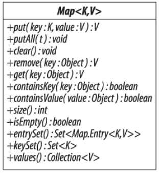
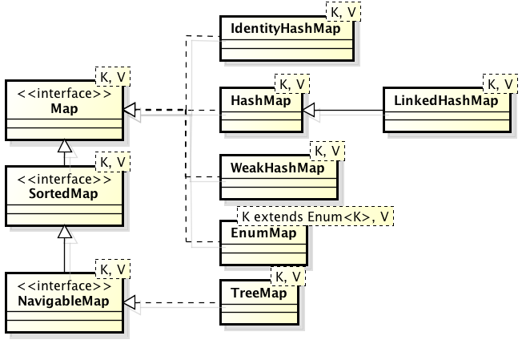
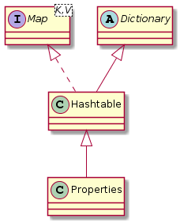

# 5.6 Πίνακες Κατακερματισμού (Maps) {#Java} 
© Γιάννης Κωστάρας

---

[🏠](https://jkost.github.io) | [⬆️](../../README.md) | [◀️](../5.5-Queues/README.md) | [▶️](../5.7-OtherCollections/README.md)
 
---
[](5.6-Maps.ipynb)

Ο πίνακας κατακερματισμού (```Map```) είναι η μόνη δομή δεδομένων που δεν κληρονομεί από την ```Collection```. Ονομάζεται και πίνακας συσχέτισης καθώς συσχετίζει κλειδιά με τιμές. Τα κλειδιά είναι μοναδικά, δηλ. δεν μπορούμε να έχουμε το ίδιο κλειδί δυο φορές.




**Εικόνα 5.6.1** _Η διεπαφή Map της Java_



**Εικόνα 5.6.2** _Πίνακες κατακερματισμού στη Java_

```java
jshell> Map<String, Integer> map = new HashMap<>();
map ==> {}
```
Μέθοδοι κατασκευής:

* ```HashMap() 	// δημιουργεί έναν άδειο πίνακα κατακερματισμού```
* ```HashMap(Map<? extends K,? extends V> map)	// δημιουργεί ένα νέο πίνακα κατακερματισμού από τον map```
* ```HashMap(int initialCapacity)	// δημιουργεί έναν άδειο πίνακα κατακερματισμού με αρχικό μέγεθος initialCapacity```
* ```HashMap(int initialCapacity, float loadFactor)	// δημιουργεί έναν άδειο πίνακα κατακερματισμού με αρχικό μέγεθος initialCapacity και το ποσοστό loadFactor μετά το οποίο θα ανακατανεμηθεί (rehash) ο πίνακας κατακερματισμού```

### Εισαγωγή στοιχείων
Η κλάση ```Map``` διαθέτει τις εξής μεθόδους για εισαγωγή στοιχείων στον πίνακα κατακερματισμού: 

* ```V put (K key, V value)     // προσθέτει ή αντικαθιστά την τιμή του κλειδιού key με τη νέα τιμή value και επιστρέφει την παλιά τιμή, ή null αν το κλειδί δεν υπήρχε```
* ```V putIfAbsent(K key, V value)		// συσχετίζει το κλειδί key με τη τιμή value μόνο αν το κλειδί δε συσχετίζεται με κάποια τιμή, ή η τιμή του είναι null, διαφορετικά επιστρέφει την τιμή του κλειδιού```
* ```void putAll(Map<? extends K, ? extends V> map)		// προσθέτει τα στοιχεία του πίνακα κατακερματισμού map σ' αυτόν τον πίνακα κατακερματισμού```
* ```Map<K,V> of(K k1, V v1, ..., K k10, V v10)		// δημιουργεί έναν αμετάβλητο πίνακα κατακερματισμού από τις συσχετίσεις που περνάμε ως παραμέτρους```

```java
jshell> map.put("Ζηνοβία", 11);
$1 ==> null

jshell> map.put("Κατερίνα", 9);
$2 ==> null

jshell> map.put("Αδριάνα", 11);
$3 ==> null

jshell> map.put("Ζηνοβία", 12);
$4 ==> 11

jshell> Map<String, Integer> roMap = Map.of("Ζηνοβία", 11, "Κατερίνα", 9, "Αδριάνα", 11, "Ζηνοβία", 12);
|  Exception java.lang.IllegalArgumentException: duplicate key: Ζηνοβία
|        at ImmutableCollections$MapN.<init> (ImmutableCollections.java:800)
|        at Map.of (Map.java:1373)
|        at (#4:1)

jshell> Map<String, Integer> roMap = Map.of("Ζηνοβία", 12, "Κατερίνα", 9, "Αδριάνα", 11);
roMap ==> {Αδριάνα=11, Κατερίνα=9, Ζηνοβία=12}
```

Η ```of()``` δεν επιτρέπει ```null``` στοιχεία. Θα μπορούσατε να χρησιμοποιήσετε και τη μέθοδο ```Map.ofEntries()``` η οποία χρησιμοποιεί την εμφωλιασμένη κλάση ```Map.Entry``` όπως θα δούμε παρακάτω:
```java
jshell> import static java.util.Map.entry;
 
jshell> Map<String, Integer> roMap = Map.ofEntries(
   ...> entry("Ζηνοβία", 12), 
   ...> entry("Κατερίνα", 9), 
   ...> entry("Αδριάνα", 11));
roMap ==> {Αδριάνα=11, Κατερίνα=9, Ζηνοβία=12}
```

### Αντικατάσταση στοιχείων
* ```V replace (K key, V value)     // αντικαθιστά την τιμή του κλειδιού key με τη νέα τιμή value και επιστρέφει την παλιά τιμή, ή null αν το κλειδί δεν υπήρχε```
* ```boolean replace (K key, V oldValue, V newValue)		// αντικαθιστά την τιμή του κλειδιού key με τη νέα τιμή newValue μόνο αν συσχετίζεται με την oldValue```

### Προσπέλαση στοιχείων

* ```V get(Object key)	// επιστρέφει την τιμή του κλειδιού key ή null αν το κλειδί δεν υπάρχει```
* ```V getOrDefault(Object key, V defaultValue)		// επιστρέφει την τιμή του κλειδιού key ή defaultValue αν το κλειδί δεν υπάρχει ή δε συσχετίζεται με κάποια τιμή```

```java
jshell> map.get("Αδριάνα");
$5 ==> 11
```

* ```Set<Map.Entry<K, V>> entrySet()	// επιστρέφει ένα σύνολο με τις συσχετίσεις κλειδιών/τιμών του πίνακα κατακερματισμού```
* ```Map.Entry<K, V> entry(K k, V v)	// επιστρέφει μια αμετάβλητη συσχέτιση Map.Entry του δοθέντος κλειδιού/τιμής```
* ```Set<K> keySet() 	// επιστρέφει ένα σύνολο με τα κλειδιά του πίνακα κατακερματισμού```
* ```Collection<V> values()		// επιστρέφει μια συλλογή με τις τιμές του πίνακα κατακερματισμού```

```java
jshell> for (String name : map.keySet()) 
   ...> System.out.println(name);
Κατερίνα
Ζηνοβία
Αδριάνα

jshell> for (Map.Entry<String, Integer> entry : map.entrySet()) 
   ...> System.out.println(entry.getKey() + " : " + entry.getValue())
Κατερίνα : 9
Ζηνοβία : 12
Αδριάνα : 11
```

Η κλάση ```Map.Entry<K, V>``` είναι μια συσχέτιση κλειδιού-τιμής του πίνακα κατακερματισμού, π.χ. ```<"Ζηνοβία", 12>```

```java
interface Map.Entry<K,V> {
	K getKey();
	V getValue();
	V setValue(V value);
}
```
Η κλάση ```HashMap``` δε διατηρεί τη σειρά των στοιχείων της. Αν θέλουμε να διατηρήσουμε τη σειρά εισαγωγής των στοιχείων, μπορούμε να χρησιμοποιήσουμε την ```LinkedHashMap```.

### Διαγραφή στοιχείων
Η κλάση ```Map``` διαθέτει τις εξής μεθόδους για διαγραφή στοιχείων από τον πίνακα κατακερματισμού: 

* ```V remove (Object key)     // διαγράφει το κλειδί key και επιστρέφει την τιμή του```
* ```V remove (Object key, Object value)     // διαγράφει το κλειδί key και επιστρέφει την τιμή του μόνο αν συσχετίζεται με την τιμή value```
* ```void clear()     // διαγράφει όλα τα στοιχεία του πίνακα κατακερματισμού```

```java
jshell> map.remove("Αδριάνα");
$6 ==> 11
```

Η ```NavigableMap``` διαθέτει δυο ακόμα μεθόδους που διαγράφουν το πρώτο και το τελευταίο κλειδί του ταξινομημένου πίνακα κατακερματισμού: ```pollFirstEntry()``` και ```pollLastEntry()```.

### Αναζήτηση στοιχείων

```java
jshell> map.containsKey("Αδριάνα");
$7 ==> false

jshell> map.containsValue(9);
$8 ==> true
```
Όπως και με την ```Set```, μπορούμε να εφαρμόσουμε γραμμική αναζήτηση είτε στα κλειδιά είτε στις τιμές του πίνακα κατακερματισμού (αφήνεται ως άσκηση στον αναγνώστη).

### Ταξινόμηση 
Όπως και η ```Set```, έτσι και η ```Map``` διαθέτει την ```TreeMap``` η οποία κληρονομεί από τις ```SortedMap``` και ```NavigableMap``` και η οποία ταξινομεί τα κλειδιά της:

```java
jshell> TreeMap<String, Integer> treeMap = new TreeMap<>(map);
treeMap ==> {Αδριάνα=11, Ζηνοβία=12, Κατερίνα=9}

jshell> treeMap.firstKey();		// NoSuchElementException αν ο πίνακας κατακερματισμού είναι άδειος
$1 ==> "Αδριάνα"

jshell> treeMap.firstEntry();		// NoSuchElementException αν ο πίνακας κατακερματισμού είναι άδειος
$2 ==> Αδριάνα=11

jshell> treeMap.lastKey();		// NoSuchElementException αν ο πίνακας κατακερματισμού είναι άδειος
$3 ==> "Κατερίνα"

jshell> treeMap.lastEntry()		// NoSuchElementException αν ο πίνακας κατακερματισμού είναι άδειος
$4 ==> Κατερίνα=9

jshell> treeMap.subMap("Ζ","Λ");	// "Ζ" <= στοιχεία < "Λ" 
$5 ==> {Ζηνοβία=12, Κατερίνα=9}

jshell> treeMap.subMap("Ζ", true, "Κω", true);  // inclusive = true
$6 ==> {Ζηνοβία=12, Κατερίνα=9}

jshell> treeMap.headMap("Ζηνοβία");		// στοιχεία < "Zηνοβία"
$7 ==> {Αδριάνα=11}	   	

jshell> treeMap.headMap("Ζηνοβία", true);		// inclusive = true
$8 ==> {Αδριάνα=11, Ζηνοβία=12}

jshell> treeMap.tailMap("Ζηνοβία");			// στοιχεία >= "Ζ"
$9 ==> {Ζηνοβία=12, Κατερίνα=9}

jshell> treeMap.tailMap("Ζηνοβία", false);		// inclusive = false
$10 ==> {Κατερίνα=9}

jshell> treeMap.ceilingEntry("Ζ");		// το μικρότερο στοιχείο >= "Ζηνοβία"
$11 ==> Ζηνοβία=12

jshell> treeMap.floorEntry("Ζ");		// το μεγαλύτερο στοιχείο <= "Ζηνοβία"
$12 ==> Αδριάνα=11

jshell> treeMap.higherEntry("Ζηνοβία");		// το μικρότερο στοιχείο > "Ζηνοβία"
$13 ==> Κατερίνα=9

jshell> treeMap.lowerEntry("Ζηνοβία");		// το μεγαλύτερο στοιχείο < "Ζηνοβία"
$14 ==> Αδριάνα=11

jshell> treeMap.descendingMap();
$15 ==> {Κατερίνα=9, Ζηνοβία=12, Αδριάνα=11}

jshell> treeMap.navigableKeySet();
$16 ==> [Αδριάνα, Ζηνοβία, Κατερίνα]

jshell> Iterator<String> i = treeMap.descendingKeySet().iterator();
i ==> java.util.TreeMap$NavigableSubMap$DescendingSubMapKeyIterator@1b68ddbd

jshell> while (i.hasNext()) 
   ...> System.out.print(i.next() + " ");
Κατερίνα Ζηνοβία Αδριάνα
```

### Αντιγραφή 
Όπως έχουμε ήδη δει, οι διάφορες κλάσεις πινάκων κατακερματισμού διαθέτουν τους λεγόμενους copy constructors για αντιγραφή στοιχείων:

* ```HashMap(Map<? extends K,? extends V> map)	// δημιουργεί ένα νέο πίνακα κατακερματισμού από τον map```
* ```IdentityHashMap(Map<? extends K,? extends V> map)```
* ```EnumMap(EnumMap<K, ? extends V> map)```		
* ```EnumMap(Map<K, ? extends V> map)``` 
* ```TreeMap(SortedMap<K, ? extends V> map)```

Επίσης, η:

* ```void putAll(Map<? extends K, ? extends V> map)		// αντιγράφει τα στοιχεία του πίνακα κατακερματισμού map```

### Συγχώνευση 
Σαν άσκηση, γράψτε μια μέθοδο ```union()``` στο jshell που θα ενώνει τα στοιχεία δυο πινάκων κατακερματισμού που περνάτε ως ορίσματα στη μέθοδο.

### Διαχωρισμός
Σαν άσκηση, γράψτε μια μέθοδο ```split()``` στο jshell που θα διαχωρίζει ένα πίνακα κατακερματισμού με ακέραια κλειδιά σε δυο νέους πίνακες κατακερματισμού που το ένα θα αποθηκεύει τα ζυγά και η άλλη τα μονά κλειδιά του αρχικού πίνακα.

### Ισότητα
```java
jshell> map.equals(roMap);
$12 ==> true
```

## Συνδεδεμένοι Συσχετισμένοι Πίνακες (```LinkedHashMap```)
Όπως και η ```LinkedHashSet```, διατηρεί τη σειρά εισαγωγής των στοιχείων. Πηγαίνει όμως και πιο πέρα:

* ```LinkedHashMap(int initialCapacity, float loadFactor, boolean accessOrder)		// αν η accessOrder == true τότε τα στοιχεία επιστρέφονται ανάλογα με το πόσο πρόσφατα προσπελάστηκαν, διαφορετικά επιστρέφονται με τη σειρά εισαγωγής στον πίνακα κατακερματισμού``` 

## Συσχετισμένοι Πίνακες Ταυτοποίησης (```IdentityMap```)
Η μόνη τους διαφορά από τους πίνακες κατακερματισμού είναι ότι η σύγκριση των κλειδιών γίνεται με βάση τον τελεστή σύγκρισης ```==``` αντί για την ```equals()```.

```java
jshell> Map<Integer, String> idMap = new IdentityHashMap<>();  // Α.Μ., όνομα
idMap ==> {}

jshell> Integer i1 = Integer.valueOf(1);
i1 ==> 1

jshell> Integer i2 = Integer.valueOf(1);
i2 ==> 1

jshell> idMap.put(i1, "Γιάννης");
$4 ==> null

jshell> idMap.put(i2, "Νίκος");
$5 ==> null

jshell> idMap
idMap ==> {1=Γιάννης, 1=Νίκος}
```
Όπως βλέπουμε στο παραπάνω παράδειγμα, αν και ```i1.equals(i2)```, ```i1 != i2``` γιατί ο τελεστής ```==``` ελέγχει ισότητα ταυτοτήτων αντικειμένων, και τα δυο αντικείμενα ```i1``` και ```i2``` δεν είναι τα ίδια, παρόλο που έχουν τις ίδιες τιμές, με αποτέλεσμα να υπάρχουν φαινομενικά δυο ίδια κλειδιά. Σαν άσκηση, δοκιμάστε τον παραπάνω κώδικα χρησιμοποιώντας ```HashMap``` αντί για ```IdentityHashMap```. 

Μπορείτε να πειραματιστείτε περαιτέρω εδώ <a href="sandbox/map.html" target="_blank"></a>.

## Συσχετισμένοι Πίνακες Απαριθμημένων Τύπων (```EnumMap```)
Χρησιμοποιείται όταν ο αριθμός των κλειδιών είναι γνωστός εξ' αρχής και δεν αλλάζει και μπορούμε να αναθέσουμε ένα ευρετήριο (index) σ' αυτά. Ως αποτέλεσμα, είναι πολύ πιο αποδοτικοί από τις υπόλοιπες υλοποιήσεις. 

Π.χ. ας ξαναθυμηθούμε την κλάση ```Task``` του προηγούμενου μαθήματος και ας ορίσουμε έναν πίνακα κατακερματισμού που κρατάει λίστες με τα διάφορα έργα που έχουμε να κάνουμε βάσει προτεραιότητας:

```java
Map<Priority, ArrayDeque<Task>> taskMap = new EnumMap<>(Priority.class);
for (Priority p : Priority.values()) {
    taskMap.put(p, new ArrayDeque<>());
}

taskMap.get(Priority.HIGH).add(new Task("Birthday party", LocalDate.parse("2019-09-02"), Priority.HIGH));
taskMap.get(Priority.MEDIUM).add(new Task("Doctor appointment", LocalDate.parse("2019-11-18"), Priority.MEDIUM));
taskMap.get(Priority.HIGH).add(new Task("Book hotel", LocalDate.parse("2019-07-15"), Priority.MEDIUM));

Queue<Task> highPriorityTaskList = taskMap.get(Priority.HIGH);
System.out.println("Next high priority task: " + highPriorityTaskList.peek());
```

Μπορείτε να πειραματιστείτε περαιτέρω εδώ <a href="sandbox/task.html" target="_blank"></a>.

## Σύγκριση των διαφόρων υλοποιήσεων της ```Map```

| |  ```get``` |  ```containsKey``` | ```next``` 
| ```HashMap```  | O(1) | O(1) | O(k*/n) 
| ```LinkedHashMap``` | O(1) | O(1) | O(1)  
| ```IdentityHashMap``` | O(1) | O(1) | O(k*/n)   
| ```EnumMap``` | O(1) | O(1) | O(1) 
| ```TreeMap``` | O(logn) | O(logn) | O(logn)   

_Πηγή: [Naftalin, Wadler (2006)]_

*k είναι η χωρητικότητα του πίνακα

| Ιδιότητα | ```HashMap``` |  ```LinkedHashMap``` | ```TreeMap``` | 
| Δομή δεδομένων | 	```Hashtable``` | ```Hashtable```+```LinkedList``` | Ισοζυγισμένο (red-black) δέντρο  |  
| Σειρά εισαγωγής | Δε διατηρείται | Διατηρείται | Δε διατηρείται | 
| Διπλότυπα κλειδιά | Δεν επιτρέπονται | Δεν επιτρέπονται | Δεν επιτρέπονται | 
| Δυνατότητα ταξινόμησης | Όχι | Όχι | Ναι |
| Ετερογενή κλειδιά | Ναι | Ναι | Όχι |
| ```null``` κλειδιά | Ναι | Ναι | Όχι, μόνο ως πρώτη εισαγωγή, δηλ. ως ρίζα του δέντρου | 

## Η μέθοδος ```hashCode()```
Σε προηγούμενο μάθημα μάθαμε ότι κάθε κλάση που ενδέχεται να εισαχθεί σε μια συλλογή ή σ' έναν πίνακα κατακερματισμού θα πρέπει να υπερσκελίσει (override) τις μεθόδους ```equals()``` και ```hashCode()``` της κλάσης ```Object```. Γιατί άραγε; Ας δούμε το παρακάτω παράδειγμα:

```java
public class Id {		// Α.Μ.
    private int id;

    public Id(int id) {
        this.id = id;
    }

    public int getId() {
        return id;
    }

    @Override
    public boolean equals(Object o) {
        if (this == o) return true;
        if (o == null || getClass() != o.getClass()) return false;
        Id id1 = (Id) o;
        return id == id1.id;
    }

    @Override
    public int hashCode() {
        return id;
    }

    @Override
    public String toString() {
        return id + "";
    }
}
```
Προσέξτε πώς υλοποιείται η μέθοδος ```hashCode()```. 
Ας δούμε πώς αποθηκεύονται τα δεδομένα σ' έναν πίνακα κατακερματισμού:

```java
jshell> Map<Id, String> students = new HashMap<>(11, 0.75f);
students.put(new Id(5), "A");
students.put(new Id(2), "B");
students.put(new Id(15), "C");
students.put(new Id(23), "D");
students.put(new Id(16), "F");
```

| 0 | |
| 1 | 23 => "D" |
| 2 | 2 => "B" |
| 3 | |
| 4 | 15 => "C" |
| 5 | 5 => "A", 16 => "F" |
| 6 | |
| 7 | |
| 8 | |
| 9 | |
| 10 | | 

Ο σκοπός είναι να έχουμε όσο το δυνατό λιγότερες "συγκρούσεις" (collisions), δηλ σε κάθε κελί να μπαίνει μόνο ένα entry.
Αν αλλάξουμε την ```hashCode()```:

```java
    @Override
    public int hashCode() {
        return id % 9;
    }
```
τότε:

| 0 | |
| 1 |  |
| 2 | 2 => "B" |
| 3 | |
| 4 |  |
| 5 | 5 => "A", 23 => "D" |
| 6 | 15 => "C" |
| 7 | 16 => "F" |
| 8 | |
| 9 | |
| 10 | | 

Αν και η κατάσταση δε βελτιώθηκε, μια καλή υλοποίηση της ```hashCode()``` που κατανέμει σωστά τα στοιχεία στους κουβάδες του πίνακα κατακερματισμού είναι πολύ σημαντική και πολλές φορές πηγή σφαλμάτων.

Σε γενικές γραμμές, ένας καλός hashcode θα πρέπει να:

* παράγει την ίδια τιμή κάθε φορά που καλείται
* βασίζεται στα γνωρίσματα εκείνα που προσδιορίζουν το αντικείμενο
* χρησιμοποιεί τα ίδια γνωρίσματα με την ```equals()```
* είναι γρήγορη

## Παρωχημένοι Πίνακες Κατακερματισμού (Legacy maps)
Πρόκειται για δομές δεδομένες που κληρονομήθηκαν από παλαιότερες εκδόσεις της Java, αλλά που δε συνίσταται να τις χρησιμοποιείτε στην πλειονότητα των περιπτώσεων:

* ```Dictionary		// αφαιρετική κλάση```  
* ```Hashtable		// κληρονομεί από την Dictionary αλλά υλοποιεί και τη διεπαφή Map˙ προτιμήστε την HashMap η οποία είναι πιο αποδοτική```
* ```Properties		// κληρονομεί από την Hashtable και χρησιμοποιείται για ν' αποθηκεύει ιδιότητες των προγραμμάτων που αποθηκεύονται σε αρχεία κειμένου ώστε να μη χρειάζεται η επαναμεταγλώττιση των προγραμμάτων όταν αυτές αλλάζουν. Αν και legacy χρησιμοποιείται ακόμα.```



**Εικόνα 5.6.3** _Ιεραρχία παρωχημένων πινάκων κατακερματισμού_

## Ασκήσεις
1. [Ένα από τα πιο συνηθισμένα μενού των μοντέρνων γραφικών εφαρμογών είναι η ύπαρξη μιας λίστας με τα πιο πρόσφατα αρχεία που έχει ανοίξει ο χρήστης. Το αρχείο που επισκέφτηκε ο χρήστης πιο πρόσφατα να είναι το πρώτο αρχείο της λίστας. Γράψτε μια κλάση ```RecentFileList``` η οποία θα αποθηκεύει μια τέτοια λίστα.](https://codecheck.io/files/2407061955d0g156mbupjkvgry3vjl076i0)
2. [Γράψτε ένα πρόγραμμα το οποίο διαβάζει χαρακτήρες από την μονάδα εισόδου και τυπώνει ένα ραβδόγραμμα με αστεράκια για κάθε έναν από τους εμφανιζόμενους χαρακτήρες (αγνοήστε τους κενούς χαρακτήρες και τα σημεία στίξης). Επιπλέον για τους χαρακτήρες που εμφανίζονται στην είσοδο του προγράμματος τις μέγιστες και τις ελάχιστες φορές εμφανίζει τον αντίστοιχο χαρακτήρα καθώς και τον αριθμό των φορών που εμφανίστηκε.](https://codecheck.io/files/24070620342bd4mzbdt8obus5d628pg60ia) Παράδειγμα εξόδου:
```
a ********
d ****
h ************
k *
Most frequent: h; 12 time(s).
Least frequent: k; 1 time(s). 
```
3. [Γράψτε ένα πρόγραμμα που θα δημιουργεί ένα ευρετήριο ενός κειμένου. Ένα ευρετήριο είναι μια αλφαβητική λίστα των διακεκριμένων λέξεων του κειμένου. Για κάθε γράμμα (Α, Β κλπ.) δημιουργείστε μια λίστα λέξεων που αρχίζουν από αυτό το γράμμα.](https://codecheck.io/files/2407062054bpx7nbdtivfmdb506rc1mtj9l)
4. Οι πίνακες κατακερματισμού χρησιμοποιούνται συνήθως για να υλοποιήσουν λανθάνουσες μνήμες (cache). Μια λανθάνουσα μνήμη είναι μια περιοχή της μνήμης που περιέχει ένα αντίγραφο των δεδομένων που προσπελάστηκαν συχνά και τα οποία είναι κατά τα άλλα δαπανηρά για να ανακτήσετε ή να υπολογίσετε. Μια λανθάνουσα μνήμη διαθέτει ένα μέγιστο μέγεθος στοιχείων που μπορεί ν' αποθηκεύσει. Όταν ο αριθμός στοιχείων που αποθηκεύεται στη μνήμη είναι μεγαλύτερος του μέγιστου μεγέθους που χωράει η λανθάνουσα μνήμη, τότε το στοιχείο που έχει τις λιγότερες προσπελάσεις σβήνεται από την λανθάνουσα μνήμη. Επομένως, κάθε στοιχείο που αποθηκεύεται στη λανθάνουσα μνήμη διαθέτει έναν απαριθμητή που απαριθμεί πόσες φορές προσπελάστηκε αυτό. Υλοποιήστε την κλάση ```Cache```:
```java
public class Cache<K, V> {
	private long size = 0;
	private Map<K, V> cacheMap;
	
	protected class CacheObject {
        private long counter = 0;
	    private V value;
 
	    protected CacheObject(V value) {
	       this.value = value;
	    }
		//...
	}
	
	public Cache(...) {
	//...
	}
	
	public void put(K key, V value) {
	// ...	
	}
	
	public V get(K key) {
	//...	
	}
	
	public V remove(K key) {
	//...	
	}
	
	public int size() {
	//...	
	}
	
	public void cleanup() {
	//...
	}
}
```

---

[🏠](https://jkost.github.io) | [⬆️](../../README.md) | [◀️](../5.5-Queues/README.md) | [▶️](../5.7-OtherCollections/README.md)

---