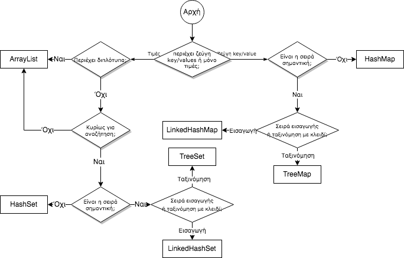

# 5.7 Άλλες Δομές Δεδομένων
© Γιάννης Κωστάρας

---

[<](../5.6-Maps/README.md) | [Δ](../../README.md) | [>](../5.8-Exercise/README.md)
 
---

[](5.7-OtherCollections.ipynb) 

### Μαθησιακοί στόχοι
Σε αυτήν την ενότητα θα μάθουμε:

* πώς να επιλέγουμε την κατάλληλη δομή δεδομένων για το πρόβλημά μας
* τις μη μεταβαλλόμενες (immutable) δομές
* για τις εξωτερικές βιβλιοθήκες που παρέχουν δομές δεδομένων:
  * Apache Commons Collection
  * Google Guava
  * Eclipse Collections
  
## Εισαγωγή
Πώς επιλέγουμε ποια δομή δεδομένων είναι κατάλληλη για το πρόβλημά μας; Την απάντηση δίνει το ακόλουθο διάγραμμα ροής.



**Εικόνα 5.7.1** _Ποιά δομή δεδομένων να επιλέξω;_

Οι συλλογές (Collections) που συζητήσαμε στα μαθήματα αυτής της εβδομάδας δεν είναι οι μόνες που υπάρχουν. Οι διάφορες κοινότητες προγραμματιστών έχουν δημιουργήσει μια σειρά από άλλες συλλογές που συμπληρώνουν αυτές τις γλώσσας, υπό μορφή βιβλιοθηκών. Προτού όμως δούμε τις διάφορες βιβλιοθήκες που συμπληρώνουν τις συλλογές που προσφέρει η γλώσσα, ας δούμε κάποιες χρήσιμες μεθόδους επικάλυψης (wrapper methods) που προσφέρει η κλάση ```Collections```.

## Μη μεταβαλλόμενες (immutable) δομές δεδομένων
Συχνά χρειάζεται να επιστρέψετε κάποια συλλογή από τις μεθόδους σας. Αν όμως επιστρέψετε την ίδια τη συλλογή, τότε παρέχετε στον κώδικα που καλεί τη μέθοδό σας τη διεύθυνση (reference) αυτής στη μνήμη, με αποτέλεσμα να μπορεί να την αλλάξει όπως επιθυμεί (τα αντικείμενα στη Java περνιώνται και επιστρέφονται από τις μεθόδους ως αναφορές μνήμης - by reference). Λέμε ότι η συλλογή σας "δραπετεύει (escape)" από την κλάση σας και ξένος κώδικας μπορεί να την αλλάξει όπως θέλει, πράγμα που μπορεί να αποβεί επικίνδυνο. Συνήθως, όταν μια μέθοδος επιστρέφει μια συλλογή, αυτό που ο καλών κώδικας θέλει είναι απλά να προσπελάσει τα στοιχεία της, κι όχι να τα τροποποιήσει. 

Η κλάση ```Collections``` περιλαμβάνει μια σειρά από στατικές μεθόδους επικάλυψης (wrapper methods) που μετατρέπουν τις συλλογές σε ανάγνωσης μόνο ώστε να μην υπάρχει κίνδυνος ξένος κώδικας να τις αλλάξει:

```java
jshell> Collections.unmodifiable
unmodifiableCollection(     unmodifiableList(           unmodifiableMap(            unmodifiableNavigableMap(   
unmodifiableNavigableSet(   unmodifiableSet(            unmodifiableSortedMap(      unmodifiableSortedSet(    
``` 

Έτσι, π.χ. αντί για:

```java
class CarDB {
   private final Set<Car> cars = new HashSet<>();
   //...

   public Set<Car> getSportCars() {
   		Set<Car> sportCars = new HashSet<>();
		for (Car car : cars) {
			if (car.getType() == CarType.SPORT) {
				sportCars.add(car);
			}
		}
   	 	return sportCars;
   }
}
```
συμβουλεύεται να χρησιμοποιείτε:

```java
public final Set<Car> getSportCars() {
	//...
	return Collections.unmodifiableSet(sportCars);
}
```
Ο καλών της μεθόδου ```getSportCars()``` δεν θα μπορεί πλέον να τροποποιήσει τα στοιχεία του ```Set``` που επιστρέφει η μέθοδος. Φυσικά, μπορείτε να χρησιμοποιήσετε και τις άλλες στατικές μεθόδους που μάθαμε αυτή την εβδομάδα, όπως ```of(), asList()``` και ```singleton()```.

## Apache Commons Collections
Το ίδρυμα Apache παρέχει παραδοσιακά πολλές χρήσιμες βιβλιοθήκες και προγράμματα ανοικτού κώδικα. Ακόμα και το NetBeans μεταπήδησε στο Apache. Η βιβλιοθήκη Commons Collections παρέχει:

* Χρήσιμα εργαλεία για τις συλλογές που παρέχει η γλώσσα Java
* Maps
   * Map Iteration
   * Ordered Maps
   * Bidirectional Maps
   * MultiMap
* Bags 

## Eclipse Collections
Ονομάζονταν GS Collections και πρόσφατα έγιναν δωρεάν στο ίδρυμα Eclipse. Παρέχει πολλές χρήσιμες συλλογές που συμπληρώνουν αυτές της Java.

## Google Guava
Η βιβλιοθήκη Guava περιλαμβάνει [συλλογές](https://github.com/google/guava/wiki/CollectionUtilitiesExplained) που συμπληρώνουν αυτές της Java.

## Πώς να τις χρησιμοποιήσετε στις εφαρμογές σας
Όπως μάθαμε στα μαθήματα της 2ης εβδομάδας, μπορούμε να χρησιμοποιήσουμε κλάσεις τρίτων μέσω βιβλιοθηκών (packages) ή αρθρωμάτων (modules).

### Έργα ant
Ας δούμε πώς μπορούμε να χρησιμοποιήσουμε π.χ. τα Apache Commons Collections στα προγράμματά μας. Κατ' αρχήν, κατεβάστε το ```commons-collections4-x.x-bin.zip``` από τον ιστοτόπο της Apache και αποσυμπιέστε το.

Δημιουργήστε ένα νέο έργο Java στο NetBeans. Στο 2ο βήμα του οδηγού δημιουργίας νέου έργου επιλέξτε **Use Dedicated Folder for Storing Libraries**. Το NetBeans θα δημιουργήσει ένα νέο φάκελο ```lib``` μέσα στο φάκελο του έργου όπου μπορείτε να προσθέσετε βιβλιοθήκες. 

Αφού δημιουργήσατε το νέο έργο, κάντε δεξί κλικ στο φάκελο ```Libraries``` από την προβολή **Projects** και επιλέξτε **Add JAR/Folder...**. Επιλέξτε το ```commons-collections4-x.x.jar``` και **Copy to Libraries Folder** και στη συνέχεια πατήστε το κουμπί **Choose**. Πλέον η βιβλιοθήκη είναι μέρος του έργου σας και έχει αντιγραφεί μέσα στο φάκελο ```lib```. Μπορείτε πλέον να εισάγετε τις κλάσεις της βιβλιοθήκης στον κώδικά σας, π.χ. ως εξής:
```java
import org.apache.commons.collections4.Bag;
```

### Έργα maven
Συνήθως οι διάφοροι ιστοτόποι σας παρέχουν οδηγίες για το πώς να προσθέσετε τις βιβλιοθήκες στο ```pom.xml``` αρχείο σας. Εναλλακτικά, κατευθυνθείτε στο [Maven central](https://mvnrepository.com/) και αναζητήστε τη βιβλιοθήκη που θέλετε, π.χ. ```apache commons collections```. Επιλέξτε την έκδοση που θέλετε ή την πιο τελευταία έκδοση και επικολλήστε τον κώδικα που σας εμφανίζει στο ```pom.xml``` αρχείο σας, μέσα στο ```<dependencies>...</dependencies>```, π.χ.

```xml
<!-- https://mvnrepository.com/artifact/org.apache.commons/commons-collections4 -->
<dependency>
    <groupId>org.apache.commons</groupId>
    <artifactId>commons-collections4</artifactId>
    <version>4.4</version>
</dependency>
```
Δώστε την εντολή ```mvn install``` για να κατεβάσει τη βιβλιοθήκη στο τοπικό σας αποθετήριο.

## Ασκήσεις
1. Στο 2ο μάθημα αυτής της εβδομάδας μάθαμε ότι δεν μπορούμε να μετατρέψουμε μια συλλογή σε μια συστοιχία πρωτογενούς τύπου με την ```toArray()``` (αν και όσοι παρακολουθήσετε τον κύκλο προχωρημένων μαθήματων Java υπάρχει ένας εύκολος τρόπος να το κάνετε αυτό με τη Java 8). Χρησιμοποιήστε είτε την ```Ints.toArray(Collection<Integer> collection)``` της βιβλιοθήκης Guava είτε την ```ArrayUtils.toPrimitive()``` της βιβλιοθήκης Apache Commons Lang για το επιτύχετε αυτό. 
	Ακολουθήστε τις οδηγίες που θα βρείτε [εδώ](https://stackoverflow.com/questions/43111018/how-to-import-external-libraries-in-jshell-java-9) για να χρησιμοποιήσετε βιβλιοθήκες στο jshell.
2. Επαναλάβετε την άσκηση 4 της προηγούμενης ενότητας χρησιμοποιώντας την κλάση [org.apache.commons.collections.map.LRUMap](https://commons.apache.org/proper/commons-collections/apidocs/org/apache/commons/collections4/map/LRUMap.html) (LRU = Least Recently Used). 

## Πηγές
1. [Apache Commons Collections](http://commons.apache.org/proper/commons-collections/)
1. [Eclipse Collections](https://www.eclipse.org/collections/)
1. [Google Guava](https://github.com/google/guava)

---

[<](../5.6-Maps/README.md) | [Δ](../../README.md) | [>](../5.8-Exercise/README.md)

---